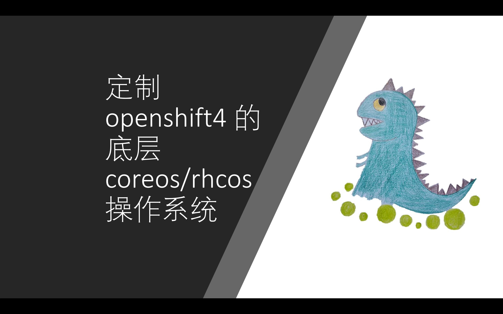
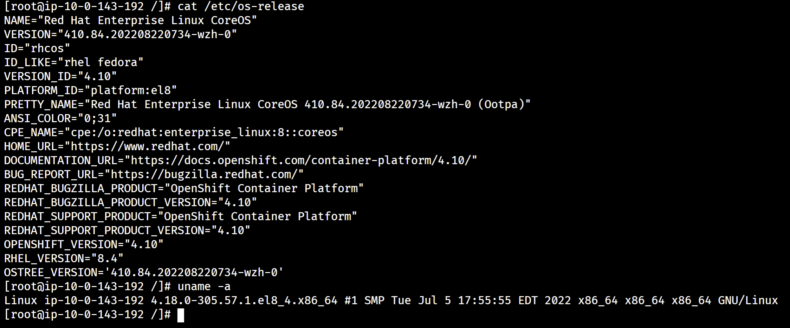
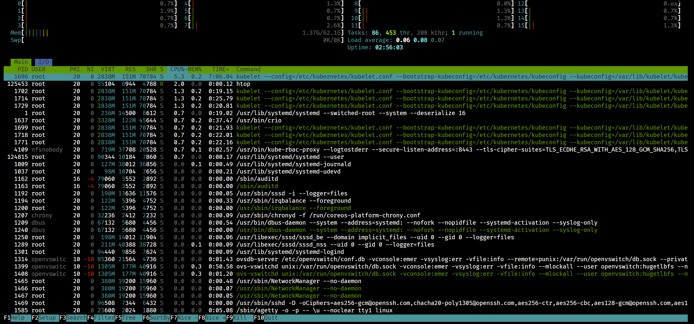

# customized coreos/rhcos for openshift4 / 定制 openshift4 的底层 coreos/rhcos 操作系统

我们做项目的时候，经常有对底层操作系统做修改的需求，比如
- 添加一些顺手的工具，如 htop, tcpdump, iperf 等，都是系统出故障的时候，排查用的利器
- 添加一些内核驱动程序，特别是我们有特殊的硬件插了进来，比如 DPU，GPU
- 我们有一些特殊的软件方案，需要在操作系统一层进行启动。

而 openshift4 设计的初衷，是云原生安全，于是把底层操作系统，使用 coreos / rhcos 的方式提供，并且 rhcos 官方没有定制化方法和文档。这种方法确实提高了 openshift4 的安全性，稳定性，和全局的一致性，但是项目中也确实遇到了很多尴尬。

本文就针对以上问题，摸索出了如何定制底层 rhcos ， 并且应用到 openshift4 之上的方法。其实这些方法，在 openshift 的 github 项目文档中都有，只不过之前没仔细研究罢了。

⚠️⚠️⚠️注意，本文所述方法，涉及到了以下问题，不能使用在生产环境中，只能作为 PoC 应急，或者研究学习之用。如果确实是项目急需，请和红帽GPS部门沟(gěi)通(qián)，获得支持。
- ⚠️编译需要多个 rhel 相关的特种源，而且还是 eus, tus 版本，这些都需要单独购买
- ⚠️编译需要一个红帽内部的 repo 源，属于红帽机密
- ⚠️自定义的 rhcos 不能得到红帽 CEE 支持

本次实验的架构图如下：


过程中，重度使用了 cosa , 这个是 coreos-assembler 工具集中的命令，他封装了一系列的工具，根据一个配置文件项目，来自动化的编译出来 coreos/rhcos 镜像。

## 视频讲解

[<kbd></kbd>](https://www.bilibili.com/video/BV1ud4y1d74C/)

- [bilibili](https://www.bilibili.com/video/BV1ud4y1d74C/)
- [youtube](https://youtu.be/cxS4l1fJcOM)

# 准备 dnf repo 源

注意，这些 repo 源都是需要特殊单独购买，请联系红帽销售和GPS服务部门。

```bash

# install a rhel on vultr

# disable user/passwd login
# ChallengeResponseAuthentication no
# PasswordAuthentication no
# UsePAM no
sed -i 's/PasswordAuthentication yes/PasswordAuthentication no/g' /etc/ssh/sshd_config
sed -i 's/UsePAM yes/UsePAM no/g' /etc/ssh/sshd_config

systemctl restart sshd

ssh root@v.redhat.ren -o PubkeyAuthentication=no
# root@v.redhat.ren: Permission denied (publickey,gssapi-keyex,gssapi-with-mic).

subscription-manager register --auto-attach --username ******** --password ********

# subscription-manager release --list
# subscription-manager release --set=8.4

# subscription-manager config --rhsm.baseurl=https://china.cdn.redhat.com

subscription-manager repos --list > list

subscription-manager repos \
    --enable="rhel-8-for-x86_64-baseos-rpms" \
    --enable="rhel-8-for-x86_64-appstream-rpms" \
    --enable="codeready-builder-for-rhel-8-x86_64-rpms" \
    # 

dnf -y install https://dl.fedoraproject.org/pub/epel/epel-release-latest-8.noarch.rpm

dnf install -y byobu htop

# byobu
dnf update -y

reboot

mkdir -p /data/dnf

# Create new empty partitions, and filesystem
parted -s /dev/vdb mklabel gpt
parted -s /dev/vdb unit mib mkpart primary 0% 100%

mkfs.ext4 /dev/vdb1

cat << EOF >> /etc/fstab
/dev/vdb1               /data/dnf      ext4    defaults,noatime,nofail 0 0
EOF

mount /dev/vdb1 /data/dnf

mkdir -p /data/dnf/dnf-ocp-4.10

cd /data/dnf/dnf-ocp-4.10

subscription-manager release --set=8.4

dnf reposync --repoid rhel-8-for-x86_64-baseos-eus-rpms -m --download-metadata --delete -n
dnf reposync --repoid=rhel-8-for-x86_64-appstream-eus-rpms -m --download-metadata --delete -n
dnf reposync --repoid=rhel-8-for-x86_64-nfv-tus-rpms -m --download-metadata --delete -n
dnf reposync --repoid=advanced-virt-for-rhel-8-x86_64-eus-rpms -m --download-metadata --delete -n
dnf reposync --repoid=fast-datapath-for-rhel-8-x86_64-rpms -m --download-metadata --delete -n

subscription-manager release --set=8

dnf -y install vsftpd

mkdir -p /var/ftp/dnf
mount --bind /data/dnf/dnf-ocp-4.10 /var/ftp/dnf
chcon -R -t public_content_t /var/ftp/dnf

sed -i "s/anonymous_enable=NO/anonymous_enable=YES/" /etc/vsftpd/vsftpd.conf

cat << EOF >> /etc/vsftpd/vsftpd.conf

pasv_enable=YES
pasv_max_port=10100
pasv_min_port=10090

EOF

systemctl disable --now firewalld
systemctl enable --now vsftpd
```

# 准备 build 服务器

注意，build 服务器需要支持 kvm ，如果选用的云平台，需要云平台支持嵌套虚拟化。

本次实验，我们选用了一台 centos stream 8 的云主机。

```bash
# install a centos stream 8 on digitalocean, 
# 2c 2G for ostree only
# 4c 8G for iso because it needs metal first

dnf install -y epel-release

dnf install -y byobu htop

dnf update -y

reboot

dnf groupinstall -y server

dnf install -y lftp podman

dnf -y install qemu-kvm libvirt libguestfs-tools virt-install virt-viewer virt-manager tigervnc-server

systemctl disable --now firewalld
systemctl enable --now libvirtd
```

# 开始编译 rhcos

cosa 的输入是一个配置文件项目，上游是 https://github.com/openshift/os ， 我们把操作系统名字，加入了 wzh 的标记，并且添加了 htop, tcpdump, iperf3 这几个常用的排错命令，作为演示。

```bash
# machine-os-images just copy a iso into container
# machine-os-content is our target

# follow coreos-assembler instruction
# https://github.com/coreos/coreos-assembler/blob/main/docs/building-fcos.md
# https://coreos.github.io/coreos-assembler/
# https://github.com/openshift/os/blob/master/docs/development-rhcos.md
# https://github.com/openshift/os/blob/master/docs/development.md

# https://github.com/openshift/os/blob/master/docs/development.md
# https://github.com/openshift/release/blob/master/core-services/release-controller/README.md#rpm-mirrors

export COREOS_ASSEMBLER_CONTAINER=quay.io/coreos-assembler/coreos-assembler:rhcos-4.10
# export COREOS_ASSEMBLER_CONTAINER=quay.io/coreos-assembler/coreos-assembler:latest
podman pull $COREOS_ASSEMBLER_CONTAINER

podman login ************* quay.io

cosa() {
   env | grep COREOS_ASSEMBLER
   local -r COREOS_ASSEMBLER_CONTAINER_LATEST="quay.io/coreos-assembler/coreos-assembler:latest"
   if [[ -z ${COREOS_ASSEMBLER_CONTAINER} ]] && $(podman image exists ${COREOS_ASSEMBLER_CONTAINER_LATEST}); then
       local -r cosa_build_date_str="$(podman inspect -f "{{.Created}}" ${COREOS_ASSEMBLER_CONTAINER_LATEST} | awk '{print $1}')"
       local -r cosa_build_date="$(date -d ${cosa_build_date_str} +%s)"
       if [[ $(date +%s) -ge $((cosa_build_date + 60*60*24*7)) ]] ; then
         echo -e "\e[0;33m----" >&2
         echo "The COSA container image is more that a week old and likely outdated." >&2
         echo "You should pull the latest version with:" >&2
         echo "podman pull ${COREOS_ASSEMBLER_CONTAINER_LATEST}" >&2
         echo -e "----\e[0m" >&2
         sleep 10
       fi
   fi
   set -x
   podman run --rm -ti --security-opt label=disable --privileged                                    \
              --uidmap=1000:0:1 --uidmap=0:1:1000 --uidmap 1001:1001:64536                          \
              -v ${PWD}:/srv/ --device /dev/kvm --device /dev/fuse                                  \
              -v /run/user/0/containers/auth.json:/home/builder/.docker/config.json                      \
              --tmpfs /tmp -v /var/tmp:/var/tmp --name cosa                                         \
              ${COREOS_ASSEMBLER_CONFIG_GIT:+-v $COREOS_ASSEMBLER_CONFIG_GIT:/srv/src/config/:ro}   \
              ${COREOS_ASSEMBLER_GIT:+-v $COREOS_ASSEMBLER_GIT/src/:/usr/lib/coreos-assembler/:ro}  \
              ${COREOS_ASSEMBLER_CONTAINER_RUNTIME_ARGS}                                            \
              ${COREOS_ASSEMBLER_CONTAINER:-$COREOS_ASSEMBLER_CONTAINER_LATEST} "$@"
   rc=$?; set +x; return $rc
}

mkdir -p /data/rhcos
cd /data/rhcos

cosa init --branch wzh-ocp-4.10 https://github.com/wangzheng422/machine-os-content

sed -i 's/REPO_IP/v.redhat.ren/g' /data/rhcos/src/config/wzh.repo

cosa fetch

cosa build ostree
# ......
# Ignored user missing from new passwd file: root
# New passwd entries: clevis, dnsmasq, gluster, systemd-coredump, systemd-journal-remote, systemd-resolve, tcpdump, unbound
# Ignored group missing from new group file: root
# New group entries: clevis, dnsmasq, gluster, input, kvm, printadmin, render, systemd-coredump, systemd-journal-remote, systemd-resolve, tcpdump, unbound
# Committing... done
# Metadata Total: 10907
# Metadata Written: 3721
# Content Total: 6584
# Content Written: 1344
# Content Cache Hits: 22043
# Content Bytes Written: 328474751
# 3721 metadata, 24647 content objects imported; 2.4 GB content written
# Wrote commit: 12876365301ad8f07ecf89b4fbe184f000a0816c895c6659ebc6822ef9c18ff7
# New image input checksum: 05e3c499a794b62d22ba12d8d73404ce5970d24b4f7a664b71d17c5cf50ccd4c
# None
# New build ID: 410.84.wzh.202208220647-0
# sha256:fa305389ffa50b73e259000d8f21753049de7e4c217c12df470798d34bd4b209
# Total objects: 28612
# No unreachable objects
# Ignoring non-directory /srv/builds/.build-commit
# + rc=0
# + set +x

# or build with default setting, ostree and qcow2
# cosa build

cosa list
# 410.84.wzh.202208220647-0
#    Timestamp: 2022-08-22T06:59:55Z (0:02:49 ago)
#    Artifacts: ostree
#       Config: wzh-ocp-4.10 (16c263bb4b5c) (dirty)

cosa upload-oscontainer --name "quay.io/wangzheng422/ocp"
# quay.io/wangzheng422/ocp:410.84.202208220734-wzh-0 afbdcfab3ffa897842f181505897e6b448f40e961014f74d94996e0589934b7e

cosa buildextend-metal
# ......
# + cosa meta --workdir /srv --build 410.84.202208221336-wzh-0 --artifact metal --artifact-json /srv/tmp/build.metal/meta.json.new
# /srv/builds/410.84.202208221336-wzh-0/x86_64/meta.json wrote with version stamp 1661176393037675276
# + /usr/lib/coreos-assembler/finalize-artifact rhcos-410.84.202208221336-wzh-0-metal.x86_64.raw /srv/builds/410.84.202208221336-wzh-0/x86_64/rhcos-410.84.202208221336-wzh-0-metal.x86_64.raw
# + set +x
# Successfully generated: rhcos-410.84.202208221336-wzh-0-metal.x86_64.raw

cosa buildextend-metal4k
# ......
# + cosa meta --workdir /srv --build 410.84.202208221336-wzh-0 --artifact metal4k --artifact-json /srv/tmp/build.metal4k/meta.json.new
# /srv/builds/410.84.202208221336-wzh-0/x86_64/meta.json wrote with version stamp 1661176647683428498
# + /usr/lib/coreos-assembler/finalize-artifact rhcos-410.84.202208221336-wzh-0-metal4k.x86_64.raw /srv/builds/410.84.202208221336-wzh-0/x86_64/rhcos-410.84.202208221336-wzh-0-metal4k.x86_64.raw
# + set +x
# Successfully generated: rhcos-410.84.202208221336-wzh-0-metal4k.x86_64.raw

cosa buildextend-live
# ......
# Writing:   Extension record                        Start Block 43
# Done with: Extension record                        Block(s)    1
# Writing:   The File(s)                             Start Block 44
#   9.70% done, estimate finish Mon Aug 22 14:14:12 2022
#  19.36% done, estimate finish Mon Aug 22 14:14:12 2022
#  29.05% done, estimate finish Mon Aug 22 14:14:12 2022
#  38.71% done, estimate finish Mon Aug 22 14:14:12 2022
#  48.40% done, estimate finish Mon Aug 22 14:14:12 2022
#  58.06% done, estimate finish Mon Aug 22 14:14:12 2022
#  67.75% done, estimate finish Mon Aug 22 14:14:12 2022
#  77.41% done, estimate finish Mon Aug 22 14:14:12 2022
#  87.10% done, estimate finish Mon Aug 22 14:14:12 2022
#  96.78% done, estimate finish Mon Aug 22 14:14:12 2022
# Total translation table size: 2048
# Total rockridge attributes bytes: 2838
# Total directory bytes: 12288
# Path table size(bytes): 96
# Done with: The File(s)                             Block(s)    51483
# Writing:   Ending Padblock                         Start Block 51527
# Done with: Ending Padblock                         Block(s)    150
# Max brk space used 24000
# 51677 extents written (100 MB)
# + /usr/bin/isohybrid --uefi /srv/tmp/buildpost-live/rhcos-410.84.202208221336-wzh-0-live.x86_64.iso.minimal
# + isoinfo -lR -i /srv/tmp/buildpost-live/rhcos-410.84.202208221336-wzh-0-live.x86_64.iso
# Embedded 262144 bytes Ignition config space at 4872192
# + coreos-installer iso extract pack-minimal-iso /srv/tmp/buildpost-live/rhcos-410.84.202208221336-wzh-0-live.x86_64.iso /srv/tmp/buildpost-live/rhcos-410.84.202208221336-wzh-0-live.x86_64.iso.minimal --consume
# Packing minimal ISO
# Matched 17 files of 17
# Total bytes skipped: 105419322
# Total bytes written: 486854
# Total bytes written (compressed): 2808
# Verifying that packed image matches digest
# Packing successful!
# Updated: builds/410.84.202208221336-wzh-0/x86_64/meta.json

# Create a new release and override a single image
oc adm release new -a /data/pull-secret.json \
  --from-release quay.io/openshift-release-dev/ocp-release@sha256:2127608ebd67a2470860c42368807a0de2308dba144ec4c298bec1c03d79cb52 \
  machine-os-content=quay.io/wangzheng422/ocp:410.84.202208220734-wzh-0 \
  --to-image docker.io/wangzheng422/ocp:4.10-demo

oc image mirror docker.io/wangzheng422/ocp:4.10-demo quay.io/wangzheng422/ocp:4.10-demo

oc adm release info quay.io/wangzheng422/ocp:4.10-demo --commit-urls=true
# Name:      4.10.28
# Digest:    sha256:57add9e36d950ea7eacfe8704279573952cfbed3192449b7cdcc8a72c4d28921
# Created:   2022-08-22T08:13:38Z
# OS/Arch:   linux/amd64
# Manifests: 544

# Pull From: quay.io/wangzheng422/ocp@sha256:57add9e36d950ea7eacfe8704279573952cfbed3192449b7cdcc8a72c4d28921

# Release Metadata:
#   Version:  4.10.28
#   Upgrades: 4.9.19, 4.9.21, 4.9.22, 4.9.23, 4.9.24, 4.9.25, 4.9.26, 4.9.27, 4.9.28, 4.9.29, 4.9.30, 4.9.31, 4.9.32, 4.9.33, 4.9.34, 4.9.35, 4.9.36, 4.9.37, 4.9.38, 4.9.39, 4.9.40, 4.9.41, 4.9.42, 4.9.43, 4.9.44, 4.9.45, 4.9.46, 4.10.3, 4.10.4, 4.10.5, 4.10.6, 4.10.7, 4.10.8, 4.10.9, 4.10.10, 4.10.11, 4.10.12, 4.10.13, 4.10.14, 4.10.15, 4.10.16, 4.10.17, 4.10.18, 4.10.20, 4.10.21, 4.10.22, 4.10.23, 4.10.24, 4.10.25, 4.10.26, 4.10.27
#   Metadata:
#     url: https://access.redhat.com/errata/RHBA-2022:6095

# Component Versions:
#   kubernetes 1.23.5
#   machine-os 410.84.202208220734-wzh-0 Red Hat Enterprise Linux CoreOS

# Images:
#   NAME                                           URL
#   alibaba-cloud-controller-manager               https://github.com/openshift/cloud-provider-alibaba-cloud/commit/db2d118ad70ff62a2111e83a8d14c5b32e176b38
#   alibaba-cloud-csi-driver                       https://github.com/openshift/alibaba-cloud-csi-driver/commit/3ddbb2b9d4994206183b5ffd6a0872ad9a5ce193
#   alibaba-disk-csi-driver-operator               https://github.com/openshift/alibaba-disk-csi-driver-operator/commit/f0d6966321e3d416efec2ac7405494b057cb35f8
#   alibaba-machine-controllers                    https://github.com/openshift/cluster-api-provider-alibaba/commit/0206121348c9a0d220dd6805cea79d1eae7fd3e0
# ......
```

# 应用到 openshift4

我们编译好了 rhcos， 那么怎么应用到 openshift4 集群上呢，一般来说，有3种办法，[github上有文章写](https://github.com/openshift/os/blob/master/docs/faq.md#q-how-do-i-upgrade-the-os)，笔者认为，直接集群级别强制升级最简单。当然，不同项目，不同情况，需要根据情况分析。

## 直接强制升级

```bash
# test upgrade
oc adm upgrade \
  --to-image=quay.io/wangzheng422/ocp@sha256:57add9e36d950ea7eacfe8704279573952cfbed3192449b7cdcc8a72c4d28921 \
  --allow-explicit-upgrade --allow-upgrade-with-warnings=true --force=true 

# after cluster upgrade
# check the os-release
cat /etc/os-release 
# NAME="Red Hat Enterprise Linux CoreOS"
# VERSION="410.84.202208220734-wzh-0"
# ID="rhcos"
# ID_LIKE="rhel fedora"
# VERSION_ID="4.10"
# PLATFORM_ID="platform:el8"
# PRETTY_NAME="Red Hat Enterprise Linux CoreOS 410.84.202208220734-wzh-0 (Ootpa)"
# ANSI_COLOR="0;31"
# CPE_NAME="cpe:/o:redhat:enterprise_linux:8::coreos"
# HOME_URL="https://www.redhat.com/"
# DOCUMENTATION_URL="https://docs.openshift.com/container-platform/4.10/"
# BUG_REPORT_URL="https://bugzilla.redhat.com/"
# REDHAT_BUGZILLA_PRODUCT="OpenShift Container Platform"
# REDHAT_BUGZILLA_PRODUCT_VERSION="4.10"
# REDHAT_SUPPORT_PRODUCT="OpenShift Container Platform"
# REDHAT_SUPPORT_PRODUCT_VERSION="4.10"
# OPENSHIFT_VERSION="4.10"
# RHEL_VERSION="8.4"
# OSTREE_VERSION='410.84.202208220734-wzh-0'
```
以下是截屏，这里是 os-release， 可以看到有 wzh 的标记：



这里是在 rhcos 上直接运行 htop 的界面：



# analyze the content 

我们可以 dump 这个 machine-os-content 的内容出来仔细分析。

```bash

export BUILDNUMBER=4.10.28

wget -O openshift-client-linux-${BUILDNUMBER}.tar.gz https://mirror.openshift.com/pub/openshift-v4/clients/ocp/${BUILDNUMBER}/openshift-client-linux-${BUILDNUMBER}.tar.gz
wget -O openshift-install-linux-${BUILDNUMBER}.tar.gz https://mirror.openshift.com/pub/openshift-v4/clients/ocp/${BUILDNUMBER}/openshift-install-linux-${BUILDNUMBER}.tar.gz

tar -xzf openshift-client-linux-${BUILDNUMBER}.tar.gz -C /usr/local/sbin/
tar -xzf openshift-install-linux-${BUILDNUMBER}.tar.gz -C /usr/local/sbin/

mkdir -p /data/ostree
cd /data/ostree

oc image extract --path /:/data/ostree --registry-config /run/user/0/containers/auth.json quay.io/wangzheng422/ocp:410.84.wzh.202208211552-0

```

# end