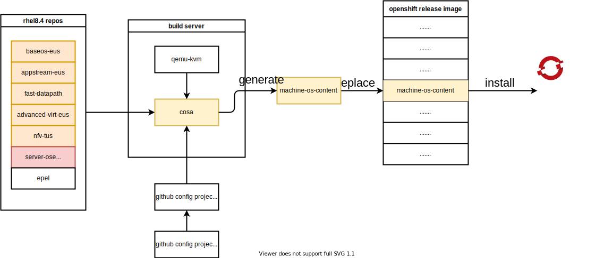

# upgrade openshift 4.10 based rhcos to rhel 9.1 / 升级 openshift 4.10 基础操作系统到 rhel 9.1 支持海光x86 cpu

我们项目中，要求openshift支持海光x86 cpu，linux kernel大概是在4.20以后，合并了对海光x86 cpu支持的代码。但是当前版本的openshift(<4.12)都是基于rhel8的，rhel8的内核是基于4.18版本改造而来，还没有海光x86 cpu的支持。

好在redhat已经推出了rhel9, 是基于kernel 5.14的，经过实际测试，rhel9.1是能在海光x86 cpu上正常安装和运行的，那么我们就来试试，把openshift 4.10的底层操作系统rhcos，升级到rhel9.1的内核。

In our project, openshift is required to support Hygon x86 cpu, and the linux kernel is probably after 4.20, which merged the code supporting Hygon x86 cpu. However, the current version of openshift (<4.12) is based on rhel8, and the kernel of rhel8 is modified based on version 4.18, and there is no support for Hygon x86 cpu.

Fortunately, redhat has launched rhel9, which is based on kernel 5.14. After actual testing, rhel9.1 can be installed and run normally on Hygon x86 cpu, so let's try it and use rhcos, the underlying operating system of openshift 4.10, Upgrade to rhel9.1 kernel.

⚠️⚠️⚠️注意，本文所述方法，涉及到了以下问题，不能使用在生产环境中，只能作为 PoC 应急，或者研究学习之用。如果确实是项目急需，请和红帽GPS部门沟(gěi)通(qián)，获得支持。
- ⚠️编译需要多个 rhel 相关的特种源，而且还是 eus, tus 版本，这些都需要单独购买
- ⚠️编译需要一个红帽内部的 repo 源，属于红帽机密
- ⚠️自定义的 rhcos 不能得到红帽 CEE 支持

⚠️⚠️⚠️ Note that the method described in this article involves the following issues and cannot be used in a production environment. It can only be used as a PoC emergency or for research and learning. If it is really urgent for the project, please communicate with the Red Hat GPS department for support.
- ⚠️ Compilation requires multiple rhel-related special sources, and they are also eus and tus versions, which need to be purchased separately
- ⚠️ Compilation requires a Red Hat internal repo source, which is Red Hat Confidential
- ⚠️ Custom rhcos cannot be supported by Red Hat CEE

本次实验的架构图如下： The architecture diagram of this experiment is as follows:



过程中，重度使用了 cosa , 这个是 coreos-assembler 工具集中的命令，他封装了一系列的工具，根据一个配置文件项目，来自动化的编译出来 coreos/rhcos 镜像。

In the process, cosa is heavily used, which is a command in the coreos-assembler tool set. It encapsulates a series of tools and automatically compiles the coreos/rhcos image according to a configuration file project.

## 编译成果 / compiling result

以下是编译成果 / The following is the compiling result
- openshift4.10.41 release image
  - quay.io/wangzheng422/ocp:4.10.41-rhel-9.1-v02
- openshift4.10.41 os images
  - 百度分享 / baidu sharing: https://pan.baidu.com/s/16_T72CqQeS2rLJ4MzW4dEQ?pwd=zpbg  

⚠️⚠️⚠️ 另外，编译成果并没有严格测试，还需要客户根据自己的场景，完善的测试以后，才可以使用。

⚠️⚠️⚠️ In addition, the compilation results have not been strictly tested, and customers need to complete the test according to their own scenarios before they can be used.

## 视频讲解 / Video explanation

[<kbd></kbd>](https://www.bilibili.com/video/BV18R4y1y7EX/)

- [bilibili](https://www.bilibili.com/video/BV18R4y1y7EX/)
- [youtube](https://youtu.be/pYCbab7s_mI)

# 准备 dnf repo 源 / Prepare the dnf repo source

注意，这些 repo 源都是需要特殊单独购买，请联系红帽销售和GPS服务部门。

Note that these repo sources are required to be purchased separately, please contact Red Hat Sales and GPS Services.

## rhel 9.1

我们首先要做的，是准备一个rhel9.1的rpm repo，这里有准备步骤。很遗憾，其中有几个openshift专用的repo，是不公开的。如果客户必须要这些repo的访问权限，请联系对口的SA，在公司内部申请试试。

```bash

# install a rhel on vultr

# disable user/passwd login
# ChallengeResponseAuthentication no
# PasswordAuthentication no
# UsePAM no
# sed -i 's/PasswordAuthentication yes/PasswordAuthentication no/g' /etc/ssh/sshd_config
# sed -i 's/UsePAM yes/UsePAM no/g' /etc/ssh/sshd_config

cat << EOF > /etc/ssh/sshd_config.d/99-wzh.conf
PasswordAuthentication no
UsePAM no
EOF

systemctl restart sshd

ssh root@v.redhat.ren -o PubkeyAuthentication=no
# root@v.redhat.ren: Permission denied (publickey,gssapi-keyex,gssapi-with-mic).

subscription-manager register --auto-attach --username ******** --password ********

# subscription-manager release --list
# subscription-manager release --set=8.4

# subscription-manager config --rhsm.baseurl=https://china.cdn.redhat.com

subscription-manager repos --list > list

subscription-manager repos \
    --enable="rhel-9-for-x86_64-baseos-rpms" \
    --enable="rhel-9-for-x86_64-appstream-rpms" \
    --enable="codeready-builder-for-rhel-9-x86_64-rpms" \
    # 

dnf -y install https://dl.fedoraproject.org/pub/epel/epel-release-latest-9.noarch.rpm

dnf install -y htop createrepo_c

dnf install -y https://download-ib01.fedoraproject.org/pub/epel/8/Everything/x86_64/Packages/b/byobu-5.133-1.el8.noarch.rpm

# byobu
dnf update -y

reboot

mkdir -p /data/dnf

# Create new empty partitions, and filesystem
parted -s /dev/vdb mklabel gpt
parted -s /dev/vdb unit mib mkpart primary 0% 100%

mkfs.ext4 /dev/vdb1

cat << EOF >> /etc/fstab
/dev/vdb1               /data/dnf      ext4    defaults,noatime,nofail 0 0
EOF

mount /dev/vdb1 /data/dnf

mkdir -p /data/dnf/dnf-ocp

cd /data/dnf/dnf-ocp

# subscription-manager release --set=9.0

# dnf reposync --repoid rhel-9-for-x86_64-baseos-eus-rpms -m --download-metadata --delete -n
# dnf reposync --repoid=rhel-9-for-x86_64-appstream-eus-rpms -m --download-metadata --delete -n
dnf reposync --repoid rhel-9-for-x86_64-baseos-rpms -m --download-metadata --delete -n
dnf reposync --repoid=rhel-9-for-x86_64-appstream-rpms -m --download-metadata --delete -n
dnf reposync --repoid=rhel-9-for-x86_64-nfv-rpms -m --download-metadata --delete -n
# dnf reposync --repoid=advanced-virt-for-rhel-8-x86_64-eus-rpms -m --download-metadata --delete -n
dnf reposync --repoid=fast-datapath-for-rhel-9-x86_64-rpms -m --download-metadata --delete -n

subscription-manager release --set=9

# fix for coreos-installer version
mkdir -p /data/dnf/dnf-ocp/fixes
cd /data/dnf/dnf-ocp/fixes
# dnf download --resolve --alldeps coreos-installer coreos-installer-bootinfra
dnf download --resolve coreos-installer coreos-installer-bootinfra selinux-policy
createrepo ./

# username, and password is confidensial
cat << 'EOF' > /etc/yum.repos.d/ose.repo
[rhel-8-server-ose]
name=rhel-8-server-ose
enabled=1
gpgcheck=0
baseurl=https://mirror.openshift.com/enterprise/reposync/4.10/rhel-8-server-ose-rpms/
module_hotfixes=true
username=??????
password=??????

[rhel-9-server-ose]
name=rhel-9-server-ose
enabled=1
gpgcheck=0
baseurl=https://mirror.openshift.com/enterprise/reposync/4.13/rhel-9-server-ose-rpms/
module_hotfixes=true
username=??????
password=??????

[rhel-9-server-ironic]
name=rhel-9-server-ironic
enabled=1
gpgcheck=0
baseurl=https://mirror.openshift.com/enterprise/reposync/4.13/rhel-9-server-ironic-rpms/
module_hotfixes=true
username=??????
password=??????
EOF

dnf reposync --repoid=rhel-8-server-ose -m --download-metadata --delete -n
dnf reposync --repoid=rhel-9-server-ose -m --download-metadata --delete -n
dnf reposync --repoid=rhel-9-server-ironic -m --download-metadata --delete -n

systemctl disable --now firewalld

# host the repo with web service
cd /data/dnf/dnf-ocp
python3 -m http.server 5180

```

# 准备 build 服务器 / Prepare the build server

注意，build 服务器需要支持 kvm ，如果选用的云平台，需要云平台支持嵌套虚拟化。

本次实验，我们选用了一台 centos stream 8 的云主机。

Note that the build server needs to support kvm. If you choose a cloud platform, the cloud platform needs to support nested virtualization.

In this experiment, we chose a cloud host of centos stream 8.

```bash
# install a centos stream 8 on digitalocean, 
# 2c 2G for ostree only
# 4c 8G for iso because it needs metal first

dnf install -y epel-release

dnf install -y byobu htop

dnf update -y

reboot

dnf groupinstall -y server

dnf install -y lftp podman

dnf -y install qemu-kvm libvirt libguestfs-tools virt-install virt-viewer virt-manager tigervnc-server

systemctl disable --now firewalld

systemctl enable --now libvirtd

```

# 开始编译 rhcos / Start compiling rhcos

cosa 的输入是一个配置文件项目，上游是 https://github.com/openshift/os ， 我们做了下游扩展，加入了各种repo源，并且把操作系统名字，加入了 wzh 的标记。  

The input of cosa is a configuration file project, and the upstream is https://github.com/openshift/os. We made downstream extensions, added the rpm repo source, added the operating system name, added the wzh mark.

```bash
# machine-os-images just copy a iso into container
# machine-os-content is our target

# follow coreos-assembler instruction
# https://github.com/coreos/coreos-assembler/blob/main/docs/building-fcos.md
# https://coreos.github.io/coreos-assembler/
# https://github.com/openshift/os/blob/master/docs/development-rhcos.md
# https://github.com/openshift/os/blob/master/docs/development.md

# https://github.com/openshift/os/blob/master/docs/development.md
# https://github.com/openshift/release/blob/master/core-services/release-controller/README.md#rpm-mirrors

podman login ************* quay.io

# export COREOS_ASSEMBLER_CONTAINER=quay.io/coreos-assembler/coreos-assembler:rhcos-4.12
export COREOS_ASSEMBLER_CONTAINER=quay.io/coreos-assembler/coreos-assembler:latest
podman pull $COREOS_ASSEMBLER_CONTAINER

cosa() {
   env | grep COREOS_ASSEMBLER
   local -r COREOS_ASSEMBLER_CONTAINER_LATEST="quay.io/coreos-assembler/coreos-assembler:latest"
   if [[ -z ${COREOS_ASSEMBLER_CONTAINER} ]] && $(podman image exists ${COREOS_ASSEMBLER_CONTAINER_LATEST}); then
       local -r cosa_build_date_str="$(podman inspect -f "{{.Created}}" ${COREOS_ASSEMBLER_CONTAINER_LATEST} | awk '{print $1}')"
       local -r cosa_build_date="$(date -d ${cosa_build_date_str} +%s)"
       if [[ $(date +%s) -ge $((cosa_build_date + 60*60*24*7)) ]] ; then
         echo -e "\e[0;33m----" >&2
         echo "The COSA container image is more that a week old and likely outdated." >&2
         echo "You should pull the latest version with:" >&2
         echo "podman pull ${COREOS_ASSEMBLER_CONTAINER_LATEST}" >&2
         echo -e "----\e[0m" >&2
         sleep 10
       fi
   fi
   set -x
   podman run --rm -ti --security-opt label=disable --privileged                                    \
              --uidmap=1000:0:1 --uidmap=0:1:1000 --uidmap 1001:1001:64536                          \
              -v ${PWD}:/srv/ --device /dev/kvm --device /dev/fuse                                  \
              -v /run/user/0/containers/auth.json:/home/builder/.docker/config.json                      \
              --tmpfs /tmp -v /var/tmp:/var/tmp --name cosa                                         \
              ${COREOS_ASSEMBLER_CONFIG_GIT:+-v $COREOS_ASSEMBLER_CONFIG_GIT:/srv/src/config/:ro}   \
              ${COREOS_ASSEMBLER_GIT:+-v $COREOS_ASSEMBLER_GIT/src/:/usr/lib/coreos-assembler/:ro}  \
              ${COREOS_ASSEMBLER_CONTAINER_RUNTIME_ARGS}                                            \
              ${COREOS_ASSEMBLER_CONTAINER:-$COREOS_ASSEMBLER_CONTAINER_LATEST} "$@"
   rc=$?; set +x; return $rc
}

rm -rf /data/rhcos
mkdir -p /data/rhcos
cd /data/rhcos

# cosa init --branch wzh-ocp-4.8-rhel-9.1 https://github.com/wangzheng422/machine-os-content

cosa init \
      --branch wzh-ocp-4.10-based-on-4.13-rhel-9 \
      --variant rhel-coreos-9 \
      https://github.com/wangzheng422/machine-os-content

sed -i 's/REPO_IP/45.77.125.88:5180/g' /data/rhcos/src/config/rhel-9.0.repo

cosa fetch

# cosa build ostree
# ......
# Ignored user missing from new passwd file: root
# New passwd entries: clevis, dnsmasq, gluster, systemd-coredump, systemd-journal-remote, unbound
# Ignored group missing from new group file: root
# New group entries: clevis, dnsmasq, gluster, input, kvm, printadmin, render, systemd-coredump, systemd-journal-remote, unbound
# Committing... done
# Metadata Total: 9777
# Metadata Written: 3156
# Content Total: 6635
# Content Written: 1456
# Content Cache Hits: 19307
# Content Bytes Written: 149555523
# 3156 metadata, 22414 content objects imported; 2.0 GB content written
# Wrote commit: 9c9831a17f276a55d263c7856aa61af722ec84d9780405018ac46b3c2c7aa5d6
# New image input checksum: 9062762601fde9b726033297ef1c442589066328334c88268d3952dcf1014826
# None
# New build ID: 48.90.202211260320-wzh-0
# Running:  rpm-ostree compose container-encapsulate --max-layers=50 --format-version=1 --repo=/srv/tmp/repo --label=coreos-assembler.image-config-checksum=e748dfefac80583a123d35bfdfe87fcce2c2757f15d8251e8482d1aeb7e4b7a0 --label=coreos-assembler.image-input-checksum=9062762601fde9b726033297ef1c442589066328334c88268d3952dcf1014826 --label=org.opencontainers.image.source=https://github.com/wangzheng422/machine-os-content --label=org.opencontainers.image.revision=331baaa292509c237e8647b598a9768aefbb984d 48.90.202211260320-wzh-0 oci-archive:rhcos-48.90.202211260320-wzh-0-ostree.x86_64.ociarchive.tmp:latest
# Reading packages... done
# Building package mapping... done
# 22414 objects in 511 packages (332 source)
# rpm size: 1978859148
# Earliest changed package: nss-altfiles-2.18.1-20.el9.x86_64 at 2021-08-02 15:39:20 UTC
# 1488 duplicates
# Multiple owners:
#   /usr/lib/.build-id/93/1521a98c6e8ca8485e3508ac3ee12e7a0bb233
#   /usr/lib/.build-id/fb/c60f5edbc2853811a813d9fb404cdaddfaf70a
#   /usr/share/licenses/systemd/LICENSE.LGPL2.1
# Generating container image... done
# Pushed digest: sha256:95ea1eeff653f2ec7ee9a3826978cbe5cadad2e9894d76edffb6a425892fdbab
# Total objects: 25866
# No unreachable objects
# Ignoring non-directory /srv/builds/.build-commit
# + rc=0
# + set +x

# or build with default setting, ostree and qcow2
cosa build
# ......
# + cosa meta --workdir /srv --build 48.90.202211270909-wzh-0 --artifact qemu --artifact-json /srv/tmp/build.qemu/meta.json.new
# /srv/builds/48.90.202211270909-wzh-0/x86_64/meta.json wrote with version stamp 1669540779194835967
# + /usr/lib/coreos-assembler/finalize-artifact rhcos-48.90.202211270909-wzh-0-qemu.x86_64.qcow2 /srv/builds/48.90.202211270909-wzh-0/x86_64/rhcos-48.90.202211270909-wzh-0-qemu.x86_64.qcow2
# + set +x
# Successfully generated: rhcos-48.90.202211270909-wzh-0-qemu.x86_64.qcow2

cosa list
# 48.90.202211270909-wzh-0
#    Timestamp: 2022-11-27T09:14:21Z (0:05:40 ago)
#    Artifacts: ostree qemu
#       Config: wzh-ocp-4.8-based-on-4.13-rhel-9.0 (64094f653298) (dirty)

cosa upload-oscontainer --name "quay.io/wangzheng422/ocp"
# ......
# 2022-11-27 09:22:35,785 INFO - Running command: ['ostree', '--repo=/srv/tmp/containers-storage/vfs/dir/da857426a657461466a3d17f4faa848f71a9a311b2fec5165946adabf5ea3900/srv/repo', 'pull-local', '--disable-fsync', '/srv/tmp/repo', '3c009c9794dc1deea6b419e84e56d17247954d236777842de59abef6ef82658f']
# Writing objects: 55
# 2022-11-27 09:22:41,424 INFO - Running command: ['tar', '-xf', '/srv/builds/48.90.202211270909-wzh-0/x86_64/rhcos-48.90.202211270909-wzh-0-extensions.x86_64.tar']
# 2022-11-27 09:22:41,665 INFO - Running command: ['buildah', '--root=./tmp/containers-storage', '--storage-driver', 'vfs', 'config', '--entrypoint', '["/noentry"]', '-l', 'com.coreos.ostree-commit=3c009c9794dc1deea6b419e84e56d17247954d236777842de59abef6ef82658f', '-l', 'version=48.90.202211270909-wzh-0', '-l', 'com.coreos.rpm.cri-o=1.25.0-53.rhaos4.12.git2002c49.el9.x86_64', '-l', 'com.coreos.rpm.ignition=2.13.0-1.el9.x86_64', '-l', 'com.coreos.rpm.kernel=5.14.0-70.30.1.el9_0.x86_64', '-l', 'com.coreos.rpm.ostree=2022.5-1.el9_0.x86_64', '-l', 'com.coreos.rpm.rpm-ostree=2022.2-2.el9.x86_64', '-l', 'com.coreos.rpm.runc=4:1.1.3-2.el9_0.x86_64', '-l', 'com.coreos.rpm.systemd=250-6.el9_0.1.x86_64', '-l', 'com.coreos.coreos-assembler-commit=538402ec655961f7a79e9745c9a3af67e1123e39', '-l', 'com.coreos.redhat-coreos-commit=64094f6532982cd2118224785b88ba2890659aee', '-l', 'com.coreos.os-extensions=kerberos;kernel-devel;kernel-rt;usbguard;sandboxed-containers', '-l', 'com.coreos.rpm.kernel=5.14.0-70.30.1.el9_0.x86_64', '-l', 'com.coreos.rpm.kernel-rt-core=5.14.0-70.30.1.rt21.102.el9_0.x86_64', '-l', 'io.openshift.build.version-display-names=machine-os=Red Hat Enterprise Linux CoreOS', '-l', 'io.openshift.build.versions=machine-os=48.90.202211270909-wzh-0', 'ubi-working-container']
# WARN[0000] cmd "/bin/bash" exists and will be passed to entrypoint as a parameter
# Committing container...
# Getting image source signatures
# Copying blob 33204bfe17ee skipped: already exists
# Copying blob 06081b81a130 done
# Copying config 031de9981c done
# Writing manifest to image destination
# Storing signatures
# quay.io/wangzheng422/ocp:48.90.202211270909-wzh-0 031de9981c87301aeaffa5c7a0166067dad7a5c7f86166e999694953b89ef264
# Pushing container
# 2022-11-27 09:23:24,398 INFO - Running command: ['buildah', '--root=./tmp/containers-storage', '--storage-driver', 'vfs', 'push', '--tls-verify', '--authfile=/home/builder/.docker/config.json', '--digestfile=tmp/oscontainer-digest', '--format=v2s2', 'quay.io/wangzheng422/ocp:48.90.202211270909-wzh-0']
# Getting image source signatures
# Copying blob 06081b81a130 done
# Copying blob 33204bfe17ee done
# Copying config 031de9981c done
# Writing manifest to image destination
# Storing signatures

cosa buildextend-metal
# ......
# + cosa meta --workdir /srv --build 48.90.202211270909-wzh-0 --artifact metal --artifact-json /srv/tmp/build.metal/meta.json.new
# /srv/builds/48.90.202211270909-wzh-0/x86_64/meta.json wrote with version stamp 1669541240634979743
# + /usr/lib/coreos-assembler/finalize-artifact rhcos-48.90.202211270909-wzh-0-metal.x86_64.raw /srv/builds/48.90.202211270909-wzh-0/x86_64/rhcos-48.90.202211270909-wzh-0-metal.x86_64.raw
# + set +x
# Successfully generated: rhcos-48.90.202211270909-wzh-0-metal.x86_64.raw

cosa buildextend-metal4k
# ......
# + cosa meta --workdir /srv --build 48.90.202211270909-wzh-0 --artifact metal4k --artifact-json /srv/tmp/build.metal4k/meta.json.new
# /srv/builds/48.90.202211270909-wzh-0/x86_64/meta.json wrote with version stamp 1669541380398141511
# + /usr/lib/coreos-assembler/finalize-artifact rhcos-48.90.202211270909-wzh-0-metal4k.x86_64.raw /srv/builds/48.90.202211270909-wzh-0/x86_64/rhcos-48.90.202211270909-wzh-0-metal4k.x86_64.raw
# + set +x
# Successfully generated: rhcos-48.90.202211270909-wzh-0-metal4k.x86_64.raw

cosa buildextend-live
# ......
# 2022-11-27 09:38:49,575 INFO - Running command: ['/usr/bin/isohybrid', '--uefi', '/srv/tmp/buildpost-live/rhcos-48.90.202211270909-wzh-0-live.x86_64.iso.minimal']
# 2022-11-27 09:38:49,661 INFO - Running command: ['/usr/lib/coreos-assembler/runvm-coreos-installer', 'builds/48.90.202211270909-wzh-0/x86_64/rhcos-48.90.202211270909-wzh-0-metal.x86_64.raw', '', 'pack', 'minimal-iso', '/srv/tmp/buildpost-live/rhcos-48.90.202211270909-wzh-0-live.x86_64.iso', '/srv/tmp/buildpost-live/rhcos-48.90.202211270909-wzh-0-live.x86_64.iso.minimal', '--consume']
# + RUST_BACKTRACE=full
# + chroot /sysroot/ostree/deploy/rhcos/deploy/3c009c9794dc1deea6b419e84e56d17247954d236777842de59abef6ef82658f.0 env -C /srv coreos-installer pack minimal-iso /srv/tmp/buildpost-live/rhcos-48.90.202211270909-wzh-0-live.x86_64.iso /srv/tmp/buildpost-live/rhcos-48.90.202211270909-wzh-0-live.x86_64.iso.minimal --consume
# Packing minimal ISO
# Matched 16 files of 16
# Total bytes skipped: 89430463
# Total bytes written: 747073
# Total bytes written (compressed): 2788
# Verifying that packed image matches digest
# Packing successful!
# + '[' -f /var/tmp/coreos-installer-output ']'
# Updated: builds/48.90.202211270909-wzh-0/x86_64/meta.json


# run them all
cat << 'EOF' > /root/build.sh
# exit when any command fails
set -e
set -x

rm -rf /data/rhcos
mkdir -p /data/rhcos
cd /data/rhcos

export COREOS_ASSEMBLER_CONTAINER=quay.io/coreos-assembler/coreos-assembler:latest
podman pull $COREOS_ASSEMBLER_CONTAINER

cosa() {
   env | grep COREOS_ASSEMBLER
   local -r COREOS_ASSEMBLER_CONTAINER_LATEST="quay.io/coreos-assembler/coreos-assembler:latest"
   if [[ -z ${COREOS_ASSEMBLER_CONTAINER} ]] && $(podman image exists ${COREOS_ASSEMBLER_CONTAINER_LATEST}); then
       local -r cosa_build_date_str="$(podman inspect -f "{{.Created}}" ${COREOS_ASSEMBLER_CONTAINER_LATEST} | awk '{print $1}')"
       local -r cosa_build_date="$(date -d ${cosa_build_date_str} +%s)"
       if [[ $(date +%s) -ge $((cosa_build_date + 60*60*24*7)) ]] ; then
         echo -e "\e[0;33m----" >&2
         echo "The COSA container image is more that a week old and likely outdated." >&2
         echo "You should pull the latest version with:" >&2
         echo "podman pull ${COREOS_ASSEMBLER_CONTAINER_LATEST}" >&2
         echo -e "----\e[0m" >&2
         sleep 10
       fi
   fi
   set -x
   podman run --rm -ti --security-opt label=disable --privileged                                    \
              --uidmap=1000:0:1 --uidmap=0:1:1000 --uidmap 1001:1001:64536                          \
              -v ${PWD}:/srv/ --device /dev/kvm --device /dev/fuse                                  \
              -v /run/user/0/containers/auth.json:/home/builder/.docker/config.json                      \
              --tmpfs /tmp -v /var/tmp:/var/tmp --name cosa                                         \
              ${COREOS_ASSEMBLER_CONFIG_GIT:+-v $COREOS_ASSEMBLER_CONFIG_GIT:/srv/src/config/:ro}   \
              ${COREOS_ASSEMBLER_GIT:+-v $COREOS_ASSEMBLER_GIT/src/:/usr/lib/coreos-assembler/:ro}  \
              ${COREOS_ASSEMBLER_CONTAINER_RUNTIME_ARGS}                                            \
              ${COREOS_ASSEMBLER_CONTAINER:-$COREOS_ASSEMBLER_CONTAINER_LATEST} "$@"
   rc=$?; set +x; return $rc
}


cosa init \
      --branch wzh-ocp-4.10-based-on-4.13-rhel-9 \
      --variant rhel-coreos-9 \
      https://github.com/wangzheng422/machine-os-content

sed -i 's/REPO_IP/45.76.173.230:5180/g' /data/rhcos/src/config/rhel-9.0.repo

cosa fetch

cosa build
cosa upload-oscontainer --name "quay.io/wangzheng422/ocp"
cosa buildextend-metal
cosa buildextend-metal4k
cosa buildextend-live

EOF

cd /root
bash /root/build.sh

# podman pull quay.io/wangzheng422/ocp:410.91.202211291516-wzh-0
# podman pull quay.io/wangzheng422/ocp@sha256:c7209dcadf2d27892eab9c692e8afb6a752307270526231961500647591d7129

ls -l /data/rhcos/builds/latest/x86_64/
# total 10333424
# -r--r--r--. 1 root root      66639 Nov 29 15:24 commitmeta.json
# -r--r--r--. 1 root root        473 Nov 29 15:16 coreos-assembler-config-git.json
# -r--r--r--. 1 root root     346037 Nov 29 15:16 coreos-assembler-config.tar.gz
# -rw-r--r--. 1 root root      14107 Nov 29 15:16 manifest.json
# -r--r--r--. 1 root root      33628 Nov 29 15:21 manifest-lock.generated.x86_64.json
# -rw-r--r--. 1 root root       6965 Nov 29 15:43 meta.json
# -r--r--r--. 1 root root      34844 Nov 29 15:21 ostree-commit-object
# -rw-r--r--. 1 root root  347832320 Nov 29 15:28 rhcos-410.91.202211291516-wzh-0-extensions.x86_64.tar
# -rw-r--r--. 1 root root   80525940 Nov 29 15:42 rhcos-410.91.202211291516-wzh-0-live-initramfs.x86_64.img
# -rw-r--r--. 1 root root   11649784 Nov 29 15:43 rhcos-410.91.202211291516-wzh-0-live-kernel-x86_64
# -rw-r--r--. 1 root root  930239488 Nov 29 15:42 rhcos-410.91.202211291516-wzh-0-live-rootfs.x86_64.img
# -rw-r--r--. 1 root root 1028653056 Nov 29 15:43 rhcos-410.91.202211291516-wzh-0-live.x86_64.iso
# -r--r--r--. 1 root root 3596615680 Nov 29 15:34 rhcos-410.91.202211291516-wzh-0-metal4k.x86_64.raw
# -r--r--r--. 1 root root 3596615680 Nov 29 15:32 rhcos-410.91.202211291516-wzh-0-metal.x86_64.raw
# -r--r--r--. 1 root root  965853184 Nov 29 15:24 rhcos-410.91.202211291516-wzh-0-ostree.x86_64.ociarchive
# -r--r--r--. 1 root root 2383609856 Nov 29 15:26 rhcos-410.91.202211291516-wzh-0-qemu.x86_64.qcow2

# ocp 4.8 is too buggy, we switch to ocp 4.10
# https://bugzilla.redhat.com/show_bug.cgi?id=2044808

# Create a new release based on openshift 4.10.41 and override a single image
export BUILDNUMBER=4.10.41
export VAR_RELEASE_VER=$BUILDNUMBER-rhel-9.1-v02

oc adm release new -a /data/pull-secret.json \
  --from-release `  curl -s https://mirror.openshift.com/pub/openshift-v4/x86_64/clients/ocp/$BUILDNUMBER/release.txt | grep "Pull From:"  | awk '{print $3}'  ` \
  machine-os-content=quay.io/wangzheng422/ocp@sha256:c7209dcadf2d27892eab9c692e8afb6a752307270526231961500647591d7129 \
  --to-image docker.io/wangzheng422/ocp:$VAR_RELEASE_VER

# docker.io/wangzheng422/ocp:4.10.41-rhel-9.1-v02

oc image mirror docker.io/wangzheng422/ocp:$VAR_RELEASE_VER quay.io/wangzheng422/ocp:$VAR_RELEASE_VER

# podman pull quay.io/wangzheng422/ocp:4.10.41-rhel-9.1-v02
# podman pull quay.io/wangzheng422/ocp@sha256:73394d5833b12a848fed80154953fe97962362cc153b239e513afade7f87fb3c


```

# try to install using UPI

我们已经准备好了镜像，那就试试装一个集群出来看看什么样子的。

We have prepared the image, so let's try to install a cluster to see what it looks like.

## on vps, download image and binary for 4.10.41

第一步，还是在公网上，下载一些安装用的文件，这一步不是必须的。我们主要用里面的ansible工具，配置我们环境的dns。

The first step is to download some installation files from the public network. This step is not necessary. We mainly use the ansible tool inside to configure the dns of our environment.

```bash
# download image and binary for 4.8.53 
# on vultr

rm -rf /data/ocp4/

mkdir -p /data/ocp4/
cd /data/ocp4

export BUILDNUMBER=4.11.6

wget -O openshift-client-linux-${BUILDNUMBER}.tar.gz https://mirror.openshift.com/pub/openshift-v4/x86_64/clients/ocp/${BUILDNUMBER}/openshift-client-linux-${BUILDNUMBER}.tar.gz
wget -O openshift-install-linux-${BUILDNUMBER}.tar.gz https://mirror.openshift.com/pub/openshift-v4/x86_64/clients/ocp/${BUILDNUMBER}/openshift-install-linux-${BUILDNUMBER}.tar.gz

tar -xzf openshift-client-linux-${BUILDNUMBER}.tar.gz -C /usr/local/sbin/
tar -xzf openshift-install-linux-${BUILDNUMBER}.tar.gz -C /usr/local/sbin/


rm -rf /data/ocp4/

mkdir -p /data/ocp4/tmp
cd /data/ocp4/tmp
git clone https://github.com/wangzheng422/openshift4-shell
cd openshift4-shell
git checkout ocp-4.8
/bin/cp -f prepare.content.with.oc.mirror.sh /data/ocp4/

rm -rf /data/ocp4/tmp

cd /data/ocp4

# bash prepare.content.with.oc.mirror.sh -v 4.11.5,${BUILDNUMBER}, -m ${BUILDNUMBER%.*} -b ocp-4.11
bash prepare.content.with.oc.mirror.sh -v ${BUILDNUMBER}, -m ${BUILDNUMBER%.*} -b ocp-4.8

```

## import ocp content into quay

第二部，根据我们自定义的release image，同步安装镜像，到我们内部的镜像仓库，并且抽取安装二进制文件。

The second part, according to our custom release image, synchronously installs the image to our internal mirror warehouse, and extracts the installation binary file.

```bash

export BUILDNUMBER=4.11.6

pushd /data/ocp4/${BUILDNUMBER}
tar -xzf openshift-client-linux-${BUILDNUMBER}.tar.gz -C /usr/local/bin/
tar -xzf openshift-install-linux-${BUILDNUMBER}.tar.gz -C /usr/local/bin/
# tar -xzf oc-mirror.tar.gz -C /usr/local/bin/
# chmod +x /usr/local/bin/oc-mirror
install -m 755 /data/ocp4/clients/butane-amd64 /usr/local/bin/butane
# install -m 755 /data/ocp4/clients/coreos-installer_amd64 /usr/local/bin/coreos-installer
popd

SEC_FILE="$XDG_RUNTIME_DIR/containers/auth.json"
# $XDG_RUNTIME_DIR/containers
mkdir -p ${SEC_FILE%/*}

# OR
SEC_FILE="$HOME/.docker/config.json"
mkdir -p ${SEC_FILE%/*}

# copy the password file 

podman login quaylab.infra.redhat.ren:8443 --username admin --password redhatadmin

export VAR_RELEASE_VER=4.10.41-rhel-9.1-v02

oc adm release mirror -a /data/pull-secret.json \
  --from=quay.io/wangzheng422/ocp:$VAR_RELEASE_VER \
  --to=quaylab.infra.redhat.ren:8443/ocp4/openshift4
# ......
# Success
# Update image:  quaylab.infra.redhat.ren:8443/ocp4/openshift4:4.8.53-x86_64
# Mirror prefix: quaylab.infra.redhat.ren:8443/ocp4/openshift4

# To use the new mirrored repository to install, add the following section to the install-config.yaml:

# imageContentSources:
# - mirrors:
#   - quaylab.infra.redhat.ren:8443/ocp4/openshift4
#   source: quay.io/openshift-release-dev/ocp-v4.0-art-dev
# - mirrors:
#   - quaylab.infra.redhat.ren:8443/ocp4/openshift4
#   source: quay.io/wangzheng422/ocp


# To use the new mirrored repository for upgrades, use the following to create an ImageContentSourcePolicy:

# apiVersion: operator.openshift.io/v1alpha1
# kind: ImageContentSourcePolicy
# metadata:
#   name: example
# spec:
#   repositoryDigestMirrors:
#   - mirrors:
#     - quaylab.infra.redhat.ren:8443/ocp4/openshift4
#     source: quay.io/openshift-release-dev/ocp-v4.0-art-dev
#   - mirrors:
#     - quaylab.infra.redhat.ren:8443/ocp4/openshift4
#     source: quay.io/wangzheng422/ocp

# !!!! 注意，以下步骤必须执行，因为版本信息在可执行程序和里面 ！！！

mkdir -p /data/ocp-4.8/ext-client
cd /data/ocp-4.8/ext-client

RELEASE_IMAGE=quay.io/wangzheng422/ocp:$VAR_RELEASE_VER
LOCAL_SECRET_JSON=/data/pull-secret.json

oc adm release extract --registry-config ${LOCAL_SECRET_JSON} --command='openshift-baremetal-install' ${RELEASE_IMAGE}

oc adm release extract --registry-config ${LOCAL_SECRET_JSON} --command='openshift-install' ${RELEASE_IMAGE}

oc adm release extract --registry-config ${LOCAL_SECRET_JSON} --command='oc' ${RELEASE_IMAGE}

# oc adm release extract --registry-config ${LOCAL_SECRET_JSON} --tools=true ${RELEASE_IMAGE}

./openshift-install version
# ./openshift-install 4.10.41
# built from commit 14145f0cbc879ca19cfcb583c86bd01595afb9d5
# release image quay.io/wangzheng422/ocp@sha256:1c6a539ac44c65e2d1005a270e5d05442deaa9b3a0101edab695010a90f09aed
# release architecture amd64

install -m 755 /data/ocp-4.8/ext-client/openshift-install /usr/local/bin/openshift-install
install -m 755 /data/ocp-4.8/ext-client/oc /usr/local/bin/oc
# install -m 755 /data/ocp4/clients/butane-amd64 /usr/local/bin/butane

```


## try to config the ocp install

然后，我们就开始定义ocp的安装install配置文件，并且由于我们是UPI安装，我们还要定制iso。

Then, we start to define the installation configuration file of ocp, and since we are installing using UPI, we also need to customize the iso.

```bash

# export BUILDNUMBER=4.8.53

# pushd /data/ocp4/${BUILDNUMBER}
# tar -xzf openshift-client-linux-${BUILDNUMBER}.tar.gz -C /usr/local/bin/
# tar -xzf openshift-install-linux-${BUILDNUMBER}.tar.gz -C /usr/local/bin/
# tar -xzf oc-mirror.tar.gz -C /usr/local/bin/
# chmod +x /usr/local/bin/oc-mirror
# install -m 755 /data/ocp4/clients/butane-amd64 /usr/local/bin/butane
# install -m 755 /data/ocp4/clients/coreos-installer_amd64 /usr/local/bin/coreos-installer
# popd


# create a user and create the cluster under the user


useradd -m 3node
# useradd -G wheel 3node

usermod -aG wheel 3node

echo -e "%wheel\tALL=(ALL)\tNOPASSWD: ALL" > /etc/sudoers.d/020_sudo_for_me

su - 3node

ssh-keygen

cat << EOF > ~/.ssh/config
StrictHostKeyChecking no
UserKnownHostsFile=/dev/null
EOF

chmod 600 ~/.ssh/config

cat << 'EOF' >> ~/.bashrc

export BASE_DIR='/home/3node/'

EOF

# export BASE_DIR='/home/3node/'

mkdir -p ${BASE_DIR}/data/{sno/disconnected,install}

# set some parameter of you rcluster

NODE_SSH_KEY="$(cat ${BASE_DIR}/.ssh/id_rsa.pub)"
INSTALL_IMAGE_REGISTRY=quaylab.infra.redhat.ren:8443

PULL_SECRET='{"auths":{"registry.redhat.io": {"auth": "ZHVtbXk6ZHVtbXk=","email": "noemail@localhost"},"registry.ocp4.redhat.ren:5443": {"auth": "ZHVtbXk6ZHVtbXk=","email": "noemail@localhost"},"'${INSTALL_IMAGE_REGISTRY}'": {"auth": "'$( echo -n 'admin:redhatadmin' | openssl base64 )'","email": "noemail@localhost"}}}'

NTP_SERVER=192.168.7.11
HELP_SERVER=192.168.7.11
KVM_HOST=192.168.7.11
API_VIP=192.168.7.100
INGRESS_VIP=192.168.7.101
CLUSTER_PROVISION_IP=192.168.7.103
BOOTSTRAP_IP=192.168.7.12

# 定义单节点集群的节点信息
SNO_CLUSTER_NAME=acm-demo-one
SNO_BASE_DOMAIN=redhat.ren

# echo ${SNO_IF_MAC} > /data/sno/sno.mac

mkdir -p ${BASE_DIR}/data/install
cd ${BASE_DIR}/data/install

/bin/rm -rf *.ign .openshift_install_state.json auth bootstrap manifests master*[0-9] worker*[0-9] 

cat << EOF > ${BASE_DIR}/data/install/install-config.yaml 
apiVersion: v1
baseDomain: $SNO_BASE_DOMAIN
compute:
- name: worker
  replicas: 0 
controlPlane:
  name: master
  replicas: 3 
metadata:
  name: $SNO_CLUSTER_NAME
networking:
  # OVNKubernetes , OpenShiftSDN
  networkType: OVNKubernetes
  clusterNetwork:
  - cidr: 10.128.0.0/14
    hostPrefix: 23
  serviceNetwork:
  - 172.30.0.0/16
platform:
  none: {}
pullSecret: '${PULL_SECRET}'
sshKey: |
$( cat ${BASE_DIR}/.ssh/id_rsa.pub | sed 's/^/   /g' )
additionalTrustBundle: |
$( cat /etc/crts/redhat.ren.ca.crt | sed 's/^/   /g' )
imageContentSources:
- mirrors:
  - ${INSTALL_IMAGE_REGISTRY}/ocp4/openshift4
  source: quay.io/openshift-release-dev/ocp-release
- mirrors:
  - ${INSTALL_IMAGE_REGISTRY}/ocp4/openshift4
  source: quay.io/openshift-release-dev/ocp-v4.0-art-dev
- mirrors:
  - ${INSTALL_IMAGE_REGISTRY}/ocp4/openshift4
  source: quay.io/wangzheng422/ocp
EOF

/bin/cp -f ${BASE_DIR}/data/install/install-config.yaml ${BASE_DIR}/data/install/install-config.yaml.bak

openshift-install create manifests --dir=${BASE_DIR}/data/install

# additional ntp config
/bin/cp -f  /data/ocp4/ansible-helper/files/* ${BASE_DIR}/data/install/openshift/

#############################################
# run as root if you have not run below, at least one time
# it will generate registry configuration
# copy image registry proxy related config
cd /data/ocp4
bash image.registries.conf.sh nexus.infra.redhat.ren:8083

# /bin/cp -f /data/ocp4/image.registries.conf /etc/containers/registries.conf.d/
#############################################

sudo bash -c "cd /data/ocp4 ; bash image.registries.conf.sh nexus.infra.redhat.ren:8083 ;"

/bin/cp -f /data/ocp4/99-worker-container-registries.yaml ${BASE_DIR}/data/install/openshift
/bin/cp -f /data/ocp4/99-master-container-registries.yaml ${BASE_DIR}/data/install/openshift

cd ${BASE_DIR}/data/install/

openshift-install --dir=${BASE_DIR}/data/install create ignition-configs 

BOOTSTRAP_IP=192.168.7.22
MASTER_01_IP=192.168.7.23
MASTER_02_IP=192.168.7.24
MASTER_03_IP=192.168.7.25

BOOTSTRAP_HOSTNAME=bootstrap-demo
MASTER_01_HOSTNAME=master-01-demo
MASTER_02_HOSTNAME=master-02-demo
MASTER_03_HOSTNAME=master-03-demo

BOOTSTRAP_INTERFACE=enp1s0
MASTER_01_INTERFACE=enp1s0
MASTER_02_INTERFACE=enp1s0
MASTER_03_INTERFACE=enp1s0

BOOTSTRAP_DISK=/dev/vda
MASTER_01_DISK=/dev/vda
MASTER_02_DISK=/dev/vda
MASTER_03_DISK=/dev/vda

OCP_GW=192.168.7.11
OCP_NETMASK=255.255.255.0
OCP_NETMASK_S=24
OCP_DNS=192.168.7.11

# HTTP_PATH=http://192.168.7.11:8080/ignition

source /data/ocp4/acm.fn.sh

# 我们会创建一个wzh用户，密码是redhat，这个可以在第一次启动的是，从console/ssh直接用用户名口令登录
# 方便排错和研究
VAR_PWD_HASH="$(python3 -c 'import crypt,getpass; print(crypt.crypt("redhat"))')"

cat ${BASE_DIR}/data/install/bootstrap.ign \
  | jq --arg VAR "$VAR_PWD_HASH" --arg VAR_SSH "$NODE_SSH_KEY" '.passwd.users += [{ "name": "wzh", "system": true, "passwordHash": $VAR , "sshAuthorizedKeys": [ $VAR_SSH ], "groups": [ "adm", "wheel", "sudo", "systemd-journal"  ] }]' \
  | jq -c . \
  > ${BASE_DIR}/data/install/bootstrap-iso.ign

cat ${BASE_DIR}/data/install/master.ign \
  | jq --arg VAR "$VAR_PWD_HASH" --arg VAR_SSH "$NODE_SSH_KEY" '.passwd.users += [{ "name": "wzh", "system": true, "passwordHash": $VAR , "sshAuthorizedKeys": [ $VAR_SSH ], "groups": [ "adm", "wheel", "sudo", "systemd-journal"  ] }]' \
  | jq -c . \
  > ${BASE_DIR}/data/install/master-iso.ign

VAR_IMAGE_VER=410.91.202211291516-wzh-0

cd ${BASE_DIR}/data/install/
/bin/cp -f /data/ocp-4.8/ext-client/iso/rhcos-$VAR_IMAGE_VER-live.x86_64.iso bootstrap.iso
/bin/cp -f bootstrap.iso master01.iso
/bin/cp -f bootstrap.iso master02.iso
/bin/cp -f bootstrap.iso master03.iso
sudo /bin/cp -f /data/ocp-4.8/ext-client/iso/rhcos-$VAR_IMAGE_VER-metal.x86_64.raw /data/dnf/
sudo /bin/cp -f ${BASE_DIR}/data/install/{bootstrap,master}-iso.ign /data/dnf/

coreos-installer iso kargs modify -a "ip=$BOOTSTRAP_IP::$OCP_GW:$OCP_NETMASK:$BOOTSTRAP_HOSTNAME:$BOOTSTRAP_INTERFACE:none nameserver=$OCP_DNS coreos.inst.install_dev=$BOOTSTRAP_DISK coreos.inst.ignition_url=http://192.168.7.11:5000/bootstrap-iso.ign coreos.inst.image_url=http://192.168.7.11:5000/rhcos-$VAR_IMAGE_VER-metal.x86_64.raw coreos.inst.insecure" bootstrap.iso

coreos-installer iso kargs modify -a "ip=$MASTER_01_IP::$OCP_GW:$OCP_NETMASK:$MASTER_01_HOSTNAME:$MASTER_01_INTERFACE:none nameserver=$OCP_DNS coreos.inst.install_dev=$MASTER_01_DISK coreos.inst.ignition_url=http://192.168.7.11:5000/master-iso.ign coreos.inst.image_url=http://192.168.7.11:5000/rhcos-$VAR_IMAGE_VER-metal.x86_64.raw coreos.inst.insecure" master01.iso

coreos-installer iso kargs modify -a "ip=$MASTER_02_IP::$OCP_GW:$OCP_NETMASK:$MASTER_02_HOSTNAME:$MASTER_02_INTERFACE:none nameserver=$OCP_DNS coreos.inst.install_dev=$MASTER_02_DISK coreos.inst.ignition_url=http://192.168.7.11:5000/master-iso.ign coreos.inst.image_url=http://192.168.7.11:5000/rhcos-$VAR_IMAGE_VER-metal.x86_64.raw coreos.inst.insecure" master02.iso

coreos-installer iso kargs modify -a "ip=$MASTER_03_IP::$OCP_GW:$OCP_NETMASK:$MASTER_03_HOSTNAME:$MASTER_03_INTERFACE:none nameserver=$OCP_DNS coreos.inst.install_dev=$MASTER_03_DISK coreos.inst.ignition_url=http://192.168.7.11:5000/master-iso.ign coreos.inst.image_url=http://192.168.7.11:5000/rhcos-$VAR_IMAGE_VER-metal.x86_64.raw coreos.inst.insecure" master03.iso


```

## deploy on kvm host

有了iso文件，我们就可以用他们启动kvm，开始安装了，这一部分，可以参考引用文档，这里就不重复写了。
- [following here](../4.11/4.11.3node.installer.embed.registry.md#on-kvm-host--103-)

With the iso files, we can use them to start kvm and start the installation. For this part, you can refer to the reference document, so I will not repeat it here.

## result

等着安装完成，什么都不需要做，然后运行下面的命令，就能得到我们集群的登录参数了。

之后，我们登录到节点，就能看到，节点的kernel已经升级好了。

Wait for the installation to complete, you don't need to do anything, and then run the following command to get the login parameters of our cluster.

After that, when we log in to the node, we can see that the kernel of the node has been upgraded.

```bash

openshift-install wait-for install-complete --log-level debug
# ......
# INFO Install complete!
# INFO To access the cluster as the system:admin user when using 'oc', run 'export KUBECONFIG=/home/3node/data/install/auth/kubeconfig'
# INFO Access the OpenShift web-console here: https://console-openshift-console.apps.acm-demo-one.redhat.ren
# INFO Login to the console with user: "kubeadmin", and password: "Z7xsb-2VB9N-KHKEW-PCPnz"
# DEBUG Time elapsed per stage:
# DEBUG Cluster Operators: 15m51s
# INFO Time elapsed: 15m51s

```

# password login and oc config

```bash

# init setting for helper node
cat << EOF > ~/.ssh/config
StrictHostKeyChecking no
UserKnownHostsFile=/dev/null
EOF
chmod 600 ~/.ssh/config


cat > ${BASE_DIR}/data/install/crack.txt << 'EOF'

echo redhat | sudo passwd --stdin root

sudo sh -c 'echo "PasswordAuthentication yes" > /etc/ssh/sshd_config.d/99-wzh.conf '
sudo sh -c 'echo "PermitRootLogin yes" >> /etc/ssh/sshd_config.d/99-wzh.conf '
sudo sh -c 'echo "ClientAliveInterval 1800" >> /etc/ssh/sshd_config.d/99-wzh.conf '

sudo systemctl restart sshd

sudo sh -c 'echo "export KUBECONFIG=/etc/kubernetes/static-pod-resources/kube-apiserver-certs/secrets/node-kubeconfigs/localhost.kubeconfig" >> /root/.bashrc'

sudo sh -c 'echo "RET=\\\`oc config use-context system:admin\\\`" >> /root/.bashrc'

EOF

for i in 23 24 25
do
  ssh core@192.168.7.$i < ${BASE_DIR}/data/install/crack.txt
done

```

## from other host

```bash
# https://unix.stackexchange.com/questions/230084/send-the-password-through-stdin-in-ssh-copy-id
dnf install -y sshpass

for i in 23 24 25
do
  sshpass -p 'redhat' ssh-copy-id root@192.168.7.$i
done

```

## log into ocp to check

我们登录到openshift里面，看看成果吧。

Let's log in to openshift and see the results.

```bash
# login to master-01
uname -a
# Linux master-01-demo 5.14.0-162.6.1.el9_1.x86_64 #1 SMP PREEMPT_DYNAMIC Fri Sep 30 07:36:03 EDT 2022 x86_64 x86_64 x86_64 GNU/Linux

cat /etc/os-release
# NAME="Red Hat Enterprise Linux CoreOS"
# ID="rhcos"
# ID_LIKE="rhel fedora"
# VERSION="410.91.202211291516-wzh-0"
# VERSION_ID="4.10"
# VARIANT="CoreOS"
# VARIANT_ID=coreos
# PLATFORM_ID="platform:el9"
# PRETTY_NAME="Red Hat Enterprise Linux CoreOS 410.91.202211291516-wzh-0 (Plow)"
# ANSI_COLOR="0;31"
# CPE_NAME="cpe:/o:redhat:enterprise_linux:9::coreos"
# HOME_URL="https://www.redhat.com/"
# DOCUMENTATION_URL="https://docs.openshift.com/container-platform/4.10/"
# BUG_REPORT_URL="https://bugzilla.redhat.com/"
# REDHAT_BUGZILLA_PRODUCT="OpenShift Container Platform"
# REDHAT_BUGZILLA_PRODUCT_VERSION="4.10"
# REDHAT_SUPPORT_PRODUCT="OpenShift Container Platform"
# REDHAT_SUPPORT_PRODUCT_VERSION="4.10"
# OPENSHIFT_VERSION="4.10"
# RHEL_VERSION="9.1"
# OSTREE_VERSION="410.91.202211291516-wzh-0"

lscpu
# Architecture:            x86_64
#   CPU op-mode(s):        32-bit, 64-bit
#   Address sizes:         48 bits physical, 48 bits virtual
#   Byte Order:            Little Endian
# CPU(s):                  128
#   On-line CPU(s) list:   0-127
# Vendor ID:               HygonGenuine
#   BIOS Vendor ID:        Chengdu Hygon
#   Model name:            Hygon C86 7285 32-core Processor
#     BIOS Model name:     Hygon C86 7285 32-core Processor
#     CPU family:          24
#     Model:               1
#     Thread(s) per core:  2
#     Core(s) per socket:  32
#     Socket(s):           2
#     Stepping:            1
#     Frequency boost:     enabled
#     CPU max MHz:         2000.0000
#     CPU min MHz:         1200.0000
#     BogoMIPS:            4000.04
#     Flags:               fpu vme de pse tsc msr pae mce cx8 apic sep mtrr pge mca cmov pat pse36 clflush mmx fxsr sse sse2 ht syscall nx mmxext fxsr_opt pdpe1gb rd
#                          tscp lm constant_tsc rep_good nopl nonstop_tsc cpuid extd_apicid amd_dcm aperfmperf rapl pni pclmulqdq monitor ssse3 fma cx16 sse4_1 sse4_
#                          2 movbe popcnt aes xsave avx f16c rdrand lahf_lm cmp_legacy svm extapic cr8_legacy abm sse4a misalignsse 3dnowprefetch osvw skinit wdt tce
#                           topoext perfctr_core perfctr_nb bpext perfctr_llc mwaitx cpb hw_pstate ssbd ibpb vmmcall fsgsbase bmi1 avx2 smep bmi2 rdseed adx smap clf
#                          lushopt sha_ni xsaveopt xsavec xgetbv1 xsaves clzero irperf xsaveerptr arat npt lbrv svm_lock nrip_save tsc_scale vmcb_clean flushbyasid d
#                          ecodeassists pausefilter pfthreshold avic v_vmsave_vmload vgif overflow_recov succor smca sme sev sev_es
# Virtualization features:
#   Virtualization:        AMD-V
# Caches (sum of all):
#   L1d:                   2 MiB (64 instances)
#   L1i:                   4 MiB (64 instances)
#   L2:                    32 MiB (64 instances)
#   L3:                    128 MiB (16 instances)
# NUMA:
#   NUMA node(s):          8
#   NUMA node0 CPU(s):     0-7,64-71
#   NUMA node1 CPU(s):     8-15,72-79
#   NUMA node2 CPU(s):     16-23,80-87
#   NUMA node3 CPU(s):     24-31,88-95
#   NUMA node4 CPU(s):     32-39,96-103
#   NUMA node5 CPU(s):     40-47,104-111
#   NUMA node6 CPU(s):     48-55,112-119
#   NUMA node7 CPU(s):     56-63,120-127
# Vulnerabilities:
#   Itlb multihit:         Not affected
#   L1tf:                  Not affected
#   Mds:                   Not affected
#   Meltdown:              Not affected
#   Mmio stale data:       Not affected
#   Retbleed:              Mitigation; untrained return thunk; SMT vulnerable
#   Spec store bypass:     Mitigation; Speculative Store Bypass disabled via prctl
#   Spectre v1:            Mitigation; usercopy/swapgs barriers and __user pointer sanitization
#   Spectre v2:            Mitigation; Retpolines, IBPB conditional, STIBP disabled, RSB filling, PBRSB-eIBRS Not affected
#   Srbds:                 Not affected
#   Tsx async abort:       Not affected


oc get mcp
# NAME     CONFIG                                             UPDATED   UPDATING   DEGRADED   MACHINECOUNT   READYMACHINECOUNT   UPDATEDMACHINECOUNT   DEGRADEDMACHINECOUNT   AGE
# master   rendered-master-e21c00ca880030866d0c598d24ca301b   True      False      False      3              3                   3                     0                      40m
# worker   rendered-worker-537f39ac419adbe3ede22a4d09132329   True      False      False      0              0                   0                     0                      40m

oc get node
# NAME             STATUS   ROLES           AGE   VERSION
# master-01-demo   Ready    master,worker   45m   v1.23.12+8a6bfe4
# master-02-demo   Ready    master,worker   44m   v1.23.12+8a6bfe4
# master-03-demo   Ready    master,worker   43m   v1.23.12+8a6bfe4

oc get clusterversion
# NAME      VERSION   AVAILABLE   PROGRESSING   SINCE   STATUS
# version   4.10.41   True        False         5h30m   Cluster version is 4.10.41

oc get co
# NAME                                       VERSION   AVAILABLE   PROGRESSING   DEGRADED   SINCE   MESSAGE
# authentication                             4.10.41   True        False         False      19m
# baremetal                                  4.10.41   True        False         False      43m
# cloud-controller-manager                   4.10.41   True        False         False      49m
# cloud-credential                           4.10.41   True        False         False      50m
# cluster-autoscaler                         4.10.41   True        False         False      43m
# config-operator                            4.10.41   True        False         False      44m
# console                                    4.10.41   True        False         False      28m
# csi-snapshot-controller                    4.10.41   True        False         False      32m
# dns                                        4.10.41   True        False         False      32m
# etcd                                       4.10.41   True        False         False      42m
# image-registry                             4.10.41   True        False         False      30m
# ingress                                    4.10.41   True        False         False      32m
# insights                                   4.10.41   True        False         False      90s
# kube-apiserver                             4.10.41   True        False         False      40m
# kube-controller-manager                    4.10.41   True        False         False      41m
# kube-scheduler                             4.10.41   True        False         False      40m
# kube-storage-version-migrator              4.10.41   True        False         False      30m
# machine-api                                4.10.41   True        False         False      43m
# machine-approver                           4.10.41   True        False         False      43m
# machine-config                             4.10.41   True        False         False      43m
# marketplace                                4.10.41   True        False         False      43m
# monitoring                                 4.10.41   True        False         False      36m
# network                                    4.10.41   True        False         False      44m
# node-tuning                                4.10.41   True        False         False      43m
# openshift-apiserver                        4.10.41   True        False         False      32m
# openshift-controller-manager               4.10.41   True        False         False      32m
# openshift-samples                          4.10.41   True        False         False      37m
# operator-lifecycle-manager                 4.10.41   True        False         False      43m
# operator-lifecycle-manager-catalog         4.10.41   True        False         False      43m
# operator-lifecycle-manager-packageserver   4.10.41   True        False         False      32m
# service-ca                                 4.10.41   True        False         False      44m
# storage                                    4.10.41   True        False         False      44m
```


# other config to fix hygon deploy errors

## disk treated as removalable disk (flag RM)

不知道是海关x86 cpu的问题，还是这个服务器主板的问题，所有内置硬盘都会认成移动硬盘。在主板bios里面，sata controller没有可以配置的项，只有海光cpu有相关的配置，ACHI的相关配置，没有关闭热插拔的选项。

这个问题，对于安装openshift倒是没看出来有什么影响，但是会影响安装openshift data fundation(odf)，因为odf安装的时候，会默认扫描节点的硬盘，然后把移动硬盘都排除。结果，海光cpu的服务器，就变成没有硬盘可以来装了。

没办法，我们只好定制local storage operator，这个东西是odf的底层，真正的硬盘扫描，就是这个operator干的。

```bash
# you can see the RM flag is set to 1
lsblk
# NAME   MAJ:MIN RM   SIZE RO TYPE MOUNTPOINTS
# sda      8:0    1   3.6T  0 disk
# |-sda1   8:1    1     1M  0 part
# |-sda2   8:2    1   127M  0 part
# |-sda3   8:3    1   384M  0 part /boot
# `-sda4   8:4    1   3.6T  0 part /var/lib/kubelet/pods/9c993e46-ed1f-4f5c-a48a-bf563a29d6b8/volume-subpaths/etc/tuned/5
#                                  /var/lib/kubelet/pods/9c993e46-ed1f-4f5c-a48a-bf563a29d6b8/volume-subpaths/etc/tuned/4
#                                  /var/lib/kubelet/pods/9c993e46-ed1f-4f5c-a48a-bf563a29d6b8/volume-subpaths/etc/tuned/3
#                                  /var/lib/kubelet/pods/9c993e46-ed1f-4f5c-a48a-bf563a29d6b8/volume-subpaths/etc/tuned/2
#                                  /var/lib/kubelet/pods/9c993e46-ed1f-4f5c-a48a-bf563a29d6b8/volume-subpaths/etc/tuned/1
#                                  /var/lib/containers/storage/overlay
#                                  /var
#                                  /sysroot/ostree/deploy/rhcos/var
#                                  /usr
#                                  /etc
#                                  /
#                                  /sysroot
# sdb      8:16   1 447.1G  0 disk
# sdc      8:32   1 447.1G  0 disk

dmesg | grep sdb
# [    6.900118] sd 16:0:0:0: [sdb] 937703088 512-byte logical blocks: (480 GB/447 GiB)
# [    6.900134] sd 16:0:0:0: [sdb] 4096-byte physical blocks
# [    6.900206] sd 16:0:0:0: [sdb] Write Protect is off
# [    6.900211] sd 16:0:0:0: [sdb] Mode Sense: 00 3a 00 00
# [    6.900908] sd 16:0:0:0: [sdb] Write cache: enabled, read cache: enabled, doesn't support DPO or FUA
# [    6.953704] sd 16:0:0:0: [sdb] Attached SCSI removable disk

udevadm info --query all --path /sys/block/sdb --attribute-walk
  # looking at device '/devices/pci0000:00/0000:00:08.1/0000:05:00.2/ata18/host17/target17:0:0/17:0:0:0/block/sdb':
  #   KERNEL=="sdb"
  #   SUBSYSTEM=="block"
  #   DRIVER==""
  #   ATTR{alignment_offset}=="0"
  #   ATTR{capability}=="1"
  #   ATTR{discard_alignment}=="0"
  #   ATTR{diskseq}=="2"
  #   ATTR{events}=="media_change"
  #   ATTR{events_async}==""
  #   ATTR{events_poll_msecs}=="-1"
  #   ATTR{ext_range}=="256"
  #   ATTR{hidden}=="0"
  #   ATTR{inflight}=="       0        0"
  #   ATTR{integrity/device_is_integrity_capable}=="0"
  #   ATTR{integrity/format}=="none"
  #   ATTR{integrity/protection_interval_bytes}=="0"
  #   ATTR{integrity/read_verify}=="0"
  #   ATTR{integrity/tag_size}=="0"
  #   ATTR{integrity/write_generate}=="0"
  #   ATTR{mq/0/cpu_list}=="0, 1, 2, 3, 4, 5, 6, 7, 8, 9, 10, 11, 12, 13, 14, 15, 16, 17, 18, 19, 20, 21, 22, 23, 24, 25, 26, 27, 28, 29, 30, 31, 32, 33, 34, 35, 36, 37, 38, 39, 40, 41, 42, 43, 44, 45, 46, 47, 48, 49, 50, 51, 52, 53, 54, 55, 56, 57, 58, 59, 60, 61, 62, 63, 64, 65, 66, 67, 68, 69, 70, 71, 72, 73, 74, 75, 76, 77, 78, 79, 80, 81, 82, 83, 84, 85, 86, 87, 88, 89, 90, 91, 92, 93, 94, 95, 96, 97, 98, 99, 100, 101, 102, 103, 104, 105, 106, 107, 108, 109, 110, 111, 112, 113, 114, 115, 116, 117, 118, 119, 120, 121, 122, 123, 124, 125, 126, 127"
  #   ATTR{mq/0/nr_reserved_tags}=="0"
  #   ATTR{mq/0/nr_tags}=="32"
  #   ATTR{power/control}=="auto"
  #   ATTR{power/runtime_active_time}=="0"
  #   ATTR{power/runtime_status}=="unsupported"
  #   ATTR{power/runtime_suspended_time}=="0"
  #   ATTR{queue/add_random}=="0"
  #   ATTR{queue/chunk_sectors}=="0"
  #   ATTR{queue/dax}=="0"
  #   ATTR{queue/discard_granularity}=="4096"
  #   ATTR{queue/discard_max_bytes}=="2147450880"
  #   ATTR{queue/discard_max_hw_bytes}=="2147450880"
  #   ATTR{queue/discard_zeroes_data}=="0"
  #   ATTR{queue/fua}=="0"
  #   ATTR{queue/hw_sector_size}=="512"
  #   ATTR{queue/io_poll}=="0"
  #   ATTR{queue/io_poll_delay}=="-1"
  #   ATTR{queue/io_timeout}=="30000"
  #   ATTR{queue/iosched/async_depth}=="48"
  #   ATTR{queue/iosched/fifo_batch}=="16"
  #   ATTR{queue/iosched/front_merges}=="1"
  #   ATTR{queue/iosched/prio_aging_expire}=="10000"
  #   ATTR{queue/iosched/read_expire}=="500"
  #   ATTR{queue/iosched/write_expire}=="5000"
  #   ATTR{queue/iosched/writes_starved}=="2"
  #   ATTR{queue/iostats}=="1"
  #   ATTR{queue/logical_block_size}=="512"
  #   ATTR{queue/max_discard_segments}=="1"
  #   ATTR{queue/max_hw_sectors_kb}=="32767"
  #   ATTR{queue/max_integrity_segments}=="0"
  #   ATTR{queue/max_sectors_kb}=="1280"
  #   ATTR{queue/max_segment_size}=="65536"
  #   ATTR{queue/max_segments}=="168"
  #   ATTR{queue/minimum_io_size}=="4096"
  #   ATTR{queue/nomerges}=="0"
  #   ATTR{queue/nr_requests}=="64"
  #   ATTR{queue/nr_zones}=="0"
  #   ATTR{queue/optimal_io_size}=="0"
  #   ATTR{queue/physical_block_size}=="4096"
  #   ATTR{queue/read_ahead_kb}=="128"
  #   ATTR{queue/rotational}=="0"
  #   ATTR{queue/rq_affinity}=="1"
  #   ATTR{queue/scheduler}=="[mq-deadline] kyber bfq none"
  #   ATTR{queue/stable_writes}=="0"
  #   ATTR{queue/virt_boundary_mask}=="0"
  #   ATTR{queue/wbt_lat_usec}=="2000"
  #   ATTR{queue/write_cache}=="write back"
  #   ATTR{queue/write_same_max_bytes}=="0"
  #   ATTR{queue/write_zeroes_max_bytes}=="0"
  #   ATTR{queue/zone_append_max_bytes}=="0"
  #   ATTR{queue/zone_write_granularity}=="0"
  #   ATTR{queue/zoned}=="none"
  #   ATTR{range}=="16"
  #   ATTR{removable}=="1"
  #   ATTR{ro}=="0"
  #   ATTR{size}=="937703088"
  #   ATTR{stat}=="      94        0     4504       16        0        0        0        0        0       16       16        0        0        0        0        0        0"
  #   ATTR{trace/act_mask}=="disabled"
  #   ATTR{trace/enable}=="0"
  #   ATTR{trace/end_lba}=="disabled"
  #   ATTR{trace/pid}=="disabled"
  #   ATTR{trace/start_lba}=="disabled"
```

### build local-storage-operator

我们要做的，就是修改local-storage-operator里面的源代码，在源代码里面，写死了移动硬盘不能作为local-storage使用，我们就把这个限制放开。比较走运的是，这个项目的代码逻辑还算是简单，让我们比较方便的找到了写死的地方。

```bash
# https://github.com/wangzheng422/local-storage-operator

dnf module -y install go-toolset docker ruby

rm -rf /data/operator
mkdir -p /data/operator
cd /data/operator

git clone https://github.com/wangzheng422/local-storage-operator
cd local-storage-operator
git checkout wzh-ocp-4.10

export REGISTRY=quay.io/wangzheng422/ocp/
export VERSION=wzh-ocp-4.10-v01

sed -i 's/REPO_IP/45.63.52.61:5180/g' wzh.repo

make images

make push-images
# quay.io/wangzheng422/ocp/local-diskmaker:wzh-ocp-4.10-v01
# quay.io/wangzheng422/ocp/local-storage-operator:wzh-ocp-4.10-v01
# quay.io/wangzheng422/ocp/local-must-gather:wzh-ocp-4.10-v01

make bundle
# quay.io/wangzheng422/ocp/local-storage-bundle:wzh-ocp-4.10-v01
# quay.io/wangzheng422/ocp/local-storage-index:wzh-ocp-4.10-v01

```

### deploy RM hotfix to openshift

我们编译好了自定义版本的local-storage-operator，里面包括了operator本身，还有catalog source。接下来，我们就部署这个local-storage-operator版本，然后在这个基础之上，再部署odf。

```bash

cat << EOF >> ~/wzh/disk.fix.project.yaml
apiVersion: v1
kind: Namespace
metadata:
  labels:
    openshift.io/cluster-monitoring: "true"
  name: openshift-local-storage
EOF
oc create --save-config -f ~/wzh/disk.fix.project.yaml

oc project openshift-local-storage

cat << EOF > ~/wzh/disk.fix.sub.yaml
# apiVersion: v1
# kind: Namespace
# metadata:
#   labels:
#     openshift.io/cluster-monitoring: "true"
#   name: openshift-local-storage
---
apiVersion: operators.coreos.com/v1alpha2
kind: OperatorGroup
metadata:
  name: local-operator-group
  namespace: openshift-local-storage
spec:
  targetNamespaces:
  - openshift-local-storage
---
apiVersion: operators.coreos.com/v1alpha1
kind: CatalogSource
metadata:
  name: localstorage-operator-manifests
  namespace: openshift-local-storage
spec:
  sourceType: grpc
  # replace this with your index image
  image: quay.io/wangzheng422/ocp/local-storage-index:wzh-ocp-4.10-v01
---
apiVersion: operators.coreos.com/v1alpha1
kind: Subscription
metadata:
  name: local-storage-subscription
  namespace: openshift-local-storage
spec:
  channel: preview   # this is the default channel name defined in config bundle file
  name: local-storage-operator
  source: localstorage-operator-manifests
  sourceNamespace: openshift-local-storage
EOF

oc create --save-config -f ~/wzh/disk.fix.sub.yaml

oc delete -f ~/wzh/disk.fix.sub.yaml

```

## fix image mirror

我们在实验环境里面，部署了一个nexus镜像缓存，那么我们就把缓存配置信息，导入到openshift里面去。

```bash

cd /data/ocp4
bash image.registries.conf.sh nexus.casa.wzhlab.top:8083

```

## sriov fix

实验环境，有sriov官方不支持的网卡，那么我们需要激活这些网卡支持，要做2个事情，一个是禁用webhook，另外一个是配置一个config map，把网卡识别信息放进去。

```bash
# disable sriov webhook
# https://docs.openshift.com/container-platform/4.10/networking/hardware_networks/configuring-sriov-operator.html#disable-enable-sr-iov-operator-admission-control-webhook_configuring-sriov-operator
oc patch sriovoperatorconfig default --type=merge \
  -n openshift-sriov-network-operator \
  --patch '{ "spec": { "enableOperatorWebhook": false } }'

# add unsupport nic ids 

cat << EOF > ~/wzh/sriov-unsupport.yaml
apiVersion: v1
data:
  INTEL: 8086 10fb 10ed
  I350:  8086 1521 1520
kind: ConfigMap
metadata:
  name: unsupported-nic-ids
  namespace: openshift-sriov-network-operator
EOF
oc apply -f ~/wzh/sriov-unsupport.yaml


# 如何查找上面的那些网卡参数？在kernel里面能找到。
VAR_IF=ens19f0
cat /sys/class/net/$VAR_IF/device/vendor
# 0x8086
cat /sys/class/net/$VAR_IF/device/device
# 0x1521
cat /sys/class/net/$VAR_IF/device/sriov_vf_device
# 1520


[root@master1 device]# dmesg  |grep i40
[    3.700084] i40e: Intel(R) Ethernet Connection XL710 Network Driver
[    3.700088] i40e: Copyright (c) 2013 - 2019 Intel Corporation.
[    3.718875] i40e 0000:23:00.0: fw 8.84.66032 api 1.14 nvm 8.40 0x8000af82 20.5.13 [8086:1572] [8086:0006]
[    3.815120] i40e 0000:23:00.0: MAC address: 6c:fe:54:44:29:60
[    3.815438] i40e 0000:23:00.0: FW LLDP is enabled
[    3.832075] i40e 0000:23:00.0: PCI-Express: Speed 8.0GT/s Width x8
[    3.862256] i40e 0000:23:00.0: Features: PF-id[0] VFs: 64 VSIs: 66 QP: 119 RSS FD_ATR FD_SB NTUPLE DCB VxLAN Geneve PTP VEPA
[    3.892534] i40e 0000:23:00.1: fw 8.84.66032 api 1.14 nvm 8.40 0x8000af82 20.5.13 [8086:1572] [8086:0006]
[    3.977303] i40e 0000:23:00.1: MAC address: 6c:fe:54:44:29:61
[    3.980272] i40e 0000:23:00.1: FW LLDP is enabled
[    3.993587] i40e 0000:23:00.1: PCI-Express: Speed 8.0GT/s Width x8
[    4.009877] i40e 0000:23:00.1: Features: PF-id[1] VFs: 64 VSIs: 66 QP: 119 RSS FD_ATR FD_SB NTUPLE DCB VxLAN Geneve PTP VEPA
[    4.033807] i40e 0000:51:00.0: fw 6.0.48442 api 1.7 nvm 6.01 0x80003554 1.1747.0 [8086:158b] [8086:0001]
[    4.115076] i40e 0000:51:00.0: MAC address: 3c:fd:fe:c5:58:68
[    4.120848] i40e 0000:51:00.0: FW LLDP is enabled
[    4.136188] i40e 0000:51:00.0: PCI-Express: Speed 8.0GT/s Width x8
[    4.139533] i40e 0000:51:00.0: Features: PF-id[0] VFs: 64 VSIs: 66 QP: 119 RSS FD_ATR FD_SB NTUPLE DCB VxLAN Geneve PTP VEPA
[    4.158734] i40e 0000:51:00.1: fw 6.0.48442 api 1.7 nvm 6.01 0x80003554 1.1747.0 [8086:158b] [8086:0001]
[    4.245403] i40e 0000:51:00.1: MAC address: 3c:fd:fe:c5:58:69
[    4.248148] i40e 0000:51:00.1: FW LLDP is enabled
[    4.260198] i40e 0000:51:00.1: PCI-Express: Speed 8.0GT/s Width x8
[    4.262961] i40e 0000:51:00.1: Features: PF-id[1] VFs: 64 VSIs: 66 QP: 119 RSS FD_ATR FD_SB NTUPLE DCB VxLAN Geneve PTP VEPA


[root@master3 device]# dmesg  |grep i40
[    3.776216] i40e: Intel(R) Ethernet Connection XL710 Network Driver
[    3.778116] i40e: Copyright (c) 2013 - 2019 Intel Corporation.
[    3.798495] i40e 0000:23:00.0: fw 8.13.63341 api 1.12 nvm 8.15 0x8000a4e8 1.2879.0 [8086:1572] [1bd4:0042]
[    3.902899] i40e 0000:23:00.0: MAC address: b4:05:5d:e1:71:3e
[    3.904856] i40e 0000:23:00.0: FW LLDP is disabled
[    3.906678] i40e 0000:23:00.0: FW LLDP is disabled, attempting SW DCB
[    3.924126] i40e 0000:23:00.0: SW DCB initialization succeeded.
[    3.942003] i40e 0000:23:00.0: PCI-Express: Speed 8.0GT/s Width x8
[    3.963194] i40e 0000:23:00.0: Features: PF-id[0] VFs: 64 VSIs: 66 QP: 119 RSS FD_ATR FD_SB NTUPLE DCB VxLAN Geneve PTP VEPA
[    3.981141] i40e 0000:23:00.1: fw 8.13.63341 api 1.12 nvm 8.15 0x8000a4e8 1.2879.0 [8086:1572] [1bd4:0042]
[    4.067137] i40e 0000:23:00.1: MAC address: b4:05:5d:e1:71:3f
[    4.070012] i40e 0000:23:00.1: FW LLDP is disabled
[    4.072641] i40e 0000:23:00.1: FW LLDP is disabled, attempting SW DCB
[    4.085208] i40e 0000:23:00.1: SW DCB initialization succeeded.
[    4.103701] i40e 0000:23:00.1: PCI-Express: Speed 8.0GT/s Width x8
[    4.116830] i40e 0000:23:00.1: Features: PF-id[1] VFs: 64 VSIs: 66 QP: 119 RSS FD_ATR FD_SB NTUPLE DCB VxLAN Geneve PTP VEPA
[    4.127157] i40e 0000:23:00.1 ens22f1: renamed from eth0
[    4.160401] i40e 0000:23:00.0 ens22f0: renamed from eth1

lspci -vs 0000:23:00.0
# 23:00.0 Ethernet controller: Intel Corporation Ethernet Controller X710 for 10GbE SFP+ (rev 02)
#         Subsystem: Intel Corporation Ethernet 10G 2P X710 Adapter
#         Physical Slot: 22
#         Flags: bus master, fast devsel, latency 0, IRQ 105, NUMA node 2, IOMMU group 53
#         Memory at d7000000 (64-bit, prefetchable) [size=16M]
#         Memory at d8008000 (64-bit, prefetchable) [size=32K]
#         Expansion ROM at d9180000 [disabled] [size=512K]
#         Capabilities: [40] Power Management version 3
#         Capabilities: [50] MSI: Enable- Count=1/1 Maskable+ 64bit+
#         Capabilities: [70] MSI-X: Enable+ Count=129 Masked-
#         Capabilities: [a0] Express Endpoint, MSI 00
#         Capabilities: [e0] Vital Product Data
#         Capabilities: [100] Advanced Error Reporting
#         Capabilities: [140] Device Serial Number 60-29-44-ff-ff-54-fe-6c
#         Capabilities: [150] Alternative Routing-ID Interpretation (ARI)
#         Capabilities: [1a0] Transaction Processing Hints
#         Capabilities: [1b0] Access Control Services
#         Capabilities: [1d0] Secondary PCI Express
#         Kernel driver in use: i40e
#         Kernel modules: i40e

lspci -vs 0000:23:00.0
# 23:00.0 Ethernet controller: Intel Corporation Ethernet Controller X710 for 10GbE SFP+ (rev 02)
#         Subsystem: Inspur Electronic Information Industry Co., Ltd. 10G SFP+ DP EP102Fi4 Adapter
#         Physical Slot: 22
#         Flags: bus master, fast devsel, latency 0, IRQ 130, NUMA node 2, IOMMU group 53
#         Memory at d7000000 (64-bit, prefetchable) [size=8M]
#         Memory at d8008000 (64-bit, prefetchable) [size=32K]
#         Expansion ROM at d9180000 [disabled] [size=512K]
#         Capabilities: [40] Power Management version 3
#         Capabilities: [50] MSI: Enable- Count=1/1 Maskable+ 64bit+
#         Capabilities: [70] MSI-X: Enable+ Count=129 Masked-
#         Capabilities: [a0] Express Endpoint, MSI 00
#         Capabilities: [100] Advanced Error Reporting
#         Capabilities: [140] Device Serial Number 3e-71-e1-ff-ff-5d-05-b4
#         Capabilities: [150] Alternative Routing-ID Interpretation (ARI)
#         Capabilities: [160] Single Root I/O Virtualization (SR-IOV)
#         Capabilities: [1a0] Transaction Processing Hints
#         Capabilities: [1b0] Access Control Services
#         Capabilities: [1d0] Secondary PCI Express
#         Kernel driver in use: i40e
#         Kernel modules: i40e

```

## hugepage numa allocation

默认hugepage会平均分配在numa node之上，而dpdk程序，是绑定numa node运行得，所以一个不小心，就会出现hugepage不足，导致dpdk启动不了得情况。

这里，我们先看看这个环境里面的numa是个什么情况。

```bash
# https://access.redhat.com/documentation/en-us/red_hat_enterprise_linux/7/html/performance_tuning_guide/sect-red_hat_enterprise_linux-performance_tuning_guide-memory-configuring-huge-pages

# build debug pod
mkdir -p /data/pod
cd /data/pod

cat << EOF > debugpod.dockerfile
FROM docker.io/library/almalinux:9

RUN dnf install -y epel-release && dnf update -y 
RUN dnf repolist

RUN dnf install -y --allowerasing which iproute bind-utils wget htop bash-completion curl net-tools java-1.8.0-openjdk git iperf3 tcpdump stress-ng fio numactl hwloc-gui lshw

RUN dnf clean all -y
EOF

podman build --squash -t quay.io/wangzheng422/debug-pod:alma-9.1 -f debugpod.dockerfile ./

podman push quay.io/wangzheng422/debug-pod:alma-9.1

# try it
oc debug node/master1.ocp.ytl.com --image=quay.io/wangzheng422/debug-pod:alma-9.1

numastat -cm | egrep 'Node|Huge'
#                  Node 0 Node 1 Node 2 Node 3 Node 4 Node 5 Node 6 Node 7  Total
# AnonHugePages      3570   1796   1830   2920    934   1366   2486   4482  19384
# ShmemHugePages        0      0      0      0      0      0      0      0      0
# HugePages_Total       0      0  24576      0      0      0      0      0  24576
# HugePages_Free        0      0  15360      0      0      0      0      0  15360
# HugePages_Surp        0      0      0      0      0      0      0      0      0

lstopo --of png > test.png 

# check nic belongs to numa node
cat /sys/class/net/ens22f0/device/numa_node
# 2

# check hugepage belongs to numa node
cat /sys/devices/system/node/node2/hugepages/hugepages-1048576kB/nr_hugepages
# 24

```

### config numa hugepage binding

我们参考官方文档，配置hugepage和numa的绑定关系。

- https://access.redhat.com/documentation/en-us/red_hat_enterprise_linux/7/html/performance_tuning_guide/sect-red_hat_enterprise_linux-performance_tuning_guide-memory-configuring-huge-pages

```bash
oc patch mcp/master --patch '{"spec":{"paused":true}}' --type=merge
oc patch mcp/worker --patch '{"spec":{"paused":true}}' --type=merge

cat << EOF > ~/wzh/master-hugepage.yaml
kind: MachineConfig
apiVersion: machineconfiguration.openshift.io/v1
metadata:
  #name: 80-worker-hugepages
  name: 80-master-hugepages
  labels:
   # machineconfiguration.openshift.io/role: worker
    machineconfiguration.openshift.io/role: master
spec:
  osImageURL: ""
  config:
    ignition:
      version: 3.1.0
  kernelArguments:
    - hugepagesz=1G
    - hugepages=32
    - hugepagesz=2M
    - hugepages=0
    - default_hugepagesz=1G
    - intel_iommu=on
    - iommu=pt
EOF

oc apply -f ~/wzh/master-hugepage.yaml

cat << 'EOF' > ~/wzh/hugepage.bu
variant: openshift
version: 4.10.0
metadata:
  labels:
    machineconfiguration.openshift.io/role: master
  name: 99-zzz-master-hugetlb-gigantic-pages
storage:
  files:

    - path: /etc/lib/systemd/hugetlb-reserve-pages.sh
      overwrite: true
      contents:
        inline: |
          #!/bin/sh

          nodes_path=/sys/devices/system/node/
          if [ ! -d $nodes_path ]; then
            echo "ERROR: $nodes_path does not exist"
            exit 1
          fi

          reserve_pages()
          {
            echo $1 > $nodes_path/$2/hugepages/hugepages-1048576kB/nr_hugepages
          }

          reserve_pages 0 node0
          reserve_pages 0 node1
          reserve_pages 32 node2
          reserve_pages 0 node3
          reserve_pages 0 node4
          reserve_pages 0 node5
          reserve_pages 0 node6
          reserve_pages 0 node7
      mode: 493
      user:
        name: root

systemd:
  units:

    - contents: |
        [Unit]
        Description=HugeTLB Gigantic Pages Reservation
        DefaultDependencies=no
        Before=dev-hugepages.mount
        ConditionPathExists=/sys/devices/system/node
        ConditionKernelCommandLine=hugepagesz=1G

        [Service]
        Type=oneshot
        RemainAfterExit=yes
        ExecStart=/etc/lib/systemd/hugetlb-reserve-pages.sh

        [Install]
        WantedBy=sysinit.target
      enabled: true
      name: hugetlb-gigantic-pages.service

EOF

butane ~/wzh/hugepage.bu > ~/wzh/hugepage.yaml

oc apply -f ~/wzh/hugepage.yaml

# oc create --save-config -f ~/wzh/hugepage.yaml

# oc delete -f ~/wzh/hugepage.yaml

oc patch mcp/master --patch '{"spec":{"paused":false}}' --type=merge
oc patch mcp/worker --patch '{"spec":{"paused":false}}' --type=merge

```

## cnv disable auto import

实验室环境的外网非常慢，而cnv安装完了，会自动导入centos, rhel的镜像，这些镜像我们根本用不到，那么就禁止这种自动下载和导入。

- https://docs.openshift.com/container-platform/4.10/virt/virtual_machines/advanced_vm_management/virt-automatic-bootsource-updates.html

```bash

oc patch hco kubevirt-hyperconverged -n openshift-cnv --type json -p '[{"op": "replace", "path": "/spec/featureGates/enableCommonBootImageImport", "value": false}]'

```

## numa

默认有一些系统关于numa和cpu manager的配置。

```bash

cat << EOF > ~/wzh/numa.yaml
apiVersion: machineconfiguration.openshift.io/v1
kind: KubeletConfig
metadata:
  name: worker-cpumanager-enabled
spec:
  kubeletConfig:
    cpuManagerPolicy: static
    cpuManagerReconcilePeriod: 5s
    maxPods: 1000
    topologyManagerPolicy: single-numa-node
  machineConfigPoolSelector:
    matchLabels:
      custom-kubelet: worker-cpumanager-enabled
EOF

oc apply -f ~/wzh/numa.yaml

```

## node taint

```bash

oc adm taint nodes worker1.ocp.ytl.com intel_cpu=true:NoExecute

```

## odf error fix

odf有过一些故障，有一个比较打的，是硬盘上有分区信息，于是ceph不纳管。另外，就是pod有遗留的volumn，导致新的pod无法创建，于是手动清理了这些volumn，让新的pod能继续创建。

```bash
# https://access.redhat.com/solutions/5512711
journalctl -r -u kubelet | grep 'orphaned pod' | head -1

journalctl -r -u kubelet | grep 'orphaned pod' | head -1 | sed 's/.*orphaned pod//' | sed 's/ found.*//' | xargs printf | xargs printf && echo

POD_NAME=`journalctl -r -u kubelet | grep 'orphaned pod' | head -1 | sed 's/.*orphaned pod//' | sed 's/ found.*//' | xargs printf | xargs printf`
echo $POD_NAME

# cd /var/lib/kubelet/pods
rm -rf /var/lib/kubelet/pods/$POD_NAME/volumes

journalctl -r -u kubelet | grep 'orphaned pod' | head -1

```

## timezone

openshift默认的时区是utf+0的，我们要按照中国时区显示时间，就可以这么做。

```bash

TZ=":Asia/Shanghai" date

```

# end

# other backup

## grow fs

```bash
dnf install -y cloud-utils-growpart 

lsblk
# NAME   MAJ:MIN RM  SIZE RO TYPE MOUNTPOINTS
# sr0     11:0    1 1024M  0 rom
# vda    253:0    0   50G  0 disk
# ├─vda1 253:1    0    1G  0 part /boot
# ├─vda2 253:2    0    2G  0 part [SWAP]
# └─vda3 253:3    0   47G  0 part /
# vdb    253:16   0   80G  0 disk
# └─vdb1 253:17   0   40G  0 part

growpart /dev/vdb 1

e2fsck -fp /dev/vdb1

mount /dev/vdb1 /data/dnf

resize2fs /dev/vdb1


```

## disable udisk

```bash

cat << EOF > ~/wzh/blk.rm.flag.bu
variant: openshift
version: 4.10.0
metadata:
  labels:
    machineconfiguration.openshift.io/role: master
  name: 99-zzz-master-blk-rm-flag
storage:
  files:
    - path: /etc/udev/rules.d/62-internal-disk.rules
      mode: 0644
      overwrite: true
      contents:
        inline: |
           KERNEL=="sd[b-c]*",ENV{UDISKS_IGNORE}="1"
EOF

# /etc/udev/rules.d/62-internal-disk.rules
#  KERNEL=="sd[b-c]*",ENV{UDISKS_IGNORE}="1"

butane ~/wzh/blk.rm.flag.bu > ~/wzh/99-zzz-master-blk-rm-flag.yaml

oc create --save-config -f ~/wzh/99-zzz-master-blk-rm-flag.yaml

```