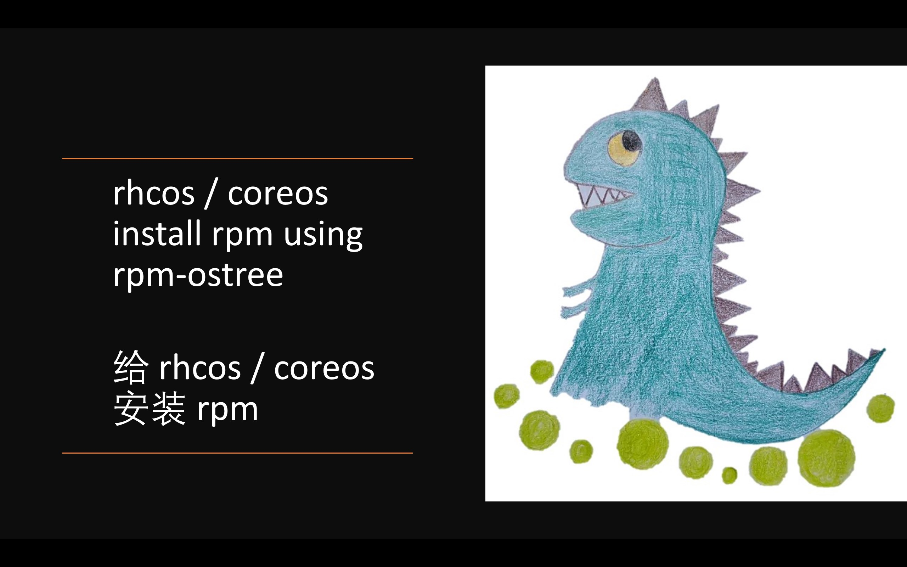

# rhcos / coreos install rpm using rpm-ostree | 给 rhcos / coreos 安装 rpm

⚠️注意，本文所述操作，涉及更改 openshift 4 底层操作系统 rhcos，这有可能导致失去红帽支持资格，具体的情况，请和对口的红帽 GPS 团队沟通， 或者联系红帽 CEE 团队确认。

rhcos 是一个特殊版本的coreos， 它是openshift 4的底座操作系统，在openshift 4的官方文档中，rhcos被描述成为不可变操作系统，这会让人误以为，rhcos是不可改变的。这个错误的认识，让openshift 4在项目实施的过程中，遇到很多尴尬，也让很多场景，支持起来非常的别扭。

本文我们就来探索一下，如何在 rhcos / coreos 上安装rpm包，并正确理解一下不可变操作系统。

先说结论吧，笔者认为 rhcos / coreos 的 immutable os / 不可变操作系统的意思是这样的
1. 操作系统的 /usr /lib /boot 等重要分区是只读的
2. 操作系统的 /etc /var 是可写的，并且升级，重启保留/合并客户的修改内容。
3. 操作系统的整个文件系统，使用类似 git 版本的方式管理，并且（当前）最多有2个版本
4. 由于使用git方式管理，操作系统的改动，可以分为版本切换，和patch（layerd package)。其中版本切换，是中心下发的大版本升级，而patch可以认为是各个设备上做的小的修改。

而最终的实验结果，告诉我们，rhcos / coreos 是可以安装rpm的，安装命令是 rpm-ostree 。

接下来，我们就开始做实验，探索一下。以下是实验的部署架构图，部署结构很简单，就是一个openshift 4.10.26的6节点机器，并且有一个外部的rhel 8.4作为repo源。


## 视频讲解 / Video explanation

[<kbd></kbd>](https://www.bilibili.com/video/BV15e411u7mT/)

- [bilibili](https://www.bilibili.com/video/BV15e411u7mT/)
- [youtube](https://youtu.be/Xyx5r2jTJjU)

## reference
- [How to customize Fedora CoreOS for dedicated workloads with OSTree](https://developers.redhat.com/blog/2020/03/12/how-to-customize-fedora-coreos-for-dedicated-workloads-with-ostree)

# openshift 4 using rpm-ostree install

使用rpm-ostree install并不神秘，openshift 4 支持的 machine config extension 操作的时候，就使用 rpm-ostree install来装软件包的。比如，如果我们激活 openshift 4 real-time kernel的支持，在node上看，就能看到他是通过装了更多的rpm来实现的。

```bash
rpm-ostree status
# State: idle
# Deployments:
# ● pivot://quay.io/openshift-release-dev/ocp-v4.0-art-dev@sha256:480e39d63063bae8992542905d48442fd1d9d1325a5136a3be8256d123efe490
#               CustomOrigin: Managed by machine-config-operator
#                    Version: 49.84.202110220538-0 (2021-10-22T05:41:35Z)
#        RemovedBasePackages: kernel-core kernel-modules kernel kernel-modules-extra 4.18.0-305.19.1.el8_4
#            LayeredPackages: kernel-rt-core kernel-rt-kvm kernel-rt-modules kernel-rt-modules-extra

#   pivot://quay.io/openshift-release-dev/ocp-v4.0-art-dev@sha256:480e39d63063bae8992542905d48442fd1d9d1325a5136a3be8256d123efe490
#               CustomOrigin: Managed by machine-config-operator
#                    Version: 49.84.202110220538-0 (2021-10-22T05:41:35Z)
```

在这里，我们可以看到，他是装了real-time kernel相关的rpm包来实现的，同时，他还删除了一些kernel相关的包。

# using single rpm file

我们先做一个准备实验，如果我们有一个rpm文件，我们能下载并且直接安装吗？后面，如果openshift 4升级了，这个安装的rpm还在吗？

为了回答这个问题，我们就从epel上，下载一个 htop 的 rpm， 然后安装一下看看。

```bash
# login to worker: ip-10-0-139-149 shell
curl -o htop-3.2.1-1.el8.x86_64.rpm  https://rpmfind.net/linux/epel/8/Everything/x86_64/Packages/h/htop-3.2.1-1.el8.x86_64.rpm

rpm-ostree install ./htop-3.2.1-1.el8.x86_64.rpm
# Checking out tree 8b334e0... done
# No enabled rpm-md repositories.
# Importing rpm-md... done
# Resolving dependencies... done
# Checking out packages... done
# Running pre scripts... done
# Running post scripts... done
# Running posttrans scripts... done
# Writing rpmdb... done
# Writing OSTree commit... done
# Staging deployment... done
# Added:
#   htop-3.2.1-1.el8.x86_64
# Run "systemctl reboot" to start a reboot

systemctl reboot

# after reboot

rpm-ostree status
# State: idle
# Deployments:
# * pivot://quay.io/openshift-release-dev/ocp-v4.0-art-dev@sha256:23d0609643c25efcd30a7a64483fdee2343ced26b1fd08c0cbf8d03a5d405939
#               CustomOrigin: Managed by machine-config-operator
#                    Version: 410.84.202208030316-0 (2022-08-03T03:19:21Z)
#              LocalPackages: htop-3.2.1-1.el8.x86_64

#   pivot://quay.io/openshift-release-dev/ocp-v4.0-art-dev@sha256:23d0609643c25efcd30a7a64483fdee2343ced26b1fd08c0cbf8d03a5d405939
#               CustomOrigin: Managed by machine-config-operator
#                    Version: 410.84.202208030316-0 (2022-08-03T03:19:21Z)

oc get mcp
# NAME     CONFIG                                             UPDATED   UPDATING   DEGRADED   MACHINECOUNT   READYMACHINECOUNT   UPDATEDMACHINECOUNT   DEGRADEDMACHINECOUNT   AGE
# master   rendered-master-c3ceea1602f442fde75df6aab905c41e   True      False      False      3              3                   3                     0                      11h
# worker   rendered-worker-c527565b03d522c2eb9bf6f33c419175   True      False      False      3              3                   3                     0                      11h

oc get node
# NAME                                         STATUS   ROLES    AGE   VERSION
# ip-10-0-133-232.us-east-2.compute.internal   Ready    master   11h   v1.23.5+012e945
# ip-10-0-139-149.us-east-2.compute.internal   Ready    worker   11h   v1.23.5+012e945
# ip-10-0-159-38.us-east-2.compute.internal    Ready    master   11h   v1.23.5+012e945
# ip-10-0-167-145.us-east-2.compute.internal   Ready    worker   11h   v1.23.5+012e945
# ip-10-0-189-34.us-east-2.compute.internal    Ready    master   11h   v1.23.5+012e945
# ip-10-0-215-151.us-east-2.compute.internal   Ready    worker   11h   v1.23.5+012e945

# upgrade from 4.10.26 to 4.10.28
rpm-ostree status
# State: idle
# Deployments:
# * pivot://quay.io/openshift-release-dev/ocp-v4.0-art-dev@sha256:822737b305b28aa4890f7bf847ebebc896cd7b549318195fc8c953ae3008cc44
#               CustomOrigin: Managed by machine-config-operator
#                    Version: 410.84.202208161501-0 (2022-08-16T15:04:45Z)
#              LocalPackages: htop-3.2.1-1.el8.x86_64

#   pivot://quay.io/openshift-release-dev/ocp-v4.0-art-dev@sha256:23d0609643c25efcd30a7a64483fdee2343ced26b1fd08c0cbf8d03a5d405939
#               CustomOrigin: Managed by machine-config-operator
#                    Version: 410.84.202208030316-0 (2022-08-03T03:19:21Z)
#              LocalPackages: htop-3.2.1-1.el8.x86_64


```

可以看到，htop rpm文件，是可以单独安装的，并且集群升级以后，这个rpm还在，patch的类型是LocalPackages。

# using repo source

我们平常项目里面，要装的rpm很多，并且这些rpm还有依赖，那么rhcos能用传统的repo的方式，我们指定repo源，它就帮我们自动解析依赖，自动安装呢？

接下来，我们就从配置一个rpm源开始，一步一步的操作看看结果。

## rpm simplified list
首先，我们确定一下，我们要装如下的rpm包。
```bash
htop lshw numactl libhugetlbfs-utils iperf3 tcpdump pdns pdns-recursor
```

## build the repo
然后，我们要做一个rpm的repo。
```bash

export REPO_IP=http://v.redhat.ren:5180

cat << EOF > /etc/yum.repos.d/wzh.repo 
# RHEL repos
[rhel-8-baseos]
baseurl=${REPO_IP}/rhel-8-for-x86_64-baseos-eus-rpms

[rhel-8-appstream]
baseurl=${REPO_IP}/rhel-8-for-x86_64-appstream-eus-rpms

[rhel-8-fast-datapath]
baseurl=${REPO_IP}/fast-datapath-for-rhel-8-x86_64-rpms

[rhel-8-advanced-virt]
baseurl=${REPO_IP}/advanced-virt-for-rhel-8-x86_64-eus-rpms

[rhel-8-nfv]
baseurl=${REPO_IP}/rhel-8-for-x86_64-nfv-tus-rpms

# upstream: http://download.eng.bos.redhat.com/rcm-guest/puddles/RHAOS/plashets/4.10-el8/building/x86_64/os/
# it is internal resource right now, confidential.
# or: https://mirror.openshift.com/enterprise/reposync/
# https://mirror.openshift.com/enterprise/reposync/4.10/rhel-8-server-ose-rpms/
# it also require logins.
[rhel-8-server-ose]
baseurl=${REPO_IP}/rhel-8-server-ose

# mirror list
# https://mirrors.fedoraproject.org/mirrorlist?repo=epel-8&arch=x86_64&&country=us
[epel]
baseurl=https://mirror.fcix.net/epel/8/Everything/x86_64/
enabled=1
repo_gpgcheck=0
gpgcheck=0

EOF

mv /etc/yum.repos.d/redhat.repo /etc/yum.repos.d/redhat.repo.wzh

rpm --import /etc/pki/rpm-gpg/RPM-GPG-KEY-redhat-release

dnf install -y byobu htop createrepo_c python39

mkdir -p /data/dnf-ocp-4.10-simple
cd /data/dnf-ocp-4.10-simple

# 注意，这里是把rpm的依赖也一起下载了。
dnf download --resolve htop lshw numactl libhugetlbfs-utils iperf3 tcpdump pdns pdns-recursor

createrepo ./

```
至此，我们就有一个目录，目录里面是一个小小的rpm repo。

## setup repo source
接下来，我们就把这个目录，通过http的方式发布出去，让openshift 4的节点，能使用到。
```bash

systemctl disable --now firewalld

mkdir -p /data/dnf

mount /dev/vdb1 /data/dnf

cd /data/dnf/dnf-ocp-4.10-simple

python3 -m http.server 5180

```

## install to rhcos
我们使用前面提供好的rpm repo，并且在worker节点上安装我们需要的包。
```bash

export REPO_IP=http://v.redhat.ren:5180

cat << EOF > /etc/yum.repos.d/wzh.repo 
# RHEL repos
[simple]
baseurl=${REPO_IP}/
enabled=1
repo_gpgcheck=0
gpgcheck=0

EOF

rpm-ostree install htop lshw numactl libhugetlbfs-utils iperf3 tcpdump pdns pdns-recursor

systemctl reboot

# after reboot
rpm-ostree status
# State: idle
# Deployments:
# * pivot://quay.io/openshift-release-dev/ocp-v4.0-art-dev@sha256:23d0609643c25efcd30a7a64483fdee2343ced26b1fd08c0cbf8d03a5d405939
#               CustomOrigin: Managed by machine-config-operator
#                    Version: 410.84.202208030316-0 (2022-08-03T03:19:21Z)
#            LayeredPackages: htop iperf3 libhugetlbfs-utils lshw numactl pdns pdns-recursor tcpdump

#   pivot://quay.io/openshift-release-dev/ocp-v4.0-art-dev@sha256:23d0609643c25efcd30a7a64483fdee2343ced26b1fd08c0cbf8d03a5d405939
#               CustomOrigin: Managed by machine-config-operator
#                    Version: 410.84.202208030316-0 (2022-08-03T03:19:21Z)
```
可以看到，安装完成，多了很多包。那么我们把集群升级一下，会是什么效果呢？


```bash
# upgrade from 4.10.26 -> 4.10.28
rpm-ostree status
State: idle
Deployments:
* pivot://quay.io/openshift-release-dev/ocp-v4.0-art-dev@sha256:822737b305b28aa4890f7bf847ebebc896cd7b549318195fc8c953ae3008cc44
              CustomOrigin: Managed by machine-config-operator
                   Version: 410.84.202208161501-0 (2022-08-16T15:04:45Z)
           LayeredPackages: htop iperf3 libhugetlbfs-utils lshw numactl pdns pdns-recursor tcpdump

  pivot://quay.io/openshift-release-dev/ocp-v4.0-art-dev@sha256:23d0609643c25efcd30a7a64483fdee2343ced26b1fd08c0cbf8d03a5d405939
              CustomOrigin: Managed by machine-config-operator
                   Version: 410.84.202208030316-0 (2022-08-03T03:19:21Z)
           LayeredPackages: htop iperf3 libhugetlbfs-utils lshw numactl pdns pdns-recursor tcpdump

```
可以看到，升级完成以后，我们装的包，依然都在。

# research


## setup repo source

```bash

systemctl disable --now firewalld

mkdir -p /data/dnf

mount /dev/vdb1 /data/dnf

cd /data/dnf/dnf-ocp-4.10

python3 -m http.server 5180

```

## install to rhcos

```bash

export REPO_IP=http://v.redhat.ren:5180

cat << EOF > /etc/yum.repos.d/wzh.repo 
# RHEL repos
[rhel-8-baseos]
baseurl=${REPO_IP}/rhel-8-for-x86_64-baseos-eus-rpms

[rhel-8-appstream]
baseurl=${REPO_IP}/rhel-8-for-x86_64-appstream-eus-rpms

[rhel-8-fast-datapath]
baseurl=${REPO_IP}/fast-datapath-for-rhel-8-x86_64-rpms

[rhel-8-advanced-virt]
baseurl=${REPO_IP}/advanced-virt-for-rhel-8-x86_64-eus-rpms

[rhel-8-nfv]
baseurl=${REPO_IP}/rhel-8-for-x86_64-nfv-tus-rpms

# upstream: http://download.eng.bos.redhat.com/rcm-guest/puddles/RHAOS/plashets/4.10-el8/building/x86_64/os/
# it is internal resource right now, confidential.
# or: https://mirror.openshift.com/enterprise/reposync/
# https://mirror.openshift.com/enterprise/reposync/4.10/rhel-8-server-ose-rpms/
# it also require logins.
[rhel-8-server-ose]
baseurl=${REPO_IP}/rhel-8-server-ose

# mirror list
# https://mirrors.fedoraproject.org/mirrorlist?repo=epel-8&arch=x86_64&&country=us
[epel]
baseurl=https://mirror.fcix.net/epel/8/Everything/x86_64/
enabled=1
repo_gpgcheck=0
gpgcheck=0

EOF

rpm-ostree install htop
# Checking out tree 203abe6... done
# Enabled rpm-md repositories: rhel-8-baseos rhel-8-appstream rhel-8-fast-datapath rhel-8-advanced-virt rhel-8-nfv rhel-8-server-ose epel
# rpm-md repo 'rhel-8-baseos' (cached); generated: 2022-07-19T19:30:27Z
# Updating metadata for 'rhel-8-appstream'... done
# rpm-md repo 'rhel-8-appstream'; generated: 2022-08-16T17:13:40Z
# Updating metadata for 'rhel-8-fast-datapath'... done
# rpm-md repo 'rhel-8-fast-datapath'; generated: 2022-08-01T13:46:17Z
# Updating metadata for 'rhel-8-advanced-virt'... done
# rpm-md repo 'rhel-8-advanced-virt'; generated: 2022-06-13T11:46:08Z
# Updating metadata for 'rhel-8-nfv'... done
# rpm-md repo 'rhel-8-nfv'; generated: 2022-07-19T19:21:36Z
# Updating metadata for 'rhel-8-server-ose'... done
# rpm-md repo 'rhel-8-server-ose'; generated: 2022-08-20T01:24:13Z
# Updating metadata for 'epel'... done
# rpm-md repo 'epel'; generated: 2022-09-01T10:12:52Z
# Importing rpm-md... done
# Resolving dependencies... done
# Will download: 1 package (173.6 kB)
# Downloading from 'epel'... done
# Importing packages... done
# Checking out packages... done
# Running pre scripts... done
# Running post scripts... done
# Running posttrans scripts... done
# Writing rpmdb... done
# Writing OSTree commit... done
# Staging deployment... done
# Freed: 1.2 GB (pkgcache branches: 0)
# Added:
#   htop-3.2.1-1.el8.x86_64
# Run "systemctl reboot" to start a reboot

rpm-ostree status
# State: idle
# Deployments:
#   pivot://quay.io/openshift-release-dev/ocp-v4.0-art-dev@sha256:822737b305b28aa4890f7bf847ebebc896cd7b549318195fc8c953ae3008cc44
#               CustomOrigin: Managed by machine-config-operator
#                    Version: 410.84.202208161501-0 (2022-08-16T15:04:45Z)
#                       Diff: 1 added
#            LayeredPackages: htop

# * pivot://quay.io/openshift-release-dev/ocp-v4.0-art-dev@sha256:822737b305b28aa4890f7bf847ebebc896cd7b549318195fc8c953ae3008cc44
#               CustomOrigin: Managed by machine-config-operator
#                    Version: 410.84.202208161501-0 (2022-08-16T15:04:45Z)

#   pivot://quay.io/openshift-release-dev/ocp-v4.0-art-dev@sha256:23d0609643c25efcd30a7a64483fdee2343ced26b1fd08c0cbf8d03a5d405939
#               CustomOrigin: Managed by machine-config-operator
#                    Version: 410.84.202208030316-0 (2022-08-03T03:19:21Z)

systemcto reboot

# after reboot
rpm-ostree status
# State: idle
# Deployments:
# * pivot://quay.io/openshift-release-dev/ocp-v4.0-art-dev@sha256:822737b305b28aa4890f7bf847ebebc896cd7b549318195fc8c953ae3008cc44
#               CustomOrigin: Managed by machine-config-operator
#                    Version: 410.84.202208161501-0 (2022-08-16T15:04:45Z)
#            LayeredPackages: htop

#   pivot://quay.io/openshift-release-dev/ocp-v4.0-art-dev@sha256:822737b305b28aa4890f7bf847ebebc896cd7b549318195fc8c953ae3008cc44
#               CustomOrigin: Managed by machine-config-operator
#                    Version: 410.84.202208161501-0 (2022-08-16T15:04:45Z)

ostree admin status
# * rhcos 43a75eb50db67449b7b546dec6e30866a907d6b85317ce1ba5af71d07c903755.0
#     Version: 410.84.202208161501-0
#     origin: <unknown origin type>
#   rhcos 203abe66048544a0415be2c3089e236da15b3a468f9e2bf3c6e2590c31ecc8db.0 (rollback)
#     Version: 410.84.202208161501-0
#     origin refspec: 203abe66048544a0415be2c3089e236da15b3a468f9e2bf3c6e2590c31ecc8db

which htop
# /usr/bin/htop
```

# end