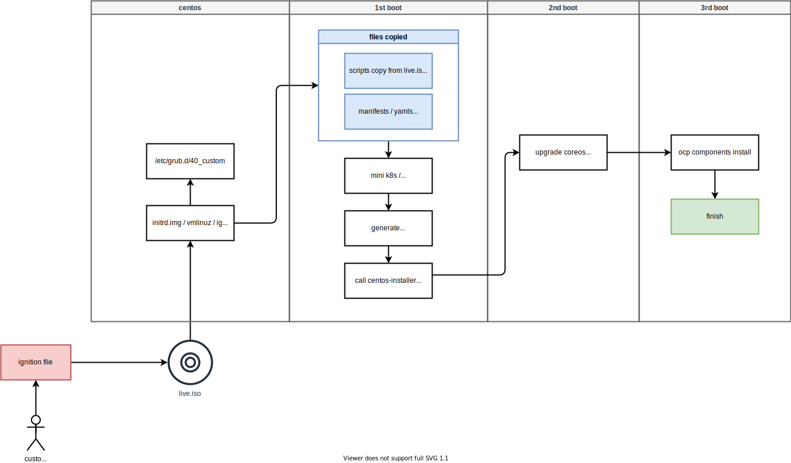

# start install openshift 4.10 single node by booting from linux

在做PoC的时候，客户经常会给我们虚拟机平台上的虚拟机，这个时候，我们就需要从虚拟机 boot coreos , 进而开始安装， 本文就描述相关步骤。

- [CentOS引导CoreOS](https://www.cnblogs.com/beilong/p/15883138.html)
- [official doc: Working with GRUB 2](https://access.redhat.com/documentation/en-us/red_hat_enterprise_linux/7/html/system_administrators_guide/ch-working_with_the_grub_2_boot_loader)

安装过程内部流程图：



# from centos7

```bash

# install a centos7 vm

sed -i '0,/^network.*/s/^network.*/network  --bootproto=static --device=eth0 --gateway=192.168.7.1 --ip=192.168.7.12  --netmask=255.255.255.0 --nameserver=192.168.7.11  --ipv6=auto --activate/' helper-ks.cfg

virsh destroy ocp4-acm-hub
virsh undefine ocp4-acm-hub

create_lv() {
    var_vg=$1
    var_pool=$2
    var_lv=$3
    var_size=$4
    var_action=$5
    lvremove -f $var_vg/$var_lv
    # lvcreate -y -L $var_size -n $var_lv $var_vg
    if [ "$var_action" == "recreate" ]; then
      lvcreate --type thin -n $var_lv -V $var_size --thinpool $var_vg/$var_pool
      wipefs --all --force /dev/$var_vg/$var_lv
    fi
}

create_lv vgdata poolA lvacmhub 100G recreate
create_lv vgdata poolA lvacmhub-data 100G recreate


virt-install --name="ocp4-acm-hub" --vcpus=16 --ram=$((52*1024)) \
    --cpu=host-model \
    --disk path=/dev/vgdata/lvacmhub,device=disk,bus=virtio,format=raw \
    --disk path=/dev/vgdata/lvacmhub-data,device=disk,bus=virtio,format=raw \
    --os-variant rhel8.5 --network bridge=baremetal,model=virtio \
    --graphics vnc,port=59000 \
    --boot menu=on --location /data/kvm/CentOS-7-x86_64-Minimal-2009.iso \
    --initrd-inject helper-ks.cfg --extra-args "inst.ks=file:/helper-ks.cfg" 

# copy ignition file to webserver
# /bin/cp -f iso.ign /var/www/html/ignition/iso.ign

# copy rhcos-live.x86_64.iso to centos
ssh-copy-id root@192.168.7.12

scp /data/install/sno.iso root@192.168.7.12:~/

# goto centos
ssh root@192.168.7.12

mount -o ro sno.iso /mnt

/bin/cp -f /mnt/images/pxeboot/{initrd.img,vmlinuz} /boot/
/bin/cp -f /mnt/images/ignition.img /boot/

SNO_IP=192.168.7.13
SNO_GW=192.168.7.11
SNO_NETMAST=255.255.255.0
SNO_HOSTNAME=acm-demo-hub-master
SNO_IF=enp1s0
SNO_DNS=192.168.7.11
SNO_DISK=/dev/vda
SNO_ROOTFS=http://192.168.7.11:8080/install/rootfs.img
SNO_IGN=http://192.168.7.11:8080/ignition/iso.ign

cat << EOF >> /etc/grub.d/40_custom
menuentry 'coreos' --class fedora --class gnu-linux --class gnu --class os {
    insmod gzio
    insmod part_msdos
    insmod xfs
    set root='hd0,msdos1'
    echo  'Loading coreos kernel ...'
    linux /vmlinuz rd.neednet=1 console=tty0 console=ttyS0 coreos.live.rootfs_url=$SNO_ROOTFS  ip=$SNO_IP::$SNO_GW:$SNO_NETMAST:$SNO_HOSTNAME:$SNO_IF:none nameserver=$SNO_DNS ignition.firstboot ignition.platform.id=metal random.trust_cpu=on
    echo  'Loading coreos initrd ...'
    initrd /initrd.img /ignition.img
}
EOF

sed -i 's/^GRUB_DEFAULT=.*/GRUB_DEFAULT="coreos"/' /etc/default/grub 

grub2-mkconfig -o /etc/grub2.cfg

reboot

```

# from rocky linux 8

```bash


# install a rocky8 vm

sed -i '0,/^network.*/s/^network.*/network  --bootproto=static --device=enp1s0 --gateway=192.168.7.1 --ip=192.168.7.12  --netmask=255.255.255.0 --nameserver=192.168.7.11  --ipv6=auto --activate/' helper-ks-rocky.cfg

virsh destroy ocp4-acm-hub
virsh undefine ocp4-acm-hub

create_lv() {
    var_vg=$1
    var_pool=$2
    var_lv=$3
    var_size=$4
    var_action=$5
    lvremove -f $var_vg/$var_lv
    # lvcreate -y -L $var_size -n $var_lv $var_vg
    if [ "$var_action" == "recreate" ]; then
      lvcreate --type thin -n $var_lv -V $var_size --thinpool $var_vg/$var_pool
      wipefs --all --force /dev/$var_vg/$var_lv
    fi
}

create_lv vgdata poolA lvacmhub 100G recreate
create_lv vgdata poolA lvacmhub-data 100G recreate


virt-install --name="ocp4-acm-hub" --vcpus=16 --ram=$((52*1024)) \
    --cpu=host-model \
    --disk path=/dev/vgdata/lvacmhub,device=disk,bus=virtio,format=raw \
    --disk path=/dev/vgdata/lvacmhub-data,device=disk,bus=virtio,format=raw \
    --os-variant rhel8.5 --network bridge=baremetal,model=virtio \
    --graphics vnc,port=59000 \
    --boot menu=on --location /data/kvm/Rocky-8.6-x86_64-minimal.iso \
    --initrd-inject helper-ks-rocky.cfg --extra-args "inst.ks=file:/helper-ks-rocky.cfg" 

# copy ignition file to webserver
# /bin/cp -f iso.ign /var/www/html/ignition/iso.ign

# copy rhcos-live.x86_64.iso to centos
ssh-copy-id root@192.168.7.12

scp /data/install/sno.iso root@192.168.7.12:~/

# goto centos
ssh root@192.168.7.12

mount -o ro sno.iso /mnt

/bin/cp -f /mnt/images/pxeboot/{initrd.img,vmlinuz} /boot/
/bin/cp -f /mnt/images/ignition.img /boot/

SNO_IP=192.168.7.13
SNO_GW=192.168.7.11
SNO_NETMAST=255.255.255.0
SNO_HOSTNAME=acm-demo-hub-master
SNO_IF=enp1s0
SNO_DNS=192.168.7.11
SNO_DISK=/dev/vda
SNO_ROOTFS=http://192.168.7.11:8080/install/rootfs.img
SNO_IGN=http://192.168.7.11:8080/ignition/iso.ign

cat << EOF >> /etc/grub.d/40_custom
menuentry 'coreos' --class fedora --class gnu-linux --class gnu --class os {
    insmod gzio
    insmod part_msdos
    insmod xfs
    set root='hd0,msdos1'
    echo  'Loading coreos kernel ...'
    linux /vmlinuz rd.neednet=1 console=tty0 console=ttyS0 coreos.live.rootfs_url=$SNO_ROOTFS  ip=$SNO_IP::$SNO_GW:$SNO_NETMAST:$SNO_HOSTNAME:$SNO_IF:none nameserver=$SNO_DNS ignition.firstboot ignition.platform.id=metal random.trust_cpu=on
    echo  'Loading coreos initrd ...'
    initrd /initrd.img /ignition.img
}
EOF

sed -i 's/^GRUB_DEFAULT=.*/GRUB_DEFAULT="coreos"/' /etc/default/grub 

grub2-mkconfig -o /etc/grub2.cfg

reboot


```