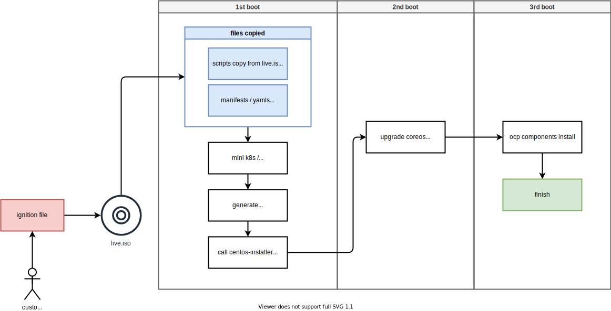

# openshift 4.10 single node, installer 安装，离线静态IP

openshift single node 是可以用installer来安装的，但是很多客户都遇到问题，这里我们就来试一下。

本文有一个前导实验，就是[创建 helper node](./4.10.helper.node.md) ， 这个工具机用来做一个跳板，模拟离线环境的proxy

installer 的内部安装逻辑图：



视频讲解

[<kbd></kbd>](https://www.bilibili.com/video/BV1i3411g7i3)

- [bilibili](https://www.bilibili.com/video/BV1i3411g7i3)
- [youtube](https://youtu.be/7U-5yW9UZZQ)

# on helper node

```bash

useradd -m sno

ssh-keygen

export BASE_DIR='/home/sno/'

mkdir -p ${BASE_DIR}/data/{sno/disconnected,install}

NODE_SSH_KEY="$(cat ${BASE_DIR}/.ssh/id_rsa.pub)"
INSTALL_IMAGE_REGISTRY=registry.ocp4.redhat.ren:5443

PULL_SECRET='{"auths":{"registry.redhat.io": {"auth": "ZHVtbXk6ZHVtbXk=","email": "noemail@localhost"},"registry.ocp4.redhat.ren:5443": {"auth": "ZHVtbXk6ZHVtbXk=","email": "noemail@localhost"},"'${INSTALL_IMAGE_REGISTRY}'": {"auth": "'$( echo -n 'admin:shadowman' | openssl base64 )'","email": "noemail@localhost"}}}'

NTP_SERVER=192.168.7.11
HELP_SERVER=192.168.7.11
KVM_HOST=192.168.7.1
API_VIP=192.168.7.100
INGRESS_VIP=192.168.7.101
CLUSTER_PROVISION_IP=192.168.7.103
BOOTSTRAP_IP=192.168.7.12

ACM_DEMO_MNGED_CLUSTER=acm-demo1
ACM_DEMO_MNGED_SNO_IP=192.168.7.15

# 定义单节点集群的节点信息
SNO_CLUSTER_NAME=acm-demo-hub
SNO_BASE_DOMAIN=redhat.ren
SNO_IP=192.168.7.18
SNO_GW=192.168.7.11
SNO_NETMAST=255.255.255.0
SNO_NETMAST_S=24
SNO_HOSTNAME=acm-demo-hub-master
SNO_IF=eno2
SNO_IF_MAC=`printf '00:60:2F:%02X:%02X:%02X' $[RANDOM%256] $[RANDOM%256] $[RANDOM%256]`
SNO_DNS=192.168.7.11
SNO_DISK=/dev/sda
SNO_CORE_PWD=redhat

echo ${SNO_IF_MAC} > ${BASE_DIR}/data/sno/sno.mac


cat << EOF > /data/ocp4/ocp4-upi-helpernode-master/vars.yaml
---
ocp_version: 4.9.5
ssh_gen_key: false
staticips: true
bm_ipi: false
firewalld: false
dns_forward: true
iso:
  iso_dl_url: "file:///data/ocp4/rhcos-live.x86_64.iso"
  my_iso: "rhcos-live.iso"
helper:
  name: "helper"
  ipaddr: "${HELP_SERVER}"
  networkifacename: "enp1s0"
  gateway: "${SNO_GW}"
  netmask: "${SNO_NETMAST}"
dns:
  domain: "redhat.ren"
  clusterid: "ocp4"
  forwarder1: "202.106.0.20"
  forwarder2: "202.106.0.20"
  api_vip: "${API_VIP}"
  ingress_vip: "${INGRESS_VIP}"
bootstrap:
  name: "bootstrap"
  ipaddr: "${BOOTSTRAP_IP}"
  interface: "enp1s0"
  install_drive: "vda"
masters:
  - name: "master-0"
    ipaddr: "192.168.7.13"
    interface: "enp1s0"
    install_drive: "vda"
workers:
  - name: "worker-0"
    ipaddr: "192.168.7.16"
    interface: "ens18f0"
    install_drive: "sda"
  - name: "worker-1"
    ipaddr: "192.168.7.17"
    interface: "eno2"
    install_drive: "sda"
  - name: "worker-2"
    ipaddr: "192.168.7.18"
    interface: "enp1s0"
    install_drive: "sda"
others:
  - name: "registry"
    ipaddr: "192.168.7.1"
  - name: "yum"
    ipaddr: "192.168.7.1"
  - name: "quay"
    ipaddr: "192.168.7.11"
  - name: "nexus"
    ipaddr: "192.168.7.1"
  - name: "git"
    ipaddr: "192.168.7.11"
  - name: "tmp-registry"
    ipaddr: "192.168.7.177"
otherdomains:
  - domain: "infra.redhat.ren"
    hosts:
    - name: "registry"
      ipaddr: "192.168.7.11"
    - name: "yum"
      ipaddr: "192.168.7.11"
    - name: "quay"
      ipaddr: "192.168.7.11"
    - name: "quaylab"
      ipaddr: "192.168.7.11"
    - name: "nexus"
      ipaddr: "192.168.7.11"
    - name: "git"
      ipaddr: "192.168.7.11"
  - domain: "${ACM_DEMO_MNGED_CLUSTER}.${SNO_BASE_DOMAIN}"
    hosts:
    - name: "api"
      ipaddr: "${ACM_DEMO_MNGED_SNO_IP}"
    - name: "api-int"
      ipaddr: "${ACM_DEMO_MNGED_SNO_IP}"
    - name: "${ACM_DEMO_MNGED_CLUSTER}-master"
      ipaddr: "${ACM_DEMO_MNGED_SNO_IP}"
    - name: "*.apps"
      ipaddr: "${ACM_DEMO_MNGED_SNO_IP}"
  - domain: "${SNO_CLUSTER_NAME}.${SNO_BASE_DOMAIN}"
    hosts:
    - name: "api"
      ipaddr: "${SNO_IP}"
    - name: "api-int"
      ipaddr: "${SNO_IP}"
    - name: "${SNO_CLUSTER_NAME}-master"
      ipaddr: "${SNO_IP}"
    - name: "*.apps"
      ipaddr: "${SNO_IP}"
force_ocp_download: false
remove_old_config_files: false
ocp_client: "file:///data/ocp4/{{ ocp_version }}/openshift-client-linux-{{ ocp_version }}.tar.gz"
ocp_installer: "file:///data/ocp4/{{ ocp_version }}/openshift-install-linux-{{ ocp_version }}.tar.gz"
ppc64le: false
arch: 'x86_64'
chronyconfig:
  enabled: true
  content:
    - server: "${NTP_SERVER}"
      options: iburst
setup_registry: # don't worry about this, just leave it here
  deploy: false
  registry_image: docker.io/library/registry:2
  local_repo: "ocp4/openshift4"
  product_repo: "openshift-release-dev"
  release_name: "ocp-release"
  release_tag: "4.6.1-x86_64"
ocp_filetranspiler: "file:///data/ocp4/filetranspiler.tgz"

EOF

cd /data/ocp4/ocp4-upi-helpernode-master
ansible-playbook -e @vars.yaml -e '{ staticips: true, bm_ipi: false }'  tasks/main.yml


mkdir -p ${BASE_DIR}/data/install
cd ${BASE_DIR}/data/install

/bin/rm -rf *.ign .openshift_install_state.json auth bootstrap manifests master*[0-9] worker*[0-9] 

cat << EOF > ${BASE_DIR}/data/install/install-config.yaml 
apiVersion: v1
baseDomain: $SNO_BASE_DOMAIN
compute:
- name: worker
  replicas: 0 
controlPlane:
  name: master
  replicas: 1 
metadata:
  name: $SNO_CLUSTER_NAME
networking:
  # OVNKubernetes , OpenShiftSDN
  networkType: OVNKubernetes
  clusterNetwork:
  - cidr: 10.128.0.0/14
    hostPrefix: 23
  serviceNetwork:
  - 172.30.0.0/16
platform:
  none: {}
bootstrapInPlace:
  installationDisk: $SNO_DISK
pullSecret: '${PULL_SECRET}'
sshKey: |
$( cat ${BASE_DIR}/.ssh/id_rsa.pub | sed 's/^/   /g' )
additionalTrustBundle: |
$( cat /etc/crts/redhat.ren.ca.crt | sed 's/^/   /g' )
imageContentSources:
- mirrors:
  - ${INSTALL_IMAGE_REGISTRY}/ocp4/openshift4
  source: quay.io/openshift-release-dev/ocp-release
- mirrors:
  - ${INSTALL_IMAGE_REGISTRY}/ocp4/openshift4
  source: quay.io/openshift-release-dev/ocp-v4.0-art-dev
EOF

openshift-install create manifests --dir=${BASE_DIR}/data/install

/bin/cp -f  /data/ocp4/ocp4-upi-helpernode-master/machineconfig/* ${BASE_DIR}/data/install/openshift/

# copy image registry proxy related config
cd /data/ocp4
bash image.registries.conf.sh nexus.infra.redhat.ren:8083

/bin/cp -f /data/ocp4/image.registries.conf /etc/containers/registries.conf.d/

/bin/cp -f /data/ocp4/99-worker-container-registries.yaml ${BASE_DIR}/data/install/openshift
/bin/cp -f /data/ocp4/99-master-container-registries.yaml ${BASE_DIR}/data/install/openshift

cd ${BASE_DIR}/data/install/

openshift-install --dir=${BASE_DIR}/data/install create single-node-ignition-config

alias coreos-installer='podman run --privileged --rm \
        -v /dev:/dev -v /run/udev:/run/udev -v $PWD:/data \
        -w /data quay.io/coreos/coreos-installer:release'

# /bin/cp -f bootstrap-in-place-for-live-iso.ign iso.ign

cat << EOF > ${BASE_DIR}/data/sno/static.hostname.bu
variant: openshift
version: 4.9.0
metadata:
  labels:
    machineconfiguration.openshift.io/role: master
  name: 99-zzz-master-static-hostname
storage:
  files:
    - path: /etc/hostname
      mode: 0644
      overwrite: true
      contents:
        inline: |
          ${SNO_HOSTNAME}

EOF


cat << EOF > ${BASE_DIR}/data/sno/static.ip.bu
variant: openshift
version: 4.9.0
metadata:
  labels:
    machineconfiguration.openshift.io/role: master
  name: 99-zzz-master-static-ip
storage:
  files:
    - path: /etc/NetworkManager/system-connections/${SNO_IF}.nmconnection
      mode: 0600
      overwrite: true
      contents:
        inline: |
          [connection]
          id=${SNO_IF}
          type=ethernet
          autoconnect-retries=1
          interface-name=${SNO_IF}
          multi-connect=1
          permissions=
          wait-device-timeout=60000

          [ethernet]
          mac-address-blacklist=

          [ipv4]
          address1=${SNO_IP}/${SNO_NETMAST_S=24},${SNO_GW}
          dhcp-hostname=${SNO_HOSTNAME}
          dhcp-timeout=90
          dns=${SNO_DNS};
          dns-search=
          may-fail=false
          method=manual

          [ipv6]
          addr-gen-mode=eui64
          dhcp-hostname=${SNO_HOSTNAME}
          dhcp-timeout=90
          dns-search=
          method=disabled

          [proxy]
EOF


cat << EOF > ${BASE_DIR}/data/sno/static.ip.eno1.bu
variant: openshift
version: 4.9.0
metadata:
  labels:
    machineconfiguration.openshift.io/role: master
  name: 99-zzz-master-static-ip-eno1
storage:
  files:
    - path: /etc/NetworkManager/system-connections/eno1.nmconnection
      mode: 0600
      overwrite: true
      contents:
        inline: |
          [connection]
          id=eno1
          type=ethernet
          autoconnect-retries=1
          interface-name=eno1
          multi-connect=1
          permissions=
          wait-device-timeout=60000

          [ethernet]
          mac-address-blacklist=

          [ipv4]
          method=disabled

          [ipv6]
          method=disabled

          [proxy]
EOF

source /data/ocp4/acm.fn.sh

# butane /data/sno/static.bootstrap.ip.bu > /data/sno/disconnected/99-zzz-bootstrap-ip.yaml
# get_file_content_for_ignition "/opt/openshift/openshift/99-zzz-bootstrap-ip.yaml" "/data/sno/disconnected/99-zzz-bootstrap-ip.yaml"
# VAR_99_master_bootstrap_ip=$RET_VAL
# VAR_99_master_bootstrap_ip_2=$RET_VAL_2

butane ${BASE_DIR}/data/sno/static.hostname.bu > ${BASE_DIR}/data/sno/disconnected/99-zzz-master-static-hostname.yaml
get_file_content_for_ignition "/opt/openshift/openshift/99-zzz-master-static-hostname.yaml" "${BASE_DIR}/data/sno/disconnected/99-zzz-master-static-hostname.yaml"
VAR_99_master_master_static_hostname=$RET_VAL
VAR_99_master_master_static_hostname_2=$RET_VAL_2

butane ${BASE_DIR}/data/sno/static.ip.bu > ${BASE_DIR}/data/sno/disconnected/99-zzz-master-ip.yaml
get_file_content_for_ignition "/opt/openshift/openshift/99-zzz-master-ip.yaml" "${BASE_DIR}/data/sno/disconnected/99-zzz-master-ip.yaml"
VAR_99_master_ip=$RET_VAL
VAR_99_master_ip_2=$RET_VAL_2

butane ${BASE_DIR}/data/sno/static.ip.eno1.bu > ${BASE_DIR}/data/sno/disconnected/99-zzz-master-ip-eno1.yaml
get_file_content_for_ignition "/opt/openshift/openshift/99-zzz-master-ip-eno1.yaml" "${BASE_DIR}/data/sno/disconnected/99-zzz-master-ip-eno1.yaml"
VAR_99_master_ip_eno1=$RET_VAL
VAR_99_master_ip_eno1_2=$RET_VAL_2


# 我们会创建一个wzh用户，密码是redhat，这个可以在第一次启动的是，从console/ssh直接用用户名口令登录
# 方便排错和研究
VAR_PWD_HASH="$(python3 -c 'import crypt,getpass; print(crypt.crypt("redhat"))')"

# tmppath=$(mktemp)
cat ${BASE_DIR}/data/install/bootstrap-in-place-for-live-iso.ign \
  | jq --arg VAR "$VAR_PWD_HASH" --arg VAR_SSH "$NODE_SSH_KEY" '.passwd.users += [{ "name": "wzh", "system": true, "passwordHash": $VAR , "sshAuthorizedKeys": [ $VAR_SSH ], "groups": [ "adm", "wheel", "sudo", "systemd-journal"  ] }]' \
  | jq --argjson VAR "$VAR_99_master_ip_2" '.storage.files += [$VAR] ' \
  | jq --argjson VAR "$VAR_99_master_master_static_hostname" '.storage.files += [$VAR] ' \
  | jq --argjson VAR "$VAR_99_master_ip" '.storage.files += [$VAR] ' \
  | jq --argjson VAR "$VAR_99_master_ip_eno1" '.storage.files += [$VAR] ' \
  | jq --argjson VAR "$VAR_99_master_ip_eno1_2" '.storage.files += [$VAR] ' \
  | jq -c . \
  > ${BASE_DIR}/data/install/iso.ign

# jump to other document here, if you want to customize the ignition file for partition and user
# then comeback

/bin/cp -f /data/ocp4/rhcos-live.x86_64.iso sno.iso

coreos-installer iso ignition embed -fi iso.ign sno.iso

# copy from helper to host
scp root@192.168.7.11:/home/sno/data/install/sno.iso /home/data/kvm/sno.iso

```

# on baremetal

boot the machine using sno.iso

# on helper to see result

```bash
cd ${BASE_DIR}/data/install
export KUBECONFIG=${BASE_DIR}/data/install/auth/kubeconfig
echo "export KUBECONFIG=${BASE_DIR}/data/install/auth/kubeconfig" >> ~/.bashrc
# oc completion bash | sudo tee /etc/bash_completion.d/openshift > /dev/null

cd ${BASE_DIR}/data/install
openshift-install wait-for install-complete --log-level debug
# INFO Install complete!
# INFO To access the cluster as the system:admin user when using 'oc', run 'export KUBECONFIG=/home/sno/data/install/auth/kubeconfig'
# INFO Access the OpenShift web-console here: https://console-openshift-console.apps.acm-demo-hub.redhat.ren
# INFO Login to the console with user: "kubeadmin", and password: "GkDsh-22Lkv-8JEb8-nzXbP"
# INFO Time elapsed: 0s

```

# password login and oc config

```bash
sudo -i

# change password for root
passwd

sed -i "s|^PasswordAuthentication no$|PasswordAuthentication yes|g" /etc/ssh/sshd_config
sed -i "s|^PermitRootLogin no$|PermitRootLogin yes|g" /etc/ssh/sshd_config
sed -i "s|^#ClientAliveInterval 180$|ClientAliveInterval 1800|g" /etc/ssh/sshd_config

systemctl restart sshd

# set env, so oc can be used
cat << EOF >> ~/.bashrc

export KUBECONFIG=/etc/kubernetes/static-pod-resources/kube-apiserver-certs/secrets/node-kubeconfigs/localhost.kubeconfig

oc config use-context system:admin

EOF

```


# end