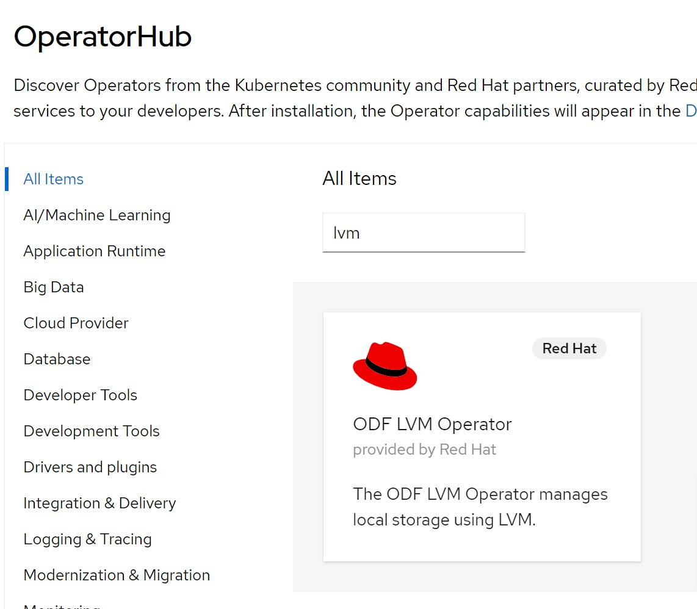

# openshift 4.10 single node, post-install, lvm and nfs


# install [lvm operator](https://github.com/red-hat-storage/lvm-operator)

we need local storage, and we are single node openshift, so we use lvm operator, find the operator from operator hub and install :

  

lvm operator is in TP, so it is buggy, we need some fix.

```bash

# oc create ns lvm-operator-system

cat << EOF > /data/install/lvm-operator.yaml
---
apiVersion: v1
kind: Namespace
metadata:
  name: lvm-operator-system
  annotations:
    workload.openshift.io/allowed: management
---
apiVersion: operators.coreos.com/v1
kind: OperatorGroup
metadata:
  name: lvm-operator-system
  namespace: lvm-operator-system
spec:
  targetNamespaces:
  - lvm-operator-system
---
apiVersion: operators.coreos.com/v1alpha1
kind: Subscription
metadata:
  name: odf-lvm-operator
  namespace: lvm-operator-system
spec:
  channel: "stable-4.10"
  installPlanApproval: Manual
  name: odf-lvm-operator
  source: redhat-operators
  sourceNamespace: openshift-marketplace
EOF
oc create -f /data/install/lvm-operator.yaml

# oc delete -f /data/install/lvm-operator.yaml


ssh -tt core@192.168.7.13 -- lsblk
# NAME   MAJ:MIN RM   SIZE RO TYPE MOUNTPOINT
# sr0     11:0    1  1024M  0 rom
# vda    252:0    0   120G  0 disk
# ├─vda1 252:1    0     1M  0 part
# ├─vda2 252:2    0   127M  0 part
# ├─vda3 252:3    0   384M  0 part /boot
# └─vda4 252:4    0 119.5G  0 part /sysroot
# vdb    252:16   0   100G  0 disk

oc adm policy add-cluster-role-to-user cluster-admin system:serviceaccount:lvm-operator-system:topolvm-controller -n lvm-operator-system

oc adm policy add-cluster-role-to-user cluster-admin system:serviceaccount:lvm-operator-system:vg-manager -n lvm-operator-system

oc adm policy add-cluster-role-to-user cluster-admin system:serviceaccount:lvm-operator-system:topolvm-node -n lvm-operator-system

cat << EOF > /data/install/lvm.op.yaml
apiVersion: lvm.topolvm.io/v1alpha1
kind: LVMCluster
metadata:
  name: lvmcluster-sample
spec:
  storage:
    deviceClasses:
    - name: vg1
    #   thinPoolConfig:
    #     name: thin-pool-1
    #     sizePercent: 50
    #     overprovisionRatio: 50
EOF
oc create -n lvm-operator-system -f /data/install/lvm.op.yaml

kubectl patch storageclass odf-lvm-vg1 -p '{"metadata": {"annotations":{"storageclass.kubernetes.io/is-default-class":"true"}}}'
```

# install nfs service inside cluster

- [NFS Ganesha server and external provisioner](https://github.com/kubernetes-sigs/nfs-ganesha-server-and-external-provisioner)

```bash


```
