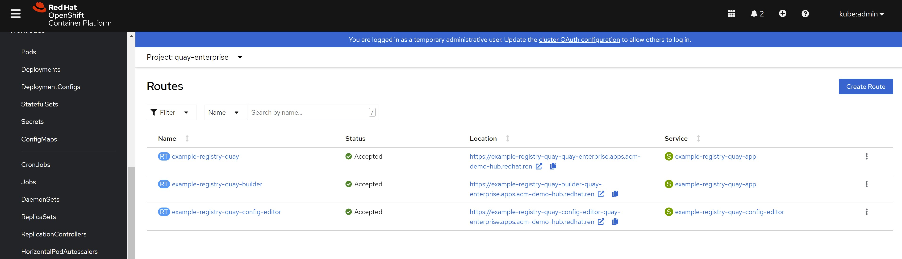

# openshift 4.10, single node with quay

我们已经可以在 single node 上面启动ceph存储，那么我们就来部署一个quay试试吧，quay需要 object storage ( s3 )，所以之前没有办法做测试。

官方文档:
- [Deploy Red Hat Quay on OpenShift with the Quay Operator](https://access.redhat.com/documentation/en-us/red_hat_quay/3.7/html/deploy_red_hat_quay_on_openshift_with_the_quay_operator/index)

```bash

cd /data/install

# 创建quay需要的namespace
oc create ns quay-enterprise
oc project quay-enterprise

# 参考官方文档，配置quay的安装配置
cat << EOF > /data/install/config.yaml
FEATURE_QUOTA_MANAGEMENT: true
FEATURE_BUILD_SUPPORT: true
FEATURE_PROXY_CACHE: true
FEATURE_STORAGE_REPLICATION: true
DEFAULT_SYSTEM_REJECT_QUOTA_BYTES: 102400000

FEATURE_USER_INITIALIZE: true
BROWSER_API_CALLS_XHR_ONLY: false
SUPER_USERS:
- quayadmin
FEATURE_USER_CREATION: false

DISTRIBUTED_STORAGE_CONFIG:
  default:
    - RHOCSStorage
    - access_key: $AWS_ACCESS_KEY_ID
      bucket_name: $BUCKET_NAME
      hostname: $AWS_HOST
      is_secure: false
      port: "80"
      secret_key: $AWS_SECRET_ACCESS_KEY
      storage_path: /datastorage/registry
DISTRIBUTED_STORAGE_DEFAULT_LOCATIONS: []
DISTRIBUTED_STORAGE_PREFERENCE:
  - default
EOF

oc create secret generic --from-file config.yaml=./config.yaml config-bundle-secret
# oc delete secret config-bundle-secret -n quay-enterprise

cat << EOF > /data/install/quay-registry.yaml
apiVersion: quay.redhat.com/v1
kind: QuayRegistry
metadata:
  name: example-registry
  namespace: quay-enterprise
spec:
  configBundleSecret: config-bundle-secret
  components:
    - kind: quay
      managed: true
    - kind: postgres
      managed: true
    - kind: clair
      managed: true
    - kind: redis
      managed: true
    - kind: horizontalpodautoscaler
      managed: false
    - kind: objectstorage
      managed: false
    - kind: route
      managed: true
    - kind: mirror
      managed: false
    - kind: monitoring
      managed: true
    - kind: tls
      managed: true
    - kind: clairpostgres
      managed: true
EOF

oc create -n quay-enterprise -f /data/install/quay-registry.yaml

# oc delete -n quay-enterprise -f /data/install/quay-registry.yaml

# create the first user
curl -X POST -k  https://example-registry-quay-quay-enterprise.apps.acm-demo-hub.redhat.ren//api/v1/user/initialize --header 'Content-Type: application/json' --data '{ "username": "quayadmin", "password":"redhat123", "email": "quayadmin@example.com", "access_token": true}'


```
我们已经可以访问quay的界面了，但是openshift的quay版本，有一个quay自动配置的应用，可以在安装之后，继续配置quay.

