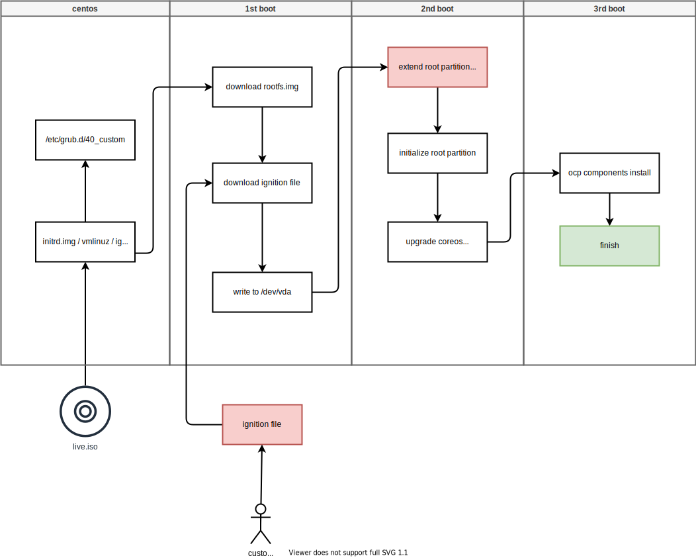

# openshift 4.10 UPI, centos 开始安装, 2块小硬盘

本文记录一次愁人的PoC，客户是vmware平台，模板做出来的是centos7，更愁人的是，sda是40G，sdb是60G。我们知道，从centos7是可以启动coreos 启动程序的，但是ocp要求第一块硬盘最少100G，否则重启开始安装的时候，根分区展开就报错了。

好在，[官方文档](https://docs.openshift.com/container-platform/4.10/installing/installing_bare_metal/installing-bare-metal.html#installation-user-infra-machines-advanced_disk_installing-bare-metal)，记录了把/var分区，挂载到sdb上的方法，但是他只说了master, worker，没说关机的bootstrap。本文就记录一下这次坑爹的PoC。

本文记录的是PoC之前，在lab里面模拟进行安装的过程。

以下是installer的安装逻辑流程图，个人的理解，不一定准确：



视频讲解

[<kbd></kbd>](https://www.bilibili.com/video/BV1i3411g7i3)

- [bilibili](https://www.bilibili.com/video/BV1i3411g7i3)
- [youtube](https://youtu.be/7U-5yW9UZZQ)

# in-lab test


## pre setup

```bash

NODE_SSH_KEY="$(cat ~/.ssh/id_rsa.pub)"
INSTALL_IMAGE_REGISTRY=quaylab.infra.redhat.ren:8443

PULL_SECRET='{"auths":{"registry.redhat.io": {"auth": "ZHVtbXk6ZHVtbXk=","email": "noemail@localhost"},"registry.ocp4.redhat.ren:5443": {"auth": "ZHVtbXk6ZHVtbXk=","email": "noemail@localhost"},"'${INSTALL_IMAGE_REGISTRY}'": {"auth": "'$( echo -n 'admin:shadowman' | openssl base64 )'","email": "noemail@localhost"}}}'

NTP_SERVER=192.168.7.11
HELP_SERVER=192.168.7.11
KVM_HOST=192.168.7.11
API_VIP=192.168.7.100
INGRESS_VIP=192.168.7.101
CLUSTER_PROVISION_IP=192.168.7.103
BOOTSTRAP_IP=192.168.7.12

ACM_DEMO_MNGED_CLUSTER=acm-demo-man01
ACM_DEMO_MNGED_SNO_IP=192.168.7.23

echo $PULL_SECRET

# 定义单节点集群的节点信息
SNO_CLUSTER_NAME=acm-demo-hub
SNO_BASE_DOMAIN=redhat.ren
SNO_IP=192.168.7.13
SNO_GW=192.168.7.11
SNO_NETMAST=255.255.255.0
SNO_NETMAST_S=24
SNO_HOSTNAME=acm-demo-hub-master
SNO_IF=enp1s0
SNO_IF_MAC=`printf '00:60:2F:%02X:%02X:%02X' $[RANDOM%256] $[RANDOM%256] $[RANDOM%256]`
SNO_DNS=192.168.7.11
SNO_DISK=/dev/vda
SNO_CORE_PWD=redhat

echo ${SNO_IF_MAC} > /data/sno/sno.mac


cat << EOF > /data/ocp4/ocp4-upi-helpernode-master/vars.yaml
---
ocp_version: 4.10.15
ssh_gen_key: false
staticips: true
bm_ipi: false
firewalld: false
dns_forward: true
iso:
  iso_dl_url: "file:///data/ocp4/rhcos-live.x86_64.iso"
  my_iso: "rhcos-live.iso"
helper:
  name: "helper"
  ipaddr: "${HELP_SERVER}"
  networkifacename: "baremetal"
  gateway: "${SNO_GW}"
  netmask: "${SNO_NETMAST}"
dns:
  domain: "$SNO_BASE_DOMAIN"
  clusterid: "ocp4"
  forwarder1: "172.21.1.1"
  forwarder2: "172.21.1.1"
  api_vip: "${API_VIP}"
  ingress_vip: "${INGRESS_VIP}"
bootstrap:
  name: "bootstrap"
  ipaddr: "${BOOTSTRAP_IP}"
  interface: "enp1s0"
  install_drive: "vda"
masters:
  - name: "master-0"
    ipaddr: "192.168.7.13"
    interface: "enp1s0"
    install_drive: "vda"
  - name: "master-1"
    ipaddr: "192.168.7.14"
    interface: "enp1s0"
    install_drive: "vda"
  - name: "master-2"
    ipaddr: "192.168.7.15"
    interface: "enp1s0"
    install_drive: "vda"
workers:
  - name: "worker-0"
    ipaddr: "192.168.7.16"
    interface: "enp1s0"
    install_drive: "vda"
  - name: "worker-1"
    ipaddr: "192.168.7.17"
    interface: "enp1s0"
    install_drive: "vda"
  - name: "worker-2"
    ipaddr: "192.168.7.18"
    interface: "enp1s0"
    install_drive: "vda"
others:
  - name: "registry"
    ipaddr: "192.168.7.103"
  - name: "yum"
    ipaddr: "172.21.6.103"
  - name: "quay"
    ipaddr: "172.21.6.103"
  - name: "nexus"
    ipaddr: "172.21.6.103"
  - name: "git"
    ipaddr: "172.21.6.103"
otherdomains:
  - domain: "infra.redhat.ren"
    hosts:
    - name: "registry"
      ipaddr: "192.168.7.11"
    - name: "yum"
      ipaddr: "192.168.7.11"
    - name: "quay"
      ipaddr: "192.168.7.11"
    - name: "quaylab"
      ipaddr: "192.168.7.11"
    - name: "nexus"
      ipaddr: "192.168.7.11"
    - name: "git"
      ipaddr: "192.168.7.11"
  - domain: "${ACM_DEMO_MNGED_CLUSTER}.${SNO_BASE_DOMAIN}"
    hosts:
    - name: "api"
      ipaddr: "${ACM_DEMO_MNGED_SNO_IP}"
    - name: "api-int"
      ipaddr: "${ACM_DEMO_MNGED_SNO_IP}"
    - name: "${ACM_DEMO_MNGED_CLUSTER}-master"
      ipaddr: "${ACM_DEMO_MNGED_SNO_IP}"
    - name: "*.apps"
      ipaddr: "${ACM_DEMO_MNGED_SNO_IP}"
  - domain: "${SNO_CLUSTER_NAME}.${SNO_BASE_DOMAIN}"
    hosts:
    - name: "api"
      ipaddr: "${SNO_IP}"
    - name: "api-int"
      ipaddr: "${SNO_IP}"
    - name: "${SNO_CLUSTER_NAME}-master"
      ipaddr: "${SNO_IP}"
    - name: "*.apps"
      ipaddr: "${SNO_IP}"
force_ocp_download: false
remove_old_config_files: false
ocp_client: "file:///data/ocp4/{{ ocp_version }}/openshift-client-linux-{{ ocp_version }}.tar.gz"
ocp_installer: "file:///data/ocp4/{{ ocp_version }}/openshift-install-linux-{{ ocp_version }}.tar.gz"
ppc64le: false
arch: 'x86_64'
chronyconfig:
  enabled: true
  content:
    - server: "${NTP_SERVER}"
      options: iburst
setup_registry: # don't worry about this, just leave it here
  deploy: false
  registry_image: docker.io/library/registry:2
  local_repo: "ocp4/openshift4"
  product_repo: "openshift-release-dev"
  release_name: "ocp-release"
  release_tag: "4.6.1-x86_64"
ocp_filetranspiler: "file:///data/ocp4/filetranspiler.tgz"

EOF

cd /data/ocp4/ocp4-upi-helpernode-master
ansible-playbook -e @vars.yaml -e '{ staticips: true, bm_ipi: false }'  tasks/main.yml


mkdir -p /data/install
cd /data/install

/bin/rm -rf *.ign .openshift_install_state.json auth bootstrap manifests master*[0-9] worker*[0-9] 

cat << EOF > /data/install/install-config.yaml 
apiVersion: v1
baseDomain: $SNO_BASE_DOMAIN
compute:
- name: worker
  replicas: 0 
controlPlane:
  name: master
  replicas: 3 
metadata:
  name: ocp4
networking:
  # OVNKubernetes , OpenShiftSDN
  networkType: OVNKubernetes
  clusterNetwork:
  - cidr: 10.128.0.0/14
    hostPrefix: 23
  serviceNetwork:
  - 172.30.0.0/16
platform:
  none: {}
pullSecret: '${PULL_SECRET}'
sshKey: |
$( cat /root/.ssh/id_rsa.pub | sed 's/^/   /g' )
additionalTrustBundle: |
$( cat /etc/crts/redhat.ren.ca.crt | sed 's/^/   /g' )
imageContentSources:
- mirrors:
  - ${INSTALL_IMAGE_REGISTRY}/ocp4/openshift4
  source: quay.io/openshift-release-dev/ocp-release
- mirrors:
  - ${INSTALL_IMAGE_REGISTRY}/ocp4/openshift4
  source: quay.io/openshift-release-dev/ocp-v4.0-art-dev
EOF

openshift-install create manifests --dir=/data/install

/bin/cp -f  /data/ocp4/ocp4-upi-helpernode-master/machineconfig/* /data/install/openshift/

# copy image registry proxy related config
cd /data/ocp4
bash image.registries.conf.sh nexus.infra.redhat.ren:8083

/bin/cp -f /data/ocp4/image.registries.conf /etc/containers/registries.conf.d/

/bin/cp -f /data/ocp4/99-worker-container-registries.yaml /data/install/openshift
/bin/cp -f /data/ocp4/99-master-container-registries.yaml /data/install/openshift

cat << EOF > /data/install/98-worker-var-partition.bu
variant: openshift
version: 4.10.0
metadata:
  labels:
    machineconfiguration.openshift.io/role: worker
  name: 98-worker-var-partition
storage:
  disks:
  - device: /dev/vdb
    partitions:
    - label: var
      start_mib: 0
      size_mib: 0
  filesystems:
    - device: /dev/disk/by-partlabel/var
      path: /var
      format: xfs
      mount_options: [defaults, prjquota] 
      with_mount_unit: true
EOF

cat << EOF > /data/install/98-master-var-partition.bu
variant: openshift
version: 4.10.0
metadata:
  labels:
    machineconfiguration.openshift.io/role: master
  name: 98-master-var-partition
storage:
  disks:
  - device: /dev/vdb
    partitions:
    - label: var
      start_mib: 0
      size_mib: 0
  filesystems:
    - device: /dev/disk/by-partlabel/var
      path: /var
      format: xfs
      mount_options: [defaults, prjquota] 
      with_mount_unit: true
EOF

butane /data/install/98-worker-var-partition.bu -o /data/install/openshift/98-worker-var-partition.yaml
butane /data/install/98-master-var-partition.bu -o /data/install/openshift/98-master-var-partition.yaml

cd /data/install/

openshift-install create ignition-configs --dir=/data/install

cd /data/ocp4/ocp4-upi-helpernode-master
# 我们来为每个主机，复制自己版本的ign，并复制到web server的目录下
ansible-playbook -e @vars.yaml tasks/ign.yml

# /bin/cp -f bootstrap-in-place-for-live-iso.ign iso.ign

```

## for bootstrap

we find out the bootstrap needs 4C 4G, so, generally, 4C 8G is ok for bootstrap

```bash

cat << EOF > /data/install/root-partition.fc
variant: fcos
version: 1.3.0
storage:
  disks:
  - device: /dev/vdb
    partitions:
    - label: var
      start_mib: 0
      size_mib: 0
  filesystems:
    - device: /dev/disk/by-partlabel/var
      path: /var
      format: xfs
      mount_options: [defaults, prjquota] 
      with_mount_unit: true
EOF

butane /data/install/root-partition.fc -r -o /data/install/partition-ric.ign

# 我们会创建一个wzh用户，密码是redhat，这个可以在第一次启动的是，从console/ssh直接用用户名口令登录
# 方便排错和研究
VAR_PWD_HASH="$(python3 -c 'import crypt,getpass; print(crypt.crypt("redhat"))')"

# tmppath=$(mktemp)
cat /var/www/html/ignition/bootstrap.ign \
  | jq --arg VAR "$VAR_PWD_HASH" --arg VAR_SSH "$NODE_SSH_KEY" '.passwd.users += [{ "name": "wzh", "system": true, "passwordHash": $VAR , "sshAuthorizedKeys": [ $VAR_SSH ], "groups": [ "adm", "wheel", "sudo", "systemd-journal"  ] }]' \
  | jq -c . \
  > /var/www/html/ignition/bootstrap.ign.user

    # | jq --argjson VAR "$VAR_99_master_master_static_hostname_2" '.storage.files += [$VAR] ' \

jq -s '.[0] * .[1]' /var/www/html/ignition/bootstrap.ign.user /data/install/partition-ric.ign | jq -c . > /data/install/bootstrap.ign.partition

jq -s '.[0].systemd.units + .[1].systemd.units' /var/www/html/ignition/bootstrap.ign.user /data/install/bootstrap.ign.partition > /data/install/bootstrap.ign.part.units

# jq -c '.systemd.units' /var/www/html/ignition/bootstrap.ign.user > /data/install/bootstrap.ign.part.units

VAR_CONTENT=`cat /data/install/bootstrap.ign.part.units`
# VAR_CONTENT=`jq -c '.systemd.units' /var/www/html/ignition/bootstrap.ign.user`

cat /data/install/bootstrap.ign.partition \
    | jq --argjson VAR "$VAR_CONTENT" '.systemd.units = $VAR' \
    | jq -c . \
    > /var/www/html/ignition/bootstrap.ign.new

# jump to other document here, if you want to customize the ignition file for partition and user
# then comeback

# go to kvm host

sed -i '0,/^network.*/s/^network.*/network  --bootproto=static --device=eth0 --gateway=192.168.7.1 --ip=192.168.7.12  --netmask=255.255.255.0 --nameserver=192.168.7.11  --ipv6=auto --activate/' helper-ks.cfg

virsh destroy ocp4-bootstrap
virsh undefine ocp4-bootstrap

create_lv() {
    var_vg=$1
    var_pool=$2
    var_lv=$3
    var_size=$4
    var_action=$5
    lvremove -f $var_vg/$var_lv
    # lvcreate -y -L $var_size -n $var_lv $var_vg
    if [ "$var_action" == "recreate" ]; then
      lvcreate --type thin -n $var_lv -V $var_size --thinpool $var_vg/$var_pool
      wipefs --all --force /dev/$var_vg/$var_lv
    fi
}

create_lv vgdata poolA lv-ocp4-boostrap-dummy 40G recreate
create_lv vgdata poolA lv-ocp4-boostrap 100G recreate

virt-install --name="ocp4-bootstrap" --vcpus=4 --ram=$((8*1024)) \
    --cpu=host-model \
    --disk path=/dev/vgdata/lv-ocp4-boostrap-dummy,device=disk,bus=virtio,format=raw \
    --disk path=/dev/vgdata/lv-ocp4-boostrap,device=disk,bus=virtio,format=raw \
    --os-variant rhel8.5 --network bridge=baremetal,model=virtio \
    --graphics vnc,port=59000 \
    --boot menu=on --location /data/kvm/CentOS-7-x86_64-Minimal-1810.iso \
    --initrd-inject helper-ks.cfg --extra-args "inst.ks=file:/helper-ks.cfg" 


SNO_IP=192.168.7.12

# copy rhcos-live.x86_64.iso to centos
ssh-copy-id root@$SNO_IP

mount -o ro /data/ocp4/rhcos-live.x86_64.iso /mnt

scp /mnt/images/pxeboot/{initrd.img,vmlinuz} root@$SNO_IP:/boot/
scp /mnt/images/ignition.img root@$SNO_IP:/boot/

# goto centos
ssh root@$SNO_IP

SNO_IP=192.168.7.12
SNO_GW=192.168.7.11
SNO_NETMAST=255.255.255.0
SNO_HOSTNAME=bootstrap
SNO_IF=enp1s0
SNO_DNS=192.168.7.11
SNO_DISK=/dev/vda
SNO_ROOTFS=http://192.168.7.11:8080/install/rootfs.img
SNO_IGN=http://192.168.7.11:8080/ignition/bootstrap.ign.new

cat << EOF >> /etc/grub.d/40_custom
menuentry 'coreos' --class fedora --class gnu-linux --class gnu --class os {
    insmod gzio
    insmod part_msdos
    insmod xfs
    set root='hd0,msdos1'
    echo  'Loading coreos kernel ...'
    linux /vmlinuz coreos.inst=yes coreos.inst.install_dev=$SNO_DISK coreos.inst.ignition_url=$SNO_IGN rd.neednet=1 coreos.live.rootfs_url=$SNO_ROOTFS  ip=$SNO_IP::$SNO_GW:$SNO_NETMAST:$SNO_HOSTNAME:$SNO_IF:none nameserver=$SNO_DNS ignition.firstboot ignition.platform.id=metal
    echo  'Loading coreos initrd ...'
    initrd /initrd.img
}
EOF

sed -i 's/^GRUB_DEFAULT=.*/GRUB_DEFAULT="coreos"/' /etc/default/grub 

grub2-mkconfig -o /etc/grub2.cfg

reboot

```

## for master-0

```bash

# 我们会创建一个wzh用户，密码是redhat，这个可以在第一次启动的是，从console/ssh直接用用户名口令登录
# 方便排错和研究
VAR_PWD_HASH="$(python3 -c 'import crypt,getpass; print(crypt.crypt("redhat"))')"

# tmppath=$(mktemp)
cat /var/www/html/ignition/master-0.ign \
  | jq --arg VAR "$VAR_PWD_HASH" --arg VAR_SSH "$NODE_SSH_KEY" '.passwd.users += [{ "name": "wzh", "system": true, "passwordHash": $VAR , "sshAuthorizedKeys": [ $VAR_SSH ], "groups": [ "adm", "wheel", "sudo", "systemd-journal"  ] }]' \
  | jq -c . \
  > /var/www/html/ignition/master-0.ign.new

# jump to other document here, if you want to customize the ignition file for partition and user
# then comeback

# go to kvm host

sed '0,/^network.*/s/^network.*/network  --bootproto=static --device=eth0 --gateway=192.168.7.1 --ip=192.168.7.13  --netmask=255.255.255.0 --nameserver=192.168.7.11  --ipv6=auto --activate/' helper-ks.cfg > helper-ks-master-0.cfg

virsh destroy ocp4-master-0
virsh undefine ocp4-master-0

create_lv() {
    var_vg=$1
    var_pool=$2
    var_lv=$3
    var_size=$4
    var_action=$5
    lvremove -f $var_vg/$var_lv
    # lvcreate -y -L $var_size -n $var_lv $var_vg
    if [ "$var_action" == "recreate" ]; then
      lvcreate --type thin -n $var_lv -V $var_size --thinpool $var_vg/$var_pool
      wipefs --all --force /dev/$var_vg/$var_lv
    fi
}

create_lv vgdata poolA lv-ocp4-master-0-dummy 40G recreate
create_lv vgdata poolA lv-ocp4-master-0 100G recreate

virt-install --name="ocp4-master-0" --vcpus=8 --ram=$((16*1024)) \
    --cpu=host-model \
    --disk path=/dev/vgdata/lv-ocp4-master-0-dummy,device=disk,bus=virtio,format=raw \
    --disk path=/dev/vgdata/lv-ocp4-master-0,device=disk,bus=virtio,format=raw \
    --os-variant rhel8.5 --network bridge=baremetal,model=virtio \
    --graphics vnc,port=59001 \
    --boot menu=on --location /data/kvm/CentOS-7-x86_64-Minimal-1810.iso \
    --initrd-inject helper-ks-master-0.cfg --extra-args "inst.ks=file:/helper-ks-master-0.cfg" 

SNO_IP=192.168.7.13

# copy rhcos-live.x86_64.iso to centos
ssh-copy-id root@$SNO_IP

mount -o ro /data/ocp4/rhcos-live.x86_64.iso /mnt

scp /mnt/images/pxeboot/{initrd.img,vmlinuz} root@$SNO_IP:/boot/
scp /mnt/images/ignition.img root@$SNO_IP:/boot/

# goto centos
ssh root@$SNO_IP

SNO_IP=192.168.7.13
SNO_GW=192.168.7.11
SNO_NETMAST=255.255.255.0
SNO_HOSTNAME=master-0
SNO_IF=enp1s0
SNO_DNS=192.168.7.11
SNO_DISK=/dev/vda
SNO_ROOTFS=http://192.168.7.11:8080/install/rootfs.img
SNO_IGN=http://192.168.7.11:8080/ignition/master-0.ign.new

cat << EOF >> /etc/grub.d/40_custom
menuentry 'coreos' --class fedora --class gnu-linux --class gnu --class os {
    insmod gzio
    insmod part_msdos
    insmod xfs
    set root='hd0,msdos1'
    echo  'Loading coreos kernel ...'
    linux /vmlinuz coreos.inst=yes coreos.inst.install_dev=$SNO_DISK coreos.inst.ignition_url=$SNO_IGN rd.neednet=1 coreos.live.rootfs_url=$SNO_ROOTFS  ip=$SNO_IP::$SNO_GW:$SNO_NETMAST:$SNO_HOSTNAME:$SNO_IF:none nameserver=$SNO_DNS ignition.firstboot ignition.platform.id=metal
    echo  'Loading coreos initrd ...'
    initrd /initrd.img
}
EOF

sed -i 's/^GRUB_DEFAULT=.*/GRUB_DEFAULT="coreos"/' /etc/default/grub 

grub2-mkconfig -o /etc/grub2.cfg

reboot


```

## for master-1

```bash

# 我们会创建一个wzh用户，密码是redhat，这个可以在第一次启动的是，从console/ssh直接用用户名口令登录
# 方便排错和研究
VAR_PWD_HASH="$(python3 -c 'import crypt,getpass; print(crypt.crypt("redhat"))')"

# tmppath=$(mktemp)
cat /var/www/html/ignition/master-1.ign \
  | jq --arg VAR "$VAR_PWD_HASH" --arg VAR_SSH "$NODE_SSH_KEY" '.passwd.users += [{ "name": "wzh", "system": true, "passwordHash": $VAR , "sshAuthorizedKeys": [ $VAR_SSH ], "groups": [ "adm", "wheel", "sudo", "systemd-journal"  ] }]' \
  | jq -c . \
  > /var/www/html/ignition/master-1.ign.new

# jump to other document here, if you want to customize the ignition file for partition and user
# then comeback

# go to kvm host

sed '0,/^network.*/s/^network.*/network  --bootproto=static --device=eth0 --gateway=192.168.7.1 --ip=192.168.7.14  --netmask=255.255.255.0 --nameserver=192.168.7.11  --ipv6=auto --activate/' helper-ks.cfg > helper-ks-master-1.cfg

virsh destroy ocp4-master-1
virsh undefine ocp4-master-1

create_lv() {
    var_vg=$1
    var_pool=$2
    var_lv=$3
    var_size=$4
    var_action=$5
    lvremove -f $var_vg/$var_lv
    # lvcreate -y -L $var_size -n $var_lv $var_vg
    if [ "$var_action" == "recreate" ]; then
      lvcreate --type thin -n $var_lv -V $var_size --thinpool $var_vg/$var_pool
      wipefs --all --force /dev/$var_vg/$var_lv
    fi
}

create_lv vgdata poolA lv-ocp4-master-1-dummy 40G recreate
create_lv vgdata poolA lv-ocp4-master-1 100G recreate

virt-install --name="ocp4-master-1" --vcpus=8 --ram=$((16*1024)) \
    --cpu=host-model \
    --disk path=/dev/vgdata/lv-ocp4-master-1-dummy,device=disk,bus=virtio,format=raw \
    --disk path=/dev/vgdata/lv-ocp4-master-1,device=disk,bus=virtio,format=raw \
    --os-variant rhel8.5 --network bridge=baremetal,model=virtio \
    --graphics vnc,port=59002 \
    --boot menu=on --location /data/kvm/CentOS-7-x86_64-Minimal-1810.iso \
    --initrd-inject helper-ks-master-1.cfg --extra-args "inst.ks=file:/helper-ks-master-1.cfg" 

SNO_IP=192.168.7.14

# copy rhcos-live.x86_64.iso to centos
ssh-copy-id root@$SNO_IP

mount -o ro /data/ocp4/rhcos-live.x86_64.iso /mnt

scp /mnt/images/pxeboot/{initrd.img,vmlinuz} root@$SNO_IP:/boot/
scp /mnt/images/ignition.img root@$SNO_IP:/boot/

# goto centos
ssh root@$SNO_IP

SNO_IP=192.168.7.14
SNO_GW=192.168.7.11
SNO_NETMAST=255.255.255.0
SNO_HOSTNAME=master-1
SNO_IF=enp1s0
SNO_DNS=192.168.7.11
SNO_DISK=/dev/vda
SNO_ROOTFS=http://192.168.7.11:8080/install/rootfs.img
SNO_IGN=http://192.168.7.11:8080/ignition/master-1.ign.new

cat << EOF >> /etc/grub.d/40_custom
menuentry 'coreos' --class fedora --class gnu-linux --class gnu --class os {
    insmod gzio
    insmod part_msdos
    insmod xfs
    set root='hd0,msdos1'
    echo  'Loading coreos kernel ...'
    linux /vmlinuz coreos.inst=yes coreos.inst.install_dev=$SNO_DISK coreos.inst.ignition_url=$SNO_IGN rd.neednet=1 coreos.live.rootfs_url=$SNO_ROOTFS  ip=$SNO_IP::$SNO_GW:$SNO_NETMAST:$SNO_HOSTNAME:$SNO_IF:none nameserver=$SNO_DNS ignition.firstboot ignition.platform.id=metal
    echo  'Loading coreos initrd ...'
    initrd /initrd.img
}
EOF

sed -i 's/^GRUB_DEFAULT=.*/GRUB_DEFAULT="coreos"/' /etc/default/grub 

grub2-mkconfig -o /etc/grub2.cfg

reboot


```

## for master-2

```bash

# 我们会创建一个wzh用户，密码是redhat，这个可以在第一次启动的是，从console/ssh直接用用户名口令登录
# 方便排错和研究
VAR_PWD_HASH="$(python3 -c 'import crypt,getpass; print(crypt.crypt("redhat"))')"

# tmppath=$(mktemp)
cat /var/www/html/ignition/master-2.ign \
  | jq --arg VAR "$VAR_PWD_HASH" --arg VAR_SSH "$NODE_SSH_KEY" '.passwd.users += [{ "name": "wzh", "system": true, "passwordHash": $VAR , "sshAuthorizedKeys": [ $VAR_SSH ], "groups": [ "adm", "wheel", "sudo", "systemd-journal"  ] }]' \
  | jq -c . \
  > /var/www/html/ignition/master-2.ign.new

# jump to other document here, if you want to customize the ignition file for partition and user
# then comeback

# go to kvm host

sed '0,/^network.*/s/^network.*/network  --bootproto=static --device=eth0 --gateway=192.168.7.1 --ip=192.168.7.15  --netmask=255.255.255.0 --nameserver=192.168.7.11  --ipv6=auto --activate/' helper-ks.cfg > helper-ks-master-2.cfg

virsh destroy ocp4-master-2
virsh undefine ocp4-master-2

create_lv() {
    var_vg=$1
    var_pool=$2
    var_lv=$3
    var_size=$4
    var_action=$5
    lvremove -f $var_vg/$var_lv
    # lvcreate -y -L $var_size -n $var_lv $var_vg
    if [ "$var_action" == "recreate" ]; then
      lvcreate --type thin -n $var_lv -V $var_size --thinpool $var_vg/$var_pool
      wipefs --all --force /dev/$var_vg/$var_lv
    fi
}

create_lv vgdata poolA lv-ocp4-master-2-dummy 40G recreate
create_lv vgdata poolA lv-ocp4-master-2 100G recreate

virt-install --name="ocp4-master-2" --vcpus=8 --ram=$((16*1024)) \
    --cpu=host-model \
    --disk path=/dev/vgdata/lv-ocp4-master-2-dummy,device=disk,bus=virtio,format=raw \
    --disk path=/dev/vgdata/lv-ocp4-master-2,device=disk,bus=virtio,format=raw \
    --os-variant rhel8.5 --network bridge=baremetal,model=virtio \
    --graphics vnc,port=59003 \
    --boot menu=on --location /data/kvm/CentOS-7-x86_64-Minimal-1810.iso \
    --initrd-inject helper-ks-master-2.cfg --extra-args "inst.ks=file:/helper-ks-master-2.cfg" 


SNO_IP=192.168.7.15

# copy rhcos-live.x86_64.iso to centos
ssh-copy-id root@$SNO_IP

mount -o ro /data/ocp4/rhcos-live.x86_64.iso /mnt

scp /mnt/images/pxeboot/{initrd.img,vmlinuz} root@$SNO_IP:/boot/
scp /mnt/images/ignition.img root@$SNO_IP:/boot/

# goto centos
ssh root@$SNO_IP

SNO_IP=192.168.7.15
SNO_GW=192.168.7.11
SNO_NETMAST=255.255.255.0
SNO_HOSTNAME=master-2
SNO_IF=enp1s0
SNO_DNS=192.168.7.11
SNO_DISK=/dev/vda
SNO_ROOTFS=http://192.168.7.11:8080/install/rootfs.img
SNO_IGN=http://192.168.7.11:8080/ignition/master-2.ign.new

cat << EOF >> /etc/grub.d/40_custom
menuentry 'coreos' --class fedora --class gnu-linux --class gnu --class os {
    insmod gzio
    insmod part_msdos
    insmod xfs
    set root='hd0,msdos1'
    echo  'Loading coreos kernel ...'
    linux /vmlinuz coreos.inst=yes coreos.inst.install_dev=$SNO_DISK coreos.inst.ignition_url=$SNO_IGN rd.neednet=1 coreos.live.rootfs_url=$SNO_ROOTFS  ip=$SNO_IP::$SNO_GW:$SNO_NETMAST:$SNO_HOSTNAME:$SNO_IF:none nameserver=$SNO_DNS ignition.firstboot ignition.platform.id=metal
    echo  'Loading coreos initrd ...'
    initrd /initrd.img
}
EOF

sed -i 's/^GRUB_DEFAULT=.*/GRUB_DEFAULT="coreos"/' /etc/default/grub 

grub2-mkconfig -o /etc/grub2.cfg

reboot


```


## final step

```bash
cd /data/install
openshift-install wait-for bootstrap-complete --log-level debug


cd /data/install
openshift-install wait-for install-complete --log-level debug
# INFO Install complete!
# INFO To access the cluster as the system:admin user when using 'oc', run 'export KUBECONFIG=/data/install/auth/kubeconfig'
# INFO Access the OpenShift web-console here: https://console-openshift-console.apps.ocp4.redhat.ren
# INFO Login to the console with user: "kubeadmin", and password: "vP4y3-PEuHJ-PrAVj-E5zRm"
# DEBUG Time elapsed per stage:
# DEBUG Cluster Operators: 1s
# INFO Time elapsed: 1s

```

## nfs storage

```bash
# on vultr
podman pull k8s.gcr.io/sig-storage/nfs-subdir-external-provisioner:v4.0.2

podman tag  k8s.gcr.io/sig-storage/nfs-subdir-external-provisioner:v4.0.2   quay.io/wangzheng422/qimgs:nfs-subdir-external-provisioner-v4.0.2

podman push quay.io/wangzheng422/qimgs:nfs-subdir-external-provisioner-v4.0.2

# hack nfs-provisioner-deployment.yaml.j2
vi nfs-provisioner-deployment.yaml.j2
# quay.io/wangzheng422/qimgs:nfs-subdir-external-provisioner-v4.0.2

# hack /usr/local/src/nfs-provisioner-deployment.yaml
vi /usr/local/src/nfs-provisioner-deployment.yaml


bash /data/ocp4/ocp4-upi-helpernode-master/files/nfs-provisioner-setup.sh

```

## for worker-0

```bash

# 我们会创建一个wzh用户，密码是redhat，这个可以在第一次启动的是，从console/ssh直接用用户名口令登录
# 方便排错和研究
VAR_PWD_HASH="$(python3 -c 'import crypt,getpass; print(crypt.crypt("redhat"))')"

# tmppath=$(mktemp)
cat /var/www/html/ignition/worker-0.ign \
  | jq --arg VAR "$VAR_PWD_HASH" --arg VAR_SSH "$NODE_SSH_KEY" '.passwd.users += [{ "name": "wzh", "system": true, "passwordHash": $VAR , "sshAuthorizedKeys": [ $VAR_SSH ], "groups": [ "adm", "wheel", "sudo", "systemd-journal"  ] }]' \
  | jq -c . \
  > /var/www/html/ignition/worker-0.ign.new

# jump to other document here, if you want to customize the ignition file for partition and user
# then comeback

# go to kvm host

sed '0,/^network.*/s/^network.*/network  --bootproto=static --device=eth0 --gateway=192.168.7.1 --ip=192.168.7.16  --netmask=255.255.255.0 --nameserver=192.168.7.11  --ipv6=auto --activate/' helper-ks.cfg > helper-ks-worker-0.cfg

virsh destroy ocp4-worker-0
virsh undefine ocp4-worker-0

create_lv() {
    var_vg=$1
    var_pool=$2
    var_lv=$3
    var_size=$4
    var_action=$5
    lvremove -f $var_vg/$var_lv
    # lvcreate -y -L $var_size -n $var_lv $var_vg
    if [ "$var_action" == "recreate" ]; then
      lvcreate --type thin -n $var_lv -V $var_size --thinpool $var_vg/$var_pool
      wipefs --all --force /dev/$var_vg/$var_lv
    fi
}

create_lv vgdata poolA lv-ocp4-worker-0-dummy 40G recreate
create_lv vgdata poolA lv-ocp4-worker-0 100G recreate

virt-install --name="ocp4-worker-0" --vcpus=4 --ram=$((8*1024)) \
    --cpu=host-model \
    --disk path=/dev/vgdata/lv-ocp4-worker-0-dummy,device=disk,bus=virtio,format=raw \
    --disk path=/dev/vgdata/lv-ocp4-worker-0,device=disk,bus=virtio,format=raw \
    --os-variant rhel8.5 --network bridge=baremetal,model=virtio \
    --graphics vnc,port=59004 \
    --boot menu=on --location /data/kvm/CentOS-7-x86_64-Minimal-1810.iso \
    --initrd-inject helper-ks-worker-0.cfg --extra-args "inst.ks=file:/helper-ks-worker-0.cfg" 

SNO_IP=192.168.7.16

# copy rhcos-live.x86_64.iso to centos
ssh-copy-id root@$SNO_IP

mount -o ro /data/ocp4/rhcos-live.x86_64.iso /mnt

scp /mnt/images/pxeboot/{initrd.img,vmlinuz} root@$SNO_IP:/boot/
scp /mnt/images/ignition.img root@$SNO_IP:/boot/

# goto centos
ssh root@$SNO_IP

SNO_IP=192.168.7.16
SNO_GW=192.168.7.11
SNO_NETMAST=255.255.255.0
SNO_HOSTNAME=worker-0
SNO_IF=enp1s0
SNO_DNS=192.168.7.11
SNO_DISK=/dev/vda
SNO_ROOTFS=http://192.168.7.11:8080/install/rootfs.img
SNO_IGN=http://192.168.7.11:8080/ignition/worker-0.ign.new

cat << EOF >> /etc/grub.d/40_custom
menuentry 'coreos' --class fedora --class gnu-linux --class gnu --class os {
    insmod gzio
    insmod part_msdos
    insmod xfs
    set root='hd0,msdos1'
    echo  'Loading coreos kernel ...'
    linux /vmlinuz coreos.inst=yes coreos.inst.install_dev=$SNO_DISK coreos.inst.ignition_url=$SNO_IGN rd.neednet=1 coreos.live.rootfs_url=$SNO_ROOTFS  ip=$SNO_IP::$SNO_GW:$SNO_NETMAST:$SNO_HOSTNAME:$SNO_IF:none nameserver=$SNO_DNS ignition.firstboot ignition.platform.id=metal
    echo  'Loading coreos initrd ...'
    initrd /initrd.img
}
EOF

sed -i 's/^GRUB_DEFAULT=.*/GRUB_DEFAULT="coreos"/' /etc/default/grub 

grub2-mkconfig -o /etc/grub2.cfg

reboot


```


## for worker-1

```bash

# 我们会创建一个wzh用户，密码是redhat，这个可以在第一次启动的是，从console/ssh直接用用户名口令登录
# 方便排错和研究
VAR_PWD_HASH="$(python3 -c 'import crypt,getpass; print(crypt.crypt("redhat"))')"

# tmppath=$(mktemp)
cat /var/www/html/ignition/worker-1.ign \
  | jq --arg VAR "$VAR_PWD_HASH" --arg VAR_SSH "$NODE_SSH_KEY" '.passwd.users += [{ "name": "wzh", "system": true, "passwordHash": $VAR , "sshAuthorizedKeys": [ $VAR_SSH ], "groups": [ "adm", "wheel", "sudo", "systemd-journal"  ] }]' \
  | jq -c . \
  > /var/www/html/ignition/worker-1.ign.new

# jump to other document here, if you want to customize the ignition file for partition and user
# then comeback

# go to kvm host

sed '0,/^network.*/s/^network.*/network  --bootproto=static --device=eth0 --gateway=192.168.7.1 --ip=192.168.7.17  --netmask=255.255.255.0 --nameserver=192.168.7.11  --ipv6=auto --activate/' helper-ks.cfg > helper-ks-worker-1.cfg

virsh destroy ocp4-worker-1
virsh undefine ocp4-worker-1

create_lv() {
    var_vg=$1
    var_pool=$2
    var_lv=$3
    var_size=$4
    var_action=$5
    lvremove -f $var_vg/$var_lv
    # lvcreate -y -L $var_size -n $var_lv $var_vg
    if [ "$var_action" == "recreate" ]; then
      lvcreate --type thin -n $var_lv -V $var_size --thinpool $var_vg/$var_pool
      wipefs --all --force /dev/$var_vg/$var_lv
    fi
}

create_lv vgdata poolA lv-ocp4-worker-1-dummy 40G recreate
create_lv vgdata poolA lv-ocp4-worker-1 100G recreate

virt-install --name="ocp4-worker-1" --vcpus=4 --ram=$((8*1024)) \
    --cpu=host-model \
    --disk path=/dev/vgdata/lv-ocp4-worker-1-dummy,device=disk,bus=virtio,format=raw \
    --disk path=/dev/vgdata/lv-ocp4-worker-1,device=disk,bus=virtio,format=raw \
    --os-variant rhel8.5 --network bridge=baremetal,model=virtio \
    --graphics vnc,port=59005 \
    --boot menu=on --location /data/kvm/CentOS-7-x86_64-Minimal-1810.iso \
    --initrd-inject helper-ks-worker-1.cfg --extra-args "inst.ks=file:/helper-ks-worker-1.cfg" 

SNO_IP=192.168.7.17

# copy rhcos-live.x86_64.iso to centos
ssh-copy-id root@$SNO_IP

mount -o ro /data/ocp4/rhcos-live.x86_64.iso /mnt

scp /mnt/images/pxeboot/{initrd.img,vmlinuz} root@$SNO_IP:/boot/
scp /mnt/images/ignition.img root@$SNO_IP:/boot/

# goto centos
ssh root@$SNO_IP

SNO_IP=192.168.7.17
SNO_GW=192.168.7.11
SNO_NETMAST=255.255.255.0
SNO_HOSTNAME=worker-1
SNO_IF=enp1s0
SNO_DNS=192.168.7.11
SNO_DISK=/dev/vda
SNO_ROOTFS=http://192.168.7.11:8080/install/rootfs.img
SNO_IGN=http://192.168.7.11:8080/ignition/worker-1.ign.new

cat << EOF >> /etc/grub.d/40_custom
menuentry 'coreos' --class fedora --class gnu-linux --class gnu --class os {
    insmod gzio
    insmod part_msdos
    insmod xfs
    set root='hd0,msdos1'
    echo  'Loading coreos kernel ...'
    linux /vmlinuz coreos.inst=yes coreos.inst.install_dev=$SNO_DISK coreos.inst.ignition_url=$SNO_IGN rd.neednet=1 coreos.live.rootfs_url=$SNO_ROOTFS  ip=$SNO_IP::$SNO_GW:$SNO_NETMAST:$SNO_HOSTNAME:$SNO_IF:none nameserver=$SNO_DNS ignition.firstboot ignition.platform.id=metal
    echo  'Loading coreos initrd ...'
    initrd /initrd.img
}
EOF

sed -i 's/^GRUB_DEFAULT=.*/GRUB_DEFAULT="coreos"/' /etc/default/grub 

grub2-mkconfig -o /etc/grub2.cfg

reboot


```


## for worker-2

```bash

# 我们会创建一个wzh用户，密码是redhat，这个可以在第一次启动的是，从console/ssh直接用用户名口令登录
# 方便排错和研究
VAR_PWD_HASH="$(python3 -c 'import crypt,getpass; print(crypt.crypt("redhat"))')"

# tmppath=$(mktemp)
cat /var/www/html/ignition/worker-2.ign \
  | jq --arg VAR "$VAR_PWD_HASH" --arg VAR_SSH "$NODE_SSH_KEY" '.passwd.users += [{ "name": "wzh", "system": true, "passwordHash": $VAR , "sshAuthorizedKeys": [ $VAR_SSH ], "groups": [ "adm", "wheel", "sudo", "systemd-journal"  ] }]' \
  | jq -c . \
  > /var/www/html/ignition/worker-2.ign.new

# jump to other document here, if you want to customize the ignition file for partition and user
# then comeback

# go to kvm host

sed '0,/^network.*/s/^network.*/network  --bootproto=static --device=eth0 --gateway=192.168.7.1 --ip=192.168.7.18  --netmask=255.255.255.0 --nameserver=192.168.7.11  --ipv6=auto --activate/' helper-ks.cfg > helper-ks-worker-2.cfg

virsh destroy ocp4-worker-2
virsh undefine ocp4-worker-2

create_lv() {
    var_vg=$1
    var_pool=$2
    var_lv=$3
    var_size=$4
    var_action=$5
    lvremove -f $var_vg/$var_lv
    # lvcreate -y -L $var_size -n $var_lv $var_vg
    if [ "$var_action" == "recreate" ]; then
      lvcreate --type thin -n $var_lv -V $var_size --thinpool $var_vg/$var_pool
      wipefs --all --force /dev/$var_vg/$var_lv
    fi
}

create_lv vgdata poolA lv-ocp4-worker-2-dummy 40G recreate
create_lv vgdata poolA lv-ocp4-worker-2 100G recreate

virt-install --name="ocp4-worker-2" --vcpus=4 --ram=$((8*1024)) \
    --cpu=host-model \
    --disk path=/dev/vgdata/lv-ocp4-worker-2-dummy,device=disk,bus=virtio,format=raw \
    --disk path=/dev/vgdata/lv-ocp4-worker-2,device=disk,bus=virtio,format=raw \
    --os-variant rhel8.5 --network bridge=baremetal,model=virtio \
    --graphics vnc,port=59006 \
    --boot menu=on --location /data/kvm/CentOS-7-x86_64-Minimal-1810.iso \
    --initrd-inject helper-ks-worker-2.cfg --extra-args "inst.ks=file:/helper-ks-worker-2.cfg" 

SNO_IP=192.168.7.18

# copy rhcos-live.x86_64.iso to centos
ssh-copy-id root@$SNO_IP

mount -o ro /data/ocp4/rhcos-live.x86_64.iso /mnt

scp /mnt/images/pxeboot/{initrd.img,vmlinuz} root@$SNO_IP:/boot/
scp /mnt/images/ignition.img root@$SNO_IP:/boot/

# goto centos
ssh root@$SNO_IP

SNO_IP=192.168.7.18
SNO_GW=192.168.7.11
SNO_NETMAST=255.255.255.0
SNO_HOSTNAME=worker-2
SNO_IF=enp1s0
SNO_DNS=192.168.7.11
SNO_DISK=/dev/vda
SNO_ROOTFS=http://192.168.7.11:8080/install/rootfs.img
SNO_IGN=http://192.168.7.11:8080/ignition/worker-2.ign.new

cat << EOF >> /etc/grub.d/40_custom
menuentry 'coreos' --class fedora --class gnu-linux --class gnu --class os {
    insmod gzio
    insmod part_msdos
    insmod xfs
    set root='hd0,msdos1'
    echo  'Loading coreos kernel ...'
    linux /vmlinuz coreos.inst=yes coreos.inst.install_dev=$SNO_DISK coreos.inst.ignition_url=$SNO_IGN rd.neednet=1 coreos.live.rootfs_url=$SNO_ROOTFS  ip=$SNO_IP::$SNO_GW:$SNO_NETMAST:$SNO_HOSTNAME:$SNO_IF:none nameserver=$SNO_DNS ignition.firstboot ignition.platform.id=metal
    echo  'Loading coreos initrd ...'
    initrd /initrd.img
}
EOF

sed -i 's/^GRUB_DEFAULT=.*/GRUB_DEFAULT="coreos"/' /etc/default/grub 

grub2-mkconfig -o /etc/grub2.cfg

reboot


```

## approve csr

```bash

oc get csr -ojson | jq -r '.items[] | select(.status == {} ) | .metadata.name' | xargs oc adm certificate approve

```

## deploy acm

```bash

oc label node master-0 deploy-acm=true
oc label node master-1 deploy-acm=true
oc label node master-2 deploy-acm=true

oc new ns open-cluster-management

cat << EOF > /data/install/acm.og.yaml
---
apiVersion: operators.coreos.com/v1
kind: OperatorGroup
metadata:
  name:  open-cluster-management-wzh
  namespace: open-cluster-management
spec:
  targetNamespaces:
    - open-cluster-management
EOF
oc create -f /data/install/acm.og.yaml

oc get OperatorGroup -n open-cluster-management

# oc delete -f /data/install/acm.og.yaml

cat << EOF > /data/install/acm.subscript.yaml
---
apiVersion: operators.coreos.com/v1alpha1
kind: Subscription
metadata:
  name: advanced-cluster-management
spec:
  config:
    nodeSelector:
      deploy-acm: "true"
  channel: release-2.4
  installPlanApproval: Manual
  name: advanced-cluster-management
  source: redhat-operators
  sourceNamespace: openshift-marketplace
EOF
oc create -f /data/install/acm.subscript.yaml -n open-cluster-management

oc get Subscription.operators.coreos.com/advanced-cluster-management -n open-cluster-management

# oc delete -f /data/install/acm.subscript.yaml -n open-cluster-management

# RHACM create the MultiClusterHub resource

cat << EOF > /data/install/acm.mch.mch.yaml
apiVersion: operator.open-cluster-management.io/v1
kind: MultiClusterHub
metadata:
  name: multiclusterhub
  namespace: open-cluster-management
spec:
  nodeSelector:
    deploy-acm: "true"
EOF
oc create -f /data/install/acm.mch.mch.yaml

```

