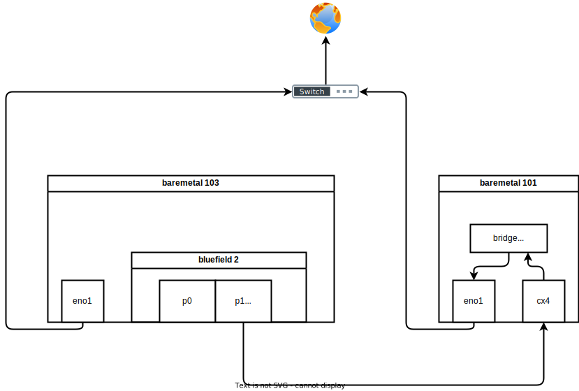

# openshift 4.11 BF2 offload

- [OVN/OVS offloading with OpenShift on NVIDIA BlueField-2 DPUs](https://access.redhat.com/articles/6804281)

bf2 network connection diagram:



# fresh BF2 with official ubuntu os 

- [Installing Red Hat Enterprise Linux on NVIDIA BlueField-2 DPU](https://developers.redhat.com/articles/2021/10/18/sensitive-information-detection-using-nvidia-morpheus-ai-framework#setting_up_nvidia_netq_agent_on_nvidia_bluefield_2_dpu)

```bash


# https://bugzilla.redhat.com/show_bug.cgi?id=1814682
dnf install -y kernel-modules-extra psmisc

mkdir -p /data/down/
cd /data/down/

dnf install -y rshim expect wget minicom rpm-build lshw
systemctl enable --now rshim
systemctl status rshim --no-pager -l

dnf install -y openssl-devel mstflint

# nat router on host
# https://access.redhat.com/discussions/4642721
cat << EOF >> /etc/sysctl.d/99-wzh-sysctl.conf

net.ipv4.ip_forward = 1

EOF
sysctl --system

systemctl disable --now firewalld

# download bfb from here
# https://developer.nvidia.com/networking/doca
# and docs here
# https://docs.nvidia.com/networking/display/BlueFieldDPUOSLatest/Deploying+BlueField+Software+Using+BFB+from+Host
wget -O bf2.bfb https://content.mellanox.com/BlueField/BFBs/Ubuntu20.04/DOCA_1.5.1_BSP_3.9.3_Ubuntu_20.04-4.2211-LTS.signed.bfb

cat bf2.bfb > /dev/rshim0/boot

# if you want to connect to bf2 through serial console
minicom --color on --baudrate 115200 --device /dev/rshim0/console

# on console of bf2
# login using ubuntu / ubuntu

# upgrade fw
/opt/mellanox/mlnx-fw-updater/mlnx_fw_updater.pl

mlxconfig -d /dev/mst/mt41686_pciconf0 -y reset

mlxconfig -d /dev/mst/mt41686_pciconf0  s LINK_TYPE_P1=2 LINK_TYPE_P2=2

# power off and on machine.

grep -s -H "" /sys/class/net/*/phys_port_name
# /sys/class/net/en3f0pf0sf0/phys_port_name:pf0sf0
# /sys/class/net/en3f1pf1sf0/phys_port_name:pf1sf0
# /sys/class/net/enp3s0f0s0/phys_port_name:p0
# /sys/class/net/enp3s0f1s0/phys_port_name:p0
# /sys/class/net/p0/phys_port_name:p0
# /sys/class/net/p1/phys_port_name:p1
# /sys/class/net/pf0hpf/phys_port_name:pf0
# /sys/class/net/pf1hpf/phys_port_name:pf1

# on 101
nmcli con add type bridge-slave ifname enp7s0f1np1 master baremetal
nmcli con up baremetal

# on 103, bf2
cat /etc/netplan/60-mlnx.yaml
# network:
#   ethernets:
#     enp3s0f0s0:
#       renderer: networkd
#       dhcp4: 'true'
#     enp3s0f1s0:
#       renderer: networkd
#       dhcp4: 'true'
#   version: 2

cat << EOF > /etc/netplan/60-mlnx.yaml
network:
  ethernets:
    enp3s0f0s0:
      renderer: networkd
      dhcp4: 'true'
    enp3s0f1s0:
      renderer: networkd
      dhcp4: no
      addresses:
        - 192.168.7.113/24
      gateway4: 192.168.7.9
      nameservers:
          addresses: [114.114.114.114]
  version: 2
EOF

netplan apply

# login on 101
ssh ubuntu@192.168.7.113


```

# flash BF2 with rocky linux 8

we need to get ifname, so we have to flash it with rocky linux 8

```bash

# shell come frome https://github.com/wangzheng422/rhel-on-bf2
# download rhel8.6 install iso from  
# https://mirrors.nju.edu.cn/rocky/8/isos/aarch64/Rocky-8.7-aarch64-minimal.iso
export RHEL_ISO=Rocky-8.7-aarch64-minimal.iso
bash bluefield_provision.sh -s
# === STATUS === Checking usability of SRIOV for PCI 0000:05:00.0
# SRIOV enabled
# EMBEDDED_CPU mode enabled
# === STATUS === Checking usability of SRIOV for PCI 0000:05:00.1
# SRIOV enabled
# EMBEDDED_CPU mode enabled

setenforce 0

# bash bluefield_provision.sh -p

iptables -F
bash ./PXE_setup_RHEL_install_over_mlx.sh -i "${RHEL_ISO}" -p tmfifo -k RHEL8-bluefield.ks

uplink_interface="$(ip route |grep ^default | sed 's/.*dev \([^ ]\+\).*/\1/')"
test -n "${uplink_interface}" || die "need a default route"
    
iptables -t nat -A POSTROUTING -o "${uplink_interface}" -j MASQUERADE

# on a new terminal
minicom --color on --baudrate 115200 --device /dev/rshim0/console

# change back to original terminal
# to reboot the bf2
echo BOOT_MODE 1 > /dev/rshim0/misc
echo SW_RESET 1 > /dev/rshim0/misc

sleep 10
nmcli conn up tmfifo_net0
systemctl restart dhcpd

iptables -t nat -A POSTROUTING -o "${uplink_interface}" -j MASQUERADE

# and see result on com console
# and press 'ESC' to see bios console
# and select 'Boot Manager'
# select EFI network with following content


```
see result on com console, press 'ESC' to see bios console


select 'Boot Manager'


select EFI network with following content


```
MAC(001ACAFFFF01,0x1)/
IPv4(0.0.0.0)
```
in our env, it is 'EFI Network 8'


select the item , and it will boot through pxe and install os

```bash
# [   21.067341] IPv6: ADDRCONF(NETDEV_CHANGE): enp3s0f1: link becomes ready

# on host, disable services
systemctl disable --now dhcpd httpd vsftpd tftp.socket tftp

# on bf2 console
# login using root / bluefield

nmcli con modify System\ eth0 con-name eth0
nmcli con modify eth0 ipv4.method manual ipv4.addresses 192.168.100.2/24 ipv4.gateway 192.168.100.1 ipv4.dns 172.21.1.1
nmcli con up eth0
```

# install ocp cluster on kvm on 102


