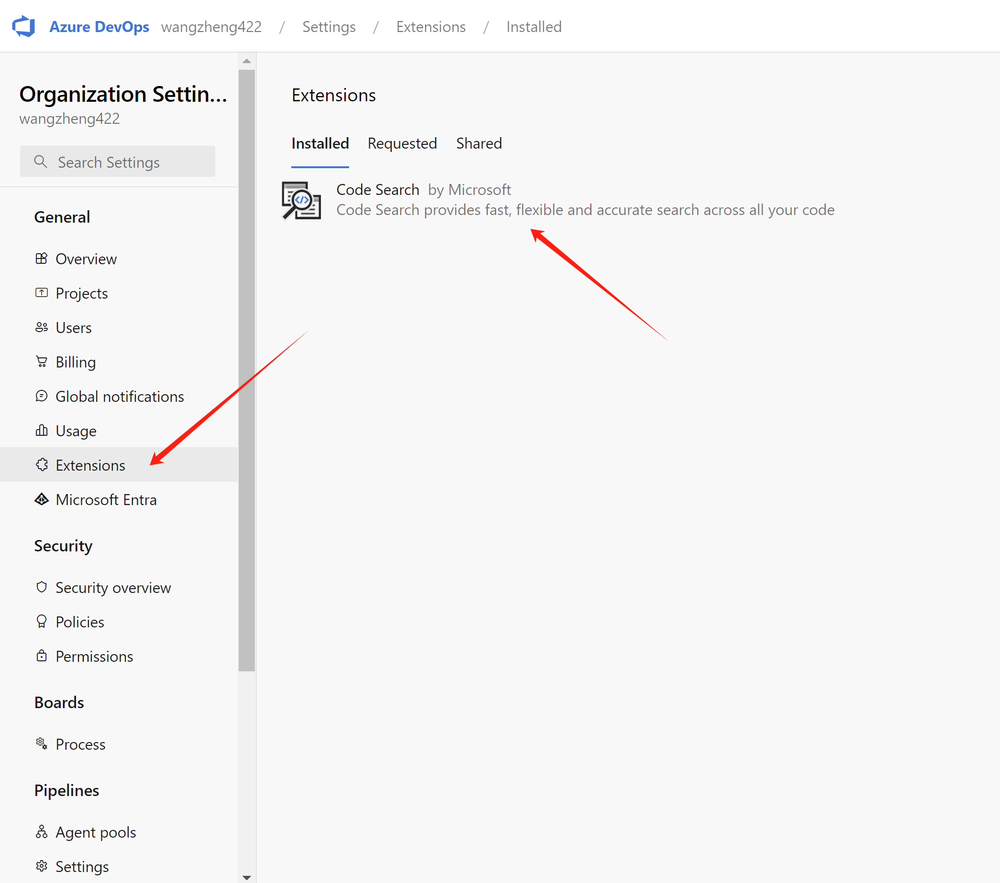

# redhat developer hub


# deploy using demo.redhat.com

try with demo.redhat.com instance:

- [Red Hat Developer Hub Demo](https://demo.redhat.com/catalog?item=babylon-catalog-prod/enterprise.red-hat-developer-hub-demo.prod&utm_source=webapp&utm_medium=share-link)
  - using the 'latest' version

After deploy, the version can be found at helm:


# install plugin

## Azure DevOps Discovery Plugin

- https://backstage.io/docs/integrations/azure/discovery

create azure devops service in :
- https://azure.microsoft.com/en-us/products/devops

create a personal access token:


update the azure devops integration in the backstage:

```bash
oc get cm -n backstage
# NAME                                 DATA   AGE
# backstage-bucket-claim               5      2d2h
# backstage-developer-hub-app-config   1      2d2h
# config-service-cabundle              1      2d3h
# config-trusted-cabundle              1      2d3h
# dynamic-plugins                      1      2d2h
# keycloak-operator-lock               0      2d2h
# keycloak-probes                      2      2d2h
# kube-root-ca.crt                     1      2d3h
# openshift-service-ca.crt             1      2d3h
```

you can see from the dynamic-plugins, azure plugin is disabled

```yaml
data:
  dynamic-plugins.yaml: |
    includes:
    - dynamic-plugins.default.yaml
    plugins:
    - disabled: false
      package: ./dynamic-plugins/dist/backstage-plugin-azure-devops
    - disabled: false
      package: ./dynamic-plugins/dist/backstage-plugin-azure-devops-backend-dynamic
    - disabled: false
      package: ./dynamic-plugins/dist/backstage-plugin-scaffolder-backend-module-azure-dynamic
```

update the content of cm `backstage-developer-hub-app-config`:
```yaml

integrations:
  azure:
    - host: dev.azure.com
      credentials:
        - personalAccessToken: ${PERSONAL_ACCESS_TOKEN}

```

In this lab, RHDP is gitopts installed, so find in gitlab, and change the content, both plugins and integrations.
- https://gitlab-gitlab.apps.cluster-kh8kp.sandbox594.opentlc.com/gitops/janus-idp-gitops/-/blob/main/charts/backstage/backstage-values.yaml


In gitlab webconsole, create merge request to branch main, and merge.

Then, from gitops operator view, update the target version. We do this just for trigger the configmap to update, it seems there is bug in gitops, the configmap is not updated if only update the git repo.


Wait sometime, you can see the plugin is enable in RHDP


Install Code Search Feature for Azure devops
- [Visual Studio Marketplace.](https://marketplace.visualstudio.com/items?itemName=ms.vss-code-search&targetId=f9352dac-ba6e-434e-9241-a848a510ce3f&utm_source=vstsproduct&utm_medium=SearchExtStatus)




update the catalog config, in the same way, update gitlab, and merge the request, then update the deployment through gitops operator.

```yaml
catalog:
  providers:
    azureDevOps:
      yourProviderId: # identifies your dataset / provider independent of config changes
        organization: wangzheng422
        project: demo
        repository: service-* # this will match all repos starting with service-*
        path: /catalog-info.yaml
        schedule: # optional; same options as in TaskScheduleDefinition
          # supports cron, ISO duration, "human duration" as used in code
          frequency: { minutes: 30 }
          # supports ISO duration, "human duration" as used in code
          timeout: { minutes: 3 }

```


## hack the rhdp container image

```bash

# on vultr
podman run -it --rm --entrypoint /bin/bash registry.redhat.io/rhdh/rhdh-hub-rhel9:1.1

# in the container shell
/bin/mv .npmrc .npmrc.bak
npm install --global yarn

# rm -rf .cache
# https://gist.github.com/robwierzbowski/9fdf661341ec99c3ea0f480f99ac2ea5
echo 'registry: https://registry.npmjs.org/' >> .yarnrc
/bin/mv yarn.lock yarn.lock.bak
yarn --cwd packages/backend add @backstage/plugin-catalog-backend-module-azure

```

# end