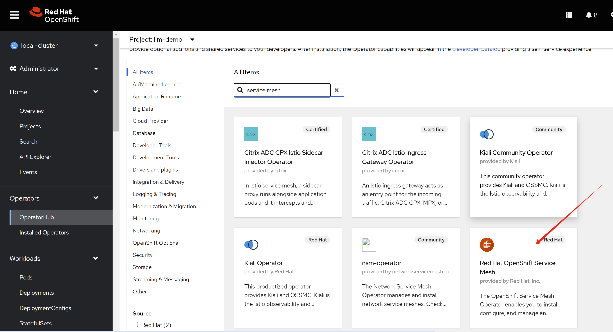
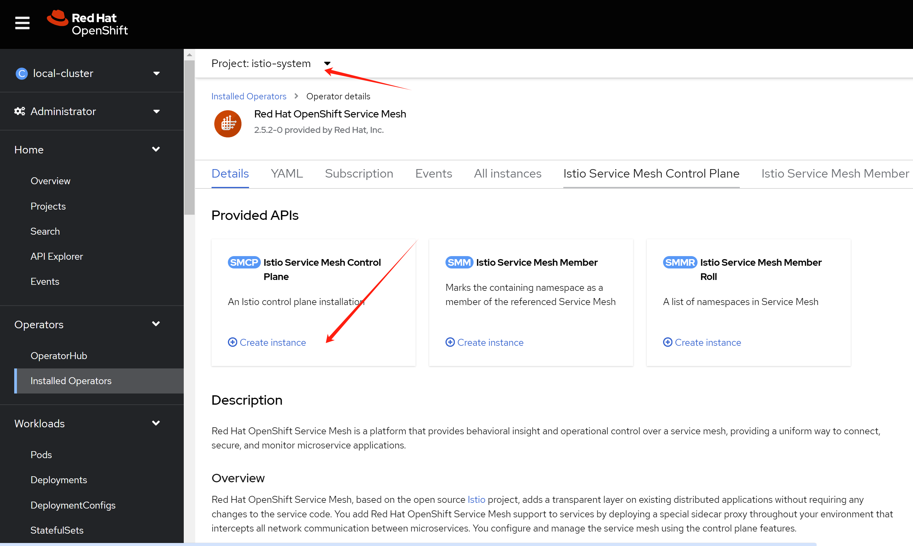
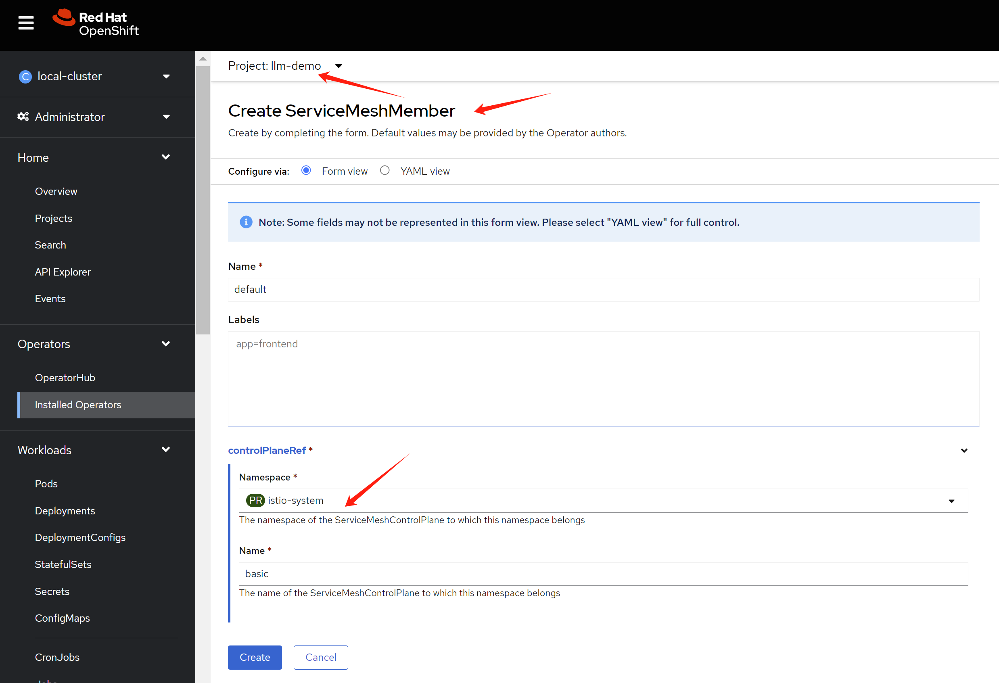

> [!CAUTION] 
> RETIRED
# (RETIRED) create a sftp pod in openshift

Customer wants to run sftp service in pod, and expose it to the internet. How can we do that? We know that the ingress only support http/https. Here we show several ways to do that.

1. macvlan
2. loadbalancer / metalLB
3. service mesh
4. customize router/haproxy deployment

# deploy the ssh pod

ssh runs on port 22, which needs speical privilege. We need to create a security context constraint to allow the pod to run as non-root user, and add the capability to bind to port 22.

We will use below git project to create a ssh pod.
- https://github.com/atmoz/sftp

The overall network architecture will be like below, it is simple, we will add more feature and security enhancement later.


```bash

oc new-project llm-demo

mkdir -p $HOME/data/install

# https://access.redhat.com/articles/6973044
# Using the legacy restricted SCC in OCP 4.11+
# do not pay attention to this, it works. :)

# we will create a new scc to allow the pod to run as root user, and add the capability to bind to port 22.
cat << EOF > $HOME/data/install/sftp-scc.yaml
apiVersion: security.openshift.io/v1
kind: SecurityContextConstraints
metadata:
  name: sftp-scc
allowPrivilegedContainer: false
allowPrivilegeEscalation: false
allowHostDirVolumePlugin: false
allowHostNetwork: false
allowHostPorts: false
allowHostPID: false
allowHostIPC: false
defaultAddCapabilities:
- CAP_NET_BIND_SERVICE
- CAP_SYS_CHROOT 
- CAP_SETGID
runAsUser:
  type: RunAsAny
seLinuxContext:
  type: MustRunAs
fsGroup:
  type: RunAsAny
supplementalGroups:
  type: RunAsAny
volumes:
- configMap
- downwardAPI
- emptyDir
- persistentVolumeClaim
- projected
- secret
EOF

oc apply -f $HOME/data/install/sftp-scc.yaml

# oc delete -f $HOME/data/install/sftp-scc.yaml

# create a new sa, and assign the scc to the sa
oc create sa sftp-sa -n llm-demo

oc adm policy add-scc-to-user sftp-scc -z sftp-sa -n llm-demo

# try to fix the legacy restricted SCC in OCP 4.11+, but it works, forget this
# export VAR_NS='llm-demo'

# oc create rolebinding local:scc:restricted -n $VAR_NS --clusterrole=system:openshift:scc:restricted  --group=system:serviceaccounts:$VAR_NS

# oc delete rolebinding local:scc:restricted -n $VAR_NS


# create pvc to hold the sftp upload files
cat << EOF > $HOME/data/install/sftp-pvc.yaml
apiVersion: v1
kind: PersistentVolumeClaim
metadata:
  name: sftp-pvc
spec:
  accessModes:
    - ReadWriteOnce
  resources:
    requests:
      storage: 1Gi
EOF

oc apply -f $HOME/data/install/sftp-pvc.yaml -n llm-demo

# we used to think we need priviledged, but we limit the capability in scc
# so do not need this
# oc label namespace llm-demo pod-security.kubernetes.io/enforce=privileged

# oc label namespace llm-demo pod-security.kubernetes.io/enforce-

# create the sftp pod
# first, create the configmap, which contains the sshd_config and users.conf
# but this should not need, because the image has the default config
# we used to hack for the pod not running, but it is not necessary right now.
cat << EOF > $HOME/data/install/sftp-pod.yaml
---
apiVersion: v1
kind: ConfigMap
metadata:
  name: sftp-conf
data:
  sshd_config: |
    # Secure defaults
    # See: https://stribika.github.io/2015/01/04/secure-secure-shell.html
    Protocol 2
    HostKey /etc/ssh/ssh_host_ed25519_key
    HostKey /etc/ssh/ssh_host_rsa_key

    # Faster connection
    # See: https://github.com/atmoz/sftp/issues/11
    UseDNS no

    # Limited access
    PermitRootLogin no
    X11Forwarding no
    AllowTcpForwarding no

    # Force sftp and chroot jail
    Subsystem sftp internal-sftp
    ForceCommand internal-sftp
    ChrootDirectory %h

    # Enable this for more logs
    # LogLevel VERBOSE
  users.conf: |
    foo:pass:1001::upload

---
apiVersion: v1
kind: Pod
metadata:
  name: sftp-pod
spec:
  serviceAccountName: sftp-sa
  containers:
  - name: sftp-container
    image: docker.io/atmoz/sftp
    securityContext:
      runAsUser: 0
      capabilities:
        add:
        - CAP_NET_BIND_SERVICE
        - CAP_SYS_CHROOT 
        - CAP_SETGID 
    volumeMounts:
    - name: sftp-volume
      mountPath: /home/
    - mountPath: /etc/sftp/users.conf
      name: conf
      subPath: users.conf
    - mountPath: /etc/ssh/sshd_config
      name: conf
      subPath: sshd_config
  volumes:
  - name: sftp-volume
    persistentVolumeClaim:
      claimName: sftp-pvc
  - configMap:
      items:
      - key: users.conf
        path: users.conf
      - key: sshd_config
        path: sshd_config
      name: sftp-conf
    name: conf
EOF

oc delete -f $HOME/data/install/sftp-pod.yaml -n llm-demo

oc apply -f $HOME/data/install/sftp-pod.yaml -n llm-demo

# oc delete -f $HOME/data/install/sftp-pod.yaml -n llm-demo

# get the pod ip
oc get pod -o json | jq -r '.items[] | select(.metadata.name | test("^sftp-pod")) | .status.podIP'
# 10.128.2.111

VAR_POD_IP=`oc get pod -o json | jq -r '.items[] | select(.metadata.name | test("^sftp-pod")) | .status.podIP' `

# we create a testing pod, to connect to the sftp pod remotely.
cat << EOF > $HOME/data/install/sftp-test-pod.yaml
---
kind: Pod
apiVersion: v1
metadata:
  name: wzh-demo-util
spec:
  # nodeSelector:
  #   kubernetes.io/hostname: 'worker-01-demo'
  restartPolicy: Always
  containers:
    - name: demo1
      image: >- 
        quay.io/wangzheng422/qimgs:rocky9-test
      env:
        - name: key
          value: value
      command: [ "/bin/bash", "-c", "--" ]
      args: [ "tail -f /dev/null" ]
      # imagePullPolicy: Always
EOF

oc delete -f ${HOME}/data/install/sftp-test-pod.yaml -n llm-demo1

oc apply -f ${HOME}/data/install/sftp-test-pod.yaml -n llm-demo

oc rsh -n llm-demo wzh-demo-util
# upload to upload directory, otherwise, it will report error on permission denied
# sftp foo@10.128.2.111

oc exec -it -n llm-demo wzh-demo-util -- sftp foo@$VAR_POD_IP

```

# expose in macvlan

macvlan is linux kernel feature, which allows you to create virtual network interfaces, which can be attached to a container. This is useful when you want to expose the container to the network directly, without going through the host network stack. There are blogs on redhat website about this:

- https://developers.redhat.com/blog/2018/10/22/introduction-to-linux-interfaces-for-virtual-networking#bonded_interface
- https://www.redhat.com/en/blog/your-guide-to-vlans-based-on-container-namespaced-interfaces-in-openshift-pods

If using macvlan, the overall network architecture will be like below:


```bash

# create macvlan config

cat << EOF > $HOME/data/install/sftp-macvlan.yaml
---
apiVersion: k8s.cni.cncf.io/v1
kind: NetworkAttachmentDefinition
metadata:
  name: sftp-macvlan
spec:
  config: |- 
    {
      "cniVersion": "0.3.1",
      "name": "sftp-macvlan",
      "type": "macvlan",
      "_master": "eth1",
      "linkInContainer": false,
      "mode": "bridge",
      "ipam": {
        "type": "static",
          "addresses": [
            {
              "address": "192.168.99.7/24",
              "_gateway": "1.1.1.1"
            }
          ]
      }
    }
---
apiVersion: k8s.cni.cncf.io/v1
kind: NetworkAttachmentDefinition
metadata:
  name: sftp-debug-macvlan
spec:
  config: |- 
    {
      "cniVersion": "0.3.1",
      "name": "sftp-debug-macvlan",
      "type": "macvlan",
      "_master": "eth1",
      "linkInContainer": false,
      "mode": "bridge",
      "ipam": {
        "type": "static",
          "addresses": [
            {
              "address": "192.168.99.8/24",
              "_gateway": "1.1.1.1"
            }
          ]
      }
    }
EOF

oc apply -f $HOME/data/install/sftp-macvlan.yaml -n llm-demo


# create the sftp pod
# first, create the configmap, which contains the sshd_config and users.conf
# but this should not need, because the image has the default config
# we used to hack for the pod not running, but it is not necessary right now.
cat << EOF > $HOME/data/install/sftp-pod.yaml
---
apiVersion: v1
kind: ConfigMap
metadata:
  name: sftp-conf
data:
  sshd_config: |
    # Secure defaults
    # See: https://stribika.github.io/2015/01/04/secure-secure-shell.html
    Protocol 2
    HostKey /etc/ssh/ssh_host_ed25519_key
    HostKey /etc/ssh/ssh_host_rsa_key

    # Faster connection
    # See: https://github.com/atmoz/sftp/issues/11
    UseDNS no

    # Limited access
    PermitRootLogin no
    X11Forwarding no
    AllowTcpForwarding no

    # Force sftp and chroot jail
    Subsystem sftp internal-sftp
    ForceCommand internal-sftp
    ChrootDirectory %h

    # Enable this for more logs
    # LogLevel VERBOSE
  users.conf: |
    foo:pass:1001::upload

---
apiVersion: v1
kind: Pod
metadata:
  name: sftp-pod
  annotations:
    k8s.v1.cni.cncf.io/networks: sftp-macvlan
spec:
  serviceAccountName: sftp-sa
  containers:
  - name: sftp-container
    image: docker.io/atmoz/sftp
    securityContext:
      runAsUser: 0
      capabilities:
        add:
        - CAP_NET_BIND_SERVICE
        - CAP_SYS_CHROOT 
        - CAP_SETGID 
    volumeMounts:
    - name: sftp-volume
      mountPath: /home/
    - mountPath: /etc/sftp/users.conf
      name: conf
      subPath: users.conf
    - mountPath: /etc/ssh/sshd_config
      name: conf
      subPath: sshd_config
  volumes:
  - name: sftp-volume
    persistentVolumeClaim:
      claimName: sftp-pvc
  - configMap:
      items:
      - key: users.conf
        path: users.conf
      - key: sshd_config
        path: sshd_config
      name: sftp-conf
    name: conf
EOF

oc delete -f $HOME/data/install/sftp-pod.yaml -n llm-demo

oc apply -f $HOME/data/install/sftp-pod.yaml -n llm-demo


# we create a testing pod, to connect to the sftp pod remotely.
cat << EOF > $HOME/data/install/sftp-test-pod.yaml
---
kind: Pod
apiVersion: v1
metadata:
  name: wzh-demo-util
  annotations:
    k8s.v1.cni.cncf.io/networks: sftp-debug-macvlan
spec:
  # nodeSelector:
  #   kubernetes.io/hostname: 'worker-01-demo'
  restartPolicy: Always
  containers:
    - name: demo1
      image: >- 
        quay.io/wangzheng422/qimgs:rocky9-test
      env:
        - name: key
          value: value
      command: [ "/bin/bash", "-c", "--" ]
      args: [ "tail -f /dev/null" ]
      # imagePullPolicy: Always
EOF

oc delete -f ${HOME}/data/install/sftp-test-pod.yaml -n llm-demo

oc apply -f ${HOME}/data/install/sftp-test-pod.yaml -n llm-demo


oc rsh -n llm-demo wzh-demo-util
# upload to upload directory, otherwise, it will report error on permission denied
# sftp foo@192.168.99.7
# sh-5.1# scp /etc/os-release foo@192.168.99.7:/upload/
# foo@192.168.99.7's password:
# os-release                                                                                                                               100%  507   636.7KB/s   00:00


```

# expose ssh service in metalLB

install the metalLB operator, and create a loadbalancer service to expose the ssh service.


Create a single instance of a MetalLB custom resource:

```yaml
apiVersion: metallb.io/v1beta1
kind: MetalLB
metadata:
  name: metallb
  namespace: metallb-system
```

config ip address pool

```yaml
apiVersion: metallb.io/v1beta1
kind: IPAddressPool
metadata:
  namespace: metallb-system
  name: sftp-pool
  labels: 
    zone: sftp
spec:
  addresses:
  - 192.168.99.20-192.168.99.23
  autoAssign: false
  avoidBuggyIPs: true
```

config for L2 advertisement

```yaml
apiVersion: metallb.io/v1beta1
kind: L2Advertisement
metadata:
  name: l2advertisement
  namespace: metallb-system
spec:
  ipAddressPools:
   - sftp-pool
```

create the pod using metalLB with service

```bash


# create the sftp pod
# first, create the configmap, which contains the sshd_config and users.conf
# but this should not need, because the image has the default config
# we used to hack for the pod not running, but it is not necessary right now.
cat << EOF > $HOME/data/install/sftp-pod.yaml
---
apiVersion: v1
kind: ConfigMap
metadata:
  name: sftp-conf
data:
  sshd_config: |
    # Secure defaults
    # See: https://stribika.github.io/2015/01/04/secure-secure-shell.html
    Protocol 2
    HostKey /etc/ssh/ssh_host_ed25519_key
    HostKey /etc/ssh/ssh_host_rsa_key

    # Faster connection
    # See: https://github.com/atmoz/sftp/issues/11
    UseDNS no

    # Limited access
    PermitRootLogin no
    X11Forwarding no
    AllowTcpForwarding no

    # Force sftp and chroot jail
    Subsystem sftp internal-sftp
    ForceCommand internal-sftp
    ChrootDirectory %h

    # Enable this for more logs
    # LogLevel VERBOSE
  users.conf: |
    foo:pass:1001::upload
---
apiVersion: v1
kind: Service
metadata:
  name: sftp-service
  annotations:
    metallb.universe.tf/address-pool: sftp-pool
spec:
  selector:
    app: sftp-pod
  ports:
  - protocol: TCP
    port: 22
    targetPort: 22
  type: LoadBalancer
  loadBalancerIP: 192.168.99.20
---
apiVersion: v1
kind: Pod
metadata:
  name: sftp-pod
  labels:
    app: sftp-pod
spec:
  serviceAccountName: sftp-sa
  containers:
  - name: sftp-container
    image: docker.io/atmoz/sftp
    securityContext:
      runAsUser: 0
      capabilities:
        add:
        - CAP_NET_BIND_SERVICE
        - CAP_SYS_CHROOT 
        - CAP_SETGID 
    volumeMounts:
    - name: sftp-volume
      mountPath: /home/
    - mountPath: /etc/sftp/users.conf
      name: conf
      subPath: users.conf
    - mountPath: /etc/ssh/sshd_config
      name: conf
      subPath: sshd_config
  volumes:
  - name: sftp-volume
    persistentVolumeClaim:
      claimName: sftp-pvc
  - configMap:
      items:
      - key: users.conf
        path: users.conf
      - key: sshd_config
        path: sshd_config
      name: sftp-conf
    name: conf
EOF

oc delete -f $HOME/data/install/sftp-pod.yaml -n llm-demo

oc apply -f $HOME/data/install/sftp-pod.yaml -n llm-demo


oc rsh -n llm-demo wzh-demo-util
# upload to upload directory, otherwise, it will report error on permission denied
# sftp foo@192.168.99.20

```

# customize router/haproxy deployment


# expose ssh service in service mesh

install service mesh operator, and also jaeger and kiali operator.



create a new project : istio-system

in this project/ns, create Istio Service Mesh Control Plane



then, go to llm-demo project, create membership



```bash
# Enable Istio's sidecar injection for the namespace where your SSH service is deployed. 
# This will automatically inject an Istio sidecar proxy alongside your SSH service.
# kubectl label namespace llm-demo istio-injection=enabled

# create the sftp pod
# first, create the configmap, which contains the sshd_config and users.conf
# but this should not need, because the image has the default config
# we used to hack for the pod not running, but it is not necessary right now.
cat << EOF > $HOME/data/install/sftp-pod.yaml
---
apiVersion: v1
kind: ConfigMap
metadata:
  name: sftp-conf
data:
  sshd_config: |
    # Secure defaults
    # See: https://stribika.github.io/2015/01/04/secure-secure-shell.html
    Protocol 2
    HostKey /etc/ssh/ssh_host_ed25519_key
    HostKey /etc/ssh/ssh_host_rsa_key

    # Faster connection
    # See: https://github.com/atmoz/sftp/issues/11
    UseDNS no

    # Limited access
    PermitRootLogin no
    X11Forwarding no
    AllowTcpForwarding no

    # Force sftp and chroot jail
    Subsystem sftp internal-sftp
    ForceCommand internal-sftp
    ChrootDirectory %h

    # Enable this for more logs
    # LogLevel VERBOSE
  users.conf: |
    foo:pass:1001::upload
---
apiVersion: v1
kind: Service
metadata:
  name: ssh-service
spec:
  ports:
  - port: 22
    targetPort: 22
    name: tcp-22
  selector:
    app: ssh-server
---
apiVersion: v1
kind: Pod
metadata:
  name: sftp-pod
  labels:
    app: ssh-server
    sidecar.istio.io/inject: 'true'
spec:
  serviceAccountName: sftp-sa
  containers:
  - name: sftp-container
    image: docker.io/atmoz/sftp
    securityContext:
      runAsUser: 0
      capabilities:
        add:
        - CAP_NET_BIND_SERVICE
        - CAP_SYS_CHROOT 
        - CAP_SETGID 
    volumeMounts:
    - name: sftp-volume
      mountPath: /home/
    - mountPath: /etc/sftp/users.conf
      name: conf
      subPath: users.conf
    - mountPath: /etc/ssh/sshd_config
      name: conf
      subPath: sshd_config
  volumes:
  - name: sftp-volume
    persistentVolumeClaim:
      claimName: sftp-pvc
  - configMap:
      items:
      - key: users.conf
        path: users.conf
      - key: sshd_config
        path: sshd_config
      name: sftp-conf
    name: conf
EOF

oc delete -f $HOME/data/install/sftp-pod.yaml -n llm-demo

oc apply -f $HOME/data/install/sftp-pod.yaml -n llm-demo


cat << EOF > $HOME/data/install/sftp-gateway.yaml
---
apiVersion: networking.istio.io/v1beta1
kind: Gateway
metadata:
  name: ssh-gateway
spec:
  selector:
    istio: ingressgateway
  servers:
  - port:
      number: 2222
      name: tcp-22
      protocol: TCP
    hosts:
    # - "sftp-demo.wzhlab.top"
    # - ooookkkkk.apps.cluster-vb8zx.sandbox1111.opentlc.com
    - "*"
  # - port:
  #     number: 80
  #     name: http-80
  #     protocol: HTTP
  #   hosts:
  #   - "sftp-demo.wzhlab.top"
  #   # - ooookkkkk.apps.cluster-vb8zx.sandbox1111.opentlc.com
---
apiVersion: networking.istio.io/v1beta1
kind: VirtualService
metadata:
  name: ssh-virtualservice
spec:
  hosts:
  # - "sftp-demo.wzhlab.top"
  # - ooookkkkk.apps.cluster-vb8zx.sandbox1111.opentlc.com
  - "*"
  gateways:
  - ssh-gateway
  tcp:
  - match:
      - port: 2222
    route:
      - destination:
          host: ssh-service
          port:
            number: 22
        weight: 100
  # http:
  # - match:
  #     - uri:
  #         prefix: "/"
  #   route:
  #     - destination:
  #         host: ssh-service
  #         port:
  #           number: 22
  #       weight: 100
EOF

oc delete -f $HOME/data/install/sftp-gateway.yaml -n llm-demo

oc apply -f $HOME/data/install/sftp-gateway.yaml -n llm-demo


oc rsh -n llm-demo wzh-demo-util
# sftp call to istio ingress gateway's pod ip (on kubeovn) at 2222 is ok
# sftp call to istio ingress gateway's service ip at 2222 is failed,
# this is because ingress gateway service does not expose tcp port 2222


oc edit IngressController -n openshift-ingress-operator
spec:
  routeAdmission:
    wildcardPolicy: WildcardsAllowed # WildcardsDisallowed # or WildcardsAllowed

```

It turn out, if you call the istio ingress gateway's pod ip (on kubeovn) at 2222, it is ok. But if you call on the ocp ingress/haproxy, it will failed. So the problem is on the external load balancer, or the ingress gateway service exposure. We currently use ocp on aws, we can try 2 options later, to confirm that.
- baremetal with metalLB, to expose the istio ingress gateway service directly to external
- baremetal, and check the router/haproxy config, to see whether it can redirect 2222 traffic to istio ingress gateway service.

Anyway, we will give up the service mesh option for now, and go back to the macvlan option, and metalLB option.


# kata to improve security

install sandbox operator


```bash

# create the sftp pod
# first, create the configmap, which contains the sshd_config and users.conf
# but this should not need, because the image has the default config
# we used to hack for the pod not running, but it is not necessary right now.
cat << EOF > $HOME/data/install/sftp-pod.yaml
---
apiVersion: v1
kind: ConfigMap
metadata:
  name: sftp-conf
data:
  sshd_config: |
    # Secure defaults
    # See: https://stribika.github.io/2015/01/04/secure-secure-shell.html
    Protocol 2
    HostKey /etc/ssh/ssh_host_ed25519_key
    HostKey /etc/ssh/ssh_host_rsa_key

    # Faster connection
    # See: https://github.com/atmoz/sftp/issues/11
    UseDNS no

    # Limited access
    PermitRootLogin no
    X11Forwarding no
    AllowTcpForwarding no

    # Force sftp and chroot jail
    Subsystem sftp internal-sftp
    ForceCommand internal-sftp
    ChrootDirectory %h

    # Enable this for more logs
    # LogLevel VERBOSE
  users.conf: |
    foo:pass:1001::upload

---
apiVersion: v1
kind: Pod
metadata:
  name: sftp-pod
  annotations:
    k8s.v1.cni.cncf.io/networks: sftp-macvlan
spec:
  serviceAccountName: sftp-sa
  runtimeClassName: kata
  containers:
  - name: sftp-container
    image: docker.io/atmoz/sftp
    securityContext:
      runAsUser: 0
      capabilities:
        add:
        - CAP_NET_BIND_SERVICE
        - CAP_SYS_CHROOT 
        - CAP_SETGID 
    volumeMounts:
    - name: sftp-volume
      mountPath: /home/
    - mountPath: /etc/sftp/users.conf
      name: conf
      subPath: users.conf
    - mountPath: /etc/ssh/sshd_config
      name: conf
      subPath: sshd_config
  volumes:
  - name: sftp-volume
    persistentVolumeClaim:
      claimName: sftp-pvc
  - configMap:
      items:
      - key: users.conf
        path: users.conf
      - key: sshd_config
        path: sshd_config
      name: sftp-conf
    name: conf
EOF

oc delete -f $HOME/data/install/sftp-pod.yaml -n llm-demo

oc apply -f $HOME/data/install/sftp-pod.yaml -n llm-demo

```


# end