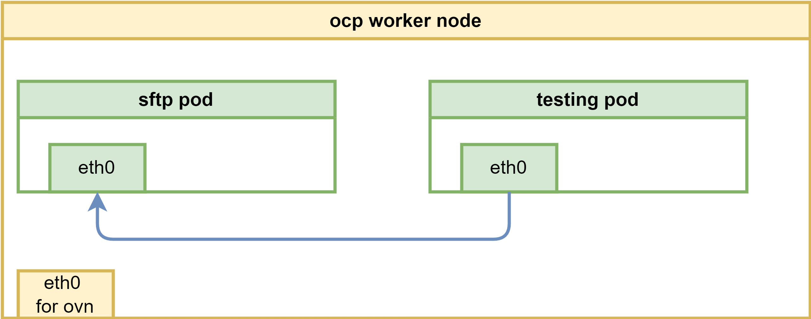
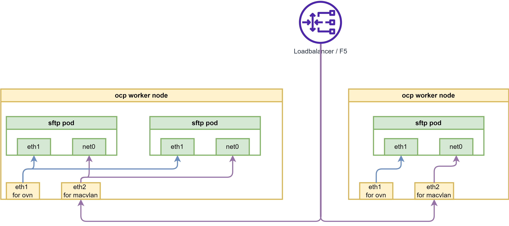
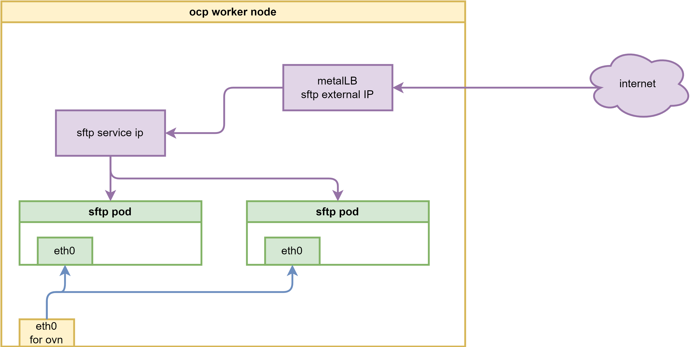
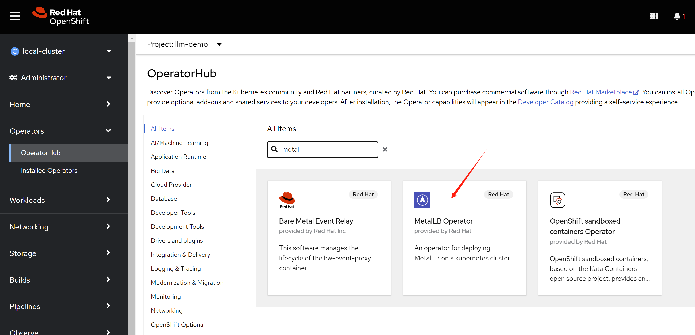
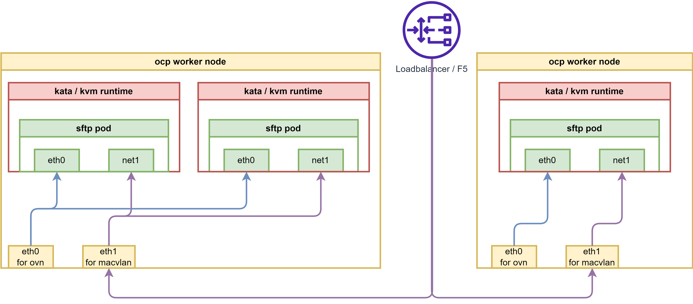
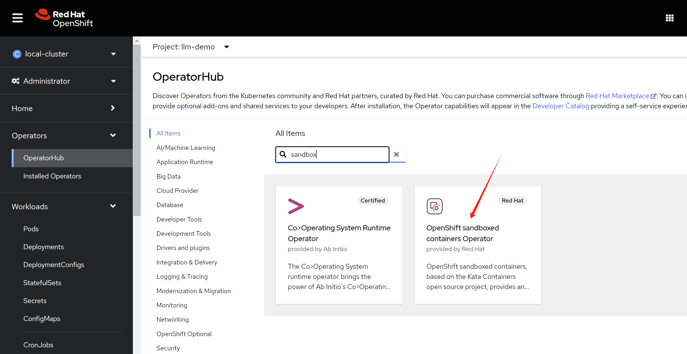
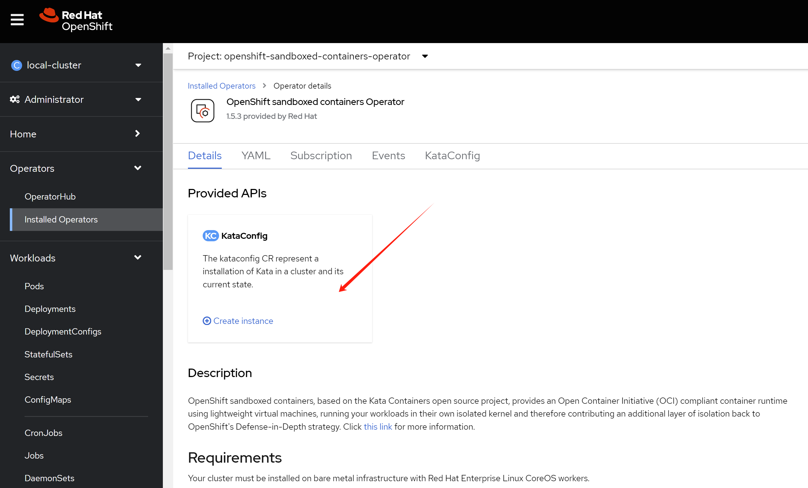

# create a sftp pod in openshift

Customer wants to run sftp service in pod, and expose it to the internet. How can we do that? We know that the ingress only support http/https. Here we show several ways to do that.

1. macvlan
2. loadbalancer / metalLB
3. enhance security with kata
4. ~~service mesh~~
5. ~~customize router/haproxy deployment~~

# deploy the ssh pod

ssh runs on port 22, which needs speical privilege. We need to create a security context constraint to allow the pod to run as root user, and add the capability to bind to port 22.

- https://github.com/wangzheng422/sftp/tree/wzh

The overall network architecture will be like below, it is simple, we will add more feature and security enhancement later.




```bash

oc new-project llm-demo

mkdir -p $HOME/data/install

# https://access.redhat.com/articles/6973044
# Using the legacy restricted SCC in OCP 4.11+
# do not pay attention to this, it works. :)

# we will create a new scc to allow the pod to run as root user, and add the capability to bind to port 22.
cat << EOF > $HOME/data/install/sftp-scc.yaml
apiVersion: security.openshift.io/v1
kind: SecurityContextConstraints
metadata:
  name: sftp-scc
allowPrivilegedContainer: false
allowPrivilegeEscalation: false
allowHostDirVolumePlugin: false
allowHostNetwork: false
allowHostPorts: false
allowHostPID: false
allowHostIPC: false
defaultAddCapabilities:
- CAP_NET_BIND_SERVICE
- CAP_SYS_CHROOT 
- CAP_SETGID
- AUDIT_WRITE
runAsUser:
  type: RunAsAny
seLinuxContext:
  type: MustRunAs
fsGroup:
  type: RunAsAny
supplementalGroups:
  type: RunAsAny
volumes:
- configMap
- downwardAPI
- emptyDir
- persistentVolumeClaim
- projected
- secret
EOF

oc apply -f $HOME/data/install/sftp-scc.yaml

# oc delete -f $HOME/data/install/sftp-scc.yaml

# create a new sa, and assign the scc to the sa
oc create sa sftp-sa -n llm-demo

oc adm policy add-scc-to-user sftp-scc -z sftp-sa -n llm-demo

# try to fix the legacy restricted SCC in OCP 4.11+, but it works, forget this
# export VAR_NS='llm-demo'

# oc create rolebinding local:scc:restricted -n $VAR_NS --clusterrole=system:openshift:scc:restricted  --group=system:serviceaccounts:$VAR_NS

# oc delete rolebinding local:scc:restricted -n $VAR_NS


# create pvc to hold the sftp upload files
cat << EOF > $HOME/data/install/sftp-pvc.yaml
apiVersion: v1
kind: PersistentVolumeClaim
metadata:
  name: sftp-pvc
spec:
  accessModes:
    - ReadWriteOnce
  resources:
    requests:
      storage: 1Gi
EOF

oc apply -f $HOME/data/install/sftp-pvc.yaml -n llm-demo

# oc delete -f $HOME/data/install/sftp-pvc.yaml -n llm-demo

# we used to think we need priviledged, but we limit the capability in scc
# so do not need this
# oc label namespace llm-demo pod-security.kubernetes.io/enforce=privileged

# oc label namespace llm-demo pod-security.kubernetes.io/enforce-

# create the sftp pod
# first, create the configmap, which contains the sshd_config and users.conf
# but this should not need, because the image has the default config
# we used to hack for the pod not running, but it is not necessary right now.
cat << EOF > $HOME/data/install/sftp-pod.yaml
---
apiVersion: v1
kind: ConfigMap
metadata:
  name: sftp-conf
data:
  sshd_config: |
    # Secure defaults
    # See: https://stribika.github.io/2015/01/04/secure-secure-shell.html
    Protocol 2
    HostKey /etc/ssh/ssh_host_ed25519_key
    HostKey /etc/ssh/ssh_host_rsa_key

    # Faster connection
    # See: https://github.com/atmoz/sftp/issues/11
    UseDNS no

    # Limited access
    PermitRootLogin no
    X11Forwarding no
    AllowTcpForwarding no

    # Force sftp and chroot jail
    Subsystem sftp internal-sftp
    ForceCommand internal-sftp
    ChrootDirectory %h

    # Limit concurrent sessions
    # MaxSessions 2

    # Enable this for more logs
    # LogLevel VERBOSE
  users.conf: |
    foo:pass:1001::upload
---
apiVersion: v1
kind: Service
metadata:
  name: sftp-service
spec:
  selector:
    app: sftp-pod
  ports:
  - protocol: TCP
    port: 22
    targetPort: 22
---
apiVersion: v1
kind: Pod
metadata:
  name: sftp-pod
  labels:
    app: sftp-pod
spec:
  serviceAccountName: sftp-sa
  containers:
  - name: sftp-container
    image: quay.io/wangzheng422/qimgs:sftp-ubi9-2024.06.20
    securityContext:
      runAsUser: 0
      capabilities:
        add:
        - CAP_NET_BIND_SERVICE
        - CAP_SYS_CHROOT 
        - CAP_SETGID 
        - AUDIT_WRITE
    volumeMounts:
    - name: sftp-volume
      mountPath: /home/
    - mountPath: /etc/sftp/users.conf
      name: conf
      subPath: users.conf
    - mountPath: /etc/ssh/sshd_config
      name: conf
      subPath: sshd_config
  volumes:
  - name: sftp-volume
    persistentVolumeClaim:
      claimName: sftp-pvc
  - configMap:
      items:
      - key: users.conf
        path: users.conf
      - key: sshd_config
        path: sshd_config
      name: sftp-conf
    name: conf
EOF

oc delete -f $HOME/data/install/sftp-pod.yaml -n llm-demo

oc apply -f $HOME/data/install/sftp-pod.yaml -n llm-demo

# oc delete -f $HOME/data/install/sftp-pod.yaml -n llm-demo

# for lvm pv, we fix the permission issue on /home
# oc rsh -n llm-demo sftp-pod
oc exec -it -n llm-demo sftp-pod -- chown root:root /home
oc exec -it -n llm-demo sftp-pod -- chmod 755 /home


# get the pod ip
oc get pod -o json | jq -r '.items[] | select(.metadata.name | test("^sftp-pod")) | .status.podIP'
# 10.128.2.193

VAR_POD_IP=`oc get pod -o json | jq -r '.items[] | select(.metadata.name | test("^sftp-pod")) | .status.podIP' `

# we create a testing pod, to connect to the sftp pod remotely.
cat << EOF > $HOME/data/install/sftp-test-pod.yaml
---
kind: Pod
apiVersion: v1
metadata:
  name: wzh-demo-util
spec:
  # nodeSelector:
  #   kubernetes.io/hostname: 'worker-01-demo'
  restartPolicy: Always
  containers:
    - name: demo1
      image: >- 
        quay.io/wangzheng422/qimgs:rocky9-test-2024.06.17.v01
      env:
        - name: key
          value: value
      command: [ "/bin/bash", "-c", "--" ]
      args: [ "tail -f /dev/null" ]
      # imagePullPolicy: Always
EOF

oc delete -f ${HOME}/data/install/sftp-test-pod.yaml -n llm-demo

oc apply -f ${HOME}/data/install/sftp-test-pod.yaml -n llm-demo

oc rsh -n llm-demo wzh-demo-util
# upload to upload directory, otherwise, it will report error on permission denied
# sftp foo@10.131.0.24

oc exec -it -n llm-demo wzh-demo-util -- sshpass -p pass sftp -o StrictHostKeyChecking=no  foo@$VAR_POD_IP

```

The sftp container will create user(foo) during startup, and create folder upload in the user's home directory. If you set the upload folder to 333 ```chmod -R 333 upload```, then the user can upload to the folder, and can create subdir in the folder, but can not list, and read/download file from the upload folder.

# expose in macvlan

macvlan is linux kernel feature, which allows you to create virtual network interfaces, which can be attached to a container. This is useful when you want to expose the container to the network directly, without going through the host network stack. There are blogs on redhat website about this:

- https://developers.redhat.com/blog/2018/10/22/introduction-to-linux-interfaces-for-virtual-networking#bonded_interface
- https://www.redhat.com/en/blog/your-guide-to-vlans-based-on-container-namespaced-interfaces-in-openshift-pods

If using macvlan, the overall network architecture will be like below:



```bash

# create macvlan config

cat << EOF > $HOME/data/install/sftp-macvlan.yaml
---
apiVersion: k8s.cni.cncf.io/v1
kind: NetworkAttachmentDefinition
metadata:
  name: sftp-macvlan
spec:
  config: |- 
    {
      "cniVersion": "0.3.1",
      "name": "sftp-macvlan",
      "type": "macvlan",
      "master": "enp9s0",
      "linkInContainer": false,
      "mode": "bridge",
      "ipam": {
        "type": "static",
          "addresses": [
            {
              "address": "192.168.77.67/24",
              "_gateway": "1.1.1.1"
            }
          ]
      }
    }
---
apiVersion: k8s.cni.cncf.io/v1
kind: NetworkAttachmentDefinition
metadata:
  name: sftp-debug-macvlan
spec:
  config: |- 
    {
      "cniVersion": "0.3.1",
      "name": "sftp-debug-macvlan",
      "type": "macvlan",
      "master": "enp9s0",
      "linkInContainer": false,
      "mode": "bridge",
      "ipam": {
        "type": "static",
          "addresses": [
            {
              "address": "192.168.77.68/24",
              "_gateway": "1.1.1.1"
            }
          ]
      }
    }
EOF

oc apply -f $HOME/data/install/sftp-macvlan.yaml -n llm-demo


# create the sftp pod
# first, create the configmap, which contains the sshd_config and users.conf
# but this should not need, because the image has the default config
# we used to hack for the pod not running, but it is not necessary right now.
cat << EOF > $HOME/data/install/sftp-pod.yaml
---
apiVersion: v1
kind: ConfigMap
metadata:
  name: sftp-conf
data:
  sshd_config: |
    # Secure defaults
    # See: https://stribika.github.io/2015/01/04/secure-secure-shell.html
    Protocol 2
    HostKey /etc/ssh/ssh_host_ed25519_key
    HostKey /etc/ssh/ssh_host_rsa_key

    # Faster connection
    # See: https://github.com/atmoz/sftp/issues/11
    UseDNS no

    # Limited access
    PermitRootLogin no
    X11Forwarding no
    AllowTcpForwarding no

    # Force sftp and chroot jail
    Subsystem sftp internal-sftp
    ForceCommand internal-sftp
    ChrootDirectory %h

    # Enable this for more logs
    # LogLevel VERBOSE
  users.conf: |
    foo:pass:1001::upload

---
apiVersion: v1
kind: Pod
metadata:
  name: sftp-pod
  annotations:
    k8s.v1.cni.cncf.io/networks: sftp-macvlan
spec:
  serviceAccountName: sftp-sa
  containers:
  - name: sftp-container
    image: quay.io/wangzheng422/qimgs:sftp-ubi9-2024.06.20
    securityContext:
      runAsUser: 0
      capabilities:
        add:
        - CAP_NET_BIND_SERVICE
        - CAP_SYS_CHROOT 
        - CAP_SETGID
        - AUDIT_WRITE
    volumeMounts:
    - name: sftp-volume
      mountPath: /home/
    - mountPath: /etc/sftp/users.conf
      name: conf
      subPath: users.conf
    - mountPath: /etc/ssh/sshd_config
      name: conf
      subPath: sshd_config
  volumes:
  - name: sftp-volume
    persistentVolumeClaim:
      claimName: sftp-pvc
  - configMap:
      items:
      - key: users.conf
        path: users.conf
      - key: sshd_config
        path: sshd_config
      name: sftp-conf
    name: conf
EOF

oc delete -f $HOME/data/install/sftp-pod.yaml -n llm-demo

oc apply -f $HOME/data/install/sftp-pod.yaml -n llm-demo


# for lvm pv, we fix the permission issue on /home
# oc rsh -n llm-demo sftp-pod
oc exec -it -n llm-demo sftp-pod -- chown root:root /home
oc exec -it -n llm-demo sftp-pod -- chmod 755 /home


# we create a testing pod, to connect to the sftp pod remotely.
cat << EOF > $HOME/data/install/sftp-test-pod.yaml
---
kind: Pod
apiVersion: v1
metadata:
  name: wzh-demo-util
  annotations:
    k8s.v1.cni.cncf.io/networks: sftp-debug-macvlan
spec:
  # nodeSelector:
  #   kubernetes.io/hostname: 'worker-01-demo'
  restartPolicy: Always
  containers:
    - name: demo1
      image: >- 
        quay.io/wangzheng422/qimgs:rocky9-test
      env:
        - name: key
          value: value
      command: [ "/bin/bash", "-c", "--" ]
      args: [ "tail -f /dev/null" ]
      # imagePullPolicy: Always
EOF

oc delete -f ${HOME}/data/install/sftp-test-pod.yaml -n llm-demo

oc apply -f ${HOME}/data/install/sftp-test-pod.yaml -n llm-demo


oc rsh -n llm-demo wzh-demo-util
# upload to upload directory, otherwise, it will report error on permission denied
# sftp foo@192.168.77.67
# sh-5.1# scp /etc/os-release foo@192.168.77.67:/upload/
# foo@192.168.99.7's password:
# os-release                                                                                                                               100%  507   636.7KB/s   00:00


# on helper, on vsphere vm/baremetal node
sftp foo@192.168.77.67
# it turn out on the helper, vsphere platform, we can not connect to the sftp pod
# we need to try on baremental env to see if it works.
# generally, it is macvlan and switch co-working problem.
# Later, yes, we confirmed that on baremetal platform, it works.

```


# expose in ipvlan

macvlan is linux kernel feature, which allows you to create virtual network interfaces, which can be attached to a container. This is useful when you want to expose the container to the network directly, without going through the host network stack. There are blogs on redhat website about this:

- https://developers.redhat.com/blog/2018/10/22/introduction-to-linux-interfaces-for-virtual-networking#bonded_interface
- https://www.redhat.com/en/blog/your-guide-to-vlans-based-on-container-namespaced-interfaces-in-openshift-pods

If using macvlan, the overall network architecture will be like below:


```bash

# create macvlan config

cat << EOF > $HOME/data/install/sftp-ipvlan.yaml
---
apiVersion: k8s.cni.cncf.io/v1
kind: NetworkAttachmentDefinition
metadata:
  name: sftp-ipvlan
spec:
  config: |- 
    {
      "cniVersion": "0.3.1",
      "name": "sftp-ipvlan",
      "type": "ipvlan",
      "master": "ens224",
      "linkInContainer": false,
      "mode": "l2",
      "ipam": {
        "type": "static",
          "addresses": [
            {
              "address": "192.168.99.67/24",
              "_gateway": "1.1.1.1"
            }
          ]
      }
    }
---
apiVersion: k8s.cni.cncf.io/v1
kind: NetworkAttachmentDefinition
metadata:
  name: sftp-debug-ipvlan
spec:
  config: |- 
    {
      "cniVersion": "0.3.1",
      "name": "sftp-debug-ipvlan",
      "type": "ipvlan",
      "master": "ens224",
      "linkInContainer": false,
      "mode": "l2",
      "ipam": {
        "type": "static",
          "addresses": [
            {
              "address": "192.168.99.68/24",
              "_gateway": "1.1.1.1"
            }
          ]
      }
    }
EOF

oc apply -f $HOME/data/install/sftp-ipvlan.yaml -n llm-demo


# create the sftp pod
# first, create the configmap, which contains the sshd_config and users.conf
# but this should not need, because the image has the default config
# we used to hack for the pod not running, but it is not necessary right now.
cat << EOF > $HOME/data/install/sftp-pod.yaml
---
apiVersion: v1
kind: ConfigMap
metadata:
  name: sftp-conf
data:
  sshd_config: |
    # Secure defaults
    # See: https://stribika.github.io/2015/01/04/secure-secure-shell.html
    Protocol 2
    HostKey /etc/ssh/ssh_host_ed25519_key
    HostKey /etc/ssh/ssh_host_rsa_key

    # Faster connection
    # See: https://github.com/atmoz/sftp/issues/11
    UseDNS no

    # Limited access
    PermitRootLogin no
    X11Forwarding no
    AllowTcpForwarding no

    # Force sftp and chroot jail
    Subsystem sftp internal-sftp
    ForceCommand internal-sftp
    ChrootDirectory %h

    # Enable this for more logs
    # LogLevel VERBOSE
  users.conf: |
    foo:pass:1001::upload

---
apiVersion: v1
kind: Pod
metadata:
  name: sftp-pod
  annotations:
    k8s.v1.cni.cncf.io/networks: sftp-ipvlan
spec:
  serviceAccountName: sftp-sa
  containers:
  - name: sftp-container
    image: quay.io/wangzheng422/qimgs:sftp-ubi9-2024.06.20
    securityContext:
      runAsUser: 0
      capabilities:
        add:
        - CAP_NET_BIND_SERVICE
        - CAP_SYS_CHROOT 
        - CAP_SETGID
        - AUDIT_WRITE
    volumeMounts:
    - name: sftp-volume
      mountPath: /home/
    - mountPath: /etc/sftp/users.conf
      name: conf
      subPath: users.conf
    - mountPath: /etc/ssh/sshd_config
      name: conf
      subPath: sshd_config
  volumes:
  - name: sftp-volume
    persistentVolumeClaim:
      claimName: sftp-pvc
  - configMap:
      items:
      - key: users.conf
        path: users.conf
      - key: sshd_config
        path: sshd_config
      name: sftp-conf
    name: conf
EOF

oc delete -f $HOME/data/install/sftp-pod.yaml -n llm-demo

oc apply -f $HOME/data/install/sftp-pod.yaml -n llm-demo


# for lvm pv, we fix the permission issue on /home
# oc rsh -n llm-demo sftp-pod
oc exec -it -n llm-demo sftp-pod -- chown root:root /home
oc exec -it -n llm-demo sftp-pod -- chmod 755 /home


# on helper, on vsphere
sftp foo@192.168.99.67
# using ipvlan is ok, then, macvlan should be ok if vsphere open the mac limitation.

```

# expose ssh service in metalLB

MetaLB needs baremetal environment.

By using metalLB, the network architecture will be like below:



install the metalLB operator, and create a loadbalancer service to expose the ssh service.



Create a single instance of a MetalLB custom resource:

```yaml
apiVersion: metallb.io/v1beta1
kind: MetalLB
metadata:
  name: metallb
  namespace: metallb-system
```

config ip address pool

```yaml
apiVersion: metallb.io/v1beta1
kind: IPAddressPool
metadata:
  namespace: metallb-system
  name: sftp-pool
  labels: 
    zone: sftp
spec:
  addresses:
  - 192.168.29.50-192.168.29.53
  autoAssign: false
  avoidBuggyIPs: true
```

config for L2 advertisement

```yaml
apiVersion: metallb.io/v1beta1
kind: L2Advertisement
metadata:
  name: l2advertisement
  namespace: metallb-system
spec:
  ipAddressPools:
   - sftp-pool
```

create the pod using metalLB with service

```bash


# create the sftp pod
# first, create the configmap, which contains the sshd_config and users.conf
# but this should not need, because the image has the default config
# we used to hack for the pod not running, but it is not necessary right now.
cat << EOF > $HOME/data/install/sftp-pod.yaml
---
apiVersion: v1
kind: ConfigMap
metadata:
  name: sftp-conf
data:
  sshd_config: |
    # Secure defaults
    # See: https://stribika.github.io/2015/01/04/secure-secure-shell.html
    Protocol 2
    HostKey /etc/ssh/ssh_host_ed25519_key
    HostKey /etc/ssh/ssh_host_rsa_key

    # Faster connection
    # See: https://github.com/atmoz/sftp/issues/11
    UseDNS no

    # Limited access
    PermitRootLogin no
    X11Forwarding no
    AllowTcpForwarding no

    # Force sftp and chroot jail
    Subsystem sftp internal-sftp
    ForceCommand internal-sftp
    ChrootDirectory %h

    # Enable this for more logs
    # LogLevel VERBOSE
  users.conf: |
    foo:pass:1001::upload
---
apiVersion: v1
kind: Service
metadata:
  name: sftp-service
  annotations:
    metallb.universe.tf/address-pool: sftp-pool
spec:
  selector:
    app: sftp-pod
  ports:
  - protocol: TCP
    port: 22
    targetPort: 22
  type: LoadBalancer
  loadBalancerIP: 192.168.29.50
---
apiVersion: v1
kind: Pod
metadata:
  name: sftp-pod
  labels:
    app: sftp-pod
spec:
  serviceAccountName: sftp-sa
  containers:
  - name: sftp-container
    image: quay.io/wangzheng422/qimgs:sftp-ubi9-2024.06.20
    securityContext:
      runAsUser: 0
      capabilities:
        add:
        - CAP_NET_BIND_SERVICE
        - CAP_SYS_CHROOT 
        - CAP_SETGID 
        - AUDIT_WRITE
    volumeMounts:
    - name: sftp-volume
      mountPath: /home/
    - mountPath: /etc/sftp/users.conf
      name: conf
      subPath: users.conf
    - mountPath: /etc/ssh/sshd_config
      name: conf
      subPath: sshd_config
  volumes:
  - name: sftp-volume
    persistentVolumeClaim:
      claimName: sftp-pvc
  - configMap:
      items:
      - key: users.conf
        path: users.conf
      - key: sshd_config
        path: sshd_config
      name: sftp-conf
    name: conf
EOF

oc delete -f $HOME/data/install/sftp-pod.yaml -n llm-demo

oc apply -f $HOME/data/install/sftp-pod.yaml -n llm-demo

# for lvm pv, we fix the permission issue on /home
# oc rsh -n llm-demo sftp-pod
oc exec -it -n llm-demo sftp-pod -- chown root:root /home
oc exec -it -n llm-demo sftp-pod -- chmod 755 /home


# on helper
sftp foo@192.168.29.50
# it is ok to sftp

```

# kata to improve security

Kata needs baremetal environment.

By using kata, pod will run in a mini kvm/qemu on rhcos, which will improve the security. We can use kata to run the sftp pod, and expose it to the internet.

The network architecture will be like below:



install sandbox operator





The node installed with kata will reboot once.

## in macvlan

```bash

# create the sftp pod
# first, create the configmap, which contains the sshd_config and users.conf
# but this should not need, because the image has the default config
# we used to hack for the pod not running, but it is not necessary right now.
cat << EOF > $HOME/data/install/sftp-pod.yaml
---
apiVersion: v1
kind: ConfigMap
metadata:
  name: sftp-conf
data:
  sshd_config: |
    # Secure defaults
    # See: https://stribika.github.io/2015/01/04/secure-secure-shell.html
    Protocol 2
    HostKey /etc/ssh/ssh_host_ed25519_key
    HostKey /etc/ssh/ssh_host_rsa_key

    # Faster connection
    # See: https://github.com/atmoz/sftp/issues/11
    UseDNS no

    # Limited access
    PermitRootLogin no
    X11Forwarding no
    AllowTcpForwarding no

    # Force sftp and chroot jail
    Subsystem sftp internal-sftp
    ForceCommand internal-sftp
    ChrootDirectory %h

    # Enable this for more logs
    # LogLevel VERBOSE
  users.conf: |
    foo:pass:1001::upload

---
apiVersion: v1
kind: Pod
metadata:
  name: sftp-pod
  annotations:
    k8s.v1.cni.cncf.io/networks: sftp-macvlan
spec:
  serviceAccountName: sftp-sa
  runtimeClassName: kata
  containers:
  - name: sftp-container
    image: quay.io/wangzheng422/qimgs:sftp-ubi9-2024.06.20
    securityContext:
      runAsUser: 0
      capabilities:
        add:
        - CAP_NET_BIND_SERVICE
        - CAP_SYS_CHROOT 
        - CAP_SETGID 
        - AUDIT_WRITE
    volumeMounts:
    - name: sftp-volume
      mountPath: /home/
    - mountPath: /etc/sftp/users.conf
      name: conf
      subPath: users.conf
    - mountPath: /etc/ssh/sshd_config
      name: conf
      subPath: sshd_config
  volumes:
  - name: sftp-volume
    persistentVolumeClaim:
      claimName: sftp-pvc
  - configMap:
      items:
      - key: users.conf
        path: users.conf
      - key: sshd_config
        path: sshd_config
      name: sftp-conf
    name: conf
EOF

oc delete -f $HOME/data/install/sftp-pod.yaml -n llm-demo

oc apply -f $HOME/data/install/sftp-pod.yaml -n llm-demo

# for lvm pv, we fix the permission issue on /home
# oc rsh -n llm-demo sftp-pod
oc exec -it -n llm-demo sftp-pod -- chown root:root /home
oc exec -it -n llm-demo sftp-pod -- chmod 755 /home


# we create a testing pod, to connect to the sftp pod remotely.
cat << EOF > $HOME/data/install/sftp-test-pod.yaml
---
kind: Pod
apiVersion: v1
metadata:
  name: wzh-demo-util
  annotations:
    k8s.v1.cni.cncf.io/networks: sftp-debug-macvlan
spec:
  # nodeSelector:
  #   kubernetes.io/hostname: 'worker-01-demo'
  runtimeClassName: kata
  restartPolicy: Always
  containers:
    - name: demo1
      image: >- 
        quay.io/wangzheng422/qimgs:rocky9-test
      env:
        - name: key
          value: value
      command: [ "/bin/bash", "-c", "--" ]
      args: [ "tail -f /dev/null" ]
      # imagePullPolicy: Always
EOF

oc delete -f ${HOME}/data/install/sftp-test-pod.yaml -n llm-demo

oc apply -f ${HOME}/data/install/sftp-test-pod.yaml -n llm-demo


oc rsh -n llm-demo wzh-demo-util
# upload to upload directory, otherwise, it will report error on permission denied
# sftp foo@192.168.77.67
# sh-5.1# scp /etc/os-release foo@192.168.77.67:/upload/
# foo@192.168.99.7's password:
# os-release                                                                                                                               100%  507   636.7KB/s   00:00


# on helper, on vsphere vm/baremetal node
sftp foo@192.168.77.67
# it turn out on the helper, vsphere platform, we can not connect to the sftp pod
# we need to try on baremental env to see if it works.
# generally, it is macvlan and switch co-working problem.
# Later, yes, we confirmed that on baremetal platform, it works.


```

## in ipvlan

```bash


# create the sftp pod
# first, create the configmap, which contains the sshd_config and users.conf
# but this should not need, because the image has the default config
# we used to hack for the pod not running, but it is not necessary right now.
cat << EOF > $HOME/data/install/sftp-pod.yaml
---
apiVersion: v1
kind: ConfigMap
metadata:
  name: sftp-conf
data:
  sshd_config: |
    # Secure defaults
    # See: https://stribika.github.io/2015/01/04/secure-secure-shell.html
    Protocol 2
    HostKey /etc/ssh/ssh_host_ed25519_key
    HostKey /etc/ssh/ssh_host_rsa_key

    # Faster connection
    # See: https://github.com/atmoz/sftp/issues/11
    UseDNS no

    # Limited access
    PermitRootLogin no
    X11Forwarding no
    AllowTcpForwarding no

    # Force sftp and chroot jail
    Subsystem sftp internal-sftp
    ForceCommand internal-sftp
    ChrootDirectory %h

    # Enable this for more logs
    # LogLevel VERBOSE
  users.conf: |
    foo:pass:1001::upload

---
apiVersion: v1
kind: Pod
metadata:
  name: sftp-pod
  annotations:
    k8s.v1.cni.cncf.io/networks: sftp-ipvlan
spec:
  serviceAccountName: sftp-sa
  runtimeClassName: kata
  containers:
  - name: sftp-container
    image: quay.io/wangzheng422/qimgs:sftp-ubi9-2024.06.20
    securityContext:
      runAsUser: 0
      capabilities:
        add:
        - CAP_NET_BIND_SERVICE
        - CAP_SYS_CHROOT 
        - CAP_SETGID
        - AUDIT_WRITE
    volumeMounts:
    - name: sftp-volume
      mountPath: /home/
    - mountPath: /etc/sftp/users.conf
      name: conf
      subPath: users.conf
    - mountPath: /etc/ssh/sshd_config
      name: conf
      subPath: sshd_config
  volumes:
  - name: sftp-volume
    persistentVolumeClaim:
      claimName: sftp-pvc
  - configMap:
      items:
      - key: users.conf
        path: users.conf
      - key: sshd_config
        path: sshd_config
      name: sftp-conf
    name: conf
EOF

oc delete -f $HOME/data/install/sftp-pod.yaml -n llm-demo

oc apply -f $HOME/data/install/sftp-pod.yaml -n llm-demo


# for lvm pv, we fix the permission issue on /home
# oc rsh -n llm-demo sftp-pod
oc exec -it -n llm-demo sftp-pod -- chown root:root /home
oc exec -it -n llm-demo sftp-pod -- chmod 755 /home


# on helper, on vsphere
sftp foo@192.168.99.67
# using ipvlan is ok, then, macvlan should be ok if vsphere open the mac limitation.


```

## in metalLB


```bash

# create the sftp pod
# first, create the configmap, which contains the sshd_config and users.conf
# but this should not need, because the image has the default config
# we used to hack for the pod not running, but it is not necessary right now.
cat << EOF > $HOME/data/install/sftp-pod.yaml
---
apiVersion: v1
kind: ConfigMap
metadata:
  name: sftp-conf
data:
  sshd_config: |
    # Secure defaults
    # See: https://stribika.github.io/2015/01/04/secure-secure-shell.html
    Protocol 2
    HostKey /etc/ssh/ssh_host_ed25519_key
    HostKey /etc/ssh/ssh_host_rsa_key

    # Faster connection
    # See: https://github.com/atmoz/sftp/issues/11
    UseDNS no

    # Limited access
    PermitRootLogin no
    X11Forwarding no
    AllowTcpForwarding no

    # Force sftp and chroot jail
    Subsystem sftp internal-sftp
    ForceCommand internal-sftp
    ChrootDirectory %h

    # Enable this for more logs
    # LogLevel VERBOSE
  users.conf: |
    foo:pass:1001::upload
---
apiVersion: v1
kind: Service
metadata:
  name: sftp-service
  annotations:
    metallb.universe.tf/address-pool: sftp-pool
spec:
  selector:
    app: sftp-pod
  ports:
  - protocol: TCP
    port: 22
    targetPort: 22
  type: LoadBalancer
  loadBalancerIP: 192.168.29.50
---
apiVersion: v1
kind: Pod
metadata:
  name: sftp-pod
  labels:
    app: sftp-pod
spec:
  serviceAccountName: sftp-sa
  runtimeClassName: kata
  containers:
  - name: sftp-container
    image: quay.io/wangzheng422/qimgs:sftp-ubi9-2024.06.20
    securityContext:
      runAsUser: 0
      capabilities:
        add:
        - CAP_NET_BIND_SERVICE
        - CAP_SYS_CHROOT 
        - CAP_SETGID 
        - AUDIT_WRITE
    volumeMounts:
    - name: sftp-volume
      mountPath: /home/
    - mountPath: /etc/sftp/users.conf
      name: conf
      subPath: users.conf
    - mountPath: /etc/ssh/sshd_config
      name: conf
      subPath: sshd_config
  volumes:
  - name: sftp-volume
    persistentVolumeClaim:
      claimName: sftp-pvc
  - configMap:
      items:
      - key: users.conf
        path: users.conf
      - key: sshd_config
        path: sshd_config
      name: sftp-conf
    name: conf
EOF

oc delete -f $HOME/data/install/sftp-pod.yaml -n llm-demo

oc apply -f $HOME/data/install/sftp-pod.yaml -n llm-demo

# for lvm pv, we fix the permission issue on /home
# oc rsh -n llm-demo sftp-pod
oc exec -it -n llm-demo sftp-pod -- chown root:root /home
oc exec -it -n llm-demo sftp-pod -- chmod 755 /home


# on helper
sftp foo@192.168.29.50
# it is ok to sftp


```


# sftp deny download, only upload allowed.

```bash

apt-get update
apt-get install acl

chmod -R 330 /home/foo/upload

setfacl -m d:u::wx,d:g::wx,d:o::- /home/foo/upload

```

# auto delete upload file

For demo purpose, we need to save the storage space, so we need to delete the uploaded file automatically.

```bash

oc new-project llm-demo

mkdir -p $HOME/data/install

# https://access.redhat.com/articles/6973044
# Using the legacy restricted SCC in OCP 4.11+
# do not pay attention to this, it works. :)

# we will create a new scc to allow the pod to run as root user, and add the capability to bind to port 22.
cat << EOF > $HOME/data/install/sftp-scc.yaml
apiVersion: security.openshift.io/v1
kind: SecurityContextConstraints
metadata:
  name: sftp-scc
allowPrivilegedContainer: false
allowPrivilegeEscalation: false
allowHostDirVolumePlugin: false
allowHostNetwork: false
allowHostPorts: false
allowHostPID: false
allowHostIPC: false
defaultAddCapabilities:
- CAP_NET_BIND_SERVICE
- CAP_SYS_CHROOT 
- CAP_SETGID
- AUDIT_WRITE
runAsUser:
  type: RunAsAny
seLinuxContext:
  type: MustRunAs
fsGroup:
  type: RunAsAny
supplementalGroups:
  type: RunAsAny
volumes:
- configMap
- downwardAPI
- emptyDir
- persistentVolumeClaim
- projected
- secret
EOF

oc apply -f $HOME/data/install/sftp-scc.yaml

# oc delete -f $HOME/data/install/sftp-scc.yaml

# create a new sa, and assign the scc to the sa
oc create sa sftp-sa -n llm-demo

oc adm policy add-scc-to-user sftp-scc -z sftp-sa -n llm-demo

# try to fix the legacy restricted SCC in OCP 4.11+, but it works, forget this
# export VAR_NS='llm-demo'

# oc create rolebinding local:scc:restricted -n $VAR_NS --clusterrole=system:openshift:scc:restricted  --group=system:serviceaccounts:$VAR_NS

# oc delete rolebinding local:scc:restricted -n $VAR_NS


# create pvc to hold the sftp upload files
cat << EOF > $HOME/data/install/sftp-pvc.yaml
apiVersion: v1
kind: PersistentVolumeClaim
metadata:
  name: sftp-pvc
spec:
  accessModes:
    - ReadWriteOnce
  resources:
    requests:
      storage: 20Gi
EOF

oc delete -f $HOME/data/install/sftp-pvc.yaml -n llm-demo

oc apply -f $HOME/data/install/sftp-pvc.yaml -n llm-demo

# oc delete -f $HOME/data/install/sftp-pvc.yaml -n llm-demo

# we used to think we need priviledged, but we limit the capability in scc
# so do not need this
# oc label namespace llm-demo pod-security.kubernetes.io/enforce=privileged

# oc label namespace llm-demo pod-security.kubernetes.io/enforce-


# we use a startup script to get pod information
# and store it to log dir, so admin can know the pod information
cat << 'EOF' > ${HOME}/data/install/auto-remove.sh
#!/bin/bash

echo "try to remove hprof files"

# Loop indefinitely
while true; do
  # Find files in the directory that were last modified 1 minute ago or more
  # and remove them
  # echo "try to remove hprof files"

  find "$LOCAL_DIR" -type f -name "*.hprof" -mmin +1 -exec sh -c 'echo "Removing {}"; rm -f {}' \;

  sleep 5

done
EOF

oc delete configmap sftp-script-configmap -n llm-demo
# inject the script into a configmap
oc create configmap sftp-script-configmap \
  --from-file=${HOME}/data/install/auto-remove.sh \
  -n llm-demo


# create the sftp pod
# first, create the configmap, which contains the sshd_config and users.conf
# but this should not need, because the image has the default config
# we used to hack for the pod not running, but it is not necessary right now.
cat << EOF > $HOME/data/install/sftp-pod.yaml
---
apiVersion: v1
kind: ConfigMap
metadata:
  name: sftp-conf
data:
  sshd_config: |
    # Secure defaults
    # See: https://stribika.github.io/2015/01/04/secure-secure-shell.html
    Protocol 2
    HostKey /etc/ssh/ssh_host_ed25519_key
    HostKey /etc/ssh/ssh_host_rsa_key

    # Faster connection
    # See: https://github.com/atmoz/sftp/issues/11
    UseDNS no

    # Limited access
    PermitRootLogin no
    X11Forwarding no
    AllowTcpForwarding no

    # Force sftp and chroot jail
    Subsystem sftp internal-sftp
    ForceCommand internal-sftp
    ChrootDirectory %h

    # Limit concurrent sessions
    # MaxSessions 2

    # Enable this for more logs
    # LogLevel VERBOSE
  users.conf: |
    foo:pass:1001::upload
---
apiVersion: v1
kind: Service
metadata:
  name: sftp-service
spec:
  selector:
    app: sftp-pod
  ports:
  - protocol: TCP
    port: 22
    targetPort: 22
---
apiVersion: apps/v1
kind: Deployment
metadata:
  name: sftp-pod
spec:
  replicas: 1
  selector:
    matchLabels:
      app: sftp-pod
  template:
    replicas: 1
    metadata:
      labels:
        app: sftp-pod
    spec:
      serviceAccountName: sftp-sa
      containers:
      - name: sftp-container
        image: quay.io/wangzheng422/qimgs:sftp-ubi9-2024.06.20
        securityContext:
          runAsUser: 0
          capabilities:
            add:
            - CAP_NET_BIND_SERVICE
            - CAP_SYS_CHROOT 
            - CAP_SETGID 
            - AUDIT_WRITE
        volumeMounts:
        - name: sftp-volume
          mountPath: /home/
        - mountPath: /etc/sftp/users.conf
          name: conf
          subPath: users.conf
        - mountPath: /etc/ssh/sshd_config
          name: conf
          subPath: sshd_config
      - name: auto-remove
        # the image used here is not optimized for rpms installed, it is just for demo.
        image: quay.io/wangzheng422/qimgs:rocky9-test-2024.06.17.v01
        command: ['bash', '/wzh-scripts/auto-remove.sh']
        volumeMounts:
        - name: wzh-script-volume
          mountPath: /wzh-scripts
        - name: sftp-volume
          mountPath: /home/
        env:
        - name: LOCAL_DIR
          value: /home/
      volumes:
      - name: sftp-volume
        persistentVolumeClaim:
          claimName: sftp-pvc
      - configMap:
          items:
          - key: users.conf
            path: users.conf
          - key: sshd_config
            path: sshd_config
          name: sftp-conf
        name: conf
      - name: wzh-script-volume
        configMap:
          name: sftp-script-configmap
EOF

oc delete -f $HOME/data/install/sftp-pod.yaml -n llm-demo

oc apply -f $HOME/data/install/sftp-pod.yaml -n llm-demo

# oc delete -f $HOME/data/install/sftp-pod.yaml -n llm-demo

# for lvm pv, we fix the permission issue on /home
# oc rsh -n llm-demo sftp-pod
oc exec -it -n llm-demo sftp-pod -- chown root:root /home
oc exec -it -n llm-demo sftp-pod -- chmod 755 /home


# check the files
# oc exec -it -n llm-demo sftp-pod -- ls -Rlh /home

# Set the namespace and deployment name
NAMESPACE="llm-demo"
DEPLOYMENT_NAME="sftp-pod"

# Get the label selector for the deployment
LABEL_SELECTOR=$(oc get deployment $DEPLOYMENT_NAME -n $NAMESPACE -o jsonpath='{.spec.selector.matchLabels}'| jq -r 'to_entries | map("\(.key)=\(.value)") | join(",")')

# Find pods by label selector
PODS=$(oc get pods -n $NAMESPACE -l $LABEL_SELECTOR -o name)

# Loop through each pod and run the command
for POD in $PODS; do
    echo "Executing on $POD"
    oc exec -it -n $NAMESPACE $POD -- ls -Rlh /home
done

# remove all the switch files
oc exec -it -n llm-demo sftp-pod -- find /home -type f -name "upload.switch" -exec rm -f {} \;

# get the pod ip
oc get pod -o json | jq -r '.items[] | select(.metadata.name | test("^sftp-pod")) | .status.podIP'
# 10.131.0.180

VAR_POD_IP=`oc get pod -o json | jq -r '.items[] | select(.metadata.name | test("^sftp-pod")) | .status.podIP' `

# we create a testing pod, to connect to the sftp pod remotely.
cat << EOF > $HOME/data/install/sftp-test-pod.yaml
---
kind: Pod
apiVersion: v1
metadata:
  name: wzh-demo-util
spec:
  # nodeSelector:
  #   kubernetes.io/hostname: 'worker-01-demo'
  restartPolicy: Always
  containers:
    - name: demo1
      image: >- 
        quay.io/wangzheng422/qimgs:rocky9-test-2024.06.17.v01
      env:
        - name: key
          value: value
      command: [ "/bin/bash", "-c", "--" ]
      args: [ "tail -f /dev/null" ]
      # imagePullPolicy: Always
EOF

oc delete -f ${HOME}/data/install/sftp-test-pod.yaml -n llm-demo

oc apply -f ${HOME}/data/install/sftp-test-pod.yaml -n llm-demo

oc rsh -n llm-demo wzh-demo-util
# upload to upload directory, otherwise, it will report error on permission denied
# sftp foo@10.131.0.24

oc exec -it -n llm-demo wzh-demo-util -- sshpass -p pass sftp -o StrictHostKeyChecking=no  foo@$VAR_POD_IP


oc exec -it -n llm-demo wzh-demo-util -- sshpass -p pass scp -o StrictHostKeyChecking=no /etc/os-release  foo@$VAR_POD_IP:upload/


```

# end