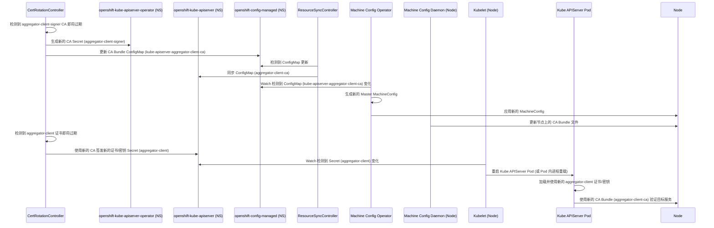

# OpenShift 4.12 Kube APIServer Operator 证书轮替逻辑

本文档梳理了 OpenShift 4.12 版本中 [`cluster-kube-apiserver-operator`](https://github.com/openshift/cluster-kube-apiserver-operator/tree/release-4.12) 中证书轮替的核心逻辑，特别是与 [Machine Config Operator (MCO)](https://github.com/openshift/machine-config-operator/tree/release-4.12) 的联动机制。

## 核心组件

证书轮替主要涉及以下几个控制器：

1.  **CertRotationController (`pkg/operator/certrotationcontroller/`)**:
    *   使用 `library-go/pkg/operator/certrotation` 库来管理多个证书颁发机构 (CA) 和叶子证书/密钥对。
    *   负责轮替各种关键证书，例如：
        *   聚合器代理客户端证书 (`aggregator-client`) 及其 CA (`aggregator-client-signer`)。
        *   Kube APIServer 到 Kubelet 的客户端证书 (`kubelet-client`) 及其 CA (`kube-apiserver-to-kubelet-signer`)。
        *   各种服务端证书：localhost (`localhost-serving-cert-certkey`)、服务网络 (`service-network-serving-certkey`)、外部/内部负载均衡器 (`external/internal-loadbalancer-serving-certkey`) 及其对应的 CA。
        *   控制平面组件（KCM, Scheduler）的客户端证书 (`kube-controller-manager-client-cert-key`, `kube-scheduler-client-cert-key`) 及其 CA (`kube-control-plane-signer`)。
        *   节点系统管理员客户端证书 (`node-system-admin-client`) 及其 CA (`node-system-admin-signer`)。
    *   轮替过程通常涉及：生成新的 CA 或证书/密钥，更新 Operator 命名空间 (`openshift-kube-apiserver-operator`) 和/或操作数命名空间 (`openshift-kube-apiserver`) 中的 Secret，以及更新相应的 CA Bundle ConfigMap。
    *   **与 MCO 交互点**: 将某些 CA Bundle ConfigMap（如 `kube-apiserver-aggregator-client-ca`）和客户端证书 Secret（如 `kube-controller-manager-client-cert-key`）写入 `openshift-config-managed` 命名空间。

2.  **BoundSATokenSignerController (`pkg/operator/boundsatokensignercontroller/`)**:
    *   专门管理用于签发 Bound Service Account Token 的 RSA 密钥对。
    *   轮替过程：
        1.  在 Operator 命名空间中生成一个新的密钥对，并保存在 `next-bound-service-account-signing-key` Secret 中。
        2.  将新的公钥添加到操作数命名空间中的 `bound-sa-token-signing-certs` ConfigMap。
        3.  等待确认该 ConfigMap（包含新公钥）已通过 Operator 的 Revision 机制分发到所有 Master 节点。
        4.  确认分发后，将 Operator 命名空间中的 `next-bound-service-account-signing-key` Secret 的完整内容（公钥+私钥）复制到操作数命名空间中的 `bound-service-account-signing-key` Secret。
    *   **与 MCO 交互点**: `bound-sa-token-signing-certs` ConfigMap 随后会被 `ResourceSyncController` 同步到 `openshift-config-managed` 命名空间。

3.  **ResourceSyncController (`pkg/operator/resourcesynccontroller/`)**:
    *   负责在不同命名空间之间同步（复制）特定的 ConfigMap 和 Secret 资源。
    *   **与 MCO 交互的关键**:
        *   将 `CertRotationController` 和 `BoundSATokenSignerController` 管理的部分 CA Bundle（如 `sa-token-signing-certs`, `bound-sa-token-signing-certs`）从 `openshift-kube-apiserver` 同步 *到* `openshift-config-managed`。
        *   将其他 Operator（如 KCM Operator）管理并放置在 `openshift-config-managed` 中的 CA Bundle（如 `csr-controller-ca`，重命名为 `kubelet-serving-ca`）同步 *到* `openshift-kube-apiserver`。
        *   将 `CertRotationController` 放置在 `openshift-config-managed` 中的 CA Bundle（如 `kube-apiserver-aggregator-client-ca`）同步 *到* `openshift-kube-apiserver`。

## 与 Machine Config Operator (MCO) 的联动

Kube APIServer Operator 与 MCO 的交互是间接的，主要通过 `openshift-config-managed` 命名空间进行：

1.  **触发点**: 当 `CertRotationController` 或 `BoundSATokenSignerController` 轮替证书/密钥时，相关的 CA Bundle ConfigMap 或客户端证书 Secret 会被更新。
2.  **同步**: `ResourceSyncController` 确保这些更新后的资源（特别是 CA Bundle）被同步到 `openshift-config-managed` 命名空间，或者从该命名空间同步到 Kube APIServer 的操作数命名空间。
3.  **MCO 检测**: MCO 会监视 `openshift-config-managed` 命名空间中与节点配置相关的资源。当它检测到这些资源（如 CA Bundle ConfigMap）发生变化时，会认为相应的节点配置需要更新。
4.  **应用配置**: MCO 会为相关的 Machine Config Pool（通常是 `master` Pool）生成新的 MachineConfig，并通过 Machine Config Daemon (MCD) 将其应用到池中的每个节点。
5.  **节点更新**: 节点上的 MCD 应用新的 MachineConfig，这可能涉及将更新后的 CA Bundle 文件写入节点上的特定路径（例如，`/etc/kubernetes/static-pod-resources/configmaps/...`），或者更新其他节点级服务的配置。
6.  **服务生效**:
    *   对于静态 Pod（如 Kube APIServer），kubelet 在检测到挂载的 ConfigMap/Secret 发生变化时，可能会重新启动 Pod，使得 Pod 内的进程加载新的证书/CA。
    *   对于节点上的其他服务，可能需要服务重启或重新加载配置才能使用新的证书/CA。

## 证书轮替流程示例 (Mermaid Sequence Diagram)

以聚合器客户端证书 (`aggregator-client`) 轮替为例：

**注意**: 上图简化了部分细节，例如 Operator 的状态更新和 Revision 管理。实际流程中，Operator 会确保资源在所有节点上达到一致状态后才认为轮替完成。Bound SA Token Signing Key 的轮替涉及更复杂的等待公钥分发的步骤。
