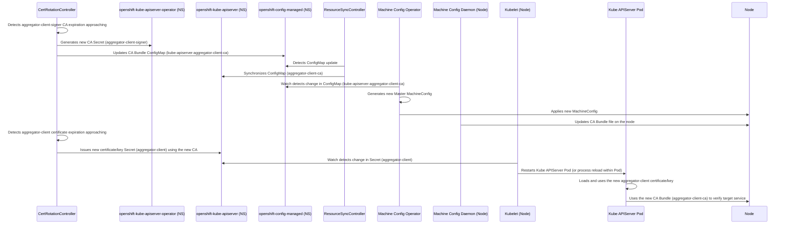

# OpenShift 4.12 Kube APIServer Operator Certificate Rotation Logic

This document outlines the core logic for certificate rotation within the [`cluster-kube-apiserver-operator`](https://github.com/openshift/cluster-kube-apiserver-operator/tree/release-4.12) in OpenShift version 4.12, particularly focusing on its interaction mechanism with the [Machine Config Operator (MCO)](https://github.com/openshift/machine-config-operator/tree/release-4.12).

## Core Components

Certificate rotation primarily involves the following controllers:

1.  **CertRotationController (`pkg/operator/certrotationcontroller/`)**:
    *   Utilizes the `library-go/pkg/operator/certrotation` library to manage multiple Certificate Authorities (CAs) and leaf certificate/key pairs.
    *   Responsible for rotating various critical certificates, such as:
        *   Aggregator proxy client certificate (`aggregator-client`) and its CA (`aggregator-client-signer`).
        *   Kube APIServer to Kubelet client certificate (`kubelet-client`) and its CA (`kube-apiserver-to-kubelet-signer`).
        *   Various serving certificates: localhost (`localhost-serving-cert-certkey`), service network (`service-network-serving-certkey`), external/internal load balancer (`external/internal-loadbalancer-serving-certkey`), and their corresponding CAs.
        *   Control plane component (KCM, Scheduler) client certificates (`kube-controller-manager-client-cert-key`, `kube-scheduler-client-cert-key`) and their CA (`kube-control-plane-signer`).
        *   Node system administrator client certificate (`node-system-admin-client`) and its CA (`node-system-admin-signer`).
    *   The rotation process typically involves: generating a new CA or certificate/key, updating Secrets in the Operator namespace (`openshift-kube-apiserver-operator`) and/or the operand namespace (`openshift-kube-apiserver`), and updating the corresponding CA Bundle ConfigMaps.
    *   **Interaction point with MCO**: Writes certain CA Bundle ConfigMaps (e.g., `kube-apiserver-aggregator-client-ca`) and client certificate Secrets (e.g., `kube-controller-manager-client-cert-key`) into the `openshift-config-managed` namespace.

2.  **BoundSATokenSignerController (`pkg/operator/boundsatokensignercontroller/`)**:
    *   Specifically manages the RSA key pair used for signing Bound Service Account Tokens.
    *   Rotation process:
        1.  Generate a new key pair in the Operator namespace and save it in the `next-bound-service-account-signing-key` Secret.
        2.  Add the new public key to the `bound-sa-token-signing-certs` ConfigMap in the operand namespace.
        3.  Wait for confirmation that this ConfigMap (containing the new public key) has been distributed to all master nodes via the Operator's Revision mechanism.
        4.  After confirming distribution, copy the full content (public key + private key) of the `next-bound-service-account-signing-key` Secret from the Operator namespace to the `bound-service-account-signing-key` Secret in the operand namespace.
    *   **Interaction point with MCO**: The `bound-sa-token-signing-certs` ConfigMap is subsequently synchronized to the `openshift-config-managed` namespace by the `ResourceSyncController`.

3.  **ResourceSyncController (`pkg/operator/resourcesynccontroller/`)**:
    *   Responsible for synchronizing (copying) specific ConfigMap and Secret resources between different namespaces.
    *   **Key interaction with MCO**:
        *   Synchronizes some CA Bundles managed by `CertRotationController` and `BoundSATokenSignerController` (e.g., `sa-token-signing-certs`, `bound-sa-token-signing-certs`) *from* `openshift-kube-apiserver` *to* `openshift-config-managed`.
        *   Synchronizes CA Bundles managed by other Operators (like KCM Operator) and placed in `openshift-config-managed` (e.g., `csr-controller-ca`, renamed to `kubelet-serving-ca`) *from* `openshift-config-managed` *to* `openshift-kube-apiserver`.
        *   Synchronizes CA Bundles placed in `openshift-config-managed` by `CertRotationController` (e.g., `kube-apiserver-aggregator-client-ca`) *from* `openshift-config-managed` *to* `openshift-kube-apiserver`.

## Interaction with Machine Config Operator (MCO)

The interaction between the Kube APIServer Operator and MCO is indirect, primarily occurring through the `openshift-config-managed` namespace:

1.  **Trigger**: When `CertRotationController` or `BoundSATokenSignerController` rotates certificates/keys, the relevant CA Bundle ConfigMaps or client certificate Secrets are updated.
2.  **Synchronization**: `ResourceSyncController` ensures these updated resources (especially CA Bundles) are synchronized *to* the `openshift-config-managed` namespace, or *from* this namespace *to* the Kube APIServer's operand namespace.
3.  **MCO Detection**: MCO monitors resources related to node configuration within the `openshift-config-managed` namespace. When it detects changes in these resources (like CA Bundle ConfigMaps), it determines that the corresponding node configuration needs updating.
4.  **Apply Configuration**: MCO generates a new MachineConfig for the relevant Machine Config Pool (typically the `master` Pool) and applies it to each node in the pool via the Machine Config Daemon (MCD).
5.  **Node Update**: The MCD on the node applies the new MachineConfig. This might involve writing the updated CA Bundle files to specific paths on the node (e.g., `/etc/kubernetes/static-pod-resources/configmaps/...`) or updating configurations for other node-level services.
6.  **Service Activation**:
    *   For static Pods (like the Kube APIServer), the kubelet might restart the Pod upon detecting changes in mounted ConfigMaps/Secrets, allowing the processes within the Pod to load the new certificates/CAs.
    *   Other services on the node might require a restart or configuration reload to use the new certificates/CAs.

## Certificate Rotation Flow Example (Mermaid Sequence Diagram)

Example for aggregator client certificate (`aggregator-client`) rotation:

**Note**: The diagram above simplifies some details, such as Operator status updates and Revision management. In the actual flow, the Operator ensures resources reach a consistent state across all nodes before considering the rotation complete. The rotation of the Bound SA Token Signing Key involves more complex steps waiting for public key distribution.
