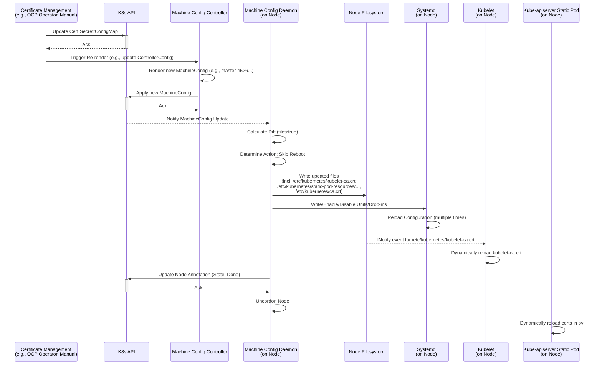

# OpenShift 4.12 Kube-apiserver 相关证书更新流程分析

本文档分析了 OpenShift 4.12 集群中与 [Kube-apiserver](https://github.com/openshift/cluster-kube-apiserver-operator/tree/release-4.12) 相关的证书更新时所触发的流程，重点关注 [Machine Config Operator (MCO)](https://github.com/openshift/machine-config-operator/tree/release-4.12) 的角色、涉及的组件、证书存储位置以及更新对 Kubelet 和 Kube-apiserver 静态 Pod 的影响。

## 1. 证书存储位置

集群中与 Kube-apiserver 通信相关的证书（如服务器证书、客户端 CA、节点信任 CA Bundle）通常存储在以下位置：

*   **Secrets/ConfigMaps:** 主要分布在 `openshift-config`, `openshift-config-managed`, `openshift-kube-apiserver-operator` 等命名空间中。例如：
    *   `kube-apiserver-serving-ca` (ConfigMap, 通常在 `openshift-config` 或 `openshift-config-managed`)
    *   `kube-apiserver-to-kubelet-client-ca` (ConfigMap, 通常在 `openshift-kube-apiserver-operator`)
    *   `user-ca-bundle` (ConfigMap, `openshift-config`, 用于用户自定义 CA)
    *   各种 TLS Secret (用于组件间通信，如 MCS 的 `machine-config-server-tls`)
*   **节点文件系统:** 由 MCO 或其他组件（如 Kubelet）写入节点。关键路径包括：
    *   `/etc/kubernetes/kubeconfig`: Kubelet 使用的主要配置文件，包含集群 CA 数据。
    *   `/etc/kubernetes/kubelet-ca.crt`: Kubelet 用于验证 Apiserver 的 CA 证书（或 Bundle）。
    *   `/etc/kubernetes/ca.crt`: 集群 CA 证书，可能被节点上的各种组件使用。
    *   `/etc/pki/ca-trust/source/anchors/`: 系统信任的 CA 证书锚点目录。MCO 可能将集群 CA 或用户 CA 写入此处（例如 `openshift-config-user-ca-bundle.crt`）。
    *   `/etc/kubernetes/static-pod-resources/`: Kubelet 用于挂载给静态 Pod 的资源，可能包含证书相关的 ConfigMap/Secret 数据。

## 2. 证书更新与 MCO 触发流程

MCO 本身通常不直接监控大多数证书类 Secret/ConfigMap 的变化（`pull-secret` 是个例外）。证书更新通常由专门的组件（如 `cert-manager`、OpenShift 内置的 CA 管理逻辑或其他 Operator）处理。

当证书资源（Secret/ConfigMap）发生变化时，MCO 的介入通常是间接的：

1.  **上游变更:** 管理证书的组件更新了对应的 Secret 或 ConfigMap。
2.  **依赖触发:** 其他组件（如 CVO、管理该证书的 Operator）检测到证书资源的变更，并可能因此更新了 MCO 所依赖的资源，例如：
    *   更新了 `ControllerConfig`。
    *   更新了 MCO 模板中引用的某个 ConfigMap 或 Secret。
3.  **MCC 生成新配置:** Machine Config Controller (MCC) 检测到其依赖资源的变更，重新渲染模板，生成一个新的 `MachineConfig` 对象（例如从 `rendered-master-846b...` 变为 `rendered-master-e526...`）。

**日志证据 (`mco.log` - 已脱敏):**

```log
I0410 14:23:23.081875    4014 update.go:542] Checking Reconcilable for config rendered-master-[...] to rendered-master-[...]
I0410 14:23:23.135821    4014 update.go:2118] Starting update from rendered-master-[...] to rendered-master-[...]: &{osUpdate:false kargs:false fips:false passwd:false files:true units:false kernelType:false extensions:false}
```

这表明 MCC 确实生成了一个新的 `MachineConfig`，并且差异仅在于文件 (`files:true`)。

## 3. MCD 应用配置与节点行为

Machine Config Daemon (MCD) 在每个节点上运行，负责应用 `MachineConfig`。

1.  **接收新配置:** MCD 检测到其所属 Pool 的 `MachineConfig` 更新（变为 `rendered-master-e526...`）。
2.  **计算差异与行动:** MCD 计算新旧配置的差异。根据 `pkg/daemon/update.go` 中的 `calculatePostConfigChangeAction` 逻辑：
    *   OS、Kargs、FIPS、KernelType、Extensions、Systemd Units 或大多数文件变更通常需要 **重启 (Reboot)**。
    *   特定的 Crio GPG 或 Registry 配置文件变更，仅需 **重载 Crio (Reload Crio)**。
    *   `/etc/kubernetes/kubelet-ca.crt` 或 `/var/lib/kubelet/config.json` 的变更，则 **无需操作 (None)**。SSH 密钥变更也属于此类。
3.  **应用变更:**
    *   **文件写入:** MCD 将新配置中的文件写入节点文件系统。
        ```go
        // pkg/daemon/update.go - writeFiles function snippet
        func (dn *Daemon) writeFiles(files []ign3types.File) error {
            for _, file := range files {
                glog.Infof("Writing file %q", file.Path)
                // ... decode contents ...
                mode := defaultFilePermissions
                if file.Mode != nil {
                    mode = os.FileMode(*file.Mode)
                }
                uid, gid, err := getFileOwnership(file)
                // ... error handling ...
                if err := createOrigFile(file.Path, file.Path); err != nil { // Backup original if exists
                    return err
                }
                if err := writeFileAtomically(file.Path, decodedContents, defaultDirectoryPermissions, mode, uid, gid); err != nil {
                    return err
                }
            }
            return nil
        }
        ```
        **日志证据 (`mco.log` - 已脱敏):**
        ```log
        I0410 14:23:23.144161    4014 update.go:1650] Writing file "/etc/pki/ca-trust/source/anchors/openshift-config-user-ca-bundle.crt"
        I0410 14:23:23.175331    4014 update.go:1650] Writing file "/etc/kubernetes/kubelet-ca.crt"
        I0410 14:23:23.185192    4014 update.go:1650] Writing file "/etc/kubernetes/ca.crt"
        ```
    *   **Systemd Units/Drop-ins:** MCD 写入、启用、禁用或重置 Systemd Units 和 Drop-ins。
        ```go
        // pkg/daemon/update.go - writeUnits function snippet (simplified)
        func (dn *Daemon) writeUnits(units []ign3types.Unit) error {
            // ... write dropins ...
            for _, u := range units {
                // ... handle mask ...
                if u.Contents != nil && *u.Contents != "" {
                    // ... write unit file ...
                }
                if u.Enabled != nil {
                    if *u.Enabled {
                        enabledUnits = append(enabledUnits, u.Name)
                    } else {
                        disabledUnits = append(disabledUnits, u.Name)
                    }
                } else {
                    // ... preset unit ...
                }
            }
            // ... enableUnits(enabledUnits) ...
            // ... disableUnits(disabledUnits) ...
            return nil
        }
        ```
        **日志证据 (`mco.log` - 已脱敏):**
        ```log
        I0410 14:23:23.212378    4014 update.go:1582] Writing systemd unit "NetworkManager-clean-initrd-state.service"
        I0410 14:23:24.367298    4014 update.go:1537] Writing systemd unit dropin "10-mco-default-madv.conf"
        I0410 14:23:27.646794    4014 update.go:1492] Enabled systemd units: [...]
        I0410 14:23:28.584428    4014 update.go:1503] Disabled systemd units [...]
        ```
4.  **决定后续动作:** 根据计算出的行动类型执行。在此次观察到的场景中，尽管有多个文件（包括 CA 和 systemd 相关文件）被修改，MCD 最终决定跳过重启。
    **日志证据 (`mco.log` & `coreos.log` - 已脱敏):**
    ```log
    # mco.log
    I0410 14:23:28.717447    4014 update.go:2118] Node has Desired Config rendered-master-[...], skipping reboot
    # coreos.log
    Feb 26 07:21:45 [host-name] root[15737]: machine-config-daemon[2680]: Node has Desired Config rendered-worker-[...], skipping    reboot
    ```
    *注意：* 这与 `pkg/daemon/update.go` 中 `calculatePostConfigChangeActionFromFileDiffs` 的逻辑似乎存在差异，该逻辑通常会将 `/etc/kubernetes/ca.crt` 或 `/etc/pki/...` 的更改归类为需要重启。但日志明确显示跳过了重启，可能是因为 `/etc/kubernetes/kubelet-ca.crt` 的更改（属于 "None" 类）覆盖了其他文件更改的重启需求，或者 MCD 的差异计算逻辑有更复杂的判断。本分析基于观察到的日志行为。

## 4. 组件响应

*   **Systemd:** 当 MCD 写入或修改 `/etc/systemd/system/` 目录下的文件（Units 或 Drop-ins）或运行 `systemctl enable/disable` 时，Systemd 会自动检测到变化并重新加载其配置。
    **日志证据 (`node.log` & `coreos.log` - 已脱敏):**
    ```log
    # node.log
    Apr 10 14:23:23 ip-[...] systemd[1]: Reloading.
    Apr 10 14:23:24 ip-[...] systemd[1]: Reloading.
    # coreos.log
    Feb 26 07:21:44 [host-name] systemd[1]: Reloading.
    Feb 26 07:21:45 [host-name] systemd[1]: Reloading.
    ```
    这个 `Reloading` 行为是由 MCD 对 systemd 配置文件或单元状态的操作触发的，是 systemd 的标准行为。

*   **Kubelet:** Kubelet 监控其使用的证书文件。当 MCD 更新 `/etc/kubernetes/kubelet-ca.crt` 时，Kubelet 会检测到变化并动态重新加载该 CA 证书，无需重启 Kubelet 进程。
    **日志证据 (`node.log` & `coreos.log` - 已脱敏):**
    ```log
    # node.log
    Apr 10 14:23:23 ip-[...] kubenswrapper[2241]: I0410 14:23:23.175393 dynamic_cafile_content.go:211] "Failed to remove file watch, it may have been deleted" file="/etc/kubernetes/kubelet-ca.crt"
    Apr 10 14:23:23 ip-[...] kubenswrapper[2241]: I0410 14:23:23.175824 dynamic_cafile_content.go:119] "Loaded a new CA Bundle and Verifier" name="client-ca-bundle::/etc/kubernetes/kubelet-ca.crt"
    # coreos.log
    Feb 26 07:21:44 [host-name] ku benswrapper[5616]: I0226 07:21:44.314400 3487 dynamic_cafile_content.go:211] "Failed to remove file watch, it may have been deleted" file ="/etc/ku bernetes/kubelet-ca.crt"
    Feb 26 07:21:44 [host-name] ku benswrapper[5616]: I0226 07:21:44.324451 3487 dynamic_cafile_content.go:119] "Loaded a new CA Bundle and Verifier" name="client-ca-bundle::/etc/ku bernetes/kubelet-ca.crt"
    ```
    Kubelet **没有**因为这次 MCO 更新而重启。

*   **Kube-apiserver (静态 Pod):** Kubelet 负责管理静态 Pod。如果 Kube-apiserver Pod 定义中挂载的 Secret 或 ConfigMap（包含其服务证书、客户端 CA 等）的内容发生变化，Kubelet 会检测到并**重启**该静态 Pod。MCD 本身不直接重启 Kube-apiserver。在提供的日志片段中，**没有观察到** Kube-apiserver 静态 Pod 在 MCD 更新期间或之后立即重启的明确证据。重启是否发生取决于 Kube-apiserver Pod 具体挂载了哪些证书资源，以及这些资源的源 Secret/ConfigMap 是否真的发生了变化并被 Kubelet 检测到。而 openshift 4.12 的 kube-apiserver 使用 pv 的方式挂载本地目录，读取证书，所有 kubelet 检测不到 pv 内部证书的变化，于是 kubelet 并没有重启 kube-apiserver pod，而是 kube-apiserver pod 内部应用感知到了证书编号，重新读取了证书，而不是重启进程。

## 5. 时序图 (Mermaid)



## 6. 结论

*   当 Kube-apiserver 相关证书更新时，MCO 通常通过间接方式被触发，生成新的 `MachineConfig`。
*   MCD 应用 `MachineConfig` 时，会写入更新后的文件（包括证书文件）和 systemd 配置。
*   根据 MCD 的判断逻辑（在此次观察到的场景中），即使更新了多个 CA 文件和 systemd 配置，如果关键文件（如 `kubelet-ca.crt`）的变更是已知不需要重启的类型，MCD **可能不会触发节点重启**。
*   Systemd 会因为 MCD 对其配置文件的修改而**自动重载 (Reload)**。
*   Kubelet 会动态检测并**重新加载**其使用的 CA 证书 (`/etc/kubernetes/kubelet-ca.crt`)，**不会重启**。
*   Kube-apiserver 静态 Pod 是否重启取决于其挂载的证书资源是否在源端（Secret/ConfigMap）发生变化并被 Kubelet 检测到。在此次分析的日志中，**未观察到** Kube-apiserver 的立即重启。重启由 **Kubelet** 触发，而非 MCD。
