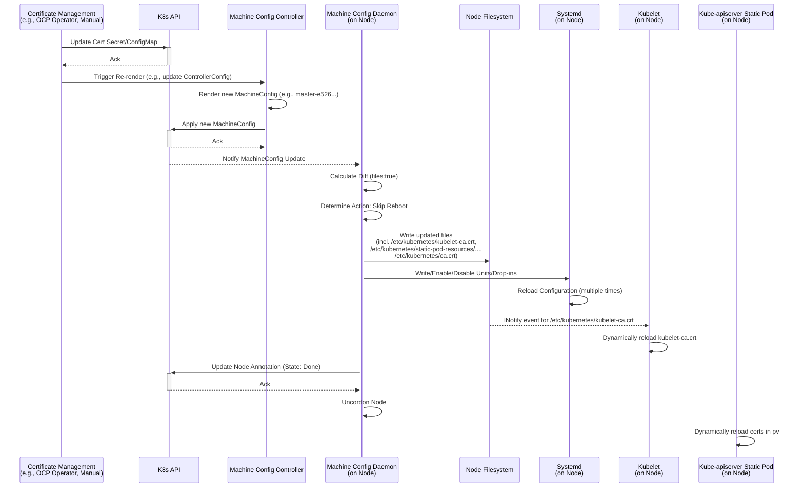

# Analysis of Kube-apiserver Related Certificate Update Process in OpenShift 4.12

This document analyzes the process triggered during the update of certificates related to [Kube-apiserver](https://github.com/openshift/cluster-kube-apiserver-operator/tree/release-4.12) in an OpenShift 4.12 cluster. It focuses on the role of the [Machine Config Operator (MCO)](https://github.com/openshift/machine-config-operator/tree/release-4.12), the involved components, certificate storage locations, and the impact of updates on Kubelet and Kube-apiserver static pods.

## 1. Certificate Storage Locations

Certificates related to Kube-apiserver communication (e.g., server certificates, client CA, node trust CA Bundle) in the cluster are typically stored in the following locations:

*   **Secrets/ConfigMaps:** Mainly distributed in namespaces like `openshift-config`, `openshift-config-managed`, `openshift-kube-apiserver-operator`, etc. For example:
    *   `kube-apiserver-serving-ca` (ConfigMap, usually in `openshift-config` or `openshift-config-managed`)
    *   `kube-apiserver-to-kubelet-client-ca` (ConfigMap, usually in `openshift-kube-apiserver-operator`)
    *   `user-ca-bundle` (ConfigMap, `openshift-config`, for user-defined CAs)
    *   Various TLS Secrets (for inter-component communication, e.g., MCS's `machine-config-server-tls`)
*   **Node Filesystem:** Written to the node by MCO or other components (like Kubelet). Key paths include:
    *   `/etc/kubernetes/kubeconfig`: The main configuration file used by Kubelet, containing cluster CA data.
    *   `/etc/kubernetes/kubelet-ca.crt`: The CA certificate (or Bundle) used by Kubelet to verify the Apiserver.
    *   `/etc/kubernetes/ca.crt`: The cluster CA certificate, potentially used by various components on the node.
    *   `/etc/pki/ca-trust/source/anchors/`: The directory for system-trusted CA certificate anchors. MCO might write the cluster CA or user CA here (e.g., `openshift-config-user-ca-bundle.crt`).
    *   `/etc/kubernetes/static-pod-resources/`: Resources mounted by Kubelet for static pods, potentially containing certificate-related ConfigMap/Secret data.

## 2. Certificate Update and MCO Trigger Process

MCO itself usually does not directly monitor changes in most certificate-type Secrets/ConfigMaps (`pull-secret` is an exception). Certificate updates are typically handled by specialized components (like `cert-manager`, OpenShift's built-in CA management logic, or other Operators).

When certificate resources (Secret/ConfigMap) change, MCO's involvement is usually indirect:

1.  **Upstream Change:** The component managing the certificate updates the corresponding Secret or ConfigMap.
2.  **Dependency Trigger:** Other components (e.g., CVO, the Operator managing the certificate) detect the change in the certificate resource and may consequently update a resource that MCO depends on, for example:
    *   Updating the `ControllerConfig`.
    *   Updating a ConfigMap or Secret referenced in an MCO template.
3.  **MCC Generates New Config:** The Machine Config Controller (MCC) detects changes in its dependent resources, re-renders the templates, and generates a new `MachineConfig` object (e.g., changing from `rendered-master-846b...` to `rendered-master-e526...`).

**Log Evidence (`mco.log` - Sanitized):**

```log
I0410 14:23:23.081875    4014 update.go:542] Checking Reconcilable for config rendered-master-[...] to rendered-master-[...]
I0410 14:23:23.135821    4014 update.go:2118] Starting update from rendered-master-[...] to rendered-master-[...]: &{osUpdate:false kargs:false fips:false passwd:false files:true units:false kernelType:false extensions:false}
```

This indicates that MCC did generate a new `MachineConfig`, and the difference was only in files (`files:true`).

## 3. MCD Configuration Application and Node Behavior

Machine Config Daemon (MCD) runs on each node and is responsible for applying `MachineConfig`.

1.  **Receive New Config:** MCD detects that the `MachineConfig` for its pool has been updated (to `rendered-master-e526...`).
2.  **Calculate Diff & Action:** MCD calculates the difference between the new and old configurations. According to the `calculatePostConfigChangeAction` logic in `pkg/daemon/update.go`:
    *   Changes to OS, Kargs, FIPS, KernelType, Extensions, Systemd Units, or most files usually require a **Reboot**.
    *   Changes to specific Crio GPG or Registry configuration files only require **Reload Crio**.
    *   Changes to `/etc/kubernetes/kubelet-ca.crt` or `/var/lib/kubelet/config.json` require **None** (no action). SSH key changes also fall into this category.
3.  **Apply Changes:**
    *   **File Writing:** MCD writes files from the new configuration to the node filesystem.
        ```go
        // pkg/daemon/update.go - writeFiles function snippet
        func (dn *Daemon) writeFiles(files []ign3types.File) error {
            for _, file := range files {
                glog.Infof("Writing file %q", file.Path)
                // ... decode contents ...
                mode := defaultFilePermissions
                if file.Mode != nil {
                    mode = os.FileMode(*file.Mode)
                }
                uid, gid, err := getFileOwnership(file)
                // ... error handling ...
                if err := createOrigFile(file.Path, file.Path); err != nil { // Backup original if exists
                    return err
                }
                if err := writeFileAtomically(file.Path, decodedContents, defaultDirectoryPermissions, mode, uid, gid); err != nil {
                    return err
                }
            }
            return nil
        }
        ```
        **Log Evidence (`mco.log` - Sanitized):**
        ```log
        I0410 14:23:23.144161    4014 update.go:1650] Writing file "/etc/pki/ca-trust/source/anchors/openshift-config-user-ca-bundle.crt"
        I0410 14:23:23.175331    4014 update.go:1650] Writing file "/etc/kubernetes/kubelet-ca.crt"
        I0410 14:23:23.185192    4014 update.go:1650] Writing file "/etc/kubernetes/ca.crt"
        ```
    *   **Systemd Units/Drop-ins:** MCD writes, enables, disables, or resets Systemd Units and Drop-ins.
        ```go
        // pkg/daemon/update.go - writeUnits function snippet (simplified)
        func (dn *Daemon) writeUnits(units []ign3types.Unit) error {
            // ... write dropins ...
            for _, u := range units {
                // ... handle mask ...
                if u.Contents != nil && *u.Contents != "" {
                    // ... write unit file ...
                }
                if u.Enabled != nil {
                    if *u.Enabled {
                        enabledUnits = append(enabledUnits, u.Name)
                    } else {
                        disabledUnits = append(disabledUnits, u.Name)
                    }
                } else {
                    // ... preset unit ...
                }
            }
            // ... enableUnits(enabledUnits) ...
            // ... disableUnits(disabledUnits) ...
            return nil
        }
        ```
        **Log Evidence (`mco.log` - Sanitized):**
        ```log
        I0410 14:23:23.212378    4014 update.go:1582] Writing systemd unit "NetworkManager-clean-initrd-state.service"
        I0410 14:23:24.367298    4014 update.go:1537] Writing systemd unit dropin "10-mco-default-madv.conf"
        I0410 14:23:27.646794    4014 update.go:1492] Enabled systemd units: [...]
        I0410 14:23:28.584428    4014 update.go:1503] Disabled systemd units [...]
        ```
4.  **Determine Subsequent Action:** Executes based on the calculated action type. In the observed scenario, although multiple files (including CA and systemd related files) were modified, MCD ultimately decided to skip the reboot.
    **Log Evidence (`mco.log` & `coreos.log` - Sanitized):**
    ```log
    # mco.log
    I0410 14:23:28.717447    4014 update.go:2118] Node has Desired Config rendered-master-[...], skipping reboot
    # coreos.log
    Feb 26 07:21:45 [host-name] root[15737]: machine-config-daemon[2680]: Node has Desired Config rendered-worker-[...], skipping    reboot
    ```
    *Note:* This seems to differ from the logic in `pkg/daemon/update.go`'s `calculatePostConfigChangeActionFromFileDiffs`, which would typically classify changes to `/etc/kubernetes/ca.crt` or `/etc/pki/...` as requiring a reboot. However, the logs clearly show the reboot was skipped. This could be because the change to `/etc/kubernetes/kubelet-ca.crt` (which belongs to the "None" action category) overrides the reboot requirement from other file changes, or the MCD's diff calculation logic has more complex conditions. This analysis is based on the observed log behavior.

## 4. Component Responses

*   **Systemd:** When MCD writes or modifies files under `/etc/systemd/system/` (Units or Drop-ins) or runs `systemctl enable/disable`, Systemd automatically detects the changes and reloads its configuration.
    **Log Evidence (`node.log` & `coreos.log` - Sanitized):**
    ```log
    # node.log
    Apr 10 14:23:23 ip-[...] systemd[1]: Reloading.
    Apr 10 14:23:24 ip-[...] systemd[1]: Reloading.
    # coreos.log
    Feb 26 07:21:44 [host-name] systemd[1]: Reloading.
    Feb 26 07:21:45 [host-name] systemd[1]: Reloading.
    ```
    This `Reloading` behavior is triggered by MCD's operations on systemd configuration files or unit states and is standard systemd behavior.

*   **Kubelet:** Kubelet monitors the certificate files it uses. When MCD updates `/etc/kubernetes/kubelet-ca.crt`, Kubelet detects the change and dynamically reloads the CA certificate without restarting the Kubelet process.
    **Log Evidence (`node.log` & `coreos.log` - Sanitized):**
    ```log
    # node.log
    Apr 10 14:23:23 ip-[...] kubenswrapper[2241]: I0410 14:23:23.175393 dynamic_cafile_content.go:211] "Failed to remove file watch, it may have been deleted" file="/etc/kubernetes/kubelet-ca.crt"
    Apr 10 14:23:23 ip-[...] kubenswrapper[2241]: I0410 14:23:23.175824 dynamic_cafile_content.go:119] "Loaded a new CA Bundle and Verifier" name="client-ca-bundle::/etc/kubernetes/kubelet-ca.crt"
    # coreos.log
    Feb 26 07:21:44 [host-name] ku benswrapper[5616]: I0226 07:21:44.314400 3487 dynamic_cafile_content.go:211] "Failed to remove file watch, it may have been deleted" file ="/etc/ku bernetes/kubelet-ca.crt"
    Feb 26 07:21:44 [host-name] ku benswrapper[5616]: I0226 07:21:44.324451 3487 dynamic_cafile_content.go:119] "Loaded a new CA Bundle and Verifier" name="client-ca-bundle::/etc/ku bernetes/kubelet-ca.crt"
    ```
    Kubelet did **not** restart due to this MCO update.

*   **Kube-apiserver (Static Pod):** Kubelet is responsible for managing static pods. If the content of Secrets or ConfigMaps mounted in the Kube-apiserver Pod definition (containing its service certificate, client CA, etc.) changes, Kubelet will detect it and **restart** the static pod. MCD itself does not directly restart Kube-apiserver. In the provided log snippets, there is **no clear evidence** of the Kube-apiserver static pod restarting immediately during or after the MCD update. Whether a restart occurs depends on which certificate resources the Kube-apiserver Pod specifically mounts, and whether the source Secret/ConfigMap for these resources actually changed and was detected by Kubelet. However, in OpenShift 4.12, kube-apiserver uses PVs to mount local directories for reading certificates. Therefore, Kubelet cannot detect changes to certificates within the PV. Consequently, Kubelet does not restart the kube-apiserver pod. Instead, the kube-apiserver pod's internal application senses the certificate change and reloads the certificates, rather than restarting the process.

## 5. Sequence Diagram (Mermaid)



## 6. Conclusion

*   When Kube-apiserver related certificates are updated, MCO is usually triggered indirectly, generating a new `MachineConfig`.
*   When MCD applies the `MachineConfig`, it writes the updated files (including certificate files) and systemd configurations.
*   Based on MCD's decision logic (in the observed scenario), even if multiple CA files and systemd configurations are updated, if the change to a key file (like `kubelet-ca.crt`) is of a type known not to require a reboot, MCD **may not trigger a node reboot**.
*   Systemd will **automatically reload** its configuration due to modifications made by MCD to its configuration files.
*   Kubelet will dynamically detect and **reload** the CA certificate it uses (`/etc/kubernetes/kubelet-ca.crt`) and **will not restart**.
*   Whether the Kube-apiserver static pod restarts depends on whether the certificate resources it mounts change at the source (Secret/ConfigMap) and are detected by Kubelet. In the logs analyzed here, **no immediate restart** of Kube-apiserver was observed. The restart would be triggered by **Kubelet**, not MCD. In OCP 4.12, due to PV usage for certs, Kubelet doesn't detect the change, and the Kube-apiserver pod reloads certs internally instead of restarting.
