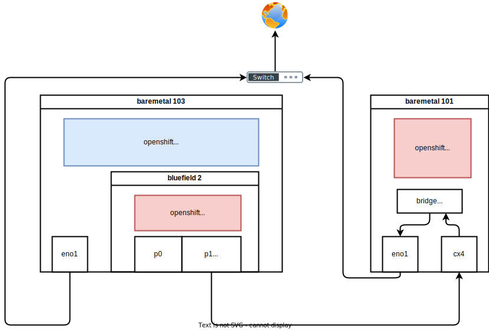
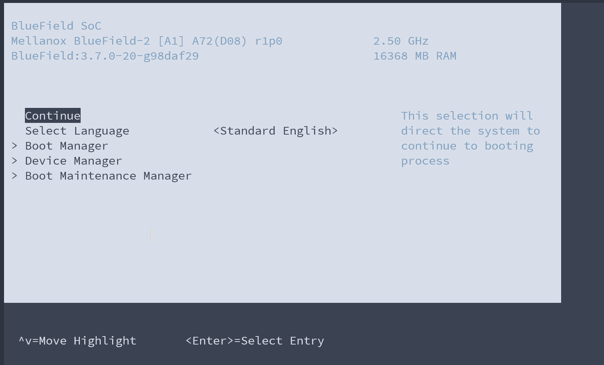
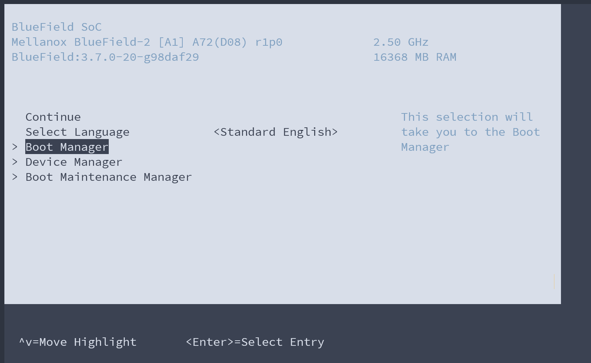
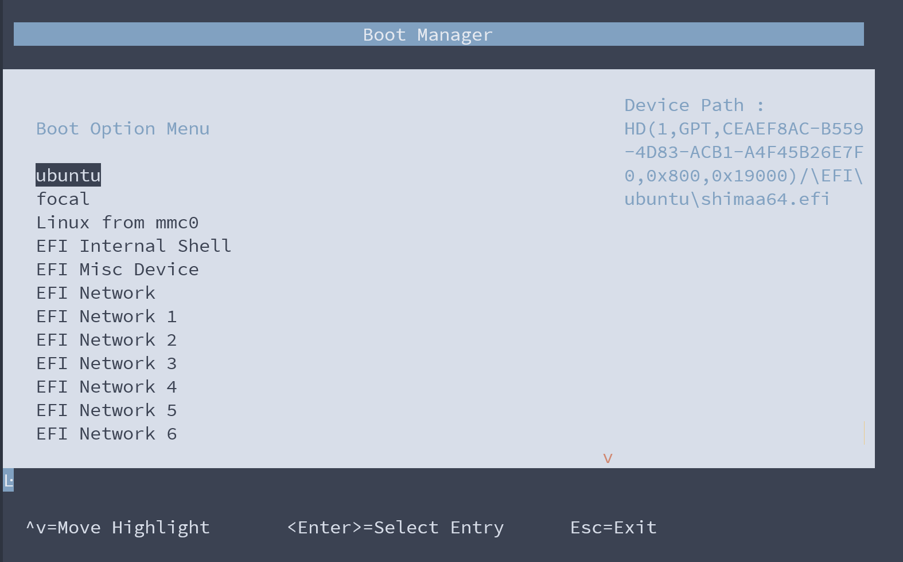
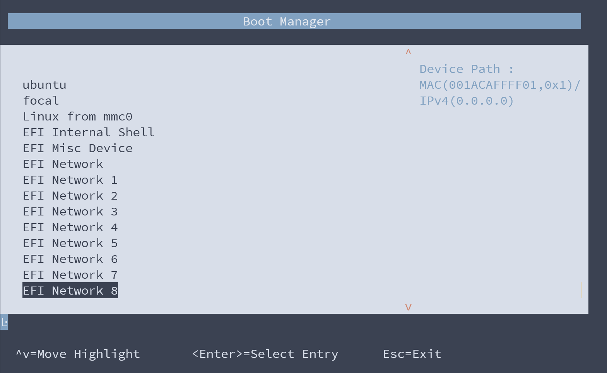
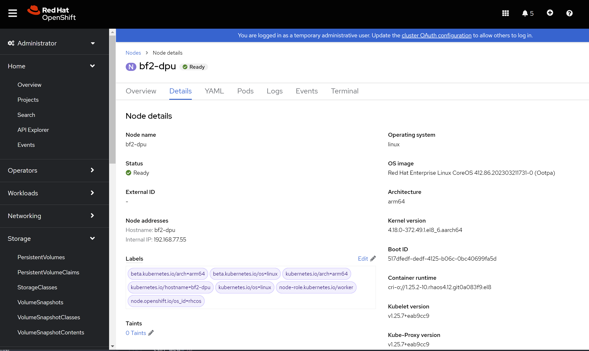

# openshift 4.12 BF2 offload

- [OVN/OVS offloading with OpenShift on NVIDIA BlueField-2 DPUs](https://access.redhat.com/articles/6804281)

bf2 network connection diagram:



- https://multi.ocp.releases.ci.openshift.org/
  - [4.12.9](https://multi.ocp.releases.ci.openshift.org/releasestream/4-stable-multi/release/4.12.9)
  - quay.io/openshift-release-dev/ocp-release:4.12.9-multi

# fresh BF2 with official ubuntu os 

- [Installing Red Hat Enterprise Linux on NVIDIA BlueField-2 DPU](https://developers.redhat.com/articles/2021/10/18/sensitive-information-detection-using-nvidia-morpheus-ai-framework#setting_up_nvidia_netq_agent_on_nvidia_bluefield_2_dpu)

```bash

# https://bugzilla.redhat.com/show_bug.cgi?id=1814682
dnf install -y kernel-modules-extra psmisc

mkdir -p /data/down/
cd /data/down/

dnf install -y rshim expect wget minicom rpm-build lshw
systemctl enable --now rshim
systemctl status rshim --no-pager -l

dnf install -y openssl-devel mstflint

# nat router on host
# https://access.redhat.com/discussions/4642721
cat << EOF >> /etc/sysctl.d/99-wzh-sysctl.conf

net.ipv4.ip_forward = 1

EOF
sysctl --system

systemctl disable --now firewalld

# download bfb from here
# https://developer.nvidia.com/networking/doca
# and docs here
# https://docs.nvidia.com/networking/display/BlueFieldDPUOSLatest/Deploying+BlueField+Software+Using+BFB+from+Host
wget -O bf2.bfb https://content.mellanox.com/BlueField/BFBs/Ubuntu20.04/DOCA_1.5.1_BSP_3.9.3_Ubuntu_20.04-4.2211-LTS.signed.bfb

cat bf2.bfb > /dev/rshim0/boot

# if you want to connect to bf2 through serial console
minicom --wrap --color on --baudrate 115200 --device /dev/rshim0/console

# on console of bf2
# login using ubuntu / ubuntu
# and change to mellanox

ip link | grep -A 1 enp3s0f1s0
# 11: enp3s0f1s0: <BROADCAST,MULTICAST,UP,LOWER_UP> mtu 1500 qdisc mq state UP mode DEFAULT group default qlen 1000
#     link/ether 02:7f:40:ae:d9:cc brd ff:ff:ff:ff:ff:ff

# upgrade fw
/opt/mellanox/mlnx-fw-updater/mlnx_fw_updater.pl

mlxconfig -d /dev/mst/mt41686_pciconf0 -y reset

mlxconfig -d /dev/mst/mt41686_pciconf0  s LINK_TYPE_P1=2 LINK_TYPE_P2=2

# power off and on machine.

grep -s -H "" /sys/class/net/*/phys_port_name
# /sys/class/net/en3f0pf0sf0/phys_port_name:pf0sf0
# /sys/class/net/en3f1pf1sf0/phys_port_name:pf1sf0
# /sys/class/net/enp3s0f0s0/phys_port_name:p0
# /sys/class/net/enp3s0f1s0/phys_port_name:p0
# /sys/class/net/p0/phys_port_name:p0
# /sys/class/net/p1/phys_port_name:p1
# /sys/class/net/pf0hpf/phys_port_name:pf0
# /sys/class/net/pf1hpf/phys_port_name:pf1

# on 101
nmcli con add type bridge-slave ifname enp7s0f1np1 master baremetal
nmcli con up baremetal

# on 103, bf2
cat /etc/netplan/60-mlnx.yaml
# network:
#   ethernets:
#     enp3s0f0s0:
#       renderer: networkd
#       dhcp4: 'true'
#     enp3s0f1s0:
#       renderer: networkd
#       dhcp4: 'true'
#   version: 2

cat << EOF > /etc/netplan/60-mlnx.yaml
network:
  ethernets:
    enp3s0f0s0:
      renderer: networkd
      dhcp4: 'true'
    enp3s0f1s0:
      renderer: networkd
      dhcp4: no
      addresses:
        - 192.168.7.113/24
      gateway4: 192.168.7.9
      nameservers:
          addresses: [114.114.114.114]
  version: 2
EOF

netplan apply

# login on 101
ssh ubuntu@192.168.7.113


```

# flash BF2 with rocky linux 8

we need to get ifname, so we have to flash it with rocky linux 8

```bash

# shell come frome https://github.com/wangzheng422/rhel-on-bf2
# download rhel8.6 install iso from  
# https://mirrors.nju.edu.cn/rocky/8/isos/aarch64/Rocky-8.7-aarch64-minimal.iso
export RHEL_ISO=Rocky-8.7-aarch64-minimal.iso
bash bluefield_provision.sh -s
# === STATUS === Checking usability of SRIOV for PCI 0000:05:00.0
# SRIOV enabled
# EMBEDDED_CPU mode enabled
# === STATUS === Checking usability of SRIOV for PCI 0000:05:00.1
# SRIOV enabled
# EMBEDDED_CPU mode enabled

setenforce 0

# bash bluefield_provision.sh -p

iptables -F
bash ./PXE_setup_RHEL_install_over_mlx.sh -i "${RHEL_ISO}" -p tmfifo -k RHEL8-bluefield.ks

uplink_interface="$(ip route |grep ^default | sed 's/.*dev \([^ ]\+\).*/\1/')"
test -n "${uplink_interface}" || die "need a default route"
    
iptables -t nat -A POSTROUTING -o "${uplink_interface}" -j MASQUERADE

# on a new terminal
minicom --wrap --color on --baudrate 115200 --device /dev/rshim0/console

# change back to original terminal
# to reboot the bf2
echo BOOT_MODE 1 > /dev/rshim0/misc
echo SW_RESET 1 > /dev/rshim0/misc

# sleep 10
nmcli conn up tmfifo_net0
systemctl restart dhcpd

iptables -t nat -A POSTROUTING -o "${uplink_interface}" -j MASQUERADE

# and see result on com console
# and press 'ESC' to see bios console
# and select 'Boot Manager'
# select EFI network with following content


```
see result on com console, press 'ESC' to see bios console



select 'Boot Manager'



select EFI network with following content



```
MAC(001ACAFFFF01,0x1)/
IPv4(0.0.0.0)
```
in our env, it is 'EFI Network 8'


select the item , and it will boot through pxe and install os

```bash
# [   21.067341] IPv6: ADDRCONF(NETDEV_CHANGE): enp3s0f1: link becomes ready

# on host, disable services
systemctl disable --now dhcpd httpd vsftpd tftp.socket tftp

# on bf2 console
# login using root / bluefield

nmcli con modify System\ eth0 con-name eth0
nmcli con modify eth0 ipv4.method manual ipv4.addresses 192.168.100.2/24 ipv4.gateway 192.168.100.1 ipv4.dns 172.21.1.1
nmcli con up eth0

nmcli con mod enp3s0f1 ipv4.method manual ipv4.addr 192.168.77.55/24 ipv4.gateway 192.168.77.9 ipv4.dns 192.168.77.11 
nmcli con up enp3s0f1

nmcli con down 'System eth0'

systemctl restart chronyd
chronyc sourcestats
chronyc makestep
hwclock -w

ethtool -i enp3s0f1
# driver: mlx5_core
# version: 4.18.0-425.3.1.el8.aarch64
# firmware-version: 24.35.2000 (MT_0000000539)
# expansion-rom-version:
# bus-info: 0000:03:00.1
# supports-statistics: yes
# supports-test: yes
# supports-eeprom-access: no
# supports-register-dump: no
# supports-priv-flags: yes

ethtool -i eth0
# driver: virtio_net
# version: 1.0.0
# firmware-version:
# expansion-rom-version:
# bus-info: virtio
# supports-statistics: yes
# supports-test: no
# supports-eeprom-access: no
# supports-register-dump: no
# supports-priv-flags: no

# login
ssh root@192.168.77.55
# bluefield

```

# install ocp cluster on kvm on 101 and 102

this is for hypershift host ocp

## create multi-arch release image

- https://access.redhat.com/documentation/en-us/red_hat_advanced_cluster_management_for_kubernetes/2.7/html/clusters/cluster_mce_overview#manual-release-image-cross-arch


```bash
# on vultr

# export BUILDNUMBER=4.12.9

# podman pull quay.io/openshift-release-dev/ocp-release:$BUILDNUMBER-x86_64
# podman pull quay.io/openshift-release-dev/ocp-release:$BUILDNUMBER-aarch64

# podman push quay.io/openshift-release-dev/ocp-release:$BUILDNUMBER-x86_64 quay.io/wangzheng422/ocp-release:$BUILDNUMBER-x86_64
# podman push quay.io/openshift-release-dev/ocp-release:$BUILDNUMBER-aarch64 quay.io/wangzheng422/ocp-release:$BUILDNUMBER-aarch64

# podman manifest create mymanifest
# podman manifest add mymanifest quay.io/wangzheng422/ocp-release:$BUILDNUMBER-x86_64
# podman manifest add mymanifest quay.io/wangzheng422/ocp-release:$BUILDNUMBER-aarch64

# podman manifest push mymanifest docker://quay.io/wangzheng422/ocp-release:$BUILDNUMBER

# on helper
export BUILDNUMBER=4.12.9

SEC_FILE='/data/pull-secret.json'

oc adm release mirror -a $SEC_FILE --keep-manifest-list=true \
  --from=quay.io/openshift-release-dev/ocp-release:$BUILDNUMBER-multi \
  --to=quaylab.infra.wzhlab.top:5443/ocp4/openshift4

# oc adm release mirror -a $SEC_FILE --keep-manifest-list=true \
#   --from=quay.io/openshift-release-dev/ocp-release:$BUILDNUMBER-x86_64 \
#   --to=quaylab.infra.wzhlab.top:5443/ocp4/openshift4

# oc adm release mirror -a $SEC_FILE --keep-manifest-list=true \
#   --from=quay.io/openshift-release-dev/ocp-release:$BUILDNUMBER-aarch64 \
#   --to=quaylab.infra.wzhlab.top:5443/ocp4/openshift4

# oc image mirror --keep-manifest-list=true quay.io/openshift-release-dev/ocp-release:$BUILDNUMBER-multi quaylab.infra.wzhlab.top:5443/ocp4/openshift4:$BUILDNUMBER-multi

# oc adm release info -a $SEC_FILE quay.io/openshift-release-dev/ocp-release:$BUILDNUMBER-multi  --filter-by-os=linux/arm64

# oc adm release info -a $SEC_FILE quay.io/openshift-release-dev/ocp-release:$BUILDNUMBER-multi  --filter-by-os=linux/amd64 --commit-urls

# get the binary
mkdir -p /data/ocp-$BUILDNUMBER-multi
cd /data/ocp-$BUILDNUMBER-multi

mkdir -p amd64
pushd amd64

# oc adm release extract -a $SEC_FILE --tools=true quay.io/openshift-release-dev/ocp-release:4.12.9-multi  --filter-by-os=linux/amd64

# try
mkdir -p ostree

VAR_IMAGE=`oc adm release info -a $SEC_FILE quay.io/openshift-release-dev/ocp-release:$BUILDNUMBER-multi  --filter-by-os=linux/amd64 --image-for=machine-os-images` 

oc image extract --path /:./ostree -a $SEC_FILE $VAR_IMAGE

/bin/cp -f ostree/coreos/coreos-*.iso ./
chmod +r *.iso

/bin/rm -rf ostree

oc adm release extract -a $SEC_FILE --command=oc quay.io/openshift-release-dev/ocp-release:$BUILDNUMBER-multi  --filter-by-os=linux/amd64
oc adm release extract -a $SEC_FILE --command=openshift-install quay.io/openshift-release-dev/ocp-release:$BUILDNUMBER-multi  --filter-by-os=linux/amd64
oc adm release extract -a $SEC_FILE --command=openshift-baremetal-install quay.io/openshift-release-dev/ocp-release:$BUILDNUMBER-multi  --filter-by-os=linux/amd64

popd

mkdir -p arm64
pushd arm64

mkdir -p ostree

VAR_IMAGE=`oc adm release info -a $SEC_FILE quay.io/openshift-release-dev/ocp-release:$BUILDNUMBER-multi  --filter-by-os=linux/arm64 --image-for=machine-os-images`

oc image extract --path /:./ostree -a $SEC_FILE $VAR_IMAGE --filter-by-os=linux/arm64 

/bin/cp -f ostree/coreos/coreos-*.iso ./
chmod +r *.iso

/bin/rm -rf ostree

oc adm release extract -a $SEC_FILE --command=oc  quay.io/openshift-release-dev/ocp-release:$BUILDNUMBER-multi  --filter-by-os=linux/arm64
oc adm release extract -a $SEC_FILE --command=openshift-install quay.io/openshift-release-dev/ocp-release:$BUILDNUMBER-multi  --filter-by-os=linux/arm64
# oc adm release extract -a $SEC_FILE --command=openshift-baremetal-install quay.io/openshift-release-dev/ocp-release:4.12.9-multi  --filter-by-os=linux/arm64

popd


# mkdir source

# oc adm release extract -a $SEC_FILE --git=source quay.io/openshift-release-dev/ocp-release:4.12.9-multi  --filter-by-os=linux/amd64

# on helper, as root
# get rootfs.img for arm
mount /data/ocp-$BUILDNUMBER-multi/arm64/coreos-aarch64.iso /mnt/
/bin/cp -f /mnt/images/pxeboot/rootfs.img  /data/ocp4/ocp-bf2-aarch64-rootfs.img
umount /mnt

```


## on helper node

终于所有的准备工作都做完了，我们开始在helper上面进行openshift的安装。在这之前，还有一个配置helper节点的步骤，主要是配置dns服务之类的，在这里就不重复了，有需要了解的，可以看[这里的文档](./4.11.helper.node.oc.mirror.md)

### get installer binary

我们先要从安装文件目录中，得到installer的二进制文件。

```bash

# switch to you install version

export BUILDNUMBER=4.12.9

pushd /data/ocp-${BUILDNUMBER}
tar -xzf openshift-client-linux-${BUILDNUMBER}.tar.gz -C /usr/local/bin/
tar -xzf openshift-install-linux-${BUILDNUMBER}.tar.gz -C /usr/local/bin/

install -m 755 /data/ocp4/clients/butane-amd64 /usr/local/bin/butane
install -m 755 /data/ocp4/clients/coreos-installer_amd64 /usr/local/bin/coreos-installer

popd

export BUILDNUMBER=4.12.9

pushd /data/ocp-${BUILDNUMBER}-multi/amd64

install oc /usr/local/bin/
install openshift-install /usr/local/bin/ 
install openshift-baremetal-install /usr/local/bin/

# install -m 755 /data/ocp4/clients/butane-amd64 /usr/local/bin/butane
# install -m 755 /data/ocp4/clients/coreos-installer_amd64 /usr/local/bin/coreos-installer

popd

openshift-install version
# openshift-install 4.12.9
# built from commit 15d8ffe8fa3a5ab2f36f7e0a54126c98733aaf25
# release image quay.io/openshift-release-dev/ocp-release@sha256:b79a218bdb20a80b0ae68eaf3e7c24ff8d5d2fecb71a84501e62d09f1095a705
# release architecture amd64

oc image info quay.io/openshift-release-dev/ocp-release@sha256:b79a218bdb20a80b0ae68eaf3e7c24ff8d5d2fecb71a84501e62d09f1095a705
  # OS            DIGEST
  # linux/amd64   sha256:a9497468740d289306e144ebc315164cfc457b9dbfb3d3b76c700149c3126866
  # linux/ppc64le sha256:5c3d9e3cfed3ec51159ea8b9e755cb8e9b3c27a06a0717ba753cb6a362b1fb5b
  # linux/s390x   sha256:ea2d15cfba1f27461783ef8b501685c0e6b2ddd7717f3720d34d3e4be1005860
  # linux/arm64   sha256:c1482f341d72097606f1e28c99159411d53891ccc63be24cdc14667990d6dac5

oc image info quay.io/openshift-release-dev/ocp-release:4.12.9-multi
  # OS            DIGEST
  # linux/amd64   sha256:a9497468740d289306e144ebc315164cfc457b9dbfb3d3b76c700149c3126866
  # linux/ppc64le sha256:5c3d9e3cfed3ec51159ea8b9e755cb8e9b3c27a06a0717ba753cb6a362b1fb5b
  # linux/s390x   sha256:ea2d15cfba1f27461783ef8b501685c0e6b2ddd7717f3720d34d3e4be1005860
  # linux/arm64   sha256:c1482f341d72097606f1e28c99159411d53891ccc63be24cdc14667990d6dac5


```

### create the install yaml

接下来我们创建安装配置文件。这里面最关键的就是那个yaml模板，我们在模板里面，启动IPI安装模式，并且配置3个master的redfish接口信息，并启用静态IP安装的方法，配置了静态IP信息。

安装配置yaml文件创建后，我们调用installer，把他们转化成ignition等真正的安装配置文件，并且和baremetal installer二进制文件一起，传递到物理机上。

这里面有2个二进制文件，一个是openshift installer，这个一般场景下，比如对接公有云，私有云，就够了，它会创建ignition文件，并且调用各种云的接口，创建虚拟机，开始安装。

但是如果是baremetal场景，有一个单独的baremetal installer二进制文件，它读取配置文件，调用物理机BMC接口信息，来开始安装，这个区别是目前openshift版本上的情况，不知道未来会不会有变化。

```bash
# create a user and create the cluster under the user

useradd -m 3nodeipi

usermod -aG wheel 3nodeipi

su - 3nodeipi

ssh-keygen

cat << EOF > ~/.ssh/config
StrictHostKeyChecking no
UserKnownHostsFile=/dev/null
EOF

chmod 600 ~/.ssh/config

cat << 'EOF' >> ~/.bashrc

export BASE_DIR='/home/3nodeipi/'

EOF

export BASE_DIR='/home/3nodeipi/'
export BUILDNUMBER=4.12.9

mkdir -p ${BASE_DIR}/data/{sno/disconnected,install}

# set some parameter of you rcluster

NODE_SSH_KEY="$(cat ${BASE_DIR}/.ssh/id_rsa.pub)"
INSTALL_IMAGE_REGISTRY=quaylab.infra.wzhlab.top:5443

# PULL_SECRET='{"auths":{"registry.redhat.io": {"auth": "ZHVtbXk6ZHVtbXk=","email": "noemail@localhost"},"registry.ocp4.redhat.ren:5443": {"auth": "ZHVtbXk6ZHVtbXk=","email": "noemail@localhost"},"'${INSTALL_IMAGE_REGISTRY}'": {"auth": "'$( echo -n 'admin:redhatadmin' | openssl base64 )'","email": "noemail@localhost"}}}'
PULL_SECRET=$(cat /data/pull-secret.json)

NTP_SERVER=192.168.77.11
# HELP_SERVER=192.168.77.11
# KVM_HOST=192.168.77.11
# API_VIP=192.168.77.99
# INGRESS_VIP=192.168.77.98
# CLUSTER_PROVISION_IP=192.168.77.98
MACHINE_NETWORK='192.168.77.0/24'

# 定义单节点集群的节点信息
SNO_CLUSTER_NAME=acm-demo-one
SNO_BASE_DOMAIN=wzhlab.top

BOOTSTRAP_IP=192.168.77.22
MASTER_01_IP=192.168.77.23
# MASTER_02_IP=192.168.77.24
# MASTER_03_IP=192.168.77.25
# WORKER_01_IP=192.168.77.26

BOOTSTRAP_HOSTNAME=bootstrap-demo
MASTER_01_HOSTNAME=master-01-demo
# MASTER_02_HOSTNAME=master-02-demo
# MASTER_03_HOSTNAME=master-03-demo
# WORKER_01_HOSTNAME=worker-01-demo

BOOTSTRAP_INTERFACE=enp1s0
MASTER_01_INTERFACE=enp1s0
# MASTER_02_INTERFACE=enp1s0
# MASTER_03_INTERFACE=enp1s0
# WORKER_01_INTERFACE=enp1s0

# MASTER_01_INTERFACE_MAC=52:54:00:12:A1:01
# MASTER_02_INTERFACE_MAC=52:54:00:12:A1:02
# MASTER_03_INTERFACE_MAC=52:54:00:12:A1:03
# MASTER_03_INTERFACE_MAC=52:54:00:12:A1:03

BOOTSTRAP_DISK=/dev/vda
MASTER_01_DISK=/dev/vda
# MASTER_02_DISK=/dev/vda
# MASTER_03_DISK=/dev/vda
# WORKER_01_DISK=/dev/vda

OCP_GW=192.168.77.9
OCP_NETMASK=255.255.255.0
OCP_NETMASK_S=24
OCP_DNS=192.168.77.11

# echo ${SNO_IF_MAC} > /data/sno/sno.mac

mkdir -p ${BASE_DIR}/data/install
cd ${BASE_DIR}/data/install

/bin/rm -rf *.ign .openshift_install_state.json auth bootstrap manifests master*[0-9] worker*[0-9] *

cat << EOF > ${BASE_DIR}/data/install/install-config.yaml 
apiVersion: v1
baseDomain: $SNO_BASE_DOMAIN
compute:
- name: worker
  replicas: 0 
controlPlane:
  name: master
  replicas: 1
metadata:
  name: $SNO_CLUSTER_NAME
networking:
  # OVNKubernetes , OpenShiftSDN
  clusterNetwork:
    - cidr: 172.21.0.0/16
      hostPrefix: 23
    # - cidr: fd02::/48
    #   hostPrefix: 64
  machineNetwork:
    - cidr: $MACHINE_NETWORK
    # - cidr: 2001:DB8::/32
  serviceNetwork:
    - 172.22.0.0/16
    # - fd03::/112
platform: 
  none: {}
pullSecret: '${PULL_SECRET}'
sshKey: |
$( cat ${BASE_DIR}/.ssh/id_rsa.pub | sed 's/^/   /g' )
additionalTrustBundle: |
$( cat /etc/crts/redhat.ren.ca.crt | sed 's/^/   /g' )
imageContentSources:
- mirrors:
  - ${INSTALL_IMAGE_REGISTRY}/ocp4/openshift4
  source: quay.io/openshift-release-dev/ocp-release
- mirrors:
  - ${INSTALL_IMAGE_REGISTRY}/ocp4/openshift4
  source: quay.io/openshift-release-dev/ocp-v4.0-art-dev
EOF


/bin/cp -f ${BASE_DIR}/data/install/install-config.yaml ${BASE_DIR}/data/install/install-config.yaml.bak

openshift-install --dir=${BASE_DIR}/data/install create manifests

# sudo bash -c "/bin/cp -f mirror/registries.conf /etc/containers/registries.conf.d/; chmod +r /etc/containers/registries.conf.d/*"

# /bin/cp -f  /data/ocp4/ansible-helper/files/* ${BASE_DIR}/data/install/openshift/

sudo bash -c "cd /data/ocp4 ; bash image.registries.conf.sh quaylab.infra.wzhlab.top:5443 ;"

/bin/cp -f /data/ocp4/99-worker-container-registries.yaml ${BASE_DIR}/data/install/openshift
/bin/cp -f /data/ocp4/99-master-container-registries.yaml ${BASE_DIR}/data/install/openshift

cd ${BASE_DIR}/data/install/

openshift-install --dir=${BASE_DIR}/data/install create ignition-configs 

# HTTP_PATH=http://192.168.7.11:8080/ignition


source /data/ocp4/acm.fn.sh

# 我们会创建一个wzh用户，密码是redhat，这个可以在第一次启动的是，从console/ssh直接用用户名口令登录
# 方便排错和研究
VAR_PWD_HASH="$(python3 -c 'import crypt,getpass; print(crypt.crypt("redhat"))')"

cat ${BASE_DIR}/data/install/bootstrap.ign \
  | jq --arg VAR "$VAR_PWD_HASH" --arg VAR_SSH "$NODE_SSH_KEY" '.passwd.users += [{ "name": "wzh", "system": true, "passwordHash": $VAR , "sshAuthorizedKeys": [ $VAR_SSH ], "groups": [ "adm", "wheel", "sudo", "systemd-journal"  ] }]' \
  | jq '. += { "kernel_arguments" : { "should_exist" : [ "systemd.debug-shell=1" ] } }' \
  | jq -c . \
  > ${BASE_DIR}/data/install/bootstrap-iso.ign

cat ${BASE_DIR}/data/install/master.ign \
  | jq --arg VAR "$VAR_PWD_HASH" --arg VAR_SSH "$NODE_SSH_KEY" '.passwd.users += [{ "name": "wzh", "system": true, "passwordHash": $VAR , "sshAuthorizedKeys": [ $VAR_SSH ], "groups": [ "adm", "wheel", "sudo", "systemd-journal"  ] }]' \
  | jq '. += { "kernel_arguments" : { "should_exist" : [ "systemd.debug-shell=1" ] } }' \
  | jq -c . \
  > ${BASE_DIR}/data/install/master-iso.ign


cd ${BASE_DIR}/data/install/
/bin/cp -f /data/ocp-$BUILDNUMBER-multi/amd64/coreos-x86_64.iso bootstrap.iso
# /bin/cp -f /data/ocp-4.10.43/rhcos-live.x86_64.iso bootstrap.iso
/bin/cp -f bootstrap.iso master01.iso
# /bin/cp -f bootstrap.iso master02.iso
# /bin/cp -f bootstrap.iso master03.iso
# sudo /bin/cp -f /data/work/ext-client/iso/rhcos-$VAR_IMAGE_VER-metal.x86_64.raw /data/dnf/
sudo /bin/cp -f ${BASE_DIR}/data/install/{bootstrap,master}-iso.ign /data/dnf/


# for ipv4 only
coreos-installer iso kargs modify -a "ip=$BOOTSTRAP_IP::$OCP_GW:$OCP_NETMASK:$BOOTSTRAP_HOSTNAME:$BOOTSTRAP_INTERFACE:none nameserver=$OCP_DNS coreos.inst.install_dev=$BOOTSTRAP_DISK coreos.inst.ignition_url=http://192.168.77.11:5000/bootstrap-iso.ign  coreos.inst.insecure systemd.debug-shell=1 " bootstrap.iso

coreos-installer iso kargs modify -a "ip=$MASTER_01_IP::$OCP_GW:$OCP_NETMASK:$MASTER_01_HOSTNAME:$MASTER_01_INTERFACE:none nameserver=$OCP_DNS coreos.inst.install_dev=$MASTER_01_DISK coreos.inst.ignition_url=http://192.168.77.11:5000/master-iso.ign  coreos.inst.insecure systemd.debug-shell=1 " master01.iso

# coreos-installer iso kargs modify -a "ip=$MASTER_02_IP::$OCP_GW:$OCP_NETMASK:$MASTER_02_HOSTNAME:$MASTER_02_INTERFACE:none nameserver=$OCP_DNS coreos.inst.install_dev=$MASTER_02_DISK coreos.inst.ignition_url=http://192.168.77.11:5000/master-iso.ign  coreos.inst.insecure systemd.debug-shell=1 " master02.iso

# coreos-installer iso kargs modify -a "ip=$MASTER_03_IP::$OCP_GW:$OCP_NETMASK:$MASTER_03_HOSTNAME:$MASTER_03_INTERFACE:none nameserver=$OCP_DNS coreos.inst.install_dev=$MASTER_03_DISK coreos.inst.ignition_url=http://192.168.77.11:5000/master-iso.ign  coreos.inst.insecure systemd.debug-shell=1 " master03.iso


```


### cleanup kvm ( 101 )

我们准备了脚本，来清理kvm，把物理机清理成一个干净的系统。

```bash

create_lv() {
    var_vg=$1
    var_pool=$2
    var_lv=$3
    var_size=$4
    var_action=$5
    lvremove -f $var_vg/$var_lv
    # lvcreate -y -L $var_size -n $var_lv $var_vg
    if [ "$var_action" == "recreate" ]; then
      lvcreate --type thin -n $var_lv -V $var_size --thinpool $var_vg/$var_pool
      wipefs --all --force /dev/$var_vg/$var_lv
    fi
}

virsh destroy ocp4-acm-one-bootstrap
virsh undefine ocp4-acm-one-bootstrap

create_lv vgdata poolA lvacm-one-bootstrap 500G 
create_lv vgdata poolA lvacm-one-bootstrap-data 500G 

virsh destroy ocp4-acm-one-master-01
virsh undefine ocp4-acm-one-master-01

create_lv vgdata poolA lvacm-one-master-01 500G 
create_lv vgdata poolA lvacm-one-master-01-data 500G 

virsh destroy ocp4-acm-one-master-02
virsh undefine ocp4-acm-one-master-02

create_lv vgdata poolA lvacm-one-master-02 500G 
create_lv vgdata poolA lvacm-one-master-02-data 500G 

virsh destroy ocp4-acm-one-master-03
virsh undefine ocp4-acm-one-master-03

create_lv vgdata poolA lvacm-one-master-03 500G 
create_lv vgdata poolA lvacm-one-master-03-data 500G 


VAR_VM=`virsh list --all | grep bootstrap | awk '{print $2}'`
virsh destroy $VAR_VM
virsh undefine $VAR_VM
VAR_POOL=`virsh pool-list --all | grep bootstrap | awk '{print $1}'`
virsh pool-destroy $VAR_POOL
virsh pool-undefine $VAR_POOL
/bin/rm -rf /var/lib/libvirt/openshift-images/*
/bin/rm -rf /var/lib/libvirt/images/*


```

### start kvm ( 101 )


```bash

nmcli con mod baremetal +ipv4.address '192.168.77.101/24'
nmcli con mod baremetal ipv4.dns 192.168.77.11
nmcli con up baremetal

/bin/rm -rf /var/lib/libvirt/images/*


for var_file in bootstrap master01
do
  scp root@192.168.77.11:/home/3nodeipi/data/install/$var_file.iso /data/kvm/one/
done

create_lv() {
    var_vg=$1
    var_pool=$2
    var_lv=$3
    var_size=$4
    var_action=$5
    lvremove -f $var_vg/$var_lv
    # lvcreate -y -L $var_size -n $var_lv $var_vg
    if [ "$var_action" == "recreate" ]; then
      lvcreate --type thin -n $var_lv -V $var_size --thinpool $var_vg/$var_pool
      wipefs --all --force /dev/$var_vg/$var_lv
    fi
}

virsh destroy ocp4-acm-one-bootstrap
virsh undefine ocp4-acm-one-bootstrap

create_lv vgdata poolA lvacm-one-bootstrap 500G recreate
create_lv vgdata poolA lvacm-one-bootstrap-data 500G recreate

SNO_MEM=50

virt-install --name=ocp4-acm-one-bootstrap --vcpus=16 --ram=$(($SNO_MEM*1024)) \
  --cpu=host-model \
  --disk path=/dev/vgdata/lvacm-one-bootstrap,device=disk,bus=virtio,format=raw \
  --disk path=/dev/vgdata/lvacm-one-bootstrap-data,device=disk,bus=virtio,format=raw \
  --os-variant rhel8.3 --network bridge=baremetal,model=virtio \
  --graphics vnc,port=59002 --noautoconsole \
  --boot menu=on --cdrom /data/kvm/one/bootstrap.iso 

# --disk path=/dev/vgdata/lvacmhub-data,device=disk,bus=virtio,format=raw \
# --autoconsole text
# --graphics vnc,port=59002 \

# virsh console  ocp4-acm-one-bootstrap

virsh destroy ocp4-acm-one-master-01
virsh undefine ocp4-acm-one-master-01

create_lv vgdata poolA lvacm-one-master-01 500G recreate
create_lv vgdata poolA lvacm-one-master-01-data 500G recreate

virt-install --name=ocp4-acm-one-master-01 --vcpus=16 --ram=$(($SNO_MEM*1024)) \
  --cpu=host-model \
  --disk path=/dev/vgdata/lvacm-one-master-01,device=disk,bus=virtio,format=raw \
  --disk path=/dev/vgdata/lvacm-one-master-01-data,device=disk,bus=virtio,format=raw \
  --os-variant rhel8.3 --network bridge=baremetal,model=virtio \
  --graphics vnc,port=59003 --noautoconsole \
  --boot menu=on --cdrom /data/kvm/one/master01.iso 

# virsh destroy ocp4-acm-one-master-02
# virsh undefine ocp4-acm-one-master-02

# create_lv vgdata poolA lvacm-one-master-02 500G recreate
# create_lv vgdata poolA lvacm-one-master-02-data 500G recreate

# virt-install --name=ocp4-acm-one-master-02 --vcpus=16 --ram=$(($SNO_MEM*1024)) \
#   --cpu=host-model \
#   --disk path=/dev/vgdata/lvacm-one-master-02,device=disk,bus=virtio,format=raw \
#   --disk path=/dev/vgdata/lvacm-one-master-02-data,device=disk,bus=virtio,format=raw \
#   --os-variant rhel8.3 --network bridge=baremetal,model=virtio \
#   --graphics vnc,port=59004 --noautoconsole \
#   --boot menu=on --cdrom /data/kvm/one/master02.iso 

# virsh destroy ocp4-acm-one-master-03
# virsh undefine ocp4-acm-one-master-03

# create_lv vgdata poolA lvacm-one-master-03 500G recreate
# create_lv vgdata poolA lvacm-one-master-03-data 500G recreate

# virt-install --name=ocp4-acm-one-master-03 --vcpus=16 --ram=$(($SNO_MEM*1024)) \
#   --cpu=host-model \
#   --disk path=/dev/vgdata/lvacm-one-master-03,device=disk,bus=virtio,format=raw \
#   --disk path=/dev/vgdata/lvacm-one-master-03-data,device=disk,bus=virtio,format=raw \
#   --os-variant rhel8.3 --network bridge=baremetal,model=virtio \
#   --graphics vnc,port=59005 --noautoconsole \
#   --boot menu=on --cdrom /data/kvm/one/master03.iso 


```


## on helper to see result

我们需要把物理机上的密钥文件等信息，传回helper节点。方便我们后续的操作。

```bash
# on helper node

cd ${BASE_DIR}/data/install
export KUBECONFIG=${BASE_DIR}/data/install/auth/kubeconfig
echo "export KUBECONFIG=${BASE_DIR}/data/install/auth/kubeconfig" >> ~/.bashrc
# oc completion bash | sudo tee /etc/bash_completion.d/openshift > /dev/null


cd ${BASE_DIR}/data/install
openshift-install wait-for install-complete --log-level debug
# INFO Install complete!
# INFO To access the cluster as the system:admin user when using 'oc', run 'export KUBECONFIG=/home/3nodeipi/data/install/auth/kubeconfig'
# INFO Access the OpenShift web-console here: https://console-openshift-console.apps.acm-demo-one.wzhlab.top
# INFO Login to the console with user: "kubeadmin", and password: "dAdjK-grzQP-mgG2w-QLe29"
# INFO Time elapsed: 0s

# if you power off cluster for long time
# you will need to re-approve the csr
oc get csr | grep -v Approved
oc get csr -ojson | jq -r '.items[] | select(.status == {} ) | .metadata.name' | xargs oc adm certificate approve

# oc patch clusterversion/version --patch '{"spec":{"upstream":"https://multi.ocp.releases.ci.openshift.org/graph"}}' --type=merge

oc get clusterversions.config.openshift.io  -o yaml | grep Payload -A 2
      # message: Payload loaded version="4.12.9" image="quay.io/openshift-release-dev/ocp-release@sha256:a9497468740d289306e144ebc315164cfc457b9dbfb3d3b76c700149c3126866"
      #   architecture="multi"
      # reason: PayloadLoaded
      # status: "True"
      # type: ReleaseAccepted


```

## daily operation

### password login and oc config

```bash

# init setting for helper node
cat << EOF > ~/.ssh/config
StrictHostKeyChecking no
UserKnownHostsFile=/dev/null
EOF
chmod 600 ~/.ssh/config


cat > ${BASE_DIR}/data/install/crack.txt << EOF

echo redhat | sudo passwd --stdin root

sudo sed -i "s|^PasswordAuthentication no$|PasswordAuthentication yes|g" /etc/ssh/sshd_config
sudo sed -i "s|^PermitRootLogin no$|PermitRootLogin yes|g" /etc/ssh/sshd_config
sudo sed -i "s|^#ClientAliveInterval 180$|ClientAliveInterval 1800|g" /etc/ssh/sshd_config

sudo systemctl restart sshd

sudo sh -c 'echo "export KUBECONFIG=/etc/kubernetes/static-pod-resources/kube-apiserver-certs/secrets/node-kubeconfigs/localhost.kubeconfig" >> /root/.bashrc'

sudo sh -c 'echo "RET=\\\`oc config use-context system:admin\\\`" >> /root/.bashrc'

EOF

for i in 23
do
  ssh core@192.168.77.$i < ${BASE_DIR}/data/install/crack.txt
done

```

from other host

```bash
# https://unix.stackexchange.com/questions/230084/send-the-password-through-stdin-in-ssh-copy-id
dnf install -y sshpass

for i in 23
do
  sshpass -p 'redhat' ssh-copy-id root@192.168.77.$i
done

```

### power off / reboot

```bash

action=poweroff
# action=reboot
for i in 23 24 25
do
  ssh root@192.168.12.$i "$action"
done

virsh shutdown openwrt-factory
virsh shutdown openwrt-edge

```

### power on

```bash

virsh start openwrt-factory
virsh start openwrt-edge

for i in {1..3}
do
  virsh start ocp4-ipi-osp-master-0$i
done

```

### check info

我们日常还会有一些集群各个节点收集信息，脚本操作的工作，也提供脚本模板，帮助日常工作。

```bash

cat > ${BASE_DIR}/data/install/crack.txt << 'EOF'

for i in {3..8}
do
  nmcli con down enp${i}s0
  nmcli con del enp${i}s0
done

EOF

for i in 23 24 25
do
  ssh root@192.168.12.$i < ${BASE_DIR}/data/install/crack.txt
done

```


## deploy NFS on hub

```bash

# go to master-03, this is as storage node
# create the storage path
cat > ${BASE_DIR}/data/install/crack.txt << 'EOF'
mkdir -p /var/wzh-local-pv/
chcon -Rt container_file_t /var/wzh-local-pv/
EOF
ssh root@192.168.77.25 < ${BASE_DIR}/data/install/crack.txt

# on helper
cat << EOF > ${BASE_DIR}/data/install/local-pv.yaml
---
kind: StorageClass
apiVersion: storage.k8s.io/v1
metadata:
  name: local-volume
provisioner: kubernetes.io/no-provisioner
volumeBindingMode: WaitForFirstConsumer
---
apiVersion: v1
kind: PersistentVolume
metadata:
  name: example-local-pv
spec:
  capacity:
    storage: 400Gi
  accessModes:
  - ReadWriteOnce
  persistentVolumeReclaimPolicy: Retain
  storageClassName: local-volume
  local:
    path: /var/wzh-local-pv/
  nodeAffinity:
    required:
      nodeSelectorTerms:
      - matchExpressions:
        - key: kubernetes.io/hostname
          operator: In
          values:
          - one-master-03.acm-demo-one.wzhlab.top
EOF
oc create --save-config -f ${BASE_DIR}/data/install/local-pv.yaml

# oc delete -f ${BASE_DIR}/data/install/local-pv.yaml

# move container image to quay.io
skopeo copy docker://k8s.gcr.io/sig-storage/nfs-provisioner:v3.0.0 docker://quay.io/wangzheng422/nfs-provisioner:v3.0.0

oc create ns nfs-system

# oc project nfs-system

cd ${BASE_DIR}/data/install

export http_proxy="http://127.0.0.1:18801"
export https_proxy=${http_proxy}

wget -O nfs.all.yaml https://raw.githubusercontent.com/wangzheng422/nfs-ganesha-server-and-external-provisioner/wzh/deploy/openshift/nfs.all.local.pv.wzhlab.yaml

unset http_proxy
unset https_proxy

/bin/cp -f nfs.all.yaml nfs.all.yaml.run

# sed -i 's/storageClassName: odf-lvm-vg1/storageClassName: local-volume/' nfs.all.yaml.run
sed -i 's/one-master-03.acm-demo-one.redhat.ren/one-master-03.acm-demo-one.wzhlab.top/' nfs.all.yaml.run
sed -i 's/storage: 5Gi/storage: 400Gi/' nfs.all.yaml.run
sed -i 's#k8s.gcr.io/sig-storage/nfs-provisioner:v3.0.0#quay.io/wangzheng422/nfs-provisioner:v3.0.0#' nfs.all.yaml.run

oc create --save-config -n nfs-system -f nfs.all.yaml.run

# oc delete -n nfs-system -f nfs.all.yaml.run

oc patch storageclass wzhlab-top-nfs -p '{"metadata": {"annotations":{"storageclass.kubernetes.io/is-default-class":"true"}}}'

```

## add bf2 to sno cluster

### build bf2 iso

```bash
# on helper
export BUILDNUMBER=4.12.9
cd ${BASE_DIR}/data/install/

# /bin/cp -f /data/ocp-$BUILDNUMBER-multi/arm64/coreos-aarch64.iso ./ocp-bf2-aarch64.iso

oc extract -n openshift-machine-api secret/worker-user-data --keys=userData --to=- > bf2.ign

source /data/ocp4/acm.fn.sh

# 我们会创建一个wzh用户，密码是redhat，这个可以在第一次启动的是，从console/ssh直接用用户名口令登录
# 方便排错和研究
VAR_PWD_HASH="$(python3 -c 'import crypt,getpass; print(crypt.crypt("redhat"))')"

cat ${BASE_DIR}/data/install/bf2.ign \
  | jq --arg VAR "$VAR_PWD_HASH" --arg VAR_SSH "$NODE_SSH_KEY" '.passwd.users += [{ "name": "wzh", "system": true, "passwordHash": $VAR , "sshAuthorizedKeys": [ $VAR_SSH ], "groups": [ "adm", "wheel", "sudo", "systemd-journal"  ] }]' \
  | jq '. += { "kernel_arguments" : { "should_exist" : [ "systemd.debug-shell=1" ] } }' \
  | jq -c . \
  > ${BASE_DIR}/data/install/bf2-iso.ign

sudo bash -c "/bin/cp -f ${BASE_DIR}/data/install/bf2-iso.ign /data/dnf/bf2-iso.ign"
# coreos-installer iso ignition embed ocp-bf2-aarch64.iso --ignition-file bf2-iso.ign -f

# try to run on bf2
# on helper
# scp /data/ocp-$BUILDNUMBER-multi/arm64/coreos-aarch64.iso root@192.168.77.55:/root/bf2/ocp-bf2-aarch64.iso
# scp bf2.ign root@192.168.77.55:/root/bf2/

# on bf2
# sync the clock to hw, otherwise, the https cert will invalid
hwclock -w

# cd /root/bf2
# wget -O coreos-installer https://mirror.openshift.com/pub/openshift-v4/clients/coreos-installer/latest/coreos-installer_arm64
# chmod +x coreos-installer
# ./coreos-installer iso ignition embed ocp-bf2-aarch64.iso --ignition-file bf2.ign -f


# try x86
# cd ${BASE_DIR}/data/install/

# /bin/cp -f /data/ocp-$BUILDNUMBER/rhcos-live.x86_64.iso ./worker.iso

# oc extract -n openshift-machine-api secret/worker-user-data --keys=userData --to=- > bf2.ign

# sudo bash -c "/bin/cp -f bf2.ign /data/dnf/"

# coreos-installer iso kargs modify -a "ip=$WORKER_01_IP::$OCP_GW:$OCP_NETMASK:$WORKER_01_HOSTNAME:$WORKER_01_INTERFACE:none nameserver=$OCP_DNS coreos.inst.install_dev=$WORKER_01_DISK coreos.inst.ignition_url=http://192.168.77.11:5000/bf2.ign  coreos.inst.insecure systemd.debug-shell=1 " worker.iso

```

### boot the bf2 with the iso

```bash
# copy iso to 103
# on 103
cd /data/down/
# scp root@192.168.77.11:/home/3nodeipi/data/install/ocp-bf2-aarch64.iso  ./
# scp root@192.168.77.11:/home/3nodeipi/down/ocp-bf2-aarch64-rootfs.img  ./
# scp root@192.168.77.11:/home/3nodeipi/data/install/worker.iso  ./

scp root@192.168.77.11:/data/ocp-4.12.9-multi/arm64/coreos-aarch64.iso ./ocp-bf2-aarch64.iso

# get the iso from bf2
# cd /data/down/
# scp root@192.168.77.55:/root/bf2/ocp-bf2-aarch64.iso ./

# python3 -m http.server 8080

export RHEL_ISO=ocp-bf2-aarch64.iso
# export BASE_ISO=Rocky-8.7-aarch64-minimal.iso
# shell come frome https://github.com/wangzheng422/rhel-on-bf2
bash bluefield_provision.sh -s
# === STATUS === Checking usability of SRIOV for PCI 0000:05:00.0
# SRIOV enabled
# EMBEDDED_CPU mode enabled
# === STATUS === Checking usability of SRIOV for PCI 0000:05:00.1
# SRIOV enabled
# EMBEDDED_CPU mode enabled

setenforce 0

# bash bluefield_provision.sh -p

iptables -F
bash ./PXE_setup_RHEL_install_over_mlx.aarch64.sh -i "${RHEL_ISO}" -p tmfifo 


# uplink_interface="$(ip route |grep ^default | sed 's/.*dev \([^ ]\+\).*/\1/')"
# test -n "${uplink_interface}" || die "need a default route"
    
# iptables -t nat -A POSTROUTING -o "${uplink_interface}" -j MASQUERADE

# on a new terminal
minicom --wrap --color on --baudrate 115200 --device /dev/rshim0/console

# change back to original terminal
# to reboot the bf2
echo BOOT_MODE 1 > /dev/rshim0/misc
echo SW_RESET 1 > /dev/rshim0/misc


# sleep 10
# ESC during bf2 boot, to go into bios config
# select boot from network 8
# before continue, restart nic and dhcpd on host
nmcli conn up tmfifo_net0
systemctl restart dhcpd

# iptables -t nat -A POSTROUTING -o "${uplink_interface}" -j MASQUERADE

# after booting
ssh core@192.168.77.55

# on helper
oc get csr | grep -v Approved
oc get csr -ojson | jq -r '.items[] | select(.status == {} ) | .metadata.name' | xargs oc adm certificate approve

oc get node -o wide
# NAME             STATUS     ROLES                         AGE     VERSION           INTERNAL-IP     EXTERNAL-IP   OS-IMAGE                                                        KERNEL-VERSION                  CONTAINER-RUNTIME
# bf2-dpu          NotReady   worker                        2m15s   v1.25.7+eab9cc9   192.168.77.55   <none>        Red Hat Enterprise Linux CoreOS 412.86.202303211731-0 (Ootpa)   4.18.0-372.49.1.el8_6.aarch64   cri-o://1.25.2-10.rhaos4.12.git0a083f9.el8
# master-01-demo   Ready      control-plane,master,worker   28h     v1.25.7+eab9cc9   192.168.77.23   <none>        Red Hat Enterprise Linux CoreOS 412.86.202303211731-0 (Ootpa)   4.18.0-372.49.1.el8_6.x86_64    cri-o://1.25.2-10.rhaos4.12.git0a083f9.el8

oc get node -o wide --show-labels
# NAME             STATUS     ROLES                         AGE   VERSION           INTERNAL-IP     EXTERNAL-IP   OS-IMAGE                                                        KERNEL-VERSION                  CONTAINER-RUNTIME                            LABELS
# bf2-dpu          NotReady   worker                        56s   v1.25.7+eab9cc9   192.168.77.55   <none>        Red Hat Enterprise Linux CoreOS 412.86.202303211731-0 (Ootpa)   4.18.0-372.49.1.el8_6.aarch64   cri-o://1.25.2-10.rhaos4.12.git0a083f9.el8   beta.kubernetes.io/arch=arm64,beta.kubernetes.io/os=linux,kubernetes.io/arch=arm64,kubernetes.io/hostname=bf2-dpu,kubernetes.io/os=linux,node-role.kubernetes.io/worker=,node.openshift.io/os_id=rhcos
# master-01-demo   Ready      control-plane,master,worker   28h   v1.25.7+eab9cc9   192.168.77.23   <none>        Red Hat Enterprise Linux CoreOS 412.86.202303211731-0 (Ootpa)   4.18.0-372.49.1.el8_6.x86_64    cri-o://1.25.2-10.rhaos4.12.git0a083f9.el8   beta.kubernetes.io/arch=amd64,beta.kubernetes.io/os=linux,kubernetes.io/arch=amd64,kubernetes.io/hostname=master-01-demo,kubernetes.io/os=linux,node-role.kubernetes.io/control-plane=,node-role.kubernetes.io/master=,node-role.kubernetes.io/worker=,node.openshift.io/os_id=rhcos

lsblk
# NAME         MAJ:MIN RM  SIZE RO TYPE MOUNTPOINT
# mmcblk0      179:0    0 58.3G  0 disk
# ├─mmcblk0p1  179:1    0    1M  0 part
# ├─mmcblk0p2  179:2    0  127M  0 part
# ├─mmcblk0p3  179:3    0  384M  0 part /boot
# └─mmcblk0p4  179:4    0 57.8G  0 part /sysroot
# mmcblk0boot0 179:8    0    4M  1 disk
# mmcblk0boot1 179:16   0    4M  1 disk

lscpu
# Architecture:        aarch64
# Byte Order:          Little Endian
# CPU(s):              8
# On-line CPU(s) list: 0-7
# Thread(s) per core:  1
# Core(s) per socket:  8
# Socket(s):           1
# NUMA node(s):        1
# Vendor ID:           ARM
# BIOS Vendor ID:      https://www.mellanox.com
# Model:               0
# Model name:          Cortex-A72
# BIOS Model name:     Mellanox BlueField-2 [A1] A72(D08) r1p0
# Stepping:            r1p0
# BogoMIPS:            400.00
# L1d cache:           32K
# L1i cache:           48K
# L2 cache:            1024K
# L3 cache:            6144K
# NUMA node0 CPU(s):   0-7
# Flags:               fp asimd evtstrm crc32 cpuid

free -h
#               total        used        free      shared  buff/cache   available
# Mem:           15Gi       1.6Gi        10Gi        80Mi       3.9Gi        11Gi
# Swap:            0B          0B          0B


```




## install bf2 offload components on bf2 ocp cluster

Installing the DPU Network Operator

```bash
# debug tools image is located in 'tools' in release .txt
oc debug node/bf2-dpu --image=quay.io/openshift-release-dev/ocp-v4.0-art-dev@sha256:6fa71688912c59556b018ee1312431873a15818f6f4615a5950c03dc9dfe789d
grep -s -H "" /sys/class/net/*/phys_port_name
# /sys/class/net/enp3s0f0/phys_port_name:p0
# /sys/class/net/enp3s0f0nc1pf0/phys_port_name:c1pf0

oc debug node/bf2-dpu --image=quay.io/openshift-release-dev/ocp-v4.0-art-dev@sha256:6fa71688912c59556b018ee1312431873a15818f6f4615a5950c03dc9dfe789d -- ls -l /sys/class/net
# total 0
# lrwxrwxrwx. 1 root root 0 Apr 12 04:20 br-ex -> ../../devices/virtual/net/br-ex
# lrwxrwxrwx. 1 root root 0 Apr 12 04:11 enamlnxbf17i0 -> ../../devices/platform/MLNXBF17:00/net/enamlnxbf17i0
# lrwxrwxrwx. 1 root root 0 Apr 12 04:11 enp3s0f0 -> ../../devices/pci0000:00/0000:00:00.0/0000:01:00.0/0000:02:00.0/0000:03:00.0/net/enp3s0f0
# lrwxrwxrwx. 1 root root 0 Apr 12 04:11 enp3s0f0nc1pf0 -> ../../devices/pci0000:00/0000:00:00.0/0000:01:00.0/0000:02:00.0/0000:03:00.0/net/enp3s0f0nc1pf0
# lrwxrwxrwx. 1 root root 0 Apr 12 04:11 enp3s0f1 -> ../../devices/pci0000:00/0000:00:00.0/0000:01:00.0/0000:02:00.0/0000:03:00.1/net/enp3s0f1
# lrwxrwxrwx. 1 root root 0 Apr 12 04:11 eth0 -> ../../devices/platform/MLNXBF01:00/virtio1/net/eth0
# lrwxrwxrwx. 1 root root 0 Apr 12 04:11 lo -> ../../devices/virtual/net/lo
# lrwxrwxrwx. 1 root root 0 Apr 12 04:20 ovs-system -> ../../devices/virtual/net/ovs-system

cat << EOF > ${BASE_DIR}/data/install/dpu-sub.yaml
---
apiVersion: operators.coreos.com/v1alpha1
kind: Subscription
metadata:
  name: openshift-dpu-operator-subscription
  namespace: openshift-operators
spec:
  channel: "stable"
  name: dpu-network-operator
  source: redhat-operators
  sourceNamespace: openshift-marketplace
EOF
oc create --save-config -f ${BASE_DIR}/data/install/dpu-sub.yaml

oc get pods -n openshift-operators -o wide
# NAME                                                       READY   STATUS    RESTARTS   AGE     IP           NODE      NOMINATED NODE   READINESS GATES
# dpu-network-operator-controller-manager-6f9969648b-f9zzs   2/2     Running   0          2m28s   172.21.2.9   bf2-dpu   <none>           <none>

oc taint nodes bf2-dpu dpu=true:NoSchedule

cat << EOF > ${BASE_DIR}/data/install/ovnkubeconfig.yaml
apiVersion: dpu.openshift.io/v1alpha1
kind: OVNKubeConfig
metadata:
  name: ovnkubeconfig-sample
  namespace: openshift-ovn-kubernetes
spec:
  poolName: dpu
  nodeSelector:
    matchLabels:
      node-role.kubernetes.io/dpu-worker: ""
EOF
oc create --save-config -f ${BASE_DIR}/data/install/ovnkubeconfig.yaml

# oc delete -f ${BASE_DIR}/data/install/ovnkubeconfig.yaml

oc label node bf2-dpu node-role.kubernetes.io/dpu-worker=
oc label node bf2-dpu node-role.kubernetes.io/dpu-host=

oc get OVNKubeConfig/ovnkubeconfig-sample -o yaml
# ......
# spec:
#   nodeSelector:
#     matchLabels:
#       node-role.kubernetes.io/dpu-worker: ""
#   poolName: dpu
# status:
#   conditions:
#   - lastTransitionTime: "2023-04-04T14:49:29Z"
#     message: ""
#     reason: Created
#     status: "True"
#     type: McpReady

cat << EOF > ${BASE_DIR}/data/install/ovnkubeconfigmap.yaml
apiVersion: v1
kind: ConfigMap
metadata:
    name: dpu-mode-config
    namespace: openshift-network-operator
data:
    mode: "dpu"
immutable: true
EOF
oc create --save-config -f ${BASE_DIR}/data/install/ovnkubeconfigmap.yaml

# oc delete -f ${BASE_DIR}/data/install/ovnkubeconfigmap.yaml

oc label node bf2-dpu network.operator.openshift.io/dpu=

oc get OVNKubeConfig/ovnkubeconfig-sample -o yaml
# ......
# spec:
#   nodeSelector:
#     matchLabels:
#       node-role.kubernetes.io/dpu-worker: ""
#   poolName: dpu
# status:
#   conditions:
#   - lastTransitionTime: "2023-04-04T14:49:29Z"
#     message: ""
#     reason: Created
#     status: "True"
#     type: McpReady

```

# create tenant cluster on 102 / 103

## on helper node

```bash

# switch to you install version
useradd -m 3node

su - 3node

export BUILDNUMBER=4.12.9

pushd /data/ocp-${BUILDNUMBER}
tar -xzf openshift-client-linux-${BUILDNUMBER}.tar.gz -C ~/.local/bin/
tar -xzf openshift-install-linux-${BUILDNUMBER}.tar.gz -C ~/.local/bin/
# tar -xzf oc-mirror.tar.gz -C /usr/local/bin/
# chmod +x /usr/local/bin/oc-mirror
# install -m 755 /data/ocp4/clients/butane-amd64 /usr/local/bin/butane
# install -m 755 /data/ocp4/clients/coreos-installer_amd64 /usr/local/bin/coreos-installer
popd

SEC_FILE='/data/pull-secret.json'

oc adm release mirror -a $SEC_FILE \
  --from=quay.io/openshift-release-dev/ocp-release:$BUILDNUMBER-x86_64 \
  --to=quaylab.infra.wzhlab.top:8443/ocp4/openshift4


# create a user and create the cluster under the user

useradd -m 3node

su - 3node

ssh-keygen

cat << EOF > ~/.ssh/config
StrictHostKeyChecking no
UserKnownHostsFile=/dev/null
EOF

chmod 600 ~/.ssh/config

cat << 'EOF' >> ~/.bashrc

export BASE_DIR='/home/3node/'

EOF

# export BASE_DIR='/home/3node/'

export BUILDNUMBER=4.12.9

mkdir -p ${BASE_DIR}/data/{sno/disconnected,install}

# set some parameter of you rcluster

NODE_SSH_KEY="$(cat ${BASE_DIR}/.ssh/id_rsa.pub)"
INSTALL_IMAGE_REGISTRY=quaylab.infra.wzhlab.top:8443

# PULL_SECRET='{"auths":{"registry.redhat.io": {"auth": "ZHVtbXk6ZHVtbXk=","email": "noemail@localhost"},"registry.ocp4.redhat.ren:5443": {"auth": "ZHVtbXk6ZHVtbXk=","email": "noemail@localhost"},"'${INSTALL_IMAGE_REGISTRY}'": {"auth": "'$( echo -n 'admin:shadowman' | openssl base64 )'","email": "noemail@localhost"}}}'
PULL_SECRET=$(cat /data/pull-secret.json)

NTP_SERVER=192.168.77.11
# HELP_SERVER=192.168.7.11
# KVM_HOST=192.168.7.11
# API_VIP=192.168.77.99
# INGRESS_VIP=192.168.77.98
# CLUSTER_PROVISION_IP=192.168.7.103
# BOOTSTRAP_IP=192.168.7.12
MACHINE_NETWORK='192.168.77.0/24'

# 定义单节点集群的节点信息
SNO_CLUSTER_NAME=osp-demo
SNO_BASE_DOMAIN=wzhlab.top

# BOOTSTRAP_IP=192.168.77.42
MASTER_01_IP=192.168.77.43
# MASTER_02_IP=192.168.77.44
# MASTER_03_IP=192.168.77.45
WORKER_01_IP=192.168.77.46

# BOOTSTRAP_IPv6=fd03::42
# MASTER_01_IPv6=fd03::43
# MASTER_02_IPv6=fd03::44
# MASTER_03_IPv6=fd03::45

# BOOTSTRAP_HOSTNAME=bootstrap-demo
MASTER_01_HOSTNAME=master-01-tenant
# MASTER_02_HOSTNAME=master-02-demo
# MASTER_03_HOSTNAME=master-03-demo
WORKER_01_HOSTNAME=worker-01-tenant

# BOOTSTRAP_INTERFACE=enp1s0
MASTER_01_INTERFACE=enp1s0
# MASTER_02_INTERFACE=enp1s0
# MASTER_03_INTERFACE=enp1s0
WORKER_01_INTERFACE=eno1

MASTER_01_INTERFACE_MAC=52:54:00:13:A1:02
# MASTER_02_INTERFACE_MAC=52:54:00:12:A1:02
# MASTER_03_INTERFACE_MAC=52:54:00:12:A1:03
WORKER_01_INTERFACE_MAC=90:b1:1c:44:d6:0f

# BOOTSTRAP_DISK=/dev/vda
MASTER_01_DISK=/dev/vda
# MASTER_02_DISK=/dev/vda
# MASTER_03_DISK=/dev/vda
WORKER_01_DISK=/dev/sdb

OCP_GW=192.168.77.9
OCP_NETMASK=255.255.255.0
OCP_NETMASK_S=24
OCP_DNS=192.168.77.11

OCP_GW_v6=fd03::11
OCP_NETMASK_v6=64

# echo ${SNO_IF_MAC} > /data/sno/sno.mac

mkdir -p ${BASE_DIR}/data/install
cd ${BASE_DIR}/data/install

/bin/rm -rf *.ign .openshift_install_state.json auth bootstrap manifests master*[0-9] worker*[0-9] *

cat << EOF > ${BASE_DIR}/data/install/install-config.yaml 
apiVersion: v1
baseDomain: $SNO_BASE_DOMAIN
compute:
- name: worker
  replicas: 0
controlPlane:
  name: master
  replicas: 1
metadata:
  name: $SNO_CLUSTER_NAME
networking:
  # OVNKubernetes , OpenShiftSDN
  clusterNetwork:
    - cidr: 172.21.0.0/16
      hostPrefix: 23
    # - cidr: fd02::/48
    #   hostPrefix: 64
  machineNetwork:
    - cidr: $MACHINE_NETWORK
    # - cidr: 2001:DB8::/32
  serviceNetwork:
    - 172.22.0.0/16
    # - fd03::/112
platform: 
  none: {}
pullSecret: '${PULL_SECRET}'
sshKey: |
$( cat ${BASE_DIR}/.ssh/id_rsa.pub | sed 's/^/   /g' )
additionalTrustBundle: |
$( cat /etc/crts/redhat.ren.ca.crt | sed 's/^/   /g' )
imageContentSources:
- mirrors:
  - ${INSTALL_IMAGE_REGISTRY}/ocp4/openshift4
  source: quay.io/openshift-release-dev/ocp-release
- mirrors:
  - ${INSTALL_IMAGE_REGISTRY}/ocp4/openshift4
  source: quay.io/openshift-release-dev/ocp-v4.0-art-dev
EOF

cat << EOF > ${BASE_DIR}/data/install/agent-config.yaml
apiVersion: v1alpha1
kind: AgentConfig
metadata:
  name: $SNO_CLUSTER_NAME
rendezvousIP: $MASTER_01_IP
additionalNTPSources:
- $NTP_SERVER
hosts:
  - hostname: $MASTER_01_HOSTNAME
    role: master
    rootDeviceHints:
      deviceName: "$MASTER_01_DISK"
    interfaces:
      - name: $MASTER_01_INTERFACE
        macAddress: $MASTER_01_INTERFACE_MAC
    networkConfig:
      interfaces:
        - name: $MASTER_01_INTERFACE
          type: ethernet
          state: up
          mac-address: $MASTER_01_INTERFACE_MAC
          ipv4:
            enabled: true
            address:
              - ip: $MASTER_01_IP
                prefix-length: $OCP_NETMASK_S
            dhcp: false
      dns-resolver:
        config:
          server:
            - $OCP_DNS
      routes:
        config:
          - destination: 0.0.0.0/0
            next-hop-address: $OCP_GW
            next-hop-interface: $MASTER_01_INTERFACE
            table-id: 254     
EOF

/bin/cp -f ${BASE_DIR}/data/install/install-config.yaml ${BASE_DIR}/data/install/install-config.yaml.bak

openshift-install --dir=${BASE_DIR}/data/install/ agent create cluster-manifests

# sudo bash -c "/bin/cp -f mirror/registries.conf /etc/containers/registries.conf.d/; chmod +r /etc/containers/registries.conf.d/*"

# /bin/cp -f  /data/ocp4/ansible-helper/files/* ${BASE_DIR}/data/install/openshift/

sudo bash -c "cd /data/ocp4 ; bash image.registries.conf.sh quaylab.infra.wzhlab.top:8443 ;"

/bin/cp -f /data/ocp4/99-worker-container-registries.yaml ${BASE_DIR}/data/install/openshift
/bin/cp -f /data/ocp4/99-master-container-registries.yaml ${BASE_DIR}/data/install/openshift

cd ${BASE_DIR}/data/install/

# openshift-install --dir=${BASE_DIR}/data/install create ignition-configs 

mkdir -p ~/.cache/agent/image_cache/
/bin/cp -f /data/ocp-$BUILDNUMBER-multi/amd64/coreos-x86_64.iso ~/.cache/agent/image_cache/coreos-x86_64.iso

openshift-install --dir=${BASE_DIR}/data/install agent create image --log-level=debug
# ......
# DEBUG Fetching image from OCP release (oc adm release info --image-for=machine-os-images --insecure=true --icsp-file=/tmp/icsp-file3636774741 quay.io/openshift-release-dev/ocp-release@sha256:96bf74ce789ccb22391deea98e0c5050c41b67cc17defbb38089d32226dba0b8)
# DEBUG The file was found in cache: /home/3node/.cache/agent/image_cache/coreos-x86_64.iso
# INFO Verifying cached file
# DEBUG extracting /coreos/coreos-x86_64.iso.sha256 to /tmp/cache1876698393, oc image extract --path /coreos/coreos-x86_64.iso.sha256:/tmp/cache1876698393 --confirm --icsp-file=/tmp/icsp-file455852761 quay.io/openshift-release-dev/ocp-v4.0-art-dev@sha256:052130abddf741195b6753888cf8a00757dedeb7010f7d4dcc4b842b5bc705f6
# ......

coreos-installer iso ignition show agent.x86_64.iso > ignition.ign

# HTTP_PATH=http://192.168.7.11:8080/ignition

source /data/ocp4/acm.fn.sh

# 我们会创建一个wzh用户，密码是redhat，这个可以在第一次启动的是，从console/ssh直接用用户名口令登录
# 方便排错和研究
VAR_PWD_HASH="$(python3 -c 'import crypt,getpass; print(crypt.crypt("redhat"))')"

cat ${BASE_DIR}/data/install/ignition.ign \
  | jq --arg VAR "$VAR_PWD_HASH" --arg VAR_SSH "$NODE_SSH_KEY" '.passwd.users += [{ "name": "wzh", "system": true, "passwordHash": $VAR , "sshAuthorizedKeys": [ $VAR_SSH ], "groups": [ "adm", "wheel", "sudo", "systemd-journal"  ] }]' \
  | jq '. += { "kernel_arguments" : { "should_exist" : [ "systemd.debug-shell=1" ] } }' \
  | jq -c . \
  > ${BASE_DIR}/data/install/ignition-iso.ign

coreos-installer iso ignition embed -f -i ignition-iso.ign agent.x86_64.iso

# VAR_IMAGE_VER=rhcos-410.86.202303200936-AnolisOS-0-live.x86_64.iso

# create iso for 103


```

## create kvm on 102 as master


### cleanup kvm ( 102 )

我们准备了脚本，来清理kvm，把物理机清理成一个干净的系统。

```bash

create_lv() {
    var_vg=$1
    var_pool=$2
    var_lv=$3
    var_size=$4
    var_action=$5
    lvremove -f $var_vg/$var_lv
    # lvcreate -y -L $var_size -n $var_lv $var_vg
    if [ "$var_action" == "recreate" ]; then
      lvcreate --type thin -n $var_lv -V $var_size --thinpool $var_vg/$var_pool
      wipefs --all --force /dev/$var_vg/$var_lv
    fi
}

virsh destroy ocp4-acm-one-bootstrap
virsh undefine ocp4-acm-one-bootstrap

create_lv vgdata poolA lvacm-one-bootstrap 500G 
create_lv vgdata poolA lvacm-one-bootstrap-data 500G 

virsh destroy ocp4-acm-one-master-01
virsh undefine ocp4-acm-one-master-01

create_lv vgdata poolA lvacm-one-master-01 500G 
create_lv vgdata poolA lvacm-one-master-01-data 500G 

virsh destroy ocp4-acm-one-master-02
virsh undefine ocp4-acm-one-master-02

create_lv vgdata poolA lvacm-one-master-02 500G 
create_lv vgdata poolA lvacm-one-master-02-data 500G 

virsh destroy ocp4-acm-one-master-03
virsh undefine ocp4-acm-one-master-03

create_lv vgdata poolA lvacm-one-master-03 500G 
create_lv vgdata poolA lvacm-one-master-03-data 500G 


VAR_VM=`virsh list --all | grep bootstrap | awk '{print $2}'`
virsh destroy $VAR_VM
virsh undefine $VAR_VM
VAR_POOL=`virsh pool-list --all | grep bootstrap | awk '{print $1}'`
virsh pool-destroy $VAR_POOL
virsh pool-undefine $VAR_POOL
/bin/rm -rf /var/lib/libvirt/openshift-images/*
/bin/rm -rf /var/lib/libvirt/images/*


```

### start kvm ( 102 )


```bash

nmcli con mod baremetal +ipv4.address '192.168.77.102/24'
nmcli con mod baremetal ipv4.dns 192.168.77.11
nmcli con up baremetal

/bin/rm -rf /var/lib/libvirt/images/*

mkdir -p /data/kvm/one

scp root@192.168.77.11:/home/3node/data/install/agent.x86_64.iso /data/kvm/one/


create_lv() {
    var_vg=$1
    var_pool=$2
    var_lv=$3
    var_size=$4
    var_action=$5
    lvremove -f $var_vg/$var_lv
    # lvcreate -y -L $var_size -n $var_lv $var_vg
    if [ "$var_action" == "recreate" ]; then
      lvcreate --type thin -n $var_lv -V $var_size --thinpool $var_vg/$var_pool
      wipefs --all --force /dev/$var_vg/$var_lv
    fi
}

SNO_MEM=50

virsh destroy ocp4-acm-one-master-01
virsh undefine ocp4-acm-one-master-01

create_lv vgdata poolA lvacm-one-master-01 500G recreate
create_lv vgdata poolA lvacm-one-master-01-data 500G recreate

virt-install --name=ocp4-acm-tenant-master-01 --vcpus=24 --ram=$(($SNO_MEM*1024)) \
  --cpu=host-model \
  --disk path=/dev/vgdata/lvacm-one-master-01,device=disk,bus=virtio,format=raw \
  --disk path=/dev/vgdata/lvacm-one-master-01-data,device=disk,bus=virtio,format=raw \
  --os-variant rhel8.3 --network bridge=baremetal,model=virtio,mac=52:54:00:13:A1:02 \
  --graphics vnc,port=59003 \
  --boot menu=on --cdrom /data/kvm/one/agent.x86_64.iso


```

### wait to see the result

```bash

cd ${BASE_DIR}/data/install
export KUBECONFIG=${BASE_DIR}/data/install/auth/kubeconfig
echo "export KUBECONFIG=${BASE_DIR}/data/install/auth/kubeconfig" >> ~/.bashrc
# oc completion bash | sudo tee /etc/bash_completion.d/openshift > /dev/null


cd ${BASE_DIR}/data/install
openshift-install --dir=${BASE_DIR}/data/install agent wait-for bootstrap-complete --log-level=debug
# ......
# DEBUG RendezvousIP from the AgentConfig 192.168.77.43
# INFO Bootstrap Kube API Initialized
# INFO Bootstrap configMap status is complete
# INFO cluster bootstrap is complete

cd ${BASE_DIR}/data/install
openshift-install --dir=${BASE_DIR}/data/install agent wait-for install-complete --log-level=debug
# ......
# INFO Cluster is installed
# INFO Install complete!
# INFO To access the cluster as the system:admin user when using 'oc', run
# INFO     export KUBECONFIG=/home/3node/data/install/auth/kubeconfig
# INFO Access the OpenShift web-console here: https://console-openshift-console.apps.osp-demo.wzhlab.top
# INFO Login to the console with user: "kubeadmin", and password: "zKB28-EHWwj-BWr7A-tyefc"

```

## add 103 as worker

### on helper to build the iso
```bash
# as root
dnf install -y p7zip p7zip-plugins

# as 3node
export BUILDNUMBER=4.12.9
cd ${BASE_DIR}/data/install/

# /bin/cp -f /data/ocp-$BUILDNUMBER-multi/arm64/coreos-aarch64.iso ./ocp-bf2-aarch64.iso

oc extract -n openshift-machine-api secret/worker-user-data --keys=userData --to=- > worker.ign

source /data/ocp4/acm.fn.sh

# 我们会创建一个wzh用户，密码是redhat，这个可以在第一次启动的是，从console/ssh直接用用户名口令登录
# 方便排错和研究
VAR_PWD_HASH="$(python3 -c 'import crypt,getpass; print(crypt.crypt("redhat"))')"

cat ${BASE_DIR}/data/install/worker.ign \
  | jq --arg VAR "$VAR_PWD_HASH" --arg VAR_SSH "$NODE_SSH_KEY" '.passwd.users += [{ "name": "wzh", "system": true, "passwordHash": $VAR , "sshAuthorizedKeys": [ $VAR_SSH ], "groups": [ "adm", "wheel", "sudo", "systemd-journal"  ] }]' \
  | jq '. += { "kernel_arguments" : { "should_exist" : [ "systemd.debug-shell=1" ] } }' \
  | jq -c . \
  > ${BASE_DIR}/data/install/worker-iso.ign

sudo bash -c "/bin/cp -f ${BASE_DIR}/data/install/worker-iso.ign /data/dnf/worker-iso.ign"

cd ${BASE_DIR}/data/install/
/bin/cp -f /data/ocp-${BUILDNUMBER}/rhcos-live.x86_64.iso worker.iso

7z x worker.iso images/pxeboot/rootfs.img 
sudo mv images/pxeboot/rootfs.img /data/ocp4/rootfs.x86_64.img

coreos-installer iso kargs modify -a "ip=$WORKER_01_IP::$OCP_GW:$OCP_NETMASK:$WORKER_01_HOSTNAME:$WORKER_01_INTERFACE:none nameserver=$OCP_DNS coreos.inst.install_dev=$WORKER_01_DISK coreos.inst.ignition_url=http://192.168.77.11:5000/worker-iso.ign coreos.inst.insecure systemd.debug-shell=1 " worker.iso

```

### boot iso on 103

```bash
# on helper
# approve the new worker node
oc get csr | grep -v Approved
oc get csr -ojson | jq -r '.items[] | select(.status == {} ) | .metadata.name' | xargs oc adm certificate approve

oc get node
# NAME               STATUS   ROLES                         AGE    VERSION
# master-01-tenant   Ready    control-plane,master,worker   8h     v1.25.7+eab9cc9
# worker-01-tenant   Ready    worker                        116m   v1.25.7+eab9cc9
```

## enable bf2 offload

```bash

cat << EOF > ${BASE_DIR}/data/install/dputenantmachineconfig.yaml
apiVersion: machineconfiguration.openshift.io/v1
kind: MachineConfigPool
metadata:
  name: dpu-host
spec:
  machineConfigSelector:
    matchExpressions:
    - key: machineconfiguration.openshift.io/role
      operator: In
      values:
      - worker
      - dpu-host
  nodeSelector:
    matchLabels:
      node-role.kubernetes.io/dpu-host: ""
EOF
oc create --save-config -f ${BASE_DIR}/data/install/dputenantmachineconfig.yaml

oc get node
# NAME               STATUS   ROLES                         AGE    VERSION
# master-01-tenant   Ready    control-plane,master,worker   8h     v1.25.7+eab9cc9
# worker-01-tenant   Ready    dpu-host,worker               118m   v1.25.7+eab9cc9

oc get mcp
# NAME       CONFIG                                               UPDATED   UPDATING   DEGRADED   MACHINECOUNT   READYMACHINECOUNT   UPDATEDMACHINECOUNT   DEGRADEDMACHINECOUNT   AGE
# dpu-host   rendered-dpu-host-2f9ad51b5c68a6a378a6d1cc88c6a9ce   True      False      False      1              1                   1                     0                      47s
# master     rendered-master-c1a7a93d37826724eb1475089e6df9bc     True      False      False      1              1                   1                     0                      8h
# worker     rendered-worker-2f9ad51b5c68a6a378a6d1cc88c6a9ce     True      False      False      0              0                   0                     0                      8h

oc label node worker-01-tenant node-role.kubernetes.io/dpu-host=

# install SR-IOV operator
# using web console


cat << EOF > ${BASE_DIR}/data/install/sriov-pool-config.yaml
apiVersion: sriovnetwork.openshift.io/v1
kind: SriovNetworkPoolConfig
metadata:
  name: default
  namespace: openshift-sriov-network-operator
spec:
  ovsHardwareOffloadConfig:
    name: dpu-host
EOF
oc create --save-config -f ${BASE_DIR}/data/install/sriov-pool-config.yaml

# oc delete -f ${BASE_DIR}/data/install/sriov-pool-config.yaml

# wait reboot

oc get mc
# NAME                                                 GENERATEDBYCONTROLLER                      IGNITIONVERSION   AGE
# 00-dpu-host-ovs-hw-offload                                                                      3.1.0             64m
# 00-master                                            f6c21976e39cf6cb9e2ca71141478d5e612fb53f   3.2.0             9h
# 00-worker                                            f6c21976e39cf6cb9e2ca71141478d5e612fb53f   3.2.0             9h
# 01-master-container-runtime                          f6c21976e39cf6cb9e2ca71141478d5e612fb53f   3.2.0             9h
# 01-master-kubelet                                    f6c21976e39cf6cb9e2ca71141478d5e612fb53f   3.2.0             9h
# 01-worker-container-runtime                          f6c21976e39cf6cb9e2ca71141478d5e612fb53f   3.2.0             9h
# 01-worker-kubelet                                    f6c21976e39cf6cb9e2ca71141478d5e612fb53f   3.2.0             9h
# 50-master-dnsmasq-configuration                                                                 3.1.0             10h
# 50-masters-chrony-configuration                                                                 3.1.0             10h
# 50-workers-chrony-configuration                                                                 3.1.0             10h
# 99-master-generated-registries                       f6c21976e39cf6cb9e2ca71141478d5e612fb53f   3.2.0             9h
# 99-master-ssh                                                                                   3.2.0             10h
# 99-worker-generated-registries                       f6c21976e39cf6cb9e2ca71141478d5e612fb53f   3.2.0             9h
# 99-worker-ssh                                                                                   3.2.0             10h
# rendered-dpu-host-2f9ad51b5c68a6a378a6d1cc88c6a9ce   f6c21976e39cf6cb9e2ca71141478d5e612fb53f   3.2.0             73m
# rendered-dpu-host-d279cb5fc690dd87e250cb3b9239db8f   f6c21976e39cf6cb9e2ca71141478d5e612fb53f   3.2.0             64m
# rendered-master-c1a7a93d37826724eb1475089e6df9bc     f6c21976e39cf6cb9e2ca71141478d5e612fb53f   3.2.0             9h
# rendered-worker-2f9ad51b5c68a6a378a6d1cc88c6a9ce     f6c21976e39cf6cb9e2ca71141478d5e612fb53f   3.2.0             9h

oc get mc/00-dpu-host-ovs-hw-offload -o yaml
# apiVersion: machineconfiguration.openshift.io/v1
# kind: MachineConfig
# metadata:
#   creationTimestamp: "2023-04-08T14:28:46Z"
#   generation: 1
#   labels:
#     machineconfiguration.openshift.io/role: dpu-host
#   name: 00-dpu-host-ovs-hw-offload
#   resourceVersion: "121082"
#   uid: a6cbc1fd-0de6-45da-aba1-7ff27424afb2
# spec:
#   config:
#     ignition:
#       version: 3.1.0
#     storage:
#       files:
#       - contents:
#           source: data:,%23!%2Fbin%2Fbash%0Aset%20-eux%0Ainput%3D%22%2Fetc%2Fsriov_config.json%22%0A%0Aif%20%5B%20!%20-f%20%24input%20%5D%3B%20then%0A%20%20echo%20%22File%20%2Fetc%2Fsriov_config.json%20not%20exist.%22%0A%20%20exit%0Afi%0A%0A%23%20Required%20for%20NetworkManager%20configuration(e.g.%20bond)%20to%20settle%20down%0Asleep%203%0A%0Ajq%20-c%20'.interfaces%5B%5D'%20%24input%20%7C%20while%20read%20iface%3B%0Ado%0A%20%20eswitch_mode%3D%24(echo%20%24iface%20%7C%20jq%20'.eSwitchMode'%20-r)%0A%20%20if%20%5B%5B%20%22%24eswitch_mode%22%20%3D%3D%20%22switchdev%22%20%5D%5D%3B%20then%0A%20%20%20%20pci_addr%3D%24(echo%20%24iface%20%7C%20jq%20'.pciAddress'%20-r)%0A%20%20%20%20name%3D%24(echo%20%24iface%20%7C%20jq%20'.name'%20-r)%0A%0A%20%20%20%20echo%20%22load%20VF%20driver%20for%20%24pci_addr%22%0A%20%20%20%20VfDirs%3D%24(ls%20%2Fsys%2Fbus%2Fpci%2Fdevices%2F%24%7Bpci_addr%7D%20%7C%20grep%20virtfn)%0A%0A%20%20%20%20%23%20load%20VF%20driver%0A%20%20%20%20for%20VfDir%20in%20%24VfDirs%0A%20%20%20%20do%0A%20%20%20%20%20%20VfPciAddr%3D%24(basename%20%22%24(%20readlink%20-f%20%2Fsys%2Fbus%2Fpci%2Fdevices%2F%24%7Bpci_addr%7D%2F%24VfDir%20)%22)%0A%20%20%20%20%20%20echo%20%24VfPciAddr%20%3E%20%2Fsys%2Fbus%2Fpci%2Fdrivers_probe%0A%20%20%20%20done%0A%20%20fi%0Adone%0A
#         mode: 493
#         overwrite: true
#         path: /usr/local/bin/switchdev-configuration-after-nm.sh
#       - contents:
#           source: data:,%23!%2Fbin%2Fbash%0Aset%20-eux%0Ainput%3D%22%2Fetc%2Fsriov_config.json%22%0AUDEV_RULE_FILE%3D'%2Fetc%2Fudev%2Frules.d%2F10-persistent-net.rules'%0A%0Aif%20%5B%20!%20-f%20%24input%20%5D%3B%20then%0A%20%20echo%20%22File%20%2Fetc%2Fsriov_config.json%20not%20exist.%22%0A%20%20exit%0Afi%0A%0Aappend_to_file()%7B%0A%20%20content%3D%22%241%22%0A%20%20file_name%3D%22%242%22%0A%20%20if%20!%20test%20-f%20%22%24file_name%22%0A%20%20then%0A%20%20%20%20echo%20%22%24content%22%20%3E%20%22%24file_name%22%0A%20%20else%0A%20%20%20%20if%20!%20grep%20-Fxq%20%22%24content%22%20%22%24file_name%22%0A%20%20%20%20then%0A%20%20%20%20%20%20echo%20%22%24content%22%20%3E%3E%20%22%24file_name%22%0A%20%20%20%20fi%0A%20%20fi%0A%7D%0A%0Aadd_udev_rule_for_sriov_pf()%7B%0A%20%20%20%20pf_pci%3D%24(grep%20PCI_SLOT_NAME%20%2Fsys%2Fclass%2Fnet%2F%241%2Fdevice%2Fuevent%20%7C%20cut%20-d'%3D'%20-f2)%0A%20%20%20%20udev_data_line%3D%22SUBSYSTEM%3D%3D%5C%22net%5C%22%2C%20ACTION%3D%3D%5C%22add%5C%22%2C%20DRIVERS%3D%3D%5C%22%3F*%5C%22%2C%20KERNELS%3D%3D%5C%22%24pf_pci%5C%22%2C%20NAME%3D%5C%22%241%5C%22%22%0A%20%20%20%20append_to_file%20%22%24udev_data_line%22%20%22%24UDEV_RULE_FILE%22%0A%7D%0A%0Ajq%20-c%20'.interfaces%5B%5D'%20%24%7Binput%7D%20%7C%20while%20read%20iface%3Bdo%0A%20%20num_vfs%3D%24(echo%20%24iface%20%7C%20jq%20'.numVfs'%20-r)%0A%20%20pci_addr%3D%24(echo%20%24iface%20%7C%20jq%20'.pciAddress'%20-r)%0A%20%20echo%20%22Set%20%24num_vfs%20VFs%20on%20device%20%24pci_addr%22%0A%0A%20%20%23%20create%20VFs%0A%20%20echo%20%24num_vfs%20%3E%20%2Fsys%2Fbus%2Fpci%2Fdevices%2F%24%7Bpci_addr%7D%2Fsriov_numvfs%0Adone%0A%23%20wait%20for%20vfs%20to%20be%20ready%0Asleep%205%0A%0Ajq%20-c%20'.interfaces%5B%5D'%20%24input%20%7C%20while%20read%20iface%3B%0Ado%0A%20%20eswitch_mode%3D%24(echo%20%24iface%20%7C%20jq%20'.eSwitchMode'%20-r)%0A%20%20if%20%5B%5B%20%22%24eswitch_mode%22%20%3D%3D%20%22switchdev%22%20%5D%5D%3B%20then%0A%20%20%20%20pci_addr%3D%24(echo%20%24iface%20%7C%20jq%20'.pciAddress'%20-r)%0A%20%20%20%20name%3D%24(echo%20%24iface%20%7C%20jq%20'.name'%20-r)%0A%0A%20%20%20%20%23%20Create%20udev%20rule%20to%20save%20PF%20name%0A%20%20%20%20add_udev_rule_for_sriov_pf%20%24name%0A%0A%20%20%20%20echo%20%22Unload%20VF%20driver%20for%20%24pci_addr%22%0A%20%20%20%20VfDirs%3D%24(ls%20%2Fsys%2Fbus%2Fpci%2Fdevices%2F%24%7Bpci_addr%7D%20%7C%20grep%20virtfn)%0A%20%20%20%20for%20VfDir%20in%20%24VfDirs%0A%20%20%20%20do%0A%20%20%20%20%20%20VfPciAddr%3D%24(basename%20%22%24(%20readlink%20-f%20%2Fsys%2Fbus%2Fpci%2Fdevices%2F%24%7Bpci_addr%7D%2F%24VfDir%20)%22)%0A%20%20%20%20%20%20echo%20%24VfPciAddr%20%3E%20%2Fsys%2Fbus%2Fpci%2Fdrivers%2Fmlx5_core%2Funbind%20%7C%7C%20true%0A%20%20%20%20done%0A%20%20%20%20%23%20set%20flow%20steering%20mode%20before%20entering%20switchdev%20mode%0A%20%20%20%20echo%20%22Set%20flow%20steering%20mode%20to%20dmfs%22%0A%20%20%20%20devlink%20dev%20param%20set%20pci%2F%24%7Bpci_addr%7D%20name%20flow_steering_mode%20value%20dmfs%20cmode%20runtime%0A%0A%20%20%20%20%23%20set%20PF%20to%20switchdev%20mode%0A%20%20%20%20echo%20%22Set%20eswitch%20mode%20to%20switchdev%22%0A%20%20%20%20devlink%20dev%20eswitch%20set%20pci%2F%24%7Bpci_addr%7D%20mode%20switchdev%0A%20%20%20%20ip%20link%20set%20%24%7Bname%7D%20up%0A%0A%20%20%20%20%23%20turn%20hw-tc-offload%20on%0A%20%20%20%20%2Fusr%2Fsbin%2Fethtool%20-K%20%24%7Bname%7D%20hw-tc-offload%20on%0A%20%20fi%0Adone%0A
#         mode: 493
#         overwrite: true
#         path: /usr/local/bin/switchdev-configuration-before-nm.sh
#       - contents:
#           source: data:,%23!%2Fbin%2Fbash%0Aset%20-x%0APORT%3D%22%241%22%0Aecho%20%22NUMBER%3D%24%7BPORT%23%23pf*vf%7D%22%0A
#         mode: 493
#         overwrite: true
#         path: /etc/udev/switchdev-vf-link-name.sh
#     systemd:
#       units:
#       - dropins:
#         - contents: |
#             [Unit]
#             Wants=switchdev-configuration-before-nm.service
#             Wants=switchdev-configuration-after-nm.service
#             After=switchdev-configuration-before-nm.service
#             Before=switchdev-configuration-after-nm.service
#           name: 10-switchdev.conf
#         name: NetworkManager.service
#       - dropins:
#         - contents: |
#             [Service]
#             ExecStartPre=/bin/ovs-vsctl --no-wait set Open_vSwitch . other_config:hw-offload=true
#           name: 10-hw-offload.conf
#         name: ovs-vswitchd.service
#       - contents: |
#           [Unit]
#           Description=Binds SRIOV VFs to switchdev driver
#           # Removal of this file signals firstboot completion
#           ConditionPathExists=!/etc/ignition-machine-config-encapsulated.json
#           # This service is used to rebind SR-IOV netdev driver after switchdev and NetworkManager configurations
#           Wants=NetworkManager.service
#           After=NetworkManager.service

#           [Service]
#           Type=oneshot
#           ExecStart=/usr/local/bin/switchdev-configuration-after-nm.sh
#           StandardOutput=journal+console
#           StandardError=journal+console

#           [Install]
#           WantedBy=network-online.target
#         enabled: true
#         name: switchdev-configuration-after-nm.service
#       - contents: |
#           [Unit]
#           Description=Configures SRIOV NIC to switchdev mode
#           # Removal of this file signals firstboot completion
#           ConditionPathExists=!/etc/ignition-machine-config-encapsulated.json
#           # This service is used to move a SRIOV NIC to switchdev mode
#           Wants=network-pre.target
#           Before=network-pre.target

#           [Service]
#           Type=oneshot
#           ExecStart=/usr/local/bin/switchdev-configuration-before-nm.sh
#           StandardOutput=journal+console
#           StandardError=journal+console

#           [Install]
#           WantedBy=network-online.target
#         enabled: true
#         name: switchdev-configuration-before-nm.service
#   extensions: null
#   fips: false
#   kernelArguments: null
#   kernelType: ""
#   osImageURL: ""


cat << EOF > ${BASE_DIR}/data/install/SriovNetworkNodePolicy.yaml
apiVersion: sriovnetwork.openshift.io/v1
kind: SriovNetworkNodePolicy
metadata:
  name: policy-mlnx-bf
  namespace: openshift-sriov-network-operator
spec:
  resourceName: mlnx_bf
  nodeSelector:
    node-role.kubernetes.io/dpu-host: ""
  priority: 99
  numVfs: 4
  nicSelector:
    vendor: "15b3"
    deviceId: "a2d6"
    pfNames: ['enp5s0f0#1-3']
    # rootDevices: ['0000:3b:00.0']
EOF
oc create --save-config -f ${BASE_DIR}/data/install/SriovNetworkNodePolicy.yaml

# oc delete -f ${BASE_DIR}/data/install/SriovNetworkNodePolicy.yaml

# reboot again...

ip link
# 1: lo: <LOOPBACK,UP,LOWER_UP> mtu 65536 qdisc noqueue state UNKNOWN mode DEFAULT group default qlen 1000
#     link/loopback 00:00:00:00:00:00 brd 00:00:00:00:00:00
# 2: eno1: <BROADCAST,MULTICAST,UP,LOWER_UP> mtu 1500 qdisc mq master ovs-system state UP mode DEFAULT group default qlen 1000
#     link/ether 90:b1:1c:44:d6:0f brd ff:ff:ff:ff:ff:ff
# 3: eno2: <NO-CARRIER,BROADCAST,MULTICAST,UP> mtu 1500 qdisc mq state DOWN mode DEFAULT group default qlen 1000
#     link/ether 90:b1:1c:44:d6:10 brd ff:ff:ff:ff:ff:ff
# 4: eno3: <NO-CARRIER,BROADCAST,MULTICAST,UP> mtu 1500 qdisc mq state DOWN mode DEFAULT group default qlen 1000
#     link/ether 90:b1:1c:44:d6:11 brd ff:ff:ff:ff:ff:ff
# 5: eno4: <NO-CARRIER,BROADCAST,MULTICAST,UP> mtu 1500 qdisc mq state DOWN mode DEFAULT group default qlen 1000
#     link/ether 90:b1:1c:44:d6:12 brd ff:ff:ff:ff:ff:ff
# 6: enp5s0f0: <BROADCAST,MULTICAST,UP,LOWER_UP> mtu 1500 qdisc mq state UP mode DEFAULT group default qlen 1000
#     link/ether 08:c0:eb:3e:8c:ee brd ff:ff:ff:ff:ff:ff
#     vf 0     link/ether 00:00:00:00:00:00 brd ff:ff:ff:ff:ff:ff, spoof checking off, link-state auto, trust off, query_rss off
#     vf 1     link/ether 00:00:00:00:00:00 brd ff:ff:ff:ff:ff:ff, spoof checking off, link-state auto, trust off, query_rss off
#     vf 2     link/ether 00:00:00:00:00:00 brd ff:ff:ff:ff:ff:ff, spoof checking off, link-state auto, trust off, query_rss off
#     vf 3     link/ether 00:00:00:00:00:00 brd ff:ff:ff:ff:ff:ff, spoof checking off, link-state auto, trust off, query_rss off
# 7: ib0: <NO-CARRIER,BROADCAST,MULTICAST,UP> mtu 4092 qdisc mq state DOWN mode DEFAULT group default qlen 256
#     link/infiniband 00:00:03:e4:fe:80:00:00:00:00:00:00:98:03:9b:03:00:cc:71:1c brd 00:ff:ff:ff:ff:12:40:1b:ff:ff:00:00:00:00:00:00:ff:ff:ff:ff
#     vf 0     link/infiniband 00:00:03:e4:fe:80:00:00:00:00:00:00:98:03:9b:03:00:cc:71:1c brd 00:ff:ff:ff:ff:12:40:1b:ff:ff:00:00:00:00:00:00:ff:ff:ff:ff, spoof checking off, NODE_GUID e1:b5:5e:56:52:82:77:11, PORT_GUID e1:b5:5e:56:52:82:77:11, link-state disable, trust off, query_rss off
#     vf 1     link/infiniband 00:00:03:e4:fe:80:00:00:00:00:00:00:98:03:9b:03:00:cc:71:1c brd 00:ff:ff:ff:ff:12:40:1b:ff:ff:00:00:00:00:00:00:ff:ff:ff:ff, spoof checking off, NODE_GUID 47:91:f6:2a:5b:e4:b8:1f, PORT_GUID 47:91:f6:2a:5b:e4:b8:1f, link-state disable, trust off, query_rss off
#     vf 2     link/infiniband 00:00:03:e4:fe:80:00:00:00:00:00:00:98:03:9b:03:00:cc:71:1c brd 00:ff:ff:ff:ff:12:40:1b:ff:ff:00:00:00:00:00:00:ff:ff:ff:ff, spoof checking off, NODE_GUID 56:a1:07:2a:13:36:18:8a, PORT_GUID 56:a1:07:2a:13:36:18:8a, link-state disable, trust off, query_rss off
#     vf 3     link/infiniband 00:00:03:e4:fe:80:00:00:00:00:00:00:98:03:9b:03:00:cc:71:1c brd 00:ff:ff:ff:ff:12:40:1b:ff:ff:00:00:00:00:00:00:ff:ff:ff:ff, spoof checking off, NODE_GUID 65:94:35:32:81:3b:9f:2b, PORT_GUID 65:94:35:32:81:3b:9f:2b, link-state disable, trust off, query_rss off
# 8: enp5s0f0v0: <BROADCAST,MULTICAST> mtu 1500 qdisc noop state DOWN mode DEFAULT group default qlen 1000
#     link/ether ce:c4:e9:74:b3:28 brd ff:ff:ff:ff:ff:ff
# 9: enp5s0f0v1: <BROADCAST,MULTICAST> mtu 1500 qdisc noop state DOWN mode DEFAULT group default qlen 1000
#     link/ether c2:92:ac:1c:b8:d0 brd ff:ff:ff:ff:ff:ff
# 10: enp5s0f0v2: <BROADCAST,MULTICAST> mtu 1500 qdisc noop state DOWN mode DEFAULT group default qlen 1000
#     link/ether d6:b3:88:0e:dc:80 brd ff:ff:ff:ff:ff:ff
# 11: enp5s0f0v3: <BROADCAST,MULTICAST> mtu 1500 qdisc noop state DOWN mode DEFAULT group default qlen 1000
#     link/ether 46:f3:6c:6f:f3:c9 brd ff:ff:ff:ff:ff:ff
# 12: ovs-system: <BROADCAST,MULTICAST> mtu 1500 qdisc noop state DOWN mode DEFAULT group default qlen 1000
#     link/ether 6e:2c:e0:0a:85:f6 brd ff:ff:ff:ff:ff:ff
# 13: ovn-k8s-mp0: <BROADCAST,MULTICAST,UP,LOWER_UP> mtu 1400 qdisc noqueue state UNKNOWN mode DEFAULT group default qlen 1000
#     link/ether 7a:03:82:5a:b3:4e brd ff:ff:ff:ff:ff:ff
# 14: br-int: <BROADCAST,MULTICAST> mtu 1400 qdisc noop state DOWN mode DEFAULT group default qlen 1000
#     link/ether 1e:cf:5c:9c:c0:95 brd ff:ff:ff:ff:ff:ff
# 15: genev_sys_6081: <BROADCAST,MULTICAST,UP,LOWER_UP> mtu 65000 qdisc noqueue master ovs-system state UNKNOWN mode DEFAULT group default qlen 1000
#     link/ether c2:ef:45:d5:4e:b5 brd ff:ff:ff:ff:ff:ff
# 16: br-ex: <BROADCAST,MULTICAST,UP,LOWER_UP> mtu 1500 qdisc noqueue state UNKNOWN mode DEFAULT group default qlen 1000
#     link/ether 90:b1:1c:44:d6:0f brd ff:ff:ff:ff:ff:ff
# 17: 4ad3aeaf193a15f@if2: <BROADCAST,MULTICAST,UP,LOWER_UP> mtu 1400 qdisc noqueue master ovs-system state UP mode DEFAULT group default qlen 1000
#     link/ether 36:88:b1:97:18:fe brd ff:ff:ff:ff:ff:ff link-netns 297e90cc-ae4e-4155-aecc-2d623452a54d
# 18: 3d0a70063b21452@if2: <BROADCAST,MULTICAST,UP,LOWER_UP> mtu 1400 qdisc noqueue master ovs-system state UP mode DEFAULT group default qlen 1000
#     link/ether a6:d6:40:91:4f:7e brd ff:ff:ff:ff:ff:ff link-netns 07656725-2bc8-473b-93f9-fd052c612c41
# 19: 0ec94b3b34abfd4@if2: <BROADCAST,MULTICAST,UP,LOWER_UP> mtu 1400 qdisc noqueue master ovs-system state UP mode DEFAULT group default qlen 1000
#     link/ether c2:f0:a7:f2:1e:bb brd ff:ff:ff:ff:ff:ff link-netns c5631d92-8804-443f-a0eb-10740cb1d345
# 20: 6bc54e951b239e8@if2: <BROADCAST,MULTICAST,UP,LOWER_UP> mtu 1400 qdisc noqueue master ovs-system state UP mode DEFAULT group default qlen 1000
#     link/ether 22:ab:11:0b:5f:e3 brd ff:ff:ff:ff:ff:ff link-netns 1ccdd4d8-9e5c-4db9-81f5-33bdbeb6596f
# 25: ib1: <BROADCAST,MULTICAST> mtu 4092 qdisc noop state DOWN mode DEFAULT group default qlen 256
#     link/infiniband 00:00:01:48:fe:80:00:00:00:00:00:00:e1:b5:5e:56:52:82:77:11 brd 00:ff:ff:ff:ff:12:40:1b:ff:ff:00:00:00:00:00:00:ff:ff:ff:ff
# 26: ib2: <BROADCAST,MULTICAST> mtu 4092 qdisc noop state DOWN mode DEFAULT group default qlen 256
#     link/infiniband 00:00:00:c8:fe:80:00:00:00:00:00:00:47:91:f6:2a:5b:e4:b8:1f brd 00:ff:ff:ff:ff:12:40:1b:ff:ff:00:00:00:00:00:00:ff:ff:ff:ff
# 27: ib3: <BROADCAST,MULTICAST> mtu 4092 qdisc noop state DOWN mode DEFAULT group default qlen 256
#     link/infiniband 00:00:01:c8:fe:80:00:00:00:00:00:00:56:a1:07:2a:13:36:18:8a brd 00:ff:ff:ff:ff:12:40:1b:ff:ff:00:00:00:00:00:00:ff:ff:ff:ff
# 28: ib4: <BROADCAST,MULTICAST> mtu 4092 qdisc noop state DOWN mode DEFAULT group default qlen 256
#     link/infiniband 00:00:00:88:fe:80:00:00:00:00:00:00:65:94:35:32:81:3b:9f:2b brd 00:ff:ff:ff:ff:12:40:1b:ff:ff:00:00:00:00:00:00:ff:ff:ff:ff

ip a
# 1: lo: <LOOPBACK,UP,LOWER_UP> mtu 65536 qdisc noqueue state UNKNOWN group default qlen 1000
#     link/loopback 00:00:00:00:00:00 brd 00:00:00:00:00:00
#     inet 127.0.0.1/8 scope host lo
#        valid_lft forever preferred_lft forever
#     inet6 ::1/128 scope host
#        valid_lft forever preferred_lft forever
# 2: eno1: <BROADCAST,MULTICAST,UP,LOWER_UP> mtu 1500 qdisc mq master ovs-system state UP group default qlen 1000
#     link/ether 90:b1:1c:44:d6:0f brd ff:ff:ff:ff:ff:ff
# 3: eno2: <NO-CARRIER,BROADCAST,MULTICAST,UP> mtu 1500 qdisc mq state DOWN group default qlen 1000
#     link/ether 90:b1:1c:44:d6:10 brd ff:ff:ff:ff:ff:ff
# 4: eno3: <NO-CARRIER,BROADCAST,MULTICAST,UP> mtu 1500 qdisc mq state DOWN group default qlen 1000
#     link/ether 90:b1:1c:44:d6:11 brd ff:ff:ff:ff:ff:ff
# 5: eno4: <NO-CARRIER,BROADCAST,MULTICAST,UP> mtu 1500 qdisc mq state DOWN group default qlen 1000
#     link/ether 90:b1:1c:44:d6:12 brd ff:ff:ff:ff:ff:ff
# 6: enp5s0f0: <BROADCAST,MULTICAST,UP,LOWER_UP> mtu 1500 qdisc mq state UP group default qlen 1000
#     link/ether 08:c0:eb:3e:8c:ee brd ff:ff:ff:ff:ff:ff
# 7: ib0: <NO-CARRIER,BROADCAST,MULTICAST,UP> mtu 4092 qdisc mq state DOWN group default qlen 256
#     link/infiniband 00:00:03:e4:fe:80:00:00:00:00:00:00:98:03:9b:03:00:cc:71:1c brd 00:ff:ff:ff:ff:12:40:1b:ff:ff:00:00:00:00:00:00:ff:ff:ff:ff
# 8: enp5s0f0v0: <BROADCAST,MULTICAST> mtu 1500 qdisc noop state DOWN group default qlen 1000
#     link/ether ce:c4:e9:74:b3:28 brd ff:ff:ff:ff:ff:ff
# 9: enp5s0f0v1: <BROADCAST,MULTICAST> mtu 1500 qdisc noop state DOWN group default qlen 1000
#     link/ether c2:92:ac:1c:b8:d0 brd ff:ff:ff:ff:ff:ff
# 10: enp5s0f0v2: <BROADCAST,MULTICAST> mtu 1500 qdisc noop state DOWN group default qlen 1000
#     link/ether d6:b3:88:0e:dc:80 brd ff:ff:ff:ff:ff:ff
# 11: enp5s0f0v3: <BROADCAST,MULTICAST> mtu 1500 qdisc noop state DOWN group default qlen 1000
#     link/ether 46:f3:6c:6f:f3:c9 brd ff:ff:ff:ff:ff:ff
# 12: ovs-system: <BROADCAST,MULTICAST> mtu 1500 qdisc noop state DOWN group default qlen 1000
#     link/ether 6e:2c:e0:0a:85:f6 brd ff:ff:ff:ff:ff:ff
# 13: ovn-k8s-mp0: <BROADCAST,MULTICAST,UP,LOWER_UP> mtu 1400 qdisc noqueue state UNKNOWN group default qlen 1000
#     link/ether 7a:03:82:5a:b3:4e brd ff:ff:ff:ff:ff:ff
#     inet 172.21.2.2/23 brd 172.21.3.255 scope global ovn-k8s-mp0
#        valid_lft forever preferred_lft forever
#     inet6 fe80::7803:82ff:fe5a:b34e/64 scope link
#        valid_lft forever preferred_lft forever
# 14: br-int: <BROADCAST,MULTICAST> mtu 1400 qdisc noop state DOWN group default qlen 1000
#     link/ether 1e:cf:5c:9c:c0:95 brd ff:ff:ff:ff:ff:ff
# 15: genev_sys_6081: <BROADCAST,MULTICAST,UP,LOWER_UP> mtu 65000 qdisc noqueue master ovs-system state UNKNOWN group default qlen 1000
#     link/ether c2:ef:45:d5:4e:b5 brd ff:ff:ff:ff:ff:ff
#     inet6 fe80::c0ef:45ff:fed5:4eb5/64 scope link
#        valid_lft forever preferred_lft forever
# 16: br-ex: <BROADCAST,MULTICAST,UP,LOWER_UP> mtu 1500 qdisc noqueue state UNKNOWN group default qlen 1000
#     link/ether 90:b1:1c:44:d6:0f brd ff:ff:ff:ff:ff:ff
#     inet 192.168.77.46/24 brd 192.168.77.255 scope global noprefixroute br-ex
#        valid_lft forever preferred_lft forever
#     inet 169.254.169.2/29 brd 169.254.169.7 scope global br-ex
#        valid_lft forever preferred_lft forever
# 17: 4ad3aeaf193a15f@if2: <BROADCAST,MULTICAST,UP,LOWER_UP> mtu 1400 qdisc noqueue master ovs-system state UP group default qlen 1000
#     link/ether 36:88:b1:97:18:fe brd ff:ff:ff:ff:ff:ff link-netns 297e90cc-ae4e-4155-aecc-2d623452a54d
#     inet6 fe80::3488:b1ff:fe97:18fe/64 scope link
#        valid_lft forever preferred_lft forever
# 18: 3d0a70063b21452@if2: <BROADCAST,MULTICAST,UP,LOWER_UP> mtu 1400 qdisc noqueue master ovs-system state UP group default qlen 1000
#     link/ether a6:d6:40:91:4f:7e brd ff:ff:ff:ff:ff:ff link-netns 07656725-2bc8-473b-93f9-fd052c612c41
#     inet6 fe80::a4d6:40ff:fe91:4f7e/64 scope link
#        valid_lft forever preferred_lft forever
# 19: 0ec94b3b34abfd4@if2: <BROADCAST,MULTICAST,UP,LOWER_UP> mtu 1400 qdisc noqueue master ovs-system state UP group default qlen 1000
#     link/ether c2:f0:a7:f2:1e:bb brd ff:ff:ff:ff:ff:ff link-netns c5631d92-8804-443f-a0eb-10740cb1d345
#     inet6 fe80::c0f0:a7ff:fef2:1ebb/64 scope link
#        valid_lft forever preferred_lft forever
# 20: 6bc54e951b239e8@if2: <BROADCAST,MULTICAST,UP,LOWER_UP> mtu 1400 qdisc noqueue master ovs-system state UP group default qlen 1000
#     link/ether 22:ab:11:0b:5f:e3 brd ff:ff:ff:ff:ff:ff link-netns 1ccdd4d8-9e5c-4db9-81f5-33bdbeb6596f
#     inet6 fe80::20ab:11ff:fe0b:5fe3/64 scope link
#        valid_lft forever preferred_lft forever
# 25: ib1: <BROADCAST,MULTICAST> mtu 4092 qdisc noop state DOWN group default qlen 256
#     link/infiniband 00:00:01:48:fe:80:00:00:00:00:00:00:e1:b5:5e:56:52:82:77:11 brd 00:ff:ff:ff:ff:12:40:1b:ff:ff:00:00:00:00:00:00:ff:ff:ff:ff
# 26: ib2: <BROADCAST,MULTICAST> mtu 4092 qdisc noop state DOWN group default qlen 256
#     link/infiniband 00:00:00:c8:fe:80:00:00:00:00:00:00:47:91:f6:2a:5b:e4:b8:1f brd 00:ff:ff:ff:ff:12:40:1b:ff:ff:00:00:00:00:00:00:ff:ff:ff:ff
# 27: ib3: <BROADCAST,MULTICAST> mtu 4092 qdisc noop state DOWN group default qlen 256
#     link/infiniband 00:00:01:c8:fe:80:00:00:00:00:00:00:56:a1:07:2a:13:36:18:8a brd 00:ff:ff:ff:ff:12:40:1b:ff:ff:00:00:00:00:00:00:ff:ff:ff:ff
# 28: ib4: <BROADCAST,MULTICAST> mtu 4092 qdisc noop state DOWN group default qlen 256
#     link/infiniband 00:00:00:88:fe:80:00:00:00:00:00:00:65:94:35:32:81:3b:9f:2b brd 00:ff:ff:ff:ff:12:40:1b:ff:ff:00:00:00:00:00:00:ff:ff:ff:ff

# cat <<EOF > ${BASE_DIR}/data/install/realloc.yaml
# apiVersion: machineconfiguration.openshift.io/v1
# kind: MachineConfig
# metadata:
#   labels:
#     machineconfiguration.openshift.io/role: dpu-host
#   name: pci-realloc
# spec:
#   config:
#     ignition:
#       version: 3.2.0
#   kernelArguments:
#       - pci=realloc
# EOF
# oc create --save-config -f ${BASE_DIR}/data/install/realloc.yaml

cat << EOF > ${BASE_DIR}/data/install/sriovdpuconfigmap.yaml
apiVersion: v1
kind: ConfigMap
metadata:
    name: dpu-mode-config
    namespace: openshift-network-operator
data:
    mode: "dpu-host"
immutable: true
EOF
oc create --save-config -f ${BASE_DIR}/data/install/sriovdpuconfigmap.yaml

# oc delete -f ${BASE_DIR}/data/install/sriovdpuconfigmap.yaml

cat << EOF > ${BASE_DIR}/data/install/disable-ovs.yaml
apiVersion: machineconfiguration.openshift.io/v1
kind: MachineConfig
metadata:
  labels:
    machineconfiguration.openshift.io/role: dpu-host
  name: disable-ovs
spec:
  config:
    ignition:
      version: 3.1.0
    systemd:
      units:
      - mask: true
        name: ovs-vswitchd.service
      - enabled: false
        name: ovs-configuration.service
EOF
oc create --save-config -f ${BASE_DIR}/data/install/disable-ovs.yaml

# oc delete -f ${BASE_DIR}/data/install/disable-ovs.yaml

# this will prevent ovnkube-node pod from created on worker/dpu node
cat << EOF > ${BASE_DIR}/data/install/setenvovnkube.yaml
apiVersion: v1
kind: ConfigMap
metadata:
  name: env-overrides
  namespace: openshift-ovn-kubernetes
data:
  worker-01-tenant: |
    OVNKUBE_NODE_MGMT_PORT_NETDEV=enp5s0f0v0
EOF
oc create --save-config -f ${BASE_DIR}/data/install/setenvovnkube.yaml

# oc delete -f ${BASE_DIR}/data/install/setenvovnkube.yaml

oc label node worker-01-tenant network.operator.openshift.io/dpu-host=

# oc label node worker-01-tenant network.operator.openshift.io/dpu-host-

ip link
# 1: lo: <LOOPBACK,UP,LOWER_UP> mtu 65536 qdisc noqueue state UNKNOWN mode DEFAULT group default qlen 1000
#     link/loopback 00:00:00:00:00:00 brd 00:00:00:00:00:00
# 2: eno1: <BROADCAST,MULTICAST,UP,LOWER_UP> mtu 1500 qdisc mq state UP mode DEFAULT group default qlen 1000
#     link/ether 90:b1:1c:44:d6:0f brd ff:ff:ff:ff:ff:ff
# 3: eno2: <NO-CARRIER,BROADCAST,MULTICAST,UP> mtu 1500 qdisc mq state DOWN mode DEFAULT group default qlen 1000
#     link/ether 90:b1:1c:44:d6:10 brd ff:ff:ff:ff:ff:ff
# 4: eno3: <NO-CARRIER,BROADCAST,MULTICAST,UP> mtu 1500 qdisc mq state DOWN mode DEFAULT group default qlen 1000
#     link/ether 90:b1:1c:44:d6:11 brd ff:ff:ff:ff:ff:ff
# 5: eno4: <NO-CARRIER,BROADCAST,MULTICAST,UP> mtu 1500 qdisc mq state DOWN mode DEFAULT group default qlen 1000
#     link/ether 90:b1:1c:44:d6:12 brd ff:ff:ff:ff:ff:ff
# 6: enp5s0f0: <BROADCAST,MULTICAST,UP,LOWER_UP> mtu 1500 qdisc mq state UP mode DEFAULT group default qlen 1000
#     link/ether 08:c0:eb:3e:8c:ee brd ff:ff:ff:ff:ff:ff
#     vf 0     link/ether 00:00:00:00:00:00 brd ff:ff:ff:ff:ff:ff, spoof checking off, link-state auto, trust off, query_rss off
#     vf 1     link/ether 00:00:00:00:00:00 brd ff:ff:ff:ff:ff:ff, spoof checking off, link-state auto, trust off, query_rss off
#     vf 2     link/ether 00:00:00:00:00:00 brd ff:ff:ff:ff:ff:ff, spoof checking off, link-state auto, trust off, query_rss off
#     vf 3     link/ether 00:00:00:00:00:00 brd ff:ff:ff:ff:ff:ff, spoof checking off, link-state auto, trust off, query_rss off
# 7: ib0: <NO-CARRIER,BROADCAST,MULTICAST,UP> mtu 4092 qdisc mq state DOWN mode DEFAULT group default qlen 256
#     link/infiniband 00:00:03:e6:fe:80:00:00:00:00:00:00:98:03:9b:03:00:cc:71:1c brd 00:ff:ff:ff:ff:12:40:1b:ff:ff:00:00:00:00:00:00:ff:ff:ff:ff
#     vf 0     link/infiniband 00:00:03:e6:fe:80:00:00:00:00:00:00:98:03:9b:03:00:cc:71:1c brd 00:ff:ff:ff:ff:12:40:1b:ff:ff:00:00:00:00:00:00:ff:ff:ff:ff, spoof checking off, NODE_GUID d3:17:4e:7d:0d:1b:8e:cf, PORT_GUID d3:17:4e:7d:0d:1b:8e:cf, link-state disable, trust off, query_rss off
#     vf 1     link/infiniband 00:00:03:e6:fe:80:00:00:00:00:00:00:98:03:9b:03:00:cc:71:1c brd 00:ff:ff:ff:ff:12:40:1b:ff:ff:00:00:00:00:00:00:ff:ff:ff:ff, spoof checking off, NODE_GUID 83:e3:9e:9f:ed:9a:cf:a6, PORT_GUID 83:e3:9e:9f:ed:9a:cf:a6, link-state disable, trust off, query_rss off
#     vf 2     link/infiniband 00:00:03:e6:fe:80:00:00:00:00:00:00:98:03:9b:03:00:cc:71:1c brd 00:ff:ff:ff:ff:12:40:1b:ff:ff:00:00:00:00:00:00:ff:ff:ff:ff, spoof checking off, NODE_GUID fc:88:3f:24:bf:f9:79:1e, PORT_GUID fc:88:3f:24:bf:f9:79:1e, link-state disable, trust off, query_rss off
#     vf 3     link/infiniband 00:00:03:e6:fe:80:00:00:00:00:00:00:98:03:9b:03:00:cc:71:1c brd 00:ff:ff:ff:ff:12:40:1b:ff:ff:00:00:00:00:00:00:ff:ff:ff:ff, spoof checking off, NODE_GUID 90:11:44:10:18:1a:6d:63, PORT_GUID 90:11:44:10:18:1a:6d:63, link-state disable, trust off, query_rss off
# 8: ovn-k8s-mp0: <BROADCAST,MULTICAST,UP,LOWER_UP> mtu 1400 qdisc mq state UP mode DEFAULT group default qlen 1000
#     link/ether 0a:58:ac:15:02:02 brd ff:ff:ff:ff:ff:ff
# 9: enp5s0f0v1: <BROADCAST,MULTICAST> mtu 1500 qdisc noop state DOWN mode DEFAULT group default qlen 1000
#     link/ether c2:92:ac:1c:b8:d0 brd ff:ff:ff:ff:ff:ff
# 10: enp5s0f0v2: <BROADCAST,MULTICAST> mtu 1500 qdisc noop state DOWN mode DEFAULT group default qlen 1000
#     link/ether d6:b3:88:0e:dc:80 brd ff:ff:ff:ff:ff:ff
# 11: enp5s0f0v3: <BROADCAST,MULTICAST> mtu 1500 qdisc noop state DOWN mode DEFAULT group default qlen 1000
#     link/ether 46:f3:6c:6f:f3:c9 brd ff:ff:ff:ff:ff:ff
# 16: ib1: <BROADCAST,MULTICAST> mtu 4092 qdisc noop state DOWN mode DEFAULT group default qlen 256
#     link/infiniband 00:00:01:48:fe:80:00:00:00:00:00:00:d3:17:4e:7d:0d:1b:8e:cf brd 00:ff:ff:ff:ff:12:40:1b:ff:ff:00:00:00:00:00:00:ff:ff:ff:ff
# 17: ib2: <BROADCAST,MULTICAST> mtu 4092 qdisc noop state DOWN mode DEFAULT group default qlen 256
#     link/infiniband 00:00:00:c8:fe:80:00:00:00:00:00:00:83:e3:9e:9f:ed:9a:cf:a6 brd 00:ff:ff:ff:ff:12:40:1b:ff:ff:00:00:00:00:00:00:ff:ff:ff:ff
# 18: ib3: <BROADCAST,MULTICAST> mtu 4092 qdisc noop state DOWN mode DEFAULT group default qlen 256
#     link/infiniband 00:00:01:c8:fe:80:00:00:00:00:00:00:fc:88:3f:24:bf:f9:79:1e brd 00:ff:ff:ff:ff:12:40:1b:ff:ff:00:00:00:00:00:00:ff:ff:ff:ff
# 19: ib4: <BROADCAST,MULTICAST> mtu 4092 qdisc noop state DOWN mode DEFAULT group default qlen 256
#     link/infiniband 00:00:00:88:fe:80:00:00:00:00:00:00:90:11:44:10:18:1a:6d:63 brd 00:ff:ff:ff:ff:12:40:1b:ff:ff:00:00:00:00:00:00:ff:ff:ff:ff

ip a
# 1: lo: <LOOPBACK,UP,LOWER_UP> mtu 65536 qdisc noqueue state UNKNOWN group default qlen 1000
#     link/loopback 00:00:00:00:00:00 brd 00:00:00:00:00:00
#     inet 127.0.0.1/8 scope host lo
#        valid_lft forever preferred_lft forever
#     inet6 ::1/128 scope host
#        valid_lft forever preferred_lft forever
# 2: eno1: <BROADCAST,MULTICAST,UP,LOWER_UP> mtu 1500 qdisc mq state UP group default qlen 1000
#     link/ether 90:b1:1c:44:d6:0f brd ff:ff:ff:ff:ff:ff
#     inet 192.168.77.46/24 brd 192.168.77.255 scope global noprefixroute eno1
#        valid_lft forever preferred_lft forever
#     inet 169.254.169.2/29 brd 169.254.169.7 scope global eno1
#        valid_lft forever preferred_lft forever
# 3: eno2: <NO-CARRIER,BROADCAST,MULTICAST,UP> mtu 1500 qdisc mq state DOWN group default qlen 1000
#     link/ether 90:b1:1c:44:d6:10 brd ff:ff:ff:ff:ff:ff
# 4: eno3: <NO-CARRIER,BROADCAST,MULTICAST,UP> mtu 1500 qdisc mq state DOWN group default qlen 1000
#     link/ether 90:b1:1c:44:d6:11 brd ff:ff:ff:ff:ff:ff
# 5: eno4: <NO-CARRIER,BROADCAST,MULTICAST,UP> mtu 1500 qdisc mq state DOWN group default qlen 1000
#     link/ether 90:b1:1c:44:d6:12 brd ff:ff:ff:ff:ff:ff
# 6: enp5s0f0: <BROADCAST,MULTICAST,UP,LOWER_UP> mtu 1500 qdisc mq state UP group default qlen 1000
#     link/ether 08:c0:eb:3e:8c:ee brd ff:ff:ff:ff:ff:ff
#     inet6 fe80::587f:df3a:186b:511f/64 scope link noprefixroute
#        valid_lft forever preferred_lft forever
# 7: ib0: <NO-CARRIER,BROADCAST,MULTICAST,UP> mtu 4092 qdisc mq state DOWN group default qlen 256
#     link/infiniband 00:00:03:e6:fe:80:00:00:00:00:00:00:98:03:9b:03:00:cc:71:1c brd 00:ff:ff:ff:ff:12:40:1b:ff:ff:00:00:00:00:00:00:ff:ff:ff:ff
# 8: ovn-k8s-mp0: <BROADCAST,MULTICAST,UP,LOWER_UP> mtu 1400 qdisc mq state UP group default qlen 1000
#     link/ether 0a:58:ac:15:02:02 brd ff:ff:ff:ff:ff:ff
#     inet 172.21.2.2/23 brd 172.21.3.255 scope global ovn-k8s-mp0
#        valid_lft forever preferred_lft forever
#     inet6 fe80::858:acff:fe15:202/64 scope link
#        valid_lft forever preferred_lft forever
# 9: enp5s0f0v1: <BROADCAST,MULTICAST> mtu 1500 qdisc noop state DOWN group default qlen 1000
#     link/ether c2:92:ac:1c:b8:d0 brd ff:ff:ff:ff:ff:ff
# 10: enp5s0f0v2: <BROADCAST,MULTICAST> mtu 1500 qdisc noop state DOWN group default qlen 1000
#     link/ether d6:b3:88:0e:dc:80 brd ff:ff:ff:ff:ff:ff
# 11: enp5s0f0v3: <BROADCAST,MULTICAST> mtu 1500 qdisc noop state DOWN group default qlen 1000
#     link/ether 46:f3:6c:6f:f3:c9 brd ff:ff:ff:ff:ff:ff
# 16: ib1: <BROADCAST,MULTICAST> mtu 4092 qdisc noop state DOWN group default qlen 256
#     link/infiniband 00:00:01:48:fe:80:00:00:00:00:00:00:d3:17:4e:7d:0d:1b:8e:cf brd 00:ff:ff:ff:ff:12:40:1b:ff:ff:00:00:00:00:00:00:ff:ff:ff:ff
# 17: ib2: <BROADCAST,MULTICAST> mtu 4092 qdisc noop state DOWN group default qlen 256
#     link/infiniband 00:00:00:c8:fe:80:00:00:00:00:00:00:83:e3:9e:9f:ed:9a:cf:a6 brd 00:ff:ff:ff:ff:12:40:1b:ff:ff:00:00:00:00:00:00:ff:ff:ff:ff
# 18: ib3: <BROADCAST,MULTICAST> mtu 4092 qdisc noop state DOWN group default qlen 256
#     link/infiniband 00:00:01:c8:fe:80:00:00:00:00:00:00:fc:88:3f:24:bf:f9:79:1e brd 00:ff:ff:ff:ff:12:40:1b:ff:ff:00:00:00:00:00:00:ff:ff:ff:ff
# 19: ib4: <BROADCAST,MULTICAST> mtu 4092 qdisc noop state DOWN group default qlen 256
#     link/infiniband 00:00:00:88:fe:80:00:00:00:00:00:00:90:11:44:10:18:1a:6d:63 brd 00:ff:ff:ff:ff:12:40:1b:ff:ff:00:00:00:00:00:00:ff:ff:ff:ff

oc get SriovNetworkNodeState/worker-01-tenant -n openshift-sriov-network-operator -o yaml | yq .status
# interfaces:
#   - Vfs:
#       - deviceID: 101e
#         driver: mlx5_core
#         mac: 0a:58:ac:15:02:02
#         mtu: 1400
#         name: ovn-k8s-mp0
#         pciAddress: "0000:05:00.3"
#         vendor: 15b3
#         vfID: 0
#       - deviceID: 101e
#         driver: mlx5_core
#         mac: c2:92:ac:1c:b8:d0
#         mtu: 1500
#         name: enp5s0f0v1
#         pciAddress: "0000:05:00.4"
#         vendor: 15b3
#         vfID: 1
#       - deviceID: 101e
#         driver: mlx5_core
#         mac: d6:b3:88:0e:dc:80
#         mtu: 1500
#         name: enp5s0f0v2
#         pciAddress: "0000:05:00.5"
#         vendor: 15b3
#         vfID: 2
#       - deviceID: 101e
#         driver: mlx5_core
#         mac: 46:f3:6c:6f:f3:c9
#         mtu: 1500
#         name: enp5s0f0v3
#         pciAddress: "0000:05:00.6"
#         vendor: 15b3
#         vfID: 3
#     deviceID: a2d6
#     driver: mlx5_core
#     linkSpeed: -1 Mb/s
#     linkType: ETH
#     mac: 08:c0:eb:3e:8c:ee
#     mtu: 1500
#     name: enp5s0f0
#     numVfs: 4
#     pciAddress: "0000:05:00.0"
#     totalvfs: 4
#     vendor: 15b3
#   - Vfs:
#       - deviceID: 101c
#         driver: mlx5_core
#         mac: 00:00:01:48:fe:80:00:00:00:00:00:00:d3:17:4e:7d:0d:1b:8e:cf
#         mtu: 4092
#         name: ib1
#         pciAddress: "0000:44:00.1"
#         vendor: 15b3
#         vfID: 0
#       - deviceID: 101c
#         driver: mlx5_core
#         mac: 00:00:00:c8:fe:80:00:00:00:00:00:00:83:e3:9e:9f:ed:9a:cf:a6
#         mtu: 4092
#         name: ib2
#         pciAddress: "0000:44:00.2"
#         vendor: 15b3
#         vfID: 1
#       - deviceID: 101c
#         driver: mlx5_core
#         mac: 00:00:01:c8:fe:80:00:00:00:00:00:00:fc:88:3f:24:bf:f9:79:1e
#         mtu: 4092
#         name: ib3
#         pciAddress: "0000:44:00.3"
#         vendor: 15b3
#         vfID: 2
#       - deviceID: 101c
#         driver: mlx5_core
#         mac: 00:00:00:88:fe:80:00:00:00:00:00:00:90:11:44:10:18:1a:6d:63
#         mtu: 4092
#         name: ib4
#         pciAddress: "0000:44:00.4"
#         vendor: 15b3
#         vfID: 3
#     deviceID: 101b
#     driver: mlx5_core
#     linkType: IB
#     mac: 00:00:03:e6:fe:80:00:00:00:00:00:00:98:03:9b:03:00:cc:71:1c
#     mtu: 4092
#     name: ib0
#     numVfs: 4
#     pciAddress: "0000:44:00.0"
#     totalvfs: 4
#     vendor: 15b3
# syncStatus: Succeeded

```

注意，有一个vf enp5s0f0v0 名字变成了 ovn-k8s-mp0

# finalize on bf2 cluster

```bash
# copy back the kubeconfig fro tenant cluster
# on helper
sudo bash -c "/bin/cp -f  /home/3node/data/install/auth/kubeconfig ${BASE_DIR}/data/install/auth/kubeconfig.tenant; chown 3nodeipi: ${BASE_DIR}/data/install/auth/kubeconfig.tenant"


oc create secret generic tenant-cluster-1-kubeconf --from-file=config=${BASE_DIR}/data/install/auth/kubeconfig.tenant -n openshift-ovn-kubernetes


# on dpu
ip link
# 1: lo: <LOOPBACK,UP,LOWER_UP> mtu 65536 qdisc noqueue state UNKNOWN mode DEFAULT group default qlen 1000
#     link/loopback 00:00:00:00:00:00 brd 00:00:00:00:00:00
# 2: eth0: <BROADCAST,MULTICAST,UP,LOWER_UP> mtu 1500 qdisc fq_codel state UP mode DEFAULT group default qlen 1000
#     link/ether 00:1a:ca:ff:ff:01 brd ff:ff:ff:ff:ff:ff
# 3: enamlnxbf17i0: <NO-CARRIER,BROADCAST,MULTICAST,UP> mtu 1500 qdisc fq_codel state DOWN mode DEFAULT group default qlen 1000
#     link/ether 08:c0:eb:3e:8c:fa brd ff:ff:ff:ff:ff:ff
# 4: enp3s0f0: <NO-CARRIER,BROADCAST,MULTICAST,UP> mtu 1500 qdisc mq state DOWN mode DEFAULT group default qlen 1000
#     link/ether 08:c0:eb:3e:8c:f2 brd ff:ff:ff:ff:ff:ff
# 5: enp3s0f1: <BROADCAST,MULTICAST,UP,LOWER_UP> mtu 1500 qdisc mq master ovs-system state UP mode DEFAULT group default qlen 1000
#     link/ether 08:c0:eb:3e:8c:f3 brd ff:ff:ff:ff:ff:ff
# 6: enp3s0f0nc1pf0: <BROADCAST,MULTICAST,UP,LOWER_UP> mtu 1500 qdisc mq master ovs-system state UP mode DEFAULT group default qlen 1000
#     link/ether 2e:01:4a:b4:08:7c brd ff:ff:ff:ff:ff:ff
# 14: ovs-system: <BROADCAST,MULTICAST> mtu 1500 qdisc noop state DOWN mode DEFAULT group default qlen 1000
#     link/ether 6a:b1:b6:b9:ee:dd brd ff:ff:ff:ff:ff:ff
# 15: br-ex: <BROADCAST,MULTICAST,UP,LOWER_UP> mtu 1500 qdisc noqueue state UNKNOWN mode DEFAULT group default qlen 1000
#     link/ether 08:c0:eb:3e:8c:f3 brd ff:ff:ff:ff:ff:ff
# 16: eth1: <BROADCAST,MULTICAST,UP,LOWER_UP> mtu 1500 qdisc mq state UP mode DEFAULT group default qlen 1000
#     link/ether 82:9e:c4:f7:f4:08 brd ff:ff:ff:ff:ff:ff
# 17: eth2: <BROADCAST,MULTICAST,UP,LOWER_UP> mtu 1500 qdisc mq state UP mode DEFAULT group default qlen 1000
#     link/ether 12:69:ef:17:2c:79 brd ff:ff:ff:ff:ff:ff
# 18: eth3: <BROADCAST,MULTICAST,UP,LOWER_UP> mtu 1500 qdisc mq state UP mode DEFAULT group default qlen 1000
#     link/ether 0a:3b:fe:5a:17:7e brd ff:ff:ff:ff:ff:ff
# 19: eth4: <BROADCAST,MULTICAST,UP,LOWER_UP> mtu 1500 qdisc mq state UP mode DEFAULT group default qlen 1000
#     link/ether 56:51:25:13:39:9a brd ff:ff:ff:ff:ff:ff

ip a
# 1: lo: <LOOPBACK,UP,LOWER_UP> mtu 65536 qdisc noqueue state UNKNOWN group default qlen 1000
#     link/loopback 00:00:00:00:00:00 brd 00:00:00:00:00:00
#     inet 127.0.0.1/8 scope host lo
#        valid_lft forever preferred_lft forever
#     inet6 ::1/128 scope host
#        valid_lft forever preferred_lft forever
# 2: eth0: <BROADCAST,MULTICAST,UP,LOWER_UP> mtu 1500 qdisc fq_codel state UP group default qlen 1000
#     link/ether 00:1a:ca:ff:ff:01 brd ff:ff:ff:ff:ff:ff
#     inet6 fe80::5d13:5f53:80e:831e/64 scope link noprefixroute
#        valid_lft forever preferred_lft forever
# 3: enamlnxbf17i0: <NO-CARRIER,BROADCAST,MULTICAST,UP> mtu 1500 qdisc fq_codel state DOWN group default qlen 1000
#     link/ether 08:c0:eb:3e:8c:fa brd ff:ff:ff:ff:ff:ff
# 4: enp3s0f0: <NO-CARRIER,BROADCAST,MULTICAST,UP> mtu 1500 qdisc mq state DOWN group default qlen 1000
#     link/ether 08:c0:eb:3e:8c:f2 brd ff:ff:ff:ff:ff:ff
# 5: enp3s0f1: <BROADCAST,MULTICAST,UP,LOWER_UP> mtu 1500 qdisc mq master ovs-system state UP group default qlen 1000
#     link/ether 08:c0:eb:3e:8c:f3 brd ff:ff:ff:ff:ff:ff
# 6: enp3s0f0nc1pf0: <BROADCAST,MULTICAST,UP,LOWER_UP> mtu 1500 qdisc mq master ovs-system state UP group default qlen 1000
#     link/ether 2e:01:4a:b4:08:7c brd ff:ff:ff:ff:ff:ff
#     inet6 fe80::c543:7e77:97e0:48e0/64 scope link noprefixroute
#        valid_lft forever preferred_lft forever
# 14: ovs-system: <BROADCAST,MULTICAST> mtu 1500 qdisc noop state DOWN group default qlen 1000
#     link/ether 6a:b1:b6:b9:ee:dd brd ff:ff:ff:ff:ff:ff
# 15: br-ex: <BROADCAST,MULTICAST,UP,LOWER_UP> mtu 1500 qdisc noqueue state UNKNOWN group default qlen 1000
#     link/ether 08:c0:eb:3e:8c:f3 brd ff:ff:ff:ff:ff:ff
#     inet 192.168.77.55/24 brd 192.168.77.255 scope global noprefixroute br-ex
#        valid_lft forever preferred_lft forever
# 16: eth1: <BROADCAST,MULTICAST,UP,LOWER_UP> mtu 1500 qdisc mq state UP group default qlen 1000
#     link/ether 82:9e:c4:f7:f4:08 brd ff:ff:ff:ff:ff:ff
# 17: eth2: <BROADCAST,MULTICAST,UP,LOWER_UP> mtu 1500 qdisc mq state UP group default qlen 1000
#     link/ether 12:69:ef:17:2c:79 brd ff:ff:ff:ff:ff:ff
# 18: eth3: <BROADCAST,MULTICAST,UP,LOWER_UP> mtu 1500 qdisc mq state UP group default qlen 1000
#     link/ether 0a:3b:fe:5a:17:7e brd ff:ff:ff:ff:ff:ff
# 19: eth4: <BROADCAST,MULTICAST,UP,LOWER_UP> mtu 1500 qdisc mq state UP group default qlen 1000
#     link/ether 56:51:25:13:39:9a brd ff:ff:ff:ff:ff:ff


cat << EOF > ${BASE_DIR}/data/install/env-overrides.yaml
kind: ConfigMap
apiVersion: v1
metadata:
  name: env-overrides
  namespace: openshift-ovn-kubernetes
data:
  bf2-dpu: |
    TENANT_K8S_NODE=worker-01-tenant
    DPU_IP=192.168.77.55
    MGMT_IFNAME=eth1
EOF
oc create --save-config -f ${BASE_DIR}/data/install/env-overrides.yaml

# oc delete -f ${BASE_DIR}/data/install/env-overrides.yaml


cat << EOF > ${BASE_DIR}/data/install/setenvovnkube.yaml
apiVersion: dpu.openshift.io/v1alpha1
kind: OVNKubeConfig
metadata:
  name: ovnkubeconfig-sample
  namespace: openshift-ovn-kubernetes
spec:
  kubeConfigFile: tenant-cluster-1-kubeconf
  poolName: dpu
  nodeSelector:
    matchLabels:
      node-role.kubernetes.io/dpu-worker: ''
EOF
oc apply -f ${BASE_DIR}/data/install/setenvovnkube.yaml

# oc delete -f ${BASE_DIR}/data/install/setenvovnkube.yaml

# check DPU Network Operator status

```

# end

```bash


create_lv() {
    var_vg=$1
    var_pool=$2
    var_lv=$3
    var_size=$4
    var_action=$5
    lvremove -f $var_vg/$var_lv
    # lvcreate -y -L $var_size -n $var_lv $var_vg
    if [ "$var_action" == "recreate" ]; then
      lvcreate --type thin -n $var_lv -V $var_size --thinpool $var_vg/$var_pool
      wipefs --all --force /dev/$var_vg/$var_lv
    fi
}

SNO_MEM=20
export KVM_DIRECTORY=/data/kvm

virsh destroy ocp4-ipi-osp-worker-01
virsh undefine ocp4-ipi-osp-worker-01

create_lv vgdata poolA lv-ocp4-ipi-osp-worker-01 500G recreate
create_lv vgdata poolA lv-ocp4-ipi-osp-worker-01-data 500G recreate


virt-install --name=ocp4-ipi-osp-worker-01 --vcpus=16 --ram=$(($SNO_MEM*1024)) \
  --cpu=host-model \
  --disk path=/dev/vgdata/lv-ocp4-ipi-osp-worker-01,device=disk,bus=virtio,format=raw \
  --disk path=/dev/vgdata/lv-ocp4-ipi-osp-worker-01-data,device=disk,bus=virtio,format=raw \
  --os-variant rhel8.4 \
  --network bridge=baremetal,model=virtio,mac.address=52:54:00:12:A1:02 \
  --graphics vnc,port=59003 --noautoconsole \
  --boot menu=on --cdrom /data/down/worker.iso


```
