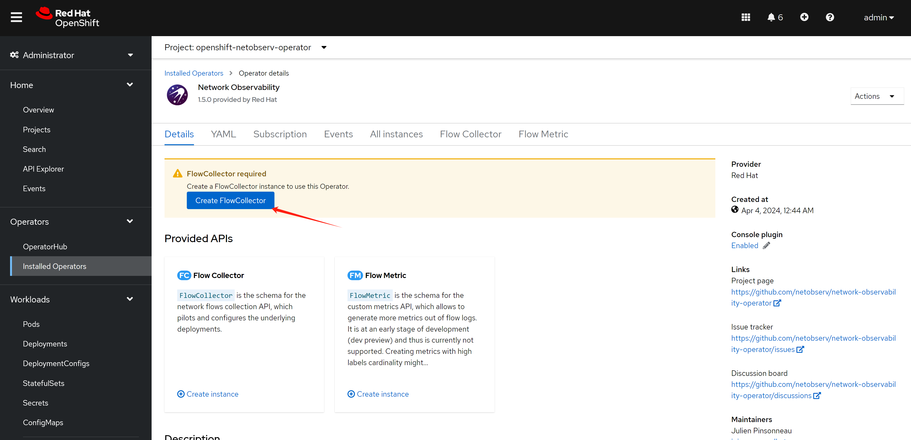

# openshift 4.12 Network Observability

openshift 4.12 introduce eBPF as agent for netoberv, we try it out, and see how it works. We focus on egress IP senario, and want to see RTT value from backend service outside of cluster.

The cluster will use OVS following customer's env.

- https://docs.openshift.com/container-platform/4.12/observability/network_observability/installing-operators.html

here is the architecture of this lab:


# try with loki

## install loki

RTT value need loki as backend, we install loki first.

- [Installing the Loki Operator](https://docs.openshift.com/container-platform/4.12/observability/network_observability/installing-operators.html#network-observability-loki-installation_network_observability)


### install a minio as backend

we need s3 storage, we will use minio as backend, and use local disk as storage.

deploy a minio for testing only, not for production. becuase official minio will enable https, it will bring so many trouble into app integration, we use a old version minio.

```bash

# oc new-project llm-demo
# oc label --overwrite ns llm-demo \
#    pod-security.kubernetes.io/enforce=privileged

oc new-project netobserv

# on helper
S3_NAME='netobserv'
S3_NS='netobserv'
S3_IMAGE='docker.io/minio/minio:RELEASE.2021-06-17T00-10-46Z.hotfix.35a0912ff'

cat << EOF > ${BASE_DIR}/data/install/s3-codellama.yaml
---
apiVersion: v1
kind: Service
metadata:
  name: minio-${S3_NAME}
spec:
  ports:
    - name: minio-client-port
      port: 9000
      protocol: TCP
      targetPort: 9000
  selector:
    app: minio-${S3_NAME}

# ---
# apiVersion: route.openshift.io/v1
# kind: Route
# metadata:
#   name: s3-${S3_NAME}
# spec:
#   to:
#     kind: Service
#     name: minio-${S3_NAME}
#   port:
#     targetPort: 9000

---
apiVersion: v1
kind: PersistentVolumeClaim
metadata:
  name: minio-${S3_NAME}-pvc
spec:
  accessModes:
    - ReadWriteOnce
  resources:
    requests:
      storage: 100Gi
  storageClassName: hostpath-csi

---
apiVersion: apps/v1
kind: Deployment
metadata:
  name: minio-${S3_NAME}
  labels:
    app: minio-${S3_NAME}
spec:
  replicas: 1
  selector:
    matchLabels:
      app: minio-${S3_NAME}
  template:
    metadata:
      labels:
        app: minio-${S3_NAME}
    spec:
      initContainers:
        - name: create-demo-dir
          image: docker.io/busybox
          command: ["mkdir", "-p", "/data1/demo"]
          volumeMounts:
            - name: data
              mountPath: "/data1"
      containers:
        - args:
            - server
            - /data1
          env:
            - name: MINIO_ACCESS_KEY
              value:  admin
            - name: MINIO_SECRET_KEY
              value: redhatocp
          image: ${S3_IMAGE}
          imagePullPolicy: IfNotPresent
          name: minio
          nodeSelector:
            kubernetes.io/hostname: "worker-01-demo"
          securityContext:
            allowPrivilegeEscalation: false
            capabilities:
                drop:
                - ALL
            runAsNonRoot: true
            seccompProfile:
                type: RuntimeDefault
          volumeMounts:
            - mountPath: "/data1"
              name: data
      volumes:
        - name: data 
          persistentVolumeClaim:
            claimName: minio-${S3_NAME}-pvc

EOF

oc create -n netobserv -f ${BASE_DIR}/data/install/s3-codellama.yaml

# oc delete -n netobserv -f ${BASE_DIR}/data/install/s3-codellama.yaml

# open in browser to check, and create bucket 'demo'
# http://s3-netobserv-netobserv.apps.demo-gpu.wzhlab.top/


```

### install loki operator

we have a s3 storage, and we will install loki operator.


```bash

# oc new-project netobserv

cat << EOF > ${BASE_DIR}/data/install/loki-netobserv.yaml
---
apiVersion: v1
kind: Secret
metadata:
  name: loki-s3 
stringData:
  access_key_id: admin
  access_key_secret: redhatocp
  bucketnames: demo
  endpoint: http://minio-netobserv.netobserv.svc.cluster.local:9000
  # region: eu-central-1

---
apiVersion: loki.grafana.com/v1
kind: LokiStack
metadata:
  name: loki
spec:
  size: 1x.demo
  storage:
    schemas:
    - version: v12
      effectiveDate: '2022-06-01'
    secret:
      name: loki-s3
      type: s3
  storageClassName: hostpath-csi
  tenants:
    mode: openshift-network
    openshift:
        adminGroups: 
        - cluster-admin

EOF

oc create --save-config -n netobserv -f ${BASE_DIR}/data/install/loki-netobserv.yaml

# to delete

# oc delete -n netobserv -f ${BASE_DIR}/data/install/loki-netobserv.yaml

# oc get pvc -n netobserv | grep loki- | awk '{print $1}' | xargs oc delete -n netobserv pvc

# run below, if reinstall
oc adm groups new cluster-admin

oc adm groups add-users cluster-admin admin

oc adm policy add-cluster-role-to-group cluster-admin cluster-admin

```

## install net observ

we will install net observ operator, the installation is simple, just follow the official document. If you use eBPF agent, there seems have bugs with the installation steps, it is better to restart nodes to make the ebpf agent function well.





### RTT tracing

enable rtt tracing, following official document.

- https://docs.openshift.com/container-platform/4.12/observability/network_observability/observing-network-traffic.html#network-observability-RTT_nw-observe-network-traffic


or if you want to change yaml directly

```yaml
apiVersion: flows.netobserv.io/v1beta2
kind: FlowCollector
metadata:
  name: cluster
spec:
  namespace: netobserv
  deploymentModel: Direct
  agent:
    type: eBPF
    ebpf:
      features:
       - FlowRTT 
```

## try it out

### RRT

we can see RRT based on each flow. At this point, we did not introduct network latency on backend service, so the RTT is very low.

<!--  -->


### deploy egress IP

next, we will deploy egress IP on worker-02, and make traffic from worker-01 to worker-02, and then backend-service, and see the RTT value.

```bash

# label a node to host egress ip
oc label nodes worker-02-demo k8s.ovn.org/egress-assignable="" 

# label a namespace with env
oc label ns llm-demo env=egress-demo


# create a egress ip
cat << EOF > ${BASE_DIR}/data/install/egressip.yaml
apiVersion: k8s.ovn.org/v1
kind: EgressIP
metadata:
  name: egressips-prod
spec:
  egressIPs:
  - 192.168.77.22
  namespaceSelector:
    matchLabels:
      env: egress-demo
EOF

oc create --save-config -f ${BASE_DIR}/data/install/egressip.yaml

# oc delete -f ${BASE_DIR}/data/install/egressip.yaml

oc get egressip -o json | jq -r '.items[] | [.status.items[].egressIP, .status.items[].node] | @tsv'
# 172.21.6.22     worker-02-demo

```

### make traffic and see result

then, we create backend http service, and introduce network latency by 1s.

```bash

# on backend host, 172.21.6.8
# create a web service
python3 -m http.server 13000
# ...
# 172.21.6.22 - - [08/Apr/2024 12:22:39] "GET / HTTP/1.1" 200 -
# 172.21.6.22 - - [08/Apr/2024 12:22:42] "GET / HTTP/1.1" 200 -
# 172.21.6.22 - - [08/Apr/2024 12:22:45] "GET / HTTP/1.1" 200 -
# ...

# using tc to traffic control / delay 1s
dnf install -y kernel-modules-extra # to install netem module
dnf install -y /usr/sbin/tc

iptables -A OUTPUT -t mangle -p tcp --sport 13000 -j MARK --set-mark 13000

sudo tc qdisc del dev ens192 root
sudo tc qdisc add dev ens192 root handle 1: htb
sudo tc class add dev ens192 parent 1: classid 1:1 htb rate 100mbit
sudo tc filter add dev ens192 protocol ip parent 1:0 prio 1 handle 13000 fw flowid 1:1
sudo tc qdisc add dev ens192 parent 1:1 handle 10: netem delay 1s

sudo tc qdisc show dev ens192
# qdisc htb 1: root refcnt 3 r2q 10 default 0 direct_packets_stat 453 direct_qlen 1000
# qdisc netem 10: parent 1:1 limit 1000 delay 1s

```

and then, we create testing pod, and curl from the pod to backend service

```bash

# go back to helper
# create a dummy pod
cat << EOF > ${BASE_DIR}/data/install/demo1.yaml
---
apiVersion: v1
kind: Service
metadata:
  name: wzh-demo-service
spec:
  ports:
    - name: service-port
      port: 80
      protocol: TCP
      targetPort: 8080
  selector:
    app: wzh-demo-pod

---
apiVersion: route.openshift.io/v1
kind: Route
metadata:
  name: wzh-demo
spec:
  to:
    kind: Service
    name: wzh-demo-service
  port:
    targetPort: service-port

---
kind: Pod
apiVersion: v1
metadata:
  name: wzh-demo-pod
  labels:
    app: wzh-demo-pod
  # annotations:
  #   instrumentation.opentelemetry.io/inject-java: "true"
spec:
  nodeSelector:
    kubernetes.io/hostname: 'worker-01-demo'
  restartPolicy: Always
  containers:
    - name: demo1
      image: >- 
        quay.io/wangzheng422/qimgs:simple-java-http-server-2024.04.24
      env:
        - name: WZH_URL
          value: "http://192.168.77.8:13000/singbox.config.json"
      # command: [ "/bin/bash", "-c", "--" ]
      # args: [ "tail -f /dev/null" ]
      # imagePullPolicy: Always

EOF

oc apply -n llm-demo -f ${BASE_DIR}/data/install/demo1.yaml

# oc delete -n llm-demo -f ${BASE_DIR}/data/install/demo1.yaml

# simulate traffic load

siege -q -c 1000 http://wzh-demo-llm-demo.apps.osp-demo.wzhlab.top/sendRequest

```

# end