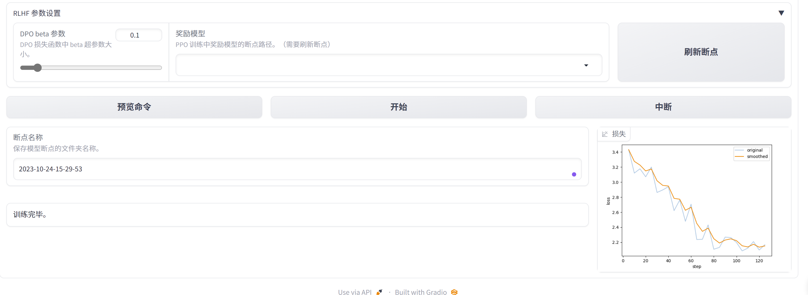
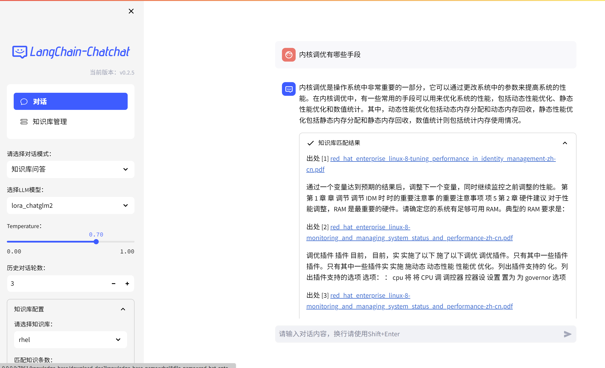
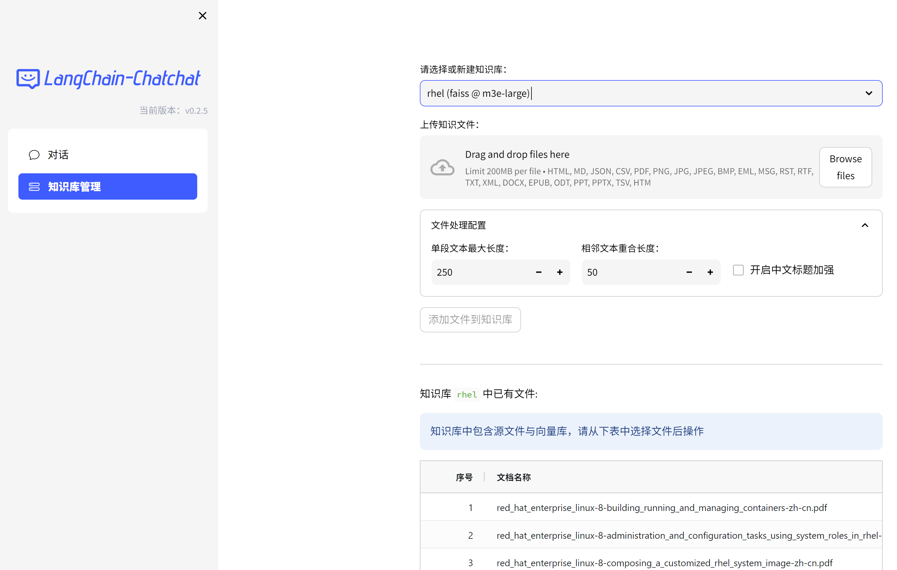
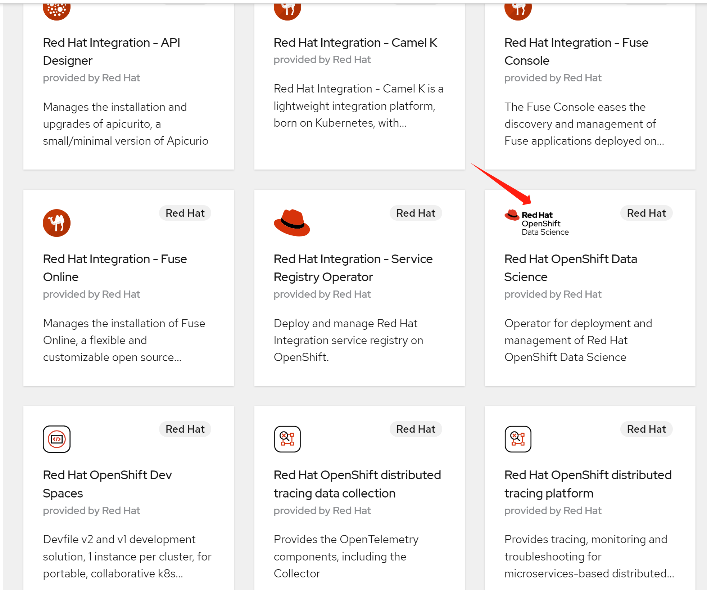
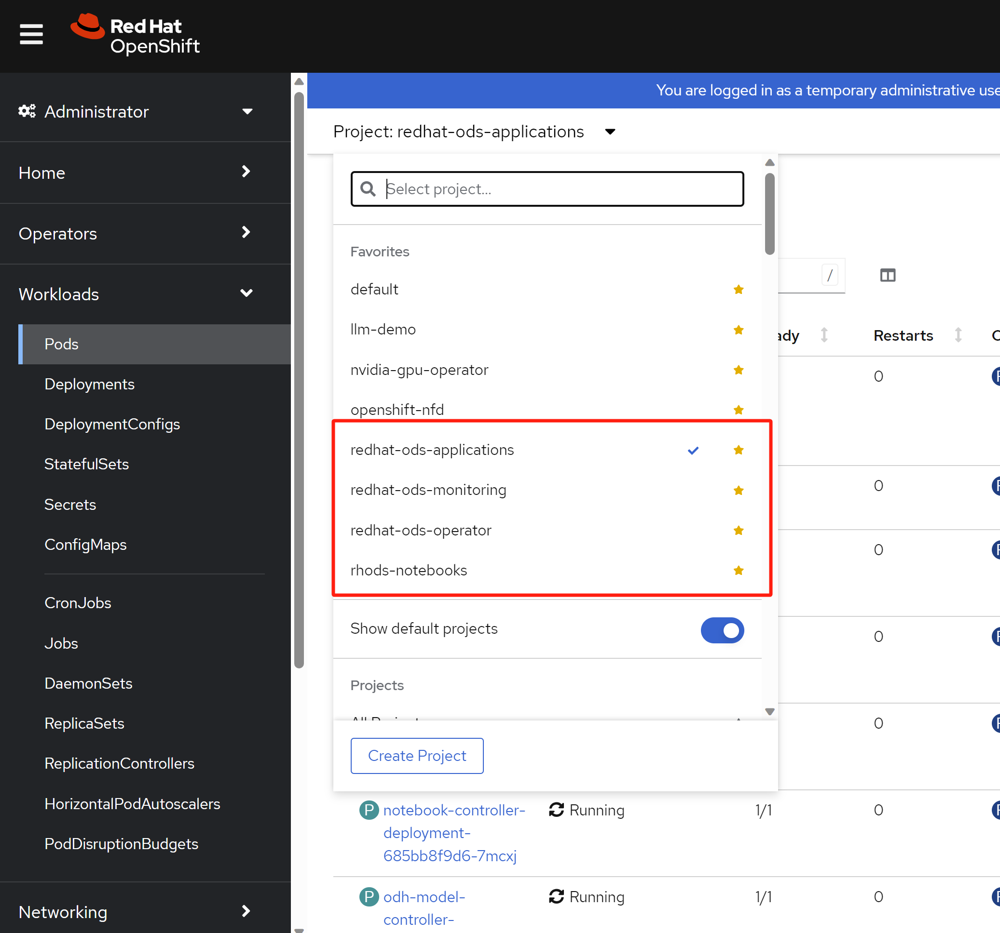
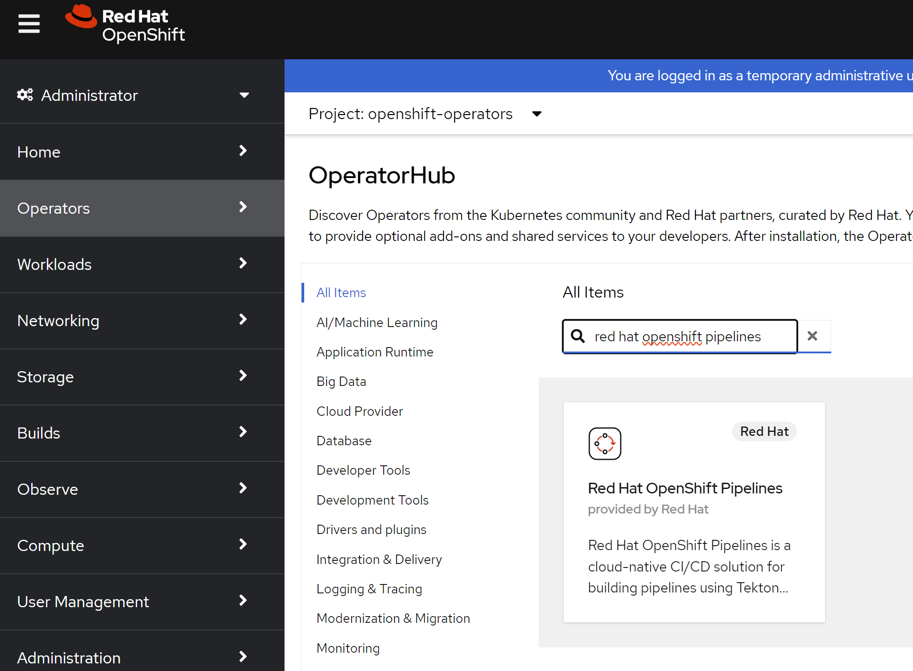
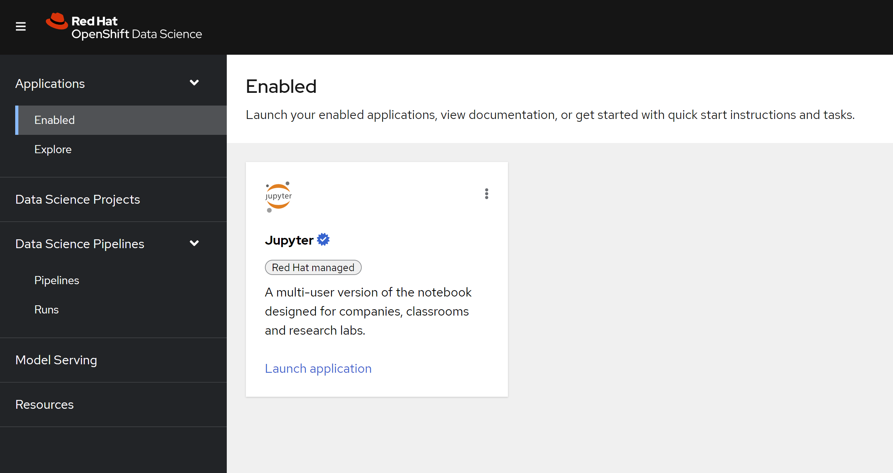

# LLM on openshift

continue with [install doc](./4.13.single.node.upi.agent.md)

we have 2 node, 1 master, 1 worker.

# gpu operator

- https://docs.nvidia.com/datacenter/cloud-native/openshift/latest/introduction.html#openshift-introduction

Installing the Node Feature Discovery (NFD) Operator


install gpu operator through opeartor hub


# llm chat with a single pod

we will use docker.io/nvidia/cuda:12.2.2-devel-ubi9 to start container directly, and will build our own container later.

## start llm chat pod

```bash
# create some static host path to use
# go to worker-01-demo
# 01,02,03,04,05,06,07,08,09,10
for i in $(seq -w 1 20); do
  mkdir -p "/var/wzh-local-pv/static/$i"
done
mkdir -p /var/wzh-local-pv/dynamic
chcon -Rt container_file_t /var/wzh-local-pv/

# on helper
cat << EOF > ${BASE_DIR}/data/install/local-sc.yaml
---
kind: StorageClass
apiVersion: storage.k8s.io/v1
metadata:
  name: local-volume
provisioner: kubernetes.io/no-provisioner
volumeBindingMode: WaitForFirstConsumer
EOF
oc create --save-config -f ${BASE_DIR}/data/install/local-sc.yaml

cat << EOF > ${BASE_DIR}/data/install/local-pv.yaml
---
apiVersion: v1
kind: PersistentVolume
metadata:
  name: local-pv-01
spec:
  capacity:
    storage: 4500Gi
  accessModes:
  - ReadWriteOnce
  persistentVolumeReclaimPolicy: Retain
  storageClassName: local-volume
  local:
    path: /var/wzh-local-pv/static/01
  nodeAffinity:
    required:
      nodeSelectorTerms:
      - matchExpressions:
        - key: kubernetes.io/hostname
          operator: In
          values:
          - worker-01-demo
---
kind: PersistentVolumeClaim
apiVersion: v1
metadata:
  name: local-pvc-demo
spec:
  accessModes:
  - ReadWriteOnce
  volumeMode: Filesystem 
  resources:
    requests:
      storage: 4500Gi 
  storageClassName: local-volume
EOF
oc create --save-config -n llm-demo -f ${BASE_DIR}/data/install/local-pv.yaml

# oc delete -n llm-demo -f ${BASE_DIR}/data/install/local-pv.yaml

# for all diretory, create them
var_i=0
for var_i in $(seq -w 1 20); do
  oc create --save-config -n llm-demo -f - << EOF
---
apiVersion: v1
kind: PersistentVolume
metadata:
  name: local-pv-${var_i}
  labels:
    local-dir: local-dir-${var_i}
spec:
  capacity:
    storage: 4500Gi
  accessModes:
  - ReadWriteOnce
  persistentVolumeReclaimPolicy: Retain
  storageClassName: local-volume
  local:
    path: /var/wzh-local-pv/static/${var_i}
  nodeAffinity:
    required:
      nodeSelectorTerms:
      - matchExpressions:
        - key: kubernetes.io/hostname
          operator: In
          values:
          - worker-01-demo
EOF
done

for var_i in $(seq -w 1 10); do
  oc create --save-config -n llm-demo -f - << EOF
---
kind: PersistentVolumeClaim
apiVersion: v1
metadata:
  name: local-pvc-${var_i}
spec:
  accessModes:
  - ReadWriteOnce
  volumeMode: Filesystem 
  resources:
    requests:
      storage: 4500Gi 
  storageClassName: local-volume
  selector:
    matchLabels:
      local-dir: local-dir-${var_i}
EOF

done

# then delete

var_i=0
for var_i in $(seq -w 1 10); do
  oc delete -n llm-demo -f - << EOF
---
kind: PersistentVolumeClaim
apiVersion: v1
metadata:
  name: local-pvc-${var_i}
spec:
  accessModes:
  - ReadWriteOnce
  volumeMode: Filesystem 
  resources:
    requests:
      storage: 4500Gi 
  storageClassName: local-volume
EOF
done

var_i=0
for var_i in $(seq -w 1 10); do
  oc delete -n llm-demo -f - << EOF
---
apiVersion: v1
kind: PersistentVolume
metadata:
  name: local-pv-${var_i}
spec:
  capacity:
    storage: 4500Gi
  accessModes:
  - ReadWriteOnce
  persistentVolumeReclaimPolicy: Retain
  storageClassName: local-volume
  local:
    path: /var/wzh-local-pv/static/${var_i}
  nodeAffinity:
    required:
      nodeSelectorTerms:
      - matchExpressions:
        - key: kubernetes.io/hostname
          operator: In
          values:
          - worker-01-demo
EOF
done


# https://master.sdk.operatorframework.io/docs/best-practices/pod-security-standards/
oc create ns llm-demo
oc label --overwrite ns llm-demo \
   pod-security.kubernetes.io/enforce=privileged


cat << EOF > ${BASE_DIR}/data/install/pod.yaml
---
apiVersion: v1
kind: Service
metadata:
  name: demo1
  labels:
    app: llm-demo
spec:
  type: ClusterIP
  selector:
    app: llm-demo
  ports:
    - name: webui
      protocol: TCP
      port: 8501
      targetPort: 8501
---
kind: Route
apiVersion: route.openshift.io/v1
metadata:
  name: demo
  labels:
    app: llm-demo
spec:
  to:
    kind: Service
    name: demo1
  port:
    targetPort: 8501
---
kind: Pod
apiVersion: v1
metadata:
  annotations:
    openshift.io/scc: privileged
  name: demo1
  labels:
    app: llm-demo
spec:
  nodeSelector:
    kubernetes.io/hostname: worker-01-demo
  restartPolicy: Always
  containers:
    - name: demo1
      image: >- 
        docker.io/nvidia/cuda:12.2.2-devel-ubi9
      # quaylab.infra.wzhlab.top:5443/wangzheng422/qimgs:gpu-nv-base-rhel92-v01
      # docker.io/nvidia/cuda:12.2.2-cudnn8-devel-ubi9
      securityContext:
        # privileged: true
        AllowPrivilegedContainer: true
      env:
        - name: key
          value: value
      command: 
        - sleep
        - infinity
      volumeMounts:
        - mountPath: /data
          name: demo 
          readOnly: false
      resources:
        limits:
          nvidia.com/gpu: 2
  volumes:
    - name: demo 
      persistentVolumeClaim:
        claimName: local-pvc-demo 
EOF

oc create --save-config -n llm-demo -f ${BASE_DIR}/data/install/pod.yaml

# oc delete -n llm-demo -f ${BASE_DIR}/data/install/pod.yaml

# oc project llm-demo
oc rsh -n llm-demo demo1

dnf install -y wget vim git iproute iputils

dnf install -y 	https://mirror.stream.centos.org/9-stream/AppStream/x86_64/os/Packages/lftp-4.9.2-4.el9.x86_64.rpm

# https://docs.conda.io/projects/miniconda/en/latest/
mkdir -p /data/miniconda3
wget https://repo.anaconda.com/miniconda/Miniconda3-latest-Linux-x86_64.sh -O /data/miniconda3/miniconda.sh
bash /data/miniconda3/miniconda.sh -b -u -p /data/miniconda3
# rm -rf ~/miniconda3/miniconda.sh

/data/miniconda3/bin/conda init bash

mkdir -p /data/py_env

conda create -p /data/py_env/chatchat --yes python=3.10

conda activate /data/py_env/chatchat
# conda deactivate

mkdir -p /data/git_env
cd /data/git_env

git clone --single-branch -b master https://github.com/chatchat-space/Langchain-Chatchat

cd Langchain-Chatchat
# edit requirements.txt
# comment out line with 'win32'

export ENV_CWD="/data/git_env/Langchain-Chatchat"

cd ${ENV_CWD}
pip install -r requirements.txt
# conda install --yes --file requirements.txt -c pytorch -c nvidia

mkdir -p /data/huggingface/
cd /data/huggingface
lftp http://172.21.6.98:11880
mirror chatglm2-6b
mirror m3e-large
get knowledge_base.tgz

cd ${ENV_CWD}/configs
/bin/cp -f model_config.py.example model_config.py
/bin/cp -f server_config.py.example server_config.py
/bin/cp -f kb_config.py.exmaple kb_config.py
/bin/cp -f basic_config.py.example basic_config.py
/bin/cp -f prompt_config.py.example prompt_config.py

# edit content of model_config.chatglm2.py
# vim disable auto indent => :set paste
/bin/cp -f model_config.chatglm2.py model_config.py

# no proxy to run ...
unset http_proxy
unset https_proxy
unset no_proxy

cd ${ENV_CWD}
python startup.py -a


```

# finetune with a single pod

we will create a single pod with 2 container, 1 for finetune, 1 for llm-chat

## create container image


```bash

podman run -it --rm docker.io/nvidia/cuda:12.2.2-devel-ubi9 bash

# remount podman dir
# https://github.com/containers/podman/issues/2396
mkfs.xfs /dev/vdb
mount /dev/vdb /mnt
mkdir -p /mnt/{containers,tmp}
mount -o bind /mnt/containers /var/lib/containers
mount -o bind /mnt/tmp /var/tmp
restorecon -v /var/lib/containers/
restorecon -v /var/tmp

# [Conda Environments with Docker](https://medium.com/@chadlagore/conda-environments-with-docker-82cdc9d25754)

##################
## for llm chatchat
mkdir -p /data/nv
cd /data/nv

cat << 'EOF' > nv.Dockerfile
FROM docker.io/nvidia/cuda:12.2.2-devel-ubi9

RUN dnf install -y https://dl.fedoraproject.org/pub/epel/epel-release-latest-9.noarch.rpm && \
    /usr/bin/crb enable && \
    dnf install -y wget vim git iproute iputils conda && \
    dnf install -y https://mirror.stream.centos.org/9-stream/AppStream/x86_64/os/Packages/lftp-4.9.2-4.el9.x86_64.rpm && \
    dnf clean all && \
    conda init bash

######################
# for chatchat
RUN mkdir -p /data/py_env && \
    conda create -p /data/py_env/chatchat --yes python=3.10

RUN echo "conda activate /data/py_env/chatchat" >> ~/.bashrc
ENV PATH /data/py_env/chatchat/bin:$PATH

RUN mkdir -p /data/git_env && \
    cd /data/git_env && \
    git clone --single-branch -b master https://github.com/chatchat-space/Langchain-Chatchat && \
    cd Langchain-Chatchat && \
    pip install -r requirements.txt 

RUN /bin/rm -rf ~/.cache

EOF

podman build --squash -t quay.io/wangzheng422/qimgs:llm-chatchat-cuda-12.2.2-devel-ubi9-v01 -f nv.Dockerfile ./

podman push quay.io/wangzheng422/qimgs:llm-chatchat-cuda-12.2.2-devel-ubi9-v01

###################
## for llm-factory
mkdir -p /data/nv01
cd /data/nv01
cat << 'EOF' > nv.Dockerfile
FROM docker.io/nvidia/cuda:12.2.2-devel-ubi9

RUN dnf install -y https://dl.fedoraproject.org/pub/epel/epel-release-latest-9.noarch.rpm && \
    /usr/bin/crb enable && \
    dnf install -y wget vim git iproute iputils conda && \
    dnf install -y https://mirror.stream.centos.org/9-stream/AppStream/x86_64/os/Packages/lftp-4.9.2-4.el9.x86_64.rpm && \
    dnf clean all && \
    conda init bash

######################
# for llama-factory
RUN mkdir -p /data/py_env && \
    conda create -p /data/py_env/llama_factory --yes python=3.10

RUN echo "conda activate /data/py_env/llama_factory" >> ~/.bashrc
ENV PATH /data/py_env/llama_factory/bin:$PATH

RUN mkdir -p /data/git_env && \
    cd /data/git_env && \
    git clone --single-branch -b main https://github.com/hiyouga/LLaMA-Factory && \
    cd LLaMA-Factory && \
    pip install -r requirements.txt && \
    pip install flash-attn 

RUN /bin/rm -rf ~/.cache

EOF

podman build --squash -t quay.io/wangzheng422/qimgs:llm-factory-cuda-12.2.2-devel-ubi9-v01 -f nv.Dockerfile ./

podman push quay.io/wangzheng422/qimgs:llm-factory-cuda-12.2.2-devel-ubi9-v01

################
# for huggingface chatglm2-6b
mkdir -p /data/nv
cd /data/nv

cat << 'EOF' > nv.Dockerfile
FROM registry.access.redhat.com/ubi9/ubi:9.2

RUN dnf install -y https://dl.fedoraproject.org/pub/epel/epel-release-latest-9.noarch.rpm && \
    dnf install -y conda && \
    dnf clean all && \
    conda init bash

RUN mkdir -p /data/py_env && \
    conda create -p /data/py_env/hg_cli --yes python=3.10

RUN echo "conda activate /data/py_env/hg_cli" >> ~/.bashrc
ENV PATH /data/py_env/hg_cli/bin:$PATH

RUN pip install --upgrade huggingface_hub && \
    mkdir -p /data/huggingface/chatglm2-6b/ && \
    huggingface-cli download THUDM/chatglm2-6b --repo-type model --revision main --local-dir /data/huggingface/chatglm2-6b/ --local-dir-use-symlinks False --resume-download 

RUN /bin/rm -rf ~/.cache

EOF

podman build --squash -t quay.io/wangzheng422/qimgs:llm-chatglm2-6b -f nv.Dockerfile ./

podman push quay.io/wangzheng422/qimgs:llm-chatglm2-6b


################
# for huggingface m3e-large
mkdir -p /data/nv
cd /data/nv

cat << 'EOF' > nv.Dockerfile
FROM registry.access.redhat.com/ubi9/ubi:9.2

RUN dnf install -y https://dl.fedoraproject.org/pub/epel/epel-release-latest-9.noarch.rpm && \
    dnf install -y conda && \
    dnf clean all && \
    conda init bash

RUN mkdir -p /data/py_env && \
    conda create -p /data/py_env/hg_cli --yes python=3.10

RUN echo "conda activate /data/py_env/hg_cli" >> ~/.bashrc
ENV PATH /data/py_env/hg_cli/bin:$PATH

RUN pip install --upgrade huggingface_hub && \
    mkdir -p /data/huggingface/m3e-large/ && \
    huggingface-cli download moka-ai/m3e-large --repo-type model --revision main --local-dir /data/huggingface/m3e-large/ --local-dir-use-symlinks False --resume-download 

RUN /bin/rm -rf ~/.cache

EOF

podman build --squash -t quay.io/wangzheng422/qimgs:llm-m3e-large -f nv.Dockerfile ./

podman push quay.io/wangzheng422/qimgs:llm-m3e-large


```

## start pod with finetune and chat container

```bash


cat << EOF > ${BASE_DIR}/data/install/pod.yaml
---
apiVersion: v1
kind: Service
metadata:
  name: llm-finetune
  labels:
    app: llm-finetune-demo
spec:
  type: ClusterIP
  selector:
    app: llm-finetune-demo
  ports:
    - name: chat-webui
      protocol: TCP
      port: 8501
      targetPort: 8501
    - name: factory-ui
      protocol: TCP
      port: 7860
      targetPort: 7860
    - name: factory-api
      protocol: TCP
      port: 8000
      targetPort: 8000
---
kind: Route
apiVersion: route.openshift.io/v1
metadata:
  name: llm-finetune-chatchat
  labels:
    app: llm-finetune-demo
spec:
  to:
    kind: Service
    name: llm-finetune
  port:
    targetPort: 8501
---
kind: Route
apiVersion: route.openshift.io/v1
metadata:
  name: llm-finetune-factory
  labels:
    app: llm-finetune-demo
spec:
  to:
    kind: Service
    name: llm-finetune
  port:
    targetPort: 7860
---
kind: Pod
apiVersion: v1
metadata:
  annotations:
    openshift.io/scc: privileged
  name: demo1
  labels:
    app: llm-finetune-demo
spec:
  nodeSelector:
    kubernetes.io/hostname: worker-01-demo
  restartPolicy: Always
  containers:
    - name: chatchat
      image: >- 
        docker.io/nvidia/cuda:12.2.2-devel-ubi9
      # quaylab.infra.wzhlab.top:5443/wangzheng422/qimgs:gpu-nv-base-rhel92-v01
      # docker.io/nvidia/cuda:12.2.2-cudnn8-devel-ubi9
      securityContext:
        # privileged: true
        AllowPrivilegedContainer: true
      env:
        - name: key
          value: value
      command: 
        - sleep
        - infinity
      volumeMounts:
        - mountPath: /data
          name: demo 
          readOnly: false
      resources:
        limits:
          nvidia.com/gpu: 2
    - name: llama-factory
      image: >- 
        docker.io/nvidia/cuda:12.2.2-devel-ubi9
      # quaylab.infra.wzhlab.top:5443/wangzheng422/qimgs:gpu-nv-base-rhel92-v01
      # docker.io/nvidia/cuda:12.2.2-cudnn8-devel-ubi9
      securityContext:
        # privileged: true
        AllowPrivilegedContainer: true
      env:
        - name: key
          value: value
      command: 
        - sleep
        - infinity
      volumeMounts:
        - mountPath: /data
          name: demo 
          readOnly: false
      resources:
        limits:
          nvidia.com/gpu: 2
  volumes:
    - name: demo 
      persistentVolumeClaim:
        claimName: local-pvc-demo 
EOF

oc create --save-config -n llm-demo -f ${BASE_DIR}/data/install/pod.yaml

# oc delete -n llm-demo -f ${BASE_DIR}/data/install/pod.yaml

##########################
# for factory
oc rsh -n llm-demo -c llama-factory demo1

bash /data/miniconda3/miniconda.sh -b -u -p /data/miniconda3
/data/miniconda3/bin/conda init bash

mkdir -p /data/py_env

conda create --yes -p /data/py_env/llama_factory python=3.10

conda activate /data/py_env/llama_factory
# conda deactivate

mkdir -p /data/git_env
cd /data/git_env

git clone --single-branch -b main https://github.com/hiyouga/LLaMA-Factory

cd /data/git_env/LLaMA-Factory
pip install -r requirements.txt


unset http_proxy
unset https_proxy
unset no_proxy
unset PROXY

cd /data/git_env/LLaMA-Factory
CUDA_VISIBLE_DEVICES=0 python src/train_web.py

# http://llm-finetune-factory-llm-demo.apps.demo-gpu.wzhlab.top/

# finetuen for data oaast_sft_zh.json
# for supervised fine-tune


# start llm api
cd /data/git_env/LLaMA-Factory
python src/api_demo.py \
    --model_name_or_path  /data/huggingface/chatglm2-6b \
    --template chatglm2 \
    --finetuning_type lora \
    --checkpoint_dir /data/git_env/LLaMA-Factory/saves/ChatGLM2-6B-Chat/lora/2023-10-27-08-14-02

##########################
# for llm-chat
oc rsh -n llm-demo -c chatchat demo1

bash /data/miniconda3/miniconda.sh -b -u -p /data/miniconda3
/data/miniconda3/bin/conda init bash

conda activate /data/py_env/chatchat
# conda deactivate

# test connect to llm api
curl http://llm-finetune:8000

export ENV_CWD="/data/git_env/Langchain-Chatchat"

cd ${ENV_CWD}/configs
/bin/cp -f model_config.py.example model_config.py
/bin/cp -f server_config.py.example server_config.py
/bin/cp -f kb_config.py.exmaple kb_config.py
/bin/cp -f basic_config.py.example basic_config.py
/bin/cp -f prompt_config.py.example prompt_config.py

# edit content of model_config.chatglm2.py
# vim disable auto indent => :set paste
/bin/cp -f model_config.chatglm2.py model_config.py

# no proxy to run ...
unset http_proxy
unset https_proxy
unset no_proxy

cd ${ENV_CWD}
python startup.py -a

# http://llm-finetune-chatchat-llm-demo.apps.demo-gpu.wzhlab.top/

```








# openshift AI

- https://ai-on-openshift.io/demos/llm-chat-doc/llm-chat-doc/

## install ODS












## import custom notebook

- https://ai-on-openshift.io/odh-rhods/configuration/#cluster-settings


## check the cache behavior

- https://www.redhat.com/en/blog/how-use-gpus-containers-bare-metal-rhel-8

```bash
# we are on vultr, it use docker, and everything pre-installed
# do not upgrade the system, vultr's base system will break after upgrade
systemctl enable --now docker.service

# for ghcr.io/huggingface/text-generation-inference:1.1.0
mkdir -p /data/models-cache

# https://github.com/huggingface/text-generation-inference#run
# podman run -it --rm \
#   -v /data//models-cache:/models-cache:Z \
#   -e HUGGINGFACE_HUB_CACHE=/models-cache \
#   -e MODEL_ID=google/flan-t5-xl \
#   -e MAX_INPUT_LENGTH=1024 \
#   -e MAX_TOTAL_TOKENS=2048 \
#   ghcr.io/huggingface/text-generation-inference:1.1.0

docker run -it --rm  \
  --gpus all \
  --shm-size 1g \
  -e HUGGINGFACE_HUB_CACHE=/models-cache \
  -e MODEL_ID=google/flan-t5-xl \
  -e MAX_INPUT_LENGTH=1024 \
  -e MAX_TOTAL_TOKENS=2048 \
  -p 8080:80 \
  -v /data//models-cache:/models-cache:Z \
  ghcr.io/huggingface/text-generation-inference:1.1.0

```

## deploy using local directory

we clone upstream repo, and change it using local directory for pvc

- https://github.com/wangzheng422/llm-on-openshift

### create HF-TGI instance

```bash

# https://github.com/wangzheng422/llm-on-openshift/tree/wzh/hf_tgis_deployment/wzh

# we will use pvc: local-pvc-02
oc create --save-config -n llm-demo -f ./

# oc delete -n llm-demo -f ./

```

### create redit operator and instance

```bash

# https://github.com/wangzheng422/llm-on-openshift/blob/wzh/redis_deployment/scc.yaml

oc create --save-config -n llm-demo -f scc.yaml

oc adm policy add-scc-to-user redis-enterprise-scc system:serviceaccount:llm-demo:redis-enterprise-operator
oc adm policy add-scc-to-user redis-enterprise-scc system:serviceaccount:llm-demo:rec

```


```bash

cat << EOF > ${BASE_DIR}/tmp/redis-cluster.yaml
apiVersion: app.redislabs.com/v1
kind: RedisEnterpriseCluster
metadata:
  name: rec
spec:
  serviceAccountName: rec
  redisEnterpriseNodeResources:
    limits:
      cpu: '4'
      ephemeral-storage: 10Gi
      memory: 4Gi
    requests:
      cpu: '4'
      ephemeral-storage: 1Gi
      memory: 4Gi
  bootstrapperImageSpec:
    repository: registry.connect.redhat.com/redislabs/redis-enterprise-operator
  clusterCredentialSecretName: rec
  nodes: 1
  persistentSpec:
    enabled: true
    storageClassName: local-volume
    volumeSize: 4500Gi
  createServiceAccount: true
  username: admin@wzhlab.top
  clusterCredentialSecretRole: ''
  podStartingPolicy:
    enabled: false
    startingThresholdSeconds: 540
  redisEnterpriseServicesRiggerImageSpec:
    repository: registry.connect.redhat.com/redislabs/services-manager
  redisEnterpriseImageSpec:
    imagePullPolicy: IfNotPresent
    repository: registry.connect.redhat.com/redislabs/redis-enterprise
  uiServiceType: ClusterIP
  clusterCredentialSecretType: kubernetes
  servicesRiggerSpec:
    databaseServiceType: 'cluster_ip,headless'
    serviceNaming: bdb_name
  services:
    apiService:
      type: ClusterIP
EOF
oc create --save-config -n llm-demo -f ${BASE_DIR}/tmp/redis-cluster.yaml

# oc delete -n llm-demo -f ${BASE_DIR}/tmp/redis-cluster.yaml


cat << EOF > ${BASE_DIR}/tmp/redis-db.yaml
apiVersion: app.redislabs.com/v1alpha1
kind: RedisEnterpriseDatabase
metadata:
  name: my-doc
spec:
  memorySize: 4GB
  modulesList:
    - name: search
      version: 2.8.4
  persistence: snapshotEvery12Hour
  replication: true
  tlsMode: disabled
  type: redis
EOF
oc create --save-config -n llm-demo -f ${BASE_DIR}/tmp/redis-db.yaml


```

# end

# build base container image

```bash

# on vultr
mkdir -p /data/nv
cd /data/nv

cat << 'EOF' > nv.Dockerfile
FROM registry.access.redhat.com/ubi9/ubi:9.2

RUN dnf repolist && \
    sed -i 's|enabled=1|enabled=0|g' /etc/yum/pluginconf.d/subscription-manager.conf && \
    sed -i 's|$releasever|9.2|g' /etc/yum.repos.d/redhat.repo && \
    sed -i '/codeready-builder-for-rhel-8-x86_64-rpms/,/\[/ s/enabled = 0/enabled = 1/' /etc/yum.repos.d/redhat.repo && \
    dnf -y update && \
    dnf install -y --allowerasing coreutils && \
    dnf groupinstall -y --allowerasing development server && \
    dnf clean all

RUN dnf install -y https://dl.fedoraproject.org/pub/epel/epel-release-latest-9.noarch.rpm && \
    dnf config-manager --add-repo https://developer.download.nvidia.com/compute/cuda/repos/rhel9/x86_64/cuda-rhel9.repo && \
    `#dnf -y module install nvidia-driver:latest-dkms &&` \
    dnf -y install --allowerasing cuda && \
    dnf install -y --allowerasing libnccl libnccl-devel libnccl-static && \
    dnf install -y --allowerasing conda python3.11 && \
    dnf clean all

RUN dnf install -y rsync lftp && \
    dnf clean all

EOF

podman build --squash -t quay.io/wangzheng422/qimgs:gpu-nv-base-rhel92-v01 -f nv.Dockerfile ./

podman push quay.io/wangzheng422/qimgs:gpu-nv-base-rhel92-v01

podman save quay.io/wangzheng422/qimgs:gpu-nv-base-rhel92-v01 | pigz -c > gpu-nv-base.tgz

python -m http.server 15443

# back to helper node
# copy back the base image
oc image mirror quay.io/wangzheng422/qimgs:gpu-nv-base-rhel92-v01 quaylab.infra.wzhlab.top:5443/wangzheng422/qimgs:gpu-nv-base-rhel92-v01

podman load -i gpu-nv-base.tgz

podman image tag quay.io/wangzheng422/qimgs:gpu-nv-base-rhel92-v01 quaylab.infra.wzhlab.top:5443/wangzheng422/qimgs:gpu-nv-base-rhel92-v01

podman push quaylab.infra.wzhlab.top:5443/wangzheng422/qimgs:gpu-nv-base-rhel92-v01

```
