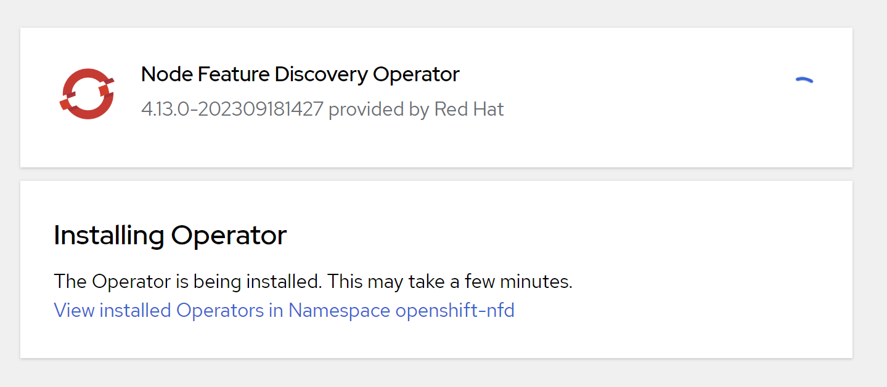

# LLM on openshift

continue with [install doc](./4.13.single.node.upi.agent.md)

we have 2 node, 1 master, 1 worker.

# gpu operator

- https://docs.nvidia.com/datacenter/cloud-native/openshift/latest/introduction.html#openshift-introduction

Installing the Node Feature Discovery (NFD) Operator



install gpu operator through opeartor hub


# build base container image

```bash

# on vultr
mkdir -p /data/nv
cd /data/nv

cat << 'EOF' > nv.Dockerfile
FROM registry.access.redhat.com/ubi9/ubi:9.2

RUN dnf repolist && \
    sed -i 's|enabled=1|enabled=0|g' /etc/yum/pluginconf.d/subscription-manager.conf && \
    sed -i 's|$releasever|9.2|g' /etc/yum.repos.d/redhat.repo && \
    sed -i '/codeready-builder-for-rhel-8-x86_64-rpms/,/\[/ s/enabled = 0/enabled = 1/' /etc/yum.repos.d/redhat.repo && \
    dnf -y update && \
    dnf install -y --allowerasing coreutils && \
    dnf groupinstall -y --allowerasing development server && \
    dnf clean all

RUN dnf install -y https://dl.fedoraproject.org/pub/epel/epel-release-latest-9.noarch.rpm && \
    dnf config-manager --add-repo https://developer.download.nvidia.com/compute/cuda/repos/rhel9/x86_64/cuda-rhel9.repo && \
    `#dnf -y module install nvidia-driver:latest-dkms &&` \
    dnf -y install --allowerasing cuda && \
    dnf install -y --allowerasing libnccl libnccl-devel libnccl-static && \
    dnf install -y --allowerasing conda python3.11 && \
    dnf clean all


EOF

podman build -t quay.io/wangzheng422/qimgs:gpu-base -f nv.Dockerfile ./

```