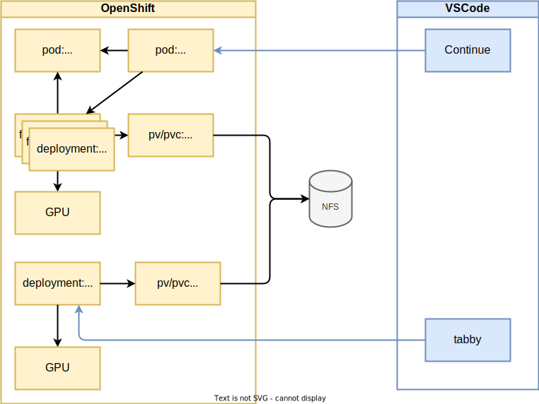
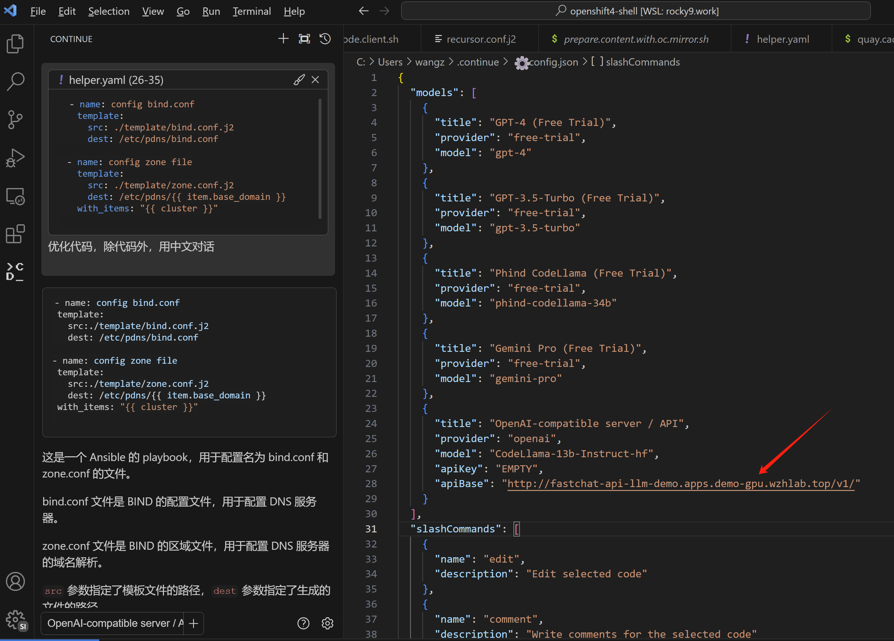
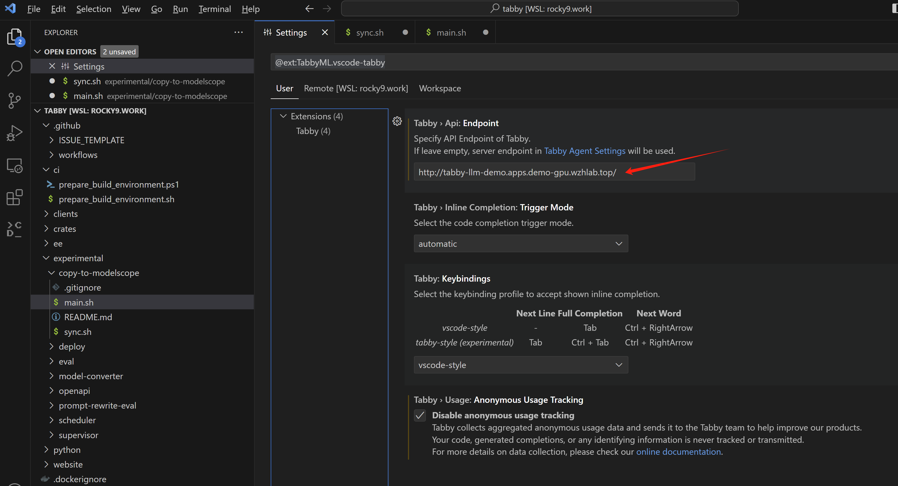

# 在 openshift4 上部署 codellama 服务，实现 vscode 代码自动补全

本文继续[上一篇文章](../../notes/2024.01.codellama.vscode.md)，我们继续在 openshift4 上部署 codellama 服务，实现 vscode 代码自动补全和LLM会话。

本实验的部署架构：



# 实验准备

openshift集群需要部署
- hostpath provisioner
  - 这个并不一定，看你的实验环境是否有其他的存储方案
- nvidia gpu operator

# 镜像制作

在openshift上运行，我们需要准备一些容器镜像，还有模型的数据源。

## nfs for codellama 13B

我们把模型的数据文件，放在外部的nfs上面，然后通过pv/pvc引入到openshift集群中。

以下就是在外部的服务器上，准备一个nfs的源。

```bash

# on 105
dnf install -y nfs-utils

chown nobody:nobody /data/huggingface
chmod 755 /data/huggingface

cat << EOF > /etc/exports
/data/huggingface *(ro,sync,no_subtree_check)
EOF

# 运行以下命令来使更改生效：
exportfs -arv
systemctl enable --now nfs-server

# on other host to check result
showmount -e 172.21.6.105
# Export list for 172.21.6.105:
# /data/huggingface *

```

### deploy on ocp

这里，就是在openshift上配置pv/pvc，来引用外部的nfs数据源。

```bash

oc new-project llm-demo
oc label --overwrite ns llm-demo \
   pod-security.kubernetes.io/enforce=privileged

# on helper

cat << EOF > ${BASE_DIR}/data/install/storage-class.yaml
apiVersion: storage.k8s.io/v1
kind: StorageClass
metadata:
  name: static-nfs-storage-class
provisioner: kubernetes.io/no-provisioner
volumeBindingMode: WaitForFirstConsumer
EOF

oc create -n llm-demo -f ${BASE_DIR}/data/install/storage-class.yaml


NFS_NAME='codellama'
NFS_IP='172.21.6.105'
NFS_PATH='/data/huggingface/CodeLlama-13b-Instruct-hf'

cat << EOF > ${BASE_DIR}/data/install/nfs-codellama.yaml
---
apiVersion: v1
kind: PersistentVolume
metadata:
  name: nfs-pv-${NFS_NAME}
spec:
  capacity:
    storage: 5Gi
  accessModes:
    - ReadOnlyMany
  nfs:
    path: ${NFS_PATH}
    server: ${NFS_IP}
    readOnly: true
  persistentVolumeReclaimPolicy: Retain
  storageClassName: static-nfs-storage-class

---
apiVersion: v1
kind: PersistentVolumeClaim
metadata:
  name: nfs-pvc-${NFS_NAME}
spec:
  accessModes:
    - ReadOnlyMany
  resources:
    requests:
      storage: 5Gi
  volumeName: nfs-pv-${NFS_NAME} # 这个名字应该与你的PV的名字相匹配
  storageClassName: static-nfs-storage-class
EOF

oc create -n llm-demo -f ${BASE_DIR}/data/install/nfs-codellama.yaml

# oc delete -n llm-demo -f ${BASE_DIR}/data/install/nfs-codellama.yaml


```

## nfs for tabby 13B

tabby的模型文件，是量化后的，所以有单独的数据文件，我们给他也做nfs数据源。

```bash
# on 105
dnf install -y nfs-utils

chown nobody:nobody /data/workspace/tabby/models
chmod 755 /data/workspace/tabby/models

cat << EOF >> /etc/exports
/data/workspace/tabby/models *(ro,sync,no_subtree_check)
EOF

# 运行以下命令来使更改生效：
exportfs -arv
systemctl enable --now nfs-server

# on other host to check result
showmount -e 172.21.6.105
# Export list for 172.21.6.105:
# /data/huggingface *

```

### deploy on ocp

同样，用pv/pvc的方式，把tabby的模型文件，通过nfs引入到openshift集群中。

```bash

# on helper

NFS_NAME='tabby'
NFS_IP='172.21.6.105'
NFS_PATH='/data/workspace/tabby/models'

cat << EOF > ${BASE_DIR}/data/install/nfs-tabby.yaml
---
apiVersion: v1
kind: PersistentVolume
metadata:
  name: nfs-pv-${NFS_NAME}
spec:
  capacity:
    storage: 5Gi
  accessModes:
    - ReadOnlyMany
  nfs:
    path: ${NFS_PATH}
    server: ${NFS_IP}
    readOnly: true
  persistentVolumeReclaimPolicy: Retain
  storageClassName: static-nfs-storage-class

---
apiVersion: v1
kind: PersistentVolumeClaim
metadata:
  name: nfs-pvc-${NFS_NAME}
spec:
  accessModes:
    - ReadOnlyMany
  resources:
    requests:
      storage: 5Gi
  volumeName: nfs-pv-${NFS_NAME} # 这个名字应该与你的PV的名字相匹配
  storageClassName: static-nfs-storage-class
EOF

oc create -n llm-demo -f ${BASE_DIR}/data/install/nfs-tabby.yaml

# oc delete -n llm-demo -f ${BASE_DIR}/data/install/nfs-tabby.yaml


```

## image for fastchat

我们需要一个容器镜像，来承载fastchat的python 模块，来运行应用.

```bash

# on vultr
mkdir -p /data/fastchat
cd /data/fastchat

# docker pull nvidia/cuda:12.3.1-devel-ubi9

cat << EOF > Dockerfile
FROM docker.io/nvidia/cuda:12.3.1-devel-ubi9

RUN dnf install -y python3 python3-pip

RUN python3 -m pip install --upgrade pip setuptools wheel

RUN pip3 install -U "fschat[model_worker,webui]"

RUN rm -rf /root/.cache

EOF

podman build --squash -t quay.io/wangzheng422/qimgs:cuda-12.3.1-fastchat-v01 -f Dockerfile .

podman push quay.io/wangzheng422/qimgs:cuda-12.3.1-fastchat-v01

# on helper
# copy back to disconnected env.
oc image mirror quay.io/wangzheng422/qimgs:cuda-12.3.1-fastchat-v01 quaylab.infra.wzhlab.top:7443/wangzheng422/qimgs:cuda-12.3.1-fastchat-v01

```

# 部署 codellama 服务

前面的准备工作都完成了，我们开始部署codellama服务，来支持 vscode 智能问答吧。

原理和rhel上面部署是一样的，套用了fastchat架构，但是可以注意到，fastchat worker是用deployment部署，可以方便的扩容，这个是openshift这类容器平台的优势。

```bash

# on helper
oc create sa demo -n llm-demo
oc adm policy add-scc-to-user privileged -z demo -n llm-demo


POD_IMAGE='quaylab.infra.wzhlab.top:7443/wangzheng422/qimgs:cuda-12.3.1-fastchat-v01'

cat << EOF > ${BASE_DIR}/data/install/codellama.yaml
---
apiVersion: v1
kind: Service
metadata:
  name: fastchat-controller
spec:
  ports:
    - name: fastchat-controller-port
      port: 21001
      protocol: TCP
      targetPort: 21001
  selector:
    app: fastchat-controller

---
apiVersion: v1
kind: Pod
metadata:
  labels:
    app: fastchat-controller
  name: fastchat-controller
spec:
  containers:
    - name: fastchat-controller
      command: [ "/bin/sh","-c","--" ]
      args: [" cd /root; python3 -m fastchat.serve.controller --host 0.0.0.0 --port 21001 "]
      image: ${POD_IMAGE}
      imagePullPolicy: IfNotPresent
      nodeSelector:
        kubernetes.io/hostname: "worker-01-demo"
      securityContext:
        privileged: true

---
apiVersion: v1
kind: Service
metadata:
  name: fastchat-api
spec:
  ports:
    - name: fastchat-api-port
      port: 8000
      protocol: TCP
      targetPort: 8000
  selector:
    app: fastchat-api

---
apiVersion: route.openshift.io/v1
kind: Route
metadata:
  name: fastchat-api
spec:
  to:
    kind: Service
    name: fastchat-api
  port:
    targetPort: 8000

---
apiVersion: v1
kind: Pod
metadata:
  labels:
    app: fastchat-api
  name: fastchat-api
spec:
  containers:
    - name: fastchat-api
      command: [ "/bin/sh","-c","--" ]
      args: [" cd /root; python3 -m fastchat.serve.openai_api_server  --controller-address http://fastchat-controller.llm-demo.svc.cluster.local:21001  --host 0.0.0.0 --port 8000 "]
      image: ${POD_IMAGE}
      imagePullPolicy: IfNotPresent
      nodeSelector:
        kubernetes.io/hostname: "worker-01-demo"
      securityContext:
        privileged: true

---
apiVersion: apps/v1
kind: Deployment
metadata:
  name: fastchat-worker
  labels:
    app: fastchat-worker
spec:
  replicas: 1
  selector:
    matchLabels:
      app: fastchat-worker
  template:
    metadata:
      labels:
        app: fastchat-worker
    spec:
      serviceAccountName: demo
      containers:
      - name: fastchat-worker
        command: [ "/bin/bash","-c","--" ]
        args: [" cd /root; export LD_LIBRARY_PATH=\$LD_LIBRARY_PATH:/usr/local/lib/python3.9/site-packages/nvidia/cudnn/lib/; export HF_HOME=/root/.hf ; python3 -m fastchat.serve.model_worker --controller-address http://fastchat-controller.llm-demo.svc.cluster.local:21001 --model-path /models/CodeLlama-13b-Instruct-hf --host 0.0.0.0 --port 21002 --worker-address http://\$MY_POD_IP:21002  "]
        # args: [" tail -f /dev/null "] # just keep the container running
        image: ${POD_IMAGE}
        imagePullPolicy: IfNotPresent
        env:
          - name: MY_POD_IP
            valueFrom:
              fieldRef:
                fieldPath: status.podIP
        resources:
          limits:
            nvidia.com/gpu: 1
        securityContext:
            privileged: true
        nodeSelector:
            kubernetes.io/hostname: "worker-01-demo"
        volumeMounts:
          - name: nfs-storage
            mountPath: "/models/CodeLlama-13b-Instruct-hf"
            readOnly: true
      volumes:
        - name: nfs-storage
          persistentVolumeClaim:
            claimName: nfs-pvc-codellama
EOF

oc create -n llm-demo -f ${BASE_DIR}/data/install/codellama.yaml

# oc delete -n llm-demo -f ${BASE_DIR}/data/install/codellama.yaml

```

# 部署 zabby 服务

接下来，我们部署zabby的服务，由于zabby的服务对容器平台并不是很友好，他要求数据目录可写，所以我们无奈的采用了一个折中，用initContainer来把nfs的数据拷贝到emptyDir中，然后zabby的容器就可以读写这个emptyDir了。

```bash

POD_IMAGE='docker.io/tabbyml/tabby'

cat << EOF > ${BASE_DIR}/data/install/tabby.yaml
---
apiVersion: v1
kind: Service
metadata:
  name: tabby
spec:
  ports:
    - name: tabby-port
      port: 8080
      protocol: TCP
      targetPort: 8080
  selector:
    app: tabby

---
apiVersion: route.openshift.io/v1
kind: Route
metadata:
  name: tabby
spec:
  to:
    kind: Service
    name: tabby
  port:
    targetPort: 8080

---
apiVersion: apps/v1
kind: Deployment
metadata:
  name: tabby
  labels:
    app: tabby
spec:
  replicas: 1
  selector:
    matchLabels:
      app: tabby
  template:
    metadata:
      labels:
        app: tabby
    spec:
      serviceAccountName: demo
      initContainers:
      - name: init-nfs-copy
        image: docker.io/busybox
        command: ['sh', '-c', 'cp -r /nfs-data/* /model-data/']
        volumeMounts:
        - name: nfs-storage
          mountPath: "/nfs-data"
          readOnly: true
        - name: model-data
          mountPath: "/model-data"
      containers:
      - name: tabby
        command: [ "/bin/bash","-c","--" ]
        # args: ["serve", "--model","TabbyML/CodeLlama-13B","--device","cuda"]
        args: ["cd /data; /opt/tabby/bin/tabby serve --model TabbyML/CodeLlama-13B --device cuda" ]
        image: ${POD_IMAGE}
        imagePullPolicy: IfNotPresent
        env:
          - name: MY_POD_IP
            valueFrom:
              fieldRef:
                fieldPath: status.podIP
        resources:
          limits:
            nvidia.com/gpu: 1
        securityContext:
          privileged: true
        nodeSelector:
          kubernetes.io/hostname: "worker-01-demo"
        volumeMounts:
        - name: model-data
          mountPath: "/data/models"
      volumes:
        - name: nfs-storage
          persistentVolumeClaim:
            claimName: nfs-pvc-tabby
        - name: model-data
          emptyDir: {}
EOF

oc create -n llm-demo -f ${BASE_DIR}/data/install/tabby.yaml

# oc delete -n llm-demo -f ${BASE_DIR}/data/install/tabby.yaml


```

# vscode 配置和使用

最后就是配置vscode，指向openshift的 router，然后就可以使用codellama了。





使用效果和rhel一样，就不再截图了。