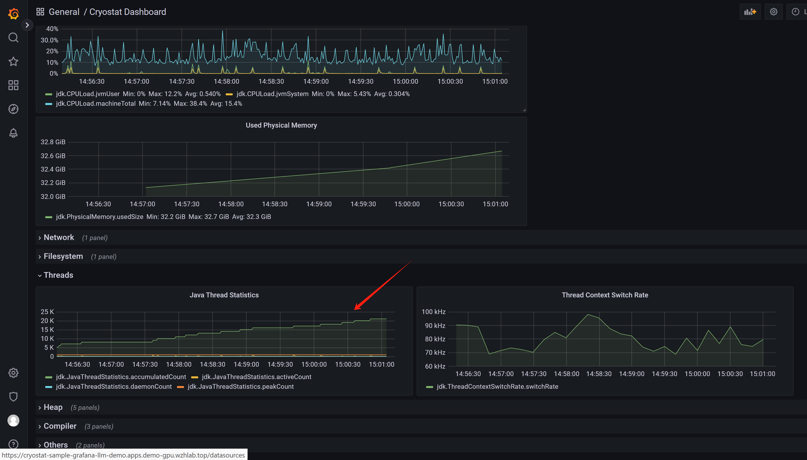

# JVM monitoring: cryostat on openshift 4.14

We want to monitor java app, to find out misbehaving, performance issue, etc. We can use `cryostat` to do this.

In this lab, we will use a buggy java app to demonstrate how to use `cryostat` to monitor it. This buggy java app will provide a web service, during each http request, it will create 1000 new thread to call backend service, which will cause the app to hang under traffic load.

offical docs:
- https://access.redhat.com/documentation/en-us/red_hat_build_of_cryostat/2

The arch of this lab:


# install cert-manager

Install the cert-manager just from the operator hub.


# install cryostat

Selec the cryostat opeartor from operator hub

<!--  -->


Then, create a cryostat instance at app project/namespace


Keep cert-manager integration for our test.

<!--  -->


Craete a report instance, so we can see a general report of the app.


Give enough memory to the cryostat, otherwize the cryostat console will crash.


<!-- Enable storage


 -->

Attach the ssl cert to the cryostat deployment, this is a requirement, because in redhat build of cryostat, the connect to app/jmx/agent, must be ssl enabled, otherwise the console will deny show result.


# try with the buggy java app in JMX way

The JMX is a feature of java/jvm, it can provide monitoring and management data, we can use it to monitor the java app. So the arch of this test looks like this, you can see, the monitor data is from jmx, and the cryostat will get the data from jmx.


## the buggy java code

We create a buggy java app, it will create 1000 thread on each rest api call, and the 1000 threads, each will call for backend service to get the result.

Here is the buggy code, you can get the [source code at here](https://github.com/wangzheng422/simple-java-http-server/blob/threads/src/main/java/com/example/httpservice/MyController.java).
```java
  ExecutorService executorService = Executors.newFixedThreadPool(maxThreads);
  try {
      for (int i = 0; i < maxThreads; i++) {
          executorService.submit(() -> {
              try {
                  LOGGER.info(Thread.currentThread().getName());
                  sendHttpRequest();
              } catch (Exception e) {
                  // handle exception
                  e.printStackTrace();
              }
          });
      }
      executorService.shutdown();
      if (!executorService.awaitTermination(timeoutMins, TimeUnit.MINUTES)) {
          executorService.shutdownNow();
      }
  } catch (InterruptedException e) {
      e.printStackTrace();
      executorService.shutdownNow();
  }

  String response = sendHttpRequest();
  return ResponseEntity.ok(response);

```

## deploy the java app with JMX

There are several way to get monitoring data from app, one is JMX, another is agent, we will use JMX in this section, because it will only use jvm capabilities, and no need to change the app code.

```bash

# we need keytool from jdk
dnf install -y java-21-openjdk-devel

cd ${BASE_DIR}/data/install/

# Generate a Keystore
keytool -genkeypair -alias wzhlab -keyalg RSA -keystore keystore.jks -keysize 2048 -storepass redhat2024 -dname "CN=wzhlab-demo, OU=wzhlab-demo, O=wzhlab-demo, L=Beijing, ST=Beijing, C=CN" -validity $((365*100))
# Generating 2,048 bit RSA key pair and self-signed certificate (SHA384withRSA) with a validity of 36,500 days
#    for: CN=wzhlab-demo, OU=wzhlab-demo, O=wzhlab-demo, L=Beijing, ST=Beijing, C=CN

# Generate a Certificate Signing Request (CSR)
# keytool -certreq -alias wzhlab -file wzhlab.csr -keystore keystore.jks -storepass redhat2024

# Self-sign the CSR (if you don't have a Certificate Authority)
# keytool -gencert -alias wzhlab -infile wzhlab.csr -outfile wzhlab.crt -keystore keystore.jks -storepass redhat2024 -rfc

# create the certificate
keytool -exportcert -alias wzhlab -keystore keystore.jks -rfc -file wzhlab.crt -storepass redhat2024

oc create secret generic myapp-cert -n llm-demo \
  --from-file=tls.crt=${BASE_DIR}/data/install/wzhlab.crt \
  --from-file=keystore.jks=${BASE_DIR}/data/install/keystore.jks \
  --from-literal=storepass="redhat2024"

# oc delete secret myapp-cert -n llm-demo

# we prepare the jmx user/password
cat << EOF > ${BASE_DIR}/data/install/cryostat-user.yaml
monitor readonly
EOF

cat << EOF > ${BASE_DIR}/data/install/cryostat-pwd.yaml
monitor redhat
EOF

oc create configmap jmx-config -n llm-demo \
    --from-file=jmxremote.access=${BASE_DIR}/data/install/cryostat-user.yaml

oc create secret generic jmx-secret -n llm-demo \
    --from-file=jmxremote.password=${BASE_DIR}/data/install/cryostat-pwd.yaml

# go back to helper
# create a dummy pod
# we will disable JMX auth now for simplified, 
# will focus on agent way later.
cat << EOF > ${BASE_DIR}/data/install/demo1.yaml
---
apiVersion: v1
kind: Service
metadata:
  name: wzh-demo-service
spec:
  ports:
    - name: service-port
      port: 80
      protocol: TCP
      targetPort: 8080
    - name: "jfr-jmx"
      port: 9091
      targetPort: 9091
    - name: "cryostat-agent"
      port: 9977
      targetPort: 9977
  selector:
    app: wzh-demo-pod

---
apiVersion: route.openshift.io/v1
kind: Route
metadata:
  name: wzh-demo
  annotations:
    haproxy.router.openshift.io/timeout: 2m
spec:
  to:
    kind: Service
    name: wzh-demo-service
  port:
    targetPort: service-port

---
apiVersion: apps/v1
kind: Deployment
metadata:
  name: wzh-demo-deployment
  labels:
    app: wzh-demo-pod
spec:
  replicas: 1
  selector:
    matchLabels:
      app: wzh-demo-pod
  template:
    metadata:
      labels:
        app: wzh-demo-pod
    spec:
      # nodeSelector:
      #   kubernetes.io/hostname: 'worker-01-demo'
      containers:
        - name: demo1
          image: quay.io/wangzheng422/qimgs:simple-java-http-server-threads-2024.05.06.v01
          env:
            - name: WZH_URL
              value: "http://172.21.6.8:13000/singbox.config.json"
            - name: keyStorePassword
              valueFrom:
                secretKeyRef:
                  name: myapp-cert
                  key: storepass
            - name: JAVA_OPTS
              value: "-Dcom.sun.management.jmxremote.port=9091 -Dcom.sun.management.jmxremote.authenticate=false -Dcom.sun.management.jmxremote.ssl=true -Dcom.sun.management.jmxremote.registry.ssl=true -Djavax.net.ssl.keyStore=/jmx-keystore/keystore.jks -Djavax.net.ssl.keyStorePassword=\$(keyStorePassword) "
            # - name: JAVA_OPTS
            #   value: "-Dcom.sun.management.jmxremote.port=9091 -Dcom.sun.management.jmxremote.authenticate=true -Dcom.sun.management.jmxremote.password.file=/jmx-secret/jmxremote.password -Dcom.sun.management.jmxremote.access.file=/jmx-config/jmxremote.access"
            # command: [ "/bin/bash", "-c", "--" ]
            # args: [ "tail -f /dev/null" ]
            # imagePullPolicy: Always              
          volumeMounts:
            - name: jmx-config-volume
              mountPath: /jmx-config/
            - name: jmx-secret-volume
              mountPath: /jmx-secret/
            - name: keystore-volume
              mountPath: /jmx-keystore/
      volumes:
        - name: keystore-volume
          secret:
            secretName: myapp-cert
        - name: jmx-secret-volume
          secret:
            secretName: jmx-secret
        - name: jmx-config-volume
          configMap:
            name: jmx-config
EOF

oc apply -n llm-demo -f ${BASE_DIR}/data/install/demo1.yaml

# oc delete -n llm-demo -f ${BASE_DIR}/data/install/demo1.yaml

```

## see cryostat result

We do not have password setting, so we can see the app from the cryostat directly.


We can see apps in the project.


We can create report directly.


Set duration and template. Different template will have different KPI.


After the recording created, we can see the result in grafana, or download the jfr file to analyze offline.


get the username/password for graphana

```bash

oc get secret cryostat-sample-grafana-basic -n llm-demo -o jsonpath='{.data.GF_SECURITY_ADMIN_USER}' | base64 -d && echo
# admin

oc get secret cryostat-sample-grafana-basic -n llm-demo -o jsonpath='{.data.GF_SECURITY_ADMIN_PASSWORD}' | base64 -d && echo
# cQLRhe-X5jHVF6p0QuuA

```

Now, we can open the grafana console, and login.


We can switch to another dashboard to see the result.


you can also define automation rule to create reporting for pods belongs to deployment.


We can see the report is created automatically. Now lets see the analysis.


To limit the storage usage, you can limit the recording time, and number of archive, when you create automation rule.


Then you can get 2 archive, the file size is limited.


## testing with app

```bash
# test on helper
siege -q -c 1 -d 10 http://wzh-demo-llm-demo.apps.demo-gpu.wzhlab.top/sendRequest

```

and look at cryostat report, you can see it find out context switching, java blocking problems


and from grafana, we can see threads are increasing, so our buggy app is creating and closing threads all the times.



## analyze with jfr 

download jre/jdk at:
- https://adoptium.net/download/

download jmc at:
- https://adoptium.net/jmc/

download the jfr file:


open jmc, and open jfr file, you can see the overall result, just the same with cryostat analyse reporting.

<!--  -->


And you can go deeper to see the java app's overall result.


From socket view, you can see the connection report.


From the thread report, you can see app's thread behaviour is buggy. The thread view is slow, so you should give small jfr file if you want to open thread view.


## the priciple

by go to pod terminal, we can see, it just dump jfr file to /tmp, and then the cryostat will pick it up.

```bash

# get the first pod name from deployment
POD_NAME=$(oc get pod -n llm-demo -l app=wzh-demo-pod -o jsonpath='{.items[0].metadata.name}')

# login to pod, and list /tmp/ with folder like 2024_05_08_12_39_54_7
oc exec -n llm-demo $POD_NAME -it -- /bin/bash -c "ls -l /tmp/"
# total 0
# drwxr-xr-x. 2 1000720000 root 80 May  8 13:10 2024_05_08_12_39_54_7
# drwxr-xr-x. 2 1000720000 root 23 May  8 12:39 hsperfdata_1000720000
# drwxr-xr-x. 1 root       root 24 May  2 01:12 hsperfdata_root
# drwx------. 3 1000720000 root 26 May  8 12:39 tomcat.8080.3417839246973169794
# drwx------. 2 1000720000 root 10 May  8 12:39 tomcat-docbase.8080.14004372978732183802

oc exec -n llm-demo $POD_NAME -it -- /bin/bash -c "ls -l /tmp/2024_05_08_12_39_54_7"
# total 2760
# -rw-r--r--. 1 1000720000 root 1841833 May  8 13:10 2024_05_08_12_47_24.jfr
# -rw-r--r--. 1 1000720000 root  724150 May  8 13:18 2024_05_08_13_10_09.jfr

```

# try with the buggy java app in agent way

The agent way is more flexible, because it remove the priviledge of jmx. In agent way, the jvm will inject with agent.jar byte-code, and then the agent will collect the data, and send to cryostat.


Download cryostat agent from upstream, find the correct versino based on the cryostat version. For this lab, it is cryostat 2.4.0, so we download the agent 0.3.0.

- https://github.com/cryostatio/cryostat-agent
- https://cryostat.io/get-started/#using-the-cryostat-agent

We will follow opentelementry way, to build a new image with agent, and then deploy it with copy to java app container.

## agent.jar image

```bash

# on vultr
dnf install -y java-1.8.0-openjdk-devel java-21-openjdk-devel

dnf install -y /usr/bin/podman-compose /usr/bin/mvn


mkdir -p /data
cd /data

# download the jar from github
# https://github.com/cryostatio/cryostat-agent/packages/1601815?version=0.3.0

# and copy to server

cat << EOF > agent.dockerfile
FROM docker.io/rockylinux:9-minimal AS build

ADD cryostat-agent-0.3.0-shaded.jar /cryostat-agent-0.3.0-shaded.jar

EOF

podman build -t quay.io/wangzheng422/qimgs:cryostat-agent-v0.3.0 -f agent.dockerfile .

podman push quay.io/wangzheng422/qimgs:cryostat-agent-v0.3.0

```

## start buggy java app

Then, we will copy the agent to java app container, and start the agent.

```bash

# Create a new service account
oc project llm-demo

oc create sa cryostat-app

# Assign the 'edit' role to the service account
# This allows the service account to create, read, and update resources in the current namespace
oc policy add-role-to-user edit system:serviceaccount:$(oc project -q):cryostat-app

# Get the name of the token secret for the service account
TOKEN_SECRET_NAME=$(oc get sa cryostat-app -o jsonpath='{.secrets[0].name}')

TOKEN_APP_SECRET_NAME=$(oc get secret $TOKEN_SECRET_NAME -o jsonpath='{.metadata.ownerReferences[0].name}')

echo $TOKEN_APP_SECRET_NAME
# cryostat-app-token-7flvq

# Get the token value
# TOKEN_VALUE=$(oc get secret $TOKEN_APP_SECRET_NAME -o jsonpath='{.data.token}' | base64 --decode)
TOKEN_VALUE_ENC=$(oc get secret $TOKEN_APP_SECRET_NAME -o jsonpath='{.data.token}')

echo $TOKEN_VALUE_ENC


# VAR_TOKEN=`oc whoami -t | base64`

oc get cert
# NAME                      READY   SECRET                        AGE
# cryostat-sample           True    cryostat-sample-tls           55m
# cryostat-sample-ca        True    cryostat-sample-ca            55m
# cryostat-sample-grafana   True    cryostat-sample-grafana-tls   55m
# cryostat-sample-reports   True    cryostat-sample-reports-tls   55m

# go back to helper
# create a dummy pod
# we will disable JMX auth now for simplified, 
# will focus on agent way later.
VAR_CRYOSTAT_NAME="cryostat-sample"
cat << EOF > ${BASE_DIR}/data/install/demo1.yaml
---
apiVersion: v1
kind: Service
metadata:
  name: wzh-demo-service
spec:
  ports:
    - name: service-port
      port: 80
      protocol: TCP
      targetPort: 8080
    - name: "jfr-jmx"
      port: 9091
      targetPort: 9091
    - name: "cryostat-agent"
      port: 9977
      targetPort: 9977
  selector:
    app: wzh-demo-pod

---
apiVersion: route.openshift.io/v1
kind: Route
metadata:
  name: wzh-demo
  annotations:
    haproxy.router.openshift.io/timeout: 2m
spec:
  to:
    kind: Service
    name: wzh-demo-service
  port:
    targetPort: service-port

---
apiVersion: apps/v1
kind: Deployment
metadata:
  name: wzh-demo-deployment
  labels:
    app: wzh-demo-pod
spec:
  replicas: 1
  selector:
    matchLabels:
      app: wzh-demo-pod
  template:
    metadata:
      labels:
        app: wzh-demo-pod
    spec:
      # nodeSelector:
      #   kubernetes.io/hostname: 'worker-01-demo'
      initContainers:
        - name: agent-jar
          image: quay.io/wangzheng422/qimgs:cryostat-agent-v0.3.0
          command: ["/bin/sh", "-c", "cp /cryostat-agent-0.3.0-shaded.jar /agent-dir/cryostat-agent-0.3.0-shaded.jar"]
          volumeMounts:
            - name: agent-dir
              mountPath: /agent-dir
      containers:
        - name: demo1
          image: quay.io/wangzheng422/qimgs:simple-java-http-server-threads-2024.05.06.v01
          env:
            - name: WZH_URL
              value: "http://172.21.6.8:13000/singbox.config.json"
            - name: keyStorePassword
              valueFrom:
                secretKeyRef:
                  name: $VAR_CRYOSTAT_NAME-keystore
                  key: KEYSTORE_PASS
            - name: CRYOSTAT_AGENT_APP_NAME
              value: "buggy-java-app"
            - name: NAMESPACE
              valueFrom:
                fieldRef:
                  fieldPath: metadata.namespace
            - name: CRYOSTAT_AGENT_BASEURI
              value: "https://$VAR_CRYOSTAT_NAME.\$(NAMESPACE).svc.cluster.local:8181"
            - name: CRYOSTAT_AGENT_API_WRITES_ENABLED
              value: "true"
            - name: POD_IP
              valueFrom:
                fieldRef:
                  fieldPath: status.podIP
            - name: CRYOSTAT_AGENT_CALLBACK
              value: "http://\$(POD_IP):9977"
            - name: CRYOSTAT_AGENT_AUTHORIZATION
              value: "Bearer ${TOKEN_VALUE_ENC}"
            - name: JAVA_OPTS
              value: "-javaagent:/agent-dir/cryostat-agent-0.3.0-shaded.jar -Djavax.net.ssl.trustStore=/cryostat-keystore/truststore.p12 -Djavax.net.ssl.trustStorePassword=\$(keyStorePassword) "
          volumeMounts:
            - name: agent-dir
              mountPath: /agent-dir
            - name: cryostat-keystore
              mountPath: /cryostat-keystore
      volumes:
        - name: cryostat-keystore
          secret:
            secretName: $VAR_CRYOSTAT_NAME-tls
        - name: agent-dir
          emptyDir: {}
EOF

oc apply -n llm-demo -f ${BASE_DIR}/data/install/demo1.yaml

# oc delete -n llm-demo -f ${BASE_DIR}/data/install/demo1.yaml

# test on helper
siege -q -c 1 -d 10 http://wzh-demo-llm-demo.apps.demo-gpu.wzhlab.top/sendRequest

```

From the cryostat grafana result, we can see the thread increased a lot, and this is the buggy java app behaviour.


## see on cryostat webconsole

First, we need to create a cryostat instance, this is the same with previous steps, but do not need TLS certification.


This time, we do not need this, do not need to add tls cert.


After create buggy java app, we can see the app from targets.


After define a automate rule, 


We can see recordings.


And archives.


Other usage will be the same.

Here is the cryostat instance config yaml file. For your reference.
```yaml
apiVersion: operator.cryostat.io/v1beta1
kind: Cryostat
metadata:
  name: cryostat-sample
  namespace: llm-demo
spec:
  enableCertManager: true
  minimal: false
  reportOptions:
    replicas: 1
    resources: {}
  resources:
    coreResources:
      limits:
        memory: 5Gi
    dataSourceResources:
      limits:
        memory: 3Gi
    grafanaResources:
      limits:
        memory: 2Gi
  schedulingOptions:
    affinity:
      nodeAffinity:
        requiredDuringSchedulingIgnoredDuringExecution:
          nodeSelectorTerms:
            - matchExpressions:
                - key: kubernetes.io/hostname
                  operator: In
                  values:
                    - worker-01-demo
  storageOptions:
    pvc:
      spec:
        resources: {}

```

# end