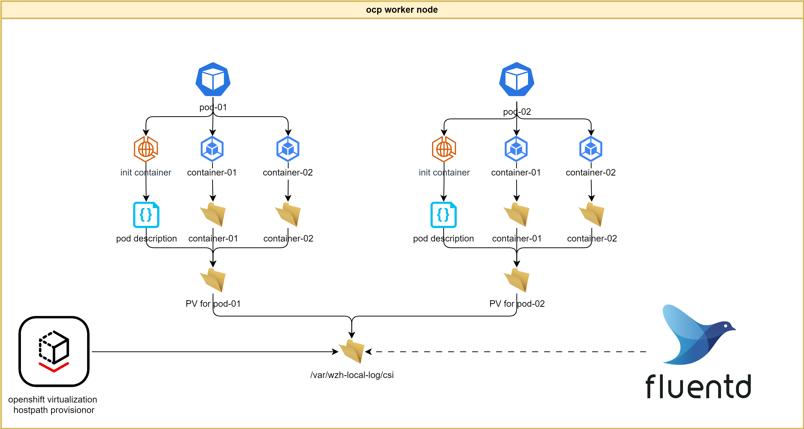
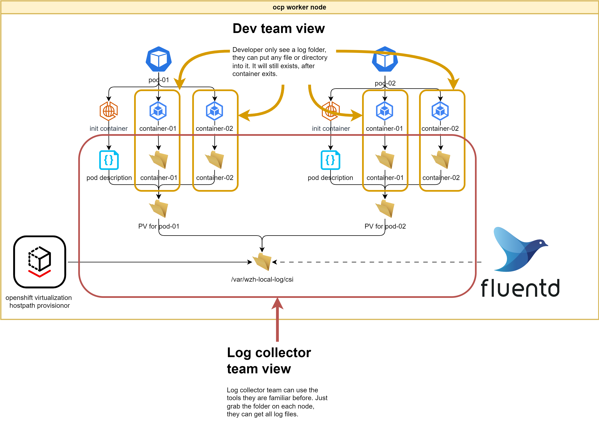
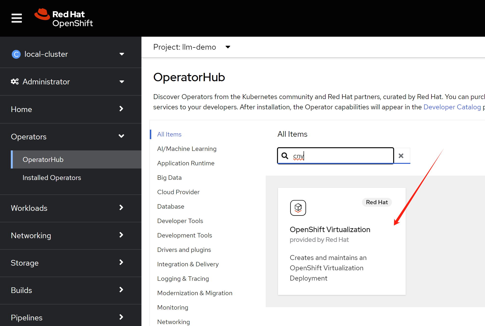
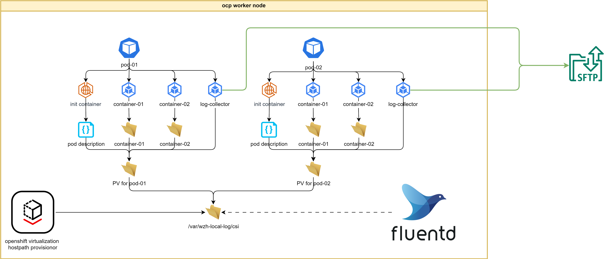
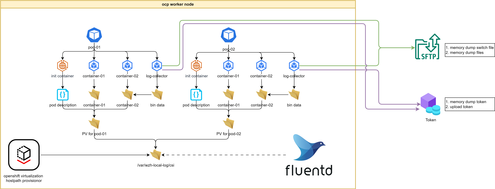

# persistent log for pod with multiple log files

Customer wants to use k8s/container platform/openshift, just as vm platform. They want to have a persistent log directory for each pod, and the log files should be kept after the pod is deleted. But k8s by default, only support STDOUT, STDERR for log, and the log files will be deleted after the pod is deleted.

The key problem here is that container only support 2 log streams, but app, like java app, may have multiple log files, and the log files are generated by the app itself, like gc.log, access.log, and so on. So, we need to find a way to keep the log files.

For customer moving from vm to container, they are familiar with file based log collecting system, like fluend, and most of them already have deploy such platform. So we will create a solution, that can work with the existing log collecting system. This means, we will write log to local file system, and the log files will be collected by the log collecting system.

From openshift admin view, the solution architecture is like this:



From customer developer team view, and operation/log analyze team view, the solution architecture is like this:



# using hostpath with retain policy

We will create log storage with hostpath provisioner, and use retain policy for the storage, so the log files will be kept after the pod is deleted. And we will create a demo app, that can write log to the log storage.

## storage prepare

install cnv, and config a hostpath. We know the hostpath works for worker node, but it not work for master node.



```yaml
apiVersion: hostpathprovisioner.kubevirt.io/v1beta1
kind: HostPathProvisioner
metadata:
  name: hostpath-provisioner
spec:
  imagePullPolicy: IfNotPresent
  storagePools:
    - name: local
      path: /var/wzh-local-log
  workload:
    nodeSelector:
      kubernetes.io/os: linux

```

then define a storage class

```yaml
apiVersion: storage.k8s.io/v1
kind: StorageClass
metadata:
  name: local-log-hostpath-csi
provisioner: kubevirt.io.hostpath-provisioner
reclaimPolicy: Retain 
volumeBindingMode: WaitForFirstConsumer 
parameters:
  storagePool: local

```

## demo pod create

Now, we can start a demo app, and mount the log volumn, later, we will shutdown the deployment, and see the log files is still there.

The source code of the demo app is here:
- https://github.com/wangzheng422/simple-java-http-server/blob/threads/src/main/java/com/example/httpservice/MyController.java

```bash

export BASE_DIR=/home/dev-admin

mkdir -p ${BASE_DIR}/data/install/openshift

# we need a sa, that can read pod information
# the default sa, do have such privilege
cat << EOF > ${BASE_DIR}/data/install/sa.yaml
apiVersion: v1
kind: ServiceAccount
metadata:
  name: pod-info-sa
---
apiVersion: rbac.authorization.k8s.io/v1
kind: Role
metadata:
  name: pod-reader
rules:
- apiGroups: [""]
  resources: ["pods"]
  verbs: ["get", "watch", "list"]
---
apiVersion: rbac.authorization.k8s.io/v1
kind: RoleBinding
metadata:
  name: read-pods
subjects:
- kind: ServiceAccount
  name: pod-info-sa
  namespace: llm-demo
roleRef:
  kind: Role
  name: pod-reader
  apiGroup: rbac.authorization.k8s.io
EOF

oc apply -f ${BASE_DIR}/data/install/sa.yaml -n llm-demo

# oc delete -f ${BASE_DIR}/data/install/sa.yaml -n llm-demo

# we use a startup script to get pod information
# and store it to log dir, so admin can know the pod information
cat << 'EOF' > ${BASE_DIR}/data/install/pod-info.sh
#!/bin/sh

touch /mnt/pod.name.$POD_NAME
touch /mnt/pod.namespace.$NAMESPACE

oc get pod $POD_NAME -n $NAMESPACE -o yaml > /mnt/pod-deploy.txt 2>&1

oc describe pod $POD_NAME -n $NAMESPACE  > /mnt/pod-describe.txt 2>&1

# oc get pod $POD_NAME -n $NAMESPACE -o jsonpath='{.spec.containers[*].name}' > /mnt/pod-containers.txt 2>&1

# create a directory for each container
for var_container in $(oc get pod $POD_NAME -n $NAMESPACE -o jsonpath='{.spec.containers[*].name}'); do 
  mkdir -p /mnt/$var_container
done
EOF

# inject the script into a configmap
oc create configmap wzh-script-configmap --from-file=${BASE_DIR}/data/install/pod-info.sh -n llm-demo

# oc delete configmap wzh-script-configmap -n llm-demo

oc describe sa pod-info-sa -n llm-demo | grep Tokens | awk '{print $2}'
# pod-info-sa-token-cxn8c

VAR_TOKEN=$(oc describe sa pod-info-sa -n llm-demo | grep Tokens | awk '{print $2}')

# create the demo pod
cat << EOF > ${BASE_DIR}/data/install/demo.yaml
---
apiVersion: v1
kind: Service
metadata:
  name: wzh-demo-service
spec:
  ports:
    - name: service-port
      port: 80
      protocol: TCP
      targetPort: 8080
  selector:
    app: pod-description-writer

---
apiVersion: route.openshift.io/v1
kind: Route
metadata:
  name: wzh-demo
  annotations:
    haproxy.router.openshift.io/timeout: 2m
spec:
  to:
    kind: Service
    name: wzh-demo-service
  port:
    targetPort: service-port

---
apiVersion: apps/v1
kind: Deployment
metadata:
  name: pod-description-writer
spec:
  replicas: 1
  selector:
    matchLabels:
      app: pod-description-writer
  template:
    metadata:
      labels:
        app: pod-description-writer
    spec:
      serviceAccountName: pod-info-sa
      # do not auto mount sa token to container, for security reason
      automountServiceAccountToken: false
      volumes:
      - name: pod-description
        ephemeral:
          volumeClaimTemplate:
            metadata:
              labels:
                type: my-frontend-volume
            spec:
              accessModes: [ "ReadWriteOnce" ]
              storageClassName: "local-log-hostpath-csi"
              resources:
                requests:
                  # storage size does not matter for hostpath, becuase it will use all of the disk free space.
                  # but it must be set to actual required size for other storage class
                  storage: 1Gi
      - name: service-account-token
        secret:
          secretName: $VAR_TOKEN
      - name: wzh-script-volume
        configMap:
          name: wzh-script-configmap
      initContainers:
      - name: write-pod-description
        image: registry.redhat.io/openshift4/ose-cli:v4.15
        volumeMounts:
        - name: pod-description
          mountPath: /mnt
        - name: service-account-token
          mountPath: /var/run/secrets/kubernetes.io/serviceaccount
          readOnly: true
        - name: wzh-script-volume
          mountPath: /wzh-scripts
        env:
        - name: POD_NAME
          valueFrom:
            fieldRef:
              fieldPath: metadata.name
        - name: NAMESPACE
          valueFrom:
            fieldRef:
              fieldPath: metadata.namespace
        command: ['bash', '/wzh-scripts/pod-info.sh']
      containers:
      - name: my-app-heap-dump
        image: quay.io/wangzheng422/qimgs:simple-java-http-server-threads-2024.05.30.v04
        volumeMounts:
        - name: pod-description
          # subpath should support var, but we can not get container name
          # so we use a fixed name
          subPath: my-app-heap-dump
          mountPath: /wzh-log/
EOF

oc apply -f ${BASE_DIR}/data/install/demo.yaml -n llm-demo

# oc delete -f ${BASE_DIR}/data/install/demo.yaml -n llm-demo

# get the route of the demo app, and extract the url from the route resource
oc get route wzh-demo -n llm-demo -o jsonpath='{.spec.host}{"\n"}'
# wzh-demo-llm-demo.apps.cluster-gtmcf.sandbox301.opentlc.com

VAR_ROUTE=$(oc get route wzh-demo -n llm-demo -o jsonpath='{.spec.host}{"\n"}')

# cause the java app to dump
curl -k http://${VAR_ROUTE}/dumpheap

# cause the java app to crash
curl -k http://${VAR_ROUTE}/crashapi

# cause the java app to dump again
curl -k http://${VAR_ROUTE}/dumpheap

# check the log dir from pod
oc exec -it $(oc get pod -n llm-demo | grep pod-description-writer | awk '{print $1}') -n llm-demo -- ls -l /wzh-log/
# Defaulted container "my-app-heap-dump" out of: my-app-heap-dump, write-pod-description (init)
# total 52196
# -rw-------. 1 1000880000 1000880000 26725084 May 30 16:49 heap-dump_2024-05-30_16-49-47.hprof
# -rw-------. 1 1000880000 1000880000 26719723 May 30 16:50 heap-dump_2024-05-30_16-50-09.hprof


# check the log dir from host
oc get pod -o wide -n llm-demo
# NAME                                      READY   STATUS    RESTARTS      AGE   IP            NODE                                         NOMINATED NODE   READINESS GATES
# pod-description-writer-76df449b56-kxqfr   1/1     Running   1 (35s ago)   62s   10.128.2.32   ip-10-0-248-240.us-east-2.compute.internal   <none>           <none>

oc debug node/ip-10-0-248-240.us-east-2.compute.internal -- ls -R /host/var/wzh-local-log
# Temporary namespace openshift-debug-blrnb is created for debugging node...
# Starting pod/ip-10-0-248-240us-east-2computeinternal-debug ...
# To use host binaries, run `chroot /host`
# /host/var/wzh-local-log:
# csi

# /host/var/wzh-local-log/csi:
# pvc-5f48184b-2b3b-4101-815c-2d93894b139f

# /host/var/wzh-local-log/csi/pvc-5f48184b-2b3b-4101-815c-2d93894b139f:
# my-app-heap-dump
# pod-deploy.txt
# pod-describe.txt
# pod.name.pod-description-writer-76df449b56-kxqfr
# pod.namespace.llm-demo

# /host/var/wzh-local-log/csi/pvc-5f48184b-2b3b-4101-815c-2d93894b139f/my-app-heap-dump:
# heap-dump_2024-05-30_16-49-47.hprof
# heap-dump_2024-05-30_16-50-09.hprof

# Removing debug pod ...
# Temporary namespace openshift-debug-blrnb was removed.


```

## clean up pv

After pod exits, the PV used for log is in release status, this is because the reclaim policy is set to retain, we need to manually mark the PV to delete.

```bash

oc get pv | grep local-log-hostpath-csi | grep Released | awk '{print $1}' | \
  xargs -I {} oc patch pv {} -p '{"spec":{"persistentVolumeReclaimPolicy":"Delete"}}'

```

# limitation & recommand

1. enough space on local disk, especially the /var
2. additional disk partition for /var/wzh-local-log
3. consider using pv/pvc for storagePools

# collect raw data files

For java heap dump, it is binary raw data, and log collect tools like fluentd, will not work with it, as it depends on tail and parser on the log file. We need to use other tools to collect the raw data files.

What we plan to do, is just create additional container, mount the bin data dir in RO mode, monitor the dir for bin data file changed and upload the file to remote sftp server.

In the bin-log collecting script, we use sftp command to upload file, and we use inotifywait to monitor the file changes. We expect there is sftp server running, and we can use sftp command to upload file to it, the sftp server should be enhanced with security, only allow upload, not download, and no ssh shell provided. [Here is a sftp pod demo, for your reference](../4.12/2024.06.sftp.pod.md). 

Now, the overall solution architecture is like this:



Please note, we only want to collect bin data file, which will create once, and not modified after created. For log file, we can use fluentd to collect it.

```bash

export BASE_DIR=${HOME}
mkdir -p ${BASE_DIR}/data/install/openshift

# we need a sa, that can read pod information
# the default sa, do have such privilege
cat << EOF > ${BASE_DIR}/data/install/sa.yaml
apiVersion: v1
kind: ServiceAccount
metadata:
  name: pod-info-sa
---
apiVersion: rbac.authorization.k8s.io/v1
kind: Role
metadata:
  name: pod-reader
rules:
- apiGroups: [""]
  resources: ["pods"]
  verbs: ["get", "watch", "list"]
---
apiVersion: rbac.authorization.k8s.io/v1
kind: RoleBinding
metadata:
  name: read-pods
subjects:
- kind: ServiceAccount
  name: pod-info-sa
  namespace: llm-demo
roleRef:
  kind: Role
  name: pod-reader
  apiGroup: rbac.authorization.k8s.io
EOF

oc apply -f ${BASE_DIR}/data/install/sa.yaml -n llm-demo

# oc delete -f ${BASE_DIR}/data/install/sa.yaml -n llm-demo

# we use a startup script to get pod information
# and store it to log dir, so admin can know the pod information
cat << 'EOF' > ${BASE_DIR}/data/install/pod-info.sh
#!/bin/sh

touch /mnt/pod.name.$POD_NAME
touch /mnt/pod.namespace.$NAMESPACE

oc get pod $POD_NAME -n $NAMESPACE -o yaml > /mnt/pod-deploy.txt 2>&1

oc describe pod $POD_NAME -n $NAMESPACE  > /mnt/pod-describe.txt 2>&1

# oc get pod $POD_NAME -n $NAMESPACE -o jsonpath='{.spec.containers[*].name}' > /mnt/pod-containers.txt 2>&1

# create a directory for each container
for var_container in $(oc get pod $POD_NAME -n $NAMESPACE -o jsonpath='{.spec.containers[*].name}'); do 
  mkdir -p /mnt/$var_container
done
EOF

# we use a startup script to get pod information
# and store it to log dir, so admin can know the pod information
cat << 'EOF' > ${BASE_DIR}/data/install/log-collect.sh
#!/bin/bash

# Define the local directory to monitor and the remote server directory
LOCAL_DIR="$ENV_LOCAL_DIR"
REMOTE_DIR="$ENV_REMOTE_DIR"

# Get the SFTP username and password from environment variables
SFTP_USER="$ENV_SFTP_USER"
SFTP_PASSWORD="$ENV_SFTP_PASSWORD"
SFTP_HOST="$ENV_SFTP_HOST" # Replace with your actual remote server host


# Create a temporary batch file to check and create the remote directory
INIT_BATCH_FILE=$(mktemp)
echo "mkdir $REMOTE_DIR" > $INIT_BATCH_FILE

# Use sshpass with sftp to automatically login and execute the batch file to ensure the remote directory exists
sshpass -p "$SFTP_PASSWORD" sftp -oBatchMode=no -b $INIT_BATCH_FILE -o StrictHostKeyChecking=no -oUserKnownHostsFile=/tmp/known_hosts $SFTP_USER@$SFTP_HOST

# Remove the temporary batch file for directory initialization
rm $INIT_BATCH_FILE

# Loop indefinitely
while true; do
  # Use inotifywait to monitor the directory for any change events and read the output
  inotifywait -e close_write --format '%w%f' $LOCAL_DIR | while read FILE; do
    # Check if the file exists before attempting to sync, as it might have been deleted
    if [ -e "$FILE" ]; then
      # Create a temporary batch file for sftp commands
      BATCH_FILE=$(mktemp)
      echo "put $FILE $REMOTE_DIR" > $BATCH_FILE
      
      # Use sshpass with sftp to automatically login using the provided username and password
      # and execute the batch file
      sshpass -p"$SFTP_PASSWORD" sftp -oBatchMode=no -b $BATCH_FILE -o StrictHostKeyChecking=no -oUserKnownHostsFile=/tmp/known_hosts $SFTP_USER@$SFTP_HOST

      # can also use scp
      # and use -l limit
      #       Limits the used bandwidth, specified in Kbit/s.
      # sshpass -p"$SFTP_PASSWORD" scp -o StrictHostKeyChecking=no -oUserKnownHostsFile=/tmp/known_hosts $FILE $SFTP_USER@$SFTP_HOST:$REMOTE_DIR/
      
      # Remove the temporary batch file
      rm $BATCH_FILE
    fi
  done
done
EOF

oc delete configmap wzh-script-configmap -n llm-demo
# inject the script into a configmap
oc create configmap wzh-script-configmap \
  --from-file=${BASE_DIR}/data/install/pod-info.sh \
  --from-file=${BASE_DIR}/data/install/log-collect.sh \
  -n llm-demo

# oc delete configmap wzh-script-configmap -n llm-demo

oc describe sa pod-info-sa -n llm-demo | grep Tokens | awk '{print $2}'
# pod-info-sa-token-cxn8c

VAR_TOKEN=$(oc describe sa pod-info-sa -n llm-demo | grep Tokens | awk '{print $2}')

# create the demo pod
cat << EOF > ${BASE_DIR}/data/install/demo.yaml
---
apiVersion: v1
kind: Service
metadata:
  name: wzh-demo-service
spec:
  ports:
    - name: service-port
      port: 80
      protocol: TCP
      targetPort: 8080
  selector:
    app: pod-description-writer

---
apiVersion: route.openshift.io/v1
kind: Route
metadata:
  name: wzh-demo
spec:
  to:
    kind: Service
    name: wzh-demo-service
  port:
    targetPort: service-port

---
apiVersion: apps/v1
kind: Deployment
metadata:
  name: pod-description-writer
spec:
  replicas: 1
  selector:
    matchLabels:
      app: pod-description-writer
  template:
    metadata:
      labels:
        app: pod-description-writer
    spec:
      serviceAccountName: pod-info-sa
      # do not auto mount sa token to container, for security reason
      automountServiceAccountToken: false
      volumes:
      - name: pod-local-log
        ephemeral:
          volumeClaimTemplate:
            metadata:
              labels:
                type: my-frontend-volume
            spec:
              accessModes: [ "ReadWriteOnce" ]
              storageClassName: "local-log-hostpath-csi"
              resources:
                requests:
                  # storage size does not matter for hostpath, becuase it will use all of the disk free space.
                  # but it must be set to actual required size for other storage class
                  storage: 1Gi
      - name: service-account-token
        secret:
          secretName: $VAR_TOKEN
      - name: wzh-script-volume
        configMap:
          name: wzh-script-configmap
      initContainers:
      - name: write-pod-description
        image: registry.redhat.io/openshift4/ose-cli:v4.15
        volumeMounts:
        - name: pod-local-log
          mountPath: /mnt
        - name: service-account-token
          mountPath: /var/run/secrets/kubernetes.io/serviceaccount
          readOnly: true
        - name: wzh-script-volume
          mountPath: /wzh-scripts
        env:
        - name: POD_NAME
          valueFrom:
            fieldRef:
              fieldPath: metadata.name
        - name: NAMESPACE
          valueFrom:
            fieldRef:
              fieldPath: metadata.namespace
        command: ['bash', '/wzh-scripts/pod-info.sh']
      containers:
      - name: my-app-heap-dump
        image: quay.io/wangzheng422/qimgs:simple-java-http-server-threads-2024.05.30.v04
        volumeMounts:
        - name: pod-local-log
          # subpath should support variable, but we can not get container name
          # so we use a fixed name
          subPath: my-app-heap-dump
          mountPath: /wzh-log/
      - name: log-collector-for-app-one
        # the image used here is not optimized for rpms installed, it is just for demo.
        image: quay.io/wangzheng422/qimgs:rocky9-test-2024.06.17.v01
        command: ['bash', '/wzh-scripts/log-collect.sh']
        volumeMounts:
        - name: wzh-script-volume
          mountPath: /wzh-scripts
        - name: pod-local-log
          subPath: my-app-heap-dump
          mountPath: /wzh-log/
          readOnly: true
        env:
        - name: POD_UID
          valueFrom:
            fieldRef:
              fieldPath: metadata.uid
        - name: ENV_LOCAL_DIR
          value: /wzh-log/
        - name: ENV_REMOTE_DIR
          value: upload/\$(POD_UID)
        - name: ENV_SFTP_USER
          value: foo
        - name: ENV_SFTP_PASSWORD
          value: pass
        - name: ENV_SFTP_HOST
          value: sftp-service
EOF

oc apply -f ${BASE_DIR}/data/install/demo.yaml -n llm-demo

# oc delete -f ${BASE_DIR}/data/install/demo.yaml -n llm-demo

# get the route of the demo app, and extract the url from the route resource
oc get route wzh-demo -n llm-demo -o jsonpath='{.spec.host}{"\n"}'
# wzh-demo-llm-demo.apps.cluster-gtmcf.sandbox301.opentlc.com

VAR_ROUTE=$(oc get route wzh-demo -n llm-demo -o jsonpath='{.spec.host}{"\n"}')

# cause the java app to dump
curl -k http://${VAR_ROUTE}/dumpheap

# cause the java app to crash
curl -k http://${VAR_ROUTE}/crashapi

# cause the java app to dump again
curl -k http://${VAR_ROUTE}/dumpheap


# check on sftp server, it is a pod in our case, 
# we can see the uploaded files
oc exec -it sftp-pod -- ls -lR /home/foo/upload
/home/foo/upload:
total 24
d-wx-wx---+ 2 foo users 4096 Jun 17 08:49 492f2920-79ff-423f-ba3f-d6c80721fa88

/home/foo/upload/492f2920-79ff-423f-ba3f-d6c80721fa88:
total 52328
--w-------. 1 foo users 26767535 Jun 17 08:49 heap-dump_2024-06-17_08-49-01.hprof
--w-------. 1 foo users 26808556 Jun 17 08:49 heap-dump_2024-06-17_08-49-56.hprof


```

# trigger java heap dump based on pod memory usage

Customer also needs an automatically way, to trigger the java heap dump, when the java app run out of the pod memory. We will use liveness pod of the container, and run a script to check the memory usage, and trigger the java heap dump.

If you have multiple liveness check logic, you have to combine them into one script.

```bash

oc new-project llm-demo

export BASE_DIR=${HOME}
mkdir -p ${BASE_DIR}/data/install/openshift

# we need a sa, that can read pod information
# the default sa, do have such privilege
cat << EOF > ${BASE_DIR}/data/install/sa.yaml
apiVersion: v1
kind: ServiceAccount
metadata:
  name: pod-info-sa
---
apiVersion: rbac.authorization.k8s.io/v1
kind: Role
metadata:
  name: pod-reader
rules:
- apiGroups: [""]
  resources: ["pods"]
  verbs: ["get", "watch", "list"]
---
apiVersion: rbac.authorization.k8s.io/v1
kind: RoleBinding
metadata:
  name: read-pods
subjects:
- kind: ServiceAccount
  name: pod-info-sa
  namespace: llm-demo
roleRef:
  kind: Role
  name: pod-reader
  apiGroup: rbac.authorization.k8s.io
EOF

oc apply -f ${BASE_DIR}/data/install/sa.yaml -n llm-demo

# oc delete -f ${BASE_DIR}/data/install/sa.yaml -n llm-demo

# we use a startup script to get pod information
# and store it to log dir, so admin can know the pod information
cat << 'EOF' > ${BASE_DIR}/data/install/pod-info.sh
#!/bin/sh

touch /mnt/pod.name.$POD_NAME
touch /mnt/pod.namespace.$NAMESPACE

oc get pod $POD_NAME -n $NAMESPACE -o yaml > /mnt/pod-deploy.txt 2>&1

oc describe pod $POD_NAME -n $NAMESPACE  > /mnt/pod-describe.txt 2>&1

# oc get pod $POD_NAME -n $NAMESPACE -o jsonpath='{.spec.containers[*].name}' > /mnt/pod-containers.txt 2>&1

# create a directory for each container
for var_container in $(oc get pod $POD_NAME -n $NAMESPACE -o jsonpath='{.spec.containers[*].name}'); do 
  mkdir -p /mnt/$var_container
done
EOF

# we use a startup script to get pod information
# and store it to log dir, so admin can know the pod information
cat << 'EOF' > ${BASE_DIR}/data/install/log-collect.sh
#!/bin/bash

# Define the local directory to monitor and the remote server directory
LOCAL_DIR="$ENV_LOCAL_DIR"
REMOTE_DIR="$ENV_REMOTE_DIR"

# Get the SFTP username and password from environment variables
SFTP_USER="$ENV_SFTP_USER"
SFTP_PASSWORD="$ENV_SFTP_PASSWORD"
SFTP_HOST="$ENV_SFTP_HOST" # Replace with your actual remote server host


# Create a temporary batch file to check and create the remote directory
INIT_BATCH_FILE=$(mktemp)
echo "mkdir $REMOTE_DIR" > $INIT_BATCH_FILE

# Use sshpass with sftp to automatically login and execute the batch file to ensure the remote directory exists
sshpass -p "$SFTP_PASSWORD" sftp -oBatchMode=no -b $INIT_BATCH_FILE -o StrictHostKeyChecking=no -oUserKnownHostsFile=/tmp/known_hosts $SFTP_USER@$SFTP_HOST

# Remove the temporary batch file for directory initialization
rm $INIT_BATCH_FILE

# Loop indefinitely
while true; do
  # Use inotifywait to monitor the directory for any change events and read the output
  inotifywait -e close_write --format '%w%f' $LOCAL_DIR | while read FILE; do
    # Check if the file exists before attempting to sync, as it might have been deleted
    if [ -e "$FILE" ]; then
      # Create a temporary batch file for sftp commands
      BATCH_FILE=$(mktemp)
      echo "put $FILE $REMOTE_DIR" > $BATCH_FILE
      
      # Use sshpass with sftp to automatically login using the provided username and password
      # and execute the batch file
      sshpass -p"$SFTP_PASSWORD" sftp -oBatchMode=no -b $BATCH_FILE -o StrictHostKeyChecking=no -oUserKnownHostsFile=/tmp/known_hosts $SFTP_USER@$SFTP_HOST

      # can also use scp
      # and use -l limit
      #       Limits the used bandwidth, specified in Kbit/s.
      # sshpass -p"$SFTP_PASSWORD" scp -o StrictHostKeyChecking=no -oUserKnownHostsFile=/tmp/known_hosts $FILE $SFTP_USER@$SFTP_HOST:$REMOTE_DIR/
      
      # Remove the temporary batch file
      rm $BATCH_FILE
    fi
  done
done
EOF

# we use a script to run in liveness check
# go check the memory usage, if it is over the limit, trigger the java heap dump
# you can do the check in liveness check or in readiness check
# in live check, the pod will be restarted, in readiness check, the pod will be removed from service
cat << 'EOF' > ${BASE_DIR}/data/install/liveness-check.sh
#!/bin/bash
# Set the memory threshold to trigger a heap dump
MEMORY_THRESHOLD=80 # in percentage

# Get the total memory limit from the cgroup
TOTAL_MEMORY=$(cat /sys/fs/cgroup/memory/memory.limit_in_bytes)

# Calculate the threshold in bytes
THRESHOLD_BYTES=$((TOTAL_MEMORY * MEMORY_THRESHOLD / 100))

# Get the current memory usage
CURRENT_MEMORY=$(cat /sys/fs/cgroup/memory/memory.usage_in_bytes)

# Check if the current memory usage exceeds the threshold
if [ "$CURRENT_MEMORY" -ge "$THRESHOLD_BYTES" ]; then
  # Get the Java process ID
  # JAVA_PID=$(pgrep -f java)

  # Trigger a heap dump
  # jcmd $JAVA_PID GC.heap_dump /wzh-log/heapdump.hprof
  curl -k -m 20 http://127.0.0.1:8080/dumpheap

  # Optionally, copy the heap dump to a persistent storage or another pod
  # kubectl cp <namespace>/<pod-name>:/path/to/heapdump.hprof /local/path

  # Exit with an error code to restart the pod
  # exit 1
fi

# Exit with a success code
exit 0
EOF

oc delete configmap wzh-script-configmap -n llm-demo
# inject the script into a configmap
oc create configmap wzh-script-configmap \
  --from-file=${BASE_DIR}/data/install/pod-info.sh \
  --from-file=${BASE_DIR}/data/install/log-collect.sh \
  --from-file=${BASE_DIR}/data/install/liveness-check.sh \
  -n llm-demo

# oc delete configmap wzh-script-configmap -n llm-demo

oc describe sa pod-info-sa -n llm-demo | grep Tokens | awk '{print $2}'
# pod-info-sa-token-cxn8c

VAR_TOKEN=$(oc describe sa pod-info-sa -n llm-demo | grep Tokens | awk '{print $2}')

# create the demo pod
cat << EOF > ${BASE_DIR}/data/install/demo.yaml
---
apiVersion: v1
kind: Service
metadata:
  name: wzh-demo-service
spec:
  ports:
    - name: service-port
      port: 80
      protocol: TCP
      targetPort: 8080
  selector:
    app: pod-description-writer

---
apiVersion: route.openshift.io/v1
kind: Route
metadata:
  name: wzh-demo
spec:
  to:
    kind: Service
    name: wzh-demo-service
  port:
    targetPort: service-port

---
apiVersion: apps/v1
kind: Deployment
metadata:
  name: pod-description-writer
spec:
  replicas: 1
  selector:
    matchLabels:
      app: pod-description-writer
  template:
    metadata:
      labels:
        app: pod-description-writer
    spec:
      serviceAccountName: pod-info-sa
      # do not auto mount sa token to container, for security reason
      automountServiceAccountToken: false
      volumes:
      - name: pod-local-log
        ephemeral:
          volumeClaimTemplate:
            metadata:
              labels:
                type: my-frontend-volume
            spec:
              accessModes: [ "ReadWriteOnce" ]
              storageClassName: "local-log-hostpath-csi"
              resources:
                requests:
                  # storage size does not matter for hostpath, becuase it will use all of the disk free space.
                  # but it must be set to actual required size for other storage class
                  storage: 1Gi
      - name: service-account-token
        secret:
          secretName: $VAR_TOKEN
      - name: wzh-script-volume
        configMap:
          name: wzh-script-configmap
      initContainers:
      - name: write-pod-description
        image: registry.redhat.io/openshift4/ose-cli:v4.15
        volumeMounts:
        - name: pod-local-log
          mountPath: /mnt
        - name: service-account-token
          mountPath: /var/run/secrets/kubernetes.io/serviceaccount
          readOnly: true
        - name: wzh-script-volume
          mountPath: /wzh-scripts
        env:
        - name: POD_NAME
          valueFrom:
            fieldRef:
              fieldPath: metadata.name
        - name: NAMESPACE
          valueFrom:
            fieldRef:
              fieldPath: metadata.namespace
        command: ['bash', '/wzh-scripts/pod-info.sh']
      containers:
      - name: my-app-heap-dump
        image: quay.io/wangzheng422/qimgs:simple-java-http-server-threads-2024.06.26.v02
        env:
        - name: JAVA_OPTS
          value: "-XX:MaxRAMPercentage=90.0"
        resources:
          limits:
            memory: "10Gi"
        livenessProbe:
          exec:
            command:
            - /bin/bash
            - /wzh-scripts/liveness-check.sh
          initialDelaySeconds: 60
          periodSeconds: 300
          timeoutSeconds: 30
          failureThreshold: 5
        volumeMounts:
        - name: pod-local-log
          # subpath should support variable, but we can not get container name
          # so we use a fixed name
          subPath: my-app-heap-dump
          mountPath: /wzh-log/
        # mount check script from configmap
        - name: wzh-script-volume
          subPath: liveness-check.sh
          mountPath: /wzh-scripts/liveness-check.sh      
      - name: log-collector-for-app-one
        # the image used here is not optimized for rpms installed, it is just for demo.
        image: quay.io/wangzheng422/qimgs:rocky9-test-2024.06.17.v01
        command: ['bash', '/wzh-scripts/log-collect.sh']
        volumeMounts:
        - name: wzh-script-volume
          mountPath: /wzh-scripts
        - name: pod-local-log
          subPath: my-app-heap-dump
          mountPath: /wzh-log/
          readOnly: true
        env:
        - name: POD_UID
          valueFrom:
            fieldRef:
              fieldPath: metadata.uid
        - name: ENV_LOCAL_DIR
          value: /wzh-log/
        - name: ENV_REMOTE_DIR
          value: upload/\$(POD_UID)
        - name: ENV_SFTP_USER
          value: foo
        - name: ENV_SFTP_PASSWORD
          value: pass
        - name: ENV_SFTP_HOST
          value: sftp-service
EOF

oc delete -f ${BASE_DIR}/data/install/demo.yaml -n llm-demo

oc apply -f ${BASE_DIR}/data/install/demo.yaml -n llm-demo

# oc delete -f ${BASE_DIR}/data/install/demo.yaml -n llm-demo

# get the route of the demo app, and extract the url from the route resource
oc get route wzh-demo -n llm-demo -o jsonpath='{.spec.host}{"\n"}'
# wzh-demo-llm-demo.apps.cluster-gtmcf.sandbox301.opentlc.com

VAR_ROUTE=$(oc get route wzh-demo -n llm-demo -o jsonpath='{.spec.host}{"\n"}')

# # cause the java app to dump
# curl -k http://${VAR_ROUTE}/dumpheap

# # cause the java app to crash
# curl -k http://${VAR_ROUTE}/crashapi

# # cause the java app to dump again
# curl -k http://${VAR_ROUTE}/dumpheap

# cause the java app to use 9.5GB memory
# so we can trigger heap dump through liveness-check
curl -k http://${VAR_ROUTE}/consume-memory?size=8GB

# reset the memory usage
curl -k http://${VAR_ROUTE}/release-memory

# check the log dir from pod
oc exec -it $(oc get pod -n llm-demo | grep pod-description-writer | awk '{print $1}') -n llm-demo -- ls -l /wzh-log/
# Defaulted container "my-app-heap-dump" out of: my-app-heap-dump, log-collector-for-app-one, write-pod-description (init)
# total 3145664
# -rw-------. 1 1000880000 1000880000 2667016192 Jun 26 08:34 heap-dump_2024-06-26_08-34-49.hprof


```

# token service to control concurrency

Customer has a limited backend network infrastructure, so the solution should have as little impact on the network infrastruct as possible. That means the total network bandwidth needed of this solution should be as low as possible. We will use a token service to control the concurrency of the java heap dump upload, so that only one java heap dump upload can be triggered at a time. And each of the upload session network speed will be limited.

The token service consists with 2 part, one is a global lock, and the other is a token pool. The global lock is used to control the concurrency, and the token pool is used to control the network session concurrency.

We also need a solution to limit the upload only once for a container, which means the upload will switch to off automatically after the upload is done. And we also needs a way to reset the upload switch, so that the upload can be triggered again.

The overall solution architecture is like this:



The token service repo is here:
- https://github.com/wangzheng422/simple-token-implement

```bash


oc new-project llm-demo

export BASE_DIR=${HOME}
mkdir -p ${BASE_DIR}/data/install/openshift

# we need a sa, that can read pod information
# the default sa, do have such privilege
cat << EOF > ${BASE_DIR}/data/install/sa.yaml
apiVersion: v1
kind: ServiceAccount
metadata:
  name: pod-info-sa
---
apiVersion: rbac.authorization.k8s.io/v1
kind: Role
metadata:
  name: pod-reader
rules:
- apiGroups: [""]
  resources: ["pods"]
  verbs: ["get", "watch", "list"]
---
apiVersion: rbac.authorization.k8s.io/v1
kind: RoleBinding
metadata:
  name: read-pods
subjects:
- kind: ServiceAccount
  name: pod-info-sa
  namespace: llm-demo
roleRef:
  kind: Role
  name: pod-reader
  apiGroup: rbac.authorization.k8s.io
EOF

oc apply -f ${BASE_DIR}/data/install/sa.yaml -n llm-demo

# oc delete -f ${BASE_DIR}/data/install/sa.yaml -n llm-demo

# create a singleton token service
# currently, this demo token service will work with only one token
# for multiple token, it can still work, but not optimized for bug scale.
cat << EOF > ${BASE_DIR}/data/install/token-service.yaml
---
apiVersion: v1
kind: Service
metadata:
  name: demo-sftp-token-service
spec:
  ports:
    - name: service-port
      port: 80
      protocol: TCP
      targetPort: 5000
  selector:
    app: pod-demo-sftp-token

---
apiVersion: apps/v1
kind: Deployment
metadata:
  name: pod-demo-sftp-token
spec:
  replicas: 1
  selector:
    matchLabels:
      app: pod-demo-sftp-token
  template:
    metadata:
      labels:
        app: pod-demo-sftp-token
    spec:
      containers:
      - name: demo-sftp-token
        image: quay.io/wangzheng422/qimgs:simple-token-implement-2024.07.02-v01
        env:
        - name: TOTAL_TOKENS
          value: "1"
        - name: TIMER_DURATION
          value: "1800"
EOF

oc delete -f ${BASE_DIR}/data/install/token-service.yaml -n llm-demo

oc apply -f ${BASE_DIR}/data/install/token-service.yaml -n llm-demo

# we also need a token service for trigger java memory dump
# why we need to limit the concurrency of the java memory dump?
# because the java memory dump is a heavy operation, it will consume a lot of storage, 
# if 100 java container with 8GB memory dump the memroy, it will consume 800GB storage. It is near 1TB.
# so we need to limit the concurrency of the java memory dump, to avoid the storage issue.
# apply for memory dump token before memory dump
# and release the token after the memory dump is uploaded 
cat << EOF > ${BASE_DIR}/data/install/memory-dump-token-service.yaml
---
apiVersion: v1
kind: Service
metadata:
  name: demo-memory-dump-token-service
spec:
  ports:
    - name: service-port
      port: 80
      protocol: TCP
      targetPort: 5000
  selector:
    app: pod-demo-memory-dump-token

---
apiVersion: apps/v1
kind: Deployment
metadata:
  name: pod-demo-memory-dump-token
spec:
  replicas: 1
  selector:
    matchLabels:
      app: pod-demo-memory-dump-token
  template:
    metadata:
      labels:
        app: pod-demo-memory-dump-token
    spec:
      containers:
      - name: demo-memory-dump-token
        image: quay.io/wangzheng422/qimgs:simple-token-implement-2024.07.02-v01
        env:
        - name: TOTAL_TOKENS
          value: "1"
        - name: TIMER_DURATION
          value: "1800"
EOF

oc delete -f ${BASE_DIR}/data/install/memory-dump-token-service.yaml -n llm-demo

oc apply -f ${BASE_DIR}/data/install/memory-dump-token-service.yaml -n llm-demo

# we use a startup script to get pod information
# and store it to log dir, so admin can know the pod information
cat << 'EOF' > ${BASE_DIR}/data/install/pod-info.sh
#!/bin/sh

touch /mnt/pod.name.$POD_NAME
touch /mnt/pod.namespace.$NAMESPACE

oc get pod $POD_NAME -n $NAMESPACE -o yaml > /mnt/pod-deploy.txt 2>&1

oc describe pod $POD_NAME -n $NAMESPACE  > /mnt/pod-describe.txt 2>&1

# oc get pod $POD_NAME -n $NAMESPACE -o jsonpath='{.spec.containers[*].name}' > /mnt/pod-containers.txt 2>&1

# create a directory for each container
for var_container in $(oc get pod $POD_NAME -n $NAMESPACE -o jsonpath='{.spec.containers[*].name}'); do 
  mkdir -p /mnt/$var_container
done
EOF

# we use a startup script to get pod information
# and store it to log dir, so admin can know the pod information
cat << 'EOF' > ${BASE_DIR}/data/install/log-collect.sh
#!/bin/bash

# Create a temporary batch file to check and create the remote directory
INIT_BATCH_FILE=$(mktemp)
echo "mkdir $REMOTE_DIR" > $INIT_BATCH_FILE

# Use sshpass with sftp to automatically login and execute the batch file to ensure the remote directory exists
sshpass -p "$SFTP_PASSWORD" sftp -oBatchMode=no -b $INIT_BATCH_FILE -o StrictHostKeyChecking=no -oUserKnownHostsFile=/dev/null $SFTP_USER@$SFTP_HOST

# Remove the temporary batch file for directory initialization
rm $INIT_BATCH_FILE

# we need to get a token from token service, to control the concurrency
get_global_token () {
  local token_service=$1
  local pod_name=$2
  local pod_namespace=$3

  # Create a temporary batch file for sftp commands
  BATCH_FILE=$(mktemp)

  # Call the token service to get a token
  encoded_value=$(jq -nr --arg pod_name "$pod_name" --arg namespace "$pod_namespace" '($namespace + ":" + $pod_name) | @uri')
  echo "Encoded value: $encoded_value"

  # Use -o to redirect the output to /dev/null (if the response body is not needed)
  # Use -w to write out the HTTP status code
  http_status=$(curl -s -o $BATCH_FILE -w "%{http_code}" -H "X-API-PASSWORD: your_password_here" "http://$token_service/issue_token?info=$encoded_value")

  echo "TOKEN_SERVICE: $token_service"
  echo "HTTP status: $http_status"

  echo "content of token service result:"
  cat $BATCH_FILE

  rm -f $BATCH_FILE

  # Check if the token retrieval was successful
  if [[ $http_status -eq 200 ]]; then
      echo "Token retrieved successfully. $token_service"
      return 0
  else
      echo "Failed to retrieve token. $token_service"
      return 1
  fi
}

# we need to get a token from token service, to control the concurrency
# after get token, we need to release the token
release_global_token () {
  local token_service=$1
  local pod_name=$2
  local pod_namespace=$3

  # Call the token service to get a token
  encoded_value=$(jq -nr --arg pod_name "$pod_name" --arg namespace "$pod_namespace" '($namespace + ":" + $pod_name) | @uri')
  echo "Encoded value: $encoded_value"

  # and release the token
  curl -s -H "X-API-PASSWORD: your_password_here" "http://$token_service/recycle_token?info=$encoded_value"

  echo 'token released. $token_service'
}

# Loop indefinitely
while true; do
  # Use inotifywait to monitor the directory for any change events and read the output
  inotifywait -e close_write --format '%w%f' $LOCAL_DIR | while read FILE; do
    # Check if the file exists before attempting to sync, as it might have been deleted
    if [ -e "$FILE" ]; then

      # loop, call the token service to get a token
      # if failed, wait for 10 seconds, and retry
      while :; do

        # Call the token service to get a token
        get_global_token $TOKEN_SERVICE $POD_NAME $POD_NAMESPACE

        # Check if the token retrieval was successful
        if [[ $? -eq 0 ]]; then
            echo "Token retrieved successfully: $token"
            break # Exit the loop if the token was retrieved successfully
        else
            echo "Failed to retrieve token. Sleep 30 seconds and retry."

            # Wait for 30 seconds before retrying
            sleep 30
        fi
      done

      # create batch file to sftp to upload
      echo "put $FILE $REMOTE_DIR" > $BATCH_FILE
      
      # Use sshpass with sftp to automatically login using the provided username and password
      # and execute the batch file
      # we limited the bandwidth with 200Mbps
      sshpass -p"$SFTP_PASSWORD" sftp -oBatchMode=no -b $BATCH_FILE -o StrictHostKeyChecking=no -oUserKnownHostsFile=/dev/null -l $((200*1024)) $SFTP_USER@$SFTP_HOST

      # can also use scp
      # and use -l limit
      #       Limits the used bandwidth, specified in Kbit/s.
      # sshpass -p"$SFTP_PASSWORD" scp -o StrictHostKeyChecking=no -oUserKnownHostsFile=/dev/null $FILE $SFTP_USER@$SFTP_HOST:$REMOTE_DIR/
      
      # Remove the temporary batch file
      echo "remove file: $BATCH_FILE"
      rm -f $BATCH_FILE

      # Optional, remove the source file just upload
      echo "remove file: $FILE"
      rm -f $FILE

      # finally release the sftp token
      release_global_token $TOKEN_SERVICE $POD_NAME $POD_NAMESPACE

      echo 'sftp token released'

      # and release the java memory heap dump token
      release_global_token $DUMP_MEMORY_TOKEN_SERVICE $POD_NAME $POD_NAMESPACE

      echo 'memory dump token released'

    fi
  done
done
EOF

# we use a script to run in liveness check
# go check the memory usage, if it is over the limit, trigger the java heap dump
# you can do the check in liveness check or in readiness check
# in live check, the pod will be restarted, in readiness check, the pod will be removed from service
cat << 'EOF' > ${BASE_DIR}/data/install/liveness-check.sh
#!/bin/bash

# we will check local *.hprof file, if it exists, do not trigger heap dump
# the .hprof file should be deleted after upload to sftp server
if [ -f $LOCAL_DIR/*.hprof ]; then
  echo "Heap dump file exists."
  exit 0
else
  echo "File does not exist."
fi

# Set the memory threshold to trigger a heap dump
MEMORY_THRESHOLD=80 # in percentage

# Get the total memory limit from the cgroup
TOTAL_MEMORY=$(cat /sys/fs/cgroup/memory/memory.limit_in_bytes)

# Calculate the threshold in bytes
THRESHOLD_BYTES=$((TOTAL_MEMORY * MEMORY_THRESHOLD / 100))

# Get the current memory usage
CURRENT_MEMORY=$(cat /sys/fs/cgroup/memory/memory.usage_in_bytes)

# before trigger heap dump, we will check the switch file on sftp server
# if there is switch file, we will not trigger heap dump
# if not, we will create the switch file, and then trigger heap dump
# we use switch file on remote sftp server instead of local fs
# so that we can re-enable memory dump by removing the switch file on the remote sftp server
check_switch_file() {

  # Create a temporary batch file to check and create the remote directory
  INIT_BATCH_FILE=$(mktemp)
  # create remote folder
  echo "mkdir $REMOTE_DIR" > $INIT_BATCH_FILE

  # Use sshpass with sftp to automatically login and execute the batch file to ensure the remote directory exists
  sshpass -p "$SFTP_PASSWORD" sftp -oBatchMode=no -b $INIT_BATCH_FILE -o StrictHostKeyChecking=no -oUserKnownHostsFile=/dev/null $SFTP_USER@$SFTP_HOST

  # check the sftp switch file, if the file exists, do not trigger heap dump
  # Create a temporary batch file to check and create the remote directory
  # INIT_BATCH_FILE=$(mktemp)
  echo "ls $REMOTE_DIR/upload.switch" > $INIT_BATCH_FILE

  # Execute the batch file with sftp
  if sshpass -p "$SFTP_PASSWORD" sftp -oBatchMode=no -b $INIT_BATCH_FILE -o StrictHostKeyChecking=no -oUserKnownHostsFile=/dev/null $SFTP_USER@$SFTP_HOST; then
    echo "Memory dump switch file exists."
    # that means switch off, do not trigger heap dump
    rm -f "$INIT_BATCH_FILE"

    return 0
  else
    echo "File does not exist."
    return 1
  fi

}

# create the switch file, so no further heap dump can be trigger
create_switch_file() {

  # create the switch file, so no further heap dump can be trigger
  touch /tmp/empty
  echo "$POD_NAMESPACE:$POD_NAME" > /tmp/empty
  echo "put /tmp/empty $REMOTE_DIR/upload.switch" > $INIT_BATCH_FILE
  if sshpass -p "$SFTP_PASSWORD" sftp -oBatchMode=no -b $INIT_BATCH_FILE -o StrictHostKeyChecking=no -oUserKnownHostsFile=/dev/null $SFTP_USER@$SFTP_HOST; then
    echo "Success to create switch file."
    rm -f "$INIT_BATCH_FILE" /tmp/empty
    return 0
  else
    echo "Failed to create switch file."
    rm -f "$INIT_BATCH_FILE" /tmp/empty
    return 1
  fi
}

# get the memory dump token from token service
get_global_token () {
  local token_service=$1
  local pod_name=$2
  local pod_namespace=$3

  # Create a temporary batch file for sftp commands
  BATCH_FILE=$(mktemp)

  # Call the token service to get a token
  encoded_value=$(jq -nr --arg pod_name "$pod_name" --arg namespace "$pod_namespace" '($namespace + ":" + $pod_name) | @uri')
  echo "Encoded value: $encoded_value"

  # Use -o to redirect the output to /dev/null (if the response body is not needed)
  # Use -w to write out the HTTP status code
  http_status=$(curl -s -o $BATCH_FILE -w "%{http_code}" -H "X-API-PASSWORD: your_password_here" "http://$token_service/issue_token?info=$encoded_value")

  echo "TOKEN_SERVICE: $token_service"
  echo "HTTP status: $http_status"

  echo "content of token service result:"
  cat $BATCH_FILE

  rm -f $BATCH_FILE

  # Check if the token retrieval was successful
  if [[ $http_status -eq 200 ]]; then
      echo "Token retrieved successfully. $token_service"
      return 0
  else
      echo "Failed to retrieve token. $token_service"
      return 1
  fi
}

# release the token after the memory dump is uploaded
release_global_token () {
  local token_service=$1
  local pod_name=$2
  local pod_namespace=$3

  # Call the token service to get a token
  encoded_value=$(jq -nr --arg pod_name "$pod_name" --arg namespace "$pod_namespace" '($namespace + ":" + $pod_name) | @uri')
  echo "Encoded value: $encoded_value"

  # and release the token
  curl -s -H "X-API-PASSWORD: your_password_here" "http://$token_service/recycle_token?info=$encoded_value"

  echo 'token released. $token_service'
}


# Check if the current memory usage exceeds the threshold
if [ "$CURRENT_MEMORY" -ge "$THRESHOLD_BYTES" ]; then

  # we will use a switch file on sftp server, to control whether to do heap dump
  # that means the heap dump will do only once for a container
  # for the first time it encounter the memory pressure
  # you can remove the switch file on sftp server, to restore the heap dump
  # if we find the swtich file on sftp server's folder
  # the script will exit without doing heap dump
  check_switch_file

  # Check the return value
  if [ $? -eq 0 ]; then
    echo "remote switch file exists, not triggering heap dump."
    exit 0
  else
    echo "No remote switch file found, proceeding to trigger heap dump."
    # Trigger heap dump logic here
  fi

  # get the memory dump token from token service
  # we will not do multiple memory dump concurrency. 
  get_global_token $DUMP_MEMORY_TOKEN_SERVICE $POD_NAME $POD_NAMESPACE

  # Check the return value
  if [ $? -eq 0 ]; then
    echo "Get the token, triggering heap dump."
  else
    echo "Can not get memory dump token, other container is dumping, give up now."
    # Trigger heap dump logic here
    exit 0
  fi

  # check whether remote switch file created
  create_switch_file

  # we will not check whether switch file create successful
  # because it just control the next heap dump, not the current heap dump

  # Get the Java process ID
  # JAVA_PID=$(pgrep -f java)

  # Trigger a heap dump
  # jcmd $JAVA_PID GC.heap_dump /wzh-log/heapdump.hprof
  # allow 1 mins to write to heap dump file
  curl -k -m 5 http://127.0.0.1:8080/dumpheap

  # Optionally, copy the heap dump to a persistent storage or another pod
  # kubectl cp <namespace>/<pod-name>:/path/to/heapdump.hprof /local/path

  # Exit with an error code to restart the pod
  # exit 1
fi

# Exit with a success code
exit 0
EOF

oc delete configmap wzh-script-configmap -n llm-demo
# inject the script into a configmap
oc create configmap wzh-script-configmap \
  --from-file=${BASE_DIR}/data/install/pod-info.sh \
  --from-file=${BASE_DIR}/data/install/log-collect.sh \
  --from-file=${BASE_DIR}/data/install/liveness-check.sh \
  -n llm-demo

# oc delete configmap wzh-script-configmap -n llm-demo

oc describe sa pod-info-sa -n llm-demo | grep Tokens | awk '{print $2}'
# pod-info-sa-token-cxn8c

VAR_TOKEN=$(oc describe sa pod-info-sa -n llm-demo | grep Tokens | awk '{print $2}')

# create the demo pod
cat << EOF > ${BASE_DIR}/data/install/demo.yaml
---
apiVersion: v1
kind: Service
metadata:
  name: wzh-demo-service
spec:
  ports:
    - name: service-port
      port: 80
      protocol: TCP
      targetPort: 8080
  selector:
    app: pod-description-writer

---
apiVersion: route.openshift.io/v1
kind: Route
metadata:
  name: wzh-demo
spec:
  to:
    kind: Service
    name: wzh-demo-service
  port:
    targetPort: service-port

---
apiVersion: apps/v1
kind: Deployment
metadata:
  name: pod-description-writer
spec:
  replicas: 1
  selector:
    matchLabels:
      app: pod-description-writer
  template:
    metadata:
      labels:
        app: pod-description-writer
    spec:
      serviceAccountName: pod-info-sa
      # do not auto mount sa token to container, for security reason
      automountServiceAccountToken: false
      volumes:
      - name: pod-local-log
        ephemeral:
          volumeClaimTemplate:
            metadata:
              labels:
                type: my-frontend-volume
            spec:
              accessModes: [ "ReadWriteOnce" ]
              storageClassName: "local-log-hostpath-csi"
              resources:
                requests:
                  # storage size does not matter for hostpath, becuase it will use all of the disk free space.
                  # but it must be set to actual required size for other storage class
                  storage: 10Gi
      - name: service-account-token
        secret:
          secretName: $VAR_TOKEN
      - name: wzh-script-volume
        configMap:
          name: wzh-script-configmap
      initContainers:
      - name: write-pod-description
        image: registry.redhat.io/openshift4/ose-cli:v4.15
        volumeMounts:
        - name: pod-local-log
          mountPath: /mnt
        - name: service-account-token
          mountPath: /var/run/secrets/kubernetes.io/serviceaccount
          readOnly: true
        - name: wzh-script-volume
          mountPath: /wzh-scripts
        env:
        - name: POD_NAME
          valueFrom:
            fieldRef:
              fieldPath: metadata.name
        - name: NAMESPACE
          valueFrom:
            fieldRef:
              fieldPath: metadata.namespace
        command: ['bash', '/wzh-scripts/pod-info.sh']
      containers:
      - name: my-app-heap-dump
        image: quay.io/wangzheng422/qimgs:simple-java-http-server-threads-2024.07.05.v04
        env:
        - name: JAVA_OPTS
          value: "-XX:MaxRAMPercentage=90.0"
        # below is for trigger logic for heap dump
        # they are used for liveness-check.sh
        - name: POD_UID
          valueFrom:
            fieldRef:
              fieldPath: metadata.uid
        - name: POD_NAME
          valueFrom:
            fieldRef:
              fieldPath: metadata.name
        - name: POD_NAMESPACE
          valueFrom:
            fieldRef:
              fieldPath: metadata.namespace
        - name: LOCAL_DIR
          value: /wzh-log/
        - name: REMOTE_DIR
          value: upload/\$(POD_UID)
        - name: SFTP_USER
          value: foo
        - name: SFTP_PASSWORD
          value: pass
        - name: SFTP_HOST
          value: sftp-service
        - name: DUMP_MEMORY_TOKEN_SERVICE
          value: demo-memory-dump-token-service
        resources:
          limits:
            memory: "10Gi"
        livenessProbe:
          exec:
            command:
            - /bin/bash
            - /wzh-scripts/liveness-check.sh
          initialDelaySeconds: 60
          periodSeconds: 90
          # java memory dump to file needs some times
          timeoutSeconds: 30
          failureThreshold: 5
        volumeMounts:
        - name: pod-local-log
          # subpath should support variable, but we can not get container name
          # so we use a fixed name
          subPath: my-app-heap-dump
          mountPath: /wzh-log/
        # mount check script from configmap
        - name: wzh-script-volume
          subPath: liveness-check.sh
          mountPath: /wzh-scripts/liveness-check.sh      
      - name: log-collector-for-app-one
        # the image used here is not optimized for rpms installed, it is just for demo.
        image: quay.io/wangzheng422/qimgs:rocky9-test-2024.06.17.v01
        command: ['bash', '/wzh-scripts/log-collect.sh']
        volumeMounts:
        - name: wzh-script-volume
          mountPath: /wzh-scripts
        - name: pod-local-log
          subPath: my-app-heap-dump
          mountPath: /wzh-log/
          # we will delete the bin-data log after upload
          # readOnly: true
        env:
        - name: POD_UID
          valueFrom:
            fieldRef:
              fieldPath: metadata.uid
        - name: POD_NAME
          valueFrom:
            fieldRef:
              fieldPath: metadata.name
        - name: POD_NAMESPACE
          valueFrom:
            fieldRef:
              fieldPath: metadata.namespace
        - name: LOCAL_DIR
          value: /wzh-log/
        - name: REMOTE_DIR
          value: upload/\$(POD_UID)
        - name: SFTP_USER
          value: foo
        - name: SFTP_PASSWORD
          value: pass
        - name: SFTP_HOST
          value: sftp-service
        - name: TOKEN_SERVICE
          value: demo-sftp-token-service
        - name: DUMP_MEMORY_TOKEN_SERVICE
          value: demo-memory-dump-token-service
EOF

oc delete -f ${BASE_DIR}/data/install/demo.yaml -n llm-demo

oc apply -f ${BASE_DIR}/data/install/demo.yaml -n llm-demo

# oc delete -f ${BASE_DIR}/data/install/demo.yaml -n llm-demo

# get all pod ip belongs to deployment
# and call each pod to trigger the heap dump
# Define the deployment name and namespace
deployment_name="pod-description-writer"
namespace="llm-demo"

# Get the list of pod IPs for the deployment
pod_ips=$(oc get pods -l app=$deployment_name -n $namespace -o jsonpath='{.items[*].status.podIP}')

# Loop through each pod IP and trigger the heap dump
for ip in $pod_ips; do
    echo "Triggering heap dump for pod with IP: $ip"
    # Replace the following curl command with the actual command or endpoint you use to trigger the heap dump
    oc exec -it -n llm-demo wzh-demo-util -- curl "http://$ip:8080/dumpheap"
done

# release the token
oc exec -it -n llm-demo wzh-demo-util -- curl -H "X-API-PASSWORD: your_password_here" "http://demo-sftp-token-service/recycle_token"

oc exec -it -n llm-demo wzh-demo-util -- curl -H "X-API-PASSWORD: your_password_here" "http://demo-memory-dump-token-service/recycle_token"


# loop pod ip to trigger memory consumption
# Get the list of pod IPs for the deployment
pod_ips=$(oc get pods -l app=$deployment_name -n $namespace -o jsonpath='{.items[*].status.podIP}')

# cause the java app to use 9.5GB memory
# so we can trigger heap dump through liveness-check
for ip in $pod_ips; do
    echo "Triggering heap dump for pod with IP: $ip"
    # Replace the following curl command with the actual command or endpoint you use to trigger the heap dump
    oc exec -it -n llm-demo wzh-demo-util -- curl "http://$ip:8080/consume-memory?size=8GB" && echo
done

# loop pod ip to trigger memory release
# Get the list of pod IPs for the deployment
pod_ips=$(oc get pods -l app=$deployment_name -n $namespace -o jsonpath='{.items[*].status.podIP}')

for ip in $pod_ips; do
    echo "Triggering heap dump for pod with IP: $ip"
    # Replace the following curl command with the actual command or endpoint you use to trigger the heap dump
    # reset the memory usage
    oc exec -it -n llm-demo wzh-demo-util -- curl "http://$ip:8080/release-memory" && echo
done


# Get list of pods with the name pod-description-writer
pods=$(oc get pods -o name -n llm-demo | grep 'pod-description-writer')

# Loop through each pod and execute ls /wzh-log
for pod in $pods; do
    echo "Listing /wzh-log for $pod"
    oc exec -it $pod -- ls -lh /wzh-log/
done

```


# load test

The requirement of the load test
1. java app consume 8GB memory
2. bin-data only
3. freq: ~5min memory dump
4. period: ~4hour
5. monitoring: cpu, memory, network, fs usage

# end