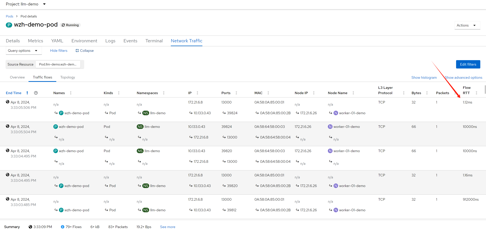

# openshift 4.14 Network Observability

openshift 4.14 introduce eBPF as agent for netoberv, we try it out, and see how it works. We focus on egress IP senario, and want to see RTT value from backend service outside of cluster.

- https://docs.openshift.com/container-platform/4.14/observability/network_observability/installing-operators.html

here is the architecture of this lab:


# try with loki

## install loki

RTT value need loki as backend, we install loki first.

- [Installing the Loki Operator](https://docs.openshift.com/container-platform/4.14/observability/network_observability/installing-operators.html#network-observability-loki-installation_network_observability)


### install a minio as backend

we need s3 storage, we will use minio as backend, and use local disk as storage.

deploy a minio for testing only, not for production. becuase official minio will enable https, it will bring so many trouble into app integration, we use a old version minio.

```bash

# oc new-project llm-demo
# oc label --overwrite ns llm-demo \
#    pod-security.kubernetes.io/enforce=privileged

oc new-project netobserv

# on helper
S3_NAME='netobserv'
S3_NS='netobserv'
S3_IMAGE='docker.io/minio/minio:RELEASE.2021-06-17T00-10-46Z.hotfix.35a0912ff'

cat << EOF > ${BASE_DIR}/data/install/s3-codellama.yaml
---
apiVersion: v1
kind: Service
metadata:
  name: minio-${S3_NAME}
spec:
  ports:
    - name: minio-client-port
      port: 9000
      protocol: TCP
      targetPort: 9000
  selector:
    app: minio-${S3_NAME}

# ---
# apiVersion: route.openshift.io/v1
# kind: Route
# metadata:
#   name: s3-${S3_NAME}
# spec:
#   to:
#     kind: Service
#     name: minio-${S3_NAME}
#   port:
#     targetPort: 9000

---
apiVersion: v1
kind: PersistentVolumeClaim
metadata:
  name: minio-${S3_NAME}-pvc
spec:
  accessModes:
    - ReadWriteOnce
  resources:
    requests:
      storage: 100Gi
  storageClassName: hostpath-csi

---
apiVersion: apps/v1
kind: Deployment
metadata:
  name: minio-${S3_NAME}
  labels:
    app: minio-${S3_NAME}
spec:
  replicas: 1
  selector:
    matchLabels:
      app: minio-${S3_NAME}
  template:
    metadata:
      labels:
        app: minio-${S3_NAME}
    spec:
      initContainers:
        - name: create-demo-dir
          image: docker.io/busybox
          command: ["mkdir", "-p", "/data1/demo"]
          volumeMounts:
            - name: data
              mountPath: "/data1"
      containers:
        - args:
            - server
            - /data1
          env:
            - name: MINIO_ACCESS_KEY
              value:  admin
            - name: MINIO_SECRET_KEY
              value: redhatocp
          image: ${S3_IMAGE}
          imagePullPolicy: IfNotPresent
          name: minio
          nodeSelector:
            kubernetes.io/hostname: "worker-01-demo"
          securityContext:
            allowPrivilegeEscalation: false
            capabilities:
                drop:
                - ALL
            runAsNonRoot: true
            seccompProfile:
                type: RuntimeDefault
          volumeMounts:
            - mountPath: "/data1"
              name: data
      volumes:
        - name: data 
          persistentVolumeClaim:
            claimName: minio-${S3_NAME}-pvc

EOF

oc create -n netobserv -f ${BASE_DIR}/data/install/s3-codellama.yaml

# oc delete -n netobserv -f ${BASE_DIR}/data/install/s3-codellama.yaml

# open in browser to check, and create bucket 'demo'
# http://s3-netobserv-netobserv.apps.demo-gpu.wzhlab.top/


```

### install loki operator

we have a s3 storage, and we will install loki operator.


```bash

# oc new-project netobserv

cat << EOF > ${BASE_DIR}/data/install/loki-netobserv.yaml
---
apiVersion: v1
kind: Secret
metadata:
  name: loki-s3 
stringData:
  access_key_id: admin
  access_key_secret: redhatocp
  bucketnames: demo
  endpoint: http://minio-netobserv.netobserv.svc.cluster.local:9000
  # region: eu-central-1

---
apiVersion: loki.grafana.com/v1
kind: LokiStack
metadata:
  name: loki
spec:
  size: 1x.demo
  storage:
    schemas:
    - version: v12
      effectiveDate: '2022-06-01'
    secret:
      name: loki-s3
      type: s3
  storageClassName: hostpath-csi
  tenants:
    mode: openshift-network
    openshift:
        adminGroups: 
        - cluster-admin

EOF

oc create --save-config -n netobserv -f ${BASE_DIR}/data/install/loki-netobserv.yaml

# to delete

# oc delete -n netobserv -f ${BASE_DIR}/data/install/loki-netobserv.yaml

# oc get pvc -n netobserv | grep loki- | awk '{print $1}' | xargs oc delete -n netobserv pvc

# run below, if reinstall
oc adm groups new cluster-admin

oc adm groups add-users cluster-admin admin

oc adm policy add-cluster-role-to-group cluster-admin cluster-admin

```

## install net observ

we will install net observ operator, the installation is simple, just follow the official document. If you use eBPF agent, there seems have bugs with the installation steps, it is better to restart nodes to make the ebpf agent function well.


### RTT tracing

enable rtt tracing, following official document.

- https://docs.openshift.com/container-platform/4.12/observability/network_observability/observing-network-traffic.html#network-observability-RTT_nw-observe-network-traffic

It is better to increate the memory limit, otherwise, the bpf agent pod will OOM. In my case, I increate to 2GB.


<!--  -->


or if you want to change yaml directly

```yaml
apiVersion: flows.netobserv.io/v1beta2
kind: FlowCollector
metadata:
  name: cluster
spec:
  namespace: netobserv
  deploymentModel: Direct
  agent:
    type: eBPF
    ebpf:
      features:
       - FlowRTT 
```

## try it out

### RRT

we can see RRT based on each flow. At this point, we did not introduct network latency on backend service, so the RTT is very low.

<!--  -->



### deploy egress IP

next, we will deploy egress IP on worker-02, and make traffic from worker-01 to worker-02, and then backend-service, and see the RTT value.

```bash

# label a node to host egress ip
oc label nodes worker-02-demo k8s.ovn.org/egress-assignable="" 

# label a namespace with env
oc label ns llm-demo env=egress-demo


# create a egress ip
cat << EOF > ${BASE_DIR}/data/install/egressip.yaml
apiVersion: k8s.ovn.org/v1
kind: EgressIP
metadata:
  name: egressips-prod
spec:
  egressIPs:
  - 172.21.6.22
  namespaceSelector:
    matchLabels:
      env: egress-demo
EOF

oc create --save-config -f ${BASE_DIR}/data/install/egressip.yaml

# oc delete -f ${BASE_DIR}/data/install/egressip.yaml

oc get egressip -o json | jq -r '.items[] | [.status.items[].egressIP, .status.items[].node] | @tsv'
# 172.21.6.22     worker-02-demo

```

### make traffic and see result

then, we create backend http service, and introduce network latency by 1s.

```bash

# on backend host, 172.21.6.8
# create a web service
python3 -m http.server 13000
# ...
# 172.21.6.22 - - [08/Apr/2024 12:22:39] "GET / HTTP/1.1" 200 -
# 172.21.6.22 - - [08/Apr/2024 12:22:42] "GET / HTTP/1.1" 200 -
# 172.21.6.22 - - [08/Apr/2024 12:22:45] "GET / HTTP/1.1" 200 -
# ...

# using tc to traffic control / delay 1s
dnf install -y kernel-modules-extra # to install netem module
dnf install -y /usr/sbin/tc

iptables -A OUTPUT -t mangle -p tcp --sport 13000 -j MARK --set-mark 13000

tc qdisc del dev ens192 root
tc qdisc add dev ens192 root handle 1: htb
tc class add dev ens192 parent 1: classid 1:1 htb rate 100mbit
tc filter add dev ens192 protocol ip parent 1:0 prio 1 handle 13000 fw flowid 1:1
tc qdisc add dev ens192 parent 1:1 handle 10: netem delay 1s

tc qdisc show dev ens192
# qdisc htb 1: root refcnt 3 r2q 10 default 0 direct_packets_stat 453 direct_qlen 1000
# qdisc netem 10: parent 1:1 limit 1000 delay 1s

```

and then, we create testing pod, and curl from the pod to backend service

```bash

# go back to helper
# create a dummy pod
cat << EOF > ${BASE_DIR}/data/install/demo1.yaml
---
kind: Pod
apiVersion: v1
metadata:
  name: wzh-demo-pod
spec:
  nodeSelector:
    kubernetes.io/hostname: 'worker-01-demo'
  restartPolicy: Always
  containers:
    - name: demo1
      image: >- 
        quay.io/wangzheng422/qimgs:rocky9-test
      env:
        - name: key
          value: value
      command: [ "/bin/bash", "-c", "--" ]
      args: [ "tail -f /dev/null" ]
      # imagePullPolicy: Always
EOF

oc apply -n llm-demo -f demo1.yaml

oc exec -n llm-demo wzh-demo-pod -it -- bash
# in the container terminal
while true; do curl http://172.21.6.8:13000 && sleep 1; done;

```

and you get the result like this, you can see the RTT become 1s.:


after setting the columnes, we can see something interesting.


as we can see 4 mac address, lets check what they are:
- 0A:58:0A:85:00:01 -> RouterToSwitch, on worker-01
- 0A:58:0A:85:00:2B -> pod's ip, on worker-01
- 0A:58:64:58:00:03 -> RouterToTransitSwitch, on worker-01
- 0A:58:64:58:00:04 -> TransitSwitchToRouter, on worker-02


```bash

VAR_POD=`oc get pod -n openshift-ovn-kubernetes -o wide | grep worker-01-demo | awk '{print $1}'`

oc exec -it ${VAR_POD} -c ovn-controller -n openshift-ovn-kubernetes -- ovn-nbctl show | grep -i 0A:58:0A:85:00:01 -A 10 -B 10
# router 032109ba-320f-4790-a3e6-44f305fa2397 (ovn_cluster_router)
#     port rtoj-ovn_cluster_router
#         mac: "0a:58:64:40:00:01"
#         networks: ["100.64.0.1/16"]
#     port rtos-worker-01-demo
#         mac: "0a:58:0a:85:00:01"
#         networks: ["10.133.0.1/23"]
#         gateway chassis: [163c3827-a827-450e-931c-65eaab2d67d8]
#     port rtots-worker-01-demo
#         mac: "0a:58:64:58:00:03"
#         networks: ["100.88.0.3/16"]


oc exec -it ${VAR_POD} -c ovn-controller -n openshift-ovn-kubernetes -- ovn-nbctl show | grep -i 0A:58:0A:85:00:2B -A 10 -B 20
# switch 2ae42bdd-9dde-43d6-9c1d-46b77298aebf (worker-01-demo)
#     port llm-demo_wzh-demo-pod
#         addresses: ["0a:58:0a:85:00:2b 10.133.0.43"]

oc exec -it ${VAR_POD} -c ovn-controller -n openshift-ovn-kubernetes -- ovn-nbctl show | grep -i 0A:58:64:58:00:03 -A 10 -B 20
# router 032109ba-320f-4790-a3e6-44f305fa2397 (ovn_cluster_router)
#     port rtoj-ovn_cluster_router
#         mac: "0a:58:64:40:00:01"
#         networks: ["100.64.0.1/16"]
#     port rtos-worker-01-demo
#         mac: "0a:58:0a:85:00:01"
#         networks: ["10.133.0.1/23"]
#         gateway chassis: [163c3827-a827-450e-931c-65eaab2d67d8]
#     port rtots-worker-01-demo
#         mac: "0a:58:64:58:00:03"
#         networks: ["100.88.0.3/16"]

oc exec -it ${VAR_POD} -c ovn-controller -n openshift-ovn-kubernetes -- ovn-nbctl show | grep -i 0A:58:64:58:00:04 -A 10 -B 20
# switch ceda4a6b-cac9-49d8-bc7c-7a419e7c51bd (transit_switch)
#     port tstor-worker-01-demo
#         type: router
#         router-port: rtots-worker-01-demo
#     port tstor-worker-02-demo
#         type: remote
#         addresses: ["0a:58:64:58:00:04 100.88.0.4/16"]
#     port tstor-master-01-demo
#         type: remote
#         addresses: ["0a:58:64:58:00:02 100.88.0.2/16"]

oc exec -it ${VAR_POD} -c ovn-controller -n openshift-ovn-kubernetes -- ovn-nbctl list Logical_Router_Port | grep -i 0A:58:0A:85:00:01 -A 10 -B 10
# _uuid               : 53b1cec8-ff5a-4fba-896d-da3bdbea07c1
# enabled             : []
# external_ids        : {}
# gateway_chassis     : [4b714c8d-1508-4a28-ab25-c8df85457fbb]
# ha_chassis_group    : []
# ipv6_prefix         : []
# ipv6_ra_configs     : {}
# mac                 : "0a:58:0a:85:00:01"
# name                : rtos-worker-01-demo
# networks            : ["10.133.0.1/23"]
# options             : {}
# peer                : []
# status              : {hosting-chassis="163c3827-a827-450e-931c-65eaab2d67d8"}


oc exec -it ${VAR_POD} -c ovn-controller -n openshift-ovn-kubernetes -- ovn-nbctl list Logical_Switch_Port | grep -i 0A:58:0A:85:00:2B -A 10 -B 10
# _uuid               : 641b3330-2216-4a6a-abbc-ecea5c888adc
# addresses           : ["0a:58:0a:85:00:2b 10.133.0.43"]
# dhcpv4_options      : []
# dhcpv6_options      : []
# dynamic_addresses   : []
# enabled             : []
# external_ids        : {namespace=llm-demo, pod="true"}
# ha_chassis_group    : []
# mirror_rules        : []
# name                : llm-demo_wzh-demo-pod
# options             : {iface-id-ver="20b12566-0596-4b45-8ed6-9bd4ea68c649", requested-chassis=worker-01-demo}
# parent_name         : []
# port_security       : ["0a:58:0a:85:00:2b 10.133.0.43"]
# tag                 : []
# tag_request         : []
# type                : ""
# up                  : true


oc exec -it ${VAR_POD} -c ovn-controller -n openshift-ovn-kubernetes -- ovn-nbctl list Logical_Router_Port | grep -i 0A:58:64:58:00:03 -A 10 -B 10
# _uuid               : 5e750f8b-0951-4b5f-b415-a6f870dfc3a3
# enabled             : []
# external_ids        : {}
# gateway_chassis     : []
# ha_chassis_group    : []
# ipv6_prefix         : []
# ipv6_ra_configs     : {}
# mac                 : "0a:58:64:58:00:03"
# name                : rtots-worker-01-demo
# networks            : ["100.88.0.3/16"]
# options             : {mcast_flood="true"}
# peer                : []
# status              : {}

oc exec -it ${VAR_POD} -c ovn-controller -n openshift-ovn-kubernetes -- ovn-nbctl list Logical_Switch_Port | grep -i 0A:58:64:58:00:04 -A 10 -B 10
# _uuid               : 225dc4bd-6fe0-4a49-a61f-ab20576fb159
# addresses           : ["0a:58:64:58:00:04 100.88.0.4/16"]
# dhcpv4_options      : []
# dhcpv6_options      : []
# dynamic_addresses   : []
# enabled             : []
# external_ids        : {node=worker-02-demo}
# ha_chassis_group    : []
# mirror_rules        : []
# name                : tstor-worker-02-demo
# options             : {requested-tnl-key="4"}
# parent_name         : []

oc exec -it ${VAR_POD} -c ovn-controller -n openshift-ovn-kubernetes -- ovn-nbctl list Logical_Router | grep name
# name                : GR_worker-01-demo
# name                : ovn_cluster_router

oc exec -it ${VAR_POD} -c ovn-controller -n openshift-ovn-kubernetes -- ovn-nbctl lr-list
# f462fab4-9a08-4dec-ab6b-2576c31908e2 (GR_worker-01-demo)
# 032109ba-320f-4790-a3e6-44f305fa2397 (ovn_cluster_router)

oc exec -it ${VAR_POD} -c ovn-controller -n openshift-ovn-kubernetes -- ovn-nbctl lr-nat-list GR_worker-01-demo
# TYPE             GATEWAY_PORT          EXTERNAL_IP        EXTERNAL_PORT    LOGICAL_IP          EXTERNAL_MAC         LOGICAL_PORT
# snat                                   172.21.6.26                         10.133.0.3
# snat                                   172.21.6.26                         10.133.0.6
# snat                                   172.21.6.26                         10.133.0.103
# snat                                   172.21.6.26                         10.133.0.5
# snat                                   172.21.6.26                         10.133.0.10
# snat                                   172.21.6.26                         10.133.0.20
# snat                                   172.21.6.26                         10.133.0.96
# snat                                   172.21.6.26                         10.133.0.7
# snat                                   172.21.6.26                         10.133.0.11
# snat                                   172.21.6.26                         10.133.0.89
# snat                                   172.21.6.26                         10.133.0.9
# snat                                   172.21.6.26                         10.133.0.91
# snat                                   172.21.6.26                         10.133.0.4
# snat                                   172.21.6.26                         10.133.0.87
# snat                                   172.21.6.26                         10.133.0.92
# snat                                   172.21.6.26                         10.133.0.95
# snat                                   172.21.6.26                         10.133.0.83
# snat                                   172.21.6.26                         10.133.0.12
# snat                                   172.21.6.26                         10.133.0.8
# snat                                   172.21.6.26                         10.133.0.118
# snat                                   172.21.6.26                         10.133.0.86
# snat                                   172.21.6.26                         100.64.0.3
# snat                                   172.21.6.26                         10.133.0.88
# snat                                   172.21.6.26                         10.133.0.13
# snat                                   172.21.6.26                         10.133.0.43
# snat                                   172.21.6.26                         10.133.0.90
# snat                                   172.21.6.26                         10.133.0.93

oc exec -it ${VAR_POD} -c ovn-controller -n openshift-ovn-kubernetes -- ovn-sbctl dump-flows | grep 172.21.6.22
# no result


# search on worker-02
VAR_POD=`oc get pod -n openshift-ovn-kubernetes -o wide | grep worker-02-demo | awk '{print $1}'`


oc exec -it ${VAR_POD} -c ovn-controller -n openshift-ovn-kubernetes -- ovn-nbctl lr-list
# 373ab1b4-7948-4370-a5ab-17f9f3d4b742 (GR_worker-02-demo)
# b23e792d-a79a-47b5-a4c3-c2716ffdb55b (ovn_cluster_router)


oc exec -it ${VAR_POD} -c ovn-controller -n openshift-ovn-kubernetes -- ovn-nbctl lr-nat-list GR_worker-02-demo
# TYPE             GATEWAY_PORT          EXTERNAL_IP        EXTERNAL_PORT    LOGICAL_IP          EXTERNAL_MAC         LOGICAL_PORT
# snat                                   172.21.6.22                         10.133.0.43
# snat                                   172.21.6.27                         10.134.0.5
# snat                                   172.21.6.27                         10.134.0.12
# snat                                   172.21.6.27                         100.64.0.4
# snat                                   172.21.6.27                         10.134.0.4
# snat                                   172.21.6.27                         10.134.0.7
# snat                                   172.21.6.27                         10.134.0.3
# snat                                   172.21.6.27                         10.134.0.6
# snat                                   172.21.6.27                         10.134.0.8

# check mac address again
oc exec -it ${VAR_POD} -c ovn-controller -n openshift-ovn-kubernetes -- ovn-nbctl show | grep -i 0A:58:0A:85:00:01 -A 10 -B 10
# no result

oc exec -it ${VAR_POD} -c ovn-controller -n openshift-ovn-kubernetes -- ovn-nbctl show | grep -i 0A:58:0A:85:00:2B -A 10 -B 20
# no result

oc exec -it ${VAR_POD} -c ovn-controller -n openshift-ovn-kubernetes -- ovn-nbctl show | grep -i 0A:58:64:58:00:03 -A 10 -B 20
# switch 858be777-d262-4db8-9c02-7ed86d85d8a6 (transit_switch)
#     port tstor-worker-02-demo
#         type: router
#         router-port: rtots-worker-02-demo
#     port tstor-worker-01-demo
#         type: remote
#         addresses: ["0a:58:64:58:00:03 100.88.0.3/16"]
#     port tstor-master-01-demo
#         type: remote
#         addresses: ["0a:58:64:58:00:02 100.88.0.2/16"]

oc exec -it ${VAR_POD} -c ovn-controller -n openshift-ovn-kubernetes -- ovn-nbctl show | grep -i 0A:58:64:58:00:04 -A 10 -B 20
# router b23e792d-a79a-47b5-a4c3-c2716ffdb55b (ovn_cluster_router)
#     port rtots-worker-02-demo
#         mac: "0a:58:64:58:00:04"
#         networks: ["100.88.0.4/16"]
#     port rtos-worker-02-demo
#         mac: "0a:58:0a:86:00:01"
#         networks: ["10.134.0.1/23"]
#         gateway chassis: [0e25df85-8df7-451a-bc4e-e59173042ccd]
#     port rtoj-ovn_cluster_router
#         mac: "0a:58:64:40:00:01"
#         networks: ["100.64.0.1/16"]


oc exec -it ${VAR_POD} -c ovn-controller -n openshift-ovn-kubernetes -- ovn-sbctl dump-flows | grep 172.21.6.22
  # table=3 (lr_in_ip_input     ), priority=90   , match=(arp.op == 1 && arp.tpa == 172.21.6.22), action=(eth.dst = eth.src; eth.src = xreg0[0..47]; arp.op = 2; /* ARP reply */ arp.tha = arp.sha; arp.sha = xreg0[0..47]; arp.tpa <-> arp.spa; outport = inport; flags.loopback = 1; output;)
  # table=4 (lr_in_unsnat       ), priority=90   , match=(ip && ip4.dst == 172.21.6.22), action=(ct_snat;)
  # table=3 (lr_out_snat        ), priority=33   , match=(ip && ip4.src == 10.133.0.43 && (!ct.trk || !ct.rpl)), action=(ct_snat(172.21.6.22);)
  # table=27(ls_in_l2_lkup      ), priority=80   , match=(flags[1] == 0 && arp.op == 1 && arp.tpa == 172.21.6.22), action=(clone {outport = "etor-GR_worker-02-demo"; output; }; outport = "_MC_flood_l2"; output;)
  # table=27(ls_in_l2_lkup      ), priority=80   , match=(flags[1] == 0 && arp.op == 1 && arp.tpa == 172.21.6.22), action=(outport = "jtor-GR_worker-02-demo"; output;)


```

Here is the ovn logical network topology:


based on our case, lets draw the network topology:


<!-- 


 -->

## try with a java app

we will create a simple java app, it will access http request, send a dummy http request to 172.21.6.8, and return. So we can see the whole path result.

the sample java app's source project is here:
- https://github.com/wangzheng422/simple-java-http-server

```bash
# go back to helper
# create a dummy pod
cat << EOF > ${BASE_DIR}/data/install/demo1.yaml
---
apiVersion: v1
kind: Service
metadata:
  name: wzh-demo-service
spec:
  ports:
    - name: service-port
      port: 80
      protocol: TCP
      targetPort: 8080
  selector:
    app: wzh-demo-pod

---
apiVersion: route.openshift.io/v1
kind: Route
metadata:
  name: wzh-demo
spec:
  to:
    kind: Service
    name: wzh-demo-service
  port:
    targetPort: service-port


---
kind: Pod
apiVersion: v1
metadata:
  name: wzh-demo-pod
  labels:
    app: wzh-demo-pod
  # annotations:
  #   instrumentation.opentelemetry.io/inject-java: "true"
spec:
  nodeSelector:
    kubernetes.io/hostname: 'worker-01-demo'
  restartPolicy: Always
  containers:
    - name: demo1
      image: >- 
        quay.io/wangzheng422/qimgs:simple-java-http-server-2024.04.14
      env:
        - name: WZH_URL
          value: "http://172.21.6.8:13000"
      # command: [ "/bin/bash", "-c", "--" ]
      # args: [ "tail -f /dev/null" ]
      # imagePullPolicy: Always

---
kind: Pod
apiVersion: v1
metadata:
  name: wzh-demo-util
spec:
  nodeSelector:
    kubernetes.io/hostname: 'worker-01-demo'
  restartPolicy: Always
  containers:
    - name: demo1
      image: >- 
        quay.io/wangzheng422/qimgs:rocky9-test
      env:
        - name: key
          value: value
      command: [ "/bin/bash", "-c", "--" ]
      args: [ "tail -f /dev/null" ]
      # imagePullPolicy: Always
EOF

oc apply -n llm-demo -f ${BASE_DIR}/data/install/demo1.yaml

# oc delete -n llm-demo -f ${BASE_DIR}/data/install/demo1.yaml

while true; do
  curl -s http://wzh-demo-llm-demo.apps.demo-gpu.wzhlab.top/sendRequest
  sleep 1
done

```

lets see the result


so, for ingress traffic, it can show RTT between ingress router / haproxy to pod. What is ip address 10.132.0.2 ? It is management ovn port on master-01, master-01 runs the ingress router / haproxy in host network mode.

```bash

# on master-01, which is 172.21.6.23
ip a
# ....
# 4: ovn-k8s-mp0: <BROADCAST,MULTICAST,UP,LOWER_UP> mtu 1400 qdisc noqueue state UNKNOWN group default qlen 1000
#     link/ether c2:fe:9d:b7:85:f9 brd ff:ff:ff:ff:ff:ff
#     inet 10.132.0.2/23 brd 10.132.1.255 scope global ovn-k8s-mp0
#        valid_lft forever preferred_lft forever
#     inet6 fe80::c0fe:9dff:feb7:85f9/64 scope link
#        valid_lft forever preferred_lft forever
# ....

# on helper
oc get pod -o wide -n openshift-ingress
# NAME                              READY   STATUS    RESTARTS        AGE   IP            NODE             NOMINATED NODE   READINESS GATES
# router-default-8575546d67-cpzvf   1/1     Running   23 (118m ago)   13d   172.21.6.23   master-01-demo   <none>           <none>

oc get node -o wide
# NAME             STATUS   ROLES                         AGE   VERSION            INTERNAL-IP   EXTERNAL-IP   OS-IMAGE                                                       KERNEL-VERSION                 CONTAINER-RUNTIME
# master-01-demo   Ready    control-plane,master,worker   74d   v1.27.11+d8e449a   172.21.6.23   <none>        Red Hat Enterprise Linux CoreOS 414.92.202403081134-0 (Plow)   5.14.0-284.55.1.el9_2.x86_64   cri-o://1.27.4-3.rhaos4.14.git914bcba.el9
# worker-01-demo   Ready    worker                        74d   v1.27.11+d8e449a   172.21.6.26   <none>        Red Hat Enterprise Linux CoreOS 414.92.202403081134-0 (Plow)   5.14.0-284.55.1.el9_2.x86_64   cri-o://1.27.4-3.rhaos4.14.git914bcba.el9
# worker-02-demo   Ready    worker                        4d    v1.27.11+d8e449a   172.21.6.27   <none>        Red Hat Enterprise Linux CoreOS 414.92.202403081134-0 (Plow)   5.14.0-284.55.1.el9_2.x86_64   cri-o://1.27.4-3.rhaos4.14.git914bcba.el9

```

# try without loki

## remove loki config

remove every loki config, because we will not use them in this case

## install netobserv

configure netflow collector, disable loki, and enable RTT feature.


after a moment, you can see the result from dashboard. Because we do not use loki, so data goes to promethus only.


and you can see, only namespace level data is collected and displayed.


## see the result

# Principles

## ebpf src

- https://github.com/netobserv/netobserv-ebpf-agent/blob/main/bpf/flows.c

Look at the source code, these 2 sentences are to register tc bpf hooks

```c
SEC("tc_ingress")
int ingress_flow_parse(struct __sk_buff *skb) {
    return flow_monitor(skb, INGRESS);
}

SEC("tc_egress")
int egress_flow_parse(struct __sk_buff *skb) {
    return flow_monitor(skb, EGRESS);
}
```

# tips

1. sometimes, the netobserv-epf- OOM, and console do not work. restart node to fix.

## ovn short word

- https://github.com/openshift/ovn-kubernetes/blob/master/go-controller/pkg/types/const.go

```go
  JoinSwitchPrefix             = "join_"
  ExternalSwitchPrefix         = "ext_"
  GWRouterPrefix               = "GR_"
  GWRouterLocalLBPostfix       = "_local"
  RouterToSwitchPrefix         = "rtos-"
  InterPrefix                  = "inter-"
  HybridSubnetPrefix           = "hybrid-subnet-"
  SwitchToRouterPrefix         = "stor-"
  JoinSwitchToGWRouterPrefix   = "jtor-"
  GWRouterToJoinSwitchPrefix   = "rtoj-"
  DistRouterToJoinSwitchPrefix = "dtoj-"
  JoinSwitchToDistRouterPrefix = "jtod-"
  EXTSwitchToGWRouterPrefix    = "etor-"
  GWRouterToExtSwitchPrefix    = "rtoe-"
  EgressGWSwitchPrefix         = "exgw-"

  TransitSwitchToRouterPrefix = "tstor-"
  RouterToTransitSwitchPrefix = "rtots-"
```

## search container on interface name

```bash

ip a | grep ace0354dc9ca1cb -A 5
# 67: ace0354dc9ca1cb@if2: <BROADCAST,MULTICAST,UP,LOWER_UP> mtu 1400 qdisc noqueue master ovs-system state UP group default qlen 1000
#     link/ether 3e:3a:b4:70:28:c0 brd ff:ff:ff:ff:ff:ff link-netns 301bf28d-f04c-46a6-b34c-800b34ce4c76
#     inet6 fe80::3c3a:b4ff:fe70:28c0/64 scope link
#        valid_lft forever preferred_lft forever

# The namespace ID we're looking for
namespace_id="562f3b52-881a-4057-b8fd-f17ceaf9096b"

# Get all pod IDs
pod_ids=$(crictl pods -q)

# Loop through each pod ID
for pod_id in $pod_ids; do
    # Inspect the pod and get the network namespace
    network_ns=$(crictl inspectp $pod_id | jq -r '.info.runtimeSpec.linux.namespaces[] | select(.type=="network") | .path')

    # Check if the network namespace contains the namespace ID
    if [[ $network_ns == *"$namespace_id"* ]]; then
        echo "Pod $pod_id is in the namespace $namespace_id"
        crictl pods --id $pod_id
    fi
done


```

## oc debug node

```bash

# node debug with bpftop
oc debug node/master-01-demo --image=quay.io/wangzheng422/qimgs:rocky9-test

```


# end