# openshift 4.14 baremetal场景 安装 nginx operator 并使用

在openshift上，除了默认的router/haproxy，还有其他的方案可以作为ingress。比如openshift认证过的nginx operator，我们今天就来试试。

参考资料：
- https://www.nginx.com/blog/getting-started-nginx-ingress-operator-red-hat-openshift/
- https://kubernetes.github.io/ingress-nginx/deploy/baremetal/

不过需要说明的是，openshift 认证过的operator，并不是红帽产品团队能支持的operator，红帽产品只能对自己开发，自己测试过的产品进行支持，如果对应到operator上面，就是红帽channel发布的operator.

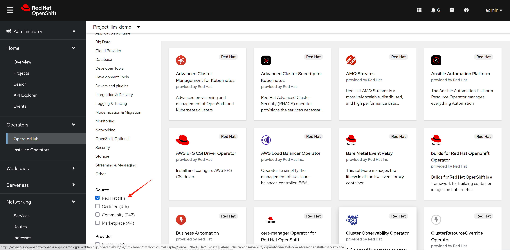

如果是certified 渠道发布的operator，红帽的官方策略是和合作伙伴做了不同层次的验证，证明这个operator能够顺利的部署了运行，但是如果更进一步，如果operator本身运行的时候，发生了什么问题，那么就需要合作伙伴来处理了。

对应到我们nginx operator，他还有2个版本，一个版本是oss，是开源社区的版本，一个是plus，是F5付费版本。如果在使用nginx operator的过程中，nginx operator本身出了问题，那么oss版本的nginx，只能客户运维自己找社区向办法，如果是plus版本的，需要找F5来支持。

总结一句话，certified operator，只是certified了能部署。

所以，部署certified operator这种第三方方案之前，要先了解清楚红帽的支持策略，提前做好准备。

视频讲解：

[<kbd></kbd>](https://www.bilibili.com/video/BV1uj421f7t3/)

- [bilibili](https://www.bilibili.com/video/BV1uj421f7t3/)
- [youtube](https://youtu.be/gacwUmCGIlI)

# nginx operator

我们先来装nginx operator，官方有文档，我们照着做。

- https://github.com/nginxinc/nginx-ingress-helm-operator
- https://github.com/nginxinc/nginx-ingress-helm-operator/blob/main/docs/openshift-installation.md

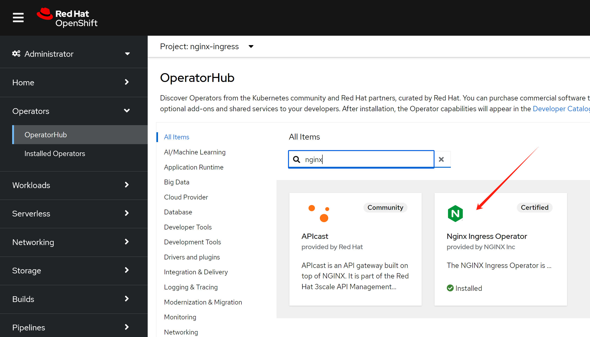


```bash

# 用operator hub来装nginx operator就可以。
# 然后需要加上权限(好像不用，以后试试，看创建controller instance的时候，有配置，创建rbac)

# https://github.com/nginxinc/nginx-ingress-helm-operator/blob/main/docs/openshift-installation.md
wget -O nginx.scc.yaml https://raw.githubusercontent.com/nginxinc/nginx-ingress-helm-operator/v2.1.2/resources/scc.yaml

oc apply -f nginx.scc.yaml
# securitycontextconstraints.security.openshift.io/nginx-ingress-admin created

```

然后创建一个ingress 实例

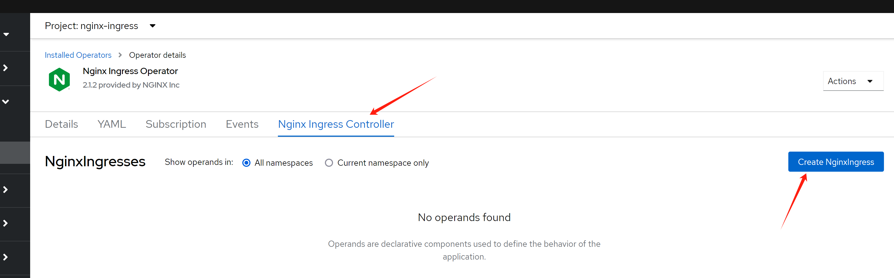

到此，我们分析一下我们都创建了什么，接下来我们要干什么

```bash

oc get NginxIngress -A
# NAMESPACE       NAME                  AGE
# nginx-ingress   nginxingress-sample   56m

# 首先，我们看看创建的pod
oc get pod -n nginx-ingress
# NAME                                                            READY   STATUS    RESTARTS   AGE
# nginx-ingress-operator-controller-manager-6d8cbd487d-4rp6m      2/2     Running   0          166m
# nginxingress-sample-nginx-ingress-controller-5ddd56f675-7g5k7   1/1     Running   0          53m

oc get pod/nginxingress-sample-nginx-ingress-controller-5ddd56f675-7g5k7 -o json -n nginx-ingress | jq .spec | grep -i host

# 结果是没有关于host的任何配置信息
# 说明，nginx是用很特别的方式，把流量引入自己身上的。

oc get svc -n nginx-ingress
# NAME                                                        TYPE           CLUSTER-IP      EXTERNAL-IP   PORT(S)                      AGE
# nginx-ingress-operator-controller-manager-metrics-service   ClusterIP      172.22.43.63    <none>        8443/TCP                     18h
# nginxingress-sample-nginx-ingress-controller                LoadBalancer   172.22.145.65   <pending>     80:32758/TCP,443:31566/TCP   55m

```

到这里，我们知道了，openshift/k8s 上面的nginx operator，需要依赖外部的load balancer来导入流量，如果是云服务的话，会自动对接，但是我们是baremetal的场景，那么就必须搞一个metalLB来充当这个load balancer了

- https://github.com/kubernetes/ingress-nginx/blob/main/docs/deploy/baremetal.md

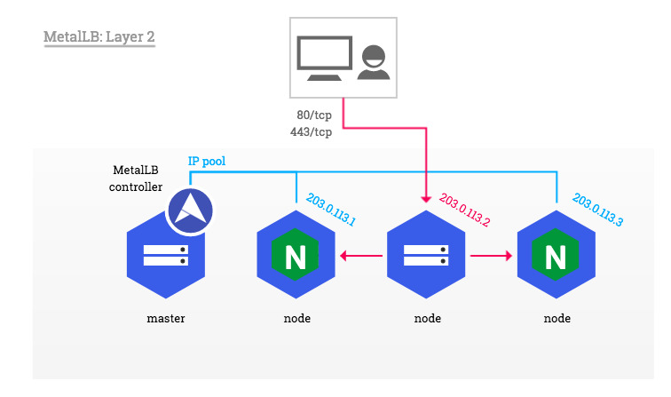

# metalLB

openshift 官方文档就有metalLB的手册，照着做就可以啦。

- https://docs.openshift.com/container-platform/4.14/networking/metallb/about-metallb.html

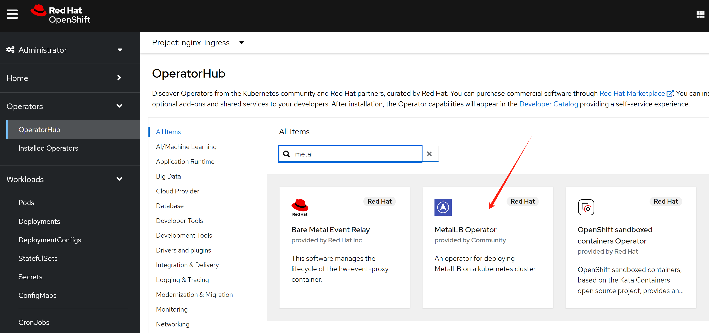

安装完毕以后，我们需要激活 MetalLB 

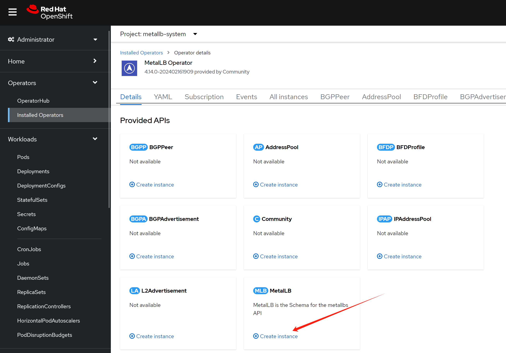

然后我们配置一个地址空间

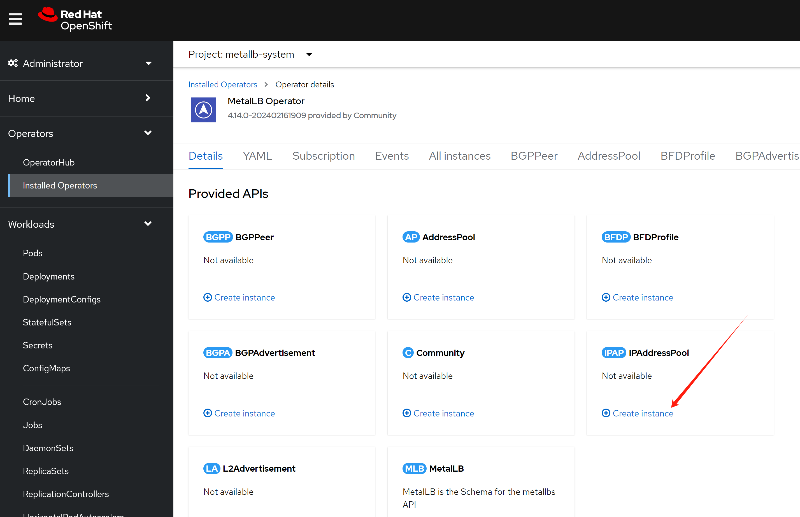

这个地址空间，我们不用自动分配，因为我们希望nginx使用固定ip地址，后面方便我们配置dns.

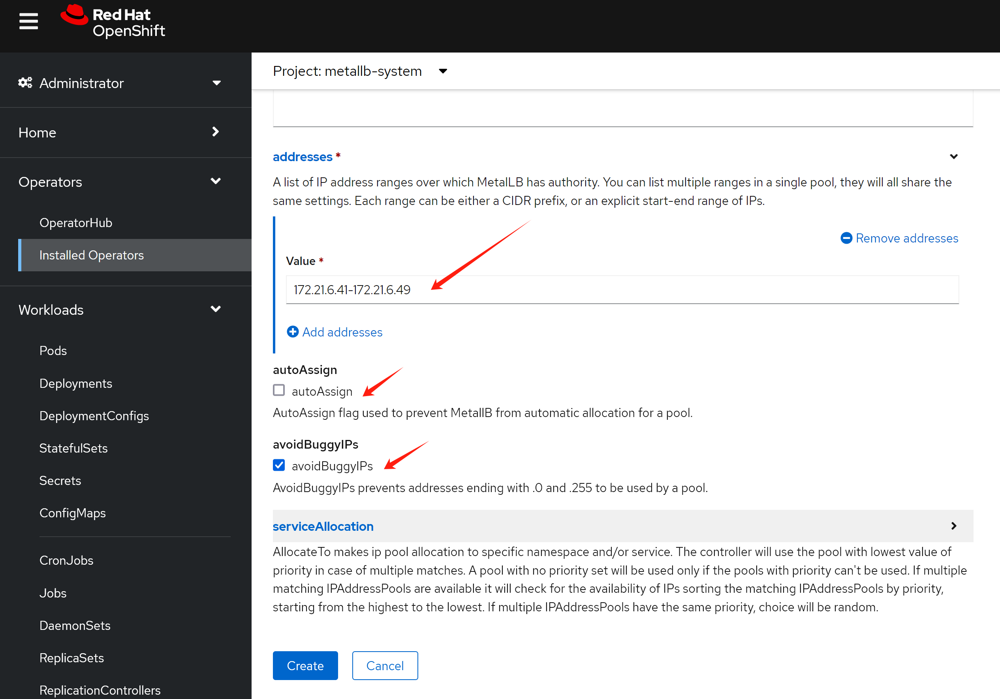

然后配置二层的地址广播，注意，在这里，我们有2个可选项，一个是bgp，一个是L2，bgp需要上游路由器支持，一般企业场景不太方便，我们一般用L2，但是这要保证各个节点之间二层可达。

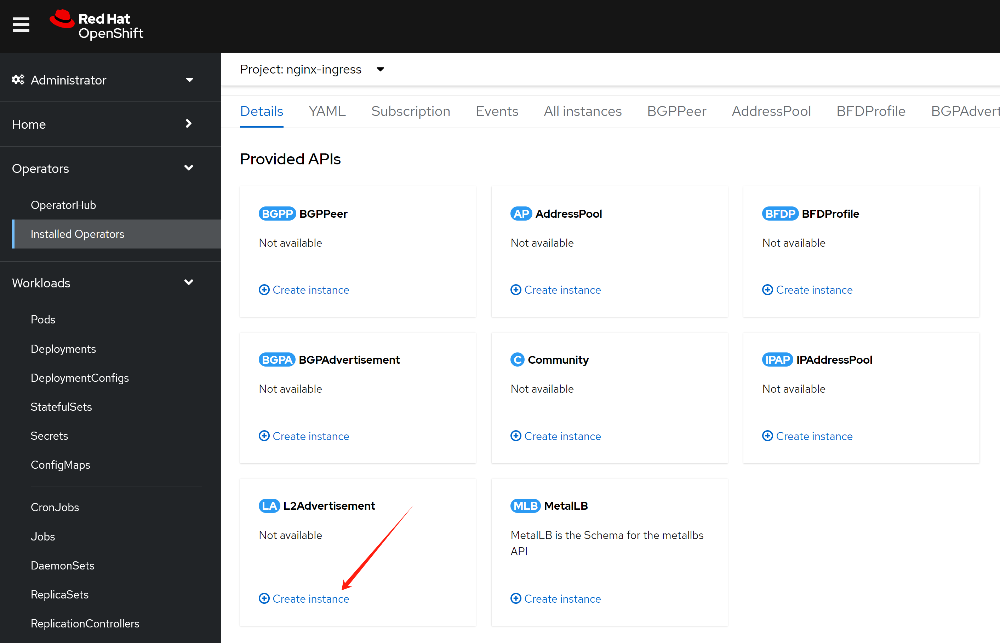

配置界面自动把之前的ip address pool给带出来了。

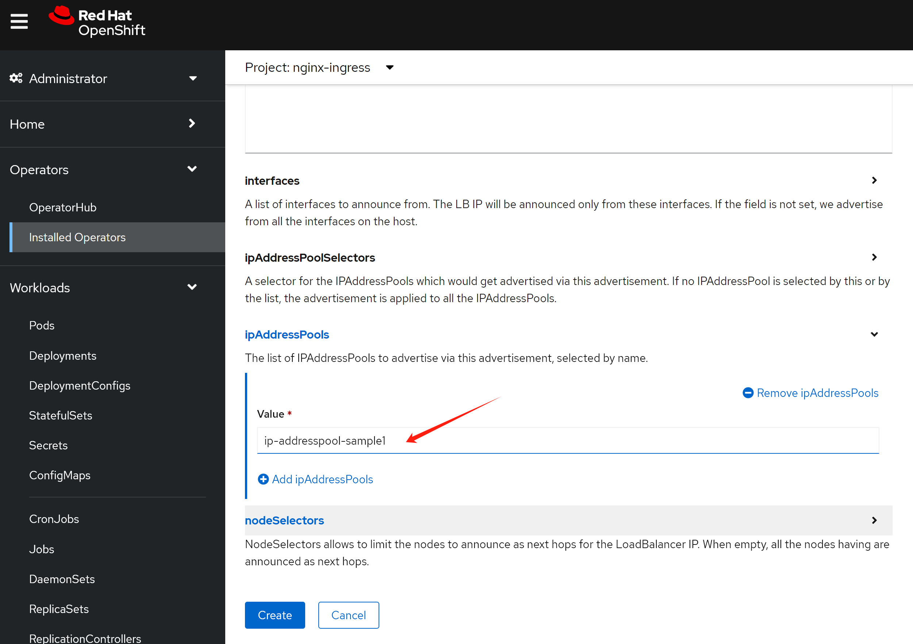

# nginx operator, continue

我们配置的metalLB是不能自动分配IP地址的，这是为了方便我们后面的dns配置，作者认为，在实际生产场景，应该也是不自动分配为好。

我们更新一下nginx的配置，让nginx向metalLB申请一个IP地址。

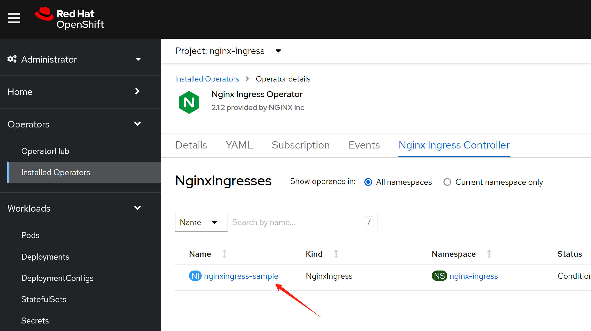

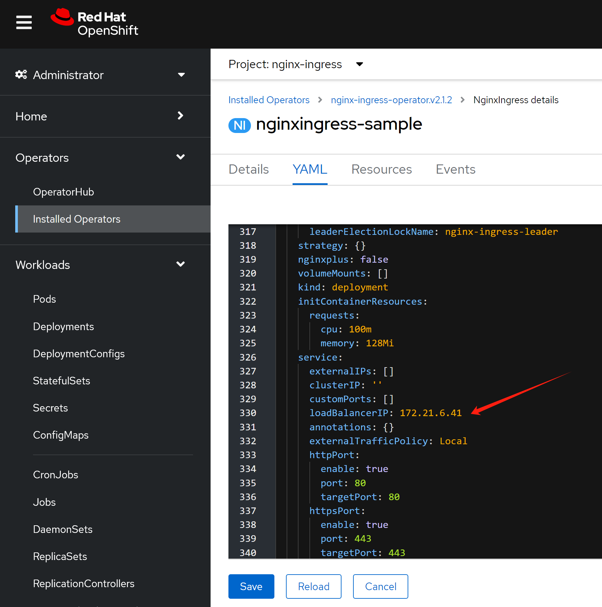

然后，我们就能看到nginx service对应了一个固定的对外IP地址啦。

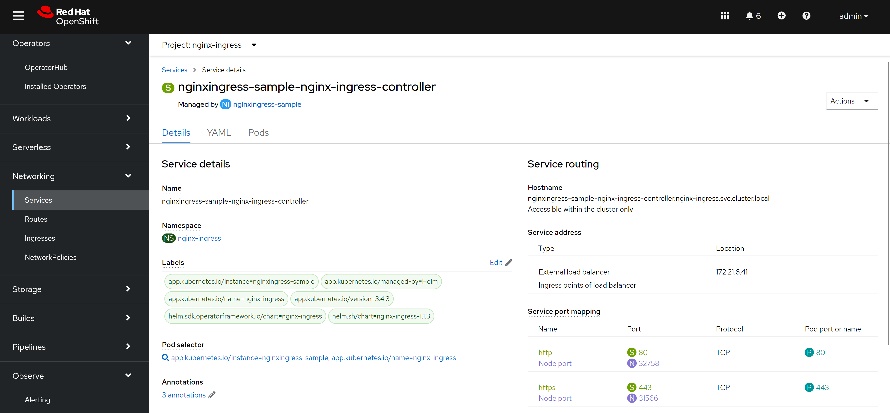


## 应用部署

好了，我们接下来就配置一个应用，看看效果吧。

注意，我们创建的ingress标准了ingress class，因为openshift里面默认有一个ingress的实现，是router/haproxy，所以我们需要告诉ingress用nginx来创建。

```bash

cat << EOF > ${BASE_DIR}/data/install/nginx-ingress.yaml
---
kind: Deployment
apiVersion: apps/v1
metadata:
  name: web-demo
  namespace: llm-demo
  labels:
    app: web-demo
    app.kubernetes.io/component: web-demo
    app.kubernetes.io/instance: web-demo
    app.kubernetes.io/name: web-demo
    app.kubernetes.io/part-of: web-demo
    app.openshift.io/runtime: nodejs
    app.openshift.io/runtime-namespace: llm-demo
spec:
  replicas: 1
  selector:
    matchLabels:
      app: web-demo
  template:
    metadata:
      labels:
        app: web-demo
        deployment: web-demo
    spec:
      containers:
        - name: web-demo
          image: quay.io/wangzheng422/qimgs:web-demo-v01
          ports:
            - containerPort: 8080
              protocol: TCP

---
kind: Service
apiVersion: v1
metadata:
  name: web-demo
  namespace: llm-demo
  labels:
    app: web-demo
    app.kubernetes.io/component: web-demo
    app.kubernetes.io/instance: web-demo
    app.kubernetes.io/name: web-demo
    app.kubernetes.io/part-of: web-demo
    app.openshift.io/runtime-version: web-demo-v01
spec:
  ports:
    - name: 8080-tcp
      protocol: TCP
      port: 8080
      targetPort: 8080
  selector:
    app: web-demo
    deployment: web-demo

---
apiVersion: networking.k8s.io/v1
kind: Ingress
metadata:
  name: ingress-demo-wzh
spec:
  rules:
  - host: nginx-demo.wzhlab.top
    http:
      paths:
      - path: /
        pathType: Prefix
        backend:
          service:
            name: web-demo
            port:
              number: 8080
  ingressClassName: nginx
EOF

oc create -f ${BASE_DIR}/data/install/nginx-ingress.yaml -n llm-demo

# oc delete -f ${BASE_DIR}/data/install/nginx-ingress.yaml -n llm-demo

```

goto to see the result:

http://nginx-demo.wzhlab.top/

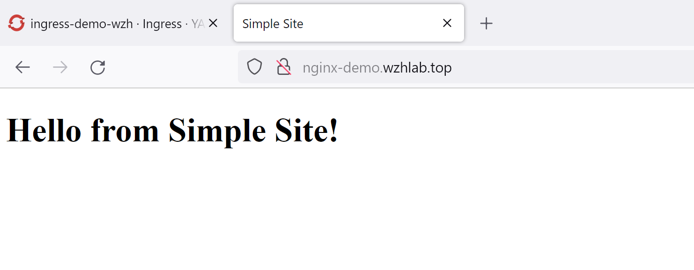

我们还能从界面上，看到一个新配置的ingress

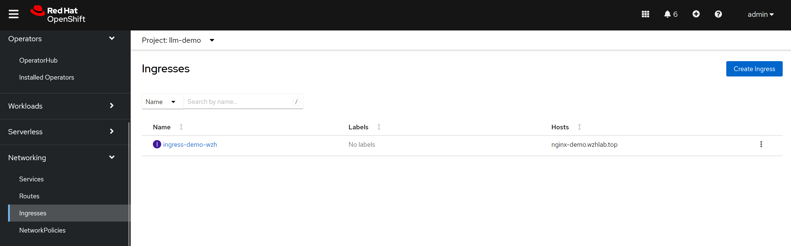

## 原理分析

我们分析一下metalLB的原理，以及和nginx互动的关系。

这里是逻辑关系图，看上去，网络包传递的路径比较复杂，先访问metalLB的对外IP，然后找到ovn loandbalancer代表的k8s service，然后访问service后面的nginx，再从nginx访问后端app pod。

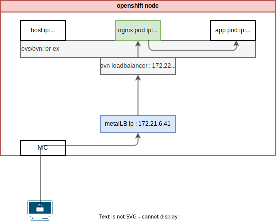

实际上，网络包只是经过了ovs/ovn的flow进行nat转换，然后就到了nginx pod上面，之后再访问后端app pod，所以传输路径并不复杂。

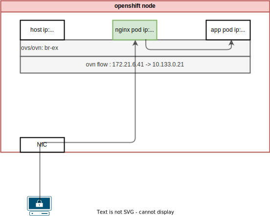

根据ovs官网的说法，ovs的hook是在iptables之前起作用的。

- https://docs.openvswitch.org/en/latest/faq/issues/

以下，我们就一步一步的在系统里面查看一下，相关的信息，验证我们的说法。

```bash
oc get svc -n nginx-ingress
# NAME                                                        TYPE           CLUSTER-IP      EXTERNAL-IP   PORT(S)                      AGE
# nginx-ingress-operator-controller-manager-metrics-service   ClusterIP      172.22.43.63    <none>        8443/TCP                     20h
# nginxingress-sample-nginx-ingress-controller                LoadBalancer   172.22.145.65   172.21.6.41   80:32758/TCP,443:31566/TCP   166m

# 我们探究一下metalLB原理。发现是nft里面有规则，做了DNAT

iptables -L -v -n -t nat
# Chain PREROUTING (policy ACCEPT 0 packets, 0 bytes)
#  pkts bytes target     prot opt in     out     source               destination
#  2037  125K OVN-KUBE-ETP  all  --  *      *       0.0.0.0/0            0.0.0.0/0
#  2037  125K OVN-KUBE-EXTERNALIP  all  --  *      *       0.0.0.0/0            0.0.0.0/0
#  2037  125K OVN-KUBE-NODEPORT  all  --  *      *       0.0.0.0/0            0.0.0.0/0

# Chain INPUT (policy ACCEPT 0 packets, 0 bytes)
#  pkts bytes target     prot opt in     out     source               destination

# Chain OUTPUT (policy ACCEPT 0 packets, 0 bytes)
#  pkts bytes target     prot opt in     out     source               destination
# 32647 1974K OVN-KUBE-EXTERNALIP  all  --  *      *       0.0.0.0/0            0.0.0.0/0
# 32647 1974K OVN-KUBE-NODEPORT  all  --  *      *       0.0.0.0/0            0.0.0.0/0
# 32647 1974K OVN-KUBE-ITP  all  --  *      *       0.0.0.0/0            0.0.0.0/0

# Chain POSTROUTING (policy ACCEPT 0 packets, 0 bytes)
#  pkts bytes target     prot opt in     out     source               destination
# 32647 1974K OVN-KUBE-EGRESS-IP-MULTI-NIC  all  --  *      *       0.0.0.0/0            0.0.0.0/0
# 32647 1974K OVN-KUBE-EGRESS-SVC  all  --  *      *       0.0.0.0/0            0.0.0.0/0
# 30580 1835K OVN-KUBE-SNAT-MGMTPORT  all  --  *      ovn-k8s-mp0  0.0.0.0/0            0.0.0.0/0

# Chain KUBE-KUBELET-CANARY (0 references)
#  pkts bytes target     prot opt in     out     source               destination

# Chain OVN-KUBE-EGRESS-IP-MULTI-NIC (1 references)
#  pkts bytes target     prot opt in     out     source               destination

# Chain OVN-KUBE-EGRESS-SVC (1 references)
#  pkts bytes target     prot opt in     out     source               destination
#     0     0 RETURN     all  --  *      *       0.0.0.0/0            0.0.0.0/0            mark match 0x3f0 /* DoNotSNAT */

# Chain OVN-KUBE-ETP (1 references)
#  pkts bytes target     prot opt in     out     source               destination
#     0     0 DNAT       tcp  --  *      *       0.0.0.0/0            172.21.6.41          tcp dpt:443 to:169.254.169.3:31566
#     0     0 DNAT       tcp  --  *      *       0.0.0.0/0            172.21.6.41          tcp dpt:80 to:169.254.169.3:32758

# Chain OVN-KUBE-EXTERNALIP (2 references)
#  pkts bytes target     prot opt in     out     source               destination
#     0     0 DNAT       tcp  --  *      *       0.0.0.0/0            172.21.6.41          tcp dpt:443 to:172.22.145.65:443
#     0     0 DNAT       tcp  --  *      *       0.0.0.0/0            172.21.6.41          tcp dpt:80 to:172.22.145.65:80

# Chain OVN-KUBE-ITP (1 references)
#  pkts bytes target     prot opt in     out     source               destination

# Chain OVN-KUBE-NODEPORT (2 references)
#  pkts bytes target     prot opt in     out     source               destination
#     0     0 DNAT       tcp  --  *      *       0.0.0.0/0            0.0.0.0/0            ADDRTYPE match dst-type LOCAL tcp dpt:31566 to:172.22.145.65:443
#     0     0 DNAT       tcp  --  *      *       0.0.0.0/0            0.0.0.0/0            ADDRTYPE match dst-type LOCAL tcp dpt:32758 to:172.22.145.65:80

# Chain OVN-KUBE-SNAT-MGMTPORT (1 references)
#  pkts bytes target     prot opt in     out     source               destination
#     0     0 RETURN     tcp  --  *      *       0.0.0.0/0            0.0.0.0/0            tcp dpt:31566
#     0     0 RETURN     tcp  --  *      *       0.0.0.0/0            0.0.0.0/0            tcp dpt:32758
# 30580 1835K SNAT       all  --  *      ovn-k8s-mp0  0.0.0.0/0            0.0.0.0/0            /* OVN SNAT to Management Port */ to:10.133.0.2

# 在worker/master node上，看路由表
# 从路由表可以看到，172.21.* 这个实验室物理机网段，走ovs/ovn br-ex
# service ip 网段 172.22.* 这个网段，也走ovs/ovn br-ex
ip r
# default via 172.21.6.254 dev br-ex proto static metric 48
# 10.132.0.0/23 dev ovn-k8s-mp0 proto kernel scope link src 10.132.0.2
# 10.132.0.0/14 via 10.132.0.1 dev ovn-k8s-mp0
# 169.254.169.0/29 dev br-ex proto kernel scope link src 169.254.169.2
# 169.254.169.1 dev br-ex src 172.21.6.23
# 169.254.169.3 via 10.132.0.1 dev ovn-k8s-mp0
# 172.21.6.0/24 dev br-ex proto kernel scope link src 172.21.6.23 metric 48
# 172.22.0.0/16 via 169.254.169.4 dev br-ex mtu 1400


# 经过nft以后，就进入ovn了，ovn里面定义了service，然后跑到了pod上面
oc get pod -n openshift-ovn-kubernetes -o wide
# NAME                                     READY   STATUS    RESTARTS   AGE   IP            NODE             NOMINATED NODE   READINESS GATES
# ovnkube-control-plane-7648b89f9c-xzk6c   2/2     Running   9          12d   172.21.6.23   master-01-demo   <none>           <none>
# ovnkube-node-4wgzd                       8/8     Running   32         12d   172.21.6.26   worker-01-demo   <none>           <none>
# ovnkube-node-n5q6b                       8/8     Running   39         12d   172.21.6.23   master-01-demo   <none>           <none>

VAR_POD='ovnkube-node-4wgzd'

oc exec -it ${VAR_POD} -c ovn-controller -n openshift-ovn-kubernetes -- ovn-nbctl list load-balancer | grep 172.22.145.65 -B 8
# _uuid               : 38b40eee-be68-496f-8fa0-1728709b97bc
# external_ids        : {"k8s.ovn.org/kind"=Service, "k8s.ovn.org/owner"="nginx-ingress/nginxingress-sample-nginx-ingress-controller"}
# health_check        : []
# ip_port_mappings    : {}
# name                : "Service_nginx-ingress/nginxingress-sample-nginx-ingress-controller_TCP_cluster"
# options             : {event="false", hairpin_snat_ip="169.254.169.5 fd69::5", neighbor_responder=none, reject="true", skip_snat="false"}
# protocol            : tcp
# selection_fields    : []
# vips                : {"172.22.145.65:443"="10.133.0.21:443", "172.22.145.65:80"="10.133.0.21:80"}

oc exec -it ${VAR_POD} -c ovn-controller -n openshift-ovn-kubernetes -- ovn-sbctl dump-flows | grep 172.21.6.41
  # table=5 (lr_in_defrag       ), priority=100  , match=(ip && ip4.dst == 172.21.6.41), action=(ct_dnat;)
  # table=7 (lr_in_dnat         ), priority=120  , match=(ct.new && !ct.rel && ip4 && ip4.dst == 172.21.6.41 && tcp && tcp.dst == 443), action=(flags.skip_snat_for_lb = 1; ct_lb_mark(backends=10.133.0.21:443; skip_snat);)
  # table=7 (lr_in_dnat         ), priority=120  , match=(ct.new && !ct.rel && ip4 && ip4.dst == 172.21.6.41 && tcp && tcp.dst == 80), action=(flags.skip_snat_for_lb = 1; ct_lb_mark(backends=10.133.0.21:80; skip_snat);)
  # table=6 (ls_in_pre_stateful ), priority=120  , match=(reg0[2] == 1 && ip4.dst == 172.21.6.41 && tcp.dst == 443), action=(reg1 = 172.21.6.41; reg2[0..15] = 443; ct_lb_mark;)
  # table=6 (ls_in_pre_stateful ), priority=120  , match=(reg0[2] == 1 && ip4.dst == 172.21.6.41 && tcp.dst == 80), action=(reg1 = 172.21.6.41; reg2[0..15] = 80; ct_lb_mark;)
  # table=13(ls_in_lb           ), priority=120  , match=(ct.new && ip4.dst == 172.21.6.41 && tcp.dst == 443), action=(reg0[1] = 0; ct_lb_mark(backends=10.133.0.21:443);)
  # table=13(ls_in_lb           ), priority=120  , match=(ct.new && ip4.dst == 172.21.6.41 && tcp.dst == 80), action=(reg0[1] = 0; ct_lb_mark(backends=10.133.0.21:80);)


oc exec -it ${VAR_POD} -c ovn-controller -n openshift-ovn-kubernetes -- ovn-sbctl dump-flows | grep 172.22.145.65
  # table=5 (lr_in_defrag       ), priority=100  , match=(ip && ip4.dst == 172.22.145.65), action=(ct_dnat;)
  # table=7 (lr_in_dnat         ), priority=120  , match=(ct.new && !ct.rel && ip4 && ip4.dst == 172.22.145.65 && tcp && tcp.dst == 443), action=(flags.force_snat_for_lb = 1; ct_lb_mark(backends=10.133.0.21:443; force_snat);)
  # table=7 (lr_in_dnat         ), priority=120  , match=(ct.new && !ct.rel && ip4 && ip4.dst == 172.22.145.65 && tcp && tcp.dst == 80), action=(flags.force_snat_for_lb = 1; ct_lb_mark(backends=10.133.0.21:80; force_snat);)
  # table=6 (ls_in_pre_stateful ), priority=120  , match=(reg0[2] == 1 && ip4.dst == 172.22.145.65 && tcp.dst == 443), action=(reg1 = 172.22.145.65; reg2[0..15] = 443; ct_lb_mark;)
  # table=6 (ls_in_pre_stateful ), priority=120  , match=(reg0[2] == 1 && ip4.dst == 172.22.145.65 && tcp.dst == 80), action=(reg1 = 172.22.145.65; reg2[0..15] = 80; ct_lb_mark;)
  # table=13(ls_in_lb           ), priority=120  , match=(ct.new && ip4.dst == 172.22.145.65 && tcp.dst == 443), action=(reg0[1] = 0; ct_lb_mark(backends=10.133.0.21:443);)
  # table=13(ls_in_lb           ), priority=120  , match=(ct.new && ip4.dst == 172.22.145.65 && tcp.dst == 80), action=(reg0[1] = 0; ct_lb_mark(backends=10.133.0.21:80);)


# try below if needed
# ovs-appctl dpctl/dump-flows -m

oc get ep -A | grep 10.133.0.21
# nginx-ingress                                      nginxingress-sample-nginx-ingress-controller                10.133.0.21:443,10.133.0.21:80                                      6h55m


# on master/worker node
# 我们可以之间访问nginx service ip，甚至是metalLB对应申请的ip，
# nginx都返回404，因为只有用域名，才能正确找到后端服务pod
curl 172.22.145.65
# <html>
# <head><title>404 Not Found</title></head>
# <body>
# <center><h1>404 Not Found</h1></center>
# <hr><center>nginx/1.25.4</center>
# </body>
# </html>

curl 172.21.6.41
# <html>
# <head><title>404 Not Found</title></head>
# <body>
# <center><h1>404 Not Found</h1></center>
# <hr><center>nginx/1.25.4</center>
# </body>
# </html>

oc get pod -n nginx-ingress
# NAME                                                            READY   STATUS    RESTARTS   AGE
# nginx-ingress-operator-controller-manager-6d8cbd487d-4rp6m      2/2     Running   0          8h
# nginxingress-sample-nginx-ingress-controller-5ddd56f675-7g5k7   1/1     Running   0          7h2m


VAR_POD='nginxingress-sample-nginx-ingress-controller-5ddd56f675-7g5k7'

oc exec -it ${VAR_POD} -n nginx-ingress  -- ls /etc/nginx/conf.d
# llm-demo-ingress-demo-wzh.conf

oc exec -it ${VAR_POD} -n nginx-ingress  -- cat /etc/nginx/conf.d/llm-demo-ingress-demo-wzh.conf
# # configuration for llm-demo/ingress-demo-wzh
# upstream llm-demo-ingress-demo-wzh-nginx-demo.wzhlab.top-web-demo-8080 {zone llm-demo-ingress-demo-wzh-nginx-demo.wzhlab.top-web-demo-8080 256k;random two least_conn;
#         server 10.133.0.56:8080 max_fails=1 fail_timeout=10s max_conns=0;
# }

# server {
#         listen 80;listen [::]:80;

#         server_tokens on;

#         server_name nginx-demo.wzhlab.top;

#         set $resource_type "ingress";
#         set $resource_name "ingress-demo-wzh";
#         set $resource_namespace "llm-demo";
#         location / {
#                 set $service "web-demo";
#                 proxy_http_version 1.1;

#                 proxy_connect_timeout 60s;
#                 proxy_read_timeout 60s;
#                 proxy_send_timeout 60s;
#                 client_max_body_size 1m;
#                 proxy_set_header Host $host;
#                 proxy_set_header X-Real-IP $remote_addr;
#                 proxy_set_header X-Forwarded-For $proxy_add_x_forwarded_for;
#                 proxy_set_header X-Forwarded-Host $host;
#                 proxy_set_header X-Forwarded-Port $server_port;
#                 proxy_set_header X-Forwarded-Proto $scheme;
#                 proxy_buffering on;
#                 proxy_pass http://llm-demo-ingress-demo-wzh-nginx-demo.wzhlab.top-web-demo-8080;
#         }

# }

oc get ep -A | grep 10.133.0.56
# llm-demo                                           web-demo                                                    10.133.0.56:8080                                                    55m

oc get pod -n llm-demo -o wide
# NAME                        READY   STATUS    RESTARTS   AGE   IP            NODE             NOMINATED NODE   READINESS GATES
# web-demo-755c9b6f47-xh8b8   1/1     Running   0          55m   10.133.0.56   worker-01-demo   <none>           <none>

```

# end