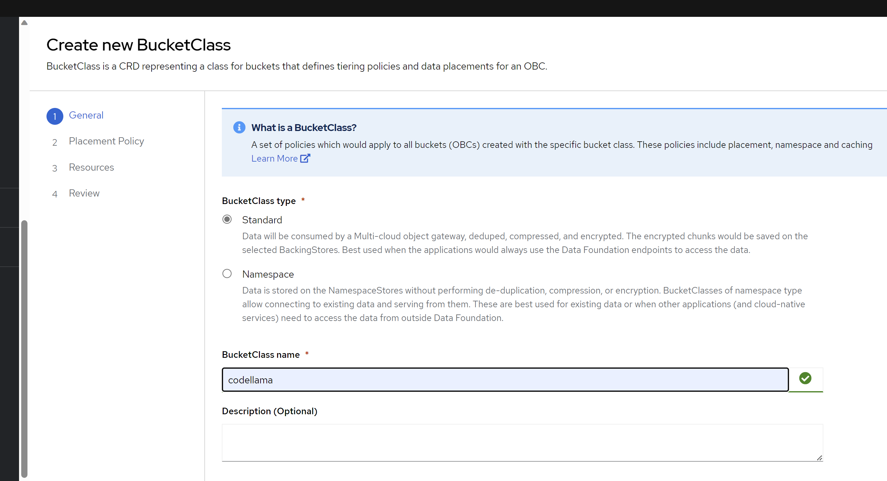

# install odf with multi-cloud object gateway

- https://access.redhat.com/documentation/en-us/red_hat_openshift_data_foundation/4.14/html/managing_hybrid_and_multicloud_resources/adding-storage-resources-for-hybrid-or-multicloud_rhodf

最后，震惊的发现，noobaa干的事情，就是自己做proxy，然后把s3访问的环境变量注入deployment，就完事了，pod里面没有volumn mount，就是一个环境变量，然后让应用自己去访问。。。这。。。
