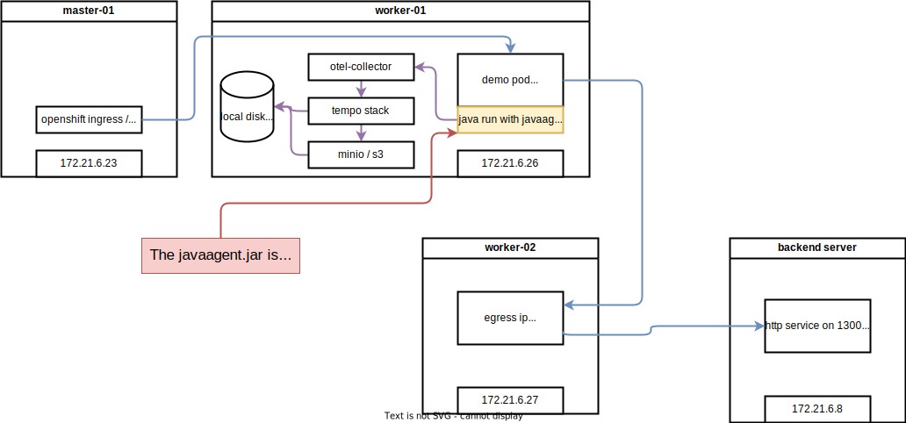

# OpenTelementry

OpenShift has various tracing features, one of which is based on OpenTelemetry. From an upstream perspective, OpenTelemetry is a server and client architecture, with the server called the collector and the client called instrumentation. The collector is responsible for receiving data from the client and then exporting it to backends such as Tempo, Jaeger, Zipkin, etc. The instrumentation is responsible for collecting data from the application and then sending it to the collector.

For instrumentation, OpenTelemetry provides support for various languages, including Java, Python, Go, etc. One form of instrumentation is as a static library, which is statically linked to your program. Another form is as an agent; for Java, the agent is based on Java bytecode. When you start Java, you can add the agent to the command line or via an environment variable to start the agent. The agent will then collect data and send it to the collector.

For OpenShift's integration with OpenTelemetry, the recommended approach is to use the auto-injection method, which sets environment variables and starts the Java application. In this manner, the application will be automatically instrumented and send data to the collector without requiring any application code changes.

Here is the arch of this lab:



🚨🚨🚨 Please notes, openshift only support the auto-inject behavior (it is in TP, but can be moved to GA at anytime with customer requirement), [but not the agent.jar liberary](https://redhat-internal.slack.com/archives/C04TFRRKUA2/p1712929982692699?thread_ts=1712890334.424789&cid=C04TFRRKUA2).

# try on rhel

We will try 2 example on rhel, on is manual inject, and the other is auto inject.

## manual inject

Upstream opentelementry project has a example repo, which contains different ways to use opentelementry in java application. We use the javaagent example to try on rhel. So that we can get a deeper understanding of how opentelementry works.

- https://github.com/open-telemetry/opentelemetry-java-instrumentation
- https://github.com/wangzheng422/opentelemetry-java-examples


### build the container image

```bash

# on vultr
# dnf install -y /usr/bin/javac

dnf install -y java-latest-openjdk-devel java-1.8.0-openjdk-devel

dnf install -y /usr/bin/podman-compose

yum-config-manager --add-repo https://download.docker.com/linux/centos/docker-ce.repo

yum install -y docker-ce docker-ce-cli containerd.io docker-buildx-plugin docker-compose-plugin

systemctl enable --now docker

mkdir -p /data
cd /data

git clone https://github.com/wangzheng422/opentelemetry-java-examples

cd /data/opentelemetry-java-examples/javaagent

git checkout wzh-2024-04-14

# ../gradlew --no-build-cache --no-configuration-cache bootJar
../gradlew bootJar

```

### start up the container

the upstream demo, consist a sample java app, will accept http call at /ping, and send http request to backend. During the process, it will log some message, and we will use opentelementry to collect the log and trace.

```bash
# custom the docker-compose.yml
# change WZH_URL as you need

# start java app and collector locally
docker compose up --build

# call the rest api
curl http://localhost:8080/ping
# pong


# to stop
docker compose down

```

and you get output from docker collector

```bash

app-1        | 2024-04-14 11:55:00.849  INFO 7 --- [nio-8080-exec-1] o.a.c.c.C.[Tomcat].[localhost].[/]       : Initializing Spring DispatcherServlet 'dispatcherServlet'
app-1        | 2024-04-14 11:55:00.849  INFO 7 --- [nio-8080-exec-1] o.s.web.servlet.DispatcherServlet        : Initializing Servlet 'dispatcherServlet'
app-1        | 2024-04-14 11:55:00.852  INFO 7 --- [nio-8080-exec-1] o.s.web.servlet.DispatcherServlet        : Completed initialization in 2 ms
app-1        | 2024-04-14 11:55:00.970  INFO 7 --- [nio-8080-exec-1] i.o.example.javagent.Controller          : A sample log message!
app-1        | 2024-04-14 11:55:01.015  INFO 7 --- [nio-8080-exec-1] i.o.example.javagent.Controller          : HTTP GET response code: 200
collector-1  | 2024-04-14T11:55:01.852Z info    LogsExporter    {"kind": "exporter", "data_type": "logs", "name": "logging", "resource logs": 1, "log records": 5}
collector-1  | 2024-04-14T11:55:01.852Z info    ResourceLog #0
collector-1  | Resource SchemaURL: https://opentelemetry.io/schemas/1.23.1
collector-1  | Resource attributes:
collector-1  |      -> container.id: Str(cbb2f2612bf4baa128425aeaa6bdebfdc4cd4a7755d744fe7d55e446e351ec42)
collector-1  |      -> host.arch: Str(amd64)
collector-1  |      -> host.name: Str(cbb2f2612bf4)
collector-1  |      -> os.description: Str(Linux 5.14.0-362.24.1.el9_3.0.1.x86_64)
collector-1  |      -> os.type: Str(linux)
collector-1  |      -> process.command_args: Slice(["/opt/java/openjdk/bin/java","-jar","-javaagent:/opentelemetry-javaagent.jar","/app.jar"])
collector-1  |      -> process.executable.path: Str(/opt/java/openjdk/bin/java)
collector-1  |      -> process.pid: Int(7)
collector-1  |      -> process.runtime.description: Str(Eclipse Adoptium OpenJDK 64-Bit Server VM 11.0.22+7)
collector-1  |      -> process.runtime.name: Str(OpenJDK Runtime Environment)
collector-1  |      -> process.runtime.version: Str(11.0.22+7)
collector-1  |      -> service.name: Str(agent-example-app)
collector-1  |      -> telemetry.distro.name: Str(opentelemetry-java-instrumentation)
collector-1  |      -> telemetry.distro.version: Str(2.2.0)
collector-1  |      -> telemetry.sdk.language: Str(java)
collector-1  |      -> telemetry.sdk.name: Str(opentelemetry)
collector-1  |      -> telemetry.sdk.version: Str(1.36.0)
collector-1  | ScopeLogs #0
collector-1  | ScopeLogs SchemaURL:
collector-1  | InstrumentationScope org.apache.catalina.core.ContainerBase.[Tomcat].[localhost].[/]
collector-1  | LogRecord #0
collector-1  | ObservedTimestamp: 2024-04-14 11:55:00.849241 +0000 UTC
collector-1  | Timestamp: 2024-04-14 11:55:00.849 +0000 UTC
collector-1  | SeverityText: INFO
collector-1  | SeverityNumber: Info(9)
collector-1  | Body: Str(Initializing Spring DispatcherServlet 'dispatcherServlet')
collector-1  | Trace ID: 06398ab7d16b31a55a6c13c60ff70097
collector-1  | Span ID: 07fca14f554f38e0
collector-1  | Flags: 1
collector-1  | ScopeLogs #1
collector-1  | ScopeLogs SchemaURL:
collector-1  | InstrumentationScope io.opentelemetry.example.javagent.Controller
collector-1  | LogRecord #0
collector-1  | ObservedTimestamp: 2024-04-14 11:55:00.96997 +0000 UTC
collector-1  | Timestamp: 2024-04-14 11:55:00.969938 +0000 UTC
collector-1  | SeverityText: INFO
collector-1  | SeverityNumber: Info(9)
collector-1  | Body: Str(A sample log message!)
collector-1  | Trace ID: 06398ab7d16b31a55a6c13c60ff70097
collector-1  | Span ID: f898abd16b7838df
collector-1  | Flags: 1
collector-1  | LogRecord #1
collector-1  | ObservedTimestamp: 2024-04-14 11:55:01.015935 +0000 UTC
collector-1  | Timestamp: 2024-04-14 11:55:01.015929 +0000 UTC
collector-1  | SeverityText: INFO
collector-1  | SeverityNumber: Info(9)
collector-1  | Body: Str(HTTP GET response code: 200)
collector-1  | Trace ID: 06398ab7d16b31a55a6c13c60ff70097
collector-1  | Span ID: 40a30fac2479b7b4
collector-1  | Flags: 1
collector-1  | ScopeLogs #2
collector-1  | ScopeLogs SchemaURL:
collector-1  | InstrumentationScope org.springframework.web.servlet.DispatcherServlet
collector-1  | LogRecord #0
collector-1  | ObservedTimestamp: 2024-04-14 11:55:00.849922 +0000 UTC
collector-1  | Timestamp: 2024-04-14 11:55:00.849 +0000 UTC
collector-1  | SeverityText: INFO
collector-1  | SeverityNumber: Info(9)
collector-1  | Body: Str(Initializing Servlet 'dispatcherServlet')
collector-1  | Trace ID: 06398ab7d16b31a55a6c13c60ff70097
collector-1  | Span ID: 07fca14f554f38e0
collector-1  | Flags: 1
collector-1  | LogRecord #1
collector-1  | ObservedTimestamp: 2024-04-14 11:55:00.852566 +0000 UTC
collector-1  | Timestamp: 2024-04-14 11:55:00.852 +0000 UTC
collector-1  | SeverityText: INFO
collector-1  | SeverityNumber: Info(9)
collector-1  | Body: Str(Completed initialization in 2 ms)
collector-1  | Trace ID: 06398ab7d16b31a55a6c13c60ff70097
collector-1  | Span ID: 07fca14f554f38e0
collector-1  | Flags: 1
collector-1  |  {"kind": "exporter", "data_type": "logs", "name": "logging"}

```

So, we can see the log message is collected by opentelementry, and send to collector. From the docker file, we can see the java program start with javaagent parameter
```dockerfile
ENTRYPOINT java -jar -javaagent:/opentelemetry-javaagent.jar /app.jar
```

we can see the metric is manually setting by [the java program](https://github.com/wangzheng422/opentelemetry-java-examples/blob/wzh-2024-04-14/javaagent/src/main/java/io/opentelemetry/example/javagent/Controller.java), and send to collector
```java
private void doWork(int sleepTime) throws InterruptedException, IOException {
    Span span = tracer.spanBuilder("doWork").startSpan();
    try (Scope ignored = span.makeCurrent()) {
      Thread.sleep(sleepTime);
```

### save the image

we save the container image, for later use/demo

```bash

# save the image

docker tag javaagent-app quay.io/wangzheng422/qimgs:javaagent-app-2024.04.14

docker push quay.io/wangzheng422/qimgs:javaagent-app-2024.04.14


```

## auto inject

We will use a very simple java project, which will accept at /setRequest, and call backend service, and reture. The project will not depend on any lib from opentelementry and javaagent.

During start up, will will run with javaagent cmdline parameter.

- https://github.com/wangzheng422/simple-java-http-server

run the demo app

```bash

# checkout
mkdir -p /data
cd /data

git clone https://github.com/wangzheng422/simple-java-http-server

cd /data/simple-java-http-server

# customize docker-compose.yml
# change WZH_URL as you need

# run with javaagent and collector, to see the result locally
podman-compose up --build

# on localhost, call the rest api to test
curl -vvv http://localhost:8080/sendRequest

```

The output is almost the same with manual inject. So you can see that the java code is not changed, but the opentelementry is able to collect the log and trace.

# install and configure tempo

To this point, we will try to install opentelementry on ocp, the first step is to configure the storage for opentelementry, we wil use tempo, this is the recommend storage solution from redhat.

## create minio as S3

To configure tempo storage, it depends on S3, so we will create a minio as S3.

```bash

oc new-project observability

# on helper
S3_NAME='observability'
S3_NS='observability'
S3_IMAGE='docker.io/minio/minio:RELEASE.2021-06-17T00-10-46Z.hotfix.35a0912ff'

cat << EOF > ${BASE_DIR}/data/install/s3-codellama.yaml
---
apiVersion: v1
kind: Service
metadata:
  name: minio-${S3_NAME}
spec:
  ports:
    - name: minio-client-port
      port: 9000
      protocol: TCP
      targetPort: 9000
  selector:
    app: minio-${S3_NAME}

---
apiVersion: route.openshift.io/v1
kind: Route
metadata:
  name: s3-${S3_NAME}
spec:
  to:
    kind: Service
    name: minio-${S3_NAME}
  port:
    targetPort: 9000

---
apiVersion: v1
kind: PersistentVolumeClaim
metadata:
  name: minio-${S3_NAME}-pvc
spec:
  accessModes:
    - ReadWriteOnce
  resources:
    requests:
      storage: 100Gi
  storageClassName: hostpath-csi

---
apiVersion: apps/v1
kind: Deployment
metadata:
  name: minio-${S3_NAME}
  labels:
    app: minio-${S3_NAME}
spec:
  replicas: 1
  selector:
    matchLabels:
      app: minio-${S3_NAME}
  template:
    metadata:
      labels:
        app: minio-${S3_NAME}
    spec:
      initContainers:
        - name: create-demo-dir
          image: docker.io/busybox
          command: ["mkdir", "-p", "/data1/demo"]
          volumeMounts:
            - name: data
              mountPath: "/data1"
      containers:
        - args:
            - server
            - /data1
          env:
            - name: MINIO_ACCESS_KEY
              value:  admin
            - name: MINIO_SECRET_KEY
              value: redhatocp
          image: ${S3_IMAGE}
          imagePullPolicy: IfNotPresent
          name: minio
          nodeSelector:
            kubernetes.io/hostname: "worker-01-demo"
          securityContext:
            allowPrivilegeEscalation: false
            capabilities:
                drop:
                - ALL
            runAsNonRoot: true
            seccompProfile:
                type: RuntimeDefault
          volumeMounts:
            - mountPath: "/data1"
              name: data
      volumes:
        - name: data 
          persistentVolumeClaim:
            claimName: minio-${S3_NAME}-pvc

EOF

oc create -n observability -f ${BASE_DIR}/data/install/s3-codellama.yaml


```

## install tempo operator and configure

The next step, is to install temp operator from ocp operator hub, just following the offical document.

- https://docs.openshift.com/container-platform/4.14/observability/distr_tracing/distr_tracing_tempo/distr-tracing-tempo-installing.html


```bash

S3_NAME='observability'

cat << EOF > ${BASE_DIR}/data/install/tempo-codellama.yaml
---
apiVersion: v1
kind: Secret
metadata:
  name: minio-${S3_NAME}-s3
stringData:
  access_key_id: admin
  access_key_secret: redhatocp
  bucket: demo
  endpoint: http://minio-${S3_NAME}.${S3_NAME}.svc.cluster.local:9000
  # region: eu-central-1

---

apiVersion: tempo.grafana.com/v1alpha1
kind: TempoStack
metadata:
  name: simplest
spec:
  storageSize: 10Gi
  storage: 
    secret:
      name: minio-${S3_NAME}-s3
      type: s3
  # resources:
  #   total:
  #     limits:
  #       memory: 2Gi
  #       cpu: 2000m
  template:
    queryFrontend:
      jaegerQuery: 
        enabled: true
        monitorTab:
          enabled: true 
          prometheusEndpoint: https://thanos-querier.openshift-monitoring.svc.cluster.local:9091 
        ingress:
          # route:
          #   termination: edge
          type: route

EOF

oc create --save-config -n observability -f ${BASE_DIR}/data/install/tempo-codellama.yaml

# oc delete -n observability -f ${BASE_DIR}/data/install/tempo-codellama.yaml


```

# install opentelementry

We have tempo storage in place, next, we will install the opentelementry, select from operator hub, and install with default parameter


configure a collector, with configure from offical docs
- https://docs.openshift.com/container-platform/4.14/observability/otel/otel-installing.html


the default configue used in install doc, and with modification by author. create below in project observability

## enable monitoring for user project

We need to see span metrics, this requires to enable user workload monitoring.

- https://docs.openshift.com/container-platform/4.14/observability/monitoring/enabling-monitoring-for-user-defined-projects.html

```bash

oc -n openshift-monitoring edit configmap cluster-monitoring-config


apiVersion: v1
kind: ConfigMap
metadata:
  name: cluster-monitoring-config
  namespace: openshift-monitoring
data:
  config.yaml: |
    enableUserWorkload: true

```

## config telementry

following offical document, add telementry config.

```bash

# https://docs.openshift.com/container-platform/4.14/observability/otel/otel-forwarding.html
# add some modification

S3_NAME='observability'

cat << EOF > ${BASE_DIR}/data/install/otel-collector-codellama.yaml
---
apiVersion: v1
kind: ServiceAccount
metadata:
  name: otel-collector-deployment

---
apiVersion: rbac.authorization.k8s.io/v1
kind: ClusterRole
metadata:
  name: otel-collector
rules:
- apiGroups: ["", "config.openshift.io", "apps"]
  resources: ["pods", "namespaces", "infrastructures", "infrastructures/status", "replicasets"]
  verbs: ["get", "watch", "list"]

---
apiVersion: rbac.authorization.k8s.io/v1
kind: ClusterRoleBinding
metadata:
  name: otel-collector
subjects:
- kind: ServiceAccount
  name: otel-collector-deployment
  namespace: $S3_NAME
roleRef:
  kind: ClusterRole
  name: otel-collector
  apiGroup: rbac.authorization.k8s.io

EOF

oc create --save-config -n observability -f ${BASE_DIR}/data/install/otel-collector-codellama.yaml

# oc delete -n observability -f ${BASE_DIR}/data/install/otel-collector-codellama.yaml


cat << EOF > ${BASE_DIR}/data/install/otel-codellama.yaml
apiVersion: opentelemetry.io/v1alpha1
kind: OpenTelemetryCollector
metadata:
  name: otel
spec:
  mode: deployment
  serviceAccount: otel-collector-deployment
  observability:
    metrics:
      enableMetrics: true
  config: |
    connectors:
      spanmetrics:  
        metrics_flush_interval: 15s

    receivers:
      otlp:
        protocols:
          grpc:
          http:
      jaeger:
        protocols:
          grpc:
          thrift_binary:
          thrift_compact:
          thrift_http:
      zipkin:
      opencensus:
    processors:
      batch:
      memory_limiter:
        check_interval: 1s
        limit_percentage: 50
        spike_limit_percentage: 30
      k8sattributes:
      resourcedetection:
        detectors: [openshift]
    exporters:
      prometheus: 
        endpoint: 0.0.0.0:8889
        add_metric_suffixes: false
        resource_to_telemetry_conversion:
          enabled: true # by default resource attributes are dropped

      otlp:
        endpoint: "tempo-simplest-distributor.observability.svc.cluster.local:4317"
        tls:
          insecure: true
      
      logging:

    service:
      telemetry:
        metrics:
          address: ":8888"
      pipelines:
        traces:
          receivers: [otlp,opencensus,jaeger,zipkin]
          processors: [memory_limiter, k8sattributes, resourcedetection, batch]
          exporters: [otlp, spanmetrics,logging]
        metrics:
          receivers: [otlp,spanmetrics]
          processors: []
          exporters: [prometheus,logging]


EOF

oc create --save-config -n observability -f ${BASE_DIR}/data/install/otel-codellama.yaml

# oc delete -n observability -f ${BASE_DIR}/data/install/otel-codellama.yaml

```

# try it out with demo app

Remember the two java app we used to test on rhel? We will use them again, to deploy them on ocp, to see how to export the trace and log to opentelementry.

## manual inject

We use the upstream example project to demo manual export.

- https://github.com/wangzheng422/opentelemetry-java-examples

### deploy to ocp

Manual export means we should set the env variable by ourself, and start the java app with javaagent parameter.

```bash

# go back to helper
# create a dummy pod
cat << EOF > ${BASE_DIR}/data/install/demo1.yaml
---
apiVersion: v1
kind: Service
metadata:
  name: wzh-demo-service
spec:
  ports:
    - name: service-port
      port: 80
      protocol: TCP
      targetPort: 8080
  selector:
    app: wzh-demo-pod

---
apiVersion: route.openshift.io/v1
kind: Route
metadata:
  name: wzh-demo
spec:
  to:
    kind: Service
    name: wzh-demo-service
  port:
    targetPort: service-port

---
kind: Pod
apiVersion: v1
metadata:
  name: wzh-demo-pod
  labels:
    app: wzh-demo-pod
spec:
  nodeSelector:
    kubernetes.io/hostname: 'worker-01-demo'
  restartPolicy: Always
  containers:
    - name: demo1
      image: >- 
        quay.io/wangzheng422/qimgs:javaagent-app-2024.04.14
      env:
        - name: OTEL_SERVICE_NAME
          value: "agent-example-app"
        - name: OTEL_EXPORTER_OTLP_ENDPOINT
          value: "http://otel-collector.observability.svc.cluster.local:4318"
        - name: OTEL_LOGS_EXPORTER
          value: "otlp"
        - name: WZH_URL
          value: "http://172.21.6.8:13000"
      # command: [ "/bin/bash", "-c", "--" ]
      # args: [ "tail -f /dev/null" ]
      # imagePullPolicy: Always

---
kind: Pod
apiVersion: v1
metadata:
  name: wzh-demo-util
spec:
  nodeSelector:
    kubernetes.io/hostname: 'worker-01-demo'
  restartPolicy: Always
  containers:
    - name: demo1
      image: >- 
        quay.io/wangzheng422/qimgs:rocky9-test
      env:
        - name: key
          value: value
      command: [ "/bin/bash", "-c", "--" ]
      args: [ "tail -f /dev/null" ]
      # imagePullPolicy: Always
EOF

oc create -n llm-demo -f ${BASE_DIR}/data/install/demo1.yaml

# oc delete -n llm-demo -f ${BASE_DIR}/data/install/demo1.yaml

# while true; do
#   oc exec -it -n llm-demo wzh-demo-util -- curl http://wzh-demo-service/ping
#   sleep 1
# done

while true; do
  curl -s http://wzh-demo-llm-demo.apps.demo-gpu.wzhlab.top/ping
  sleep 1
done

```

From the UI, you can see the RTT to the backend.

- https://tempo-simplest-query-frontend-observability.apps.demo-gpu.wzhlab.top/search


## auto inject

In above example, the env variable is set manually, in next example, we will set the env variable automatically, by using the auto-inject feature from opentelementry.

```bash

cat << EOF > ${BASE_DIR}/data/install/java-instrumentation-codellama.yaml
apiVersion: opentelemetry.io/v1alpha1
kind: Instrumentation
metadata:
  name: java-instrumentation
spec:
  env:
    - name: OTEL_EXPORTER_OTLP_TIMEOUT
      value: "20"
  exporter:
    endpoint: http://otel-collector.observability.svc.cluster.local:4317
  propagators:
    - tracecontext
    - baggage
  sampler:
    type: parentbased_traceidratio
    argument: "0.25"
  java:
    env:
    - name: OTEL_JAVAAGENT_DEBUG
      value: "true"

EOF

oc create --save-config -n llm-demo -f ${BASE_DIR}/data/install/java-instrumentation-codellama.yaml

# oc delete -n llm-demo -f ${BASE_DIR}/data/install/java-instrumentation-codellama.yaml

```

create app pods, add an annotation to enable auto-inject.

```bash

# go back to helper
# create a dummy pod
cat << EOF > ${BASE_DIR}/data/install/demo1.yaml
---
apiVersion: v1
kind: Service
metadata:
  name: wzh-demo-service
spec:
  ports:
    - name: service-port
      port: 80
      protocol: TCP
      targetPort: 8080
  selector:
    app: wzh-demo-pod

---
apiVersion: route.openshift.io/v1
kind: Route
metadata:
  name: wzh-demo
spec:
  to:
    kind: Service
    name: wzh-demo-service
  port:
    targetPort: service-port

---
kind: Pod
apiVersion: v1
metadata:
  name: wzh-demo-pod
  labels:
    app: wzh-demo-pod
  annotations:
    instrumentation.opentelemetry.io/inject-java: "true"
spec:
  nodeSelector:
    kubernetes.io/hostname: 'worker-01-demo'
  restartPolicy: Always
  containers:
    - name: demo1
      image: >- 
        quay.io/wangzheng422/qimgs:simple-java-http-server-2024.04.14
      env:
        - name: WZH_URL
          value: "http://172.21.6.8:13000"
      # command: [ "/bin/bash", "-c", "--" ]
      # args: [ "tail -f /dev/null" ]
      # imagePullPolicy: Always

---
kind: Pod
apiVersion: v1
metadata:
  name: wzh-demo-util
spec:
  nodeSelector:
    kubernetes.io/hostname: 'worker-01-demo'
  restartPolicy: Always
  containers:
    - name: demo1
      image: >- 
        quay.io/wangzheng422/qimgs:rocky9-test
      env:
        - name: key
          value: value
      command: [ "/bin/bash", "-c", "--" ]
      args: [ "tail -f /dev/null" ]
      # imagePullPolicy: Always
EOF

oc apply -n llm-demo -f ${BASE_DIR}/data/install/demo1.yaml

# oc delete -n llm-demo -f ${BASE_DIR}/data/install/demo1.yaml

# while true; do
#   oc exec -it -n llm-demo wzh-demo-util -- curl http://wzh-demo-service/sendRequest
#   sleep 1
# done

while true; do
  curl -s http://wzh-demo-llm-demo.apps.demo-gpu.wzhlab.top/sendRequest
  sleep 1
done

```

check what opentelemtry add to pod, we can see, first, it adds an init container, to copy the javaagent.jar to the container, and then set the env variable for the container.

```bash

oc get pod wzh-demo-pod -n llm-demo -o yaml | yq .spec.initContainers
# - command:
#     - cp
#     - /javaagent.jar
#     - /otel-auto-instrumentation-java/javaagent.jar
#   image: ghcr.io/open-telemetry/opentelemetry-operator/autoinstrumentation-java:1.32.0
#   imagePullPolicy: IfNotPresent
#   name: opentelemetry-auto-instrumentation-java
#   resources:
#     limits:
#       cpu: 500m
#       memory: 64Mi
#     requests:
#       cpu: 50m
#       memory: 64Mi
#   securityContext:
#     capabilities:
#       drop:
#         - MKNOD
#   terminationMessagePath: /dev/termination-log
#   terminationMessagePolicy: File
#   volumeMounts:
#     - mountPath: /otel-auto-instrumentation-java
#       name: opentelemetry-auto-instrumentation-java
#     - mountPath: /var/run/secrets/kubernetes.io/serviceaccount
#       name: kube-api-access-2spqc
#       readOnly: true


oc get pod wzh-demo-pod -n llm-demo -o yaml | yq .spec.containers[0].env
# - name: WZH_URL
#   value: http://172.21.6.8:13000
# - name: OTEL_JAVAAGENT_DEBUG
#   value: "true"
# - name: JAVA_TOOL_OPTIONS
#   value: ' -javaagent:/otel-auto-instrumentation-java/javaagent.jar'
# - name: OTEL_EXPORTER_OTLP_TIMEOUT
#   value: "20"
# - name: OTEL_SERVICE_NAME
#   value: wzh-demo-pod
# - name: OTEL_EXPORTER_OTLP_ENDPOINT
#   value: http://otel-collector.observability.svc.cluster.local:4317
# - name: OTEL_RESOURCE_ATTRIBUTES_NODE_NAME
#   valueFrom:
#     fieldRef:
#       apiVersion: v1
#       fieldPath: spec.nodeName
# - name: OTEL_PROPAGATORS
#   value: tracecontext,baggage
# - name: OTEL_TRACES_SAMPLER
#   value: parentbased_traceidratio
# - name: OTEL_TRACES_SAMPLER_ARG
#   value: "0.25"
# - name: OTEL_RESOURCE_ATTRIBUTES
#   value: k8s.container.name=demo1,k8s.namespace.name=llm-demo,k8s.nod


```

you can see the result from tempo frontend:


# end