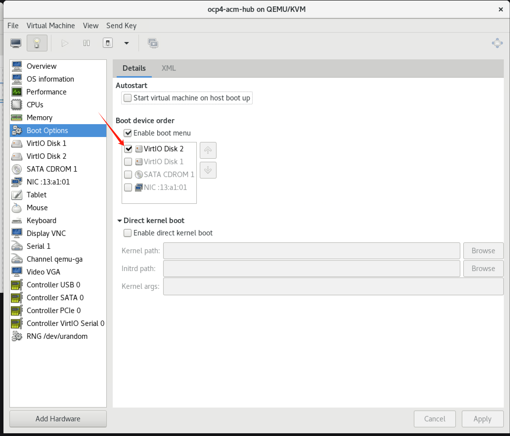

# openshift 4.14, 从 rhel 开始 用 agent install 模式安装

agent base installer是未来openshift 4的推荐安装模式，但是如果客户只能提供rhel vm，那么我们能不能用agent installer模式安装呢？我们今天就来试一试

# SNO

## helper

```bash

su - sno


export BUILDNUMBER=4.14.16

pushd /data/ocp-${BUILDNUMBER}
mkdir -p ~/.local/bin
tar -xzf openshift-client-linux-${BUILDNUMBER}.tar.gz -C ~/.local/bin/
tar -xzf openshift-install-linux-${BUILDNUMBER}.tar.gz -C ~/.local/bin/
# tar -xzf oc-mirror.tar.gz -C /usr/local/bin/
# chmod +x /usr/local/bin/oc-mirror
install -m 755 /data/ocp4/clients/butane-amd64 ~/.local/bin//butane
install -m 755 /data/ocp4/clients/coreos-installer_amd64 ~/.local/bin//coreos-installer
popd


export BUILDNUMBER=4.14.16

mkdir -p ${BASE_DIR}/data/{sno/disconnected,install}

# set some parameter of you rcluster

NODE_SSH_KEY="$(cat ${BASE_DIR}/.ssh/id_rsa.pub)"
INSTALL_IMAGE_REGISTRY=quaylab.infra.wzhlab.top:5443

# PULL_SECRET='{"auths":{"registry.redhat.io": {"auth": "ZHVtbXk6ZHVtbXk=","email": "noemail@localhost"},"registry.ocp4.redhat.ren:5443": {"auth": "ZHVtbXk6ZHVtbXk=","email": "noemail@localhost"},"'${INSTALL_IMAGE_REGISTRY}'": {"auth": "'$( echo -n 'admin:shadowman' | openssl base64 )'","email": "noemail@localhost"}}}'
PULL_SECRET=$(cat /data/pull-secret.json)

NTP_SERVER=192.168.77.11
# HELP_SERVER=172.21.6.11
# KVM_HOST=192.168.7.11
# API_VIP=192.168.77.99
# INGRESS_VIP=192.168.77.98
# CLUSTER_PROVISION_IP=192.168.7.103
# BOOTSTRAP_IP=192.168.7.12
MACHINE_NETWORK='192.168.77.0/24'

# 定义单节点集群的节点信息
SNO_CLUSTER_NAME=osp-demo
SNO_BASE_DOMAIN=wzhlab.top

# BOOTSTRAP_IP=172.21.6.22
MASTER_01_IP=192.168.77.43
MASTER_02_IP=192.168.77.44
MASTER_03_IP=192.168.77.45
WORKER_01_IP=192.168.77.46
WORKER_02_IP=192.168.77.47
WORKER_03_IP=192.168.77.48

# BOOTSTRAP_IPv6=fd03::22
MASTER_01_IPv6=fd03::23
MASTER_02_IPv6=fd03::24
MASTER_03_IPv6=fd03::25
WORKER_01_IPv6=fd03::26
WORKER_02_IPv6=fd03::27
WORKER_03_IPv6=fd03::28

# BOOTSTRAP_HOSTNAME=bootstrap-demo
MASTER_01_HOSTNAME=master-01-demo
MASTER_02_HOSTNAME=master-02-demo
MASTER_03_HOSTNAME=master-03-demo
WORKER_01_HOSTNAME=worker-01-demo
WORKER_02_HOSTNAME=worker-02-demo
WORKER_03_HOSTNAME=worker-03-demo

BOOTSTRAP_INTERFACE=enp1s0
MASTER_01_INTERFACE=enp1s0
MASTER_02_INTERFACE=enp1s0
MASTER_03_INTERFACE=enp1s0
WORKER_01_INTERFACE=enp1s0
WORKER_02_INTERFACE=enp1s0
WORKER_03_INTERFACE=enp1s0

MASTER_01_INTERFACE_MAC=52:54:00:13:A1:01
MASTER_02_INTERFACE_MAC=52:54:00:13:A1:02
MASTER_03_INTERFACE_MAC=52:54:00:13:A1:03
WORKER_01_INTERFACE_MAC=52:54:00:13:A1:04
WORKER_02_INTERFACE_MAC=52:54:00:13:A1:05
WORKER_03_INTERFACE_MAC=52:54:00:13:A1:06

# BOOTSTRAP_DISK=/dev/vdb
MASTER_01_DISK=/dev/vda
MASTER_02_DISK=/dev/vda
MASTER_03_DISK=/dev/vda
WORKER_01_DISK=/dev/vda
WORKER_02_DISK=/dev/vda
WORKER_03_DISK=/dev/vda

OCP_GW=192.168.77.11
OCP_NETMASK=255.255.255.0
OCP_NETMASK_S=24
OCP_DNS=192.168.77.11

OCP_GW_v6=fd03::11
OCP_NETMASK_v6=64

OCP_ROOTFS=http://192.168.77.11:8080/agent.x86_64-rootfs.img

# echo ${SNO_IF_MAC} > /data/sno/sno.mac

mkdir -p ${BASE_DIR}/data/install
cd ${BASE_DIR}/data/install

/bin/rm -rf *.ign .openshift_install_state.json auth bootstrap manifests master*[0-9] worker*[0-9] *

cat << EOF > ${BASE_DIR}/data/install/install-config.yaml 
apiVersion: v1
baseDomain: $SNO_BASE_DOMAIN
compute:
- name: worker
  replicas: 0 
controlPlane:
  name: master
  replicas: 1
metadata:
  name: $SNO_CLUSTER_NAME
networking:
  # OVNKubernetes , OpenShiftSDN
  networkType: OVNKubernetes 
  clusterNetwork:
    - cidr: 10.132.0.0/14 
      hostPrefix: 23
    # - cidr: fd02::/48
    #   hostPrefix: 64
  machineNetwork:
    - cidr: $MACHINE_NETWORK
    # - cidr: 2001:DB8::/32
  serviceNetwork:
    - 172.22.0.0/16
    # - fd03::/112
platform: 
  none: {}
pullSecret: '${PULL_SECRET}'
sshKey: |
$( cat ${BASE_DIR}/.ssh/id_rsa.pub | sed 's/^/   /g' )
additionalTrustBundle: |
$( cat /etc/crts/redhat.ren.ca.crt | sed 's/^/   /g' )
imageDigestSources:
- mirrors:
  - ${INSTALL_IMAGE_REGISTRY}/ocp4/openshift4
  source: quay.io/openshift-release-dev/ocp-release
- mirrors:
  - ${INSTALL_IMAGE_REGISTRY}/ocp4/openshift4
  source: quay.io/openshift-release-dev/ocp-v4.0-art-dev
EOF

cat << EOF > ${BASE_DIR}/data/install/agent-config.yaml
apiVersion: v1alpha1
kind: AgentConfig
metadata:
  name: $SNO_CLUSTER_NAME
rendezvousIP: $MASTER_01_IP
bootArtifactsBaseURL: $OCP_ROOTFS
additionalNTPSources:
- $NTP_SERVER
hosts:
  - hostname: $MASTER_01_HOSTNAME
    role: master
    rootDeviceHints:
      deviceName: "$MASTER_01_DISK"
    interfaces:
      - name: $MASTER_01_INTERFACE
        macAddress: $MASTER_01_INTERFACE_MAC
    networkConfig:
      interfaces:
        - name: $MASTER_01_INTERFACE
          type: ethernet
          state: up
          mac-address: $MASTER_01_INTERFACE_MAC
          ipv4:
            enabled: true
            address:
              - ip: $MASTER_01_IP
                prefix-length: $OCP_NETMASK_S
            dhcp: false
      dns-resolver:
        config:
          server:
            - $OCP_DNS
      routes:
        config:
          - destination: 0.0.0.0/0
            next-hop-address: $OCP_GW
            next-hop-interface: $MASTER_01_INTERFACE
            table-id: 254        
EOF

/bin/cp -f ${BASE_DIR}/data/install/install-config.yaml ${BASE_DIR}/data/install/install-config.yaml.bak


mkdir -p ${BASE_DIR}/data/install/openshift


# put /var to vdb
cat << EOF > ${BASE_DIR}/data/install/98-master-var-partition.bu
variant: openshift
version: 4.14.0
metadata:
  labels:
    machineconfiguration.openshift.io/role: master
  name: 98-master-var-partition
storage:
  disks:
  - device: /dev/vdb
    partitions:
    - label: var
      start_mib: 0
      size_mib: 0
  filesystems:
    - device: /dev/disk/by-partlabel/var
      path: /var
      format: xfs
      mount_options: [defaults, prjquota] 
      with_mount_unit: true
EOF

butane ${BASE_DIR}/data/install/98-master-var-partition.bu -o ${BASE_DIR}/data/install/openshift/98-master-var-partition.yaml

cat << EOF > ${BASE_DIR}/data/install/98-worker-var-partition.bu
variant: openshift
version: 4.14.0
metadata:
  labels:
    machineconfiguration.openshift.io/role: worker
  name: 98-worker-var-partition
storage:
  disks:
  - device: /dev/vdb
    partitions:
    - label: var
      start_mib: 0
      size_mib: 0
  filesystems:
    - device: /dev/disk/by-partlabel/var
      path: /var
      format: xfs
      mount_options: [defaults, prjquota] 
      with_mount_unit: true
EOF

butane ${BASE_DIR}/data/install/98-worker-var-partition.bu -o ${BASE_DIR}/data/install/openshift/98-worker-var-partition.yaml


# you can change the system's registry config
# but do not need under normal situation
# sudo bash -c "/bin/cp -f mirror/registries.conf /etc/containers/registries.conf.d/; chmod +r /etc/containers/registries.conf.d/*"

# /bin/cp -f  /data/ocp4/ansible-helper/files/* ${BASE_DIR}/data/install/openshift/

sudo bash -c "cd /data/ocp4 ; bash image.registries.conf.sh quaylab.infra.wzhlab.top:5443 ;"

# we lost the way to customize the registry during install stage
# leave the configuration to day-2 operation.
/bin/cp -f /data/ocp4/99-worker-container-registries.yaml ${BASE_DIR}/data/install/openshift
/bin/cp -f /data/ocp4/99-master-container-registries.yaml ${BASE_DIR}/data/install/openshift

openshift-install --dir=${BASE_DIR}/data/install agent create cluster-manifests

cd ${BASE_DIR}/data/install/

openshift-install agent create pxe-files

ls -R boot-artifacts/
# boot-artifacts/:
# agent.x86_64-initrd.img  agent.x86_64-rootfs.img  agent.x86_64-vmlinuz

```

## create rhel/centos 7 vm

```bash
# on 103

# install a centos7 vm

sed -i '0,/^network.*/s/^network.*/network  --bootproto=static --device=eth0 --gateway=192.168.77.1 --ip=192.168.77.12  --netmask=255.255.255.0 --nameserver=192.168.77.11  --ipv6=auto --activate/' helper-ks.cfg

virsh destroy ocp4-acm-hub
virsh undefine ocp4-acm-hub

create_lv() {
    var_vg=$1
    var_pool=$2
    var_lv=$3
    var_size=$4
    var_action=$5
    lvremove -f $var_vg/$var_lv
    # lvcreate -y -L $var_size -n $var_lv $var_vg
    if [ "$var_action" == "recreate" ]; then
      lvcreate --type thin -n $var_lv -V $var_size --thinpool $var_vg/$var_pool
      wipefs --all --force /dev/$var_vg/$var_lv
    fi
}

create_lv vgdata poolA lvacmhub 50G recreate
create_lv vgdata poolA lvacmhub-data 100G recreate


virt-install --name="ocp4-acm-hub" --vcpus=16 --ram=$((52*1024)) \
    --cpu=host-model \
    --disk path=/dev/vgdata/lvacmhub,device=disk,bus=virtio,format=raw \
    --disk path=/dev/vgdata/lvacmhub-data,device=disk,bus=virtio,format=raw \
    --os-variant rhel8.5 \
    --network bridge=baremetal,model=virtio,mac=52:54:00:13:A1:01 \
    --graphics vnc,port=59000 --noautoconsole \
    --boot menu=on --location /data/kvm/CentOS-7-x86_64-Minimal-2009.iso \
    --initrd-inject helper-ks.cfg --extra-args "inst.ks=file:/helper-ks.cfg" 


```

## modify grub and reboot to install ocp

```bash
# on helper
# copy to rhel/centos vm

sshpass -p redhat ssh-copy-id root@192.168.77.12

cd ${BASE_DIR}/data/install/boot-artifacts
scp agent.x86_64-initrd.img root@192.168.77.12:/boot/
scp agent.x86_64-vmlinuz root@192.168.77.12:/boot/

sudo /bin/cp -f agent.x86_64-rootfs.img /data/ocp4/ 

# on rhel/centos 7 vm
# hack booting menu
ssh root@192.168.77.12

SNO_IP=192.168.77.12
SNO_GW=192.168.77.11
SNO_NETMAST=255.255.255.0
SNO_HOSTNAME=acm-demo-hub-master
SNO_IF=enp1s0
SNO_DNS=192.168.77.11
SNO_DISK=/dev/vda
SNO_ROOTFS=http://192.168.77.11:8080/agent.x86_64-rootfs.img
# SNO_IGN=http://192.168.77.11:8080/ignition/iso.ign

cat << EOF >> /etc/grub.d/40_custom
menuentry 'coreos' --class fedora --class gnu-linux --class gnu --class os {
    insmod gzio
    insmod part_msdos
    insmod xfs
    set root='hd0,msdos1'
    echo  'Loading coreos kernel ...'
    linux /agent.x86_64-vmlinuz rd.neednet=1 console=tty0 console=ttyS0 coreos.live.rootfs_url=$SNO_ROOTFS  ip=$SNO_IP::$SNO_GW:$SNO_NETMAST:$SNO_HOSTNAME:$SNO_IF:none nameserver=$SNO_DNS ignition.firstboot ignition.platform.id=metal random.trust_cpu=on
    echo  'Loading coreos initrd ...'
    initrd /agent.x86_64-initrd.img 
}
EOF

sed -i 's/^GRUB_DEFAULT=.*/GRUB_DEFAULT="coreos"/' /etc/default/grub 

grub2-mkconfig -o /etc/grub2.cfg

reboot

```

## hack for small vda validation

```bash

# on helper, as user 3node
# run hack by login to each node

cat > ${BASE_DIR}/data/install/crack.txt << 'EOF'

sudo sed -i 's/"disk_size_gb":100/"disk_size_gb":20/g' /usr/local/share/assisted-service/assisted-service.env

sudo systemctl restart assisted-service-pod.service
sudo systemctl restart agent.service

EOF

for i in 43
do
  ssh core@192.168.77.$i < ${BASE_DIR}/data/install/crack.txt
done


```

## see the result

```bash
cd ${BASE_DIR}/data/install
export KUBECONFIG=${BASE_DIR}/data/install/auth/kubeconfig
echo "export KUBECONFIG=${BASE_DIR}/data/install/auth/kubeconfig" >> ~/.bashrc
# oc completion bash | sudo tee /etc/bash_completion.d/openshift > /dev/null


cd ${BASE_DIR}/data/install
openshift-install --dir=${BASE_DIR}/data/install agent wait-for bootstrap-complete --log-level=debug
# ......
# DEBUG RendezvousIP from the AgentConfig 192.168.77.43
# INFO Bootstrap Kube API Initialized
# INFO Bootstrap configMap status is complete
# INFO cluster bootstrap is complete

cd ${BASE_DIR}/data/install
openshift-install --dir=${BASE_DIR}/data/install agent wait-for install-complete --log-level=debug
# ......
# INFO Cluster is installed
# INFO Install complete!
# INFO To access the cluster as the system:admin user when using 'oc', run
# INFO     export KUBECONFIG=/home/sno/data/install/auth/kubeconfig
# INFO Access the OpenShift web-console here: https://console-openshift-console.apps.osp-demo.wzhlab.top
# INFO Login to the console with user: "kubeadmin", and password: "DrZqE-rD5se-X7rxJ-69aS8"

```

# 3 master / compact cluster

## helper

```bash


export BUILDNUMBER=4.14.16

mkdir -p ${BASE_DIR}/data/{sno/disconnected,install}

# set some parameter of you rcluster

NODE_SSH_KEY="$(cat ${BASE_DIR}/.ssh/id_rsa.pub)"
INSTALL_IMAGE_REGISTRY=quaylab.infra.wzhlab.top:5443

# PULL_SECRET='{"auths":{"registry.redhat.io": {"auth": "ZHVtbXk6ZHVtbXk=","email": "noemail@localhost"},"registry.ocp4.redhat.ren:5443": {"auth": "ZHVtbXk6ZHVtbXk=","email": "noemail@localhost"},"'${INSTALL_IMAGE_REGISTRY}'": {"auth": "'$( echo -n 'admin:shadowman' | openssl base64 )'","email": "noemail@localhost"}}}'
PULL_SECRET=$(cat /data/pull-secret.json)

NTP_SERVER=192.168.77.11
# HELP_SERVER=172.21.6.11
# KVM_HOST=192.168.7.11
API_VIP=192.168.77.48
INGRESS_VIP=192.168.77.49
# CLUSTER_PROVISION_IP=192.168.7.103
# BOOTSTRAP_IP=192.168.7.12
MACHINE_NETWORK='192.168.77.0/24'

# 定义单节点集群的节点信息
SNO_CLUSTER_NAME=osp-demo
SNO_BASE_DOMAIN=wzhlab.top

# BOOTSTRAP_IP=172.21.6.22
MASTER_01_IP=192.168.77.43
MASTER_02_IP=192.168.77.44
MASTER_03_IP=192.168.77.45
WORKER_01_IP=192.168.77.46
WORKER_02_IP=192.168.77.47
# WORKER_03_IP=192.168.77.48

# BOOTSTRAP_IPv6=fd03::22
MASTER_01_IPv6=fd03::23
MASTER_02_IPv6=fd03::24
MASTER_03_IPv6=fd03::25
WORKER_01_IPv6=fd03::26
WORKER_02_IPv6=fd03::27
WORKER_03_IPv6=fd03::28

# BOOTSTRAP_HOSTNAME=bootstrap-demo
MASTER_01_HOSTNAME=master-01-demo
MASTER_02_HOSTNAME=master-02-demo
MASTER_03_HOSTNAME=master-03-demo
WORKER_01_HOSTNAME=worker-01-demo
WORKER_02_HOSTNAME=worker-02-demo
WORKER_03_HOSTNAME=worker-03-demo

BOOTSTRAP_INTERFACE=enp1s0
MASTER_01_INTERFACE=enp1s0
MASTER_02_INTERFACE=enp1s0
MASTER_03_INTERFACE=enp1s0
WORKER_01_INTERFACE=enp1s0
WORKER_02_INTERFACE=enp1s0
WORKER_03_INTERFACE=enp1s0

MASTER_01_INTERFACE_MAC=52:54:00:13:A1:01
MASTER_02_INTERFACE_MAC=52:54:00:13:A1:02
MASTER_03_INTERFACE_MAC=52:54:00:13:A1:03
WORKER_01_INTERFACE_MAC=52:54:00:13:A1:04
WORKER_02_INTERFACE_MAC=52:54:00:13:A1:05
WORKER_03_INTERFACE_MAC=52:54:00:13:A1:06

# BOOTSTRAP_DISK=/dev/vdb
MASTER_01_DISK=/dev/vda
MASTER_02_DISK=/dev/vda
MASTER_03_DISK=/dev/vda
WORKER_01_DISK=/dev/vda
WORKER_02_DISK=/dev/vda
WORKER_03_DISK=/dev/vda

OCP_GW=192.168.77.11
OCP_NETMASK=255.255.255.0
OCP_NETMASK_S=24
OCP_DNS=192.168.77.11

OCP_GW_v6=fd03::11
OCP_NETMASK_v6=64

OCP_ROOTFS=http://192.168.77.11:8080/agent.x86_64-rootfs.img

# echo ${SNO_IF_MAC} > /data/sno/sno.mac

mkdir -p ${BASE_DIR}/data/install
cd ${BASE_DIR}/data/install

/bin/rm -rf *.ign .openshift_install_state.json auth bootstrap manifests master*[0-9] worker*[0-9] *

cat << EOF > ${BASE_DIR}/data/install/install-config.yaml 
apiVersion: v1
baseDomain: $SNO_BASE_DOMAIN
compute:
- name: worker
  replicas: 1
controlPlane:
  name: master
  replicas: 3
metadata:
  name: $SNO_CLUSTER_NAME
networking:
  # OVNKubernetes , OpenShiftSDN
  networkType: OVNKubernetes 
  clusterNetwork:
    - cidr: 10.132.0.0/14 
      hostPrefix: 23
    # - cidr: fd02::/48
    #   hostPrefix: 64
  machineNetwork:
    - cidr: $MACHINE_NETWORK
    # - cidr: 2001:DB8::/32
  serviceNetwork:
    - 172.22.0.0/16
    # - fd03::/112
platform: 
  baremetal:
    apiVIPs:
    - $API_VIP
    # - 2001:DB8::4
    ingressVIPs:
    - $INGRESS_VIP
    # - 2001:DB8::5
pullSecret: '${PULL_SECRET}'
sshKey: |
$( cat ${BASE_DIR}/.ssh/id_rsa.pub | sed 's/^/   /g' )
additionalTrustBundle: |
$( cat /etc/crts/redhat.ren.ca.crt | sed 's/^/   /g' )
imageDigestSources:
- mirrors:
  - ${INSTALL_IMAGE_REGISTRY}/ocp4/openshift4
  source: quay.io/openshift-release-dev/ocp-release
- mirrors:
  - ${INSTALL_IMAGE_REGISTRY}/ocp4/openshift4
  source: quay.io/openshift-release-dev/ocp-v4.0-art-dev
EOF

cat << EOF > ${BASE_DIR}/data/install/agent-config.yaml
apiVersion: v1alpha1
kind: AgentConfig
metadata:
  name: $SNO_CLUSTER_NAME
rendezvousIP: $MASTER_01_IP
bootArtifactsBaseURL: $OCP_ROOTFS
additionalNTPSources:
- $NTP_SERVER
hosts:
  - hostname: $MASTER_01_HOSTNAME
    role: master
    rootDeviceHints:
      deviceName: "$MASTER_01_DISK"
    interfaces:
      - name: $MASTER_01_INTERFACE
        macAddress: $MASTER_01_INTERFACE_MAC
    networkConfig:
      interfaces:
        - name: $MASTER_01_INTERFACE
          type: ethernet
          state: up
          mac-address: $MASTER_01_INTERFACE_MAC
          ipv4:
            enabled: true
            address:
              - ip: $MASTER_01_IP
                prefix-length: $OCP_NETMASK_S
            dhcp: false
      dns-resolver:
        config:
          server:
            - $OCP_DNS
      routes:
        config:
          - destination: 0.0.0.0/0
            next-hop-address: $OCP_GW
            next-hop-interface: $MASTER_01_INTERFACE
            table-id: 254
  - hostname: $MASTER_02_HOSTNAME
    role: master
    rootDeviceHints:
      deviceName: "$MASTER_02_DISK"
    interfaces:
      - name: $MASTER_02_INTERFACE
        macAddress: $MASTER_02_INTERFACE_MAC
    networkConfig:
      interfaces:
        - name: $MASTER_02_INTERFACE
          type: ethernet
          state: up
          mac-address: $MASTER_02_INTERFACE_MAC
          ipv4:
            enabled: true
            address:
              - ip: $MASTER_02_IP
                prefix-length: $OCP_NETMASK_S
            dhcp: false
      dns-resolver:
        config:
          server:
            - $OCP_DNS
      routes:
        config:
          - destination: 0.0.0.0/0
            next-hop-address: $OCP_GW
            next-hop-interface: $MASTER_02_INTERFACE
            table-id: 254
  - hostname: $MASTER_03_HOSTNAME
    role: master
    rootDeviceHints:
      deviceName: "$MASTER_03_DISK"
    interfaces:
      - name: $MASTER_03_INTERFACE
        macAddress: $MASTER_03_INTERFACE_MAC
    networkConfig:
      interfaces:
        - name: $MASTER_03_INTERFACE
          type: ethernet
          state: up
          mac-address: $MASTER_03_INTERFACE_MAC
          ipv4:
            enabled: true
            address:
              - ip: $MASTER_03_IP
                prefix-length: $OCP_NETMASK_S
            dhcp: false
      dns-resolver:
        config:
          server:
            - $OCP_DNS
      routes:
        config:
          - destination: 0.0.0.0/0
            next-hop-address: $OCP_GW
            next-hop-interface: $MASTER_03_INTERFACE
            table-id: 254
  - hostname: $WORKER_01_HOSTNAME
    role: worker
    rootDeviceHints:
      deviceName: "$WORKER_01_DISK"
    interfaces:
      - name: $WORKER_01_INTERFACE
        macAddress: $WORKER_01_INTERFACE_MAC
    networkConfig:
      interfaces:
        - name: $WORKER_01_INTERFACE
          type: ethernet
          state: up
          mac-address: $WORKER_01_INTERFACE_MAC
          ipv4:
            enabled: true
            address:
              - ip: $WORKER_01_IP
                prefix-length: $OCP_NETMASK_S
            dhcp: false
      dns-resolver:
        config:
          server:
            - $OCP_DNS
      routes:
        config:
          - destination: 0.0.0.0/0
            next-hop-address: $OCP_GW
            next-hop-interface: $WORKER_01_INTERFACE
            table-id: 254
EOF

/bin/cp -f ${BASE_DIR}/data/install/install-config.yaml ${BASE_DIR}/data/install/install-config.yaml.bak


mkdir -p ${BASE_DIR}/data/install/openshift


# put /var to vdb
cat << EOF > ${BASE_DIR}/data/install/98-master-var-partition.bu
variant: openshift
version: 4.14.0
metadata:
  labels:
    machineconfiguration.openshift.io/role: master
  name: 98-master-var-partition
storage:
  disks:
  - device: /dev/vdb
    partitions:
    - label: var
      start_mib: 0
      size_mib: 0
  filesystems:
    - device: /dev/disk/by-partlabel/var
      path: /var
      format: xfs
      mount_options: [defaults, prjquota] 
      with_mount_unit: true
EOF

butane ${BASE_DIR}/data/install/98-master-var-partition.bu -o ${BASE_DIR}/data/install/openshift/98-master-var-partition.yaml

cat << EOF > ${BASE_DIR}/data/install/98-worker-var-partition.bu
variant: openshift
version: 4.14.0
metadata:
  labels:
    machineconfiguration.openshift.io/role: worker
  name: 98-worker-var-partition
storage:
  disks:
  - device: /dev/vdb
    partitions:
    - label: var
      start_mib: 0
      size_mib: 0
  filesystems:
    - device: /dev/disk/by-partlabel/var
      path: /var
      format: xfs
      mount_options: [defaults, prjquota] 
      with_mount_unit: true
EOF

butane ${BASE_DIR}/data/install/98-worker-var-partition.bu -o ${BASE_DIR}/data/install/openshift/98-worker-var-partition.yaml


# you can change the system's registry config
# but do not need under normal situation
# sudo bash -c "/bin/cp -f mirror/registries.conf /etc/containers/registries.conf.d/; chmod +r /etc/containers/registries.conf.d/*"

# /bin/cp -f  /data/ocp4/ansible-helper/files/* ${BASE_DIR}/data/install/openshift/

sudo bash -c "cd /data/ocp4 ; bash image.registries.conf.sh quaylab.infra.wzhlab.top:8083 ;"

# we lost the way to customize the registry during install stage
# leave the configuration to day-2 operation.
/bin/cp -f /data/ocp4/99-worker-container-registries.yaml ${BASE_DIR}/data/install/openshift
/bin/cp -f /data/ocp4/99-master-container-registries.yaml ${BASE_DIR}/data/install/openshift

openshift-install --dir=${BASE_DIR}/data/install agent create cluster-manifests

cd ${BASE_DIR}/data/install/

openshift-install agent create pxe-files

ls -R boot-artifacts/
# boot-artifacts/:
# agent.x86_64-initrd.img  agent.x86_64-rootfs.img  agent.x86_64-vmlinuz


```


## create rhel/centos 7 vm

```bash
# on 103

# install a centos7 vm

### master-01

sed -i '0,/^network.*/s/^network.*/network  --bootproto=static --device=eth0 --gateway=192.168.77.1 --ip=192.168.77.12  --netmask=255.255.255.0 --nameserver=192.168.77.11  --ipv6=auto --activate/' helper-ks.cfg

virsh destroy ocp4-acm-01
virsh undefine ocp4-acm-01

create_lv() {
    var_vg=$1
    var_pool=$2
    var_lv=$3
    var_size=$4
    var_action=$5
    lvremove -f $var_vg/$var_lv
    # lvcreate -y -L $var_size -n $var_lv $var_vg
    if [ "$var_action" == "recreate" ]; then
      lvcreate --type thin -n $var_lv -V $var_size --thinpool $var_vg/$var_pool
      wipefs --all --force /dev/$var_vg/$var_lv
    fi
}

create_lv vgdata poolA lvacm-01 50G recreate
create_lv vgdata poolA lvacm-01-data 100G recreate


virt-install --name="ocp4-acm-01" --vcpus=16 --ram=$((52*1024)) \
    --cpu=host-model \
    --disk path=/dev/vgdata/lvacm-01,device=disk,bus=virtio,format=raw \
    --disk path=/dev/vgdata/lvacm-01-data,device=disk,bus=virtio,format=raw \
    --os-variant rhel8.5 \
    --network bridge=baremetal,model=virtio,mac=52:54:00:13:A1:01 \
    --graphics vnc,port=59000 --noautoconsole \
    --boot menu=on --location /data/kvm/CentOS-7-x86_64-Minimal-2009.iso \
    --initrd-inject helper-ks.cfg --extra-args "inst.ks=file:/helper-ks.cfg" 

### master-02

sed -i '0,/^network.*/s/^network.*/network  --bootproto=static --device=eth0 --gateway=192.168.77.1 --ip=192.168.77.13  --netmask=255.255.255.0 --nameserver=192.168.77.11  --ipv6=auto --activate/' helper-ks.cfg

virsh destroy ocp4-acm-02
virsh undefine ocp4-acm-02

create_lv() {
    var_vg=$1
    var_pool=$2
    var_lv=$3
    var_size=$4
    var_action=$5
    lvremove -f $var_vg/$var_lv
    # lvcreate -y -L $var_size -n $var_lv $var_vg
    if [ "$var_action" == "recreate" ]; then
      lvcreate --type thin -n $var_lv -V $var_size --thinpool $var_vg/$var_pool
      wipefs --all --force /dev/$var_vg/$var_lv
    fi
}

create_lv vgdata poolA lvacm-02 50G recreate
create_lv vgdata poolA lvacm-02-data 100G recreate


virt-install --name="ocp4-acm-02" --vcpus=16 --ram=$((52*1024)) \
    --cpu=host-model \
    --disk path=/dev/vgdata/lvacm-02,device=disk,bus=virtio,format=raw \
    --disk path=/dev/vgdata/lvacm-02-data,device=disk,bus=virtio,format=raw \
    --os-variant rhel8.5 \
    --network bridge=baremetal,model=virtio,mac=52:54:00:13:A1:02 \
    --graphics vnc,port=59001 --noautoconsole \
    --boot menu=on --location /data/kvm/CentOS-7-x86_64-Minimal-2009.iso \
    --initrd-inject helper-ks.cfg --extra-args "inst.ks=file:/helper-ks.cfg" 

### master-03

sed -i '0,/^network.*/s/^network.*/network  --bootproto=static --device=eth0 --gateway=192.168.77.1 --ip=192.168.77.14  --netmask=255.255.255.0 --nameserver=192.168.77.11  --ipv6=auto --activate/' helper-ks.cfg

virsh destroy ocp4-acm-03
virsh undefine ocp4-acm-03

create_lv() {
    var_vg=$1
    var_pool=$2
    var_lv=$3
    var_size=$4
    var_action=$5
    lvremove -f $var_vg/$var_lv
    # lvcreate -y -L $var_size -n $var_lv $var_vg
    if [ "$var_action" == "recreate" ]; then
      lvcreate --type thin -n $var_lv -V $var_size --thinpool $var_vg/$var_pool
      wipefs --all --force /dev/$var_vg/$var_lv
    fi
}

create_lv vgdata poolA lvacm-03 50G recreate
create_lv vgdata poolA lvacm-03-data 100G recreate


virt-install --name="ocp4-acm-03" --vcpus=16 --ram=$((52*1024)) \
    --cpu=host-model \
    --disk path=/dev/vgdata/lvacm-03,device=disk,bus=virtio,format=raw \
    --disk path=/dev/vgdata/lvacm-03-data,device=disk,bus=virtio,format=raw \
    --os-variant rhel8.5 \
    --network bridge=baremetal,model=virtio,mac=52:54:00:13:A1:03 \
    --graphics vnc,port=59002 --noautoconsole \
    --boot menu=on --location /data/kvm/CentOS-7-x86_64-Minimal-2009.iso \
    --initrd-inject helper-ks.cfg --extra-args "inst.ks=file:/helper-ks.cfg" 

### worker-01

sed -i '0,/^network.*/s/^network.*/network  --bootproto=static --device=eth0 --gateway=192.168.77.1 --ip=192.168.77.15  --netmask=255.255.255.0 --nameserver=192.168.77.11  --ipv6=auto --activate/' helper-ks.cfg

virsh destroy ocp4-acm-04
virsh undefine ocp4-acm-04

create_lv() {
    var_vg=$1
    var_pool=$2
    var_lv=$3
    var_size=$4
    var_action=$5
    lvremove -f $var_vg/$var_lv
    # lvcreate -y -L $var_size -n $var_lv $var_vg
    if [ "$var_action" == "recreate" ]; then
      lvcreate --type thin -n $var_lv -V $var_size --thinpool $var_vg/$var_pool
      wipefs --all --force /dev/$var_vg/$var_lv
    fi
}

create_lv vgdata poolA lvacm-04 50G recreate
create_lv vgdata poolA lvacm-04-data 100G recreate


virt-install --name="ocp4-acm-04" --vcpus=16 --ram=$((52*1024)) \
    --cpu=host-model \
    --disk path=/dev/vgdata/lvacm-04,device=disk,bus=virtio,format=raw \
    --disk path=/dev/vgdata/lvacm-04-data,device=disk,bus=virtio,format=raw \
    --os-variant rhel8.5 \
    --network bridge=baremetal,model=virtio,mac=52:54:00:13:A1:04 \
    --graphics vnc,port=59003 --noautoconsole \
    --boot menu=on --location /data/kvm/CentOS-7-x86_64-Minimal-2009.iso \
    --initrd-inject helper-ks.cfg --extra-args "inst.ks=file:/helper-ks.cfg" 


```

## modify grub and reboot to install ocp

```bash
# on helper
# copy to rhel/centos vm
for var_i in {12..15}; do
  sshpass -p redhat ssh-copy-id root@192.168.77.$var_i
done


cd ${BASE_DIR}/data/install/boot-artifacts

for var_i in {12..15}; do
  scp agent.x86_64-initrd.img root@192.168.77.$var_i:/boot/
  scp agent.x86_64-vmlinuz root@192.168.77.$var_i:/boot/
done

sudo /bin/cp -f agent.x86_64-rootfs.img /data/ocp4/ 

# on rhel/centos 7 vm
# hack booting menu
ssh root@192.168.77.12
SNO_IP=192.168.77.12

ssh root@192.168.77.13
SNO_IP=192.168.77.13

ssh root@192.168.77.14
SNO_IP=192.168.77.14

ssh root@192.168.77.15
SNO_IP=192.168.77.15

# repeat for each vm

# SNO_IP=192.168.77.13
SNO_GW=192.168.77.11
SNO_NETMAST=255.255.255.0
SNO_HOSTNAME=acm-demo-hub-master
SNO_IF=enp1s0
SNO_DNS=192.168.77.11
SNO_DISK=/dev/vda
SNO_ROOTFS=http://192.168.77.11:8080/agent.x86_64-rootfs.img
# SNO_IGN=http://192.168.77.11:8080/ignition/iso.ign

cat << EOF >> /etc/grub.d/40_custom
menuentry 'coreos' --class fedora --class gnu-linux --class gnu --class os {
    insmod gzio
    insmod part_msdos
    insmod xfs
    set root='hd0,msdos1'
    echo  'Loading coreos kernel ...'
    linux /agent.x86_64-vmlinuz rd.neednet=1 console=tty0 console=ttyS0 coreos.live.rootfs_url=$SNO_ROOTFS  ip=$SNO_IP::$SNO_GW:$SNO_NETMAST:$SNO_HOSTNAME:$SNO_IF:none nameserver=$SNO_DNS ignition.firstboot ignition.platform.id=metal random.trust_cpu=on
    echo  'Loading coreos initrd ...'
    initrd /agent.x86_64-initrd.img 
}
EOF

sed -i 's/^GRUB_DEFAULT=.*/GRUB_DEFAULT="coreos"/' /etc/default/grub 

grub2-mkconfig -o /etc/grub2.cfg

reboot


```

## hack for small vda validation

```bash

# on helper, as user 3node
# run hack by login to each node

cat > ${BASE_DIR}/data/install/crack.txt << 'EOF'

sudo sed -i 's/"disk_size_gb":100/"disk_size_gb":20/g' /usr/local/share/assisted-service/assisted-service.env

sudo systemctl restart assisted-service-pod.service
sudo systemctl restart agent.service

EOF

for i in {43..46}
do
  ssh core@192.168.77.$i < ${BASE_DIR}/data/install/crack.txt
done


```


## see the result

```bash
cd ${BASE_DIR}/data/install
export KUBECONFIG=${BASE_DIR}/data/install/auth/kubeconfig
echo "export KUBECONFIG=${BASE_DIR}/data/install/auth/kubeconfig" >> ~/.bashrc
# oc completion bash | sudo tee /etc/bash_completion.d/openshift > /dev/null


cd ${BASE_DIR}/data/install
openshift-install --dir=${BASE_DIR}/data/install agent wait-for bootstrap-complete --log-level=debug
# ......
# DEBUG RendezvousIP from the AgentConfig 192.168.77.43
# INFO Bootstrap Kube API Initialized
# INFO Bootstrap configMap status is complete
# INFO cluster bootstrap is complete

cd ${BASE_DIR}/data/install
openshift-install --dir=${BASE_DIR}/data/install agent wait-for install-complete --log-level=debug
# ......
# INFO Cluster is installed
# INFO Install complete!
# INFO To access the cluster as the system:admin user when using 'oc', run
# INFO     export KUBECONFIG=/home/sno/data/install/auth/kubeconfig
# INFO Access the OpenShift web-console here: https://console-openshift-console.apps.osp-demo.wzhlab.top
# INFO Login to the console with user: "kubeadmin", and password: "oyJbA-gdrDv-f4cyy-vFVob"

```

## poweroff

```bash

for i in {46..43}
do
  ssh core@192.168.77.$i sudo poweroff
done

```

# reference

- [Minimum disk size specified as 120GB, but should be 100GB](https://issues.redhat.com/browse/OCPBUGS-11188)

# backup

## seperate /var

```bash


cat << EOF > ${BASE_DIR}/data/install/98-master-var-partition.bu
variant: openshift
version: 4.14.0
metadata:
  labels:
    machineconfiguration.openshift.io/role: master
  name: 98-master-var-partition
storage:
  disks:
  - device: /dev/vdb
    partitions:
    - label: var
      start_mib: 0
      size_mib: 0
  filesystems:
    - device: /dev/disk/by-partlabel/var
      path: /var
      format: xfs
      mount_options: [defaults, prjquota] 
      with_mount_unit: true
EOF

butane ${BASE_DIR}/data/install/98-master-var-partition.bu -o ${BASE_DIR}/data/install/openshift/98-master-var-partition.yaml

cat << EOF > ${BASE_DIR}/data/install/98-worker-var-partition.bu
variant: openshift
version: 4.14.0
metadata:
  labels:
    machineconfiguration.openshift.io/role: worker
  name: 98-worker-var-partition
storage:
  disks:
  - device: /dev/vdb
    partitions:
    - label: var
      start_mib: 0
      size_mib: 0
  filesystems:
    - device: /dev/disk/by-partlabel/var
      path: /var
      format: xfs
      mount_options: [defaults, prjquota] 
      with_mount_unit: true
EOF

butane ${BASE_DIR}/data/install/98-worker-var-partition.bu -o ${BASE_DIR}/data/install/openshift/98-worker-var-partition.yaml

```

## debug rootfs

```bash

mkdir rootfs
cd rootfs 

cpio -idmv < ../agent.x86_64-rootfs.img

ls /usr/local/share/assisted-service
# agent-images.env  assisted-db.env  assisted-service.env  images.env


# on helper, as user 3node
# for master node
cat > ${BASE_DIR}/data/install/crack.txt << 'EOF'

sudo sed -i 's/"disk_size_gb":100/"disk_size_gb":20/g' /usr/local/share/assisted-service/assisted-service.env

sudo systemctl restart assisted-service-pod.service
sudo systemctl restart agent.service

EOF

for i in {43..46}
do
  ssh core@192.168.77.$i < ${BASE_DIR}/data/install/crack.txt
done


# single step by login vm one by one.
sed -i 's/"disk_size_gb":100/"disk_size_gb":20/g' /usr/local/share/assisted-service/assisted-service.env

systemctl restart assisted-service-pod.service
systemctl restart agent.service

```

## crack assisted

```bash


cat << EOF > ${BASE_DIR}/data/install/98-master-hack-assisted.bu
variant: openshift
version: 4.14.0
metadata:
  labels:
    machineconfiguration.openshift.io/role: master
  name: 98-master-hack-assisted-service
systemd:
  units:
    - name: wzh.hack.assisted.service
      enabled: true
      contents: |
        [Unit]
        Description=A hello world unit!
        Before=assisted-service.service
        [Service]
        Type=oneshot
        RemainAfterExit=yes
        ExecStart=/usr/bin/sed -i 's/"disk_size_gb":100/"disk_size_gb":20/g' /usr/local/share/assisted-service/assisted-service.env
        [Install]
        WantedBy=multi-user.target
EOF

butane ${BASE_DIR}/data/install/98-master-hack-assisted.bu -o ${BASE_DIR}/data/install/openshift/98-master-hack-assisted.yaml

cat << EOF > ${BASE_DIR}/data/install/98-worker-hack-assisted.bu
variant: openshift
version: 4.14.0
metadata:
  labels:
    machineconfiguration.openshift.io/role: worker
  name: 98-worker-hack-assisted-service
systemd:
  units:
    - name: wzh.hack.assisted.service
      enabled: true
      contents: |
        [Unit]
        Description=A hello world unit!
        Before=assisted-service.service
        [Service]
        Type=oneshot
        RemainAfterExit=yes
        ExecStart=/usr/bin/sed -i 's/"disk_size_gb":100/"disk_size_gb":20/g' /usr/local/share/assisted-service/assisted-service.env
        [Install]
        WantedBy=multi-user.target
EOF

butane ${BASE_DIR}/data/install/98-worker-hack-assisted.bu -o ${BASE_DIR}/data/install/openshift/98-worker-hack-assisted.yaml


```

## for vdb


我们会把系统装到vdb里面去，但是vm原来是vda启动的，那么，重启以后，vm会找不到启动盘，必须手动把启动盘调整到vdb。

改变启动盘以后，ocp会自动继续安装。




# end