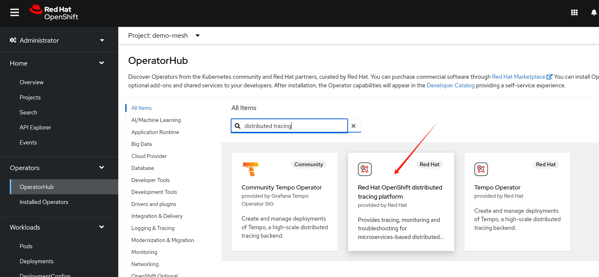
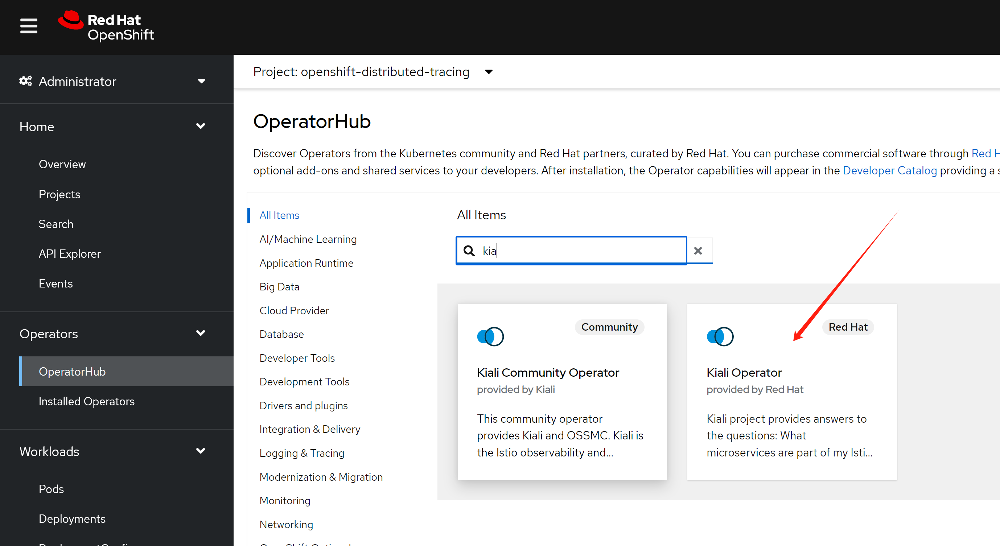
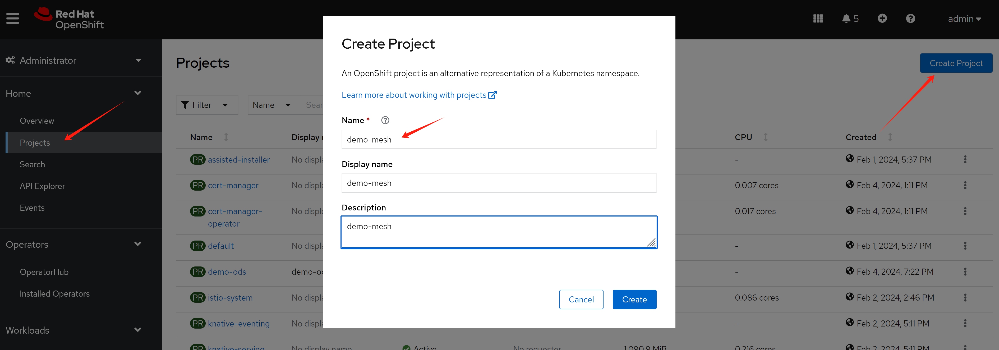
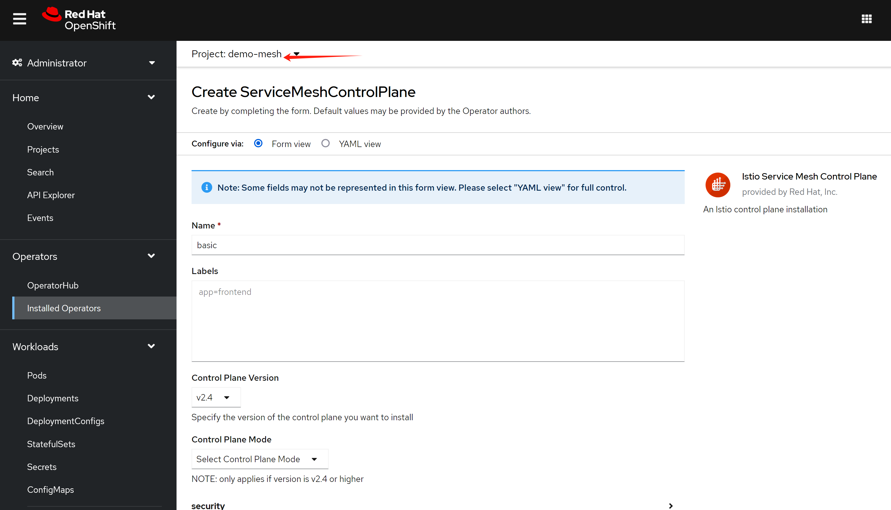
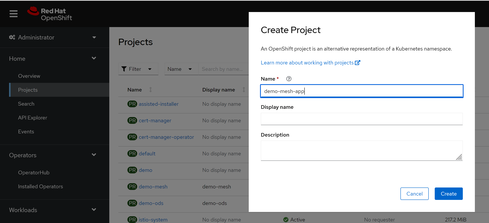
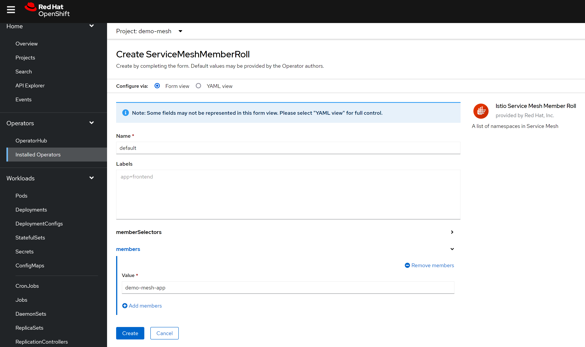
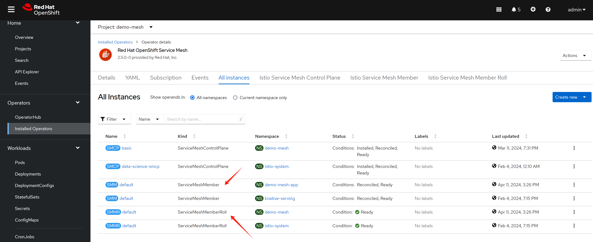
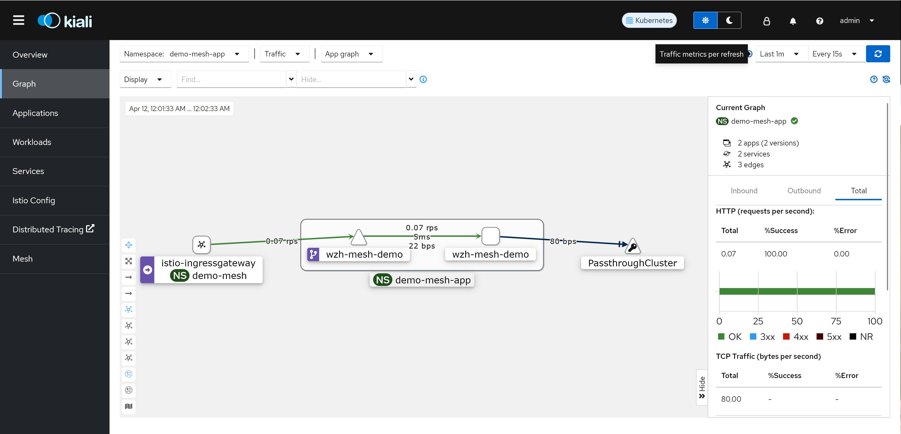
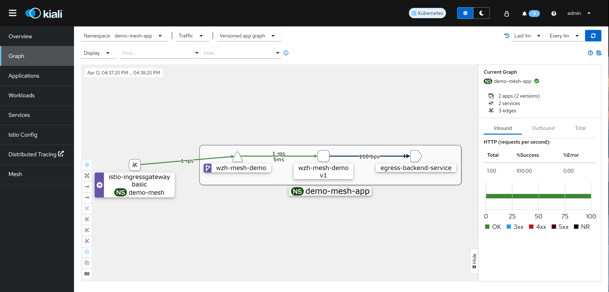

# openshift 4.14 service mesh, serverless 网络原理分析

serverless是架在service mesh上面的，在ocp上面，他们又都是在ovs/ovn上面的，我们就来全面的分析一下包从集群外面，进入到应用pod的全过程。

# install service mesh

我们先安装service mesh

install Red Hat OpenShift distributed tracing platform (Jaeger)



install Kiali Operator provided by Red Hat



创建一个新的项目，用于我们的实验



我们创建一个新的service mesh control plan，我们看到，之前做ocp ai的实验，已经在istio-system里面创建了一个control plan了，我们这里创建一个新的，就只能在另外一个project里面啦，两个应该不冲突。



```bash
oc get pod -n demo-mesh
# NAME                                    READY   STATUS    RESTARTS   AGE
# grafana-856ccf659b-8gqhk                2/2     Running   0          19m
# istio-egressgateway-6549f5468c-s6k7f    1/1     Running   0          19m
# istio-ingressgateway-568c968dcb-rbn9l   1/1     Running   0          19m
# istiod-basic-749957c75c-ctx6z           1/1     Running   0          20m
# jaeger-5cd7d5c595-qlx4m                 2/2     Running   0          19m
# kiali-75f5848d6d-mpspk                  1/1     Running   0          17m
# prometheus-79d5fccbc5-mqpwp             3/3     Running   0          20m

```

create new project, demo-mesh-app



create service mesh member roll



it will automatically create service mesh member



let's create gateway

- https://docs.openshift.com/container-platform/4.14/service_mesh/v2x/ossm-traffic-manage.html


```bash

cat << EOF > ${BASE_DIR}/data/install/istio-gateway.yaml
---
apiVersion: networking.istio.io/v1alpha3
kind: Gateway
metadata:
  name: gateway-demo-mesh
spec:
  selector:
    istio: ingressgateway # use istio default controller
  servers:
  - port:
      number: 80
      name: http
      protocol: HTTP
    hosts:
    - wzh-mesh-demo.mesh-test-app.wzhlab.top
EOF

oc create --save-config -n demo-mesh-app -f ${BASE_DIR}/data/install/istio-gateway.yaml

# oc delete -n demo-mesh-app -f ${BASE_DIR}/data/install/istio-gateway.yaml


```

then, let's create virtual service

```bash

cat << EOF > ${BASE_DIR}/data/install/istio-virtual-service.yaml
---
apiVersion: networking.istio.io/v1alpha3
kind: VirtualService
metadata:
  name: wzh-mesh-demo
spec:
  hosts: 
    - wzh-mesh-demo.mesh-test-app.wzhlab.top
  gateways:
    - gateway-demo-mesh
  http:
  - route:
    - destination:
        host: wzh-mesh-demo.demo-mesh-app.svc.cluster.local
        subset: default

---
apiVersion: networking.istio.io/v1alpha3
kind: DestinationRule
metadata:
  name: wzh-mesh-demo
spec:
  host: 'wzh-mesh-demo.demo-mesh-app.svc.cluster.local'
  subsets:
  - name: default
    labels:
      version: v1


EOF

oc create --save-config -n demo-mesh-app -f ${BASE_DIR}/data/install/istio-virtual-service.yaml

# oc delete -n demo-mesh-app -f ${BASE_DIR}/data/install/istio-virtual-service.yaml

```

finally, lets create application

```bash

cat << EOF > ${BASE_DIR}/data/install/istio-app.yaml
---
apiVersion: v1
kind: Service
metadata:
  name: wzh-mesh-demo
spec:
  ports:
    - name: http-port
      port: 80
      protocol: TCP
      targetPort: 13000
  selector:
    app: wzh-mesh-demo

---
apiVersion: apps/v1
kind: Deployment
metadata:
  name: wzh-mesh-demo
  labels:
    app: wzh-mesh-demo
spec:
  replicas: 1
  selector:
    matchLabels:
      app: wzh-mesh-demo
  template:
    metadata:
      annotations:
        sidecar.istio.io/inject: 'true'
      labels:
        app: wzh-mesh-demo
        version: v1
    spec:
      containers:
        - image: quay.io/wangzheng422/qimgs:rocky9-test
          imagePullPolicy: IfNotPresent
          name: wzh-mesh-demo
          command: [ "/bin/bash", "-c", "--" ]
          args: [ "nohup python3 -m http.server 13000 & while true; do curl http://172.21.6.8:13000; sleep 1; done;" ]
          ports:
            - containerPort: 13000

EOF

oc create --save-config -n demo-mesh-app -f ${BASE_DIR}/data/install/istio-app.yaml

# oc delete -n demo-mesh-app -f ${BASE_DIR}/data/install/istio-app.yaml

```

open kiali console, you can see, out of cluster traffic is not recorded, you do not know RTT.




- [How to configure egressIP for Service Mesh Istio EgressGateway](https://access.redhat.com/solutions/5223041)
- [How to configure OpenShift Service Mesh with Mutual TLS EgressGateway Origination with an Egress Router in DNS proxy mode](https://access.redhat.com/articles/6891491)
- [Egress Gateways](https://istio.io/latest/docs/tasks/traffic-management/egress/egress-gateway/)

setting egress gateway and egress ip

```bash

cat << EOF > ${BASE_DIR}/data/install/istio-egress-gateway.yaml
---
apiVersion: networking.istio.io/v1alpha3
kind: ServiceEntry
metadata:
  name: egress-backend-service
spec:
  hosts:
  - 'egress-demo-back-service.static.wzhlab.top' # result to 172.21.6.8
  location: MESH_EXTERNAL
  ports:
  - number: 13000
    name: tcp-port
    protocol: TCP
  resolution: DNS

---
apiVersion: networking.istio.io/v1alpha3
kind: Gateway
metadata:
  name: istio-egressgateway
spec:
  selector:
    istio: egressgateway
  servers:
  - port:
      number: 13000
      name: tcp
      protocol: TCP
    hosts:
    - egress-demo-back-service.static.wzhlab.top 

---
apiVersion: networking.istio.io/v1alpha3
kind: DestinationRule
metadata:
  name: egressgateway-for-cnn
spec:
  host: istio-egressgateway.demo-mesh.svc.cluster.local
  # subsets:
  # - name: default

---
apiVersion: networking.istio.io/v1alpha3
kind: VirtualService
metadata:
  name: egress-backend-service
spec:
  hosts:
  - egress-demo-back-service.static.wzhlab.top 
  gateways:
  - istio-egressgateway
  tcp:
  - match:
    - port: 13000
    route:
    - destination:
        host: egress-demo-back-service.static.wzhlab.top 
        port:
          number: 13000
      weight: 100

EOF

oc create -n demo-mesh-app -f ${BASE_DIR}/data/install/istio-egress-gateway.yaml

# oc delete -n demo-mesh-app -f ${BASE_DIR}/data/install/istio-egress-gateway.yaml

```

create the service mesh app again

```bash


cat << EOF > ${BASE_DIR}/data/install/istio-app.yaml
---
apiVersion: v1
kind: Service
metadata:
  name: wzh-mesh-demo
spec:
  ports:
    - name: http-port
      port: 80
      protocol: TCP
      targetPort: 13000
  selector:
    app: wzh-mesh-demo

---
apiVersion: apps/v1
kind: Deployment
metadata:
  name: wzh-mesh-demo
  labels:
    app: wzh-mesh-demo
spec:
  replicas: 1
  selector:
    matchLabels:
      app: wzh-mesh-demo
  template:
    metadata:
      annotations:
        sidecar.istio.io/inject: 'true'
      labels:
        app: wzh-mesh-demo
        version: v1
    spec:
      containers:
        - image: quay.io/wangzheng422/qimgs:rocky9-test
          imagePullPolicy: IfNotPresent
          name: wzh-mesh-demo
          command: [ "/bin/bash", "-c", "--" ]
          args: [ "nohup python3 -m http.server 13000 & while true; do curl http://egress-demo-back-service.static.wzhlab.top:13000; sleep 1; done;" ]
          ports:
            - containerPort: 13000

EOF

oc create --save-config -n demo-mesh-app -f ${BASE_DIR}/data/install/istio-app.yaml

# oc delete -n demo-mesh-app -f ${BASE_DIR}/data/install/istio-app.yaml


# on 6.102
while true; do curl http://wzh-mesh-demo.mesh-test-app.wzhlab.top/; sleep 1; done;

```

it turn out, using egress gateway, we still can not get RTT.



so, service mesh is not suitable for RTT observ.

# end