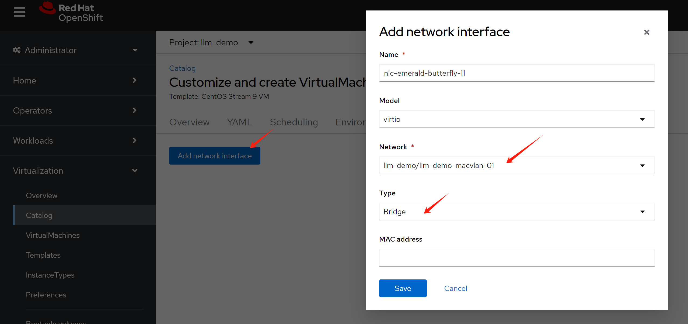
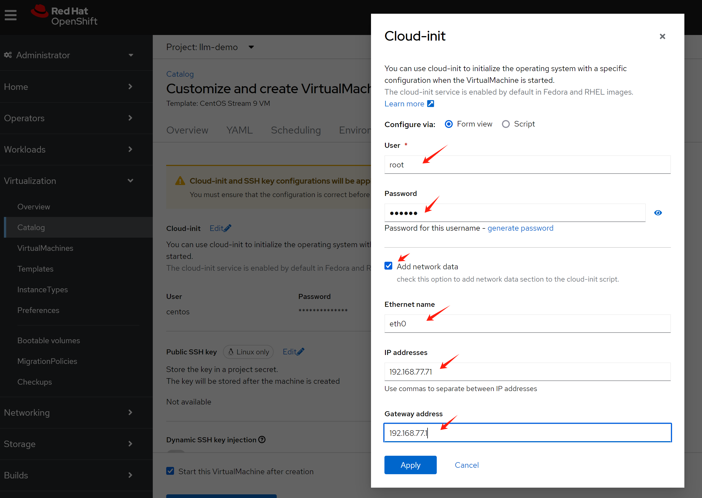
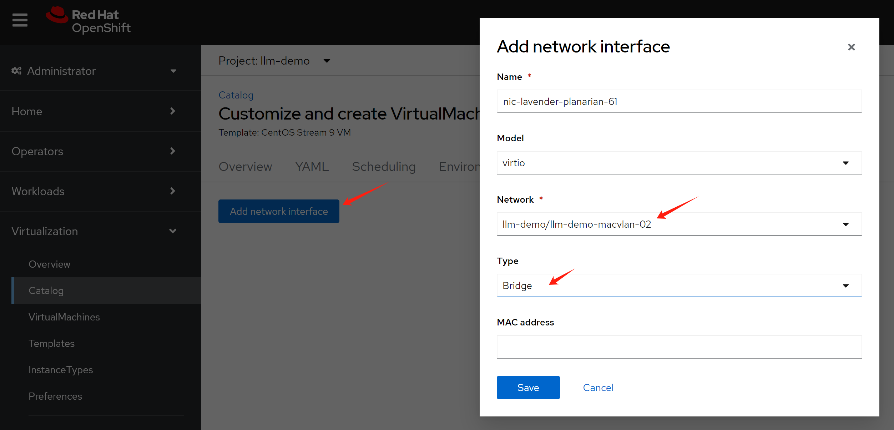
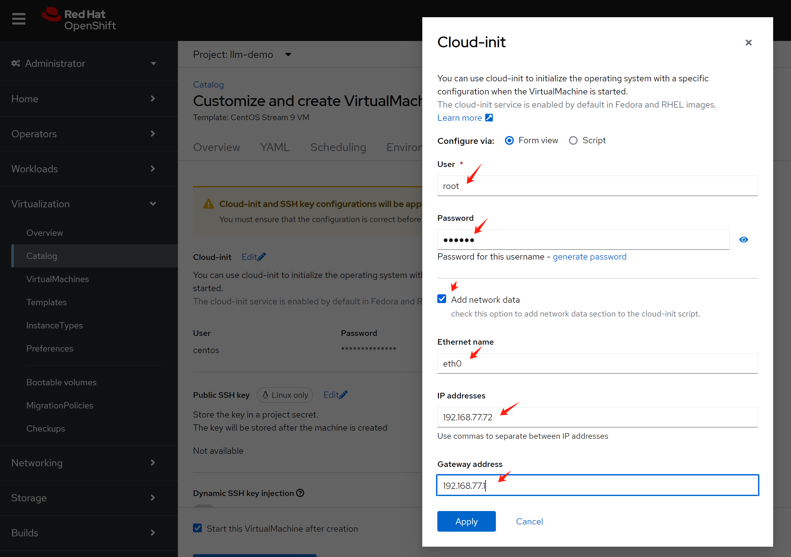

# openshift 4.15 multi-network policy with macvlan on 2nd network


# macvlan on 2nd network, first cluster

- https://docs.openshift.com/container-platform/4.16/networking/multiple_networks/configuring-additional-network.html#configuration-ovnk-additional-networks_configuring-additional-network


install NMState operator first


create a deployment with default setting.


```bash

oc delete -f ${BASE_DIR}/data/install/macvlan.conf

var_namespace='llm-demo'
cat << EOF > ${BASE_DIR}/data/install/macvlan.conf
---
apiVersion: k8s.cni.cncf.io/v1
kind: NetworkAttachmentDefinition
metadata:
  name: $var_namespace-macvlan-01
  namespace: $var_namespace
spec:
  config: |- 
    {
      "cniVersion": "0.3.1",
      "name": "$var_namespace-macvlan-01",
      "type": "macvlan",
      "master": "enp9s0",
      "linkInContainer": false,
      "mode": "bridge",
      "ipam": {
        "type": "static",
          "addresses": [
            {
              "address": "192.168.77.91/24",
              "_gateway": "1.1.1.1"
            }
          ]
      }
    }

---
apiVersion: k8s.cni.cncf.io/v1
kind: NetworkAttachmentDefinition
metadata:
  name: $var_namespace-macvlan-02
  namespace: $var_namespace
spec:
  config: |- 
    {
      "cniVersion": "0.3.1",
      "name": "$var_namespace-macvlan-02",
      "type": "macvlan",
      "master": "enp9s0",
      "linkInContainer": false,
      "mode": "bridge",
      "ipam": {
        "type": "static",
          "addresses": [
            {
              "address": "192.168.77.92/24",
              "_gateway": "1.1.1.1"
            }
          ]
      }
    }

---
apiVersion: k8s.cni.cncf.io/v1
kind: NetworkAttachmentDefinition
metadata:
  name: $var_namespace-macvlan-03
  namespace: $var_namespace
spec:
  config: |- 
    {
      "cniVersion": "0.3.1",
      "name": "$var_namespace-macvlan-03",
      "type": "macvlan",
      "master": "enp9s0",
      "linkInContainer": false,
      "mode": "bridge",
      "ipam": {
        "type": "static",
          "addresses": [
            {
              "address": "192.168.77.93/24",
              "_gateway": "1.1.1.1"
            }
          ]
      }
    }
EOF

oc apply -f ${BASE_DIR}/data/install/macvlan.conf

```

## try with pod

```bash

oc delete -f ${BASE_DIR}/data/install/pod.yaml

var_namespace='llm-demo'
cat << EOF > ${BASE_DIR}/data/install/pod.yaml
---
apiVersion: v1
kind: Pod
metadata:
  annotations:
    k8s.v1.cni.cncf.io/networks: '[
      {
        "name": "$var_namespace-macvlan-01", 
        "_mac": "02:03:04:05:06:07", 
        "_interface": "myiface1", 
        "_ips": [
          "192.168.99.91/24"
          ] 
      }
    ]'
  name: tinypod
  namespace: $var_namespace
  labels:
    app: tinypod
spec:
  containers:
  - image: quay.io/wangzheng422/qimgs:rocky9-test-2024.06.17.v01
    imagePullPolicy: IfNotPresent
    name: agnhost-container
    command: [ "/bin/bash", "-c", "--" ]
    args: [ "tail -f /dev/null" ]

---
apiVersion: v1
kind: Pod
metadata:
  annotations:
    k8s.v1.cni.cncf.io/networks: '[
      {
        "name": "$var_namespace-macvlan-02", 
        "_mac": "02:03:04:05:06:07", 
        "_interface": "myiface1", 
        "_ips": [
          "192.168.99.92/24"
          ] 
      }
    ]'
  name: tinypod-01
  namespace: $var_namespace
  labels:
    app: tinypod-01
spec:
  containers:
  - image: quay.io/wangzheng422/qimgs:rocky9-test-2024.06.17.v01
    imagePullPolicy: IfNotPresent
    name: agnhost-container
    command: [ "/bin/bash", "-c", "--" ]
    args: [ "tail -f /dev/null" ]

---
apiVersion: v1
kind: Pod
metadata:
  annotations:
    k8s.v1.cni.cncf.io/networks: '[
      {
        "name": "$var_namespace-macvlan-03", 
        "_mac": "02:03:04:05:06:07", 
        "_interface": "myiface1", 
        "_ips": [
          "192.168.99.93/24"
          ] 
      }
    ]'
  name: tinypod-02
  namespace: $var_namespace
  labels:
    app: tinypod-02
spec:
  containers:
  - image: quay.io/wangzheng422/qimgs:rocky9-test-2024.06.17.v01
    imagePullPolicy: IfNotPresent
    name: agnhost-container
    command: [ "/bin/bash", "-c", "--" ]
    args: [ "tail -f /dev/null" ]
EOF


oc apply -f ${BASE_DIR}/data/install/pod.yaml

# testing with ping to another pod
oc exec -it tinypod -- ping 192.168.77.92
# PING 192.168.77.92 (192.168.77.92) 56(84) bytes of data.
# 64 bytes from 192.168.77.92: icmp_seq=1 ttl=64 time=0.411 ms
# 64 bytes from 192.168.77.92: icmp_seq=2 ttl=64 time=0.114 ms
# ....

# testing with ping to another vm
oc exec -it tinypod -- ping 192.168.77.10
# PING 192.168.77.10 (192.168.77.10) 56(84) bytes of data.
# 64 bytes from 192.168.77.10: icmp_seq=1 ttl=64 time=1.09 ms
# 64 bytes from 192.168.77.10: icmp_seq=2 ttl=64 time=0.310 ms
# ....

# ping to outside world through default network
oc exec -it tinypod -- ping 8.8.8.8
# PING 8.8.8.8 (8.8.8.8) 56(84) bytes of data.
# 64 bytes from 8.8.8.8: icmp_seq=1 ttl=114 time=1.26 ms
# 64 bytes from 8.8.8.8: icmp_seq=2 ttl=114 time=0.795 ms
# ......

# trace the path to 8.8.8.8, we can see it goes through default network
oc exec -it tinypod -- tracepath -4 -n 8.8.8.8
#  1?: [LOCALHOST]                      pmtu 1400
#  1:  8.8.8.8                                               0.772ms asymm  2
#  1:  8.8.8.8                                               0.328ms asymm  2
#  2:  100.64.0.2                                            0.518ms asymm  3
#  3:  192.168.99.1                                          0.758ms
#  4:  169.254.77.1                                          0.605ms
#  5:  10.253.38.104                                         0.561ms
#  6:  10.253.37.232                                         0.563ms
#  7:  10.253.37.194                                         0.732ms asymm  8
#  8:  147.28.130.14                                         0.983ms
#  9:  198.16.4.121                                          0.919ms asymm 13
# 10:  no reply
# ....

oc exec -it tinypod -- ip a
# 1: lo: <LOOPBACK,UP,LOWER_UP> mtu 65536 qdisc noqueue state UNKNOWN group default qlen 1000
#     link/loopback 00:00:00:00:00:00 brd 00:00:00:00:00:00
#     inet 127.0.0.1/8 scope host lo
#        valid_lft forever preferred_lft forever
#     inet6 ::1/128 scope host
#        valid_lft forever preferred_lft forever
# 2: eth0@if216: <BROADCAST,MULTICAST,UP,LOWER_UP> mtu 1400 qdisc noqueue state UP group default
#     link/ether 0a:58:0a:84:00:ad brd ff:ff:ff:ff:ff:ff link-netnsid 0
#     inet 10.132.0.173/23 brd 10.132.1.255 scope global eth0
#        valid_lft forever preferred_lft forever
#     inet6 fe80::858:aff:fe84:ad/64 scope link
#        valid_lft forever preferred_lft forever
# 3: net1@if4: <BROADCAST,MULTICAST,UP,LOWER_UP> mtu 1500 qdisc noqueue state UP group default
#     link/ether ce:78:59:8b:98:06 brd ff:ff:ff:ff:ff:ff link-netnsid 0
#     inet 192.168.77.91/24 brd 192.168.77.255 scope global net1
#        valid_lft forever preferred_lft forever
#     inet6 fe80::cc78:59ff:fe8b:9806/64 scope link
#        valid_lft forever preferred_lft forever

oc exec -it tinypod -- ip a show type veth
# 2: eth0@if216: <BROADCAST,MULTICAST,UP,LOWER_UP> mtu 1400 qdisc noqueue state UP group default
#     link/ether 0a:58:0a:84:00:ad brd ff:ff:ff:ff:ff:ff link-netnsid 0
#     inet 10.132.0.173/23 brd 10.132.1.255 scope global eth0
#        valid_lft forever preferred_lft forever
#     inet6 fe80::858:aff:fe84:ad/64 scope link
#        valid_lft forever preferred_lft forever

oc exec -it tinypod -- ip a show type macvlan
# 3: net1@if4: <BROADCAST,MULTICAST,UP,LOWER_UP> mtu 1500 qdisc noqueue state UP group default
#     link/ether ce:78:59:8b:98:06 brd ff:ff:ff:ff:ff:ff link-netnsid 0
#     inet 192.168.77.91/24 brd 192.168.77.255 scope global net1
#        valid_lft forever preferred_lft forever
#     inet6 fe80::cc78:59ff:fe8b:9806/64 scope link
#        valid_lft forever preferred_lft forever

# on ocp host
ip a show dev if4
# 4: enp9s0: <BROADCAST,MULTICAST,UP,LOWER_UP> mtu 1500 qdisc fq_codel state UP group default qlen 1000
#     link/ether 52:54:00:bc:f5:56 brd ff:ff:ff:ff:ff:ff
#     inet 192.168.77.23/24 brd 192.168.77.255 scope global noprefixroute enp9s0
#        valid_lft forever preferred_lft forever
#     inet6 fe80::80ae:f30c:9fd9:9c67/64 scope link noprefixroute
#        valid_lft forever preferred_lft forever

ip a show dev if216
# 216: 8ac550d6da10f47@if2: <BROADCAST,MULTICAST,UP,LOWER_UP> mtu 1400 qdisc noqueue master ovs-system state UP group default
#     link/ether 16:77:93:00:41:41 brd ff:ff:ff:ff:ff:ff link-netns 23968fbb-4e3a-4917-b188-700b032d1706
#     inet6 fe80::1477:93ff:fe00:4141/64 scope link
#        valid_lft forever preferred_lft forever

oc exec -it tinypod -- ip r
# default via 10.132.0.1 dev eth0
# 10.132.0.0/23 dev eth0 proto kernel scope link src 10.132.0.173
# 10.132.0.0/14 via 10.132.0.1 dev eth0
# 100.64.0.0/16 via 10.132.0.1 dev eth0
# 172.22.0.0/16 via 10.132.0.1 dev eth0
# 192.168.77.0/24 dev net1 proto kernel scope link src 192.168.77.91

```

# try with multi-network policy


```bash
# enable multi-network policy in cluster level
cat << EOF > ${BASE_DIR}/data/install/multi-network-policy.yaml
apiVersion: operator.openshift.io/v1
kind: Network
metadata:
  name: cluster
spec:
  useMultiNetworkPolicy: true
EOF

oc patch network.operator.openshift.io cluster --type=merge --patch-file=${BASE_DIR}/data/install/multi-network-policy.yaml


# if you want to revert back
cat << EOF > ${BASE_DIR}/data/install/multi-network-policy.yaml
apiVersion: operator.openshift.io/v1
kind: Network
metadata:
  name: cluster
spec:
  useMultiNetworkPolicy: false
EOF

oc patch network.operator.openshift.io cluster --type=merge --patch-file=${BASE_DIR}/data/install/multi-network-policy.yaml


# below is add by default
# cat << EOF > ${BASE_DIR}/data/install/multi-network-policy-rules.yaml
# kind: ConfigMap
# apiVersion: v1
# metadata:
#   name: multi-networkpolicy-custom-rules
#   namespace: openshift-multus
# data:

#   custom-v6-rules.txt: |
#     # accept NDP
#     -p icmpv6 --icmpv6-type neighbor-solicitation -j ACCEPT 
#     -p icmpv6 --icmpv6-type neighbor-advertisement -j ACCEPT 
#     # accept RA/RS
#     -p icmpv6 --icmpv6-type router-solicitation -j ACCEPT 
#     -p icmpv6 --icmpv6-type router-advertisement -j ACCEPT 
# EOF

# oc delete -f ${BASE_DIR}/data/install/multi-network-policy-rules.yaml

# oc apply -f ${BASE_DIR}/data/install/multi-network-policy-rules.yaml


# deny all by default
oc delete -f ${BASE_DIR}/data/install/multi-network-policy-deny-all-macvlan.yaml

var_namespace='llm-demo'
cat << EOF > ${BASE_DIR}/data/install/multi-network-policy-deny-all-macvlan.yaml
---
apiVersion: k8s.cni.cncf.io/v1beta1
kind: MultiNetworkPolicy
metadata:
  name: deny-by-default-macvlan-01
  namespace: $var_namespace
  annotations:
    k8s.v1.cni.cncf.io/policy-for: $var_namespace/$var_namespace-macvlan-01
spec:
  podSelector: {}
  policyTypes:
  - Ingress
  - Egress
  ingress: []
  egress: []

---
apiVersion: k8s.cni.cncf.io/v1beta1
kind: MultiNetworkPolicy
metadata:
  name: deny-by-default-macvlan-02
  namespace: $var_namespace
  annotations:
    k8s.v1.cni.cncf.io/policy-for: $var_namespace/$var_namespace-macvlan-02
spec:
  podSelector: {}
  policyTypes:
  - Ingress
  - Egress
  ingress: []
  egress: []

---
apiVersion: k8s.cni.cncf.io/v1beta1
kind: MultiNetworkPolicy
metadata:
  name: deny-by-default-macvlan-03
  namespace: $var_namespace
  annotations:
    k8s.v1.cni.cncf.io/policy-for: $var_namespace/$var_namespace-macvlan-03
spec:
  podSelector: {}
  policyTypes:
  - Ingress
  - Egress
  ingress: []
  egress: [] 

EOF

oc apply -f ${BASE_DIR}/data/install/multi-network-policy-deny-all-macvlan.yaml


# get pod ip of tinypod-01
ANOTHER_TINYPOD_IP=$(oc get pod tinypod-01 -o=jsonpath='{.status.podIP}')

echo $ANOTHER_TINYPOD_IP
# 10.132.0.174

# testing with ping to another pod using default network eth0
oc exec -it tinypod -- ping $ANOTHER_TINYPOD_IP
# PING 10.132.0.174 (10.132.0.174) 56(84) bytes of data.
# 64 bytes from 10.132.0.174: icmp_seq=1 ttl=64 time=0.618 ms
# 64 bytes from 10.132.0.174: icmp_seq=2 ttl=64 time=0.283 ms
# 64 bytes from 10.132.0.174: icmp_seq=3 ttl=64 time=0.113 ms
# ^C
# --- 10.132.0.174 ping statistics ---
# 3 packets transmitted, 3 received, 0% packet loss, time 2070ms
# rtt min/avg/max/mdev = 0.113/0.338/0.618/0.209 ms


# testing with ping to another pod using 2nd network net1
oc exec -it tinypod -- ping 192.168.77.92
# PING 192.168.77.92 (192.168.77.92) 56(84) bytes of data.
# ^C
# --- 192.168.77.92 ping statistics ---
# 30 packets transmitted, 0 received, 100% packet loss, time 29721ms

# testing with ping to another vm
# notice, here we can not ping the vm
oc exec -it tinypod -- ping 192.168.77.10
# PING 192.168.77.10 (192.168.77.10) 56(84) bytes of data.
# ^C
# --- 192.168.77.10 ping statistics ---
# 4 packets transmitted, 0 received, 100% packet loss, time 3091ms

# it still can ping to outside world through default network
oc exec -it tinypod -- ping 8.8.8.8
# PING 8.8.8.8 (8.8.8.8) 56(84) bytes of data.
# 64 bytes from 8.8.8.8: icmp_seq=1 ttl=114 time=1.69 ms
# 64 bytes from 8.8.8.8: icmp_seq=2 ttl=114 time=1.27 ms
# .....


# get pod ip of tinypod
ANOTHER_TINYPOD_IP=$(oc get pod tinypod -o=jsonpath='{.status.podIP}')

echo $ANOTHER_TINYPOD_IP
# 10.132.1.31

# testing with ping to another pod using default network eth0
oc exec -it tinypod-01 -- ping $ANOTHER_TINYPOD_IP
# PING 10.132.1.31 (10.132.1.31) 56(84) bytes of data.
# 64 bytes from 10.132.1.31: icmp_seq=1 ttl=64 time=0.725 ms
# 64 bytes from 10.132.1.31: icmp_seq=2 ttl=64 time=1.09 ms
# 64 bytes from 10.132.1.31: icmp_seq=3 ttl=64 time=0.080 ms
# ^C
# --- 10.132.1.31 ping statistics ---
# 3 packets transmitted, 3 received, 0% packet loss, time 2047ms
# rtt min/avg/max/mdev = 0.080/0.631/1.088/0.416 ms

# testing with ping to another pod using 2nd network net1
oc exec -it tinypod-01 -- ping 192.168.77.91
# PING 192.168.77.91 (192.168.77.91) 56(84) bytes of data.
# ^C
# --- 192.168.77.91 ping statistics ---
# 30 packets transmitted, 0 received, 100% packet loss, time 29707ms


# openshift use iptables to implement the multi-network policy
# on the openshift node, run nft in the container namespace
# first get the pod's container's id
oc get pod tinypod -o jsonpath='{.status.containerStatuses[0].containerID}' | cut -d '/' -f 3
# fa2155c284e5b36009ccc9495e439d5b4f7338eae1455dded71c922a0fea7505

# oc describe pod tinypod | grep 'Container ID'
    # Container ID:  cri-o://eb6c6b8e36258e0df69bca33b10ee634514ea60cf08ac12ecc83bce87a313306

# on ocp node
# network_namespace_path=`crictl inspect eb6c6b8e36258e0df69bca33b10ee634514ea60cf08ac12ecc83bce87a313306 | jq -r '.info.runtimeSpec.linux.namespaces[] | select( .type == "network" ) | .path' `

# namespace_id=$(echo "$network_namespace_path" | grep -oP '/var/run/\w+ns/\K[^"]+' )

# ip netns exec $namespace_id nft list ruleset

# on ocp node
target_pid=`crictl inspect fa2155c284e5b36009ccc9495e439d5b4f7338eae1455dded71c922a0fea7505 | jq -r '.info.pid' `

echo $target_pid

nsenter -t $target_pid -n ip a
# 1: lo: <LOOPBACK,UP,LOWER_UP> mtu 65536 qdisc noqueue state UNKNOWN group default qlen 1000
#     link/loopback 00:00:00:00:00:00 brd 00:00:00:00:00:00
#     inet 127.0.0.1/8 scope host lo
#        valid_lft forever preferred_lft forever
#     inet6 ::1/128 scope host
#        valid_lft forever preferred_lft forever
# 2: eth0@if17: <BROADCAST,MULTICAST,UP,LOWER_UP> mtu 1400 qdisc noqueue state UP group default
#     link/ether 0a:58:0a:84:01:1f brd ff:ff:ff:ff:ff:ff link-netns d0e1469f-49ea-4952-b5ef-01f5bbf88b56
#     inet 10.132.1.31/23 brd 10.132.1.255 scope global eth0
#        valid_lft forever preferred_lft forever
#     inet6 fe80::858:aff:fe84:11f/64 scope link
#        valid_lft forever preferred_lft forever
# 3: net1@if4: <BROADCAST,MULTICAST,UP,LOWER_UP> mtu 1500 qdisc noqueue state UP group default
#     link/ether 2e:96:3e:ab:71:58 brd ff:ff:ff:ff:ff:ff link-netns d0e1469f-49ea-4952-b5ef-01f5bbf88b56
#     inet 192.168.77.91/24 brd 192.168.77.255 scope global net1
#        valid_lft forever preferred_lft forever
#     inet6 fe80::2c96:3eff:feab:7158/64 scope link
#        valid_lft forever preferred_lft forever

nsenter -t $target_pid -n nft list ruleset
# table ip filter {
#         chain INPUT {
#                 type filter hook input priority filter; policy accept;
#                 iifname "net1" counter packets 0 bytes 0 jump MULTI-INGRESS
#         }

#         chain FORWARD {
#                 type filter hook forward priority filter; policy accept;
#                 tcp flags syn / fin,syn,rst,ack tcp dport 22623 counter packets 0 bytes 0 reject
#                 tcp flags syn / fin,syn,rst,ack tcp dport 22624 counter packets 0 bytes 0 reject
#                 ip daddr 169.254.169.254 tcp dport != 53 counter packets 0 bytes 0 reject
#                 ip daddr 169.254.169.254 udp dport != 53 counter packets 0 bytes 0 reject
#         }

#         chain OUTPUT {
#                 type filter hook output priority filter; policy accept;
#                 oifname "net1" counter packets 0 bytes 0 jump MULTI-EGRESS
#                 tcp flags syn / fin,syn,rst,ack tcp dport 22623 counter packets 0 bytes 0 reject
#                 tcp flags syn / fin,syn,rst,ack tcp dport 22624 counter packets 0 bytes 0 reject
#                 ip daddr 169.254.169.254 tcp dport != 53 counter packets 0 bytes 0 reject
#                 ip daddr 169.254.169.254 udp dport != 53 counter packets 0 bytes 0 reject
#         }

#         chain MULTI-INGRESS {
#                 counter packets 0 bytes 0 jump MULTI-INGRESS-COMMON
#                 iifname "net1"  counter packets 0 bytes 0 jump MULTI-0-INGRESS
#                 meta mark & 0x00030000 == 0x00030000 counter packets 0 bytes 0 return
#                 counter packets 0 bytes 0 drop
#         }

#         chain MULTI-EGRESS {
#                 counter packets 0 bytes 0 jump MULTI-EGRESS-COMMON
#                 oifname "net1"  counter packets 0 bytes 0 jump MULTI-0-EGRESS
#                 meta mark & 0x00030000 == 0x00030000 counter packets 0 bytes 0 return
#                 counter packets 0 bytes 0 drop
#         }

#         chain MULTI-INGRESS-COMMON {
#                 ct state related,established counter packets 0 bytes 0 accept
#         }

#         chain MULTI-EGRESS-COMMON {
#                 ct state related,established counter packets 0 bytes 0 accept
#         }

#         chain MULTI-0-INGRESS {
#         }

#         chain MULTI-0-EGRESS {
#         }
# }
# table ip nat {
#         chain PREROUTING {
#                 type nat hook prerouting priority dstnat; policy accept;
#                 iifname "net1" counter packets 0 bytes 0 return
#         }
# }
# table ip6 filter {
#         chain MULTI-INGRESS {
#                 counter packets 0 bytes 0 jump MULTI-INGRESS-COMMON
#                 iifname "net1"  counter packets 0 bytes 0 jump MULTI-0-INGRESS
#                 meta mark & 0x00030000 == 0x00030000 counter packets 0 bytes 0 return
#                 counter packets 0 bytes 0 drop
#         }

#         chain MULTI-EGRESS {
#                 counter packets 0 bytes 0 jump MULTI-EGRESS-COMMON
#                 oifname "net1"  counter packets 0 bytes 0 jump MULTI-0-EGRESS
#                 meta mark & 0x00030000 == 0x00030000 counter packets 0 bytes 0 return
#                 counter packets 0 bytes 0 drop
#         }

#         chain MULTI-INGRESS-COMMON {
#                 meta l4proto ipv6-icmp icmpv6 type nd-neighbor-solicit counter packets 0 bytes 0 accept
#                 meta l4proto ipv6-icmp icmpv6 type nd-neighbor-advert counter packets 0 bytes 0 accept
#                 meta l4proto ipv6-icmp icmpv6 type nd-router-solicit counter packets 0 bytes 0 accept
#                 meta l4proto ipv6-icmp icmpv6 type nd-router-advert counter packets 0 bytes 0 accept
#                 ct state related,established counter packets 0 bytes 0 accept
#         }

#         chain MULTI-EGRESS-COMMON {
#                 meta l4proto ipv6-icmp icmpv6 type nd-neighbor-solicit counter packets 0 bytes 0 accept
#                 meta l4proto ipv6-icmp icmpv6 type nd-neighbor-advert counter packets 0 bytes 0 accept
#                 meta l4proto ipv6-icmp icmpv6 type nd-router-solicit counter packets 0 bytes 0 accept
#                 meta l4proto ipv6-icmp icmpv6 type nd-router-advert counter packets 0 bytes 0 accept
#                 ct state related,established counter packets 0 bytes 0 accept
#         }

#         chain INPUT {
#                 type filter hook input priority filter; policy accept;
#                 iifname "net1" counter packets 1 bytes 72 jump MULTI-INGRESS
#         }

#         chain OUTPUT {
#                 type filter hook output priority filter; policy accept;
#                 oifname "net1" counter packets 4 bytes 224 jump MULTI-EGRESS
#         }

#         chain MULTI-0-INGRESS {
#         }

#         chain MULTI-0-EGRESS {
#         }
# }
# table ip6 nat {
#         chain PREROUTING {
#                 type nat hook prerouting priority dstnat; policy accept;
#                 iifname "net1" counter packets 0 bytes 0 return
#         }
# }

nsenter -t $target_pid -n iptables -L -v -n
# Chain INPUT (policy ACCEPT 2 packets, 168 bytes)
#  pkts bytes target     prot opt in     out     source               destination
#     0     0 MULTI-INGRESS  all  --  net1   *       0.0.0.0/0            0.0.0.0/0

# Chain FORWARD (policy ACCEPT 0 packets, 0 bytes)
#  pkts bytes target     prot opt in     out     source               destination
#     0     0 REJECT     tcp  --  *      *       0.0.0.0/0            0.0.0.0/0            tcp dpt:22623 flags:0x17/0x02 reject-with icmp-port-unreachable
#     0     0 REJECT     tcp  --  *      *       0.0.0.0/0            0.0.0.0/0            tcp dpt:22624 flags:0x17/0x02 reject-with icmp-port-unreachable
#     0     0 REJECT     tcp  --  *      *       0.0.0.0/0            169.254.169.254      tcp dpt:!53 reject-with icmp-port-unreachable
#     0     0 REJECT     udp  --  *      *       0.0.0.0/0            169.254.169.254      udp dpt:!53 reject-with icmp-port-unreachable

# Chain OUTPUT (policy ACCEPT 2 packets, 168 bytes)
#  pkts bytes target     prot opt in     out     source               destination
#     0     0 MULTI-EGRESS  all  --  *      net1    0.0.0.0/0            0.0.0.0/0
#     0     0 REJECT     tcp  --  *      *       0.0.0.0/0            0.0.0.0/0            tcp dpt:22623 flags:0x17/0x02 reject-with icmp-port-unreachable
#     0     0 REJECT     tcp  --  *      *       0.0.0.0/0            0.0.0.0/0            tcp dpt:22624 flags:0x17/0x02 reject-with icmp-port-unreachable
#     0     0 REJECT     tcp  --  *      *       0.0.0.0/0            169.254.169.254      tcp dpt:!53 reject-with icmp-port-unreachable
#     0     0 REJECT     udp  --  *      *       0.0.0.0/0            169.254.169.254      udp dpt:!53 reject-with icmp-port-unreachable

# Chain MULTI-0-EGRESS (1 references)
#  pkts bytes target     prot opt in     out     source               destination

# Chain MULTI-0-INGRESS (1 references)
#  pkts bytes target     prot opt in     out     source               destination

# Chain MULTI-EGRESS (1 references)
#  pkts bytes target     prot opt in     out     source               destination
#     0     0 MULTI-EGRESS-COMMON  all  --  *      *       0.0.0.0/0            0.0.0.0/0
#     0     0 MULTI-0-EGRESS  all  --  *      net1    0.0.0.0/0            0.0.0.0/0            /* policy:deny-by-default-macvlan-01 net-attach-def:llm-demo/llm-demo-macvlan-01 */
#     0     0 RETURN     all  --  *      *       0.0.0.0/0            0.0.0.0/0            mark match 0x30000/0x30000
#     0     0 DROP       all  --  *      *       0.0.0.0/0            0.0.0.0/0

# Chain MULTI-EGRESS-COMMON (1 references)
#  pkts bytes target     prot opt in     out     source               destination
#     0     0 ACCEPT     all  --  *      *       0.0.0.0/0            0.0.0.0/0            ctstate RELATED,ESTABLISHED

# Chain MULTI-INGRESS (1 references)
#  pkts bytes target     prot opt in     out     source               destination
#     0     0 MULTI-INGRESS-COMMON  all  --  *      *       0.0.0.0/0            0.0.0.0/0
#     0     0 MULTI-0-INGRESS  all  --  net1   *       0.0.0.0/0            0.0.0.0/0            /* policy:deny-by-default-macvlan-01 net-attach-def:llm-demo/llm-demo-macvlan-01 */
#     0     0 RETURN     all  --  *      *       0.0.0.0/0            0.0.0.0/0            mark match 0x30000/0x30000
#     0     0 DROP       all  --  *      *       0.0.0.0/0            0.0.0.0/0

# Chain MULTI-INGRESS-COMMON (1 references)
#  pkts bytes target     prot opt in     out     source               destination
#     0     0 ACCEPT     all  --  *      *       0.0.0.0/0            0.0.0.0/0            ctstate RELATED,ESTABLISHED

nsenter -t $target_pid -n iptables -L -v -n -t nat
# Chain PREROUTING (policy ACCEPT 0 packets, 0 bytes)
#  pkts bytes target     prot opt in     out     source               destination
#     0     0 RETURN     all  --  net1   *       0.0.0.0/0            0.0.0.0/0

# Chain INPUT (policy ACCEPT 0 packets, 0 bytes)
#  pkts bytes target     prot opt in     out     source               destination

# Chain OUTPUT (policy ACCEPT 0 packets, 0 bytes)
#  pkts bytes target     prot opt in     out     source               destination

# Chain POSTROUTING (policy ACCEPT 0 packets, 0 bytes)
#  pkts bytes target     prot opt in     out     source               destination


################################################################
# allow traffic only between tinypod and tinypod-01

oc delete -f ${BASE_DIR}/data/install/multi-network-policy-allow-some-macvlan.yaml

var_namespace='llm-demo'
cat << EOF > ${BASE_DIR}/data/install/multi-network-policy-allow-some-macvlan.yaml
---
apiVersion: k8s.cni.cncf.io/v1beta1
kind: MultiNetworkPolicy
metadata:
  name: allow-ipblock
  namespace: $var_namespace
  annotations:
    k8s.v1.cni.cncf.io/policy-for: $var_namespace-macvlan-01
spec:
  podSelector:
    matchLabels:
      app: tinypod
  policyTypes:
  - Ingress
  ingress:
  - from:
    # pod selector here does not work, do not know why
    # - podSelector:
    #     matchLabels:
    #       app: tinypod-01
    - ipBlock:
        cidr: 192.168.77.92/32
---
apiVersion: k8s.cni.cncf.io/v1beta1
kind: MultiNetworkPolicy
metadata:
  name: allow-ipblock-01
  namespace: $var_namespace
  annotations:
    k8s.v1.cni.cncf.io/policy-for: $var_namespace-macvlan-02
spec:
  podSelector:
    matchLabels:
      app: tinypod-01
  policyTypes:
  - Egress
  egress:
  - to:
    # pod selector here does not work, do not know why
    # - podSelector:
    #     matchLabels:
    #       app: tinypod
    - ipBlock:
        cidr: 192.168.77.91/32
EOF

oc apply -f ${BASE_DIR}/data/install/multi-network-policy-allow-some-macvlan.yaml


# get pod ip of tinypod-01
ANOTHER_TINYPOD_IP=$(oc get pod tinypod-01 -o=jsonpath='{.status.podIP}')

echo $ANOTHER_TINYPOD_IP
# 10.132.0.190

# testing with ping to another pod using default network eth0
oc exec -it tinypod -- ping $ANOTHER_TINYPOD_IP
# PING 10.132.0.190 (10.132.0.190) 56(84) bytes of data.
# 64 bytes from 10.132.0.190: icmp_seq=1 ttl=64 time=0.648 ms
# 64 bytes from 10.132.0.190: icmp_seq=2 ttl=64 time=0.242 ms
# 64 bytes from 10.132.0.190: icmp_seq=3 ttl=64 time=0.048 ms
# ^C
# --- 10.132.0.190 ping statistics ---
# 3 packets transmitted, 3 received, 0% packet loss, time 2071ms
# rtt min/avg/max/mdev = 0.048/0.312/0.648/0.249 ms


# testing with ping to another pod using 2nd network net1
oc exec -it tinypod -- ping 192.168.77.92
# PING 192.168.77.92 (192.168.77.92) 56(84) bytes of data.
# ^C
# --- 192.168.77.92 ping statistics ---
# 5 packets transmitted, 0 received, 100% packet loss, time 4135ms

oc exec -it tinypod -- ping 192.168.77.93
# PING 192.168.77.93 (192.168.77.93) 56(84) bytes of data.
# ^C
# --- 192.168.77.93 ping statistics ---
# 4 packets transmitted, 0 received, 100% packet loss, time 3054ms

# testing with ping to another vm
# we set the egress rule, so we can not ping vm now
oc exec -it tinypod -- ping 192.168.77.10
# PING 192.168.77.10 (192.168.77.10) 56(84) bytes of data.
# ^C
# --- 192.168.77.10 ping statistics ---
# 3 packets transmitted, 0 received, 100% packet loss, time 2085ms

# it still can ping to outside world through default network
oc exec -it tinypod -- ping 8.8.8.8
# PING 8.8.8.8 (8.8.8.8) 56(84) bytes of data.
# 64 bytes from 8.8.8.8: icmp_seq=1 ttl=114 time=1.69 ms
# 64 bytes from 8.8.8.8: icmp_seq=2 ttl=114 time=1.27 ms
# .....


# get pod ip of tinypod
ANOTHER_TINYPOD_IP=$(oc get pod tinypod -o=jsonpath='{.status.podIP}')

echo $ANOTHER_TINYPOD_IP
# 10.132.0.189

# testing with ping to another pod using default network eth0
oc exec -it tinypod-01 -- ping $ANOTHER_TINYPOD_IP
# PING 10.132.0.189 (10.132.0.189) 56(84) bytes of data.
# 64 bytes from 10.132.0.189: icmp_seq=1 ttl=64 time=0.806 ms
# 64 bytes from 10.132.0.189: icmp_seq=2 ttl=64 time=0.407 ms
# 64 bytes from 10.132.0.189: icmp_seq=3 ttl=64 time=0.067 ms
# ^C
# --- 10.132.0.189 ping statistics ---
# 3 packets transmitted, 3 received, 0% packet loss, time 2045ms
# rtt min/avg/max/mdev = 0.067/0.426/0.806/0.302 ms

# testing with ping to another pod using 2nd network net1
# you can see, we can ping to tinypod, which is allowed by multi-network policy
oc exec -it tinypod-01 -- ping 192.168.77.91
# PING 192.168.77.91 (192.168.77.91) 56(84) bytes of data.
# 64 bytes from 192.168.77.91: icmp_seq=1 ttl=64 time=0.278 ms
# 64 bytes from 192.168.77.91: icmp_seq=2 ttl=64 time=0.032 ms
# ....

oc exec -it tinypod-01 -- ping 192.168.77.93
# PING 192.168.77.93 (192.168.77.93) 56(84) bytes of data.
# ^C
# --- 192.168.77.93 ping statistics ---
# 4 packets transmitted, 0 received, 100% packet loss, time 3085ms

# testing with ping to vm
oc exec -it tinypod-01 -- ping 192.168.77.10
# PING 192.168.77.10 (192.168.77.10) 56(84) bytes of data.
# ^C
# --- 192.168.77.10 ping statistics ---
# 3 packets transmitted, 0 received, 100% packet loss, time 2069ms

# it still can ping to outside world through default network
oc exec -it tinypod-01 -- ping 8.8.8.8
# PING 8.8.8.8 (8.8.8.8) 56(84) bytes of data.
# 64 bytes from 8.8.8.8: icmp_seq=1 ttl=114 time=1.15 ms
# 64 bytes from 8.8.8.8: icmp_seq=2 ttl=114 time=0.824 ms
# ......


oc exec -it tinypod-02 -- ping 192.168.77.91
# PING 192.168.77.91 (192.168.77.91) 56(84) bytes of data.
# ^C
# --- 192.168.77.91 ping statistics ---
# 4 packets transmitted, 0 received, 100% packet loss, time 3089ms

oc exec -it tinypod-02 -- ping 192.168.77.92
# PING 192.168.77.92 (192.168.77.92) 56(84) bytes of data.
# ^C
# --- 192.168.77.92 ping statistics ---
# 4 packets transmitted, 0 received, 100% packet loss, time 3069ms

oc exec -it tinypod-02 -- ping 192.168.77.10
# PING 192.168.77.10 (192.168.77.10) 56(84) bytes of data.
# ^C
# --- 192.168.77.10 ping statistics ---
# 3 packets transmitted, 0 received, 100% packet loss, time 2067ms


oc get multi-networkpolicies -A
# NAMESPACE   NAME                         AGE
# llm-demo    allow-ipblock                44m
# llm-demo    allow-ipblock-01             44m
# llm-demo    deny-by-default-macvlan-01   49m
# llm-demo    deny-by-default-macvlan-02   49m
# llm-demo    deny-by-default-macvlan-03   49m


# openshift use iptables to implement the multi-network policy
# on the openshift node, run nft in the container namespace
# first get the pod's container's id
oc get pod tinypod -o jsonpath='{.status.containerStatuses[0].containerID}' | cut -d '/' -f 3
# fa2155c284e5b36009ccc9495e439d5b4f7338eae1455dded71c922a0fea7505

# on ocp node
target_pid=`crictl inspect fa2155c284e5b36009ccc9495e439d5b4f7338eae1455dded71c922a0fea7505 | jq -r '.info.pid' `

echo $target_pid

nsenter -t $target_pid -n iptables -L -v -n
# Chain INPUT (policy ACCEPT 16 packets, 1344 bytes)
#  pkts bytes target     prot opt in     out     source               destination
#     9   756 MULTI-INGRESS  all  --  net1   *       0.0.0.0/0            0.0.0.0/0

# Chain FORWARD (policy ACCEPT 0 packets, 0 bytes)
#  pkts bytes target     prot opt in     out     source               destination
#     0     0 REJECT     tcp  --  *      *       0.0.0.0/0            0.0.0.0/0            tcp dpt:22623 flags:0x17/0x02 reject-with icmp-port-unreachable
#     0     0 REJECT     tcp  --  *      *       0.0.0.0/0            0.0.0.0/0            tcp dpt:22624 flags:0x17/0x02 reject-with icmp-port-unreachable
#     0     0 REJECT     tcp  --  *      *       0.0.0.0/0            169.254.169.254      tcp dpt:!53 reject-with icmp-port-unreachable
#     0     0 REJECT     udp  --  *      *       0.0.0.0/0            169.254.169.254      udp dpt:!53 reject-with icmp-port-unreachable

# Chain OUTPUT (policy ACCEPT 11 packets, 924 bytes)
#  pkts bytes target     prot opt in     out     source               destination
#    35  2940 MULTI-EGRESS  all  --  *      net1    0.0.0.0/0            0.0.0.0/0
#     0     0 REJECT     tcp  --  *      *       0.0.0.0/0            0.0.0.0/0            tcp dpt:22623 flags:0x17/0x02 reject-with icmp-port-unreachable
#     0     0 REJECT     tcp  --  *      *       0.0.0.0/0            0.0.0.0/0            tcp dpt:22624 flags:0x17/0x02 reject-with icmp-port-unreachable
#     0     0 REJECT     tcp  --  *      *       0.0.0.0/0            169.254.169.254      tcp dpt:!53 reject-with icmp-port-unreachable
#     0     0 REJECT     udp  --  *      *       0.0.0.0/0            169.254.169.254      udp dpt:!53 reject-with icmp-port-unreachable

# Chain MULTI-0-INGRESS (1 references)
#  pkts bytes target     prot opt in     out     source               destination
#     0     0 MARK       all  --  *      *       0.0.0.0/0            0.0.0.0/0            MARK and 0xfffcffff
#     0     0 MULTI-0-INGRESS-0-PORTS  all  --  *      *       0.0.0.0/0            0.0.0.0/0
#     0     0 MULTI-0-INGRESS-0-FROM  all  --  *      *       0.0.0.0/0            0.0.0.0/0
#     0     0 RETURN     all  --  *      *       0.0.0.0/0            0.0.0.0/0            mark match 0x30000/0x30000

# Chain MULTI-0-INGRESS-0-FROM (1 references)
#  pkts bytes target     prot opt in     out     source               destination
#     0     0 MARK       all  --  net1   *       192.168.77.92        0.0.0.0/0            MARK or 0x20000
#     0     0 MARK       all  --  net1   *       192.168.77.91        0.0.0.0/0            MARK or 0x20000

# Chain MULTI-0-INGRESS-0-PORTS (1 references)
#  pkts bytes target     prot opt in     out     source               destination
#     0     0 MARK       all  --  *      *       0.0.0.0/0            0.0.0.0/0            /* no ingress ports, skipped */ MARK or 0x10000

# Chain MULTI-1-EGRESS (1 references)
#  pkts bytes target     prot opt in     out     source               destination

# Chain MULTI-1-INGRESS (1 references)
#  pkts bytes target     prot opt in     out     source               destination

# Chain MULTI-EGRESS (1 references)
#  pkts bytes target     prot opt in     out     source               destination
#     0     0 MULTI-EGRESS-COMMON  all  --  *      *       0.0.0.0/0            0.0.0.0/0
#     0     0 MULTI-1-EGRESS  all  --  *      net1    0.0.0.0/0            0.0.0.0/0            /* policy:deny-by-default-macvlan-01 net-attach-def:llm-demo/llm-demo-macvlan-01 */
#     0     0 RETURN     all  --  *      *       0.0.0.0/0            0.0.0.0/0            mark match 0x30000/0x30000
#     0     0 DROP       all  --  *      *       0.0.0.0/0            0.0.0.0/0

# Chain MULTI-EGRESS-COMMON (1 references)
#  pkts bytes target     prot opt in     out     source               destination
#     0     0 ACCEPT     all  --  *      *       0.0.0.0/0            0.0.0.0/0            ctstate RELATED,ESTABLISHED

# Chain MULTI-INGRESS (1 references)
#  pkts bytes target     prot opt in     out     source               destination
#     0     0 MULTI-INGRESS-COMMON  all  --  *      *       0.0.0.0/0            0.0.0.0/0
#     0     0 MULTI-0-INGRESS  all  --  net1   *       0.0.0.0/0            0.0.0.0/0            /* policy:allow-ipblock net-attach-def:llm-demo/llm-demo-macvlan-01 */
#     0     0 RETURN     all  --  *      *       0.0.0.0/0            0.0.0.0/0            mark match 0x30000/0x30000
#     0     0 MULTI-INGRESS-COMMON  all  --  *      *       0.0.0.0/0            0.0.0.0/0
#     0     0 MULTI-1-INGRESS  all  --  net1   *       0.0.0.0/0            0.0.0.0/0            /* policy:deny-by-default-macvlan-01 net-attach-def:llm-demo/llm-demo-macvlan-01 */
#     0     0 RETURN     all  --  *      *       0.0.0.0/0            0.0.0.0/0            mark match 0x30000/0x30000
#     0     0 DROP       all  --  *      *       0.0.0.0/0            0.0.0.0/0

# Chain MULTI-INGRESS-COMMON (2 references)
#  pkts bytes target     prot opt in     out     source               destination
#     0     0 ACCEPT     all  --  *      *       0.0.0.0/0            0.0.0.0/0            ctstate RELATED,ESTABLISHED
#     0     0 ACCEPT     all  --  *      *       0.0.0.0/0            0.0.0.0/0            ctstate RELATED,ESTABLISHED


# check tinypod-01
oc get pod tinypod-01 -o jsonpath='{.status.containerStatuses[0].containerID}' | cut -d '/' -f 3
# 803b8311bd6fe8dbd551a22f034fe16af61ae1d30c484d806b434bfe14442f26

# on ocp node
target_pid=`crictl inspect 803b8311bd6fe8dbd551a22f034fe16af61ae1d30c484d806b434bfe14442f26 | jq -r '.info.pid' `

echo $target_pid

nsenter -t $target_pid -n iptables -L -v -n
# Chain INPUT (policy ACCEPT 10 packets, 840 bytes)
#  pkts bytes target     prot opt in     out     source               destination
#    18  1512 MULTI-INGRESS  all  --  net1   *       0.0.0.0/0            0.0.0.0/0

# Chain FORWARD (policy ACCEPT 0 packets, 0 bytes)
#  pkts bytes target     prot opt in     out     source               destination
#     0     0 REJECT     tcp  --  *      *       0.0.0.0/0            0.0.0.0/0            tcp dpt:22623 flags:0x17/0x02 reject-with icmp-port-unreachable
#     0     0 REJECT     tcp  --  *      *       0.0.0.0/0            0.0.0.0/0            tcp dpt:22624 flags:0x17/0x02 reject-with icmp-port-unreachable
#     0     0 REJECT     tcp  --  *      *       0.0.0.0/0            169.254.169.254      tcp dpt:!53 reject-with icmp-port-unreachable
#     0     0 REJECT     udp  --  *      *       0.0.0.0/0            169.254.169.254      udp dpt:!53 reject-with icmp-port-unreachable

# Chain OUTPUT (policy ACCEPT 23 packets, 1932 bytes)
#  pkts bytes target     prot opt in     out     source               destination
#    26  2184 MULTI-EGRESS  all  --  *      net1    0.0.0.0/0            0.0.0.0/0
#     0     0 REJECT     tcp  --  *      *       0.0.0.0/0            0.0.0.0/0            tcp dpt:22623 flags:0x17/0x02 reject-with icmp-port-unreachable
#     0     0 REJECT     tcp  --  *      *       0.0.0.0/0            0.0.0.0/0            tcp dpt:22624 flags:0x17/0x02 reject-with icmp-port-unreachable
#     0     0 REJECT     tcp  --  *      *       0.0.0.0/0            169.254.169.254      tcp dpt:!53 reject-with icmp-port-unreachable
#     0     0 REJECT     udp  --  *      *       0.0.0.0/0            169.254.169.254      udp dpt:!53 reject-with icmp-port-unreachable

# Chain MULTI-0-EGRESS (1 references)
#  pkts bytes target     prot opt in     out     source               destination

# Chain MULTI-0-INGRESS (1 references)
#  pkts bytes target     prot opt in     out     source               destination

# Chain MULTI-1-EGRESS (1 references)
#  pkts bytes target     prot opt in     out     source               destination
#     0     0 MARK       all  --  *      *       0.0.0.0/0            0.0.0.0/0            MARK and 0xfffcffff
#     0     0 MULTI-1-EGRESS-0-PORTS  all  --  *      *       0.0.0.0/0            0.0.0.0/0
#     0     0 MULTI-1-EGRESS-0-TO  all  --  *      *       0.0.0.0/0            0.0.0.0/0
#     0     0 RETURN     all  --  *      *       0.0.0.0/0            0.0.0.0/0            mark match 0x30000/0x30000

# Chain MULTI-1-EGRESS-0-PORTS (1 references)
#  pkts bytes target     prot opt in     out     source               destination
#     0     0 MARK       all  --  *      *       0.0.0.0/0            0.0.0.0/0            /* no egress ports, skipped */ MARK or 0x10000

# Chain MULTI-1-EGRESS-0-TO (1 references)
#  pkts bytes target     prot opt in     out     source               destination
#     0     0 MARK       all  --  *      net1    0.0.0.0/0            192.168.77.91        MARK or 0x20000
#     0     0 MARK       all  --  *      net1    0.0.0.0/0            192.168.77.92        MARK or 0x20000

# Chain MULTI-EGRESS (1 references)
#  pkts bytes target     prot opt in     out     source               destination
#     0     0 MULTI-EGRESS-COMMON  all  --  *      *       0.0.0.0/0            0.0.0.0/0
#     0     0 MULTI-0-EGRESS  all  --  *      net1    0.0.0.0/0            0.0.0.0/0            /* policy:deny-by-default-macvlan-02 net-attach-def:llm-demo/llm-demo-macvlan-02 */
#     0     0 RETURN     all  --  *      *       0.0.0.0/0            0.0.0.0/0            mark match 0x30000/0x30000
#     0     0 MULTI-EGRESS-COMMON  all  --  *      *       0.0.0.0/0            0.0.0.0/0
#     0     0 MULTI-1-EGRESS  all  --  *      net1    0.0.0.0/0            0.0.0.0/0            /* policy:allow-ipblock-01 net-attach-def:llm-demo/llm-demo-macvlan-02 */
#     0     0 RETURN     all  --  *      *       0.0.0.0/0            0.0.0.0/0            mark match 0x30000/0x30000
#     0     0 DROP       all  --  *      *       0.0.0.0/0            0.0.0.0/0

# Chain MULTI-EGRESS-COMMON (2 references)
#  pkts bytes target     prot opt in     out     source               destination
#     0     0 ACCEPT     all  --  *      *       0.0.0.0/0            0.0.0.0/0            ctstate RELATED,ESTABLISHED
#     0     0 ACCEPT     all  --  *      *       0.0.0.0/0            0.0.0.0/0            ctstate RELATED,ESTABLISHED

# Chain MULTI-INGRESS (1 references)
#  pkts bytes target     prot opt in     out     source               destination
#     0     0 MULTI-INGRESS-COMMON  all  --  *      *       0.0.0.0/0            0.0.0.0/0
#     0     0 MULTI-0-INGRESS  all  --  net1   *       0.0.0.0/0            0.0.0.0/0            /* policy:deny-by-default-macvlan-02 net-attach-def:llm-demo/llm-demo-macvlan-02 */
#     0     0 RETURN     all  --  *      *       0.0.0.0/0            0.0.0.0/0            mark match 0x30000/0x30000
#     0     0 DROP       all  --  *      *       0.0.0.0/0            0.0.0.0/0

# Chain MULTI-INGRESS-COMMON (1 references)
#  pkts bytes target     prot opt in     out     source               destination
#     0     0 ACCEPT     all  --  *      *       0.0.0.0/0            0.0.0.0/0            ctstate RELATED,ESTABLISHED


# check tinypod-02
oc get pod tinypod-02 -o jsonpath='{.status.containerStatuses[0].containerID}' | cut -d '/' -f 3
# 19fa0cf077923252cf98b950710457de2ff51ecee8dc1ece3d7ff14694aca0e1

# on ocp node
target_pid=`crictl inspect 19fa0cf077923252cf98b950710457de2ff51ecee8dc1ece3d7ff14694aca0e1 | jq -r '.info.pid' `

echo $target_pid

nsenter -t $target_pid -n iptables -L -v -n
# Chain INPUT (policy ACCEPT 0 packets, 0 bytes)
#  pkts bytes target     prot opt in     out     source               destination
#    10   840 MULTI-INGRESS  all  --  net1   *       0.0.0.0/0            0.0.0.0/0

# Chain FORWARD (policy ACCEPT 0 packets, 0 bytes)
#  pkts bytes target     prot opt in     out     source               destination
#     0     0 REJECT     tcp  --  *      *       0.0.0.0/0            0.0.0.0/0            tcp dpt:22623 flags:0x17/0x02 reject-with icmp-port-unreachable
#     0     0 REJECT     tcp  --  *      *       0.0.0.0/0            0.0.0.0/0            tcp dpt:22624 flags:0x17/0x02 reject-with icmp-port-unreachable
#     0     0 REJECT     tcp  --  *      *       0.0.0.0/0            169.254.169.254      tcp dpt:!53 reject-with icmp-port-unreachable
#     0     0 REJECT     udp  --  *      *       0.0.0.0/0            169.254.169.254      udp dpt:!53 reject-with icmp-port-unreachable

# Chain OUTPUT (policy ACCEPT 0 packets, 0 bytes)
#  pkts bytes target     prot opt in     out     source               destination
#    17  1428 MULTI-EGRESS  all  --  *      net1    0.0.0.0/0            0.0.0.0/0
#     0     0 REJECT     tcp  --  *      *       0.0.0.0/0            0.0.0.0/0            tcp dpt:22623 flags:0x17/0x02 reject-with icmp-port-unreachable
#     0     0 REJECT     tcp  --  *      *       0.0.0.0/0            0.0.0.0/0            tcp dpt:22624 flags:0x17/0x02 reject-with icmp-port-unreachable
#     0     0 REJECT     tcp  --  *      *       0.0.0.0/0            169.254.169.254      tcp dpt:!53 reject-with icmp-port-unreachable
#     0     0 REJECT     udp  --  *      *       0.0.0.0/0            169.254.169.254      udp dpt:!53 reject-with icmp-port-unreachable

# Chain MULTI-0-EGRESS (1 references)
#  pkts bytes target     prot opt in     out     source               destination

# Chain MULTI-0-INGRESS (1 references)
#  pkts bytes target     prot opt in     out     source               destination

# Chain MULTI-EGRESS (1 references)
#  pkts bytes target     prot opt in     out     source               destination
#     0     0 MULTI-EGRESS-COMMON  all  --  *      *       0.0.0.0/0            0.0.0.0/0
#     0     0 MULTI-0-EGRESS  all  --  *      net1    0.0.0.0/0            0.0.0.0/0            /* policy:deny-by-default-macvlan-03 net-attach-def:llm-demo/llm-demo-macvlan-03 */
#     0     0 RETURN     all  --  *      *       0.0.0.0/0            0.0.0.0/0            mark match 0x30000/0x30000
#     0     0 DROP       all  --  *      *       0.0.0.0/0            0.0.0.0/0

# Chain MULTI-EGRESS-COMMON (1 references)
#  pkts bytes target     prot opt in     out     source               destination
#     0     0 ACCEPT     all  --  *      *       0.0.0.0/0            0.0.0.0/0            ctstate RELATED,ESTABLISHED

# Chain MULTI-INGRESS (1 references)
#  pkts bytes target     prot opt in     out     source               destination
#     0     0 MULTI-INGRESS-COMMON  all  --  *      *       0.0.0.0/0            0.0.0.0/0
#     0     0 MULTI-0-INGRESS  all  --  net1   *       0.0.0.0/0            0.0.0.0/0            /* policy:deny-by-default-macvlan-03 net-attach-def:llm-demo/llm-demo-macvlan-03 */
#     0     0 RETURN     all  --  *      *       0.0.0.0/0            0.0.0.0/0            mark match 0x30000/0x30000
#     0     0 DROP       all  --  *      *       0.0.0.0/0            0.0.0.0/0

# Chain MULTI-INGRESS-COMMON (1 references)
#  pkts bytes target     prot opt in     out     source               destination
#     0     0 ACCEPT     all  --  *      *       0.0.0.0/0            0.0.0.0/0            ctstate RELATED,ESTABLISHED

```


# try with cnv










```bash


# get vm
oc get vm
# NAME                             AGE     STATUS    READY
# centos-stream9-gold-rabbit-80    2d17h   Running   True
# centos-stream9-green-ferret-41   54s     Running   True

# allow traffic only between tinypod and tinypod-01
oc delete -f ${BASE_DIR}/data/install/multi-network-policy-allow-some-cnv.yaml

var_namespace='llm-demo'
var_vm='centos-stream9-gold-rabbit-80'
var_vm_01='centos-stream9-green-ferret-41'
cat << EOF > ${BASE_DIR}/data/install/multi-network-policy-allow-some-cnv.yaml
---
apiVersion: k8s.cni.cncf.io/v1beta1
kind: MultiNetworkPolicy
metadata:
  name: allow-ipblock-cnv-01
  namespace: $var_namespace
  annotations:
    k8s.v1.cni.cncf.io/policy-for: $var_namespace-localnet-network
spec:
  podSelector:
    matchLabels:
      vm.kubevirt.io/name: $var_vm
  policyTypes:
  - Ingress
  - Egress
  ingress:
  - from:
    # from gateway
    - ipBlock:
        cidr: 192.168.77.1/32
    # from test pod
    - ipBlock:
        cidr: 192.168.77.92/32
  egress:
  - to:
    # can go anywhere on the internet, except the ips in the same network
    - ipBlock:
        cidr: 0.0.0.0/0
        except:
          - 192.168.77.0/24
    # to gateway
    - ipBlock:
        cidr: 192.168.77.1/32
    # to test pod
    - ipBlock:
        cidr: 192.168.77.92/32

---
apiVersion: k8s.cni.cncf.io/v1beta1
kind: MultiNetworkPolicy
metadata:
  name: allow-ipblock-cnv-02
  namespace: $var_namespace
  annotations:
    k8s.v1.cni.cncf.io/policy-for: $var_namespace-localnet-network
spec:
  podSelector:
    matchLabels:
      vm.kubevirt.io/name: $var_vm_01
  policyTypes:
  - Ingress
  - Egress
  ingress:
  - from:
    # from gateway
    - ipBlock:
        cidr: 192.168.77.1/32
  egress:
  - to:
    # to gateway
    - ipBlock:
        cidr: 192.168.77.1/32

---
apiVersion: k8s.cni.cncf.io/v1beta1
kind: MultiNetworkPolicy
metadata:
  name: allow-ipblock-cnv-03
  namespace: $var_namespace
  annotations:
    k8s.v1.cni.cncf.io/policy-for: $var_namespace-localnet-network
spec:
  podSelector:
    matchLabels:
      app: tinypod-01
  policyTypes:
  - Ingress
  ingress:
  - from:
    # to test vm
    - ipBlock:
        cidr: 192.168.77.71/32

EOF

oc apply -f ${BASE_DIR}/data/install/multi-network-policy-allow-some-cnv.yaml


```


# end

```bash

to build a new example application in Ruby. Or use kubectl to deploy a simple Kubernetes application:

    kubectl create deployment hello-node --image=registry.k8s.io/e2e-test-images/agnhost:2.43 -- /agnhost serve-hostname

```