# openshift 4.15 multi-network policy with ovn on 2nd network

<!-- 
我们的客户有一个普遍的需求，就是把openshift cnv当作一个纯粹的虚拟机的运行和管理平台，在上面部署虚拟机，并且虚拟机的网络和容器平台网络没有任何关系，就是要在虚拟机内部，有一个单一的网卡，这个网卡连接到外部网络。同时，在openshift平台层面，能够灵活的控制流入和流出的网络，保证安全性。

目前，openshift支持创建第二个网络平台，并且在这个网络平面上，创建overlay或者underlay的网络，同时支持在这个第二个网络平面上，创建network policy来制作网络策略。

这里，我们就创建一个ovn的第二个网络平台，来演示一下。
 -->

Our customers share a common requirement: using OpenShift CNV as a pure virtual machine operation and management platform. They want to deploy VMs on CNV where the VMs' network remains completely separate from the container platform's network. In essence, each VM should have a single network interface card connected to the external network. Concurrently, OpenShift should offer flexible control over inbound and outbound traffic on its platform level to ensure security. 

Currently, OpenShift allows the creation of a secondary network plane. On this plane, users can create overlay or underlay networks, and importantly, craft network policies using NetworkPolicy resources.

Here, we will demonstrate this by creating a secondary OVN network plane. 

<!-- 以下是本次实验的部署架构图： -->
Below is the deployment architecture diagram for this experiment: 

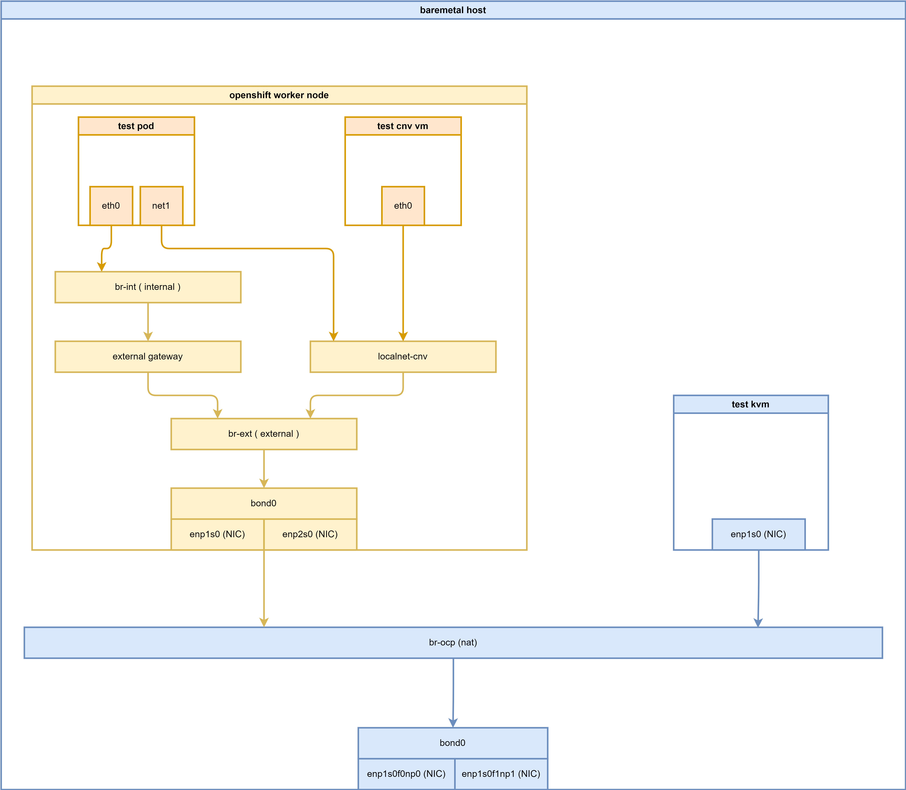


# ovn on 2nd network

Okay, let's start installing OVN on the second network plane. There is comprehensive official documentation available that we can follow. 

- https://docs.openshift.com/container-platform/4.16/networking/multiple_networks/configuring-additional-network.html#configuration-ovnk-additional-networks_configuring-additional-network


install NMState operator first


create a deployment with default setting.


<!-- 
要创建第二个网络平面，首先要考虑是要做overlay还是underlay，在以前，openshift只是支持underlay的网络平面，如macvlan，但是现在openshift最新提供了ovn这种overlay的技术选择，我们在这里就用ovn来做overlay的第二个网络平面。

而要创建ovn的第二个网络平面，同样有2个选择，一个是把这个网络平面连接到默认ovn的网络平面上，挂接到br-ex上。另外一个选择，就是创建另外一个ovs bridge，并且挂接到物理网络上，从而彻底和默认的ovn网络平台没啥关系。官方文档上2个模式都提到了，但是我们的场景中，我们上游网络接口只有一个，所以选择第一个模式，挂接到已有ovn的br-ex上去。 

创建的这个第二ovn网络平面，是一个二层网络，我们可以选择配置IPAM，这样可以让k8s/ocp来给pod分配ip地址。但是，我们的最终目标是cnv场景，在那个场景中，ip地址是vm配置的，或者通过dhcp拿到，所以我们配置的这个ovn第二网络平面，就不配置IPAM了。
-->

To create a second network plane, we first need to consider whether to use an overlay or underlay. In the past, OpenShift only supported underlay network planes, such as macvlan. However, OpenShift now offers ovn, an overlay technology, as an option. In this case, we will use ovn to create the second overlay network plane.

When creating the ovn second network plane, there are two choices:

1. Connect this network plane to the default ovn network plane and attach it to br-ex.
2. Create another ovs bridge and attach it to the physical network, effectively separating it from the default ovn network plane.

This second ovn network plane is a Layer 2 network. We can choose to configure IPAM, which allows k8s/ocp to assign IP addresses to pods. However, our ultimate goal is the cnv scenario, in which IP addresses are configured on the VM or obtained through DHCP. Therefore, we will not configure IPAM for this ovn second network plane.


```bash
# create the mapping
oc delete -f ${BASE_DIR}/data/install/ovn-mapping.conf

cat << EOF > ${BASE_DIR}/data/install/ovn-mapping.conf
---
apiVersion: nmstate.io/v1
kind: NodeNetworkConfigurationPolicy
metadata:
  name: mapping 
spec:
  nodeSelector:
    node-role.kubernetes.io/worker: '' 
  desiredState:
    ovn:
      bridge-mappings:
      - localnet: localnet-cnv
        bridge: br-ex
        state: present 
EOF

oc apply -f ${BASE_DIR}/data/install/ovn-mapping.conf

# oc delete -f ${BASE_DIR}/data/install/ovn-mapping.conf

# cat << EOF > ${BASE_DIR}/data/install/ovn-mapping.conf
# ---
# apiVersion: nmstate.io/v1
# kind: NodeNetworkConfigurationPolicy
# metadata:
#   name: mapping 
# spec:
#   nodeSelector:
#     node-role.kubernetes.io/worker: '' 
#   desiredState:
#     interfaces:
#     - name: ovs-br-cnv 
#       description: |-
#         A dedicated OVS bridge with eth1 as a port
#         allowing all VLANs and untagged traffic
#       type: ovs-bridge
#       state: up
#       bridge:
#         options:
#           stp: true
#         port:
#         - name: enp9s0 
#     ovn:
#       bridge-mappings:
#       - localnet: localnet-cnv
#         bridge: ovs-br-cnv
#         state: present 
# EOF

# oc apply -f ${BASE_DIR}/data/install/ovn-mapping.conf

# create the network attachment definition
oc delete -f ${BASE_DIR}/data/install/ovn-k8s-cni-overlay.conf

var_namespace='llm-demo'
cat << EOF > ${BASE_DIR}/data/install/ovn-k8s-cni-overlay.conf
apiVersion: k8s.cni.cncf.io/v1
kind: NetworkAttachmentDefinition
metadata:
  name: $var_namespace-localnet-network
  namespace: $var_namespace
spec:
  config: |- 
    {
      "cniVersion": "0.3.1",
      "name": "localnet-cnv",
      "type": "ovn-k8s-cni-overlay",
      "topology":"localnet",
      "_subnets": "192.168.99.0/24",
      "_vlanID": 33,
      "_mtu": 1500,
      "netAttachDefName": "$var_namespace/$var_namespace-localnet-network",
      "_excludeSubnets": "10.100.200.0/29"
    }
EOF

oc apply -f ${BASE_DIR}/data/install/ovn-k8s-cni-overlay.conf


```

# try with pod

<!-- 有了第二个网络平面，我们就先用pod来试一试这个网络是不是通的。我们先测试pod，是因为cnv/kubevirt里面的vm就是运行在pod里面的，所以先测试pod场景，这样后面的vm场景就容易很多。

我们先创建3个pod，每个pod都挂载到默认ovn网络平面，和第二个ovn网络平面，我们同时通过pod的annotation来指定pod的第二个ip地址。

最后，我们测试pod到各个目标ip地址的的连通性。 -->

With the second network plane in place, we'll start by testing network connectivity using pods. We test pods first because the VMs inside cnv/kubevirt run within pods.  Testing the pod scenario makes the subsequent VM scenario much easier.

We'll create three pods, each attached to both the default OVN network plane and the second OVN network plane. We'll also use pod annotations to specify a second IP address for each pod.

Finally, we'll test connectivity from the pods to various target IP addresses. 


```bash

# create demo pods
oc delete -f ${BASE_DIR}/data/install/pod.yaml

var_namespace='llm-demo'
cat << EOF > ${BASE_DIR}/data/install/pod.yaml
---
apiVersion: v1
kind: Pod
metadata:
  annotations:
    k8s.v1.cni.cncf.io/networks: '[
      {
        "name": "$var_namespace-localnet-network", 
        "_mac": "02:03:04:05:06:07", 
        "_interface": "myiface1", 
        "ips": [
          "192.168.77.91/24"
          ] 
      }
    ]'
  name: tinypod
  namespace: $var_namespace
  labels:
    app: tinypod
spec:
  containers:
  - image: quay.io/wangzheng422/qimgs:rocky9-test-2024.06.17.v01
    imagePullPolicy: IfNotPresent
    name: agnhost-container
    command: [ "/bin/bash", "-c", "--" ]
    args: [ "tail -f /dev/null" ]

---
apiVersion: v1
kind: Pod
metadata:
  annotations:
    k8s.v1.cni.cncf.io/networks: '[
      {
        "name": "$var_namespace-localnet-network", 
        "_mac": "02:03:04:05:06:07", 
        "_interface": "myiface1", 
        "ips": [
          "192.168.77.92/24"
          ] 
      }
    ]'
  name: tinypod-01
  namespace: $var_namespace
  labels:
    app: tinypod-01
spec:
  containers:
  - image: quay.io/wangzheng422/qimgs:rocky9-test-2024.06.17.v01
    imagePullPolicy: IfNotPresent
    name: agnhost-container
    command: [ "/bin/bash", "-c", "--" ]
    args: [ "tail -f /dev/null" ]

---
apiVersion: v1
kind: Pod
metadata:
  annotations:
    k8s.v1.cni.cncf.io/networks: '[
      {
        "name": "$var_namespace-localnet-network", 
        "_mac": "02:03:04:05:06:07", 
        "_interface": "myiface1", 
        "ips": [
          "192.168.77.93/24"
          ] 
      }
    ]'
  name: tinypod-02
  namespace: $var_namespace
  labels:
    app: tinypod-02
spec:
  containers:
  - image: quay.io/wangzheng422/qimgs:rocky9-test-2024.06.17.v01
    imagePullPolicy: IfNotPresent
    name: agnhost-container
    command: [ "/bin/bash", "-c", "--" ]
    args: [ "tail -f /dev/null" ]

EOF

oc apply -f ${BASE_DIR}/data/install/pod.yaml

# testing with ping to another pod
oc exec -it tinypod -- ping 192.168.77.92
# PING 192.168.77.92 (192.168.77.92) 56(84) bytes of data.
# 64 bytes from 192.168.77.92: icmp_seq=1 ttl=64 time=0.411 ms
# 64 bytes from 192.168.77.92: icmp_seq=2 ttl=64 time=0.114 ms
# ....

# testing with ping to another vm
oc exec -it tinypod -- ping 192.168.77.10
# PING 192.168.77.10 (192.168.77.10) 56(84) bytes of data.
# 64 bytes from 192.168.77.10: icmp_seq=1 ttl=64 time=1.09 ms
# 64 bytes from 192.168.77.10: icmp_seq=2 ttl=64 time=0.310 ms
# ....

# ping to outside world through default network
oc exec -it tinypod -- ping 8.8.8.8
# PING 8.8.8.8 (8.8.8.8) 56(84) bytes of data.
# 64 bytes from 8.8.8.8: icmp_seq=1 ttl=114 time=1.26 ms
# 64 bytes from 8.8.8.8: icmp_seq=2 ttl=114 time=0.795 ms
# ......

# trace the path to 8.8.8.8, we can see it goes through default network
oc exec -it tinypod -- tracepath -4 -n 8.8.8.8
#  1?: [LOCALHOST]                      pmtu 1400
#  1:  8.8.8.8                                               0.772ms asymm  2
#  1:  8.8.8.8                                               0.328ms asymm  2
#  2:  100.64.0.2                                            0.518ms asymm  3
#  3:  192.168.99.1                                          0.758ms
#  4:  169.254.77.1                                          0.605ms
#  5:  10.253.38.104                                         0.561ms
#  6:  10.253.37.232                                         0.563ms
#  7:  10.253.37.194                                         0.732ms asymm  8
#  8:  147.28.130.14                                         0.983ms
#  9:  198.16.4.121                                          0.919ms asymm 13
# 10:  no reply
# ....

oc exec -it tinypod -- ip a
# 1: lo: <LOOPBACK,UP,LOWER_UP> mtu 65536 qdisc noqueue state UNKNOWN group default qlen 1000
#     link/loopback 00:00:00:00:00:00 brd 00:00:00:00:00:00
#     inet 127.0.0.1/8 scope host lo
#        valid_lft forever preferred_lft forever
#     inet6 ::1/128 scope host
#        valid_lft forever preferred_lft forever
# 2: eth0@if116: <BROADCAST,MULTICAST,UP,LOWER_UP> mtu 1400 qdisc noqueue state UP group default
#     link/ether 0a:58:0a:84:00:65 brd ff:ff:ff:ff:ff:ff link-netnsid 0
#     inet 10.132.0.101/23 brd 10.132.1.255 scope global eth0
#        valid_lft forever preferred_lft forever
#     inet6 fe80::858:aff:fe84:65/64 scope link
#        valid_lft forever preferred_lft forever
# 3: net1@if118: <BROADCAST,MULTICAST,UP,LOWER_UP> mtu 1400 qdisc noqueue state UP group default
#     link/ether 0a:58:c0:a8:4d:5b brd ff:ff:ff:ff:ff:ff link-netnsid 0
#     inet 192.168.77.91/24 brd 192.168.77.255 scope global net1
#        valid_lft forever preferred_lft forever
#     inet6 fe80::858:c0ff:fea8:4d5b/64 scope link
#        valid_lft forever preferred_lft forever

oc exec -it tinypod -- ip r
# default via 10.132.0.1 dev eth0
# 10.132.0.0/23 dev eth0 proto kernel scope link src 10.132.0.101
# 10.132.0.0/14 via 10.132.0.1 dev eth0
# 100.64.0.0/16 via 10.132.0.1 dev eth0
# 172.22.0.0/16 via 10.132.0.1 dev eth0
# 192.168.77.0/24 dev net1 proto kernel scope link src 192.168.77.91

```

# try with multi-network policy

<!-- 客户实际场景中，是希望在第二个网络平面上，能够控制流入和流出的网络，保证安全性。这里，我们就用multi-network policy来实现这个需求。multi-network policy在语法上，跟network policy是一致 ，不同的地方，是他指定了生效的网络平面。

我们先使用一个默认的规则，禁止一切的流入和流出流量。然后，我们再添加一些规则，来允许一些流量。同时，因为我们配置的网络，没有IPAM设置，所以k8s无法知道pod第二个网络平面上的ip地址，所以我们只能通过IP地址来限制流入和流出的外部目标，而不能通过label来限制。 -->

In real-world customer scenarios, the goal is to control network traffic flowing in and out on the second network plane, ensuring security. Here, we can use multi-network policy to fulfill this requirement. Multi-network policy shares the same syntax as network policy, but the difference lies in specifying the effective network plane.

We first use a default rule to deny all incoming and outgoing traffic. Then, we add rules to allow specific traffic. As our configured network lacks IPAM settings, Kubernetes cannot determine the IP addresses of pods on the second network plane. Therefore, we can only restrict incoming and outgoing external targets using IP addresses, not labels. 

<!-- 本文中定义的网络规则，逻辑示意图如下： -->

The network rules defined in this document are illustrated in the following logical diagram: 

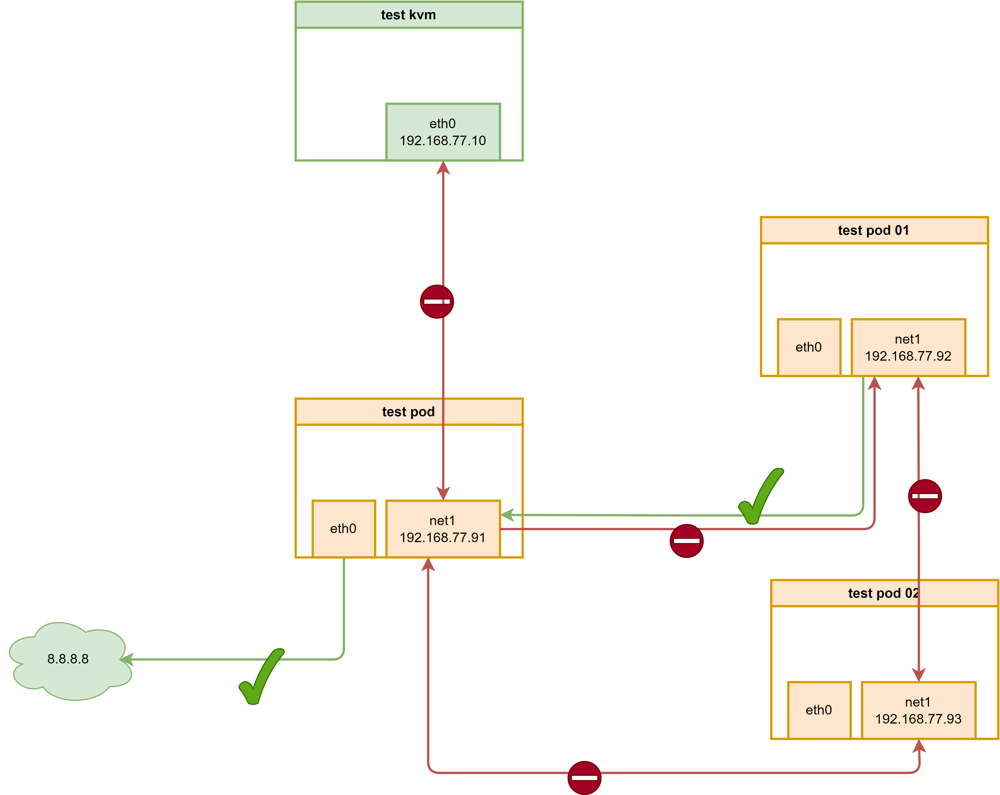


Currently, multi-network policy is not supported by AdminNetworkPolicy.
- https://redhat-internal.slack.com/archives/CDCP2LA9L/p1719501818805819

offical doc:
- https://docs.openshift.com/container-platform/4.15/networking/multiple_networks/configuring-multi-network-policy.html#nw-multi-network-policy-enable_configuring-multi-network-policy

```bash
# enable multi-network policy in cluster level
cat << EOF > ${BASE_DIR}/data/install/multi-network-policy.yaml
apiVersion: operator.openshift.io/v1
kind: Network
metadata:
  name: cluster
spec:
  useMultiNetworkPolicy: true
EOF

oc patch network.operator.openshift.io cluster --type=merge --patch-file=${BASE_DIR}/data/install/multi-network-policy.yaml


# if you want to revert back
cat << EOF > ${BASE_DIR}/data/install/multi-network-policy.yaml
apiVersion: operator.openshift.io/v1
kind: Network
metadata:
  name: cluster
spec:
  useMultiNetworkPolicy: false
EOF

oc patch network.operator.openshift.io cluster --type=merge --patch-file=${BASE_DIR}/data/install/multi-network-policy.yaml


# below is add by default
# cat << EOF > ${BASE_DIR}/data/install/multi-network-policy-rules.yaml
# kind: ConfigMap
# apiVersion: v1
# metadata:
#   name: multi-networkpolicy-custom-rules
#   namespace: openshift-multus
# data:

#   custom-v6-rules.txt: |
#     # accept NDP
#     -p icmpv6 --icmpv6-type neighbor-solicitation -j ACCEPT 
#     -p icmpv6 --icmpv6-type neighbor-advertisement -j ACCEPT 
#     # accept RA/RS
#     -p icmpv6 --icmpv6-type router-solicitation -j ACCEPT 
#     -p icmpv6 --icmpv6-type router-advertisement -j ACCEPT 
# EOF

# oc delete -f ${BASE_DIR}/data/install/multi-network-policy-rules.yaml

# oc apply -f ${BASE_DIR}/data/install/multi-network-policy-rules.yaml


# deny all by default
oc delete -f ${BASE_DIR}/data/install/multi-network-policy-deny-all.yaml

var_namespace='llm-demo'
cat << EOF > ${BASE_DIR}/data/install/multi-network-policy-deny-all.yaml
---
apiVersion: k8s.cni.cncf.io/v1beta1
kind: MultiNetworkPolicy
metadata:
  name: deny-by-default
  namespace: $var_namespace
  annotations:
    k8s.v1.cni.cncf.io/policy-for: $var_namespace/$var_namespace-localnet-network
spec:
  podSelector: {}
  policyTypes:
  - Ingress
  - Egress
  ingress: []
  egress: []

# do not work, as no cidr defined
# ---
# apiVersion: k8s.cni.cncf.io/v1beta1
# kind: MultiNetworkPolicy
# metadata:
#   name: deny-by-default
#   namespace: default
#   annotations:
#     k8s.v1.cni.cncf.io/policy-for: $var_namespace/$var_namespace-localnet-network
# spec:
#   podSelector: {}
#   policyTypes:
#   - Ingress
#   - Egress
#   ingress:
#   - from: 
#     - ipBlock:
#         except: '0.0.0.0/0
#   egress:
#   - to: 
#     - ipBlock:
#         except: '0.0.0.0/0'
EOF

oc apply -f ${BASE_DIR}/data/install/multi-network-policy-deny-all.yaml


# get pod ip of tinypod-01
ANOTHER_TINYPOD_IP=$(oc get pod tinypod-01 -o=jsonpath='{.status.podIP}')

echo $ANOTHER_TINYPOD_IP
# 10.132.0.40

# testing with ping to another pod using default network eth0
oc exec -it tinypod -- ping $ANOTHER_TINYPOD_IP
# PING 10.132.0.40 (10.132.0.40) 56(84) bytes of data.
# 64 bytes from 10.132.0.40: icmp_seq=1 ttl=64 time=0.806 ms
# 64 bytes from 10.132.0.40: icmp_seq=2 ttl=64 time=0.250 ms
# ......


# testing with ping to another pod using 2nd network net1
oc exec -it tinypod -- ping 192.168.77.92
# PING 192.168.77.92 (192.168.77.92) 56(84) bytes of data.
# ^C
# --- 192.168.77.92 ping statistics ---
# 30 packets transmitted, 0 received, 100% packet loss, time 29721ms

# testing with ping to another vm
# notice, here we can not ping the vm
oc exec -it tinypod -- ping 192.168.77.10
# PING 192.168.77.10 (192.168.77.10) 56(84) bytes of data.
# ^C
# --- 192.168.77.10 ping statistics ---
# 4 packets transmitted, 0 received, 100% packet loss, time 3091ms

# it still can ping to outside world through default network
oc exec -it tinypod -- ping 8.8.8.8
# PING 8.8.8.8 (8.8.8.8) 56(84) bytes of data.
# 64 bytes from 8.8.8.8: icmp_seq=1 ttl=114 time=1.69 ms
# 64 bytes from 8.8.8.8: icmp_seq=2 ttl=114 time=1.27 ms
# .....


# get pod ip of tinypod
ANOTHER_TINYPOD_IP=$(oc get pod tinypod -o=jsonpath='{.status.podIP}')

echo $ANOTHER_TINYPOD_IP
# 10.132.0.39

# testing with ping to another pod using default network eth0
oc exec -it tinypod-01 -- ping $ANOTHER_TINYPOD_IP
# PING 10.132.0.39 (10.132.0.39) 56(84) bytes of data.
# 64 bytes from 10.132.0.39: icmp_seq=1 ttl=64 time=0.959 ms
# 64 bytes from 10.132.0.39: icmp_seq=2 ttl=64 time=0.594 ms
# ......

# testing with ping to another pod using 2nd network net1
oc exec -it tinypod-01 -- ping 192.168.77.91
# PING 192.168.77.91 (192.168.77.91) 56(84) bytes of data.
# ^C
# --- 192.168.77.91 ping statistics ---
# 30 packets transmitted, 0 received, 100% packet loss, time 29707ms


# allow traffic only between tinypod and tinypod-01
oc delete -f ${BASE_DIR}/data/install/multi-network-policy-allow-some.yaml

var_namespace='llm-demo'
cat << EOF > ${BASE_DIR}/data/install/multi-network-policy-allow-some.yaml
# ---
# apiVersion: k8s.cni.cncf.io/v1beta1
# kind: MultiNetworkPolicy
# metadata:
#   name: allow-specific-pods
#   namespace: $var_namespace
#   annotations:
#     k8s.v1.cni.cncf.io/policy-for: $var_namespace-localnet-network
# spec:
#   podSelector:
#     matchLabels:
#       app: tinypod
#   policyTypes:
#   - Ingress
#   ingress:
#   - from:
#     - podSelector:
#         matchLabels:
#           app: tinypod-01

---
apiVersion: k8s.cni.cncf.io/v1beta1
kind: MultiNetworkPolicy
metadata:
  name: allow-ipblock
  namespace: $var_namespace
  annotations:
    k8s.v1.cni.cncf.io/policy-for: $var_namespace-localnet-network
spec:
  podSelector:
    matchLabels:
      app: tinypod
  policyTypes:
  - Ingress
  # - Egress
  ingress:
  - from:
    - ipBlock:
        cidr: 192.168.77.92/32
  # egress:
  # - to:
  #   - ipBlock:
  #       cidr: 192.168.77.92/32

---
apiVersion: k8s.cni.cncf.io/v1beta1
kind: MultiNetworkPolicy
metadata:
  name: allow-ipblock-01
  namespace: $var_namespace
  annotations:
    k8s.v1.cni.cncf.io/policy-for: $var_namespace-localnet-network
spec:
  podSelector:
    matchLabels:
      app: tinypod-01
  policyTypes:
  # - Ingress
  - Egress
  # ingress:
  # - from:
  #   - ipBlock:
  #       cidr: 192.168.77.91/32
  egress:
  - to:
    - ipBlock:
        cidr: 192.168.77.91/32

EOF

oc apply -f ${BASE_DIR}/data/install/multi-network-policy-allow-some.yaml


# get pod ip of tinypod-01
ANOTHER_TINYPOD_IP=$(oc get pod tinypod-01 -o=jsonpath='{.status.podIP}')

echo $ANOTHER_TINYPOD_IP
# 10.132.0.40

# testing with ping to another pod using default network eth0
oc exec -it tinypod -- ping $ANOTHER_TINYPOD_IP
# PING 10.132.0.40 (10.132.0.40) 56(84) bytes of data.
# 64 bytes from 10.132.0.40: icmp_seq=1 ttl=64 time=0.806 ms
# 64 bytes from 10.132.0.40: icmp_seq=2 ttl=64 time=0.250 ms
# ......


# testing with ping to another pod using 2nd network net1
oc exec -it tinypod -- ping 192.168.77.92
# PING 192.168.77.92 (192.168.77.92) 56(84) bytes of data.
# ^C
# --- 192.168.77.92 ping statistics ---
# 30 packets transmitted, 0 received, 100% packet loss, time 29721ms

oc exec -it tinypod -- ping 192.168.77.93
# PING 192.168.77.93 (192.168.77.93) 56(84) bytes of data.
# ^C
# --- 192.168.77.93 ping statistics ---
# 4 packets transmitted, 0 received, 100% packet loss, time 3065ms

# testing with ping to another vm
# if we do not set egress rule for default-deny-all, and allow-some, here we can ping the vm
oc exec -it tinypod -- ping 192.168.77.10
# PING 192.168.77.10 (192.168.77.10) 56(84) bytes of data.
# 64 bytes from 192.168.77.10: icmp_seq=1 ttl=64 time=0.672 ms
# 64 bytes from 192.168.77.10: icmp_seq=2 ttl=64 time=0.674 ms
# ......

# but we set the egress rule, so we can not ping vm now
oc exec -it tinypod -- ping 192.168.77.10
# PING 192.168.77.10 (192.168.77.10) 56(84) bytes of data.
# ^C
# --- 192.168.77.10 ping statistics ---
# 3 packets transmitted, 0 received, 100% packet loss, time 2085ms

# it still can ping to outside world through default network
oc exec -it tinypod -- ping 8.8.8.8
# PING 8.8.8.8 (8.8.8.8) 56(84) bytes of data.
# 64 bytes from 8.8.8.8: icmp_seq=1 ttl=114 time=1.69 ms
# 64 bytes from 8.8.8.8: icmp_seq=2 ttl=114 time=1.27 ms
# .....


# get pod ip of tinypod
ANOTHER_TINYPOD_IP=$(oc get pod tinypod -o=jsonpath='{.status.podIP}')

echo $ANOTHER_TINYPOD_IP
# 10.132.0.39

# testing with ping to another pod using default network eth0
oc exec -it tinypod-01 -- ping $ANOTHER_TINYPOD_IP
# PING 10.132.0.39 (10.132.0.39) 56(84) bytes of data.
# 64 bytes from 10.132.0.39: icmp_seq=1 ttl=64 time=0.959 ms
# 64 bytes from 10.132.0.39: icmp_seq=2 ttl=64 time=0.594 ms
# ......

# testing with ping to another pod using 2nd network net1
# you can see, we can ping to tinypod, which is allowed by multi-network policy
oc exec -it tinypod-01 -- ping 192.168.77.91
# PING 192.168.77.91 (192.168.77.91) 56(84) bytes of data.
# 64 bytes from 192.168.77.91: icmp_seq=1 ttl=64 time=0.278 ms
# 64 bytes from 192.168.77.91: icmp_seq=2 ttl=64 time=0.032 ms
# ....

oc exec -it tinypod-01 -- ping 192.168.77.93
# PING 192.168.77.93 (192.168.77.93) 56(84) bytes of data.
# ^C
# --- 192.168.77.93 ping statistics ---
# 4 packets transmitted, 0 received, 100% packet loss, time 3085ms

# testing with ping to vm
oc exec -it tinypod-01 -- ping 192.168.77.10
# PING 192.168.77.10 (192.168.77.10) 56(84) bytes of data.
# ^C
# --- 192.168.77.10 ping statistics ---
# 3 packets transmitted, 0 received, 100% packet loss, time 2085ms

# it still can ping to outside world through default network
oc exec -it tinypod-01 -- ping 8.8.8.8
# PING 8.8.8.8 (8.8.8.8) 56(84) bytes of data.
# 64 bytes from 8.8.8.8: icmp_seq=1 ttl=114 time=1.15 ms
# 64 bytes from 8.8.8.8: icmp_seq=2 ttl=114 time=0.824 ms
# ......


oc exec -it tinypod-02 -- ping 192.168.77.91
# PING 192.168.77.91 (192.168.77.91) 56(84) bytes of data.
# ^C
# --- 192.168.77.91 ping statistics ---
# 4 packets transmitted, 0 received, 100% packet loss, time 3089ms

oc exec -it tinypod-02 -- ping 192.168.77.92
# PING 192.168.77.92 (192.168.77.92) 56(84) bytes of data.
# ^C
# --- 192.168.77.92 ping statistics ---
# 4 packets transmitted, 0 received, 100% packet loss, time 3069ms

oc exec -it tinypod-02 -- ping 192.168.77.10
# PING 192.168.77.10 (192.168.77.10) 56(84) bytes of data.
# ^C
# --- 192.168.77.10 ping statistics ---
# 3 packets transmitted, 0 received, 100% packet loss, time 2067ms


oc get multi-networkpolicies -A
# NAMESPACE   NAME               AGE
# llm-demo    allow-ipblock      74m
# llm-demo    allow-ipblock-01   74m
# llm-demo    deny-by-default    82m


```

Our ovn on 2nd network do not have ipam, so ingress with pod selector is not working, see log from ```project: openshift-ovn-kubernetes -> pod: ovnkube-node -> container ovnkube-controller```. This is why we use ipblock to allow traffic between pods.

> I0718 13:03:32.619246    7659 obj_retry.go:346] Retry delete failed for *v1beta1.MultiNetworkPolicy llm-demo/allow-specific-pods, will try again later: invalid ingress peer {&LabelSelector{MatchLabels:map[string]string{app: tinypod-01,},MatchExpressions:[]LabelSelectorRequirement{},} nil <nil>} in multi-network policy allow-specific-pods; IPAM-less networks can only have `ipBlock` peers


# try with cnv

> [!NOTE] 
> CNV use case will not work if the underlying network is not allowed multi-mac on single port.

first, we need to install cnv operator

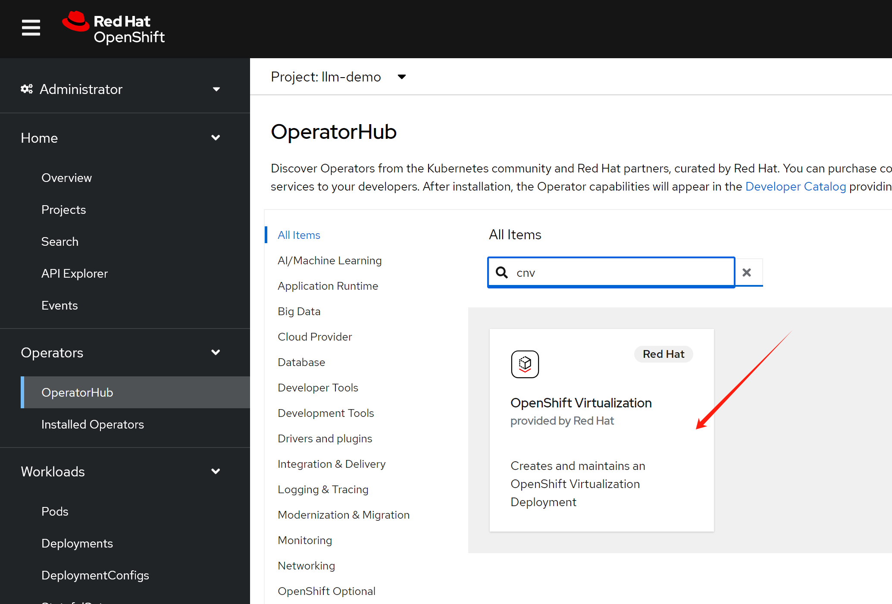

create default instance with default settings.

<!-- sometimes, you need to create a new project for it. Maybe it is a bug.

```bash
oc adm new-project openshift-virtualization-os-images
``` -->

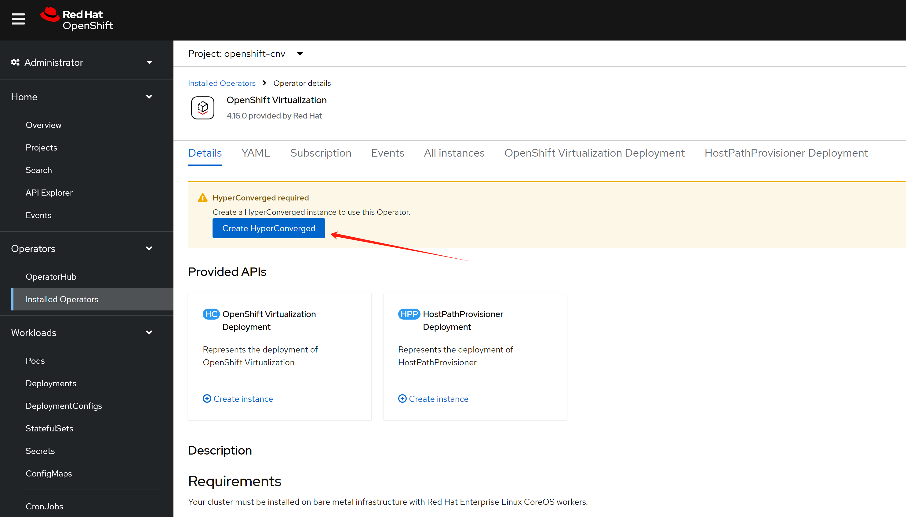

Wait some time, the cnv will download os base image. After that, we create vm

<!-- 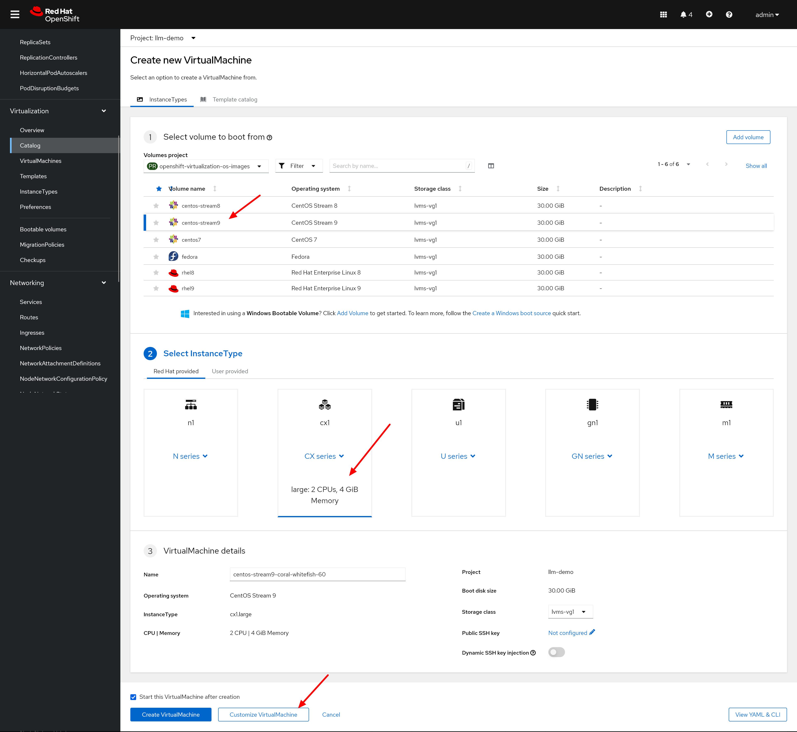

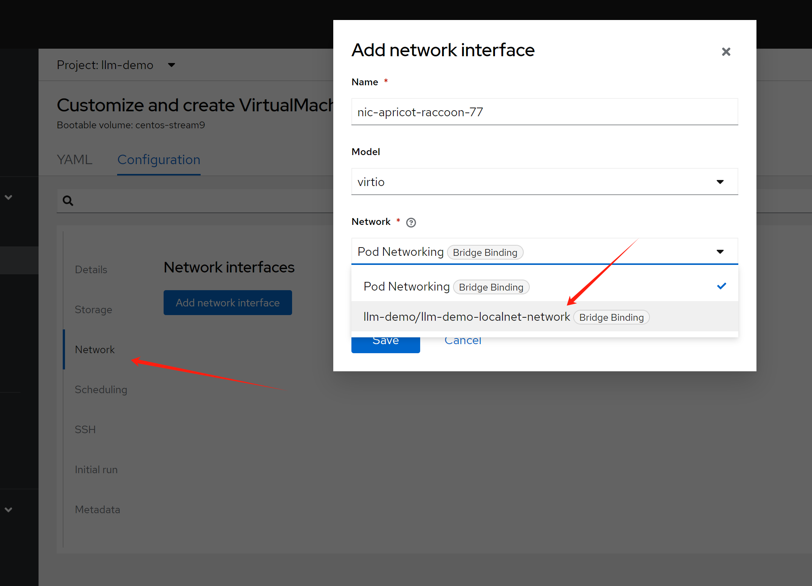

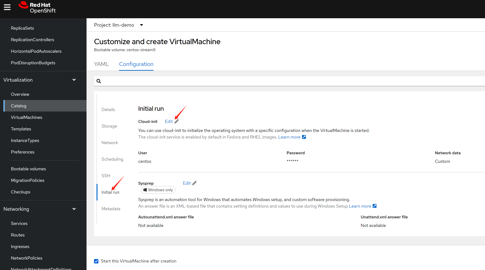

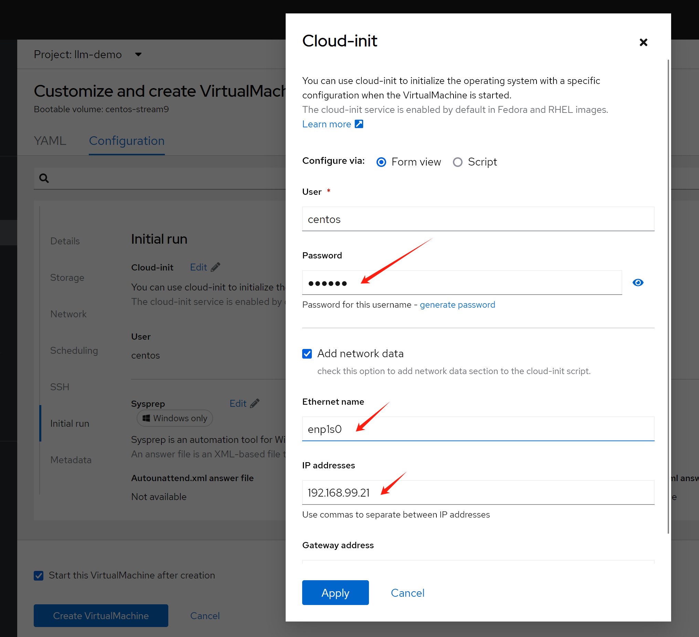 -->

Create vm with centos stream9 from template catalog

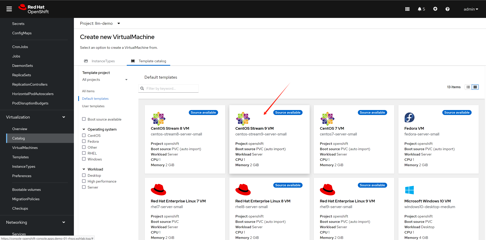

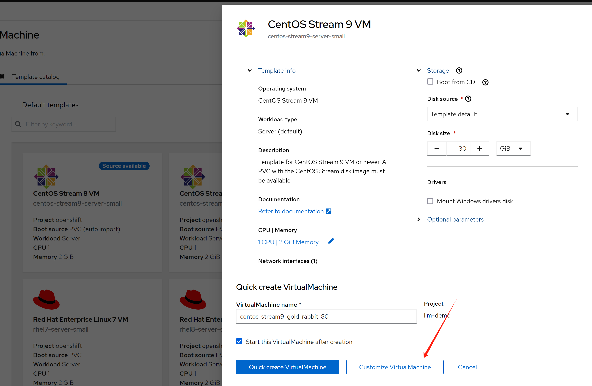

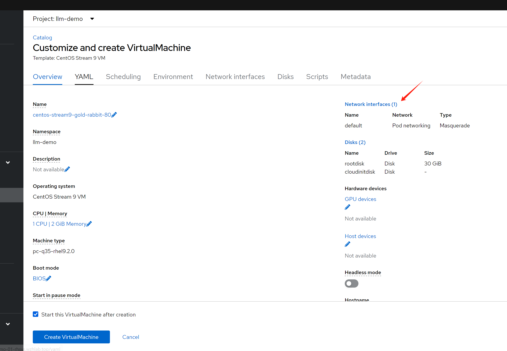

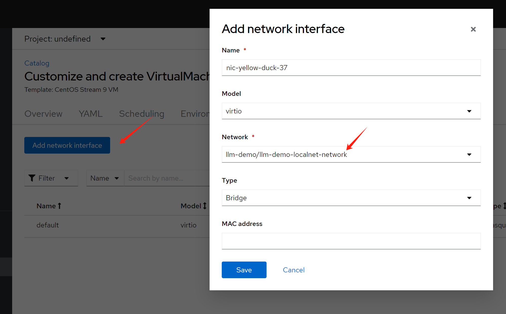


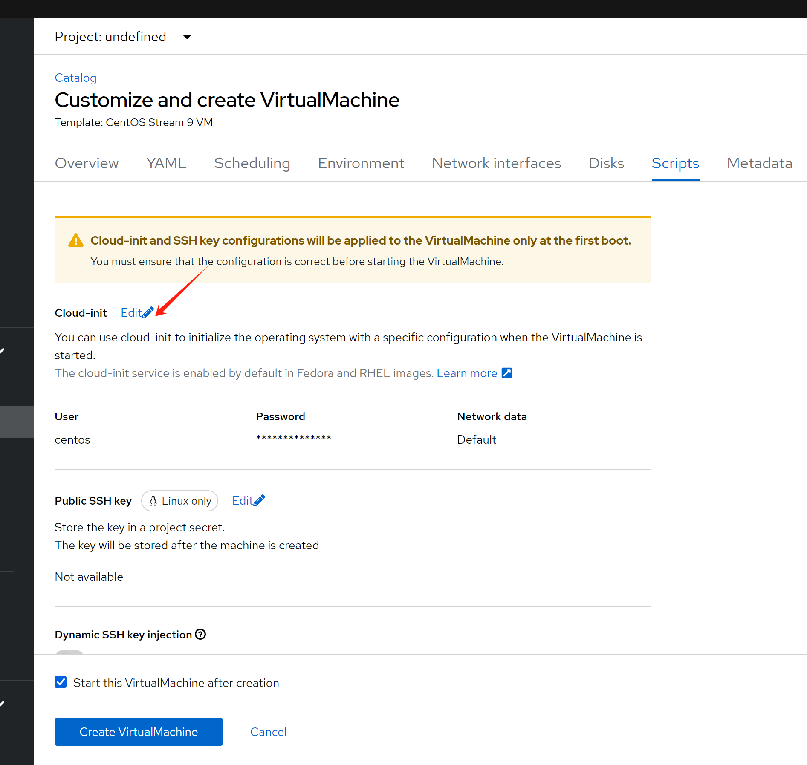

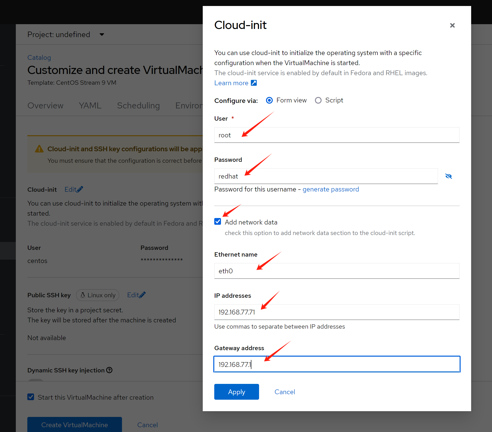

<!-- 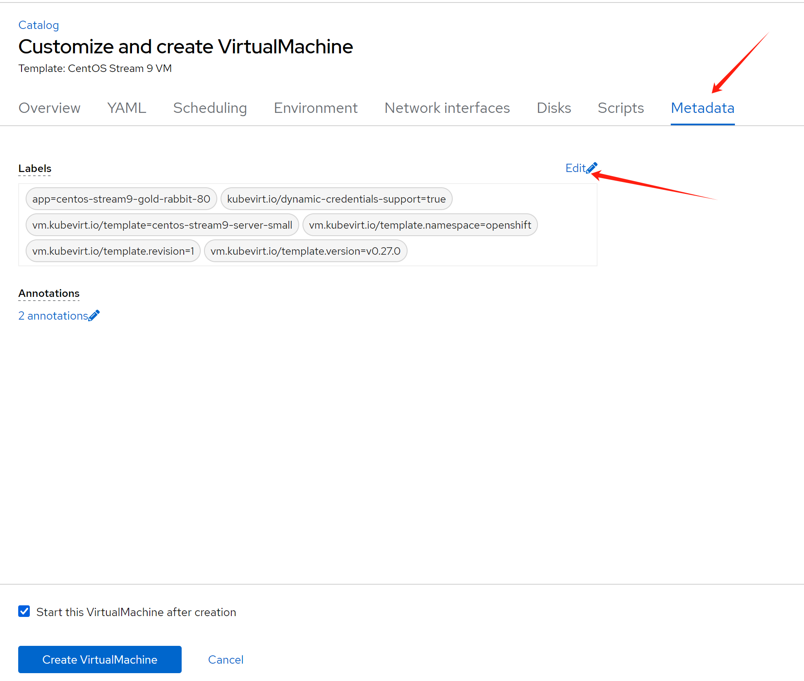 -->

<!--  -->

In the beginning, the vm can not ping to any ip, and can not be ping from any ip. After apply additional network policy, the vm can ping to gateway, and the test pod, and outside world.

The overall network policy is like below:

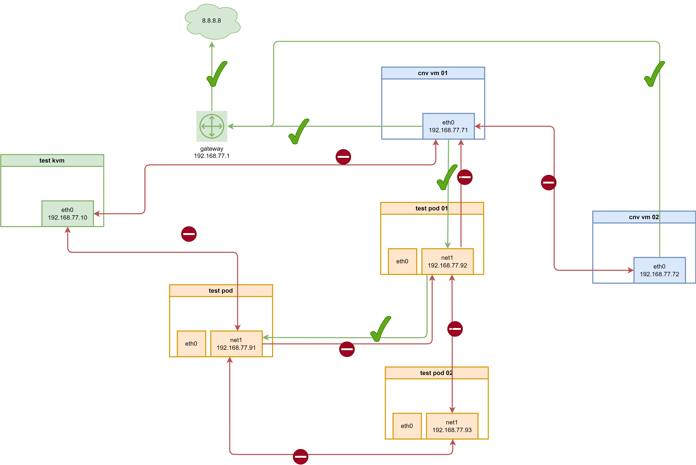

```bash

# get vm
oc get vm
# NAME                             AGE     STATUS    READY
# centos-stream9-gold-rabbit-80    2d17h   Running   True
# centos-stream9-green-ferret-41   54s     Running   True

# allow traffic only between tinypod and tinypod-01
oc delete -f ${BASE_DIR}/data/install/multi-network-policy-allow-some-cnv.yaml

var_namespace='llm-demo'
var_vm='centos-stream9-gold-rabbit-80'
var_vm_01='centos-stream9-green-ferret-41'
cat << EOF > ${BASE_DIR}/data/install/multi-network-policy-allow-some-cnv.yaml
---
apiVersion: k8s.cni.cncf.io/v1beta1
kind: MultiNetworkPolicy
metadata:
  name: allow-ipblock-cnv-01
  namespace: $var_namespace
  annotations:
    k8s.v1.cni.cncf.io/policy-for: $var_namespace-localnet-network
spec:
  podSelector:
    matchLabels:
      vm.kubevirt.io/name: $var_vm
  policyTypes:
  - Ingress
  - Egress
  ingress:
  - from:
    # from gateway
    - ipBlock:
        cidr: 192.168.77.1/32
    # from test pod
    - ipBlock:
        cidr: 192.168.77.92/32
  egress:
  - to:
    # can go anywhere on the internet, except the ips in the same network
    - ipBlock:
        cidr: 0.0.0.0/0
        except:
          - 192.168.77.0/24
    # to gateway
    - ipBlock:
        cidr: 192.168.77.1/32
    # to test pod
    - ipBlock:
        cidr: 192.168.77.92/32

---
apiVersion: k8s.cni.cncf.io/v1beta1
kind: MultiNetworkPolicy
metadata:
  name: allow-ipblock-cnv-02
  namespace: $var_namespace
  annotations:
    k8s.v1.cni.cncf.io/policy-for: $var_namespace-localnet-network
spec:
  podSelector:
    matchLabels:
      vm.kubevirt.io/name: $var_vm_01
  policyTypes:
  - Ingress
  - Egress
  ingress:
  - from:
    # from gateway
    - ipBlock:
        cidr: 192.168.77.1/32
  egress:
  - to:
    # to gateway
    - ipBlock:
        cidr: 192.168.77.1/32

---
apiVersion: k8s.cni.cncf.io/v1beta1
kind: MultiNetworkPolicy
metadata:
  name: allow-ipblock-cnv-03
  namespace: $var_namespace
  annotations:
    k8s.v1.cni.cncf.io/policy-for: $var_namespace-localnet-network
spec:
  podSelector:
    matchLabels:
      app: tinypod-01
  policyTypes:
  - Ingress
  ingress:
  - from:
    # to test vm
    - ipBlock:
        cidr: 192.168.77.71/32

EOF

oc apply -f ${BASE_DIR}/data/install/multi-network-policy-allow-some-cnv.yaml

```

## test

<!-- 我们基于已有的规则，做一些测试，看看是不是和我们的预取是一样的。 -->
We conducted some tests based on existing rules to see if they align with our prefetch logic. 

```bash

# on the cnv vm, can not ping the outside test vm
ping 192.169.77.10
# PING 192.169.77.10 (192.169.77.10) 56(84) bytes of data.
# ^C
# --- 192.169.77.10 ping statistics ---
# 3 packets transmitted, 0 received, 100% packet loss, time 2053ms

# on the outside test vm(192.168.77.10), can not ping the cnv vm
ping 192.168.77.71
# PING 192.168.77.71 (192.168.77.71) 56(84) bytes of data.
# ^C
# --- 192.168.77.71 ping statistics ---
# 52 packets transmitted, 0 received, 100% packet loss, time 52260ms

# on the cnv vm(192.168.77.71), can ping the gateway, and the test pod, and outside
ping 192.168.77.1
# PING 192.168.77.1 (192.168.77.1) 56(84) bytes of data.
# 64 bytes from 192.168.77.1: icmp_seq=1 ttl=64 time=1.22 ms
# 64 bytes from 192.168.77.1: icmp_seq=2 ttl=64 time=0.812 ms
# ....

ping 192.168.77.92
# PING 192.168.77.92 (192.168.77.92) 56(84) bytes of data.
# 64 bytes from 192.168.77.92: icmp_seq=1 ttl=64 time=1.32 ms
# 64 bytes from 192.168.77.92: icmp_seq=2 ttl=64 time=0.821 ms
# ....

ping 8.8.8.8
# PING 8.8.8.8 (8.8.8.8) 56(84) bytes of data.
# 64 bytes from 8.8.8.8: icmp_seq=1 ttl=116 time=1.39 ms
# 64 bytes from 8.8.8.8: icmp_seq=2 ttl=116 time=1.11 ms
# ....

# on the cnv vm(192.168.77.71), can not ping the test vm(192.168.77.10), and another test pod
ping 192.168.77.10
# PING 192.168.77.10 (192.168.77.10) 56(84) bytes of data.
# ^C
# --- 192.168.77.10 ping statistics ---
# 3 packets transmitted, 0 received, 100% packet loss, time 2078ms

ping 192.168.77.93
# PING 192.168.77.93 (192.168.77.93) 56(84) bytes of data.
# ^C
# --- 192.168.77.93 ping statistics ---
# 4 packets transmitted, 0 received, 100% packet loss, time 3087ms

# on the test pod(192.168.77.92), can not ping the cnv vm(192.168.77.71)
oc exec -it tinypod-01 -- ping 192.168.77.71
# PING 192.168.77.71 (192.168.77.71) 56(84) bytes of data.
# ^C
# --- 192.168.77.71 ping statistics ---
# 2 packets transmitted, 0 received, 100% packet loss, time 1003ms

# on another cnv vm(192.168.77.72), can ping to gateway(192.168.77.1), but can not ping to cnv test vm(192.168.77.71)
ping 192.168.77.1
# PING 192.168.77.1 (192.168.77.1) 56(84) bytes of data.
# 64 bytes from 192.168.77.1: icmp_seq=1 ttl=64 time=0.756 ms
# 64 bytes from 192.168.77.1: icmp_seq=2 ttl=64 time=0.434 ms

ping 192.168.77.71
# PING 192.168.77.71 (192.168.77.71) 56(84) bytes of data.
# ^C
# --- 192.168.77.71 ping statistics ---
# 5 packets transmitted, 0 received, 100% packet loss, time 4109ms

```

# network observ

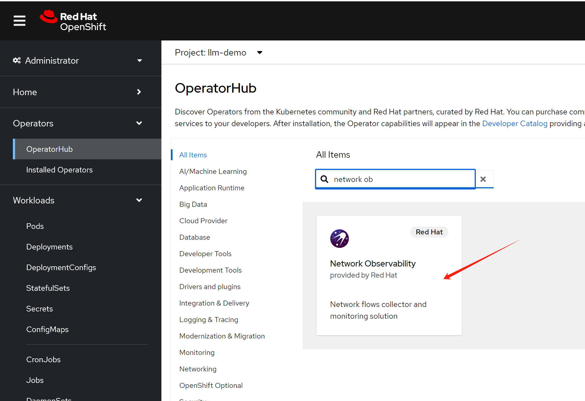

[It was said, upon v1.6.1, network observ support 2nd ovn network.](https://redhat-internal.slack.com/archives/C01DMAD88JF/p1721008969607269)

# tech in the background

<!-- 我们的测试说明，ovn on 2nd network满足客户的需求，但是我们并不满足表面上的配置，我们要知道背后的原理，特别是网络层面各个组件是如何相互连接，相互通信的。 -->
Our tests show that ovn on the second network meets customer requirements. However, we are not satisfied with just the surface configuration. We want to understand the underlying principles, especially how the various components on the network level connect and communicate with each other. 

## for pod

<!-- 我们先看看pod场景下，系统中各个网络组件是如何连接的。 -->
Let's first examine how various network components connect in a pod environment. 

```bash
# let's see the interface, mac, and ip address in pod
oc exec -it tinypod -n llm-demo -- ip a
# 1: lo: <LOOPBACK,UP,LOWER_UP> mtu 65536 qdisc noqueue state UNKNOWN group default qlen 1000
#     link/loopback 00:00:00:00:00:00 brd 00:00:00:00:00:00
#     inet 127.0.0.1/8 scope host lo
#        valid_lft forever preferred_lft forever
#     inet6 ::1/128 scope host
#        valid_lft forever preferred_lft forever
# 2: eth0@if52: <BROADCAST,MULTICAST,UP,LOWER_UP> mtu 1400 qdisc noqueue state UP group default
#     link/ether 0a:58:0a:84:00:35 brd ff:ff:ff:ff:ff:ff link-netnsid 0
#     inet 10.132.0.53/23 brd 10.132.1.255 scope global eth0
#        valid_lft forever preferred_lft forever
#     inet6 fe80::858:aff:fe84:35/64 scope link
#        valid_lft forever preferred_lft forever
# 3: net1@if56: <BROADCAST,MULTICAST,UP,LOWER_UP> mtu 1400 qdisc noqueue state UP group default
#     link/ether 0a:58:c0:a8:4d:5b brd ff:ff:ff:ff:ff:ff link-netnsid 0
#     inet 192.168.77.91/24 brd 192.168.77.255 scope global net1
#        valid_lft forever preferred_lft forever
#     inet6 fe80::858:c0ff:fea8:4d5b/64 scope link
#        valid_lft forever preferred_lft forever


# on master-01 node
# let's check the nic interface information
ip a sho dev if56
# 56: a51a8137f92b2_3@if3: <BROADCAST,MULTICAST,UP,LOWER_UP> mtu 1400 qdisc noqueue master ovs-system state UP group default
#     link/ether 7e:03:ea:89:f1:48 brd ff:ff:ff:ff:ff:ff link-netns 23fb7f53-6063-4954-9aa7-07c271699e72
#     inet6 fe80::7c03:eaff:fe89:f148/64 scope link
#        valid_lft forever preferred_lft forever

ip a show dev ovs-system
# 4: ovs-system: <BROADCAST,MULTICAST> mtu 1500 qdisc noop state DOWN group default qlen 1000
#     link/ether 16:a7:be:91:ae:72 brd ff:ff:ff:ff:ff:ff

# there is no firewall rules on ocp node
nft list ruleset | grep 192.168.77
# nothing

############################################
# show something in the ovn internally

# get the ovn pod, so we can exec into it
VAR_POD=`oc get pod -n openshift-ovn-kubernetes -o wide | grep master-01-demo | grep ovnkube-node | awk '{print $1}'`

# get ovn information about pod default network
# we can see it is a port on switch
oc exec -it ${VAR_POD} -c ovn-controller -n openshift-ovn-kubernetes -- ovn-nbctl show | grep -i 0a:58:0a:84:00:35 -A 10 -B 10
# switch e22c4467-5d22-4fa2-83d7-d00d19c9684d (master-01-demo)
#     port openshift-nmstate_nmstate-webhook-58fc66d999-h7jrb
#         addresses: ["0a:58:0a:84:00:45 10.132.0.69"]
#     port openshift-cnv_virt-handler-dtv6k
#         addresses: ["0a:58:0a:84:00:e2 10.132.0.226"]
# ......
#     port llm-demo_tinypod
#         addresses: ["0a:58:0a:84:00:35 10.132.0.53"]
# ......

# get ov information about pod 2nd ovn network
# we can ss it is a port on another swtich
oc exec -it ${VAR_POD} -c ovn-controller -n openshift-ovn-kubernetes -- ovn-nbctl show | grep -i 0a:58:c0:a8:4d:5b -A 10 -B 10
# ....
# switch 5ba54a76-89fb-4610-95c9-b3262a3bb55c (localnet.cnv_ovn_localnet_switch)
#     port llm.demo.llm.demo.localnet.network_llm-demo_virt-launcher-centos-stream9-green-ferret-41-ksmzt
#         addresses: ["02:00:a3:00:00:02"]
#     port llm.demo.llm.demo.localnet.network_llm-demo_virt-launcher-centos-stream9-gold-rabbit-80-vjfdm
#         addresses: ["02:00:a3:00:00:01"]
#     port localnet.cnv_ovn_localnet_port
#         type: localnet
#         addresses: ["unknown"]
#     port llm.demo.llm.demo.localnet.network_llm-demo_tinypod
#         addresses: ["0a:58:c0:a8:4d:5b 192.168.77.91"]
#     port llm.demo.llm.demo.localnet.network_llm-demo_tinypod-01
#         addresses: ["0a:58:c0:a8:4d:5c 192.168.77.92"]
#     port llm.demo.llm.demo.localnet.network_llm-demo_tinypod-02
#         addresses: ["0a:58:c0:a8:4d:5d 192.168.77.93"]
# ....

# get the overall switch and router topologies
oc exec -it ${VAR_POD} -c ovn-controller -n openshift-ovn-kubernetes -- ovn-nbctl show
# switch 7f294c4e-fce4-4c16-b830-17d7ca545078 (ext_master-01-demo)
#     port br-ex_master-01-demo
#         type: localnet
#         addresses: ["unknown"]
#     port etor-GR_master-01-demo
#         type: router
#         addresses: ["00:50:56:8e:b8:11"]
#         router-port: rtoe-GR_master-01-demo
# switch 9b84fe16-da8c-4abb-b071-6c46c5191a68 (join)
#     port jtor-GR_master-01-demo
#         type: router
#         router-port: rtoj-GR_master-01-demo
#     port jtor-ovn_cluster_router
#         type: router
#         router-port: rtoj-ovn_cluster_router
# switch 5ba54a76-89fb-4610-95c9-b3262a3bb55c (localnet.cnv_ovn_localnet_switch)
#     port llm.demo.llm.demo.localnet.network_llm-demo_virt-launcher-centos-stream9-green-ferret-41-ksmzt                                                                                                       addresses: ["02:00:a3:00:00:02"]
#     port llm.demo.llm.demo.localnet.network_llm-demo_virt-launcher-centos-stream9-gold-rabbit-80-vjfdm
#         addresses: ["02:00:a3:00:00:01"]
#     port localnet.cnv_ovn_localnet_port
#         type: localnet
#         addresses: ["unknown"]
#     port llm.demo.llm.demo.localnet.network_llm-demo_tinypod
#         addresses: ["0a:58:c0:a8:4d:5b 192.168.77.91"]
#     port llm.demo.llm.demo.localnet.network_llm-demo_tinypod-01
#         addresses: ["0a:58:c0:a8:4d:5c 192.168.77.92"]
#     port llm.demo.llm.demo.localnet.network_llm-demo_tinypod-02
#         addresses: ["0a:58:c0:a8:4d:5d 192.168.77.93"]
# switch e22c4467-5d22-4fa2-83d7-d00d19c9684d (master-01-demo)
#     port openshift-nmstate_nmstate-webhook-58fc66d999-h7jrb
#         addresses: ["0a:58:0a:84:00:45 10.132.0.69"]
#     port openshift-cnv_virt-handler-dtv6k
#         addresses: ["0a:58:0a:84:00:e2 10.132.0.226"]
# ......

# get the ovs config, and we can see the localnet mappings in the external-ids
oc exec -it ${VAR_POD} -c ovn-controller -n openshift-ovn-kubernetes -- ovs-vsctl list Open_vSwitch
# _uuid               : 7b956824-5c57-4065-8a84-8718dfaf04b5
# bridges             : [9f680a4d-1085-4421-95fe-f5933c4b39d4, a6a8ff10-58dc-4202-afed-4ee527cbabfd]
# cur_cfg             : 2775
# datapath_types      : [netdev, system]
# datapaths           : {system=f78f4023-298f-44c4-ac91-a5c5eb3d1b31}
# db_version          : "8.3.1"
# dpdk_initialized    : false
# dpdk_version        : "DPDK 22.11.4"
# external_ids        : {hostname=master-01-demo, ovn-bridge-mappings="localnet-cnv:br-ex,physnet:br-ex", ovn-enable-lflow-cache="true", ovn-encap-ip="192.168.99.23", ovn-encap-type=geneve, ovn-is-interconn="true", ovn-memlimit-lflow-cache-kb="1048576", ovn-monitor-all="true", ovn-ofctrl-wait-before-clear="0", ovn-openflow-probe-interval="180", ovn-remote="unix:/var/run/ovn/ovnsb_db.sock", ovn-remote-probe-interval="180000", rundir="/var/run/openvswitch", system-id="17b1f051-7ec5-468a-8e1a-ffb8fa9e85bc"}
# iface_types         : [bareudp, erspan, geneve, gre, gtpu, internal, ip6erspan, ip6gre, lisp, patch, stt, system, tap, vxlan]
# manager_options     : []
# next_cfg            : 2775
# other_config        : {bundle-idle-timeout="180", ovn-chassis-idx-17b1f051-7ec5-468a-8e1a-ffb8fa9e85bc="", vlan-limit="0"}
# ovs_version         : "3.1.5"
# ssl                 : []
# statistics          : {}
# system_type         : rhcos
# system_version      : "4.15"

# get the ovs config, and we can see the localnet mappings in the external-ids
oc exec -it ${VAR_POD} -c ovn-controller -n openshift-ovn-kubernetes -- ovs-vsctl get Open_vSwitch . external-ids:ovn-bridge-mappings
# "localnet-cnv:br-ex,physnet:br-ex"

# from the ovn topology, we can see the localnet port is a type of localnet
oc exec -it ${VAR_POD} -c ovn-controller -n openshift-ovn-kubernetes -- ovn-nbctl show | grep -i localnet -A 10 -B 10
# switch 7f294c4e-fce4-4c16-b830-17d7ca545078 (ext_master-01-demo)
#     port br-ex_master-01-demo
#         type: localnet
#         addresses: ["unknown"]
#     port etor-GR_master-01-demo
#         type: router
#         addresses: ["00:50:56:8e:b8:11"]
#         router-port: rtoe-GR_master-01-demo
# ......
# switch 5ba54a76-89fb-4610-95c9-b3262a3bb55c (localnet.cnv_ovn_localnet_switch)
#     port llm.demo.llm.demo.localnet.network_llm-demo_virt-launcher-centos-stream9-green-ferret-41-ksmzt
#         addresses: ["02:00:a3:00:00:02"]
#     port llm.demo.llm.demo.localnet.network_llm-demo_virt-launcher-centos-stream9-gold-rabbit-80-vjfdm
#         addresses: ["02:00:a3:00:00:01"]
#     port localnet.cnv_ovn_localnet_port
#         type: localnet
#         addresses: ["unknown"]
#     port llm.demo.llm.demo.localnet.network_llm-demo_tinypod
#         addresses: ["0a:58:c0:a8:4d:5b 192.168.77.91"]
#     port llm.demo.llm.demo.localnet.network_llm-demo_tinypod-01
#         addresses: ["0a:58:c0:a8:4d:5c 192.168.77.92"]
#     port llm.demo.llm.demo.localnet.network_llm-demo_tinypod-02
#         addresses: ["0a:58:c0:a8:4d:5d 192.168.77.93"]


# from the ovs config, we can see it the localnet is patch interface
oc exec -it ${VAR_POD} -c ovn-controller -n openshift-ovn-kubernetes -- ovs-vsctl show | grep localnet -A 10 -B 240
# 7b956824-5c57-4065-8a84-8718dfaf04b5
#     Bridge br-ex
#         Port bond0
#             Interface bond0
#                 type: system
#         Port patch-localnet.cnv_ovn_localnet_port-to-br-int
#             Interface patch-localnet.cnv_ovn_localnet_port-to-br-int
#                 type: patch
#                 options: {peer=patch-br-int-to-localnet.cnv_ovn_localnet_port}
#         Port br-ex
#             Interface br-ex
#                 type: internal
#         Port patch-br-ex_master-01-demo-to-br-int
#             Interface patch-br-ex_master-01-demo-to-br-int
#                 type: patch
#                 options: {peer=patch-br-int-to-br-ex_master-01-demo}
#     Bridge br-int
#         fail_mode: secure
#         datapath_type: system
#         Port "9fd1fa97d3b5e7b"
#             Interface "9fd1fa97d3b5e7b"
#         Port patch-br-int-to-br-ex_master-01-demo
#             Interface patch-br-int-to-br-ex_master-01-demo
#                 type: patch
#                 options: {peer=patch-br-ex_master-01-demo-to-br-int}
#         Port "58e1d0efb6c8c2e"
#             Interface "58e1d0efb6c8c2e"
#         Port "30195ca79f01bc4"
#             Interface "30195ca79f01bc4"
#         Port "10f1f38d0564fae"
#             Interface "10f1f38d0564fae"
#         Port "431208f15c76c56"
#             Interface "431208f15c76c56"
#         Port "057e84e928fce70"
#             Interface "057e84e928fce70"
#         Port "4e283efaf2d5646"
#             Interface "4e283efaf2d5646"
#         Port "8bc46d89de8a039"
#             Interface "8bc46d89de8a039"
#         Port bf55fdba2667ba8
#             Interface bf55fdba2667ba8
#         Port b6a2521573d6606
#             Interface b6a2521573d6606
#         Port patch-br-int-to-localnet.cnv_ovn_localnet_port
#             Interface patch-br-int-to-localnet.cnv_ovn_localnet_port
#                 type: patch
#                 options: {peer=patch-localnet.cnv_ovn_localnet_port-to-br-int}
#         Port "78534ac2a0363ac"
#             Interface "78534ac2a0363ac"
#         Port "6e9dd5224a95d0a"
#             Interface "6e9dd5224a95d0a"
#         Port ae6b4ac8a49d0e1
#             Interface ae6b4ac8a49d0e1
#         Port "57a625a7a04ae3c"
#             Interface "57a625a7a04ae3c"
#         Port "6862423e9a5a754"
#             Interface "6862423e9a5a754"


# get the route list of the ovn
oc exec -it ${VAR_POD} -c ovn-controller -n openshift-ovn-kubernetes -- ovn-nbctl lr-list
# 3b0a3722-8d0a-4b47-a4fb-55123baa58f2 (GR_master-01-demo)
# 2b3e1161-6929-4ff3-a9d8-f96c8544dd8c (ovn_cluster_router)

# and check the route list of the router
oc exec -it ${VAR_POD} -c ovn-controller -n openshift-ovn-kubernetes -- ovn-nbctl lr-route-list GR_master-01-demo
# IPv4 Routes
# Route Table <main>:
#          169.254.169.0/29             169.254.169.4 dst-ip rtoe-GR_master-01-demo
#             10.132.0.0/14                100.64.0.1 dst-ip
#                 0.0.0.0/0              192.168.99.1 dst-ip rtoe-GR_master-01-demo

oc exec -it ${VAR_POD} -c ovn-controller -n openshift-ovn-kubernetes -- ovn-nbctl lr-route-list ovn_cluster_router
# IPv4 Routes
# Route Table <main>:
#                100.64.0.2                100.64.0.2 dst-ip
#             10.132.0.0/14                100.64.0.2 src-ip

# check the routing policy
oc exec -it ${VAR_POD} -c ovn-controller -n openshift-ovn-kubernetes -- ovn-nbctl lr-policy-list GR_master-01-demo
# nothing

oc exec -it ${VAR_POD} -c ovn-controller -n openshift-ovn-kubernetes -- ovn-nbctl lr-policy-list ovn_cluster_router
# Routing Policies
#       1004 inport == "rtos-master-01-demo" && ip4.dst == 192.168.99.23 /* master-01-demo */         reroute                10.132.0.2
#        102 (ip4.src == $a4548040316634674295 || ip4.src == $a13607449821398607916) && ip4.dst == $a14918748166599097711           allow               pkt_mark=1008
#        102 ip4.src == 10.132.0.0/14 && ip4.dst == 10.132.0.0/14           allow
#        102 ip4.src == 10.132.0.0/14 && ip4.dst == 100.64.0.0/16           allow

# get the various address set
oc exec -it ${VAR_POD} -c ovn-controller -n openshift-ovn-kubernetes -- ovn-nbctl list Address_Set 
# .....
# _uuid               : a50f42ff-6f11-423d-ae1a-e1c6dfd5784b
# addresses           : []
# external_ids        : {ip-family=v4, "k8s.ovn.org/id"="default-network-controller:Namespace:openshift-nutanix-infra:v4", "k8s.ovn.org/name"=openshift-nutanix-infra, "k8s.ovn.org/owner-controller"=default-network-controller, "k8s.ovn.org/owner-type"=Namespace}
# name                : a10781256116209244644

# _uuid               : d18dd13f-5220-4aa9-8b45-a4ace95a0d8a
# addresses           : ["10.132.0.3", "10.132.0.37"]
# external_ids        : {ip-family=v4, "k8s.ovn.org/id"="default-network-controller:Namespace:openshift-network-diagnostics:v4", "k8s.ovn.org/name"=openshift-network-diagnostics, "k8s.ovn.org/owner-controller"=default-network-controller, "k8s.ovn.org/owner-type"=Namespace}
# name                : a1966919964212966539

# search the address set
oc exec -it ${VAR_POD} -c ovn-controller -n openshift-ovn-kubernetes -- ovn-nbctl find Address_Set name=a4548040316634674295
# _uuid               : 98aec42a-8191-411a-8401-fd659d7d8f67
# addresses           : []
# external_ids        : {ip-family=v4, "k8s.ovn.org/id"="default-network-controller:EgressIP:egressip-served-pods:v4", "k8s.ovn.org/name"=egressip-served-pods, "k8s.ovn.org/owner-controller"=default-network-controller, "k8s.ovn.org/owner-type"=EgressIP}
# name                : a4548040316634674295

oc exec -it ${VAR_POD} -c ovn-controller -n openshift-ovn-kubernetes -- ovn-nbctl find Address_Set name=a13607449821398607916
# _uuid               : 710f6749-66c7-41d1-a9d3-bb00989e16a2
# addresses           : []
# external_ids        : {ip-family=v4, "k8s.ovn.org/id"="default-network-controller:EgressService:egresssvc-served-pods:v4", "k8s.ovn.org/name"=egresssvc-served-pods, "k8s.ovn.org/owner-controller"=default-network-controller, "k8s.ovn.org/owner-type"=EgressService}
# name                : a13607449821398607916

oc exec -it ${VAR_POD} -c ovn-controller -n openshift-ovn-kubernetes -- ovn-nbctl find Address_Set name=a14918748166599097711
# _uuid               : f2efc9fd-1b15-4ca3-ae72-1a2ff1c831e6
# addresses           : ["192.168.99.23"]
# external_ids        : {ip-family=v4, "k8s.ovn.org/id"="default-network-controller:EgressIP:node-ips:v4", "k8s.ovn.org/name"=node-ips, "k8s.ovn.org/owner-controller"=default-network-controller, "k8s.ovn.org/owner-type"=EgressIP}
# name                : a14918748166599097711

# from ovn, get switch list
oc exec -it ${VAR_POD} -c ovn-controller -n openshift-ovn-kubernetes -- ovn-nbctl ls-list   
# 7f294c4e-fce4-4c16-b830-17d7ca545078 (ext_master-01-demo)
# 9b84fe16-da8c-4abb-b071-6c46c5191a68 (join)
# 5ba54a76-89fb-4610-95c9-b3262a3bb55c (localnet.cnv_ovn_localnet_switch)
# e22c4467-5d22-4fa2-83d7-d00d19c9684d (master-01-demo)
# 317dad87-bf59-42ba-b3a3-e3c8b51b19a9 (transit_switch)

# try to get ACL from switch
oc exec -it ${VAR_POD} -c ovn-controller -n openshift-ovn-kubernetes -- ovn-nbctl acl-list ext_master-01-demo
# nothing

oc exec -it ${VAR_POD} -c ovn-controller -n openshift-ovn-kubernetes -- ovn-nbctl acl-list join
# nothing

oc exec -it ${VAR_POD} -c ovn-controller -n openshift-ovn-kubernetes -- ovn-nbctl acl-list localnet.cnv_ovn_localnet_switch
# nothing

oc exec -it ${VAR_POD} -c ovn-controller -n openshift-ovn-kubernetes -- ovn-nbctl acl-list master-01-demo
  # to-lport  1001 (ip4.src==10.132.0.2) allow-related

oc exec -it ${VAR_POD} -c ovn-controller -n openshift-ovn-kubernetes -- ovn-nbctl acl-list transit_switch
# nothing

# finally, we find the acl from ACL table
oc exec -it ${VAR_POD} -c ovn-controller -n openshift-ovn-kubernetes -- ovn-nbctl list ACL | grep 192.168.77 -A 7 -B 7
# _uuid               : e3fbdd41-3e7f-4a96-9491-b70b6f94d7de
# action              : allow-related
# direction           : to-lport
# external_ids        : {direction=Ingress, gress-index="0", ip-block-index="0", "k8s.ovn.org/id"="localnet-cnv-network-controller:NetworkPolicy:llm-demo:allow-ipblock-cnv-02:Ingress:0:None:0", "k8s.ovn.org/name"="llm-demo:allow-ipblock-cnv-02", "k8s.ovn.org/owner-controller"=localnet-cnv-network-controller, "k8s.ovn.org/owner-type"=NetworkPolicy, port-policy-protocol=None}
# label               : 0
# log                 : false
# match               : "ip4.src == 192.168.77.1/32 && outport == @a2829002948383245342"
# meter               : acl-logging
# name                : "NP:llm-demo:allow-ipblock-cnv-02:Ingress:0"
# options             : {}
# priority            : 1001
# severity            : []
# tier                : 2

# _uuid               : f1cc9a01-adc6-4664-b446-ba689f7128bc
# action              : allow-related
# direction           : from-lport
# external_ids        : {direction=Egress, gress-index="0", ip-block-index="0", "k8s.ovn.org/id"="localnet-cnv-network-controller:NetworkPolicy:llm-demo:allow-ipblock-cnv-02:Egress:0:None:0", "k8s.ovn.org/name"="llm-demo:allow-ipblock-cnv-02", "k8s.ovn.org/owner-controller"=localnet-cnv-network-controller, "k8s.ovn.org/owner-type"=NetworkPolicy, port-policy-protocol=None}
# label               : 0
# log                 : false
# match               : "ip4.dst == 192.168.77.1/32 && inport == @a2829002948383245342"
# meter               : acl-logging
# name                : "NP:llm-demo:allow-ipblock-cnv-02:Egress:0"
# options             : {apply-after-lb="true"}
# priority            : 1001
# severity            : []
# tier                : 2

# _uuid               : 65d51942-e031-4035-ab0a-183a00f1ca0d
# action              : allow-related
# direction           : to-lport
# external_ids        : {direction=Ingress, gress-index="0", ip-block-index="1", "k8s.ovn.org/id"="localnet-cnv-network-controller:NetworkPolicy:llm-demo:allow-ipblock-cnv-01:Ingress:0:None:1", "k8s.ovn.org/name"="llm-demo:allow-ipblock-cnv-01", "k8s.ovn.org/owner-controller"=localnet-cnv-network-controller, "k8s.ovn.org/owner-type"=NetworkPolicy, port-policy-protocol=None}
# label               : 0
# log                 : false
# match               : "ip4.src == 192.168.77.92/32 && outport == @a2829001848871617131"
# meter               : acl-logging
# name                : "NP:llm-demo:allow-ipblock-cnv-01:Ingress:0"
# options             : {}
# priority            : 1001
# severity            : []
# tier                : 2

# --

# _uuid               : 3ce03954-7d3c-4efd-a365-53afc84cb857
# action              : allow-related
# direction           : from-lport
# external_ids        : {direction=Egress, gress-index="0", ip-block-index="0", "k8s.ovn.org/id"="localnet-cnv-network-controller:NetworkPolicy:llm-demo:allow-ipblock-01:Egress:0:None:0", "k8s.ovn.org/name"="llm-demo:allow-ipblock-01", "k8s.ovn.org/owner-controller"=localnet-cnv-network-controller, "k8s.ovn.org/owner-type"=NetworkPolicy, port-policy-protocol=None}
# label               : 0
# log                 : false
# match               : "ip4.dst == 192.168.77.91/32 && inport == @a679546803547591159"
# meter               : acl-logging
# name                : "NP:llm-demo:allow-ipblock-01:Egress:0"
# options             : {apply-after-lb="true"}
# priority            : 1001
# severity            : []
# tier                : 2

# _uuid               : 65498494-b740-4ff4-a354-02507b7bbdb3
# action              : allow-related
# direction           : to-lport
# external_ids        : {direction=Ingress, gress-index="0", ip-block-index="0", "k8s.ovn.org/id"="localnet-cnv-network-controller:NetworkPolicy:llm-demo:allow-ipblock-cnv-01:Ingress:0:None:0", "k8s.ovn.org/name"="llm-demo:allow-ipblock-cnv-01", "k8s.ovn.org/owner-controller"=localnet-cnv-network-controller, "k8s.ovn.org/owner-type"=NetworkPolicy, port-policy-protocol=None}
# label               : 0
# log                 : false
# match               : "ip4.src == 192.168.77.1/32 && outport == @a2829001848871617131"
# meter               : acl-logging
# name                : "NP:llm-demo:allow-ipblock-cnv-01:Ingress:0"
# options             : {}
# priority            : 1001
# severity            : []
# tier                : 2

# --

# _uuid               : cd5e1be5-f02e-4fa4-ab1d-a08f3ce243ea
# action              : allow-related
# direction           : from-lport
# external_ids        : {direction=Egress, gress-index="0", ip-block-index="1", "k8s.ovn.org/id"="localnet-cnv-network-controller:NetworkPolicy:llm-demo:allow-ipblock-cnv-01:Egress:0:None:1", "k8s.ovn.org/name"="llm-demo:allow-ipblock-cnv-01", "k8s.ovn.org/owner-controller"=localnet-cnv-network-controller, "k8s.ovn.org/owner-type"=NetworkPolicy, port-policy-protocol=None}
# label               : 0
# log                 : false
# match               : "ip4.dst == 192.168.77.1/32 && inport == @a2829001848871617131"
# meter               : acl-logging
# name                : "NP:llm-demo:allow-ipblock-cnv-01:Egress:0"
# options             : {apply-after-lb="true"}
# priority            : 1001
# severity            : []
# tier                : 2

# --

# _uuid               : 454571c7-94e3-44e7-8b22-bbeee9458388
# action              : allow-related
# direction           : to-lport
# external_ids        : {direction=Ingress, gress-index="0", ip-block-index="0", "k8s.ovn.org/id"="localnet-cnv-network-controller:NetworkPolicy:llm-demo:allow-ipblock:Ingress:0:None:0", "k8s.ovn.org/name"="llm-demo:allow-ipblock", "k8s.ovn.org/owner-controller"=localnet-cnv-network-controller, "k8s.ovn.org/owner-type"=NetworkPolicy, port-policy-protocol=None}
# label               : 0
# log                 : false
# match               : "ip4.src == 192.168.77.92/32 && outport == @a1333591772177041409"
# meter               : acl-logging
# name                : "NP:llm-demo:allow-ipblock:Ingress:0"
# options             : {}
# priority            : 1001
# severity            : []
# tier                : 2

# _uuid               : eadaecf9-221a-4709-a6c9-b9d3fe018f37
# action              : allow-related
# direction           : to-lport
# external_ids        : {direction=Ingress, gress-index="0", ip-block-index="0", "k8s.ovn.org/id"="localnet-cnv-network-controller:NetworkPolicy:llm-demo:allow-ipblock-cnv-03:Ingress:0:None:0", "k8s.ovn.org/name"="llm-demo:allow-ipblock-cnv-03", "k8s.ovn.org/owner-controller"=localnet-cnv-network-controller, "k8s.ovn.org/owner-type"=NetworkPolicy, port-policy-protocol=None}
# label               : 0
# log                 : false
# match               : "ip4.src == 192.168.77.71/32 && outport == @a2829004047894873553"
# meter               : acl-logging
# name                : "NP:llm-demo:allow-ipblock-cnv-03:Ingress:0"
# options             : {}
# priority            : 1001
# severity            : []
# tier                : 2

# --

# _uuid               : a351006c-9368-4613-aadb-1be678467ea2
# action              : allow-related
# direction           : from-lport
# external_ids        : {direction=Egress, gress-index="0", ip-block-index="2", "k8s.ovn.org/id"="localnet-cnv-network-controller:NetworkPolicy:llm-demo:allow-ipblock-cnv-01:Egress:0:None:2", "k8s.ovn.org/name"="llm-demo:allow-ipblock-cnv-01", "k8s.ovn.org/owner-controller"=localnet-cnv-network-controller, "k8s.ovn.org/owner-type"=NetworkPolicy, port-policy-protocol=None}
# label               : 0
# log                 : false
# match               : "ip4.dst == 192.168.77.92/32 && inport == @a2829001848871617131"
# meter               : acl-logging
# name                : "NP:llm-demo:allow-ipblock-cnv-01:Egress:0"
# options             : {apply-after-lb="true"}
# priority            : 1001
# severity            : []
# tier                : 2

# --

# _uuid               : 35d5775e-29d5-4a05-9b4b-5d75a5619954
# action              : allow-related
# direction           : from-lport
# external_ids        : {direction=Egress, gress-index="0", ip-block-index="0", "k8s.ovn.org/id"="localnet-cnv-network-controller:NetworkPolicy:llm-demo:allow-ipblock-cnv-01:Egress:0:None:0", "k8s.ovn.org/name"="llm-demo:allow-ipblock-cnv-01", "k8s.ovn.org/owner-controller"=localnet-cnv-network-controller, "k8s.ovn.org/owner-type"=NetworkPolicy, port-policy-protocol=None}
# label               : 0
# log                 : false
# match               : "ip4.dst == 0.0.0.0/0 && ip4.dst != {192.168.77.0/24} && inport == @a2829001848871617131"
# meter               : acl-logging
# name                : "NP:llm-demo:allow-ipblock-cnv-01:Egress:0"
# options             : {apply-after-lb="true"}
# priority            : 1001
# severity            : []
# tier                : 2

# and we can get ACL from port group
oc exec -it ${VAR_POD} -c ovn-controller -n openshift-ovn-kubernetes -- ovn-nbctl find Port_Group name=a2829001848871617131
# _uuid               : 49892b19-bb75-4119-be55-c675a6539e30
# acls                : [35d5775e-29d5-4a05-9b4b-5d75a5619954, 65498494-b740-4ff4-a354-02507b7bbdb3, 65d51942-e031-4035-ab0a-183a00f1ca0d, a351006c-9368-4613-aadb-1be678467ea2, cd5e1be5-f02e-4fa4-ab1d-a08f3ce243ea]
# external_ids        : {"k8s.ovn.org/network"=localnet-cnv, name=llm-demo_allow-ipblock-cnv-01}
# name                : a2829001848871617131
# ports               : [1596d9ca-b8dd-4a07-a96a-7c2334bc8a7d]


# Get the names of all port groups
# To extract the inport values from the matches and remove the @ symbol, you can use the following command:
PORT_GROUPS=$(oc exec ${VAR_POD} -c ovn-controller -n openshift-ovn-kubernetes -- ovn-nbctl list ACL | grep '192.168.77' | sed -E 's/.*(inport|outport) == @([^"]*).*/\2/' | grep -v match | sort | uniq)

# List ACLs for each port group
for PG in $PORT_GROUPS
do
    echo "==============================================="
    echo "Info for port group $PG:"
    oc exec -it ${VAR_POD} -c ovn-controller -n openshift-ovn-kubernetes -- ovn-nbctl find Port_Group name=$PG
    echo

    echo "Port info for port group $PG:"
    oc exec -it ${VAR_POD} -c ovn-controller -n openshift-ovn-kubernetes -- ovn-nbctl --type=port-group list Ports | grep $PG

    echo "ACLs for port group $PG:"
    oc exec -it ${VAR_POD} -c ovn-controller -n openshift-ovn-kubernetes -- ovn-nbctl --type=port-group acl-list $PG
    echo
done

# oc exec -it ${VAR_POD} -c ovn-controller -n openshift-ovn-kubernetes -- ovn-nbctl find Logical_Switch_Port | grep caa9cd48-3689-4917-98fc-ccd1af0a2171 -A 10

# ===============================================
# Info for port group a1333591772177041409:
# _uuid               : f7496e97-b49d-49d3-882c-96a1733aa6f2
# acls                : [454571c7-94e3-44e7-8b22-bbeee9458388]
# external_ids        : {"k8s.ovn.org/network"=localnet-cnv, name=llm-demo_allow-ipblock}
# name                : a1333591772177041409
# ports               : [caa9cd48-3689-4917-98fc-ccd1af0a2171]
# ACLs for port group a1333591772177041409:
#   to-lport  1001 (ip4.src == 192.168.77.92/32 && outport == @a1333591772177041409) allow-related

# ===============================================
# Info for port group a2829001848871617131:
# _uuid               : 49892b19-bb75-4119-be55-c675a6539e30
# acls                : [35d5775e-29d5-4a05-9b4b-5d75a5619954, 65498494-b740-4ff4-a354-02507b7bbdb3, 65d51942-e031-4035-ab0a-183a00f1ca0d, a351006c-9368-4613-aadb-1be678467ea2, cd5e1be5-f02e-4fa4-ab1d-a08f3ce243ea]
# external_ids        : {"k8s.ovn.org/network"=localnet-cnv, name=llm-demo_allow-ipblock-cnv-01}
# name                : a2829001848871617131
# ports               : [1596d9ca-b8dd-4a07-a96a-7c2334bc8a7d]
# ACLs for port group a2829001848871617131:
# from-lport  1001 (ip4.dst == 0.0.0.0/0 && ip4.dst != {192.168.77.0/24} && inport == @a2829001848871617131) allow-related [after-lb]
# from-lport  1001 (ip4.dst == 192.168.77.1/32 && inport == @a2829001848871617131) allow-related [after-lb]
# from-lport  1001 (ip4.dst == 192.168.77.92/32 && inport == @a2829001848871617131) allow-related [after-lb]
#   to-lport  1001 (ip4.src == 192.168.77.1/32 && outport == @a2829001848871617131) allow-related
#   to-lport  1001 (ip4.src == 192.168.77.92/32 && outport == @a2829001848871617131) allow-related

# ===============================================
# Info for port group a2829002948383245342:
# _uuid               : 253e7411-5aea-4b87-9a7f-f49e4883182e
# acls                : [e3fbdd41-3e7f-4a96-9491-b70b6f94d7de, f1cc9a01-adc6-4664-b446-ba689f7128bc]
# external_ids        : {"k8s.ovn.org/network"=localnet-cnv, name=llm-demo_allow-ipblock-cnv-02}
# name                : a2829002948383245342
# ports               : [01dc6763-c512-4b5d-8b26-844c72817aee]
# ACLs for port group a2829002948383245342:
# from-lport  1001 (ip4.dst == 192.168.77.1/32 && inport == @a2829002948383245342) allow-related [after-lb]
#   to-lport  1001 (ip4.src == 192.168.77.1/32 && outport == @a2829002948383245342) allow-related

# ===============================================
# Info for port group a2829004047894873553:
# _uuid               : 801cb68b-ce04-4982-9e13-c534dfb35289
# acls                : [eadaecf9-221a-4709-a6c9-b9d3fe018f37]
# external_ids        : {"k8s.ovn.org/network"=localnet-cnv, name=llm-demo_allow-ipblock-cnv-03}
# name                : a2829004047894873553
# ports               : [f73a1106-48fe-4e94-9c04-61132268ca49]
# ACLs for port group a2829004047894873553:
#   to-lport  1001 (ip4.src == 192.168.77.71/32 && outport == @a2829004047894873553) allow-related

# ===============================================
# Info for port group a679546803547591159:
# _uuid               : d2a1ce0d-1440-452f-9e86-6c9731b1299e
# acls                : [3ce03954-7d3c-4efd-a365-53afc84cb857]
# external_ids        : {"k8s.ovn.org/network"=localnet-cnv, name=llm-demo_allow-ipblock-01}
# name                : a679546803547591159
# ports               : [f73a1106-48fe-4e94-9c04-61132268ca49]
# ACLs for port group a679546803547591159:
# from-lport  1001 (ip4.dst == 192.168.77.91/32 && inport == @a679546803547591159) allow-related [after-lb]


```

## for cnv

<!-- 然后我们看看在cnv场景下，网络是如何通信的。 -->
Let's take a look at how networks communicate in a CNV scenario. 

```bash

oc get pod -n llm-demo
# NAME                                                 READY   STATUS    RESTARTS   AGE
# tinypod                                              1/1     Running   3          3d21h
# tinypod-01                                           1/1     Running   3          3d21h
# tinypod-02                                           1/1     Running   3          3d21h
# virt-launcher-centos-stream9-gold-rabbit-80-vjfdm    1/1     Running   0          9h
# virt-launcher-centos-stream9-green-ferret-41-ksmzt   1/1     Running   0          9h


oc exec -it virt-launcher-centos-stream9-gold-rabbit-80-vjfdm -n llm-demo -- ip a
# 1: lo: <LOOPBACK,UP,LOWER_UP> mtu 65536 qdisc noqueue state UNKNOWN group default qlen 1000
#     link/loopback 00:00:00:00:00:00 brd 00:00:00:00:00:00
#     inet 127.0.0.1/8 scope host lo
#        valid_lft forever preferred_lft forever
#     inet6 ::1/128 scope host
#        valid_lft forever preferred_lft forever
# 2: eth0@if129: <BROADCAST,MULTICAST,UP,LOWER_UP> mtu 1400 qdisc noqueue state UP group default
#     link/ether 0a:58:0a:84:00:53 brd ff:ff:ff:ff:ff:ff link-netnsid 0
#     inet 10.132.0.83/23 brd 10.132.1.255 scope global eth0
#        valid_lft forever preferred_lft forever
#     inet6 fe80::858:aff:fe84:53/64 scope link
#        valid_lft forever preferred_lft forever
# 3: ffec3d98bf3-nic@if130: <BROADCAST,MULTICAST,UP,LOWER_UP> mtu 1400 qdisc noqueue master k6t-ffec3d98bf3 state UP group default
#     link/ether 7e:8c:53:af:16:52 brd ff:ff:ff:ff:ff:ff link-netnsid 0
#     inet6 fe80::7c8c:53ff:feaf:1652/64 scope link
#        valid_lft forever preferred_lft forever
# 4: k6t-ffec3d98bf3: <BROADCAST,MULTICAST,UP,LOWER_UP> mtu 1400 qdisc noqueue state UP group default qlen 1000
#     link/ether 4a:eb:1e:45:3f:93 brd ff:ff:ff:ff:ff:ff
#     inet6 fe80::7c8c:53ff:feaf:1652/64 scope link
#        valid_lft forever preferred_lft forever
# 5: tapffec3d98bf3: <BROADCAST,MULTICAST,UP,LOWER_UP> mtu 1400 qdisc fq_codel master k6t-ffec3d98bf3 state UP group default qlen 1000
#     link/ether 4a:eb:1e:45:3f:93 brd ff:ff:ff:ff:ff:ff
#     inet6 fe80::48eb:1eff:fe45:3f93/64 scope link
#        valid_lft forever preferred_lft forever
# 6: podffec3d98bf3: <BROADCAST,NOARP> mtu 1400 qdisc noop state DOWN group default qlen 1000
#     link/ether 02:00:a3:00:00:01 brd ff:ff:ff:ff:ff:ff
#     inet6 fe80::a3ff:fe00:1/64 scope link
#        valid_lft forever preferred_lft forever


oc exec -it virt-launcher-centos-stream9-gold-rabbit-80-vjfdm -n llm-demo -- ip r
# default via 10.132.0.1 dev eth0
# 10.132.0.0/23 dev eth0 proto kernel scope link src 10.132.0.83
# 10.132.0.0/14 via 10.132.0.1 dev eth0
# 100.64.0.0/16 via 10.132.0.1 dev eth0
# 172.22.0.0/16 via 10.132.0.1 dev eth0

oc exec -it virt-launcher-centos-stream9-gold-rabbit-80-vjfdm -n llm-demo -- ip tap
# tapffec3d98bf3: tap vnet_hdr persist user 107 group 107

oc exec -it virt-launcher-centos-stream9-gold-rabbit-80-vjfdm -n llm-demo -- ip a show type bridge
# 4: k6t-ffec3d98bf3: <BROADCAST,MULTICAST,UP,LOWER_UP> mtu 1400 qdisc noqueue state UP group default qlen 1000
#     link/ether 4a:eb:1e:45:3f:93 brd ff:ff:ff:ff:ff:ff
#     inet6 fe80::7c8c:53ff:feaf:1652/64 scope link
#        valid_lft forever preferred_lft forever

oc exec -it virt-launcher-centos-stream9-gold-rabbit-80-vjfdm -n llm-demo -- ip a show type dummy
# 6: podffec3d98bf3: <BROADCAST,NOARP> mtu 1400 qdisc noop state DOWN group default qlen 1000
#     link/ether 02:00:a3:00:00:01 brd ff:ff:ff:ff:ff:ff
#     inet6 fe80::a3ff:fe00:1/64 scope link
#        valid_lft forever preferred_lft forever

oc exec -it virt-launcher-centos-stream9-gold-rabbit-80-vjfdm -n llm-demo -- ip link show type bridge_slave
# 3: ffec3d98bf3-nic@if130: <BROADCAST,MULTICAST,UP,LOWER_UP> mtu 1400 qdisc noqueue master k6t-ffec3d98bf3 state UP mode DEFAULT group default
#     link/ether 7e:8c:53:af:16:52 brd ff:ff:ff:ff:ff:ff link-netnsid 0
# 5: tapffec3d98bf3: <BROADCAST,MULTICAST,UP,LOWER_UP> mtu 1400 qdisc fq_codel master k6t-ffec3d98bf3 state UP mode DEFAULT group default qlen 1000
#     link/ether 4a:eb:1e:45:3f:93 brd ff:ff:ff:ff:ff:ff

oc exec -it virt-launcher-centos-stream9-gold-rabbit-80-vjfdm -n llm-demo -- ip link show type veth
# 2: eth0@if129: <BROADCAST,MULTICAST,UP,LOWER_UP> mtu 1400 qdisc noqueue state UP mode DEFAULT group default
#     link/ether 0a:58:0a:84:00:53 brd ff:ff:ff:ff:ff:ff link-netnsid 0
# 3: ffec3d98bf3-nic@if130: <BROADCAST,MULTICAST,UP,LOWER_UP> mtu 1400 qdisc noqueue master k6t-ffec3d98bf3 state UP mode DEFAULT group default
#     link/ether 7e:8c:53:af:16:52 brd ff:ff:ff:ff:ff:ff link-netnsid 0

oc exec -it virt-launcher-centos-stream9-gold-rabbit-80-vjfdm -n llm-demo -- tc qdisc show dev tapffec3d98bf3
# qdisc fq_codel 0: root refcnt 2 limit 10240p flows 1024 quantum 1414 target 5ms interval 100ms memory_limit 32Mb ecn drop_batch 64

oc exec -it virt-launcher-centos-stream9-gold-rabbit-80-vjfdm -n llm-demo -- tc qdisc show
# qdisc noqueue 0: dev lo root refcnt 2
# qdisc noqueue 0: dev eth0 root refcnt 2
# qdisc noqueue 0: dev ffec3d98bf3-nic root refcnt 2
# qdisc noqueue 0: dev k6t-ffec3d98bf3 root refcnt 2
# qdisc fq_codel 0: dev tapffec3d98bf3 root refcnt 2 limit 10240p flows 1024 quantum 1414 target 5ms interval 100ms memory_limit 32Mb ecn drop_batch 64

oc exec -it virt-launcher-centos-stream9-gold-rabbit-80-vjfdm -n llm-demo -- tc -s -p qdisc show dev tapffec3d98bf3 ingress
# nothing

# on master-01
ip a show dev if129
# 129: d51019bc7a93735@if2: <BROADCAST,MULTICAST,UP,LOWER_UP> mtu 1400 qdisc noqueue master ovs-system state UP group default
#     link/ether 32:a7:37:99:ef:07 brd ff:ff:ff:ff:ff:ff link-netns 89d4193c-458b-4e08-bf46-3ee1de91820b
#     inet6 fe80::30a7:37ff:fe99:ef07/64 scope link
#        valid_lft forever preferred_lft forever

ip a show dev if130
# 130: d51019bc7a937_3@if3: <BROADCAST,MULTICAST,UP,LOWER_UP> mtu 1400 qdisc noqueue master ovs-system state UP group default
#     link/ether f6:95:c7:80:1b:75 brd ff:ff:ff:ff:ff:ff link-netns 89d4193c-458b-4e08-bf46-3ee1de91820b
#     inet6 fe80::f495:c7ff:fe80:1b75/64 scope link
#        valid_lft forever preferred_lft forever


# get the ovn pod, so we can exec into it
VAR_POD=`oc get pod -n openshift-ovn-kubernetes -o wide | grep master-01-demo | grep ovnkube-node | awk '{print $1}'`

# get ovn information about pod default network
# we can see it is a port on switch
oc exec -it ${VAR_POD} -c ovn-controller -n openshift-ovn-kubernetes -- ovn-nbctl show | grep -i 02:00:a3:00:00:01 -A 10 -B 10
# ......
# switch 5ba54a76-89fb-4610-95c9-b3262a3bb55c (localnet.cnv_ovn_localnet_switch)
#     port llm.demo.llm.demo.localnet.network_llm-demo_virt-launcher-centos-stream9-green-ferret-41-ksmzt
#         addresses: ["02:00:a3:00:00:02"]
#     port llm.demo.llm.demo.localnet.network_llm-demo_virt-launcher-centos-stream9-gold-rabbit-80-vjfdm
#         addresses: ["02:00:a3:00:00:01"]
#     port localnet.cnv_ovn_localnet_port
#         type: localnet
#         addresses: ["unknown"]
#     port llm.demo.llm.demo.localnet.network_llm-demo_tinypod
#         addresses: ["0a:58:c0:a8:4d:5b 192.168.77.91"]
# ......

oc exec -it ${VAR_POD} -c ovn-controller -n openshift-ovn-kubernetes -- ovn-nbctl list Logical_Switch_Port | grep -i 02:00:a3:00:00:01 -A 10 -B 10
# _uuid               : 1596d9ca-b8dd-4a07-a96a-7c2334bc8a7d
# addresses           : ["02:00:a3:00:00:01"]
# dhcpv4_options      : []
# dhcpv6_options      : []
# dynamic_addresses   : []
# enabled             : []
# external_ids        : {"k8s.ovn.org/nad"="llm-demo/llm-demo-localnet-network", "k8s.ovn.org/network"=localnet-cnv, "k8s.ovn.org/topology"=localnet, namespace=llm-demo, pod="true"}
# ha_chassis_group    : []
# mirror_rules        : []
# name                : llm.demo.llm.demo.localnet.network_llm-demo_virt-launcher-centos-stream9-gold-rabbit-80-vjfdm
# options             : {iface-id-ver="7ced20ab-566b-4768-9f7a-5c09d287f173", requested-chassis=master-01-demo}
# parent_name         : []
# port_security       : ["02:00:a3:00:00:01"]
# tag                 : []
# tag_request         : []
# type                : ""
# up                  : true

oc exec -it virt-launcher-centos-stream9-gold-rabbit-80-vjfdm -n llm-demo -- tc -s -p qdisc
# qdisc noqueue 0: dev lo root refcnt 2
#  Sent 0 bytes 0 pkt (dropped 0, overlimits 0 requeues 0)
#  backlog 0b 0p requeues 0
# qdisc noqueue 0: dev eth0 root refcnt 2
#  Sent 0 bytes 0 pkt (dropped 0, overlimits 0 requeues 0)
#  backlog 0b 0p requeues 0
# qdisc noqueue 0: dev ffec3d98bf3-nic root refcnt 2
#  Sent 0 bytes 0 pkt (dropped 0, overlimits 0 requeues 0)
#  backlog 0b 0p requeues 0
# qdisc noqueue 0: dev k6t-ffec3d98bf3 root refcnt 2
#  Sent 0 bytes 0 pkt (dropped 0, overlimits 0 requeues 0)
#  backlog 0b 0p requeues 0
# qdisc fq_codel 0: dev tapffec3d98bf3 root refcnt 2 limit 10240p flows 1024 quantum 1414 target 5ms interval 100ms memory_limit 32Mb ecn drop_batch 64
#  Sent 245218 bytes 1156 pkt (dropped 0, overlimits 0 requeues 0)
#  backlog 0b 0p requeues 0
#   maxpacket 0 drop_overlimit 0 new_flow_count 0 ecn_mark 0
#   new_flows_len 0 old_flows_len 0

oc exec -it virt-launcher-centos-stream9-gold-rabbit-80-vjfdm -n llm-demo -- ps aufx ww
# USER         PID %CPU %MEM    VSZ   RSS TTY      STAT START   TIME COMMAND
# qemu         746  0.0  0.0   7148  3224 pts/0    Rs+  11:44   0:00 ps aufx ww
# qemu           1  0.0  0.0 1249648 26540 ?       Ssl  Jul21   0:00 /usr/bin/virt-launcher-monitor --qemu-timeout 262s --name centos-stream9-gold-rabbit-80 --uid 90d4b8f3-7fb8-44d9-b9b3-e1941bed12a2 --namespace llm-demo --kubevirt-share-dir /var/run/kubevirt --ephemeral-disk-dir /var/run/kubevirt-ephemeral-disks --container-disk-dir /var/run/kubevirt/container-disks --grace-period-seconds 195 --hook-sidecars 0 --ovmf-path /usr/share/OVMF --run-as-nonroot
# qemu          12  0.0  0.1 2704852 74812 ?       Sl   Jul21   0:16 /usr/bin/virt-launcher --qemu-timeout 262s --name centos-stream9-gold-rabbit-80 --uid 90d4b8f3-7fb8-44d9-b9b3-e1941bed12a2 --namespace llm-demo --kubevirt-share-dir /var/run/kubevirt --ephemeral-disk-dir /var/run/kubevirt-ephemeral-disks --container-disk-dir /var/run/kubevirt/container-disks --grace-period-seconds 195 --hook-sidecars 0 --ovmf-path /usr/share/OVMF --run-as-nonroot
# qemu          26  0.0  0.0 1360576 27956 ?       Sl   Jul21   0:13  \_ /usr/sbin/virtqemud -f /var/run/libvirt/virtqemud.conf
# qemu          27  0.0  0.0 104540 15892 ?        Sl   Jul21   0:00  \_ /usr/sbin/virtlogd -f /etc/libvirt/virtlogd.conf
# qemu          75  0.2  1.5 2872296 880932 ?      Sl   Jul21   2:01 /usr/libexec/qemu-kvm -name guest=llm-demo_centos-stream9-gold-rabbit-80,debug-threads=on -S -object {"qom-type":"secret","id":"masterKey0","format":"raw","file":"/var/run/kubevirt-private/libvirt/qemu/lib/domain-1-llm-demo_centos-stre/master-key.aes"} -machine pc-q35-rhel9.2.0,usb=off,dump-guest-core=off,memory-backend=pc.ram -accel kvm -cpu Snowridge,ss=on,vmx=on,fma=on,pcid=on,avx=on,f16c=on,hypervisor=on,tsc-adjust=on,bmi1=on,avx2=on,bmi2=on,invpcid=on,avx512f=on,avx512dq=on,adx=on,avx512ifma=on,avx512cd=on,avx512bw=on,avx512vl=on,avx512vbmi=on,pku=on,avx512vbmi2=on,vaes=on,vpclmulqdq=on,avx512vnni=on,avx512bitalg=on,avx512-vpopcntdq=on,rdpid=on,fsrm=on,md-clear=on,stibp=on,xsaves=on,abm=on,ibpb=on,ibrs=on,amd-stibp=on,amd-ssbd=on,rdctl-no=on,ibrs-all=on,skip-l1dfl-vmentry=on,mds-no=on,pschange-mc-no=on,mpx=off,clwb=off,cldemote=off,movdiri=off,movdir64b=off,core-capability=off,split-lock-detect=off -m 2048 -object {"qom-type":"memory-backend-ram","id":"pc.ram","size":2147483648} -overcommit mem-lock=off -smp 1,sockets=1,dies=1,cores=1,threads=1 -object {"qom-type":"iothread","id":"iothread1"} -uuid 9d13aeff-0832-5cdb-bf31-19c338276374 -smbios type=1,manufacturer=Red Hat,product=OpenShift Virtualization,version=4.15.2,uuid=9d13aeff-0832-5cdb-bf31-19c338276374,family=Red Hat -no-user-config -nodefaults -chardev socket,id=charmonitor,fd=19,server=on,wait=off -mon chardev=charmonitor,id=monitor,mode=control -rtc base=utc -no-shutdown -boot strict=on -device {"driver":"pcie-root-port","port":16,"chassis":1,"id":"pci.1","bus":"pcie.0","multifunction":true,"addr":"0x2"} -device {"driver":"pcie-root-port","port":17,"chassis":2,"id":"pci.2","bus":"pcie.0","addr":"0x2.0x1"} -device {"driver":"pcie-root-port","port":18,"chassis":3,"id":"pci.3","bus":"pcie.0","addr":"0x2.0x2"} -device {"driver":"pcie-root-port","port":19,"chassis":4,"id":"pci.4","bus":"pcie.0","addr":"0x2.0x3"} -device {"driver":"pcie-root-port","port":20,"chassis":5,"id":"pci.5","bus":"pcie.0","addr":"0x2.0x4"} -device {"driver":"pcie-root-port","port":21,"chassis":6,"id":"pci.6","bus":"pcie.0","addr":"0x2.0x5"} -device {"driver":"pcie-root-port","port":22,"chassis":7,"id":"pci.7","bus":"pcie.0","addr":"0x2.0x6"} -device {"driver":"pcie-root-port","port":23,"chassis":8,"id":"pci.8","bus":"pcie.0","addr":"0x2.0x7"} -device {"driver":"pcie-root-port","port":24,"chassis":9,"id":"pci.9","bus":"pcie.0","multifunction":true,"addr":"0x3"} -device {"driver":"pcie-root-port","port":25,"chassis":10,"id":"pci.10","bus":"pcie.0","addr":"0x3.0x1"} -device {"driver":"pcie-root-port","port":26,"chassis":11,"id":"pci.11","bus":"pcie.0","addr":"0x3.0x2"} -device {"driver":"virtio-scsi-pci-non-transitional","id":"scsi0","bus":"pci.5","addr":"0x0"} -device {"driver":"virtio-serial-pci-non-transitional","id":"virtio-serial0","bus":"pci.6","addr":"0x0"} -blockdev {"driver":"host_device","filename":"/dev/rootdisk","aio":"native","node-name":"libvirt-2-storage","cache":{"direct":true,"no-flush":false},"auto-read-only":true,"discard":"unmap"} -blockdev {"node-name":"libvirt-2-format","read-only":false,"discard":"unmap","cache":{"direct":true,"no-flush":false},"driver":"raw","file":"libvirt-2-storage"} -device {"driver":"virtio-blk-pci-non-transitional","bus":"pci.7","addr":"0x0","drive":"libvirt-2-format","id":"ua-rootdisk","bootindex":1,"write-cache":"on","werror":"stop","rerror":"stop"} -blockdev {"driver":"file","filename":"/var/run/kubevirt-ephemeral-disks/cloud-init-data/llm-demo/centos-stream9-gold-rabbit-80/noCloud.iso","node-name":"libvirt-1-storage","cache":{"direct":true,"no-flush":false},"auto-read-only":true,"discard":"unmap"} -blockdev {"node-name":"libvirt-1-format","read-only":false,"discard":"unmap","cache":{"direct":true,"no-flush":false},"driver":"raw","file":"libvirt-1-storage"} -device {"driver":"virtio-blk-pci-non-transitional","bus":"pci.8","addr":"0x0","drive":"libvirt-1-format","id":"ua-cloudinitdisk","write-cache":"on","werror":"stop","rerror":"stop"} -netdev {"type":"tap","fd":"20","vhost":true,"vhostfd":"22","id":"hostua-nic-yellow-duck-37"} -device {"driver":"virtio-net-pci-non-transitional","host_mtu":1400,"netdev":"hostua-nic-yellow-duck-37","id":"ua-nic-yellow-duck-37","mac":"02:00:a3:00:00:01","bus":"pci.1","addr":"0x0","romfile":""} -chardev socket,id=charserial0,fd=17,server=on,wait=off -device {"driver":"isa-serial","chardev":"charserial0","id":"serial0","index":0} -chardev socket,id=charchannel0,fd=18,server=on,wait=off -device {"driver":"virtserialport","bus":"virtio-serial0.0","nr":1,"chardev":"charchannel0","id":"channel0","name":"org.qemu.guest_agent.0"} -audiodev {"id":"audio1","driver":"none"} -vnc vnc=unix:/var/run/kubevirt-private/90d4b8f3-7fb8-44d9-b9b3-e1941bed12a2/virt-vnc,audiodev=audio1 -device {"driver":"VGA","id":"video0","vgamem_mb":16,"bus":"pcie.0","addr":"0x1"} -device {"driver":"virtio-balloon-pci-non-transitional","id":"balloon0","free-page-reporting":true,"bus":"pci.9","addr":"0x0"} -object {"qom-type":"rng-random","id":"objrng0","filename":"/dev/urandom"} -device {"driver":"virtio-rng-pci-non-transitional","rng":"objrng0","id":"rng0","bus":"pci.10","addr":"0x0"} -sandbox on,obsolete=deny,elevateprivileges=deny,spawn=deny,resourcecontrol=deny -msg timestamp=on

# https://www.redhat.com/en/blog/hands-vhost-net-do-or-do-not-there-no-try
oc exec -it virt-launcher-centos-stream9-gold-rabbit-80-vjfdm -n llm-demo -- virsh list --all
# Authorization not available. Check if polkit service is running or see debug message for more information.
#  Id   Name                                     State
# --------------------------------------------------------
#  1    llm-demo_centos-stream9-gold-rabbit-80   running


oc exec -it virt-launcher-centos-stream9-gold-rabbit-80-vjfdm -n llm-demo -- virsh dumpxml llm-demo_centos-stream9-gold-rabbit-80
# Authorization not available. Check if polkit service is running or see debug message for more information.
# <domain type='kvm' id='1'>
#   <name>llm-demo_centos-stream9-gold-rabbit-80</name>
#   <uuid>9d13aeff-0832-5cdb-bf31-19c338276374</uuid>
#   <metadata>
#     <kubevirt xmlns="http://kubevirt.io">
#       <uid/>
#     </kubevirt>
#   </metadata>
#   <memory unit='KiB'>2097152</memory>
#   <currentMemory unit='KiB'>2097152</currentMemory>
#   <vcpu placement='static'>1</vcpu>
#   <iothreads>1</iothreads>
#   <sysinfo type='smbios'>
#     <system>
#       <entry name='manufacturer'>Red Hat</entry>
#       <entry name='product'>OpenShift Virtualization</entry>
#       <entry name='version'>4.15.2</entry>
#       <entry name='uuid'>9d13aeff-0832-5cdb-bf31-19c338276374</entry>
#       <entry name='family'>Red Hat</entry>
#     </system>
#   </sysinfo>
#   <os>
#     <type arch='x86_64' machine='pc-q35-rhel9.2.0'>hvm</type>
#     <boot dev='hd'/>
#     <smbios mode='sysinfo'/>
#   </os>
#   <features>
#     <acpi/>
#   </features>
#   <cpu mode='custom' match='exact' check='full'>
#     <model fallback='forbid'>Snowridge</model>
#     <vendor>Intel</vendor>
#     <topology sockets='1' dies='1' cores='1' threads='1'/>
#     <feature policy='require' name='ss'/>
#     <feature policy='require' name='vmx'/>
#     <feature policy='require' name='fma'/>
#     <feature policy='require' name='pcid'/>
#     <feature policy='require' name='avx'/>
#     <feature policy='require' name='f16c'/>
#     <feature policy='require' name='hypervisor'/>
#     <feature policy='require' name='tsc_adjust'/>
#     <feature policy='require' name='bmi1'/>
#     <feature policy='require' name='avx2'/>
#     <feature policy='require' name='bmi2'/>
#     <feature policy='require' name='invpcid'/>
#     <feature policy='require' name='avx512f'/>
#     <feature policy='require' name='avx512dq'/>
#     <feature policy='require' name='adx'/>
#     <feature policy='require' name='avx512ifma'/>
#     <feature policy='require' name='avx512cd'/>
#     <feature policy='require' name='avx512bw'/>
#     <feature policy='require' name='avx512vl'/>
#     <feature policy='require' name='avx512vbmi'/>
#     <feature policy='require' name='pku'/>
#     <feature policy='require' name='avx512vbmi2'/>
#     <feature policy='require' name='vaes'/>
#     <feature policy='require' name='vpclmulqdq'/>
#     <feature policy='require' name='avx512vnni'/>
#     <feature policy='require' name='avx512bitalg'/>
#     <feature policy='require' name='avx512-vpopcntdq'/>
#     <feature policy='require' name='rdpid'/>
#     <feature policy='require' name='fsrm'/>
#     <feature policy='require' name='md-clear'/>
#     <feature policy='require' name='stibp'/>
#     <feature policy='require' name='xsaves'/>
#     <feature policy='require' name='abm'/>
#     <feature policy='require' name='ibpb'/>
#     <feature policy='require' name='ibrs'/>
#     <feature policy='require' name='amd-stibp'/>
#     <feature policy='require' name='amd-ssbd'/>
#     <feature policy='require' name='rdctl-no'/>
#     <feature policy='require' name='ibrs-all'/>
#     <feature policy='require' name='skip-l1dfl-vmentry'/>
#     <feature policy='require' name='mds-no'/>
#     <feature policy='require' name='pschange-mc-no'/>
#     <feature policy='disable' name='mpx'/>
#     <feature policy='disable' name='clwb'/>
#     <feature policy='disable' name='cldemote'/>
#     <feature policy='disable' name='movdiri'/>
#     <feature policy='disable' name='movdir64b'/>
#     <feature policy='disable' name='core-capability'/>
#     <feature policy='disable' name='split-lock-detect'/>
#   </cpu>
#   <clock offset='utc'/>
#   <on_poweroff>destroy</on_poweroff>
#   <on_reboot>restart</on_reboot>
#   <on_crash>destroy</on_crash>
#   <devices>
#     <emulator>/usr/libexec/qemu-kvm</emulator>
#     <disk type='block' device='disk' model='virtio-non-transitional'>
#       <driver name='qemu' type='raw' cache='none' error_policy='stop' io='native' discard='unmap'/>
#       <source dev='/dev/rootdisk' index='2'/>
#       <backingStore/>
#       <target dev='vda' bus='virtio'/>
#       <alias name='ua-rootdisk'/>
#       <address type='pci' domain='0x0000' bus='0x07' slot='0x00' function='0x0'/>
#     </disk>
#     <disk type='file' device='disk' model='virtio-non-transitional'>
#       <driver name='qemu' type='raw' cache='none' error_policy='stop' discard='unmap'/>
#       <source file='/var/run/kubevirt-ephemeral-disks/cloud-init-data/llm-demo/centos-stream9-gold-rabbit-80/noCloud.iso' index='1'/>
#       <backingStore/>
#       <target dev='vdb' bus='virtio'/>
#       <alias name='ua-cloudinitdisk'/>
#       <address type='pci' domain='0x0000' bus='0x08' slot='0x00' function='0x0'/>
#     </disk>
#     <controller type='usb' index='0' model='none'>
#       <alias name='usb'/>
#     </controller>
#     <controller type='scsi' index='0' model='virtio-non-transitional'>
#       <alias name='scsi0'/>
#       <address type='pci' domain='0x0000' bus='0x05' slot='0x00' function='0x0'/>
#     </controller>
#     <controller type='virtio-serial' index='0' model='virtio-non-transitional'>
#       <alias name='virtio-serial0'/>
#       <address type='pci' domain='0x0000' bus='0x06' slot='0x00' function='0x0'/>
#     </controller>
#     <controller type='sata' index='0'>
#       <alias name='ide'/>
#       <address type='pci' domain='0x0000' bus='0x00' slot='0x1f' function='0x2'/>
#     </controller>
#     <controller type='pci' index='0' model='pcie-root'>
#       <alias name='pcie.0'/>
#     </controller>
#     <controller type='pci' index='1' model='pcie-root-port'>
#       <model name='pcie-root-port'/>
#       <target chassis='1' port='0x10'/>
#       <alias name='pci.1'/>
#       <address type='pci' domain='0x0000' bus='0x00' slot='0x02' function='0x0' multifunction='on'/>
#     </controller>
#     <controller type='pci' index='2' model='pcie-root-port'>
#       <model name='pcie-root-port'/>
#       <target chassis='2' port='0x11'/>
#       <alias name='pci.2'/>
#       <address type='pci' domain='0x0000' bus='0x00' slot='0x02' function='0x1'/>
#     </controller>
#     <controller type='pci' index='3' model='pcie-root-port'>
#       <model name='pcie-root-port'/>
#       <target chassis='3' port='0x12'/>
#       <alias name='pci.3'/>
#       <address type='pci' domain='0x0000' bus='0x00' slot='0x02' function='0x2'/>
#     </controller>
#     <controller type='pci' index='4' model='pcie-root-port'>
#       <model name='pcie-root-port'/>
#       <target chassis='4' port='0x13'/>
#       <alias name='pci.4'/>
#       <address type='pci' domain='0x0000' bus='0x00' slot='0x02' function='0x3'/>
#     </controller>
#     <controller type='pci' index='5' model='pcie-root-port'>
#       <model name='pcie-root-port'/>
#       <target chassis='5' port='0x14'/>
#       <alias name='pci.5'/>
#       <address type='pci' domain='0x0000' bus='0x00' slot='0x02' function='0x4'/>
#     </controller>
#     <controller type='pci' index='6' model='pcie-root-port'>
#       <model name='pcie-root-port'/>
#       <target chassis='6' port='0x15'/>
#       <alias name='pci.6'/>
#       <address type='pci' domain='0x0000' bus='0x00' slot='0x02' function='0x5'/>
#     </controller>
#     <controller type='pci' index='7' model='pcie-root-port'>
#       <model name='pcie-root-port'/>
#       <target chassis='7' port='0x16'/>
#       <alias name='pci.7'/>
#       <address type='pci' domain='0x0000' bus='0x00' slot='0x02' function='0x6'/>
#     </controller>
#     <controller type='pci' index='8' model='pcie-root-port'>
#       <model name='pcie-root-port'/>
#       <target chassis='8' port='0x17'/>
#       <alias name='pci.8'/>
#       <address type='pci' domain='0x0000' bus='0x00' slot='0x02' function='0x7'/>
#     </controller>
#     <controller type='pci' index='9' model='pcie-root-port'>
#       <model name='pcie-root-port'/>
#       <target chassis='9' port='0x18'/>
#       <alias name='pci.9'/>
#       <address type='pci' domain='0x0000' bus='0x00' slot='0x03' function='0x0' multifunction='on'/>
#     </controller>
#     <controller type='pci' index='10' model='pcie-root-port'>
#       <model name='pcie-root-port'/>
#       <target chassis='10' port='0x19'/>
#       <alias name='pci.10'/>
#       <address type='pci' domain='0x0000' bus='0x00' slot='0x03' function='0x1'/>
#     </controller>
#     <controller type='pci' index='11' model='pcie-root-port'>
#       <model name='pcie-root-port'/>
#       <target chassis='11' port='0x1a'/>
#       <alias name='pci.11'/>
#       <address type='pci' domain='0x0000' bus='0x00' slot='0x03' function='0x2'/>
#     </controller>
#     <interface type='ethernet'>
#       <mac address='02:00:a3:00:00:01'/>
#       <target dev='tapffec3d98bf3' managed='no'/>
#       <model type='virtio-non-transitional'/>
#       <driver name='vhost'/>
#       <mtu size='1400'/>
#       <alias name='ua-nic-yellow-duck-37'/>
#       <rom enabled='no'/>
#       <address type='pci' domain='0x0000' bus='0x01' slot='0x00' function='0x0'/>
#     </interface>
#     <serial type='unix'>
#       <source mode='bind' path='/var/run/kubevirt-private/90d4b8f3-7fb8-44d9-b9b3-e1941bed12a2/virt-serial0'/>
#       <target type='isa-serial' port='0'>
#         <model name='isa-serial'/>
#       </target>
#       <alias name='serial0'/>
#     </serial>
#     <console type='unix'>
#       <source mode='bind' path='/var/run/kubevirt-private/90d4b8f3-7fb8-44d9-b9b3-e1941bed12a2/virt-serial0'/>
#       <target type='serial' port='0'/>
#       <alias name='serial0'/>
#     </console>
#     <channel type='unix'>
#       <source mode='bind' path='/var/run/libvirt/qemu/run/channel/1-llm-demo_centos-stre/org.qemu.guest_agent.0'/>
#       <target type='virtio' name='org.qemu.guest_agent.0' state='connected'/>
#       <alias name='channel0'/>
#       <address type='virtio-serial' controller='0' bus='0' port='1'/>
#     </channel>
#     <input type='mouse' bus='ps2'>
#       <alias name='input0'/>
#     </input>
#     <input type='keyboard' bus='ps2'>
#       <alias name='input1'/>
#     </input>
#     <graphics type='vnc' socket='/var/run/kubevirt-private/90d4b8f3-7fb8-44d9-b9b3-e1941bed12a2/virt-vnc'>
#       <listen type='socket' socket='/var/run/kubevirt-private/90d4b8f3-7fb8-44d9-b9b3-e1941bed12a2/virt-vnc'/>
#     </graphics>
#     <audio id='1' type='none'/>
#     <video>
#       <model type='vga' vram='16384' heads='1' primary='yes'/>
#       <alias name='video0'/>
#       <address type='pci' domain='0x0000' bus='0x00' slot='0x01' function='0x0'/>
#     </video>
#     <memballoon model='virtio-non-transitional' freePageReporting='on'>
#       <stats period='10'/>
#       <alias name='balloon0'/>
#       <address type='pci' domain='0x0000' bus='0x09' slot='0x00' function='0x0'/>
#     </memballoon>
#     <rng model='virtio-non-transitional'>
#       <backend model='random'>/dev/urandom</backend>
#       <alias name='rng0'/>
#       <address type='pci' domain='0x0000' bus='0x0a' slot='0x00' function='0x0'/>
#     </rng>
#   </devices>
# </domain>

oc exec -it ${VAR_POD} -c ovn-controller -n openshift-ovn-kubernetes -- ovn-nbctl show localnet.cnv_ovn_localnet_switch
# switch 5ba54a76-89fb-4610-95c9-b3262a3bb55c (localnet.cnv_ovn_localnet_switch)
#     port llm.demo.llm.demo.localnet.network_llm-demo_virt-launcher-centos-stream9-green-ferret-41-ksmzt
#         addresses: ["02:00:a3:00:00:02"]
#     port llm.demo.llm.demo.localnet.network_llm-demo_virt-launcher-centos-stream9-gold-rabbit-80-vjfdm
#         addresses: ["02:00:a3:00:00:01"]
#     port localnet.cnv_ovn_localnet_port
#         type: localnet
#         addresses: ["unknown"]
#     port llm.demo.llm.demo.localnet.network_llm-demo_tinypod
#         addresses: ["0a:58:c0:a8:4d:5b 192.168.77.91"]
#     port llm.demo.llm.demo.localnet.network_llm-demo_tinypod-01
#         addresses: ["0a:58:c0:a8:4d:5c 192.168.77.92"]
#     port llm.demo.llm.demo.localnet.network_llm-demo_tinypod-02
#         addresses: ["0a:58:c0:a8:4d:5d 192.168.77.93"]


oc exec -it ${VAR_POD} -c ovn-controller -n openshift-ovn-kubernetes -- ovn-nbctl list Logical_Switch_Port | grep -i gold-rabbit-80-vjfdm -A 10 -B 10
# _uuid               : 1596d9ca-b8dd-4a07-a96a-7c2334bc8a7d
# addresses           : ["02:00:a3:00:00:01"]
# dhcpv4_options      : []
# dhcpv6_options      : []
# dynamic_addresses   : []
# enabled             : []
# external_ids        : {"k8s.ovn.org/nad"="llm-demo/llm-demo-localnet-network", "k8s.ovn.org/network"=localnet-cnv, "k8s.ovn.org/topology"=localnet, namespace=llm-demo, pod="true"}
# ha_chassis_group    : []
# mirror_rules        : []
# name                : llm.demo.llm.demo.localnet.network_llm-demo_virt-launcher-centos-stream9-gold-rabbit-80-vjfdm
# options             : {iface-id-ver="7ced20ab-566b-4768-9f7a-5c09d287f173", requested-chassis=master-01-demo}
# parent_name         : []
# port_security       : ["02:00:a3:00:00:01"]
# tag                 : []
# tag_request         : []
# type                : ""
# up                  : true

# --

# _uuid               : 47ed81bf-16f0-49d7-90b6-de55ed16db96
# addresses           : ["0a:58:0a:84:00:53 10.132.0.83"]
# dhcpv4_options      : []
# dhcpv6_options      : []
# dynamic_addresses   : []
# enabled             : []
# external_ids        : {namespace=llm-demo, pod="true"}
# ha_chassis_group    : []
# mirror_rules        : []
# name                : llm-demo_virt-launcher-centos-stream9-gold-rabbit-80-vjfdm
# options             : {iface-id-ver="7ced20ab-566b-4768-9f7a-5c09d287f173", requested-chassis=master-01-demo}
# parent_name         : []
# port_security       : ["0a:58:0a:84:00:53 10.132.0.83"]
# tag                 : []
# tag_request         : []
# type                : ""
# up                  : true


oc exec -it ${VAR_POD} -c ovn-controller -n openshift-ovn-kubernetes -- ovn-sbctl find Port_Binding options:iface-id-ver="7ced20ab-566b-4768-9f7a-5c09d287f173"
# _uuid               : f2a49556-7fb6-4ca0-aedb-ece5877b5f92
# additional_chassis  : []
# additional_encap    : []
# chassis             : 20df1b25-7b7c-416b-8443-2c6278bb0b19
# datapath            : 3158ccf2-07b1-4bd0-b820-adcf49f05977
# encap               : []
# external_ids        : {namespace=llm-demo, pod="true"}
# gateway_chassis     : []
# ha_chassis_group    : []
# logical_port        : llm-demo_virt-launcher-centos-stream9-gold-rabbit-80-vjfdm
# mac                 : ["0a:58:0a:84:00:53 10.132.0.83"]
# mirror_rules        : []
# nat_addresses       : []
# options             : {iface-id-ver="7ced20ab-566b-4768-9f7a-5c09d287f173", requested-chassis=master-01-demo}
# parent_port         : []
# port_security       : ["0a:58:0a:84:00:53 10.132.0.83"]
# requested_additional_chassis: []
# requested_chassis   : 20df1b25-7b7c-416b-8443-2c6278bb0b19
# tag                 : []
# tunnel_key          : 203
# type                : ""
# up                  : true
# virtual_parent      : []

# _uuid               : 6e94c5a2-fd71-4d52-8173-840a4b6b30a0
# additional_chassis  : []
# additional_encap    : []
# chassis             : 20df1b25-7b7c-416b-8443-2c6278bb0b19
# datapath            : a4774e31-c8e9-4856-b9f2-ffa1737edd2b
# encap               : []
# external_ids        : {"k8s.ovn.org/nad"="llm-demo/llm-demo-localnet-network", "k8s.ovn.org/network"=localnet-cnv, "k8s.ovn.org/topology"=localnet, namespace=llm-demo, pod="true"}
# gateway_chassis     : []
# ha_chassis_group    : []
# logical_port        : llm.demo.llm.demo.localnet.network_llm-demo_virt-launcher-centos-stream9-gold-rabbit-80-vjfdm
# mac                 : ["02:00:a3:00:00:01"]
# mirror_rules        : []
# nat_addresses       : []
# options             : {iface-id-ver="7ced20ab-566b-4768-9f7a-5c09d287f173", requested-chassis=master-01-demo}
# parent_port         : []
# port_security       : ["02:00:a3:00:00:01"]
# requested_additional_chassis: []
# requested_chassis   : 20df1b25-7b7c-416b-8443-2c6278bb0b19
# tag                 : []
# tunnel_key          : 16
# type                : ""
# up                  : true
# virtual_parent      : []


oc exec -it ${VAR_POD} -c ovn-controller -n openshift-ovn-kubernetes -- ovn-sbctl list Datapath_Binding 
# ....
# _uuid               : a4774e31-c8e9-4856-b9f2-ffa1737edd2b
# external_ids        : {logical-switch="5ba54a76-89fb-4610-95c9-b3262a3bb55c", name=localnet.cnv_ovn_localnet_switch}
# load_balancers      : []
# tunnel_key          : 6
# ....


oc exec -it ${VAR_POD} -c ovn-controller -n openshift-ovn-kubernetes -- ovn-sbctl list Logical_Flow | grep -i 02:00:a3:00:00:01 -A 10 -B 10
# ......
# _uuid               : 1d63da82-1063-4be2-bffd-a37fa500ce0d
# actions             : "outport = \"llm.demo.llm.demo.localnet.network_llm-demo_virt-launcher-centos-stream9-gold-rabbit-80-nml27\"; output;"
# controller_meter    : []
# external_ids        : {source="northd.c:10480", stage-hint=bdc56115, stage-name=ls_in_l2_lkup}
# logical_datapath    : a4774e31-c8e9-4856-b9f2-ffa1737edd2b
# logical_dp_group    : []
# match               : "eth.dst == 02:00:a3:00:00:01"
# pipeline            : ingress
# priority            : 50
# table_id            : 27
# tags                : {}
# hash                : 0
# ......


# in the vm (192.168.77.71)
ssh root@192.168.77.71

ip a
# 1: lo: <LOOPBACK,UP,LOWER_UP> mtu 65536 qdisc noqueue state UNKNOWN group default qlen 1000
#     link/loopback 00:00:00:00:00:00 brd 00:00:00:00:00:00
#     inet 127.0.0.1/8 scope host lo
#        valid_lft forever preferred_lft forever
#     inet6 ::1/128 scope host
#        valid_lft forever preferred_lft forever
# 2: eth0: <BROADCAST,MULTICAST,UP,LOWER_UP> mtu 1400 qdisc fq_codel state UP group default qlen 1000
#     link/ether 02:00:a3:00:00:01 brd ff:ff:ff:ff:ff:ff
#     altname enp1s0
#     inet 192.168.77.71/24 brd 192.168.77.255 scope global noprefixroute eth0
#        valid_lft forever preferred_lft forever
#     inet6 fe80::a3ff:fe00:1/64 scope link
#        valid_lft forever preferred_lft forever


ip r
# default via 192.168.77.1 dev eth0 proto static metric 100
# 192.168.77.0/24 dev eth0 proto kernel scope link src 192.168.77.71 metric 100


oc exec -it virt-launcher-centos-stream9-gold-rabbit-80-nml27 -- cat /var/run/kubevirt-private/libvirt/qemu/log/llm-demo_centos-stream9-gold-rabbit-80.log
# 2024-07-23 03:56:22.162+0000: starting up libvirt version: 9.0.0, package: 10.7.el9_2 (Red Hat, Inc. <http://bugzilla.redhat.com/bugzilla>, 2024-06-10-08:02:42, ), qemu version: 7.2.0qemu-kvm-7.2.0-14.el9_2.11, kernel: 5.14.0-284.73.1.el9_2.x86_64, hostname: centos-stream9-gold-rabbit-80
# LC_ALL=C \
# PATH=/usr/local/sbin:/usr/local/bin:/usr/sbin:/usr/bin:/sbin:/bin \
# HOME=/ \
# XDG_CACHE_HOME=/var/run/kubevirt-private/libvirt/qemu/lib/domain-1-llm-demo_centos-stre/.cache \
# /usr/libexec/qemu-kvm \
# -name guest=llm-demo_centos-stream9-gold-rabbit-80,debug-threads=on \
# -S \
# -object '{"qom-type":"secret","id":"masterKey0","format":"raw","file":"/var/run/kubevirt-private/libvirt/qemu/lib/domain-1-llm-demo_centos-stre/master-key.aes"}' \
# -machine pc-q35-rhel9.2.0,usb=off,dump-guest-core=off,memory-backend=pc.ram \
# -accel kvm \
# -cpu Snowridge,ss=on,vmx=on,fma=on,pcid=on,avx=on,f16c=on,hypervisor=on,tsc-adjust=on,bmi1=on,avx2=on,bmi2=on,invpcid=on,avx512f=on,avx512dq=on,adx=on,avx512ifma=on,avx512cd=on,avx512bw=on,avx512vl=on,avx512vbmi=on,pku=on,avx512vbmi2=on,vaes=on,vpclmulqdq=on,avx512vnni=on,avx512bitalg=on,avx512-vpopcntdq=on,rdpid=on,fsrm=on,md-clear=on,stibp=on,xsaves=on,abm=on,ibpb=on,ibrs=on,amd-stibp=on,amd-ssbd=on,rdctl-no=on,ibrs-all=on,skip-l1dfl-vmentry=on,mds-no=on,pschange-mc-no=on,mpx=off,clwb=off,cldemote=off,movdiri=off,movdir64b=off,core-capability=off,split-lock-detect=off \
# -m 2048 \
# -object '{"qom-type":"memory-backend-ram","id":"pc.ram","size":2147483648}' \
# -overcommit mem-lock=off \
# -smp 1,sockets=1,dies=1,cores=1,threads=1 \
# -object '{"qom-type":"iothread","id":"iothread1"}' \
# -uuid 9d13aeff-0832-5cdb-bf31-19c338276374 \
# -smbios 'type=1,manufacturer=Red Hat,product=OpenShift Virtualization,version=4.15.3,uuid=9d13aeff-0832-5cdb-bf31-19c338276374,family=Red Hat' \
# -no-user-config \
# -nodefaults \
# -chardev socket,id=charmonitor,fd=18,server=on,wait=off \
# -mon chardev=charmonitor,id=monitor,mode=control \
# -rtc base=utc \
# -no-shutdown \
# -boot strict=on \
# -device '{"driver":"pcie-root-port","port":16,"chassis":1,"id":"pci.1","bus":"pcie.0","multifunction":true,"addr":"0x2"}' \
# -device '{"driver":"pcie-root-port","port":17,"chassis":2,"id":"pci.2","bus":"pcie.0","addr":"0x2.0x1"}' \
# -device '{"driver":"pcie-root-port","port":18,"chassis":3,"id":"pci.3","bus":"pcie.0","addr":"0x2.0x2"}' \
# -device '{"driver":"pcie-root-port","port":19,"chassis":4,"id":"pci.4","bus":"pcie.0","addr":"0x2.0x3"}' \
# -device '{"driver":"pcie-root-port","port":20,"chassis":5,"id":"pci.5","bus":"pcie.0","addr":"0x2.0x4"}' \
# -device '{"driver":"pcie-root-port","port":21,"chassis":6,"id":"pci.6","bus":"pcie.0","addr":"0x2.0x5"}' \
# -device '{"driver":"pcie-root-port","port":22,"chassis":7,"id":"pci.7","bus":"pcie.0","addr":"0x2.0x6"}' \
# -device '{"driver":"pcie-root-port","port":23,"chassis":8,"id":"pci.8","bus":"pcie.0","addr":"0x2.0x7"}' \
# -device '{"driver":"pcie-root-port","port":24,"chassis":9,"id":"pci.9","bus":"pcie.0","multifunction":true,"addr":"0x3"}' \
# -device '{"driver":"pcie-root-port","port":25,"chassis":10,"id":"pci.10","bus":"pcie.0","addr":"0x3.0x1"}' \
# -device '{"driver":"pcie-root-port","port":26,"chassis":11,"id":"pci.11","bus":"pcie.0","addr":"0x3.0x2"}' \
# -device '{"driver":"virtio-scsi-pci-non-transitional","id":"scsi0","bus":"pci.5","addr":"0x0"}' \
# -device '{"driver":"virtio-serial-pci-non-transitional","id":"virtio-serial0","bus":"pci.6","addr":"0x0"}' \
# -blockdev '{"driver":"host_device","filename":"/dev/rootdisk","aio":"native","node-name":"libvirt-2-storage","cache":{"direct":true,"no-flush":false},"auto-read-only":true,"discard":"unmap"}' \
# -blockdev '{"node-name":"libvirt-2-format","read-only":false,"discard":"unmap","cache":{"direct":true,"no-flush":false},"driver":"raw","file":"libvirt-2-storage"}' \
# -device '{"driver":"virtio-blk-pci-non-transitional","bus":"pci.7","addr":"0x0","drive":"libvirt-2-format","id":"ua-rootdisk","bootindex":1,"write-cache":"on","werror":"stop","rerror":"stop"}' \
# -blockdev '{"driver":"file","filename":"/var/run/kubevirt-ephemeral-disks/cloud-init-data/llm-demo/centos-stream9-gold-rabbit-80/noCloud.iso","node-name":"libvirt-1-storage","cache":{"direct":true,"no-flush":false},"auto-read-only":true,"discard":"unmap"}' \
# -blockdev '{"node-name":"libvirt-1-format","read-only":false,"discard":"unmap","cache":{"direct":true,"no-flush":false},"driver":"raw","file":"libvirt-1-storage"}' \
# -device '{"driver":"virtio-blk-pci-non-transitional","bus":"pci.8","addr":"0x0","drive":"libvirt-1-format","id":"ua-cloudinitdisk","write-cache":"on","werror":"stop","rerror":"stop"}' \
# -netdev '{"type":"tap","fd":"19","vhost":true,"vhostfd":"21","id":"hostua-nic-yellow-duck-37"}' \
# -device '{"driver":"virtio-net-pci-non-transitional","host_mtu":1400,"netdev":"hostua-nic-yellow-duck-37","id":"ua-nic-yellow-duck-37","mac":"02:00:a3:00:00:01","bus":"pci.1","addr":"0x0","romfile":""}' \
# -chardev socket,id=charserial0,fd=16,server=on,wait=off \
# -device '{"driver":"isa-serial","chardev":"charserial0","id":"serial0","index":0}' \
# -chardev socket,id=charchannel0,fd=17,server=on,wait=off \
# -device '{"driver":"virtserialport","bus":"virtio-serial0.0","nr":1,"chardev":"charchannel0","id":"channel0","name":"org.qemu.guest_agent.0"}' \
# -audiodev '{"id":"audio1","driver":"none"}' \
# -vnc vnc=unix:/var/run/kubevirt-private/8978dfff-1632-44d5-b861-e4e721a27500/virt-vnc,audiodev=audio1 \
# -device '{"driver":"VGA","id":"video0","vgamem_mb":16,"bus":"pcie.0","addr":"0x1"}' \
# -device '{"driver":"virtio-balloon-pci-non-transitional","id":"balloon0","free-page-reporting":true,"bus":"pci.9","addr":"0x0"}' \
# -object '{"qom-type":"rng-random","id":"objrng0","filename":"/dev/urandom"}' \
# -device '{"driver":"virtio-rng-pci-non-transitional","rng":"objrng0","id":"rng0","bus":"pci.10","addr":"0x0"}' \
# -sandbox on,obsolete=deny,elevateprivileges=deny,spawn=deny,resourcecontrol=deny \
# -msg timestamp=on
# 2024-07-23 03:56:57.202+0000: Domain id=1 is tainted: custom-ga-command


oc exec -it virt-launcher-centos-stream9-gold-rabbit-80-nml27 -- cat /var/run/libvirt/virtqemud.conf
# listen_tls = 0
# listen_tcp = 0
# log_outputs = "1:stderr"


oc exec -it virt-launcher-centos-stream9-gold-rabbit-80-nml27 -- cat /var/run/kubevirt-private/libvirt/qemu.conf
# stdio_handler = "logd"
# vnc_listen = "0.0.0.0"
# vnc_tls = 0
# vnc_sasl = 0
# user = "qemu"
# group = "qemu"
# dynamic_ownership = 1
# remember_owner = 0
# namespaces = [ ]
# cgroup_controllers = [ ]

```

We can not really find out how the 2nd ovn network works, so we put the virt-launch pod definition here, for later reference.

We can see from the pod definition, the network part is the same with the pod we used in previous examples. So we think it is libvirt make the difference.

```yaml
kind: Pod
apiVersion: v1
metadata:
  generateName: virt-launcher-centos-stream9-gold-rabbit-80-
  annotations:
    kubevirt.io/migrationTransportUnix: 'true'
    openshift.io/scc: kubevirt-controller
    kubevirt.io/domain: centos-stream9-gold-rabbit-80
    k8s.ovn.org/pod-networks: '{"default":{"ip_addresses":["10.132.0.78/23"],"mac_address":"0a:58:0a:84:00:4e","gateway_ips":["10.132.0.1"],"routes":[{"dest":"10.132.0.0/14","nextHop":"10.132.0.1"},{"dest":"172.22.0.0/16","nextHop":"10.132.0.1"},{"dest":"100.64.0.0/16","nextHop":"10.132.0.1"}],"ip_address":"10.132.0.78/23","gateway_ip":"10.132.0.1"},"llm-demo/llm-demo-localnet-network":{"ip_addresses":null,"mac_address":"02:00:a3:00:00:01"}}'
    k8s.v1.cni.cncf.io/networks: '[{"name":"llm-demo-localnet-network","namespace":"llm-demo","mac":"02:00:a3:00:00:01","interface":"podffec3d98bf3"}]'
    vm.kubevirt.io/workload: server
    kubevirt.io/vm-generation: '1'
    post.hook.backup.velero.io/container: compute
    vm.kubevirt.io/flavor: small
    seccomp.security.alpha.kubernetes.io/pod: localhost/kubevirt/kubevirt.json
    kubectl.kubernetes.io/default-container: compute
    k8s.v1.cni.cncf.io/network-status: |-
      [{
          "name": "ovn-kubernetes",
          "interface": "eth0",
          "ips": [
              "10.132.0.78"
          ],
          "mac": "0a:58:0a:84:00:4e",
          "default": true,
          "dns": {}
      },{
          "name": "llm-demo/llm-demo-localnet-network",
          "interface": "podffec3d98bf3",
          "mac": "02:00:a3:00:00:01",
          "dns": {}
      }]
    pre.hook.backup.velero.io/container: compute
    vm.kubevirt.io/os: centos-stream9
    post.hook.backup.velero.io/command: '["/usr/bin/virt-freezer", "--unfreeze", "--name", "centos-stream9-gold-rabbit-80", "--namespace", "llm-demo"]'
    pre.hook.backup.velero.io/command: '["/usr/bin/virt-freezer", "--freeze", "--name", "centos-stream9-gold-rabbit-80", "--namespace", "llm-demo"]'
  resourceVersion: '1001724'
  name: virt-launcher-centos-stream9-gold-rabbit-80-nml27
  uid: 75b34f0d-7744-4677-a312-22d44b7581cc
  creationTimestamp: '2024-07-23T03:56:16Z'
  namespace: llm-demo
  ownerReferences:
    - apiVersion: kubevirt.io/v1
      kind: VirtualMachineInstance
      name: centos-stream9-gold-rabbit-80
      uid: 8978dfff-1632-44d5-b861-e4e721a27500
      controller: true
      blockOwnerDeletion: true
  labels:
    kubevirt.io: virt-launcher
    kubevirt.io/created-by: 8978dfff-1632-44d5-b861-e4e721a27500
    kubevirt.io/domain: centos-stream9-gold-rabbit-80
    kubevirt.io/nodeName: master-01-demo
    kubevirt.io/size: small
    vm.kubevirt.io/name: centos-stream9-gold-rabbit-80
spec:
  nodeSelector:
    kubernetes.io/arch: amd64
    kubevirt.io/schedulable: 'true'
  restartPolicy: Never
  serviceAccountName: default
  priority: 0
  schedulerName: default-scheduler
  enableServiceLinks: false
  affinity:
    nodeAffinity:
      requiredDuringSchedulingIgnoredDuringExecution:
        nodeSelectorTerms:
          - matchExpressions:
              - key: node-labeller.kubevirt.io/obsolete-host-model
                operator: DoesNotExist
  terminationGracePeriodSeconds: 210
  preemptionPolicy: PreemptLowerPriority
  nodeName: master-01-demo
  securityContext:
    runAsUser: 107
    runAsGroup: 107
    runAsNonRoot: true
    fsGroup: 107
    seccompProfile:
      type: Localhost
      localhostProfile: kubevirt/kubevirt.json
  containers:
    - volumeDevices:
        - name: rootdisk
          devicePath: /dev/rootdisk
      resources:
        limits:
          devices.kubevirt.io/kvm: '1'
          devices.kubevirt.io/tun: '1'
          devices.kubevirt.io/vhost-net: '1'
        requests:
          cpu: 100m
          devices.kubevirt.io/kvm: '1'
          devices.kubevirt.io/tun: '1'
          devices.kubevirt.io/vhost-net: '1'
          ephemeral-storage: 50M
          memory: 2294Mi
      terminationMessagePath: /dev/termination-log
      name: compute
      command:
        - /usr/bin/virt-launcher-monitor
        - '--qemu-timeout'
        - 289s
        - '--name'
        - centos-stream9-gold-rabbit-80
        - '--uid'
        - 8978dfff-1632-44d5-b861-e4e721a27500
        - '--namespace'
        - llm-demo
        - '--kubevirt-share-dir'
        - /var/run/kubevirt
        - '--ephemeral-disk-dir'
        - /var/run/kubevirt-ephemeral-disks
        - '--container-disk-dir'
        - /var/run/kubevirt/container-disks
        - '--grace-period-seconds'
        - '195'
        - '--hook-sidecars'
        - '0'
        - '--ovmf-path'
        - /usr/share/OVMF
        - '--run-as-nonroot'
      env:
        - name: XDG_CACHE_HOME
          value: /var/run/kubevirt-private
        - name: XDG_CONFIG_HOME
          value: /var/run/kubevirt-private
        - name: XDG_RUNTIME_DIR
          value: /var/run
        - name: KUBEVIRT_RESOURCE_NAME_nic-yellow-duck-37
        - name: POD_NAME
          valueFrom:
            fieldRef:
              apiVersion: v1
              fieldPath: metadata.name
      securityContext:
        capabilities:
          add:
            - NET_BIND_SERVICE
          drop:
            - ALL
        privileged: false
        runAsUser: 107
        runAsGroup: 107
        runAsNonRoot: true
        allowPrivilegeEscalation: false
      imagePullPolicy: IfNotPresent
      volumeMounts:
        - name: private
          mountPath: /var/run/kubevirt-private
        - name: public
          mountPath: /var/run/kubevirt
        - name: ephemeral-disks
          mountPath: /var/run/kubevirt-ephemeral-disks
        - name: container-disks
          mountPath: /var/run/kubevirt/container-disks
          mountPropagation: HostToContainer
        - name: libvirt-runtime
          mountPath: /var/run/libvirt
        - name: sockets
          mountPath: /var/run/kubevirt/sockets
        - name: hotplug-disks
          mountPath: /var/run/kubevirt/hotplug-disks
          mountPropagation: HostToContainer
      terminationMessagePolicy: File
      image: 'registry.redhat.io/container-native-virtualization/virt-launcher-rhel9@sha256:e73d2aaf9fe0833be3c8aa96ecc40366a8c6cc247820af793f12f0d3eeceea81'
  hostname: centos-stream9-gold-rabbit-80
  automountServiceAccountToken: false
  serviceAccount: default
  volumes:
    - name: private
      emptyDir: {}
    - name: public
      emptyDir: {}
    - name: sockets
      emptyDir: {}
    - name: virt-bin-share-dir
      emptyDir: {}
    - name: libvirt-runtime
      emptyDir: {}
    - name: ephemeral-disks
      emptyDir: {}
    - name: container-disks
      emptyDir: {}
    - name: rootdisk
      persistentVolumeClaim:
        claimName: centos-stream9-gold-rabbit-80
    - name: hotplug-disks
      emptyDir: {}
  dnsPolicy: ClusterFirst
  tolerations:
    - key: node.kubernetes.io/not-ready
      operator: Exists
      effect: NoExecute
      tolerationSeconds: 300
    - key: node.kubernetes.io/unreachable
      operator: Exists
      effect: NoExecute
      tolerationSeconds: 300
    - key: node.kubernetes.io/memory-pressure
      operator: Exists
      effect: NoSchedule
  readinessGates:
    - conditionType: kubevirt.io/virtual-machine-unpaused
status:
  phase: Running
  conditions:
    - type: kubevirt.io/virtual-machine-unpaused
      status: 'True'
      lastProbeTime: '2024-07-23T03:56:16Z'
      lastTransitionTime: '2024-07-23T03:56:16Z'
      reason: NotPaused
      message: the virtual machine is not paused
    - type: Initialized
      status: 'True'
      lastProbeTime: null
      lastTransitionTime: '2024-07-23T03:56:16Z'
    - type: Ready
      status: 'True'
      lastProbeTime: null
      lastTransitionTime: '2024-07-23T03:56:19Z'
    - type: ContainersReady
      status: 'True'
      lastProbeTime: null
      lastTransitionTime: '2024-07-23T03:56:19Z'
    - type: PodScheduled
      status: 'True'
      lastProbeTime: null
      lastTransitionTime: '2024-07-23T03:56:16Z'
  hostIP: 192.168.99.23
  podIP: 10.132.0.78
  podIPs:
    - ip: 10.132.0.78
  startTime: '2024-07-23T03:56:16Z'
  containerStatuses:
    - restartCount: 0
      started: true
      ready: true
      name: compute
      state:
        running:
          startedAt: '2024-07-23T03:56:19Z'
      imageID: 'registry.redhat.io/container-native-virtualization/virt-launcher-rhel9@sha256:85f0e421ab9804ca9f8b7e36f77881b1b5014e67a5aae79f34fa4b36e53f5b8d'
      image: 'registry.redhat.io/container-native-virtualization/virt-launcher-rhel9@sha256:e73d2aaf9fe0833be3c8aa96ecc40366a8c6cc247820af793f12f0d3eeceea81'
      lastState: {}
      containerID: 'cri-o://02179acc5a9ef0a1561a3b0b68cf61c559d3bbb1d0e29202be8b674fd0c1716d'
  qosClass: Burstable

```

and VMI

```yaml
apiVersion: kubevirt.io/v1
kind: VirtualMachine
metadata:
  annotations:
    kubevirt.io/latest-observed-api-version: v1
    kubevirt.io/storage-observed-api-version: v1
    vm.kubevirt.io/validations: |
      [
        {
          "name": "minimal-required-memory",
          "path": "jsonpath::.spec.domain.memory.guest",
          "rule": "integer",
          "message": "This VM requires more memory.",
          "min": 1610612736
        }
      ]
  resourceVersion: '1074087'
  name: centos-stream9-gold-rabbit-80
  uid: ab90bbce-09a2-4275-83a6-3c2516ab2f7a
  creationTimestamp: '2024-07-19T06:57:33Z'
  generation: 1
      manager: Go-http-client
      operation: Update
      subresource: status
      time: '2024-07-23T06:23:12Z'
  namespace: llm-demo
  finalizers:
    - kubevirt.io/virtualMachineControllerFinalize
  labels:
    app: centos-stream9-gold-rabbit-80
    cnv: vm-01
    kubevirt.io/dynamic-credentials-support: 'true'
    vm.kubevirt.io/template: centos-stream9-server-small
    vm.kubevirt.io/template.namespace: openshift
    vm.kubevirt.io/template.revision: '1'
    vm.kubevirt.io/template.version: v0.27.0
spec:
  dataVolumeTemplates:
    - apiVersion: cdi.kubevirt.io/v1beta1
      kind: DataVolume
      metadata:
        creationTimestamp: null
        name: centos-stream9-gold-rabbit-80
      spec:
        sourceRef:
          kind: DataSource
          name: centos-stream9
          namespace: openshift-virtualization-os-images
        storage:
          resources:
            requests:
              storage: 30Gi
  running: true
  template:
    metadata:
      annotations:
        vm.kubevirt.io/flavor: small
        vm.kubevirt.io/os: centos-stream9
        vm.kubevirt.io/workload: server
      creationTimestamp: null
      labels:
        kubevirt.io/domain: centos-stream9-gold-rabbit-80
        kubevirt.io/size: small
    spec:
      architecture: amd64
      domain:
        cpu:
          cores: 1
          sockets: 1
          threads: 1
        devices:
          disks:
            - disk:
                bus: virtio
              name: rootdisk
            - disk:
                bus: virtio
              name: cloudinitdisk
          interfaces:
            - bridge: {}
              macAddress: '02:00:a3:00:00:01'
              model: virtio
              name: nic-yellow-duck-37
          logSerialConsole: false
          networkInterfaceMultiqueue: true
          rng: {}
        machine:
          type: pc-q35-rhel9.2.0
        memory:
          guest: 2Gi
        resources: {}
      networks:
        - multus:
            networkName: llm-demo-localnet-network
          name: nic-yellow-duck-37
      terminationGracePeriodSeconds: 180
      volumes:
        - dataVolume:
            name: centos-stream9-gold-rabbit-80
          name: rootdisk
        - cloudInitNoCloud:
            networkData: |
              ethernets:
                eth0:
                  addresses:
                    - 192.168.77.71
                  gateway4: 192.168.77.1
              version: 2
            userData: |
              #cloud-config
              user: root
              password: redhat
              chpasswd:
                expire: false
          name: cloudinitdisk
status:
  conditions:
    - lastProbeTime: null
      lastTransitionTime: '2024-07-23T06:22:50Z'
      status: 'True'
      type: Ready
    - lastProbeTime: null
      lastTransitionTime: null
      status: 'True'
      type: Initialized
    - lastProbeTime: null
      lastTransitionTime: null
      message: All of the VMI's DVs are bound and not running
      reason: AllDVsReady
      status: 'True'
      type: DataVolumesReady
    - lastProbeTime: null
      lastTransitionTime: null
      message: 'cannot migrate VMI: PVC centos-stream9-gold-rabbit-80 is not shared, live migration requires that all PVCs must be shared (using ReadWriteMany access mode)'
      reason: DisksNotLiveMigratable
      status: 'False'
      type: LiveMigratable
    - lastProbeTime: '2024-07-23T06:23:12Z'
      lastTransitionTime: null
      status: 'True'
      type: AgentConnected
  created: true
  desiredGeneration: 1
  observedGeneration: 1
  printableStatus: Running
  ready: true
  volumeSnapshotStatuses:
    - enabled: true
      name: rootdisk
    - enabled: false
      name: cloudinitdisk
      reason: 'Snapshot is not supported for this volumeSource type [cloudinitdisk]'

```

# end

```bash

to build a new example application in Ruby. Or use kubectl to deploy a simple Kubernetes application:

    kubectl create deployment hello-node --image=registry.k8s.io/e2e-test-images/agnhost:2.43 -- /agnhost serve-hostname

```