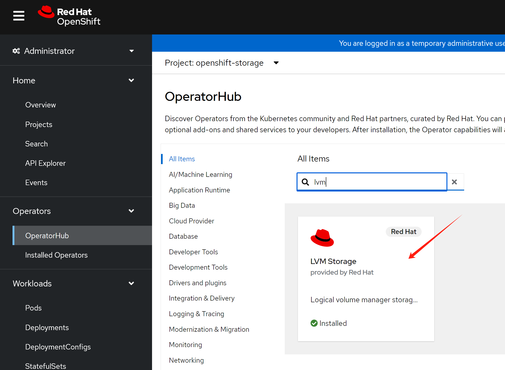
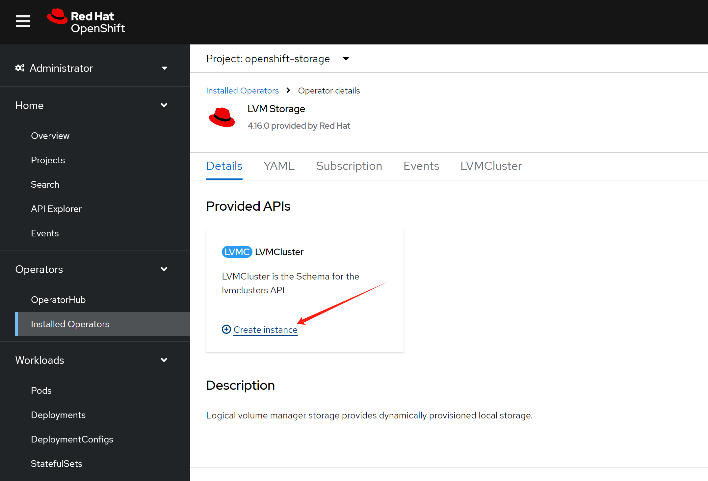

# openshift 4.15 agent install, single node

- with nic bond

# define baremetal

<!-- It is c3.medium.x86 -> 24C, 64G -->
It is m3.small.x86 -> 8C/16C, 64G

public dns
- master-01-demo.demo-01-rhsys.wzhlab.top -> 
- api.demo-01-rhsys.wzhlab.top -> 192.168.99.23
- api-int.demo-rhsys.wzhlab.top ->
- *.apps.demo-rhsys.wzhlab.top -> 192.168.99.23

# on baremetal host

## over commit and nat

```bash

cat << EOF >> /etc/sysctl.d/99-wzh-sysctl.conf

vm.overcommit_memory = 1
net.ipv4.ip_forward = 1

EOF
sysctl --system 

sysctl -a | grep overcommit_memory
# vm.overcommit_memory = 1

sysctl -a | grep ip_forward
# net.ipv4.ip_forward = 1
# net.ipv4.ip_forward_update_priority = 1
# net.ipv4.ip_forward_use_pmtu = 0
```

## nested virtulization

```bash
# first, go to kvm host to config nested kvm
# https://zhuanlan.zhihu.com/p/35320117
cat /sys/module/kvm_intel/parameters/nested
# Y

```

# lvs config

```bash

pvcreate -y /dev/sdb
vgcreate vgdata /dev/sdb

# https://access.redhat.com/articles/766133
lvcreate -y -n poolA -L 100G vgdata
lvcreate -y -n poolA_meta -L 1G vgdata
lvconvert -y --thinpool vgdata/poolA --poolmetadata vgdata/poolA_meta
  # Thin pool volume with chunk size 64.00 KiB can address at most <15.88 TiB of data.
  # WARNING: Converting vgdata/poolA and vgdata/poolA_meta to thin pool's data and metadata volumes with metadata wiping.
  # THIS WILL DESTROY CONTENT OF LOGICAL VOLUME (filesystem etc.)
  # Converted vgdata/poolA and vgdata/poolA_meta to thin pool.

lvextend -l +100%FREE vgdata/poolA
  # Rounding size to boundary between physical extents: <1.09 GiB.
  # Size of logical volume vgdata/poolA_tmeta changed from 1.00 GiB (256 extents) to <1.09 GiB (279 extents).
  # Size of logical volume vgdata/poolA_tdata changed from 500.00 GiB (128000 extents) to <1.09 TiB (285457 extents).
  # Logical volume vgdata/poolA successfully resized.

```


## network setup

```bash

# mkfs.xfs /dev/sdd

# mkdir -p /data

# cat << EOF >> /etc/fstab
# /dev/sdd /data                  xfs     defaults        0 0

# EOF

dnf -y install byobu htop jq ipmitool nmstate /usr/bin/htpasswd

dnf groupinstall -y development server 'server with gui'

dnf -y install qemu-kvm libvirt libguestfs-tools virt-install virt-viewer virt-manager tigervnc-server

systemctl enable --now libvirtd


mkdir -p /data/kvm
cd /data/kvm

# create network bridge

cat << EOF >  /data/kvm/virt-net.xml
<network>
  <name>br-ocp</name>
  <forward mode='nat'>
    <nat>
      <port start='1024' end='65535'/>
    </nat>
  </forward>
  <bridge name='br-ocp' stp='on' delay='0'/>
  <domain name='br-ocp'/>
  <ip address='192.168.99.1' netmask='255.255.255.0'>
  </ip>
</network>
EOF

virsh net-define --file /data/kvm/virt-net.xml
virsh net-autostart br-ocp
virsh net-start br-ocp


virsh net-list --all
#  Name      State    Autostart   Persistent
# --------------------------------------------
#  br-ocp    active   yes         yes
#  default   active   yes         yes


cat << EOF >> /etc/rc.d/rc.local

iptables -t nat -A POSTROUTING -o bond0 -j MASQUERADE

EOF
chmod +x /etc/rc.d/rc.local
systemctl enable --now rc-local


# ssh into 
# var_internal_ip=192.168.99.23
# var_external_port=12022
# iptables -t nat -A PREROUTING -p tcp --dport $var_external_port -d 127.0.0.1 -j DNAT --to-destination $var_internal_ip:22

# iptables -A FORWARD -p tcp -d $var_internal_ip --dport 22 -m state --state NEW,ESTABLISHED,RELATED -j ACCEPT


```

## vnc setup

```bash

dnf groupinstall -y "Server with GUI"

dnf groupinstall -y "development"

dnf update -y

dnf install -y /usr/bin/nmstatectl /usr/bin/htpasswd

systemctl disable --now firewalld.service

dnf -y install tigervnc-server

# as user lab-user, or root which is not recommend
vncpasswd

cat << EOF > ~/.vnc/config
session=gnome
securitytypes=vncauth,tlsvnc
# desktop=sandbox
geometry=1440x855
alwaysshared
localhost=yes
EOF

# as user root
cat << EOF >> /etc/tigervnc/vncserver.users
:2=root
:3=lab-user
EOF

# systemctl start vncserver@:2
# 如果你想停掉vnc server，这么做
# systemctl stop vncserver@:2

# systemctl restart vncserver@:3

systemctl enable --now vncserver@:2

# systemctl disable --now vncserver@:3

# on local host
# open a ssh session for vnc, and webproxy
# jump into the demo env through http proxy localhost:18801
while true
do
  ssh -v -D 18801 -L 15903:127.0.0.1:5903 -N -o ConnectTimeout=1 lab-user@bastion-xxxxx.dynamic.redhatworkshops.io
done


# after create vm for sno-master-0
# set static address on sno-master-0
# nmcli con mod 'Wired connection 1' conn.id ens224
# nmcli connection modify ens224 ipv4.addresses 192.168.99.23/24
# nmcli connection modify ens224 ipv4.method manual
# nmcli connection modify ens224 connection.autoconnect yes
# nmcli connection reload
# nmcli connection up ens224

# on helper node
# create a new address for helper node
# nmcli con mod 'System eth0' +ipv4.add 192.168.99.10/24
# nmcli connection reload
# nmcli connection up 'System eth0'


# nmcli con mod 'System eth0' -ipv4.add 192.168.99.10/24
# nmcli connection reload
# nmcli connection up 'System eth0'


# on test rocky vm
# nmcli con mod 'ens192' +ipv4.add 192.168.99.11/24
# nmcli connection reload
# nmcli connection up 'ens192'

# nmcli con mod 'ens192' -ipv4.add 192.168.99.11/24
# nmcli connection reload
# nmcli connection up 'ens192'


```

## ocp setup

```bash

# create a user and create the cluster under the user

useradd -m cluster-01

su - cluster-01

ssh-keygen

cat << EOF > ~/.ssh/config
StrictHostKeyChecking no
UserKnownHostsFile=/dev/null
EOF

chmod 600 ~/.ssh/config

cat << 'EOF' >> ~/.bashrc

export BASE_DIR=$HOME

EOF


# switch to you install version

export BUILDNUMBER=4.15.22

mkdir -p ${BASE_DIR}/data/ocp-${BUILDNUMBER}
mkdir -p ${BASE_DIR}/.local/bin

cd ${BASE_DIR}/data/ocp-${BUILDNUMBER}

wget -O openshift-client-linux-${BUILDNUMBER}.tar.gz https://mirror.openshift.com/pub/openshift-v4/x86_64/clients/ocp/${BUILDNUMBER}/openshift-client-linux-${BUILDNUMBER}.tar.gz
wget -O openshift-install-linux-${BUILDNUMBER}.tar.gz https://mirror.openshift.com/pub/openshift-v4/x86_64/clients/ocp/${BUILDNUMBER}/openshift-install-linux-${BUILDNUMBER}.tar.gz
wget -O oc-mirror.tar.gz https://mirror.openshift.com/pub/openshift-v4/x86_64/clients/ocp/${BUILDNUMBER}/oc-mirror.tar.gz

tar -xzf openshift-client-linux-${BUILDNUMBER}.tar.gz -C $HOME/.local/bin/
tar -xzf openshift-install-linux-${BUILDNUMBER}.tar.gz -C $HOME/.local/bin/

tar -xzf oc-mirror.tar.gz -C $HOME/.local/bin/
chmod +x $HOME/.local/bin/oc-mirror

# tar -xzf openshift-client-linux-${BUILDNUMBER}.tar.gz -C /usr/local/bin/
# tar -xzf openshift-install-linux-${BUILDNUMBER}.tar.gz -C /usr/local/bin/
# tar -xzf oc-mirror.tar.gz -C /usr/local/bin/
# chmod +x /usr/local/bin/oc-mirror


# client for butane
wget  -nd -np -e robots=off --reject="index.html*" -P ./ --recursive -A "butane-amd64" https://mirror.openshift.com/pub/openshift-v4/x86_64/clients/butane/latest/

# coreos-installer
wget  -nd -np -e robots=off --reject="index.html*" -P ./ -r -A "coreos-installer_amd64" https://mirror.openshift.com/pub/openshift-v4/x86_64/clients/coreos-installer/latest/


install -m 755 ./butane-amd64 $HOME/.local/bin/butane
install -m 755 ./coreos-installer_amd64 $HOME/.local/bin/coreos-installer


# start ocp config and install

export BUILDNUMBER=4.15.22

mkdir -p ${BASE_DIR}/data/{sno/disconnected,install}

# set some parameter of you rcluster

NODE_SSH_KEY="$(cat ${BASE_DIR}/.ssh/id_rsa.pub)"
# INSTALL_IMAGE_REGISTRY=quaylab.infra.wzhlab.top:5443

# PULL_SECRET='{"auths":{"registry.redhat.io": {"auth": "ZHVtbXk6ZHVtbXk=","email": "noemail@localhost"},"registry.ocp4.redhat.ren:5443": {"auth": "ZHVtbXk6ZHVtbXk=","email": "noemail@localhost"},"'${INSTALL_IMAGE_REGISTRY}'": {"auth": "'$( echo -n 'admin:shadowman' | openssl base64 )'","email": "noemail@localhost"}}}'
PULL_SECRET=$(cat ${BASE_DIR}/data/pull-secret.json)

NTP_SERVER=time1.google.com
# HELP_SERVER=192.168.32.10
# KVM_HOST=192.168.7.11
# API_VIP=192.168.77.99
# INGRESS_VIP=192.168.77.98
# CLUSTER_PROVISION_IP=192.168.7.103
# BOOTSTRAP_IP=192.168.7.12
MACHINE_NETWORK='192.168.99.0/24'

# 定义单节点集群的节点信息
SNO_CLUSTER_NAME=demo-01-rhsys
SNO_BASE_DOMAIN=wzhlab.top

# BOOTSTRAP_IP=172.21.6.22
MASTER_01_IP=192.168.99.23
# MASTER_02_IP=172.21.6.24
# MASTER_03_IP=172.21.6.25
# WORKER_01_IP=172.21.6.26
# WORKER_02_IP=172.21.6.27
# WORKER_03_IP=172.21.6.28

# BOOTSTRAP_IPv6=fd03::22
MASTER_01_IPv6=fd03::23
# MASTER_02_IPv6=fd03::24
# MASTER_03_IPv6=fd03::25
# WORKER_01_IPv6=fd03::26
# WORKER_02_IPv6=fd03::27
# WORKER_03_IPv6=fd03::28

# BOOTSTRAP_HOSTNAME=bootstrap-demo
MASTER_01_HOSTNAME=master-01-demo
# MASTER_02_HOSTNAME=master-02-demo
# MASTER_03_HOSTNAME=master-03-demo
# WORKER_01_HOSTNAME=worker-01-demo
# WORKER_02_HOSTNAME=worker-02-demo
# WORKER_03_HOSTNAME=worker-03-demo

# BOOTSTRAP_INTERFACE=enp1s0
MASTER_01_INTERFACE=enp1s0
MASTER_01_SECONDARY_INTERFACE=enp2s0
# MASTER_02_INTERFACE=enp1s0
# MASTER_03_INTERFACE=enp1s0
# WORKER_01_INTERFACE=enp1s0
# WORKER_02_INTERFACE=enp1s0
# WORKER_03_INTERFACE=enp1s0

MASTER_01_INTERFACE_MAC=00:50:56:8e:b8:11
MASTER_01_SECONDARY_INTERFACE_MAC=00:50:56:8e:b8:12
# MASTER_02_INTERFACE_MAC=52:54:00:12:A1:02
# MASTER_03_INTERFACE_MAC=52:54:00:12:A1:03
# WORKER_01_INTERFACE_MAC=52:54:00:12:A1:04
# WORKER_02_INTERFACE_MAC=52:54:00:12:A1:05
# WORKER_03_INTERFACE_MAC=52:54:00:12:A1:06

# BOOTSTRAP_DISK=/dev/vda
MASTER_01_DISK=/dev/vda
# MASTER_02_DISK=/dev/vda
# MASTER_03_DISK=/dev/vda
# WORKER_01_DISK=/dev/vda
# WORKER_02_DISK=/dev/vda
# WORKER_03_DISK=/dev/vda

OCP_GW=192.168.99.1
OCP_NETMASK=255.255.255.0
OCP_NETMASK_S=24
OCP_DNS=8.8.8.8

OCP_GW_v6=fd03::11
OCP_NETMASK_v6=64

# echo ${SNO_IF_MAC} > /data/sno/sno.mac

mkdir -p ${BASE_DIR}/data/install
cd ${BASE_DIR}/data/install

/bin/rm -rf *.ign .openshift_install_state.json auth bootstrap manifests master*[0-9] worker*[0-9] *

cat << EOF > ${BASE_DIR}/data/install/install-config.yaml 
apiVersion: v1
baseDomain: $SNO_BASE_DOMAIN
compute:
- name: worker
  replicas: 0 
controlPlane:
  name: master
  replicas: 1
metadata:
  name: $SNO_CLUSTER_NAME
networking:
  # OVNKubernetes , OpenShiftSDN
  networkType: OVNKubernetes 
  clusterNetwork:
    - cidr: 10.132.0.0/14 
      hostPrefix: 23
    # - cidr: fd02::/48
    #   hostPrefix: 64
  machineNetwork:
    - cidr: $MACHINE_NETWORK
    # - cidr: 2001:DB8::/32
  serviceNetwork:
    - 172.22.0.0/16
    # - fd03::/112
platform: 
  none: {}
pullSecret: '${PULL_SECRET}'
sshKey: |
$( cat ${BASE_DIR}/.ssh/id_rsa.pub | sed 's/^/   /g' )
# additionalTrustBundle: |
# \$( cat /etc/crts/redhat.ren.ca.crt | sed 's/^/   /g' )
# imageContentSources:
# - mirrors:
#   - ${INSTALL_IMAGE_REGISTRY}/ocp4/openshift4
#   source: quay.io/openshift-release-dev/ocp-release
# - mirrors:
#   - ${INSTALL_IMAGE_REGISTRY}/ocp4/openshift4
#   source: quay.io/openshift-release-dev/ocp-v4.0-art-dev
EOF

# https://access.redhat.com/solutions/7048618
cat << EOF > ${BASE_DIR}/data/install/agent-config.yaml
apiVersion: v1alpha1
kind: AgentConfig
metadata:
  name: $SNO_CLUSTER_NAME
rendezvousIP: $MASTER_01_IP
additionalNTPSources:
- $NTP_SERVER
hosts:
  - hostname: $MASTER_01_HOSTNAME
    role: master
    rootDeviceHints:
      deviceName: "$MASTER_01_DISK"
    interfaces:
      - name: $MASTER_01_INTERFACE
        macAddress: $MASTER_01_INTERFACE_MAC
      - name: $MASTER_01_SECONDARY_INTERFACE
        macAddress: $MASTER_01_SECONDARY_INTERFACE_MAC
    networkConfig:
      interfaces:
        - name: bond0 
          type: bond 
          state: up
          mac-address: $MASTER_01_INTERFACE_MAC
          ipv4:
            enabled: true
            address:
            - ip: $MASTER_01_IP
              prefix-length: $OCP_NETMASK_S
            dhcp: false
          ipv6:
            enabled: false
          link-aggregation:
            mode: active-backup 
            options:
              primary: $MASTER_01_INTERFACE
            port:
            - $MASTER_01_INTERFACE
            - $MASTER_01_SECONDARY_INTERFACE
      dns-resolver:
        config:
          server:
            - $OCP_DNS
      routes:
        config:
          - destination: 0.0.0.0/0
            next-hop-address: $OCP_GW
            next-hop-interface: bond0
            table-id: 254
EOF

/bin/cp -f ${BASE_DIR}/data/install/install-config.yaml ${BASE_DIR}/data/install/install-config.yaml.bak

openshift-install --dir=${BASE_DIR}/data/install agent create cluster-manifests

# you can change the system's registry config
# but do not need under normal situation
# sudo bash -c "/bin/cp -f mirror/registries.conf /etc/containers/registries.conf.d/; chmod +r /etc/containers/registries.conf.d/*"

# /bin/cp -f  /data/ocp4/ansible-helper/files/* ${BASE_DIR}/data/install/openshift/

# sudo bash -c "cd /data/ocp4 ; bash image.registries.conf.sh quaylab.infra.wzhlab.top:5443 ;"

# we lost the way to customize the registry during install stage
# leave the configuration to day-2 operation.
# /bin/cp -f /data/ocp4/99-worker-container-registries.yaml ${BASE_DIR}/data/install/openshift
# /bin/cp -f /data/ocp4/99-master-container-registries.yaml ${BASE_DIR}/data/install/openshift

cd ${BASE_DIR}/data/install/

# openshift-install --dir=${BASE_DIR}/data/install create ignition-configs 

# there is additinal file cache
# 我们发现，除了iso，其他文件，就算提前下载了，他还是会重新下载。
mkdir -p ${HOME}/.cache/agent/{files_cache,image_cache}

# oc image extract -a /data/pull-secret.json --path /coreos/coreos-x86_64.iso:${HOME}/.cache/agent/image_cache --confirm quaylab.infra.wzhlab.top:5443/ocp4/openshift4:$BUILDNUMBER-x86_64-machine-os-images

# oc image extract -a /data/pull-secret.json --path /usr/lib64/libnmstate.so.*:${HOME}/.cache/agent/files_cache --confirm  quaylab.infra.wzhlab.top:5443/ocp4/openshift4:$BUILDNUMBER-x86_64-agent-installer-node-agent

# oc image extract -a /data/pull-secret.json --path /usr/bin/agent-tui:${HOME}/.cache/agent/files_cache --confirm  quaylab.infra.wzhlab.top:5443/ocp4/openshift4:$BUILDNUMBER-x86_64-agent-installer-node-agent

# mkdir -p ~/.cache/agent/image_cache/
# /bin/cp -f /data/ocp-$BUILDNUMBER/rhcos-live.x86_64.iso ~/.cache/agent/image_cache/coreos-x86_64.iso

openshift-install --dir=${BASE_DIR}/data/install agent create image --log-level=debug
# ......
# DEBUG Fetching image from OCP release (oc adm release info --image-for=machine-os-images --insecure=true --icsp-file=/tmp/icsp-file3636774741 quay.io/openshift-release-dev/ocp-release@sha256:96bf74ce789ccb22391deea98e0c5050c41b67cc17defbb38089d32226dba0b8)
# DEBUG The file was found in cache: /home/3node/.cache/agent/image_cache/coreos-x86_64.iso
# INFO Verifying cached file
# DEBUG extracting /coreos/coreos-x86_64.iso.sha256 to /tmp/cache1876698393, oc image extract --path /coreos/coreos-x86_64.iso.sha256:/tmp/cache1876698393 --confirm --icsp-file=/tmp/icsp-file455852761 quay.io/openshift-release-dev/ocp-v4.0-art-dev@sha256:052130abddf741195b6753888cf8a00757dedeb7010f7d4dcc4b842b5bc705f6
# ......

```

# create kvm to auto install


```bash

# clean all lv
# List all LVs and grep those starting with 'lv'
lv_list=$(lvdisplay -c | cut -d: -f1 | grep '.*/lv')

# Loop through each LV and remove it
for lv in $lv_list; do
  echo "Deleting $lv..."
  lvremove -f $lv
done


create_lv() {
    var_vg=$1
    var_pool=$2
    var_lv=$3
    var_size=$4
    var_action=$5
    lvremove -f $var_vg/$var_lv || true
    # lvcreate -y -L $var_size -n $var_lv $var_vg
    if [ "$var_action" == "recreate" ]; then
      lvcreate --type thin -n $var_lv -V $var_size --thinpool $var_vg/$var_pool
      wipefs --all --force /dev/$var_vg/$var_lv
    fi
}


SNO_MEM=56

virsh destroy demo-01-master-01
virsh undefine demo-01-master-01

create_lv vgdata poolA lv-demo-01-master-01 200G recreate
create_lv vgdata poolA lv-demo-01-master-01-data 500G recreate

MASTER_01_INTERFACE_MAC=00:50:56:8e:b8:11
MASTER_01_SECONDARY_INTERFACE_MAC=00:50:56:8e:b8:12

# /bin/cp -f /home/cluster-01/data/install/agent.x86_64.iso /data/kvm/agent.x86_64.iso

virt-install --name=demo-01-master-01 --vcpus=24 --ram=$(($SNO_MEM*1024)) \
  --cpu=host-model \
  --disk path=/dev/vgdata/lv-demo-01-master-01,device=disk,bus=virtio,format=raw \
  --disk path=/dev/vgdata/lv-demo-01-master-01-data,device=disk,bus=virtio,format=raw \
  --os-variant rhel9.3 \
  --network bridge=br-ocp,model=virtio,mac=$MASTER_01_INTERFACE_MAC \
  --network bridge=br-ocp,model=virtio,mac=$MASTER_01_SECONDARY_INTERFACE_MAC \
  --graphics vnc,listen=127.0.0.1,port=59003 --noautoconsole \
  --boot menu=on --cdrom /home/cluster-01/data/install/agent.x86_64.iso


```

```bash

# if install stopped
# login to the vm
# check and change dns setting 
# under most situation, the dns setting is wrong
# then restart several systemd service, to continue the install
systemctl restart apply-host-config.service
systemctl restart agent
systemctl restart start-cluster-installation.service


```

# on helper to see result

for unkonwn reason, the vm will be shutdown, instead of reboot, you have to poweron it manually.

```bash
cd ${BASE_DIR}/data/install
export KUBECONFIG=${BASE_DIR}/data/install/auth/kubeconfig
echo "export KUBECONFIG=${BASE_DIR}/data/install/auth/kubeconfig" >> ~/.bashrc
# oc completion bash | sudo tee /etc/bash_completion.d/openshift > /dev/null


cd ${BASE_DIR}/data/install
openshift-install --dir=${BASE_DIR}/data/install agent wait-for bootstrap-complete --log-level=debug
# ......
# DEBUG RendezvousIP from the AgentConfig 172.21.6.23
# INFO Bootstrap Kube API Initialized
# INFO Bootstrap configMap status is complete
# INFO cluster bootstrap is complete

cd ${BASE_DIR}/data/install
openshift-install --dir=${BASE_DIR}/data/install agent wait-for install-complete --log-level=debug
# ......
# INFO Cluster is installed
# INFO Install complete!
# INFO To access the cluster as the system:admin user when using 'oc', run
# INFO     export KUBECONFIG=/home/cluster-01/data/install/auth/kubeconfig
# INFO Access the OpenShift web-console here: https://console-openshift-console.apps.demo-01-rhsys.wzhlab.top
# INFO Login to the console with user: "kubeadmin", and password: "zNPVf-PI6hG-jPI52-CDIs3"

```

# setup htpasswd identity provider

- https://docs.openshift.com/container-platform/4.13/authentication/identity_providers/configuring-htpasswd-identity-provider.html

```bash

# init the htpasswd file
htpasswd -c -B -b ${BASE_DIR}/data/install/users.htpasswd admin redhat

# add additional user
htpasswd -B -b ${BASE_DIR}/data/install/users.htpasswd user01 redhat

# import the htpasswd file
oc create secret generic htpass-secret \
  --from-file=htpasswd=${BASE_DIR}/data/install/users.htpasswd \
  -n openshift-config 

cat << EOF > ${BASE_DIR}/data/install/oauth.yaml
spec:
  identityProviders:
  - name: htpasswd
    mappingMethod: claim 
    type: HTPasswd
    htpasswd:
      fileData:
        name: htpass-secret
EOF
oc patch oauth/cluster --type merge --patch-file=${BASE_DIR}/data/install/oauth.yaml

oc adm policy add-cluster-role-to-user cluster-admin admin

oc adm policy add-role-to-user admin user01 -n llm-demo

```

# lvm operator

It is vsphere, we can add 2nd disk to the vm, and use lvm operator to create pv, pvc, and pv



Create lvm cluster with default setting.



```bash

oc get sc

# oc patch storageclass current-default-sc -p '{"metadata": {"annotations":{"storageclass.kubernetes.io/is-default-class":"false"}}}'

oc patch storageclass lvms-vg1 -p '{"metadata": {"annotations":{"storageclass.kubernetes.io/is-default-class":"true"}}}'

```

# create helper vm

```bash

cd /data/kvm

wget https://raw.githubusercontent.com/wangzheng422/docker_env/dev/redhat/ocp4/4.16/files/helper-ks-rocky9.cfg

sed -i '0,/^network.*/s/^network.*/network  --bootproto=static --device=enp1s0 --gateway=192.168.77.1 --ip=192.168.77.10  --netmask=255.255.255.0 --nameserver=192.168.77.1  --ipv6=auto --activate/' helper-ks-rocky9.cfg

create_lv() {
    var_vg=$1
    var_pool=$2
    var_lv=$3
    var_size=$4
    var_action=$5
    lvremove -f $var_vg/$var_lv || true
    # lvcreate -y -L $var_size -n $var_lv $var_vg
    if [ "$var_action" == "recreate" ]; then
      lvcreate --type thin -n $var_lv -V $var_size --thinpool $var_vg/$var_pool
      wipefs --all --force /dev/$var_vg/$var_lv
    fi
}


SNO_MEM=4

virsh destroy helper
virsh undefine helper

create_lv vgdata poolA lv-helper 20G recreate

virt-install --name=helper --vcpus=2 --ram=$(($SNO_MEM*1024)) \
  --cpu=host-model \
  --disk path=/dev/vgdata/lv-helper,device=disk,bus=virtio,format=raw \
  --os-variant rhel9.3 \
  --network bridge=br-ocp,model=virtio \
  --graphics vnc,listen=127.0.0.1,port=59001 --noautoconsole \
  --boot menu=on --location /data/kvm/Rocky-9.4-x86_64-minimal.iso \
  --initrd-inject helper-ks-rocky9.cfg --extra-args "inst.ks=file:/helper-ks-rocky9.cfg"


```


# end