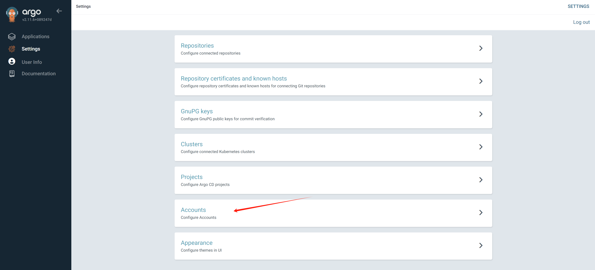

# rhdh for book

- https://github.com/developer-hub-books/rhdh-book1-templates

# install gitlab

```bash

oc new-project demo-gitlab

mkdir -p ${BASE_DIR}/data/git

cd ${BASE_DIR}/data/git

# git clone https://github.com/redhat-gpte-devopsautomation/agnosticg.git
git clone --branch wzh https://github.com/wangzheng422/agnosticg

cd agnosticg/charts/gitlab/

cat << EOF > ./values.yaml
gitlab:
  email:
    address: "gitlab@example.com"
    displayName: "wzh"
    replyTo: "noreply@wzhlab.top"
  smtp:
    enabled: "false"
    domain: "example.com"
    host: "smtp.gitlab-demo-gitlab.apps.demo-01-rhsys.wzhlab.top"
    port: "587"
    user: "gitlab"
    password: "gitlab"
  ssh:
    host: "ssh.gitlab-demo-gitlab.apps.demo-01-rhsys.wzhlab.top"
    port: "22"
  rootPassword: openshift
  host: gitlab-demo-gitlab.apps.demo-01-rhsys.wzhlab.top
  https: "true"
  rootEmail: "admin@wzhlab.top"
  keyBase:
    db: "0123456789"
    otp: "0123456789"
    secret: "0123456789"
  users:
    password: openshift
    count: 2
  groups: []
  # groups:
  # - name: backstage
  #   repo:
  #   - name: software-templates
  #     url: https://github.com/treddy08/software-templates.git

postgresql:
  dbUser: gitlab
  dbPassword: passw0rd
  dbName: gitlab_production

EOF

# remove the role binding we created before
oc delete rolebinding admin --namespace demo-gitlab

# install gitlab using helm
helm install gitlab . --namespace demo-gitlab
# NAME: gitlab
# LAST DEPLOYED: Mon Aug 12 21:38:23 2024
# NAMESPACE: demo-gitlab
# STATUS: deployed
# REVISION: 1
# TEST SUITE: None

# if you want to remove the gitlab deployment
# helm uninstall gitlab --namespace demo-gitlab


```

<!-- Scopes 	
- read_user (Read the authenticated user's personal information)
- read_repository (Allows read-only access to the repository)
- write_repository (Allows read-write access to the repository)
- openid (Authenticate using OpenID Connect)
- profile (Allows read-only access to the user's personal information using OpenID Connect)
- email (Allows read-only access to the user's primary email address using OpenID Connect) -->

create a group `development`, for usage in this lab.


when create web hook, it will report `Url is blocked: Requests to the local network are not allowed`, so we need to add the following to the gitlab config.

- https://docs.gitlab.com/ee/security/webhooks.html#allowlist-for-local-requests


# install gitops

Just install the redhat gitops operator, it will create an argocd instance by default, but we will not use the default one, we will create a new argocd instance.


How to deal with gitlab self-cert
- https://argo-cd.readthedocs.io/en/stable/user-guide/private-repositories/#self-signed-untrusted-tls-certificates

```bash
# get ingress cert of openshift
oc get secret router-certs-default -n openshift-ingress -o jsonpath='{.data.tls\.crt}' | base64 --decode > ${BASE_DIR}/data/install/openshift-ingress.crt

# cat ${BASE_DIR}/data/install/openshift-ingress.crt
# # the content of your openshift ingress cert

# create a configmap, add the content of openshift-ingress.crt to a host key
oc delete configmap argocd-tls-certs-cm -n demo-gitops
oc create configmap argocd-tls-certs-cm -n demo-gitops --from-file=gitlab-demo-gitlab.apps.demo-01-rhsys.wzhlab.top=${BASE_DIR}/data/install/openshift-ingress.crt
oc label configmap argocd-tls-certs-cm -n demo-gitops app.kubernetes.io/name=argocd-tls-certs-cm app.kubernetes.io/part-of=argocd


```
If you want to do it manually.


Now, create the argocd/gitops instance.

```bash

ARGOCD_NS="demo-gitops"
ARGOCD_INSTANCE_NAME="argocd"

oc new-project $ARGOCD_NS

oc delete -f ${BASE_DIR}/data/install/argocd.yaml -n $ARGOCD_NS
# https://github.com/argoproj/argo-cd/blob/master/docs/operator-manual/user-management/index.md
cat << EOF > ${BASE_DIR}/data/install/argocd.yaml
# ---
# apiVersion: v1
# kind: ConfigMap
# metadata:
#   name: argocd-wzh-user-cm
#   labels:
#     app.kubernetes.io/name: argocd-wzh-user-cm
#     app.kubernetes.io/part-of: argocd
# data:
#   # add an additional local user with apiKey and login capabilities
#   #   apiKey - allows generating API keys
#   #   login - allows to login using UI
#   accounts.alice: apiKey, login
#   # disables user. User is enabled by default
#   accounts.alice.enabled: "true"

---
apiVersion: argoproj.io/v1beta1
kind: ArgoCD
metadata:
  name: $ARGOCD_INSTANCE_NAME
spec:
  extraConfig:
    accounts.alice: apiKey, login
    accounts.alice.enabled: "true"
  server:
    route:
      enabled: true
      tls:
        termination: passthrough
  applicationInstanceLabelKey: wzhlab.top/demo-argocd
  rbac:
    defaultPolicy: 'role:admin'
    policy: |
      g, system:cluster-admins, role:admin
      g, alice, role:admin
      p, alice, *, *, *, allow
    scopes: '[groups]'
  controller:
    appSync: 30s

EOF

oc create --save-config -f ${BASE_DIR}/data/install/argocd.yaml -n $ARGOCD_NS

# get password for admin
oc get secret argocd-cluster -n $ARGOCD_NS -o jsonpath='{.data.admin\.password}' | base64 --decode && echo
# X6KEJ0wPimlMFj7CkfAULQITW9ZBxh2V

# create passwd for alice
argocd login argocd-demo-gitops.apps.demo-01-rhsys.wzhlab.top
# Context 'kubernetes' updated

argocd proj list
# NAME     DESCRIPTION  DESTINATIONS  SOURCES  CLUSTER-RESOURCE-WHITELIST  NAMESPACE-RESOURCE-BLACKLIST  SIGNATURE-KEYS  ORPHANED-RESOURCES
# default               *,*           *        */*                         <none>                        <none>          disabled

argocd account update-password --account alice --new-password redhatocp
# *** Enter password of currently logged in user (admin):
# Password updated

argocd account generate-token --account alice
# eyJhbGxxxxxxxxxxxxxxxxxxxxxxx

argocd account list
# NAME   ENABLED  CAPABILITIES
# admin  true     login
# alice  true     apiKey, login

```

To create token for user alice, login argocd instance webui using admin, and get the password from secret.




Copy the generated token, it will not be shown again.

To ensure everything is ok, just try to create a new app following:
- https://github.com/rh-mobb/gitops-bgd-app/tree/main/apps/welcome-php/base
We can know, the gitops/argocd is working.


# install pipeline

Just install the redhat pipeline operator, there is no need to create a pipeline instance.

# install External Secrets Operator


deploy an operator config instance first.

# install rhsso/keycloak


```bash
oc new-project demo-keycloak


oc delete -f ${BASE_DIR}/data/install/keycloak-db.yaml -n demo-keycloak

cat << EOF > ${BASE_DIR}/data/install/keycloak-db.yaml
apiVersion: apps/v1
kind: StatefulSet
metadata:
  name: postgresql-db
spec:
  serviceName: postgresql-db-service
  selector:
    matchLabels:
      app: postgresql-db
  replicas: 1
  template:
    metadata:
      labels:
        app: postgresql-db
    spec:
      containers:
        - name: postgresql-db
          image: postgres:15
          volumeMounts:
            - mountPath: /data
              name: cache-volume
          env:
            - name: POSTGRES_USER
              value: testuser
            - name: POSTGRES_PASSWORD
              value: testpassword
            - name: PGDATA
              value: /data/pgdata
            - name: POSTGRES_DB
              value: keycloak
      volumes:
        - name: cache-volume
          ephemeral:
            volumeClaimTemplate:
              metadata:
                labels:
                  app: postgresql-db
              spec:
                accessModes: [ "ReadWriteOnce" ]
                resources:
                  requests:
                    # storage size does not matter for hostpath, becuase it will use all of the disk free space.
                    # but it must be set to actual required size for other storage class
                    storage: 1Gi
---
apiVersion: v1
kind: Service
metadata:
  name: postgres-db
spec:
  selector:
    app: postgresql-db
  type: LoadBalancer
  ports:
  - port: 5432
    targetPort: 5432

EOF

oc create -f ${BASE_DIR}/data/install/keycloak-db.yaml -n demo-keycloak


RHSSO_HOST="keycloak-demo-keycloak.apps.demo-01-rhsys.wzhlab.top"

cd ${BASE_DIR}/data/install/

openssl req -subj "/CN=$RHSSO_HOST/O=Test Keycloak./C=US" -newkey rsa:2048 -nodes -keyout key.pem -x509 -days 365 -out certificate.pem

oc delete secret example-tls-secret -n demo-keycloak
oc create secret tls example-tls-secret --cert certificate.pem --key key.pem -n demo-keycloak


oc delete secret keycloak-db-secret -n demo-keycloak
oc create secret generic keycloak-db-secret -n demo-keycloak \
  --from-literal=username=testuser \
  --from-literal=password=testpassword


oc delete -f ${BASE_DIR}/data/install/keycloak.yaml -n demo-keycloak

cat << EOF > ${BASE_DIR}/data/install/keycloak.yaml
apiVersion: k8s.keycloak.org/v2alpha1
kind: Keycloak
metadata:
  name: example-kc
spec:
  instances: 1
  db:
    vendor: postgres
    host: postgres-db
    usernameSecret:
      name: keycloak-db-secret
      key: username
    passwordSecret:
      name: keycloak-db-secret
      key: password
  http:
    tlsSecret: example-tls-secret
  # ingress:
  #   className: openshift-default
  hostname:
    hostname: $RHSSO_HOST
  proxy:
    headers: xforwarded
EOF

oc create -f ${BASE_DIR}/data/install/keycloak.yaml -n demo-keycloak

oc get secret example-kc-initial-admin -n demo-keycloak -o jsonpath='{.data.username}' | base64 --decode && echo
# admin

oc get secret example-kc-initial-admin -n demo-keycloak -o jsonpath='{.data.password}' | base64 --decode && echo
# b60d1b2c0cdc4b10a3e7b46f234286e8

```


`https://<RHDH_URL>/api/auth/oidc/handler/frame`


# install rhdh

Create a new namespace for rhdh deployment.

```bash
oc new-project demo-rhdh
```


# config rhdh


For github, go to developer settings, and add personal access token. Following https://backstage.io/docs/integrations/github/locations , to add authentication.

For keycloak
- use chrome to access the webUI
- get the metadataurl from the realm


```bash

# for k8s plugin
# let the plugin access k8s resources
oc delete -f ${BASE_DIR}/data/install/role-rhdh.yaml

cat << EOF > ${BASE_DIR}/data/install/role-rhdh.yaml
apiVersion: rbac.authorization.k8s.io/v1
kind: ClusterRole
metadata:
  name: backstage-read-only
rules:
  - apiGroups:
      - '*'
    resources:
      - pods
      - configmaps
      - services
      - deployments
      - replicasets
      - horizontalpodautoscalers
      - ingresses
      - statefulsets
      - limitranges
      - resourcequotas
      - daemonsets
      - pipelineruns
      - taskruns
      - routes
    verbs:
      - get
      - list
      - watch
  - apiGroups:
      - batch
    resources:
      - jobs
      - cronjobs
    verbs:
      - get
      - list
      - watch
  - apiGroups:
      - metrics.k8s.io
    resources:
      - pods
    verbs:
      - get
      - list
EOF
oc apply -f ${BASE_DIR}/data/install/role-rhdh.yaml


NAMESPACES="demo-rhdh"

oc delete -f ${BASE_DIR}/data/install/sa-rhdh.yaml
cat << EOF > ${BASE_DIR}/data/install/sa-rhdh.yaml
---
apiVersion: v1
kind: ServiceAccount
metadata:
  name: backstage-read-only-sa
  namespace: $NAMESPACES  # Replace with the appropriate namespace

---
apiVersion: rbac.authorization.k8s.io/v1
kind: ClusterRoleBinding
metadata:
  name: backstage-read-only-binding
subjects:
  - kind: ServiceAccount
    name: backstage-read-only-sa
    namespace: $NAMESPACES  # Replace with the appropriate namespace
roleRef:
  kind: ClusterRole
  name: backstage-read-only
  apiGroup: rbac.authorization.k8s.io

EOF
oc create -f ${BASE_DIR}/data/install/sa-rhdh.yaml -n $NAMESPACES

# create token of the sa, and save to variable, expire date is 100 years
SA_TOKEN=`oc create token backstage-read-only-sa --duration=876000h -n $NAMESPACES`

# SECRET_NAME=$(oc get sa backstage-read-only-sa -n $NAMESPACES -o jsonpath='{.secrets[0].name}' )
# SA_TOKEN=$(oc get secret $SECRET_NAME -n $NAMESPACES -o jsonpath='{.data.token}'  | base64 --decode)
echo $SA_TOKEN

# check the expire date of the token
echo $SA_TOKEN | cut -d '.' -f2 | base64 -d | jq -r '.exp' | xargs -I {} date -d @{}
# Sun Jul 23 10:57:39 AM CST 2124

# get env variable for backstage
OCP_BASE_URL="demo-01-rhsys.wzhlab.top"
OCP_API="https://api.$OCP_BASE_URL:6443"

GITLAB_BASE_HOST="gitlab-demo-gitlab.apps.$OCP_BASE_URL"
GITLAB_BASE_URL="https://gitlab-demo-gitlab.apps.$OCP_BASE_URL"
GITLAB_PAT="<your gitlab personal access token>"
# AUTH_GITLAB_CLIENT_ID="you gitlab client id"
# AUTH_GITLAB_CLIENT_SECRET="you gitlab client secret"

AUTH_KEYCLOAK_CLIENT_ID="rhdh-client"
AUTH_KEYCLOAK_CLIENT_SECRET="<your keycloak client secret>"
KEYCLOAK_BASE_URL="https://keycloak-demo-keycloak.apps.$OCP_BASE_URL"
KEYCLOAK_REALM="RHDH"
KEYCLOAK_PROMPT="auto"

SESSION_SECRET=`openssl rand -hex 32`
GITHUB_TOKEN="<your github personal access token>"

ARGOCD_NS="demo-gitops"
ARGOCD_INSTANCE_NAME="argocd"
# no ending "/"
ARGOCD_URL="https://$ARGOCD_INSTANCE_NAME-$ARGOCD_NS.apps.$OCP_BASE_URL"
ARGOCD_SECRET="$ARGOCD_INSTANCE_NAME-cluster"
ARGOCD_PASSWORD=`oc get secret $ARGOCD_SECRET -n $ARGOCD_NS -o jsonpath='{.data.admin\.password}' | base64 --decode`
ARGOCD_TOKEN="<your argocd token>"


oc delete configmap app-config-rhdh -n demo-rhdh

cat << EOF > ${BASE_DIR}/data/install/app-config-rhdh.yaml
---
kind: ConfigMap
apiVersion: v1
metadata:
  name: app-config-rhdh
data:
  app-config-rhdh.yaml: |
    app:
      title: WZH Developer Hub

    integrations:
      gitlab:
        - host: $GITLAB_BASE_HOST
          baseUrl: $GITLAB_BASE_URL
          apiBaseUrl: $GITLAB_BASE_URL/api/v4
          token: $GITLAB_PAT
      github:
        - host: github.com
          token: ${GITHUB_TOKEN}

    auth:
      environment: production
      session:
        secret: ${SESSION_SECRET}
      providers:
        oidc:
          production:
            clientId: ${AUTH_KEYCLOAK_CLIENT_ID}
            clientSecret: ${AUTH_KEYCLOAK_CLIENT_SECRET}
            metadataUrl: ${KEYCLOAK_BASE_URL}/realms/${KEYCLOAK_REALM}/.well-known/openid-configuration
            prompt: ${KEYCLOAK_PROMPT} # recommended to use auto
            # Uncomment for additional configuration options 
            # callbackUrl: ${KEYCLOAK_CALLBACK_URL} 
            # tokenEndpointAuthMethod: ${KEYCLOAK_TOKEN_ENDPOINT_METHOD} 
            # tokenSignedResponseAlg: ${KEYCLOAK_SIGNED_RESPONSE_ALG} 
            # scope: ${KEYCLOAK_SCOPE}  
            # If you are using the keycloak-backend plugin, use the preferredUsernameMatchingUserEntityName resolver to avoid a login error.
            signIn:
              resolvers:
                - resolver: preferredUsernameMatchingUserEntityName

    signInPage: oidc

    catalog:
      rules:
        - allow: [Component, System, API, Resource, Location, Template]

      locations:
        - target: https://github.com/wangzheng422/docker_env/blob/dev/redhat/ocp4/4.15/files/org.yaml
          type: url
          rules:
            - allow: [Group, User]
        - target: https://github.com/nepdemo/rhdh-book1-templates/blob/wzh/quarkus-with-angular/template.yaml
          type: url
          rules:
            - allow: [Template]
        - target: https://github.com/nepdemo/rhdh-book1-templates/blob/wzh/nestjs-with-postgres/template.yaml
          type: url
          rules:
            - allow: [Template]

      providers:
        gitlab:
          yourProviderId:
            host: gitlab-demo-gitlab.apps.demo-01-rhsys.wzhlab.top # Identifies one of the hosts set up in the integrations
            branch: main # Optional. Used to discover on a specific branch
            fallbackBranch: master # Optional. Fallback to be used if there is no default branch configured at the Gitlab repository. It is only used, if branch is undefined. Uses master as default
            skipForkedRepos: false # Optional. If the project is a fork, skip repository
            # group: example-group # Optional. Group and subgroup (if needed) to look for repositories. If not present the whole instance will be scanned
            entityFilename: catalog-info.yaml # Optional. Defaults to catalog-info.yaml
            projectPattern: '[\s\S]*' # Optional. Filters found projects based on provided patter. Defaults to [\s\S]*, which means to not filter anything
            excludeRepos: [] # Optional. A list of project paths that should be excluded from discovery, e.g. group/subgroup/repo. Should not start or end with a slash.
            schedule: # Same options as in TaskScheduleDefinition. Optional for the Legacy Backend System
              # supports cron, ISO duration, "human duration" as used in code
              frequency: { minutes: 30 }
              # supports ISO duration, "human duration" as used in code
              timeout: { minutes: 3 }

            # orgEnabled: true
            # group: org/teams # Required for gitlab.com when orgEnabled: true. Optional for self managed. Must not end with slash. Accepts only groups under the provided path (which will be stripped)
            # allowInherited: true # Allow groups to be ingested even if there are no direct members.
            # groupPattern: '[\s\S]*' # Optional. Filters found groups based on provided pattern. Defaults to [\s\S]*, which means to not filter anything

        github:
          # the provider ID can be any camelCase string
          providerId:
            organization: 'nepdemo' # string
            catalogPath: '/catalog-info.yaml' # string
            filters:
              branch: 'wzh' # string
              repository: 'rhdh.*' # Regex
            schedule: # same options as in TaskScheduleDefinition
              # supports cron, ISO duration, "human duration" as used in code
              frequency: { minutes: 30 }
              # supports ISO duration, "human duration" as used in code
              timeout: { minutes: 3 }

        kubernetes:
          openshift:
            cluster: openshift
            processor:
              namespaceOverride: default
              defaultOwner: guests
            schedule:
              frequency:
                seconds: 30
              timeout:
                seconds: 5
       
    kubernetes:
      serviceLocatorMethod:
        type: "multiTenant"
      clusterLocatorMethods:
        - type: "config"
          clusters:
            - name: demo-01-rhsys
              url: $OCP_API
              authProvider: "serviceAccount"
              skipTLSVerify: true
              serviceAccountToken: $SA_TOKEN
      customResources:
        - group: 'tekton.dev'
          apiVersion: 'v1'
          plural: 'pipelineruns'
        - group: 'tekton.dev'
          apiVersion: 'v1'
          plural: 'taskruns'
        - group: 'route.openshift.io'
          apiVersion: 'v1'
          plural: 'routes'

    argocd:
      username: alice
      password: redhatocp
      appLocatorMethods:
        - type: 'config'
          instances:
            - name: main
              url: 	$ARGOCD_URL
              token: $ARGOCD_TOKEN
              username: alice
              password: redhatocp

    # deal with "wrong project_slug or project_id"
    gitlab:
      proxySecure: false

    permission:
      enabled: false

    enabled:
      kubernetes: true
      # techdocs: true
      argocd: true
      # sonarqube: false
      # keycloak: true
      # ocm: true
      github: false
      # githubOrg: false
      gitlab: true
      # jenkins: false
      permission: false
EOF

oc create -f ${BASE_DIR}/data/install/app-config-rhdh.yaml -n demo-rhdh


oc scale deployment redhat-developer-hub --replicas=0 -n demo-rhdh

oc scale deployment redhat-developer-hub --replicas=1 -n demo-rhdh


```


Expand Root Schema → Backstage chart schema → Backstage parameters → Extra app configuration files to inline into command arguments

```yaml
upstream:
  backstage:
    extraAppConfig:
      - configMapRef: app-config-rhdh
    filename: app-config-rhdh.yaml
    # ... other Red Hat Developer Hub Hel
```


Apart from above, you can enable build-in plugins (which is disabled by default), by patch the following to the helm config, just switch to yaml view.

```yaml

global:
  dynamic:
    plugins:
      # for gitlab
      - package: 	./dynamic-plugins/dist/immobiliarelabs-backstage-plugin-gitlab
        disabled: false
      - package: 	./dynamic-plugins/dist/backstage-plugin-catalog-backend-module-gitlab-dynamic
        disabled: false
      - package: 	./dynamic-plugins/dist/immobiliarelabs-backstage-plugin-gitlab-backend-dynamic
        disabled: false
      - package: 	./dynamic-plugins/dist/backstage-plugin-scaffolder-backend-module-gitlab-dynamic
        disabled: false
      # - package: 	./dynamic-plugins/dist/backstage-plugin-catalog-backend-module-gitlab-org-dynamic
      #   disabled: false
      # - package: 	'@backstage/plugin-auth-backend-module-gitlab-provider'
      #   integrity: sha512-qzNWNgneZitqYp8X2Bk6L1WYPZrzGeg5yzxm0aB79DZIaALuhqxANEVfUf+fsDj28HnzNVEU1oyoabWcNMhe3g==
      #   disabled: false

      # for github
      - package: 	./dynamic-plugins/dist/backstage-plugin-catalog-backend-module-github-dynamic
        disabled: false
      - package: 	./dynamic-plugins/dist/backstage-plugin-scaffolder-backend-module-github-dynamic
        disabled: false
      - package: 	./dynamic-plugins/dist/backstage-plugin-github-actions
        disabled: false
      - package: 	./dynamic-plugins/dist/roadiehq-backstage-plugin-github-insights
        disabled: false
      - package: 	./dynamic-plugins/dist/backstage-plugin-github-issues
        disabled: false
      - package: 	./dynamic-plugins/dist/roadiehq-backstage-plugin-github-pull-requests
        disabled: false

      # for teckton
      - package: 	./dynamic-plugins/dist/janus-idp-backstage-plugin-tekton
        disabled: false

      # for k8s
      - package: 	./dynamic-plugins/dist/backstage-plugin-kubernetes
        disabled: false
      - package: 	./dynamic-plugins/dist/backstage-plugin-kubernetes-backend-dynamic
        disabled: false

      # for gitops
      - package: ./dynamic-plugins/dist/roadiehq-backstage-plugin-argo-cd-backend-dynamic
        disabled: false
      - package: ./dynamic-plugins/dist/janus-idp-backstage-plugin-argocd
        disabled: false
      - package: ./dynamic-plugins/dist/roadiehq-backstage-plugin-argo-cd
        disabled: false
      - package: 	./dynamic-plugins/dist/roadiehq-scaffolder-backend-argocd-dynamic
        disabled: false

upstream:
  backstage:
    extraEnvVars:
      # for https self certificate
      - name: NODE_TLS_REJECT_UNAUTHORIZED
        value: '0'
```

# book lab

- https://redhat-developer-hub-demo-rhdh.apps.demo-01-rhsys.wzhlab.top/create/tasks/00f0eeea-9028-44e2-81dc-cbdf1efb203d


```bash

oc new-project demo-play

oc label namespace demo-play argocd.argoproj.io/managed-by=demo-gitops


# we need to create a central secret store, so the lab can access the gitlab token
oc delete -f ${BASE_DIR}/data/install/external-secret.yaml -n demo-play
cat << EOF > ${BASE_DIR}/data/install/external-secret.yaml
apiVersion: external-secrets.io/v1beta1
kind: ClusterSecretStore
metadata:
  name: fake-secret-store
spec:
  provider:
    fake:
      data:
      - key: "secrets/janusidp/gitlab"
        value: "$GITLAB_PAT"
        version: "v1"
      - key: "secrets/janusidp/gitlab_webhook"
        value: "redhatocp"
        version: "v1"
EOF

oc create --save-config -f ${BASE_DIR}/data/install/external-secret.yaml -n demo-play

kubectl get SecretStores,ClusterSecretStores,ExternalSecrets --all-namespaces
# NAMESPACE   NAME                                                       AGE   STATUS   CAPABILITIES   READY
#             clustersecretstore.external-secrets.io/fake-secret-store   56m   Valid    ReadWrite      True

# NAMESPACE   NAME                                                                           STORE               REFRESH INTERVAL   STATUS         READY
# demo-play   externalsecret.external-secrets.io/demo-play-demo-01-external-git-token        fake-secret-store   1h                 SecretSynced   True
# demo-play   externalsecret.external-secrets.io/demo-play-demo-01-external-webhook-secret   fake-secret-store   1h                 SecretSynced   True


# the openshift will store service account's docker config in secret, but the format is different from docker config file.
# so we need to convert it to docker config file.

# get secret name, that begin with builder-dockercfg
SECRET_NAME=`oc get secret -n demo-play | grep builder-dockercfg | awk '{print $1}'`
echo $SECRET_NAME

# get the dockercfg content from the secret
oc get secret $SECRET_NAME -n demo-play -o jsonpath='{.data.\.dockercfg}' | base64 --decode > ${BASE_DIR}/data/install/k8s_dockercfg.json

# create a python script to convert k8s dockercfg to podman authfile
cat << EOF > ${BASE_DIR}/data/install/docker.cfg.convert.py
import json

def k8s_to_podman(k8s_file, podman_file):
    with open(k8s_file, 'r') as f:
        k8s_data = json.load(f)
    
    podman_data = {"auths": {}}
    for registry, creds in k8s_data.items():
        podman_data["auths"][registry] = {"auth": creds["auth"]}
    
    with open(podman_file, 'w') as f:
        json.dump(podman_data, f, indent=2)

# 使用示例
k8s_to_podman('k8s_dockercfg.json', 'podman_authfile.json')
EOF

# convert k8s dockercfg to podman authfile
cd ${BASE_DIR}/data/install/
python3 docker.cfg.convert.py


# create k8s secret from podman authfile
oc delete secret wzh-docker-authfile -n demo-play
oc create secret generic wzh-docker-authfile --from-file=config.json=podman_authfile.json -n demo-play

# we also need to change the source code, to use the docker config secret

```


# end


# gitlab tips abandoned

- https://www.redhat.com/en/blog/install-the-gitlab-operator-on-openshift


```bash
# it will installed in gitlab-system namespace.

cat << EOF > ${BASE_DIR}/data/install/gitlab-scc.yaml
apiVersion: security.openshift.io/v1
kind: SecurityContextConstraints
metadata:
  name: gitlab-nginx-ingress-scc
priority: null

# Host-related settings
allowHostDirVolumePlugin: false  # Disallow host directory volume plugins
allowHostIPC: false                # Disallow IPC namespace sharing with the host
allowHostNetwork: false            # Disallow host network sharing
allowHostPID: false                # Disallow host PID namespace sharing
allowHostPorts: false              # Disallow host port usage

# Privilege settings
allowPrivilegeEscalation: true     # Allow privilege escalation
allowPrivilegedContainer: false     # Disallow privileged containers

# Capabilities configuration
allowedCapabilities: null           # No additional capabilities allowed
defaultAddCapabilities:             # Default capabilities added
  - NET_BIND_SERVICE                # Allow binding to privileged ports

# File system group settings
fsGroup:
  type: MustRunAs                   # fsGroup must be set

# User and SELinux settings
runAsUser:
  type: MustRunAs                   # User must run as specified UID
  uid: 101                          # User ID (UID) to run as
seLinuxContext:
  type: MustRunAs                   # SELinux context must be set

# Additional configuration
groups: []                          # No specific groups required
readOnlyRootFilesystem: false       # Root filesystem is not read-only
requiredDropCapabilities:           # Capabilities that must be dropped
  - ALL                             # Drop all capabilities
EOF

oc create -f ${BASE_DIR}/data/install/gitlab-scc.yaml


cat << EOF > ${BASE_DIR}/data/install/gitlab-values.yaml
apiVersion: networking.k8s.io/v1
kind: IngressClass
metadata:
  # Ensure this value matches 'spec.chart.values.global.ingress.class'
  # in the GitLab CR on the next step.
  name: gitlab-nginx
spec:
  controller: k8s.io/ingress-nginx
EOF

oc create -f ${BASE_DIR}/data/install/gitlab-values.yaml

```


<!--  -->


```bash
oc -n gitlab-system get ing
# NAME                        CLASS          HOSTS                                               ADDRESS   PORTS     AGE
# gitlab-kas                  gitlab-nginx   kas.gitlab-wzh.apps.demo-01-rhsys.wzhlab.top                  80, 443   3m34s
# gitlab-minio                gitlab-nginx   minio.gitlab-wzh.apps.demo-01-rhsys.wzhlab.top                80, 443   4m5s
# gitlab-registry             gitlab-nginx   registry.gitlab-wzh.apps.demo-01-rhsys.wzhlab.top             80, 443   3m34s
# gitlab-webservice-default   gitlab-nginx   gitlab.gitlab-wzh.apps.demo-01-rhsys.wzhlab.top               80, 443   3m33s
```

open browser with: 
`https://gitlab.gitlab-wzh.apps.demo-01-rhsys.wzhlab.top`


# gitops tips abandoned

How to deal with gitlab self-cert
- https://argo-cd.readthedocs.io/en/stable/user-guide/private-repositories/#self-signed-untrusted-tls-certificates

```bash

# get ingress/route url for argocd, using openshift oc command
ARGOCD_NS="demo-gitops"
ARGOCD_INSTANCE_NAME="argocd"
ARGOCD_URL=`oc get route $ARGOCD_INSTANCE_NAME -n $ARGOCD_NS -o jsonpath='{.spec.host}'`
echo $ARGOCD_URL

# get the cli
wget --no-check-certificate -O ~/.local/bin/argocd https://$ARGOCD_URL/download/argocd-linux-amd64
chmod +x ~/.local/bin/argocd

```

# book lab

```bash

oc logs -n demo-rhdh deployment/redhat-developer-hub | grep -i argocd

oc logs -n demo-gitops deployment/argocd-server

oc logs -n demo-gitops deployment/argocd-repo-server

# https://github.com/tektoncd/catalog/issues/177

oc adm policy who-can use clusterrole/system:image-builder
# Warning: the server doesn't have a resource type 'clusterrole/system:image-builder'
# resourceaccessreviewresponse.authorization.openshift.io/<unknown>

# Namespace: demo-gitops
# Verb:      use
# Resource:  clusterrole/system:image-builder

# Users:  admin
#         system:admin
#         system:serviceaccount:openshift-apiserver-operator:openshift-apiserver-operator
#         system:serviceaccount:openshift-apiserver:openshift-apiserver-sa
#         system:serviceaccount:openshift-authentication-operator:authentication-operator
#         system:serviceaccount:openshift-authentication:oauth-openshift
#         system:serviceaccount:openshift-cluster-storage-operator:cluster-storage-operator
#         system:serviceaccount:openshift-cluster-version:default
#         system:serviceaccount:openshift-config-operator:openshift-config-operator
#         system:serviceaccount:openshift-controller-manager-operator:openshift-controller-manager-operator
#         system:serviceaccount:openshift-etcd-operator:etcd-operator
#         system:serviceaccount:openshift-etcd:installer-sa
#         system:serviceaccount:openshift-kube-apiserver-operator:kube-apiserver-operator
#         system:serviceaccount:openshift-kube-apiserver:installer-sa
#         system:serviceaccount:openshift-kube-apiserver:localhost-recovery-client
#         system:serviceaccount:openshift-kube-controller-manager-operator:kube-controller-manager-operator
#         system:serviceaccount:openshift-kube-controller-manager:installer-sa
#         system:serviceaccount:openshift-kube-controller-manager:localhost-recovery-client
#         system:serviceaccount:openshift-kube-scheduler-operator:openshift-kube-scheduler-operator
#         system:serviceaccount:openshift-kube-scheduler:installer-sa
#         system:serviceaccount:openshift-kube-scheduler:localhost-recovery-client
#         system:serviceaccount:openshift-kube-storage-version-migrator-operator:kube-storage-version-migrator-operator
#         system:serviceaccount:openshift-kube-storage-version-migrator:kube-storage-version-migrator-sa
#         system:serviceaccount:openshift-machine-config-operator:machine-config-operator
#         system:serviceaccount:openshift-network-operator:cluster-network-operator
#         system:serviceaccount:openshift-oauth-apiserver:oauth-apiserver-sa
#         system:serviceaccount:openshift-service-ca-operator:service-ca-operator
# Groups: system:cluster-admins
#         system:masters


# oc policy add-role-to-user system:image-builder system:serviceaccount:pushed:pusher

oc policy add-role-to-user system:image-builder system:serviceaccount:demo-play:pipeline

apiVersion: v1
kind: Pod
metadata:
  name: ocp-cli-pod
  namespace: demo-play
spec:
  serviceAccountName: builder
  containers:
  - name: ocp-cli-container
    image: quay.io/wangzheng422/qimgs:rocky9-test-2024.06.17.v01
    command: ["/bin/sh"]
    args: ["-c", "sleep infinity"]
    securityContext:
      privileged: true
    volumeMounts:
    - name: dockercfg
      mountPath: /root/wzh-docker
  volumes:
  - name: dockercfg
    secret:
      secretName: builder-dockercfg-7d2h9
  restartPolicy: Never

podman pull docker.io/busybox

podman pull --tls-verify=false --authfile /root/wzh-docker/.dockercfg  image-registry.openshift-image-registry.svc:5000/openshift/cli

podman image tag docker.io/busybox  image-registry.openshift-image-registry.svc:5000/demo-play/demo-01:latest

podman login --tls-verify=false --authfile /root/wzh-docker/.dockercfg image-registry.openshift-image-registry.svc:5000

podman login --tls-verify=false --authfile auth image-registry.openshift-image-registry.svc:5000


podman image push --tls-verify=false --authfile /root/wzh-docker/.dockercfg image-registry.openshift-image-registry.svc:5000/demo-play/demo-01:latest


oc policy add-role-to-group \
    system:image-puller system:serviceaccounts:demo-play \
    --namespace=openshift

oc policy add-role-to-user \
    system:image-puller system:serviceaccount:demo-play:builder \
    --namespace=openshift


从 Kubernetes dockercfg Secret 转换为 Podman Authfile

import json

def k8s_to_podman(k8s_file, podman_file):
    with open(k8s_file, 'r') as f:
        k8s_data = json.load(f)
    
    podman_data = {"auths": {}}
    for registry, creds in k8s_data.items():
        podman_data["auths"][registry] = {"auth": creds["auth"]}
    
    with open(podman_file, 'w') as f:
        json.dump(podman_data, f, indent=2)

# 使用示例
k8s_to_podman('k8s_dockercfg.json', 'podman_authfile.json')


从 Podman Authfile 转换为 Kubernetes dockercfg Secret

import json
import base64

def podman_to_k8s(podman_file, k8s_file):
    with open(podman_file, 'r') as f:
        podman_data = json.load(f)
    
    k8s_data = {}
    for registry, creds in podman_data["auths"].items():
        decoded_auth = base64.b64decode(creds["auth"]).decode('utf-8')
        username, password = decoded_auth.split(':')
        k8s_data[registry] = {
            "username": username,
            "password": password,
            "email": "user@example.com",  # 你可以根据需要修改这个字段
            "auth": creds["auth"]
        }
    
    with open(k8s_file, 'w') as f:
        json.dump(k8s_data, f, indent=2)

# 使用示例
podman_to_k8s('podman_authfile.json', 'k8s_dockercfg.json')


app.kubernetes.io/instance: sample


# This command is used to retrieve the logs of a specific application instance in the `demo-play` namespace. It filters the logs based on the label `app.kubernetes.io/instance=sample`.
oc logs -l app.kubernetes.io/instance=sample -n demo-play


```

# end