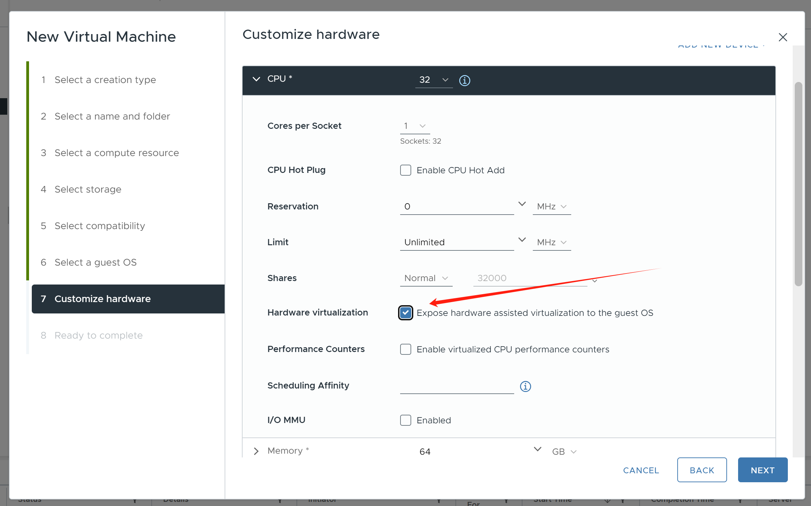
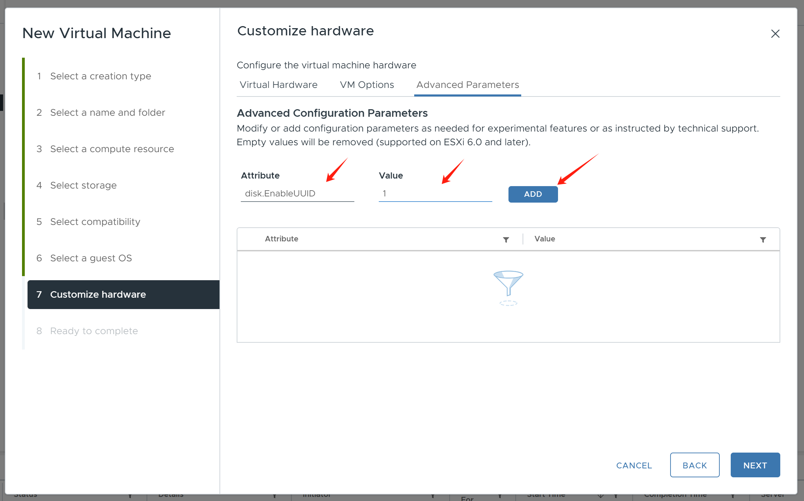

# openshift 4.16 agent install, single node

- connected

# define vmware

The vmware cpu, can set expose virt to vm, so in rhel, we can see vmx



set cpu and memory
- helper, 8c 32g
- sno, 32c, 64g, 200G+500G, 1 nic

setup vm parameter
- disk.EnableUUID -> 1



public dns
- master-01-demo.demo-01-rhsys.wzhlab.top -> 
- api.demo-01-rhsys.wzhlab.top -> 192.168.50.23
- api-int.demo-01-rhsys.wzhlab.top ->
- *.apps.demo-01-rhsys.wzhlab.top -> cname: 192.168.50.23
- infra.demo-01-rhsys.wzhlab.top -> 

# on helper node

## vnc setup

```bash

dnf groupinstall -y "Server with GUI"

dnf groupinstall -y "development"

dnf update -y

dnf install -y /usr/bin/nmstatectl /usr/bin/htpasswd

systemctl disable --now firewalld.service

dnf -y install tigervnc-server

# as user root
vncpasswd

cat << EOF > ~/.vnc/config
session=gnome
securitytypes=vncauth,tlsvnc
# desktop=sandbox
geometry=1440x855
alwaysshared
localhost=yes
EOF

# as user root
cat << EOF >> /etc/tigervnc/vncserver.users
:2=root
EOF

# systemctl start vncserver@:2
# 如果你想停掉vnc server，这么做
# systemctl stop vncserver@:2

# systemctl restart vncserver@:3

systemctl enable --now vncserver@:2

# systemctl disable --now vncserver@:3


# on helper node
# create a new address for helper node
nmcli con mod 'ens192' +ipv4.add 192.168.99.11/24
nmcli connection reload
nmcli connection up 'ens192'

# nmcli con mod 'ens192' -ipv4.add 192.168.99.11/24
# nmcli connection reload
# nmcli connection up 'ens192'


```

## ocp setup

```bash

# create a user and create the cluster under the user

useradd -m cluster-01

su - cluster-01

ssh-keygen

cat << EOF > ~/.ssh/config
StrictHostKeyChecking no
UserKnownHostsFile=/dev/null
EOF

chmod 600 ~/.ssh/config

cat << 'EOF' >> ~/.bashrc

export BASE_DIR=$HOME

EOF


# switch to you install version

export BUILDNUMBER=4.15.27

mkdir -p ${BASE_DIR}/data/ocp-${BUILDNUMBER}
mkdir -p ${BASE_DIR}/.local/bin

cd ${BASE_DIR}/data/ocp-${BUILDNUMBER}

wget -O openshift-client-linux-${BUILDNUMBER}.tar.gz https://mirror.openshift.com/pub/openshift-v4/x86_64/clients/ocp/${BUILDNUMBER}/openshift-client-linux-${BUILDNUMBER}.tar.gz
wget -O openshift-install-linux-${BUILDNUMBER}.tar.gz https://mirror.openshift.com/pub/openshift-v4/x86_64/clients/ocp/${BUILDNUMBER}/openshift-install-linux-${BUILDNUMBER}.tar.gz
wget -O oc-mirror.tar.gz https://mirror.openshift.com/pub/openshift-v4/x86_64/clients/ocp/${BUILDNUMBER}/oc-mirror.tar.gz

tar -xzf openshift-client-linux-${BUILDNUMBER}.tar.gz -C $HOME/.local/bin/
tar -xzf openshift-install-linux-${BUILDNUMBER}.tar.gz -C $HOME/.local/bin/

tar -xzf oc-mirror.tar.gz -C $HOME/.local/bin/
chmod +x $HOME/.local/bin/oc-mirror

# tar -xzf openshift-client-linux-${BUILDNUMBER}.tar.gz -C /usr/local/bin/
# tar -xzf openshift-install-linux-${BUILDNUMBER}.tar.gz -C /usr/local/bin/
# tar -xzf oc-mirror.tar.gz -C /usr/local/bin/
# chmod +x /usr/local/bin/oc-mirror

# client for helm
# https://mirror.openshift.com/pub/openshift-v4/clients/helm/latest/
# 
wget -O helm-linux-amd64.tar.gz https://developers.redhat.com/content-gateway/file/pub/openshift-v4/clients/helm/3.14.4/helm-linux-amd64.tar.gz

tar -xzf helm-linux-amd64.tar.gz -C $HOME/.local/bin/
mv $HOME/.local/bin/helm-linux-amd64 $HOME/.local/bin/helm

# client for butane
wget  -nd -np -e robots=off --reject="index.html*" -P ./ --recursive -A "butane-amd64" https://mirror.openshift.com/pub/openshift-v4/x86_64/clients/butane/latest/

# coreos-installer
wget  -nd -np -e robots=off --reject="index.html*" -P ./ -r -A "coreos-installer_amd64" https://mirror.openshift.com/pub/openshift-v4/x86_64/clients/coreos-installer/latest/


install -m 755 ./butane-amd64 $HOME/.local/bin/butane
install -m 755 ./coreos-installer_amd64 $HOME/.local/bin/coreos-installer


# start ocp config and install

export BUILDNUMBER=4.15.27

mkdir -p ${BASE_DIR}/data/{sno/disconnected,install}

# set some parameter of you rcluster

NODE_SSH_KEY="$(cat ${BASE_DIR}/.ssh/id_rsa.pub)"
# INSTALL_IMAGE_REGISTRY=quaylab.infra.wzhlab.top:5443

# PULL_SECRET='{"auths":{"registry.redhat.io": {"auth": "ZHVtbXk6ZHVtbXk=","email": "noemail@localhost"},"registry.ocp4.redhat.ren:5443": {"auth": "ZHVtbXk6ZHVtbXk=","email": "noemail@localhost"},"'${INSTALL_IMAGE_REGISTRY}'": {"auth": "'$( echo -n 'admin:shadowman' | openssl base64 )'","email": "noemail@localhost"}}}'
PULL_SECRET=$(cat ${BASE_DIR}/data/pull-secret.json)

NTP_SERVER=time1.google.com
# HELP_SERVER=192.168.32.10
# KVM_HOST=192.168.7.11
# API_VIP=192.168.77.99
# INGRESS_VIP=192.168.77.98
# CLUSTER_PROVISION_IP=192.168.7.103
# BOOTSTRAP_IP=192.168.7.12
MACHINE_NETWORK='192.168.50.0/24'

# 定义单节点集群的节点信息
SNO_CLUSTER_NAME=demo-01-rhsys
SNO_BASE_DOMAIN=wzhlab.top

# BOOTSTRAP_IP=172.21.6.22
MASTER_01_IP=192.168.50.23
# MASTER_02_IP=172.21.6.24
# MASTER_03_IP=172.21.6.25
# WORKER_01_IP=172.21.6.26
# WORKER_02_IP=172.21.6.27
# WORKER_03_IP=172.21.6.28

# BOOTSTRAP_IPv6=fd03::22
MASTER_01_IPv6=fd03::23
# MASTER_02_IPv6=fd03::24
# MASTER_03_IPv6=fd03::25
# WORKER_01_IPv6=fd03::26
# WORKER_02_IPv6=fd03::27
# WORKER_03_IPv6=fd03::28

# BOOTSTRAP_HOSTNAME=bootstrap-demo
MASTER_01_HOSTNAME=master-01-demo
# MASTER_02_HOSTNAME=master-02-demo
# MASTER_03_HOSTNAME=master-03-demo
# WORKER_01_HOSTNAME=worker-01-demo
# WORKER_02_HOSTNAME=worker-02-demo
# WORKER_03_HOSTNAME=worker-03-demo

# BOOTSTRAP_INTERFACE=enp1s0
MASTER_01_INTERFACE=ens192
# MASTER_01_SECONDARY_INTERFACE=ens224
# MASTER_02_INTERFACE=enp1s0
# MASTER_03_INTERFACE=enp1s0
# WORKER_01_INTERFACE=enp1s0
# WORKER_02_INTERFACE=enp1s0
# WORKER_03_INTERFACE=enp1s0

MASTER_01_INTERFACE_MAC=00:50:56:8e:b2:14
# MASTER_01_SECONDARY_INTERFACE_MAC=00:50:56:8e:f7:33
# MASTER_02_INTERFACE_MAC=52:54:00:12:A1:02
# MASTER_03_INTERFACE_MAC=52:54:00:12:A1:03
# WORKER_01_INTERFACE_MAC=52:54:00:12:A1:04
# WORKER_02_INTERFACE_MAC=52:54:00:12:A1:05
# WORKER_03_INTERFACE_MAC=52:54:00:12:A1:06

# BOOTSTRAP_DISK=/dev/vda
MASTER_01_DISK=/dev/sda
# MASTER_02_DISK=/dev/vda
# MASTER_03_DISK=/dev/vda
# WORKER_01_DISK=/dev/vda
# WORKER_02_DISK=/dev/vda
# WORKER_03_DISK=/dev/vda

OCP_GW=192.168.50.1
OCP_NETMASK=255.255.255.0
OCP_NETMASK_S=24
OCP_DNS=8.8.8.8

OCP_GW_v6=fd03::11
OCP_NETMASK_v6=64

# echo ${SNO_IF_MAC} > /data/sno/sno.mac

mkdir -p ${BASE_DIR}/data/install
cd ${BASE_DIR}/data/install

/bin/rm -rf *.ign .openshift_install_state.json auth bootstrap manifests master*[0-9] worker*[0-9] *

cat << EOF > ${BASE_DIR}/data/install/install-config.yaml 
apiVersion: v1
baseDomain: $SNO_BASE_DOMAIN
compute:
- name: worker
  replicas: 0 
controlPlane:
  name: master
  replicas: 1
metadata:
  name: $SNO_CLUSTER_NAME
networking:
  # OVNKubernetes , OpenShiftSDN
  networkType: OVNKubernetes 
  clusterNetwork:
    - cidr: 10.132.0.0/14 
      hostPrefix: 23
    # - cidr: fd02::/48
    #   hostPrefix: 64
  machineNetwork:
    - cidr: $MACHINE_NETWORK
    # - cidr: 2001:DB8::/32
  serviceNetwork:
    - 172.22.0.0/16
    # - fd03::/112
platform: 
  none: {}
pullSecret: '${PULL_SECRET}'
sshKey: |
$( cat ${BASE_DIR}/.ssh/id_rsa.pub | sed 's/^/   /g' )
# additionalTrustBundle: |
# \$( cat /etc/crts/redhat.ren.ca.crt | sed 's/^/   /g' )
# imageContentSources:
# - mirrors:
#   - ${INSTALL_IMAGE_REGISTRY}/ocp4/openshift4
#   source: quay.io/openshift-release-dev/ocp-release
# - mirrors:
#   - ${INSTALL_IMAGE_REGISTRY}/ocp4/openshift4
#   source: quay.io/openshift-release-dev/ocp-v4.0-art-dev
EOF

# https://access.redhat.com/solutions/7048618
cat << EOF > ${BASE_DIR}/data/install/agent-config.yaml
apiVersion: v1alpha1
kind: AgentConfig
metadata:
  name: $SNO_CLUSTER_NAME
rendezvousIP: $MASTER_01_IP
additionalNTPSources:
- $NTP_SERVER
hosts:
  - hostname: $MASTER_01_HOSTNAME
    role: master
    rootDeviceHints:
      deviceName: "$MASTER_01_DISK"
    interfaces:
      - name: $MASTER_01_INTERFACE
        macAddress: $MASTER_01_INTERFACE_MAC
    networkConfig:
      interfaces:
        - name: $MASTER_01_INTERFACE
          type: ethernet
          state: up
          mac-address: $MASTER_01_INTERFACE_MAC
          ipv4:
            enabled: true
            address:
              - ip: $MASTER_01_IP
                prefix-length: $OCP_NETMASK_S
            dhcp: false
      dns-resolver:
        config:
          server:
            - $OCP_DNS
      routes:
        config:
          - destination: 0.0.0.0/0
            next-hop-address: $OCP_GW
            next-hop-interface: $MASTER_01_INTERFACE
            table-id: 254
EOF

/bin/cp -f ${BASE_DIR}/data/install/install-config.yaml ${BASE_DIR}/data/install/install-config.yaml.bak

openshift-install --dir=${BASE_DIR}/data/install agent create cluster-manifests

# you can change the system's registry config
# but do not need under normal situation
# sudo bash -c "/bin/cp -f mirror/registries.conf /etc/containers/registries.conf.d/; chmod +r /etc/containers/registries.conf.d/*"

# /bin/cp -f  /data/ocp4/ansible-helper/files/* ${BASE_DIR}/data/install/openshift/

# sudo bash -c "cd /data/ocp4 ; bash image.registries.conf.sh quaylab.infra.wzhlab.top:5443 ;"

# we lost the way to customize the registry during install stage
# leave the configuration to day-2 operation.
# /bin/cp -f /data/ocp4/99-worker-container-registries.yaml ${BASE_DIR}/data/install/openshift
# /bin/cp -f /data/ocp4/99-master-container-registries.yaml ${BASE_DIR}/data/install/openshift

cd ${BASE_DIR}/data/install/

# openshift-install --dir=${BASE_DIR}/data/install create ignition-configs 

# there is additinal file cache
# 我们发现，除了iso，其他文件，就算提前下载了，他还是会重新下载。
mkdir -p ${HOME}/.cache/agent/{files_cache,image_cache}

# oc image extract -a /data/pull-secret.json --path /coreos/coreos-x86_64.iso:${HOME}/.cache/agent/image_cache --confirm quaylab.infra.wzhlab.top:5443/ocp4/openshift4:$BUILDNUMBER-x86_64-machine-os-images

# oc image extract -a /data/pull-secret.json --path /usr/lib64/libnmstate.so.*:${HOME}/.cache/agent/files_cache --confirm  quaylab.infra.wzhlab.top:5443/ocp4/openshift4:$BUILDNUMBER-x86_64-agent-installer-node-agent

# oc image extract -a /data/pull-secret.json --path /usr/bin/agent-tui:${HOME}/.cache/agent/files_cache --confirm  quaylab.infra.wzhlab.top:5443/ocp4/openshift4:$BUILDNUMBER-x86_64-agent-installer-node-agent

# mkdir -p ~/.cache/agent/image_cache/
# /bin/cp -f /data/ocp-$BUILDNUMBER/rhcos-live.x86_64.iso ~/.cache/agent/image_cache/coreos-x86_64.iso

openshift-install --dir=${BASE_DIR}/data/install agent create image --log-level=debug
# ......
# DEBUG Fetching image from OCP release (oc adm release info --image-for=machine-os-images --insecure=true --icsp-file=/tmp/icsp-file3636774741 quay.io/openshift-release-dev/ocp-release@sha256:96bf74ce789ccb22391deea98e0c5050c41b67cc17defbb38089d32226dba0b8)
# DEBUG The file was found in cache: /home/3node/.cache/agent/image_cache/coreos-x86_64.iso
# INFO Verifying cached file
# DEBUG extracting /coreos/coreos-x86_64.iso.sha256 to /tmp/cache1876698393, oc image extract --path /coreos/coreos-x86_64.iso.sha256:/tmp/cache1876698393 --confirm --icsp-file=/tmp/icsp-file455852761 quay.io/openshift-release-dev/ocp-v4.0-art-dev@sha256:052130abddf741195b6753888cf8a00757dedeb7010f7d4dcc4b842b5bc705f6
# ......

coreos-installer iso ignition show agent.x86_64.iso > ignition.ign

# HTTP_PATH=http://192.168.7.11:8080/ignition

source /data/ocp4/acm.fn.sh

# 我们会创建一个wzh用户，密码是redhat，这个可以在第一次启动的是，从console/ssh直接用用户名口令登录
# 方便排错和研究
VAR_PWD_HASH="$(python3 -c 'import crypt,getpass; print(crypt.crypt("redhat"))')"

cat ${BASE_DIR}/data/install/ignition.ign \
  | jq --arg VAR "$VAR_PWD_HASH" --arg VAR_SSH "$NODE_SSH_KEY" '.passwd.users += [{ "name": "wzh", "system": true, "passwordHash": $VAR , "sshAuthorizedKeys": [ $VAR_SSH ], "groups": [ "adm", "wheel", "sudo", "systemd-journal"  ] }]' \
  | jq '. += { "kernel_arguments" : { "should_exist" : [ "systemd.debug-shell=1" ] } }' \
  | jq -c . \
  > ${BASE_DIR}/data/install/ignition-iso.ign

coreos-installer iso ignition embed -f -i ignition-iso.ign agent.x86_64.iso

# VAR_IMAGE_VER=rhcos-410.86.202303200936-AnolisOS-0-live.x86_64.iso


```

upload the iso to vmware's datastore workload_share_FZZZD , folder dummy-wzh


boot the vm by using the uploaded iso

```bash

# is install stopped
# login to the vm
# check and change dns setting 
# under most situation, the dns setting is wrong
# then restart several systemd service, to continue the install
systemctl restart apply-host-config.service
systemctl restart agent
systemctl restart start-cluster-installation.service


```

# on helper to see result

for unkonwn reason, the vm will be shutdown, instead of reboot, you have to poweron it manually.

```bash
cd ${BASE_DIR}/data/install
export KUBECONFIG=${BASE_DIR}/data/install/auth/kubeconfig
echo "export KUBECONFIG=${BASE_DIR}/data/install/auth/kubeconfig" >> ~/.bashrc
# oc completion bash | sudo tee /etc/bash_completion.d/openshift > /dev/null


cd ${BASE_DIR}/data/install
openshift-install --dir=${BASE_DIR}/data/install agent wait-for bootstrap-complete --log-level=debug
# ......
# DEBUG RendezvousIP from the AgentConfig 172.21.6.23
# INFO Bootstrap Kube API Initialized
# INFO Bootstrap configMap status is complete
# INFO cluster bootstrap is complete

cd ${BASE_DIR}/data/install
openshift-install --dir=${BASE_DIR}/data/install agent wait-for install-complete --log-level=debug
# ......
# INFO Cluster is installed
# INFO Install complete!
# INFO To access the cluster as the system:admin user when using 'oc', run
# INFO     export KUBECONFIG=/home/cluster-01/data/install/auth/kubeconfig
# INFO Access the OpenShift web-console here: https://console-openshift-console.apps.demo-01-rhsys.wzhlab.top
# INFO Login to the console with user: "kubeadmin", and password: "pqkqT-Sifap-YeMsH-WfIo2"

```

# setup htpasswd identity provider

- https://docs.openshift.com/container-platform/4.13/authentication/identity_providers/configuring-htpasswd-identity-provider.html

```bash

# init the htpasswd file
htpasswd -c -B -b ${BASE_DIR}/data/install/users.htpasswd admin redhat

# add additional user
htpasswd -B -b ${BASE_DIR}/data/install/users.htpasswd user01 redhat

# import the htpasswd file
oc create secret generic htpass-secret \
  --from-file=htpasswd=${BASE_DIR}/data/install/users.htpasswd \
  -n openshift-config 

cat << EOF > ${BASE_DIR}/data/install/oauth.yaml
spec:
  identityProviders:
  - name: htpasswd
    mappingMethod: claim 
    type: HTPasswd
    htpasswd:
      fileData:
        name: htpass-secret
EOF
oc patch oauth/cluster --type merge --patch-file=${BASE_DIR}/data/install/oauth.yaml

oc adm policy add-cluster-role-to-user cluster-admin admin

oc adm policy add-role-to-user admin user01 -n llm-demo

```

# lvm operator

It is vsphere, we can add 2nd disk to the vm, and use lvm operator to create pv, pvc, and pv


Create lvm cluster with default setting.


```bash

oc get sc

# oc patch storageclass current-default-sc -p '{"metadata": {"annotations":{"storageclass.kubernetes.io/is-default-class":"false"}}}'

oc patch storageclass lvms-vg1 -p '{"metadata": {"annotations":{"storageclass.kubernetes.io/is-default-class":"true"}}}'

```

# open ingress traffic on jump box

```bash

dnf install haproxy -y

SNO_IP="192.168.50.23"
cat << EOF > /etc/haproxy/haproxy.cfg

global
    log /dev/log local0
    maxconn 2000
    user haproxy
    group haproxy
    daemon

defaults
    log global
    mode tcp
    option tcplog
    timeout connect 5000ms
    timeout client 50000ms
    timeout server 50000ms

# Frontend for HTTP (Port 80)
frontend http_frontend
    bind *:80
    default_backend http_backend

# Backend for HTTP
backend http_backend
    server http_server 192.168.50.23:80 check

# Frontend for HTTPS (Port 443)
frontend https_frontend
    bind *:443
    default_backend https_backend

# Backend for HTTPS
backend https_backend
    server https_server 192.168.50.23:443 check

EOF

systemctl enable --now haproxy

firewall-cmd --permanent --add-service=http
firewall-cmd --permanent --add-service=https
firewall-cmd --reload


```

# end