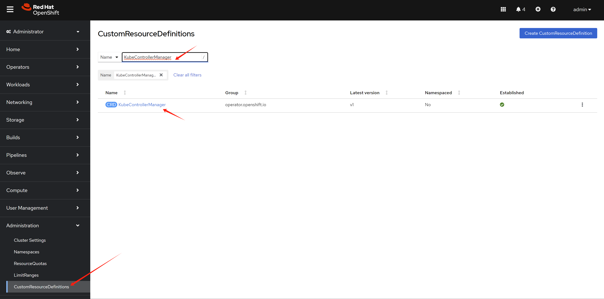
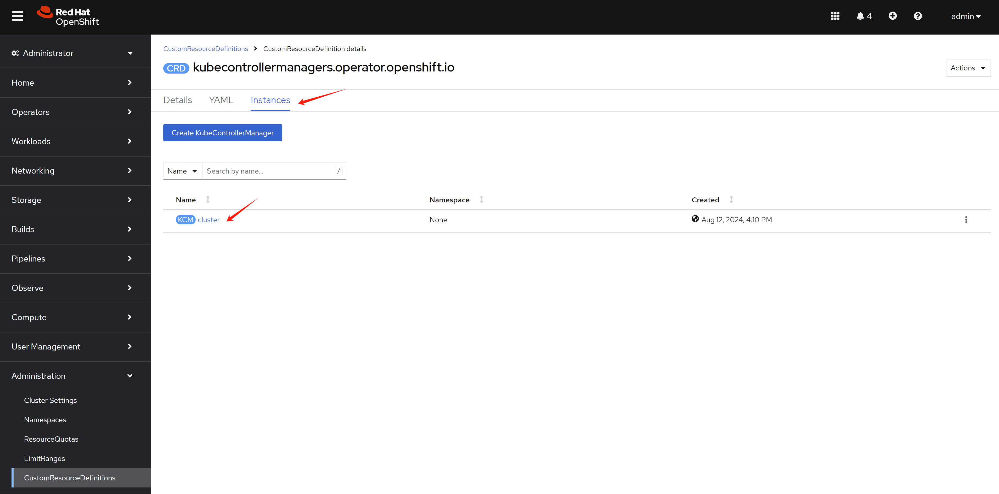

> [!CAUTION]
> Work in progress
# apply settings belongs with worker profile

- https://docs.openshift.com/container-platform/4.15/nodes/clusters/nodes-cluster-worker-latency-profiles.html

- https://github.com/openshift/enhancements/blob/master/enhancements/worker-latency-profile/worker-latency-profile.md
- https://docs.openshift.com/container-platform/4.15/post_installation_configuration/machine-configuration-tasks.html#create-a-kubeletconfig-crd-to-edit-kubelet-parameters_post-install-machine-configuration-tasks


# for KubeletConfig

```bash

# before apply change, check on the worker node
cat /etc/kubernetes/kubelet.conf | grep node
#   "nodeStatusUpdateFrequency": "10s",
#   "nodeStatusReportFrequency": "5m0s",

oc get mcp
# NAME     CONFIG                                             UPDATED   UPDATING   DEGRADED   MACHINECOUNT   READYMACHINECOUNT   UPDATEDMACHINECOUNT   DEGRADEDMACHINECOUNT   AGE
# master   rendered-master-3b06c8a6cdbb7a48ab7c3f43f08990bd   True      False      False      1              1                   1                     0                      16d
# worker   rendered-worker-eeb0c5ee23e3b38d342372cffde47bfb   True      False      False      0              0                   0                     0                      16d

oc get node
# NAME             STATUS   ROLES                         AGE   VERSION
# master-01-demo   Ready    control-plane,master,worker   16d   v1.28.11+add48d0

# label the machineconfigpool
oc label machineconfigpool master custom-kubelet=set-duration

# oc label machineconfigpool master custom-kubelet-

cat << EOF > ${BASE_DIR}/data/install/kubeletconfig-profile.yaml
apiVersion: machineconfiguration.openshift.io/v1
kind: KubeletConfig
metadata:
  name: set-duration
spec:
  machineConfigPoolSelector:
    matchLabels:
      custom-kubelet: set-duration
  kubeletConfig:
    nodeStatusUpdateFrequency: 5s
EOF

oc apply -f ${BASE_DIR}/data/install/kubeletconfig-profile.yaml

# this will trigger ocp node reboot, after reboot, 
# check node's kubelet.conf
cat kubelet.conf | grep node
#   "nodeStatusUpdateFrequency": "5s",
#   "nodeStatusReportFrequency": "5m0s",

```

# for KubeControllerManager

- https://access.redhat.com/solutions/5686011

Our target is to set the `node-monitor-grace-period` to `20s`

```bash
# before apply patch
POD_NAME=`oc get pod -n openshift-kube-controller-manager | grep kube-controller-manager | awk '{print $1}'`

oc exec -n openshift-kube-controller-manager $POD_NAME -- ps -ef
# UID          PID    PPID  C STIME TTY          TIME CMD
# root           1       0  6 00:56 ?        00:00:38 kube-controller-manager --openshift-config=/etc/kubernetes/static-pod-resources/configmaps/config/config.yaml --kubeconfig=/etc/kubernetes/static-pod-resources/configmaps/controller-manager-kubeconfig/kubeconfig --authentication-kubeconfig=/etc/kubernetes/static-pod-resources/configmaps/controller-manager-kubeconfig/kubeconfig --authorization-kubeconfig=/etc/kubernetes/static-pod-resources/configmaps/controller-manager-kubeconfig/kubeconfig --client-ca-file=/etc/kubernetes/static-pod-certs/configmaps/client-ca/ca-bundle.crt --requestheader-client-ca-file=/etc/kubernetes/static-pod-certs/configmaps/aggregator-client-ca/ca-bundle.crt -v=2 --tls-cert-file=/etc/kubernetes/static-pod-resources/secrets/serving-cert/tls.crt --tls-private-key-file=/etc/kubernetes/static-pod-resources/secrets/serving-cert/tls.key --allocate-node-cidrs=false --cert-dir=/var/run/kubernetes --cluster-cidr=10.132.0.0/14 --cluster-name=demo-01-rhsys-wkmd8 --cluster-signing-cert-file=/etc/kubernetes/static-pod-certs/secrets/csr-signer/tls.crt --cluster-signing-duration=720h --cluster-signing-key-file=/etc/kubernetes/static-pod-certs/secrets/csr-signer/tls.key --configure-cloud-routes=false --controllers=* --controllers=-bootstrapsigner --controllers=-tokencleaner --controllers=-ttl --enable-dynamic-provisioning=true --feature-gates=AdminNetworkPolicy=false --feature-gates=AlibabaPlatform=true --feature-gates=AutomatedEtcdBackup=false --feature-gates=AzureWorkloadIdentity=true --feature-gates=BuildCSIVolumes=true --feature-gates=CSIDriverSharedResource=false --feature-gates=CloudDualStackNodeIPs=true --feature-gates=ClusterAPIInstall=false --feature-gates=DNSNameResolver=false --feature-gates=DisableKubeletCloudCredentialProviders=false --feature-gates=DynamicResourceAllocation=false --feature-gates=EventedPLEG=false --feature-gates=ExternalCloudProviderAzure=true --feature-gates=ExternalCloudProviderExternal=true --feature-gates=ExternalCloudProviderGCP=true --feature-gates=GCPClusterHostedDNS=false --feature-gates=GCPLabelsTags=false --feature-gates=GatewayAPI=false --feature-gates=InsightsConfigAPI=false --feature-gates=InstallAlternateInfrastructureAWS=false --feature-gates=MachineAPIOperatorDisableMachineHealthCheckController=false --feature-gates=MachineAPIProviderOpenStack=false --feature-gates=MachineConfigNodes=false --feature-gates=ManagedBootImages=false --feature-gates=MaxUnavailableStatefulSet=false --feature-gates=MetricsServer=false --feature-gates=MixedCPUsAllocation=false --feature-gates=NetworkLiveMigration=true --feature-gates=NodeSwap=false --feature-gates=OnClusterBuild=false --feature-gates=OpenShiftPodSecurityAdmission=false --feature-gates=PrivateHostedZoneAWS=true --feature-gates=RouteExternalCertificate=false --feature-gates=SignatureStores=false --feature-gates=SigstoreImageVerification=false --feature-gates=VSphereControlPlaneMachineSet=false --feature-gates=VSphereStaticIPs=false --feature-gates=ValidatingAdmissionPolicy=false --flex-volume-plugin-dir=/etc/kubernetes/kubelet-plugins/volume/exec --kube-api-burst=300 --kube-api-qps=150 --leader-elect-renew-deadline=12s --leader-elect-resource-lock=leases --leader-elect-retry-period=3s --leader-elect=true --pv-recycler-pod-template-filepath-hostpath=/etc/kubernetes/static-pod-resources/configmaps/recycler-config/recycler-pod.yaml --pv-recycler-pod-template-filepath-nfs=/etc/kubernetes/static-pod-resources/configmaps/recycler-config/recycler-pod.yaml --root-ca-file=/etc/kubernetes/static-pod-resources/configmaps/serviceaccount-ca/ca-bundle.crt --secure-port=10257 --service-account-private-key-file=/etc/kubernetes/static-pod-resources/secrets/service-account-private-key/service-account.key --service-cluster-ip-range=172.22.0.0/16 --use-service-account-credentials=true --tls-cipher-suites=TLS_ECDHE_ECDSA_WITH_AES_128_GCM_SHA256,TLS_ECDHE_RSA_WITH_AES_128_GCM_SHA256,TLS_ECDHE_ECDSA_WITH_AES_256_GCM_SHA384,TLS_ECDHE_RSA_WITH_AES_256_GCM_SHA384,TLS_ECDHE_ECDSA_WITH_CHACHA20_POLY1305_SHA256,TLS_ECDHE_RSA_WITH_CHACHA20_POLY1305_SHA256 --tls-min-version=VersionTLS12
# root          47       0  0 01:04 pts/0    00:00:00 sh
# root          59       0  0 01:06 ?        00:00:00 ps -ef

```

let's see the parameters of kube-controller-manager

> kube-controller-manager --openshift-config=/etc/kubernetes/static-pod-resources/configmaps/config/config.yaml --kubeconfig=/etc/kubernetes/static-pod-resources/configmaps/controller-manager-kubeconfig/kubeconfig --authentication-kubeconfig=/etc/kubernetes/static-pod-resources/configmaps/controller-manager-kubeconfig/kubeconfig --authorization-kubeconfig=/etc/kubernetes/static-pod-resources/configmaps/controller-manager-kubeconfig/kubeconfig --client-ca-file=/etc/kubernetes/static-pod-certs/configmaps/client-ca/ca-bundle.crt --requestheader-client-ca-file=/etc/kubernetes/static-pod-certs/configmaps/aggregator-client-ca/ca-bundle.crt -v=2 --tls-cert-file=/etc/kubernetes/static-pod-resources/secrets/serving-cert/tls.crt --tls-private-key-file=/etc/kubernetes/static-pod-resources/secrets/serving-cert/tls.key --allocate-node-cidrs=false --cert-dir=/var/run/kubernetes --cluster-cidr=10.132.0.0/14 --cluster-name=demo-01-rhsys-wkmd8 --cluster-signing-cert-file=/etc/kubernetes/static-pod-certs/secrets/csr-signer/tls.crt --cluster-signing-duration=720h --cluster-signing-key-file=/etc/kubernetes/static-pod-certs/secrets/csr-signer/tls.key --configure-cloud-routes=false --controllers=* --controllers=-bootstrapsigner --controllers=-tokencleaner --controllers=-ttl --enable-dynamic-provisioning=true --feature-gates=AdminNetworkPolicy=false --feature-gates=AlibabaPlatform=true --feature-gates=AutomatedEtcdBackup=false --feature-gates=AzureWorkloadIdentity=true --feature-gates=BuildCSIVolumes=true --feature-gates=CSIDriverSharedResource=false --feature-gates=CloudDualStackNodeIPs=true --feature-gates=ClusterAPIInstall=false --feature-gates=DNSNameResolver=false --feature-gates=DisableKubeletCloudCredentialProviders=false --feature-gates=DynamicResourceAllocation=false --feature-gates=EventedPLEG=false --feature-gates=ExternalCloudProviderAzure=true --feature-gates=ExternalCloudProviderExternal=true --feature-gates=ExternalCloudProviderGCP=true --feature-gates=GCPClusterHostedDNS=false --feature-gates=GCPLabelsTags=false --feature-gates=GatewayAPI=false --feature-gates=InsightsConfigAPI=false --feature-gates=InstallAlternateInfrastructureAWS=false --feature-gates=MachineAPIOperatorDisableMachineHealthCheckController=false --feature-gates=MachineAPIProviderOpenStack=false --feature-gates=MachineConfigNodes=false --feature-gates=ManagedBootImages=false --feature-gates=MaxUnavailableStatefulSet=false --feature-gates=MetricsServer=false --feature-gates=MixedCPUsAllocation=false --feature-gates=NetworkLiveMigration=true --feature-gates=NodeSwap=false --feature-gates=OnClusterBuild=false --feature-gates=OpenShiftPodSecurityAdmission=false --feature-gates=PrivateHostedZoneAWS=true --feature-gates=RouteExternalCertificate=false --feature-gates=SignatureStores=false --feature-gates=SigstoreImageVerification=false --feature-gates=VSphereControlPlaneMachineSet=false --feature-gates=VSphereStaticIPs=false --feature-gates=ValidatingAdmissionPolicy=false --flex-volume-plugin-dir=/etc/kubernetes/kubelet-plugins/volume/exec --kube-api-burst=300 --kube-api-qps=150 --leader-elect-renew-deadline=12s --leader-elect-resource-lock=leases --leader-elect-retry-period=3s --leader-elect=true --pv-recycler-pod-template-filepath-hostpath=/etc/kubernetes/static-pod-resources/configmaps/recycler-config/recycler-pod.yaml --pv-recycler-pod-template-filepath-nfs=/etc/kubernetes/static-pod-resources/configmaps/recycler-config/recycler-pod.yaml --root-ca-file=/etc/kubernetes/static-pod-resources/configmaps/serviceaccount-ca/ca-bundle.crt --secure-port=10257 --service-account-private-key-file=/etc/kubernetes/static-pod-resources/secrets/service-account-private-key/service-account.key --service-cluster-ip-range=172.22.0.0/16 --use-service-account-credentials=true --tls-cipher-suites=TLS_ECDHE_ECDSA_WITH_AES_128_GCM_SHA256,TLS_ECDHE_RSA_WITH_AES_128_GCM_SHA256,TLS_ECDHE_ECDSA_WITH_AES_256_GCM_SHA384,TLS_ECDHE_RSA_WITH_AES_256_GCM_SHA384,TLS_ECDHE_ECDSA_WITH_CHACHA20_POLY1305_SHA256,TLS_ECDHE_RSA_WITH_CHACHA20_POLY1305_SHA256 --tls-min-version=VersionTLS12

There is no `node-monitor-grace-period` in the output, so we need to check the help, whether it is supported.

```bash
oc exec -n openshift-kube-controller-manager $POD_NAME -- kube-controller-manager --help | grep node-monitor-grace-period
      # --node-monitor-grace-period duration     Amount of time which we allow running Node to be unresponsive before marking it unhealthy. Must be N times more than kubelet's nodeStatusUpdateFrequency, where N means number of retries allowed for kubelet to post node status. (default 40s)
```

Yes, it is supported. Let's manually patch the configuration





```yaml
apiVersion: operator.openshift.io/v1
kind: KubeControllerManager
metadata:
  name: cluster
....
spec:
  ....
  unsupportedConfigOverrides: 
    extendedArguments:
      node-monitor-grace-period:
        - "20s"
```

After manually patch the config, check the kube-controller-manager pod again

```bash
oc exec -n openshift-kube-controller-manager $POD_NAME -- ps -ef
# UID          PID    PPID  C STIME TTY          TIME CMD
# root           1       0  3 01:14 ?        00:00:07 kube-controller-manager --openshift-config=/etc/kubernetes/static-pod-resources/configmaps/config/config.yaml --kubeconfig=/etc/kubernetes/static-pod-resources/configmaps/controller-manager-kubeconfig/kubeconfig --authentication-kubeconfig=/etc/kubernetes/static-pod-resources/configmaps/controller-manager-kubeconfig/kubeconfig --authorization-kubeconfig=/etc/kubernetes/static-pod-resources/configmaps/controller-manager-kubeconfig/kubeconfig --client-ca-file=/etc/kubernetes/static-pod-certs/configmaps/client-ca/ca-bundle.crt --requestheader-client-ca-file=/etc/kubernetes/static-pod-certs/configmaps/aggregator-client-ca/ca-bundle.crt -v=2 --tls-cert-file=/etc/kubernetes/static-pod-resources/secrets/serving-cert/tls.crt --tls-private-key-file=/etc/kubernetes/static-pod-resources/secrets/serving-cert/tls.key --allocate-node-cidrs=false --cert-dir=/var/run/kubernetes --cluster-cidr=10.132.0.0/14 --cluster-name=demo-01-rhsys-wkmd8 --cluster-signing-cert-file=/etc/kubernetes/static-pod-certs/secrets/csr-signer/tls.crt --cluster-signing-duration=720h --cluster-signing-key-file=/etc/kubernetes/static-pod-certs/secrets/csr-signer/tls.key --configure-cloud-routes=false --controllers=* --controllers=-bootstrapsigner --controllers=-tokencleaner --controllers=-ttl --enable-dynamic-provisioning=true --feature-gates=AdminNetworkPolicy=false --feature-gates=AlibabaPlatform=true --feature-gates=AutomatedEtcdBackup=false --feature-gates=AzureWorkloadIdentity=true --feature-gates=BuildCSIVolumes=true --feature-gates=CSIDriverSharedResource=false --feature-gates=CloudDualStackNodeIPs=true --feature-gates=ClusterAPIInstall=false --feature-gates=DNSNameResolver=false --feature-gates=DisableKubeletCloudCredentialProviders=false --feature-gates=DynamicResourceAllocation=false --feature-gates=EventedPLEG=false --feature-gates=ExternalCloudProviderAzure=true --feature-gates=ExternalCloudProviderExternal=true --feature-gates=ExternalCloudProviderGCP=true --feature-gates=GCPClusterHostedDNS=false --feature-gates=GCPLabelsTags=false --feature-gates=GatewayAPI=false --feature-gates=InsightsConfigAPI=false --feature-gates=InstallAlternateInfrastructureAWS=false --feature-gates=MachineAPIOperatorDisableMachineHealthCheckController=false --feature-gates=MachineAPIProviderOpenStack=false --feature-gates=MachineConfigNodes=false --feature-gates=ManagedBootImages=false --feature-gates=MaxUnavailableStatefulSet=false --feature-gates=MetricsServer=false --feature-gates=MixedCPUsAllocation=false --feature-gates=NetworkLiveMigration=true --feature-gates=NodeSwap=false --feature-gates=OnClusterBuild=false --feature-gates=OpenShiftPodSecurityAdmission=false --feature-gates=PrivateHostedZoneAWS=true --feature-gates=RouteExternalCertificate=false --feature-gates=SignatureStores=false --feature-gates=SigstoreImageVerification=false --feature-gates=VSphereControlPlaneMachineSet=false --feature-gates=VSphereStaticIPs=false --feature-gates=ValidatingAdmissionPolicy=false --flex-volume-plugin-dir=/etc/kubernetes/kubelet-plugins/volume/exec --kube-api-burst=300 --kube-api-qps=150 --leader-elect-renew-deadline=12s --leader-elect-resource-lock=leases --leader-elect-retry-period=3s --leader-elect=true --node-monitor-grace-period=20s --pv-recycler-pod-template-filepath-hostpath=/etc/kubernetes/static-pod-resources/configmaps/recycler-config/recycler-pod.yaml --pv-recycler-pod-template-filepath-nfs=/etc/kubernetes/static-pod-resources/configmaps/recycler-config/recycler-pod.yaml --root-ca-file=/etc/kubernetes/static-pod-resources/configmaps/serviceaccount-ca/ca-bundle.crt --secure-port=10257 --service-account-private-key-file=/etc/kubernetes/static-pod-resources/secrets/service-account-private-key/service-account.key --service-cluster-ip-range=172.22.0.0/16 --use-service-account-credentials=true --tls-cipher-suites=TLS_ECDHE_ECDSA_WITH_AES_128_GCM_SHA256,TLS_ECDHE_RSA_WITH_AES_128_GCM_SHA256,TLS_ECDHE_ECDSA_WITH_AES_256_GCM_SHA384,TLS_ECDHE_RSA_WITH_AES_256_GCM_SHA384,TLS_ECDHE_ECDSA_WITH_CHACHA20_POLY1305_SHA256,TLS_ECDHE_RSA_WITH_CHACHA20_POLY1305_SHA256 --tls-min-version=VersionTLS12
# root         102       0  0 01:18 ?        00:00:00 ps -ef
```

> kube-controller-manager --openshift-config=/etc/kubernetes/static-pod-resources/configmaps/config/config.yaml --kubeconfig=/etc/kubernetes/static-pod-resources/configmaps/controller-manager-kubeconfig/kubeconfig --authentication-kubeconfig=/etc/kubernetes/static-pod-resources/configmaps/controller-manager-kubeconfig/kubeconfig --authorization-kubeconfig=/etc/kubernetes/static-pod-resources/configmaps/controller-manager-kubeconfig/kubeconfig --client-ca-file=/etc/kubernetes/static-pod-certs/configmaps/client-ca/ca-bundle.crt --requestheader-client-ca-file=/etc/kubernetes/static-pod-certs/configmaps/aggregator-client-ca/ca-bundle.crt -v=2 --tls-cert-file=/etc/kubernetes/static-pod-resources/secrets/serving-cert/tls.crt --tls-private-key-file=/etc/kubernetes/static-pod-resources/secrets/serving-cert/tls.key --allocate-node-cidrs=false --cert-dir=/var/run/kubernetes --cluster-cidr=10.132.0.0/14 --cluster-name=demo-01-rhsys-wkmd8 --cluster-signing-cert-file=/etc/kubernetes/static-pod-certs/secrets/csr-signer/tls.crt --cluster-signing-duration=720h --cluster-signing-key-file=/etc/kubernetes/static-pod-certs/secrets/csr-signer/tls.key --configure-cloud-routes=false --controllers=* --controllers=-bootstrapsigner --controllers=-tokencleaner --controllers=-ttl --enable-dynamic-provisioning=true --feature-gates=AdminNetworkPolicy=false --feature-gates=AlibabaPlatform=true --feature-gates=AutomatedEtcdBackup=false --feature-gates=AzureWorkloadIdentity=true --feature-gates=BuildCSIVolumes=true --feature-gates=CSIDriverSharedResource=false --feature-gates=CloudDualStackNodeIPs=true --feature-gates=ClusterAPIInstall=false --feature-gates=DNSNameResolver=false --feature-gates=DisableKubeletCloudCredentialProviders=false --feature-gates=DynamicResourceAllocation=false --feature-gates=EventedPLEG=false --feature-gates=ExternalCloudProviderAzure=true --feature-gates=ExternalCloudProviderExternal=true --feature-gates=ExternalCloudProviderGCP=true --feature-gates=GCPClusterHostedDNS=false --feature-gates=GCPLabelsTags=false --feature-gates=GatewayAPI=false --feature-gates=InsightsConfigAPI=false --feature-gates=InstallAlternateInfrastructureAWS=false --feature-gates=MachineAPIOperatorDisableMachineHealthCheckController=false --feature-gates=MachineAPIProviderOpenStack=false --feature-gates=MachineConfigNodes=false --feature-gates=ManagedBootImages=false --feature-gates=MaxUnavailableStatefulSet=false --feature-gates=MetricsServer=false --feature-gates=MixedCPUsAllocation=false --feature-gates=NetworkLiveMigration=true --feature-gates=NodeSwap=false --feature-gates=OnClusterBuild=false --feature-gates=OpenShiftPodSecurityAdmission=false --feature-gates=PrivateHostedZoneAWS=true --feature-gates=RouteExternalCertificate=false --feature-gates=SignatureStores=false --feature-gates=SigstoreImageVerification=false --feature-gates=VSphereControlPlaneMachineSet=false --feature-gates=VSphereStaticIPs=false --feature-gates=ValidatingAdmissionPolicy=false --flex-volume-plugin-dir=/etc/kubernetes/kubelet-plugins/volume/exec --kube-api-burst=300 --kube-api-qps=150 --leader-elect-renew-deadline=12s --leader-elect-resource-lock=leases --leader-elect-retry-period=3s --leader-elect=true <span style="color:darkred;">**--node-monitor-grace-period=20s**</span> --pv-recycler-pod-template-filepath-hostpath=/etc/kubernetes/static-pod-resources/configmaps/recycler-config/recycler-pod.yaml --pv-recycler-pod-template-filepath-nfs=/etc/kubernetes/static-pod-resources/configmaps/recycler-config/recycler-pod.yaml --root-ca-file=/etc/kubernetes/static-pod-resources/configmaps/serviceaccount-ca/ca-bundle.crt --secure-port=10257 --service-account-private-key-file=/etc/kubernetes/static-pod-resources/secrets/service-account-private-key/service-account.key --service-cluster-ip-range=172.22.0.0/16 --use-service-account-credentials=true --tls-cipher-suites=TLS_ECDHE_ECDSA_WITH_AES_128_GCM_SHA256,TLS_ECDHE_RSA_WITH_AES_128_GCM_SHA256,TLS_ECDHE_ECDSA_WITH_AES_256_GCM_SHA384,TLS_ECDHE_RSA_WITH_AES_256_GCM_SHA384,TLS_ECDHE_ECDSA_WITH_CHACHA20_POLY1305_SHA256,TLS_ECDHE_RSA_WITH_CHACHA20_POLY1305_SHA256 --tls-min-version=VersionTLS12

You can see the parameters now.

# for KubeAPIServer

```bash
apiVersion: operator.openshift.io/v1
kind: KubeAPIServer

```