# trouble shooting rhsso 7.1 performance issues

Customer have a running rhsso 7.1, it has a performance issues, the points of the issues are:
- there are GC runs very frequently
- there are timeout in infinispan/data grid writes
- there are memory leak/memory over usage in jvm

After initial analyze, the possible root cause are:
- infinispan owner set is not correct
- infinispan should split out to a separate instance
- cpu is insufficient
- memory leak

Preliminary analysis did not provide clear direction, so we decided to conduct some local simulation tests to see what we would discover. The process of the simulation tests is detailed later in this article.

We will state the conclusion here first.
- the root cause is the memory leak, the memory leak is caused by the infinispan wrong config, and the cache entries do not released.
- memory leak cause GC runs frequently, and the GC runs cause the timeout in infinispan/data grid writes.

How to fix the memory leak? just set the cache entries to a reasonable number, and set the cache timeout to a reasonable time in the infinispan config. You can find the configuration file in ./files
```xml
<distributed-cache name="sessions" mode="SYNC" statistics-enabled="true" owners="2">
    <eviction strategy="LRU" max-entries="100000"/>
    <expiration max-idle="86400000"/>
</distributed-cache>
```

Furture recommendataion:
- set owner to 2, which is recommended by redhat
- upgrade to rhsso 7.6 or rhbk-24 (redhat build of keycloak)

So lets start the simulation tests.

# deploy rhsso 7.1 on openshift 4.15

We will run demo with multiple instance of rhsso, so we will demo how to run rhsso on openshift. Later we will run rhsso 7.6, and rhbk-24, to comparing.

## build the rhsso image

First, we need to build the rhsso image, the image will be based on ubi9. The rhsso 7.1 is very old, and there is no offical image for it, the earliest rhsso version which has image is v7.4.

```bash

mkdir -p ./data/rhsso
cd ./data/rhsso

# copy some bin files from internet 

# wget https://jdbc.postgresql.org/download/postgresql-42.7.4.jar

# wget https://github.com/aerogear/keycloak-metrics-spi/releases/download/2.5.3/keycloak-metrics-spi-2.5.3.jar

# wget https://repo.maven.apache.org/maven2/io/prometheus/jmx/jmx_prometheus_httpserver/1.0.1/jmx_prometheus_httpserver-1.0.1.jar

# wget https://repo.maven.apache.org/maven2/io/prometheus/jmx/jmx_prometheus_javaagent/1.0.1/jmx_prometheus_javaagent-1.0.1.jar

# also copy some file locally
# the source files locates in ./files of this repo

# we will provide a demo startup script.
# which will get current ip address(pod ip), and start the rhsso with the ip address
cat << 'EOF' > startup.sh
#!/bin/bash

# Retrieve all IP addresses, filter out loopback, and select the first public IP address
PUBLIC_IP=$(ip addr | grep -oP '(?<=inet\s)\d+(\.\d+){3}' | grep -v '127.0.0.1' | head -n 1)

# Check if a public IP address was found
if [ -z "$PUBLIC_IP" ]; then
  echo "No public IP address found."
  exit 1
fi

echo "Using public IP address: $PUBLIC_IP"

# Start up RHSSO with the selected public IP address
/opt/rhsso/bin/standalone.sh -b 0.0.0.0 -b management=$PUBLIC_IP -Djboss.tx.node.id=$PUBLIC_IP --server-config=standalone-ha.xml
EOF


cat << 'EOF' > Dockerfile
FROM registry.redhat.io/ubi9/ubi

RUN dnf groupinstall 'server' -y --allowerasing

RUN dnf install -y java-1.8.0-openjdk-headless /usr/bin/unzip /usr/bin/ps /usr/bin/curl jq python3 /usr/bin/tar /usr/bin/sha256sum vim nano /usr/bin/rsync && \
    dnf clean all

COPY rh-sso-7.1.0.zip /tmp/rh-sso-7.1.0.zip

RUN mkdir -p /opt/tmp/ && unzip /tmp/rh-sso-7.1.0.zip -d /opt/tmp && \
    rsync -a /opt/tmp/rh-sso-7.1/ /opt/rhsso/ && \
    rm -rf /opt/tmp && \
    rm -f /tmp/rh-sso-7.1.0.zip

COPY postgresql-42.7.4.jar /opt/rhsso/modules/system/layers/keycloak/org/postgresql/main/

COPY module.xml /opt/rhsso/modules/system/layers/keycloak/org/postgresql/main/module.xml

# COPY jmx_prometheus_httpserver-1.0.1.jar /opt/rhsso/modules/system/layers/base/io/prometheus/metrics/main/

# COPY prometheus.module.xml /opt/rhsso/modules/system/layers/base/io/prometheus/metrics/main/module.xml

COPY jmx_prometheus_javaagent-1.0.1.jar /opt/rhsso/wzh/jmx_prometheus_javaagent-1.0.1.jar

COPY prometheus.config.yaml /opt/rhsso/wzh/prometheus.config.yaml

COPY standalone-ha.xml /opt/rhsso/standalone/configuration/standalone-ha.xml

COPY mgmt-users.properties /opt/rhsso/standalone/configuration/mgmt-users.properties

COPY mgmt-groups.properties /opt/rhsso/standalone/configuration/mgmt-groups.properties

COPY mgmt-users.properties /opt/rhsso/domain/configuration/mgmt-users.properties

COPY mgmt-groups.properties /opt/rhsso/domain/configuration/mgmt-groups.properties

COPY application-users.properties /opt/rhsso/standalone/configuration/application-users.properties

COPY application-roles.properties /opt/rhsso/standalone/configuration/application-roles.properties

COPY application-users.properties /opt/rhsso/domain/configuration/application-users.properties

COPY application-roles.properties /opt/rhsso/domain/configuration/application-roles.properties

COPY keycloak-add-user.json /opt/rhsso/standalone/configuration/keycloak-add-user.json

COPY startup.sh /opt/rhsso/startup.sh

# COPY keycloak-metrics-spi-2.5.3.jar /opt/rhsso/standalone/deployments/keycloak-metrics-spi-2.5.3.jar

# RUN touch /opt/rhsso/standalone/deployments/keycloak-metrics-spi-2.5.3.jar.dodeploy

# ARG aerogear_version=2.0.1
 
# RUN cd /opt/rhsso/standalone/deployments && \
#     curl -LO https://github.com/aerogear/keycloak-metrics-spi/releases/download/${aerogear_version}/keycloak-metrics-spi-${aerogear_version}.jar && \
#     touch keycloak-metrics-spi-${aerogear_version}.jar.dodeploy && \
#     cd -

# RUN cd /opt/rhsso/standalone/deployments && \
#     curl -LO https://github.com/aerogear/keycloak-metrics-spi/releases/download/${aerogear_version}/keycloak-metrics-spi-${aerogear_version}.jar && \
#     cd -


RUN chmod +x /opt/rhsso/startup.sh

RUN echo 'export PATH=/opt/rhsso/bin:$PATH' >> /root/.bashrc

# RUN chown -R 1000:1000 /opt/rhsso

# USER 1000

ENTRYPOINT ["/opt/rhsso/startup.sh"]

EOF

podman build -t quay.io/wangzheng422/qimgs:rhsso-7.1.0-v20 .

# podman run -it quay.io/wangzheng422/qimgs:rhsso-7.1.0-v01

podman push quay.io/wangzheng422/qimgs:rhsso-7.1.0-v20


podman run -it --entrypoint bash quay.io/wangzheng422/qimgs:rhsso-7.1.0-v19

# then add-user.sh to create users
# admin / password
# app / password


# Added user 'admin' to file '/opt/rhsso/standalone/configuration/mgmt-users.properties'
# Added user 'admin' to file '/opt/rhsso/domain/configuration/mgmt-users.properties'
# Added user 'admin' with groups  to file '/opt/rhsso/standalone/configuration/mgmt-groups.properties'
# Added user 'admin' with groups  to file '/opt/rhsso/domain/configuration/mgmt-groups.properties'
# Is this new user going to be used for one AS process to connect to another AS process?
# e.g. for a slave host controller connecting to the master or for a Remoting connection for server to server EJB calls.
# yes/no? yes
# To represent the user add the following to the server-identities definition <secret value="cGFzc3dvcmQ=" />


# Added user 'app' to file '/opt/rhsso/standalone/configuration/application-users.properties'
# Added user 'app' to file '/opt/rhsso/domain/configuration/application-users.properties'
# Added user 'app' with groups  to file '/opt/rhsso/standalone/configuration/application-roles.properties'
# Added user 'app' with groups  to file '/opt/rhsso/domain/configuration/application-roles.properties'
# Is this new user going to be used for one AS process to connect to another AS process?
# e.g. for a slave host controller connecting to the master or for a Remoting connection for server to server EJB calls.
# yes/no? yes
# To represent the user add the following to the server-identities definition <secret value="cGFzc3dvcmQ=" />

add-user-keycloak.sh -r master -u admin -p password
# Added 'admin' to '/opt/rhsso/standalone/configuration/keycloak-add-user.json', restart server to load user

```

## deploy on ocp

We have rhsso 7.1 image, now we will deploy it on openshift. First we need to create a db, then create statefulset for rhsso.

We will add some parameter to our rhsso deployment, through configmap to inject config files and startup screipt, so we can easily change them to do different testing.

```bash

VAR_PROJECT='demo-rhsso'

oc new-project $VAR_PROJECT


oc delete -f ${BASE_DIR}/data/install/rhsso-db-pvc.yaml -n $VAR_PROJECT

cat << EOF > ${BASE_DIR}/data/install/rhsso-db-pvc.yaml
apiVersion: v1
kind: PersistentVolumeClaim
metadata:
  name: postgresql-db-pvc
spec:
  accessModes:
    - ReadWriteOnce
  resources:
    requests:
      storage: 1Gi
EOF

oc apply -f ${BASE_DIR}/data/install/rhsso-db-pvc.yaml -n $VAR_PROJECT


oc delete -f ${BASE_DIR}/data/install/rhsso-db.yaml -n $VAR_PROJECT

cat << EOF > ${BASE_DIR}/data/install/rhsso-db.yaml
---
apiVersion: apps/v1
kind: StatefulSet
metadata:
  name: postgresql-db
spec:
  serviceName: postgresql-db-service
  selector:
    matchLabels:
      app: postgresql-db
  replicas: 1
  template:
    metadata:
      labels:
        app: postgresql-db
    spec:
      containers:
        - name: postgresql-db
          image: postgres:15
          args: ["-c", "max_connections=1000"]
          volumeMounts:
            - mountPath: /data
              name: cache-volume
          env:
            - name: POSTGRES_USER
              value: sa
            - name: POSTGRES_PASSWORD
              value: sa
            - name: PGDATA
              value: /data/pgdata
            - name: POSTGRES_DB
              value: keycloak
      volumes:
        - name: cache-volume
          persistentVolumeClaim:
            claimName: postgresql-db-pvc
---
apiVersion: v1
kind: Service
metadata:
  name: postgres-db
spec:
  selector:
    app: postgresql-db
  type: LoadBalancer
  ports:
  - port: 5432
    targetPort: 5432

EOF

oc apply -f ${BASE_DIR}/data/install/rhsso-db.yaml -n $VAR_PROJECT


# Create a ServiceAccount
oc create serviceaccount rhsso-sa -n $VAR_PROJECT

# Bind the ServiceAccount to the privileged SCC
oc adm policy add-scc-to-user privileged -z rhsso-sa -n $VAR_PROJECT


# create a confimap based on startup.sh
cat << 'EOF' > ${BASE_DIR}/data/install/startup.sh
#!/bin/bash

# Retrieve all IP addresses, filter out loopback, and select the first public IP address
PUBLIC_IP=$(ip addr | grep -oP '(?<=inet\s)\d+(\.\d+){3}' | grep -v '127.0.0.1' | head -n 1)

# Check if a public IP address was found
if [ -z "$PUBLIC_IP" ]; then
  echo "No public IP address found."
  exit 1
fi

echo "Using public IP address: $PUBLIC_IP"

# Start up RHSSO with the selected public IP address
export AB_PROMETHEUS_ENABLE=true

echo 'JAVA_OPTS="$JAVA_OPTS -Djboss.modules.system.pkgs=org.jboss.byteman,org.jboss.logmanager -Djava.util.logging.manager=org.jboss.logmanager.LogManager -Dorg.jboss.logging.Logger.pluginClass=org.jboss.logging.logmanager.LoggerPluginImpl -Djboss.tx.node.id=$PUBLIC_IP -Dwildfly.statistics-enabled=true "' >> /opt/rhsso/bin/standalone.conf
echo 'JAVA_OPTS="$JAVA_OPTS -Xbootclasspath/p:$JBOSS_HOME/modules/system/layers/base/org/jboss/logmanager/main/jboss-logmanager-2.0.3.Final-redhat-1.jar"' >> /opt/rhsso/bin/standalone.conf
echo 'JAVA_OPTS="$JAVA_OPTS -javaagent:/opt/rhsso/wzh/jmx_prometheus_javaagent-1.0.1.jar=12345:/opt/rhsso/wzh/prometheus.config.yaml "' >> /opt/rhsso/bin/standalone.conf

cat << EOFO > /opt/rhsso/wzh/prometheus.config.yaml
rules:
- pattern: ".*"
EOFO

/opt/rhsso/bin/standalone.sh -b 0.0.0.0 --server-config=standalone-ha.xml 
EOF


# we need to create 50k demo users, for rhsso, the management interface is bind to localhost
# I do not know how to change it to public, if I do, the rhsso crash at startup.
# So I inject the create user script into rhsso deployment
# in create demo user phase, I will run the pod with create user script as startup script, to automatically create users.
cat << 'EOF' > ${BASE_DIR}/data/install/create-users.sh
#!/bin/bash

export PATH=/opt/rhsso/bin:$PATH

# Get the pod name from the environment variable
POD_NAME=$(echo $POD_NAME)

# Extract the pod number from the pod name
POD_NUM=$(echo $POD_NAME | awk -F'-' '{print $NF}')

echo "Pod number: $POD_NUM"

kcadm.sh config credentials --server http://localhost:8080/auth --realm master --user admin --password password

# Function to create users in a given range
create_users() {
  local start=$1
  local end=$2
  for i in $(seq $start $end); do
    echo "Creating user user-$(printf "%05d" $i)"
    kcadm.sh create users -r performance -s username=user-$(printf "%05d" $i) -s enabled=true -s email=user-$(printf "%05d" $i)@wzhlab.top -s firstName=First-$(printf "%05d" $i) -s lastName=Last-$(printf "%05d" $i)
    kcadm.sh set-password -r performance --username user-$(printf "%05d" $i) --new-password password
  done
}

# Total number of users
total_users=50000
# Number of parallel tasks
tasks=10
# Users per task
users_per_task=$((total_users / tasks))

task=$POD_NUM
# Run tasks in parallel
# for task in $(seq 0 $((tasks - 1))); do
  start=$((task * users_per_task + 1))
  end=$(((task + 1) * users_per_task))
  create_users $start $end
# done

# Wait for all background tasks to complete
# wait

EOF

# https://docs.jboss.org/infinispan/8.1/configdocs/infinispan-config-8.1.html#


# create a configmap based on file standalone-ha.xml and other files
# the source files locates in ./files of this repo
oc delete configmap rhsso-config -n $VAR_PROJECT
oc create configmap rhsso-config \
  --from-file=${BASE_DIR}/data/install/startup.sh \
  --from-file=${BASE_DIR}/data/install/standalone-ha.xml \
  --from-file=${BASE_DIR}/data/install/create-users.sh \
  -n $VAR_PROJECT


# deploy the rhsso
oc delete -f ${BASE_DIR}/data/install/rhsso-deployment.yaml -n $VAR_PROJECT

cat << EOF > ${BASE_DIR}/data/install/rhsso-deployment.yaml
---
apiVersion: apps/v1
kind: StatefulSet
metadata:
  name: rhsso-deployment
spec:
  serviceName: rhsso-service
  replicas: 2
  selector:
    matchLabels:
      app: rhsso
  template:
    metadata:
      labels:
        app: rhsso
    spec:
      serviceAccountName: rhsso-sa
      securityContext:
        runAsUser: 0
      containers:
      - name: rhsso
        image: quay.io/wangzheng422/qimgs:rhsso-7.1.0-v20
        # command: ["/bin/bash", "-c","bash /mnt/startup.sh & sleep 30 && bash /mnt/create-users.sh"]
        command: ["/bin/bash", "/mnt/startup.sh"]
        ports:
        - containerPort: 8080
        env:
        - name: POD_NAME
          valueFrom:
            fieldRef:
              fieldPath: metadata.name
        volumeMounts:
        - name: config-volume
          mountPath: /opt/rhsso/standalone/configuration/standalone-ha.xml
          subPath: standalone-ha.xml
        - name: config-volume
          mountPath: /mnt/startup.sh
          subPath: startup.sh
        - name: config-volume
          mountPath: /mnt/create-users.sh
          subPath: create-users.sh
      volumes:
      - name: config-volume
        configMap:
          name: rhsso-config
---
apiVersion: v1
kind: Service
metadata:
  name: rhsso-service
  labels:
    app: rhsso
spec:
  selector:
    app: rhsso
  ports:
    - name: http
      protocol: TCP
      port: 8080
      targetPort: 8080
    - name: monitor
      protocol: TCP
      port: 12345
      targetPort: 12345
---
apiVersion: route.openshift.io/v1
kind: Route
metadata:
  name: rhsso-route
spec:
  to:
    kind: Service
    name: rhsso-service
  port:
    targetPort: 8080
  tls:
    termination: edge
EOF

oc apply -f ${BASE_DIR}/data/install/rhsso-deployment.yaml -n $VAR_PROJECT

```

## deploy rhsso tool on ocp

We will run the rhsso in the openshift internal network, so we need a tool pod/instance to run inside the openshift, to act as client to access the rhsso.

```bash

oc delete -n $VAR_PROJECT -f ${BASE_DIR}/data/install/rhsso.tool.yaml

cat << EOF > ${BASE_DIR}/data/install/rhsso.tool.yaml
apiVersion: v1
kind: Pod
metadata:
  name: rhsso-tool
spec:
  containers:
  - name: rhsso-tool-container
    image: quay.io/wangzheng422/qimgs:rhsso-7.1.0-v05
    command: ["tail", "-f", "/dev/null"]
EOF

oc apply -f ${BASE_DIR}/data/install/rhsso.tool.yaml -n $VAR_PROJECT

# start the shell
oc exec -it rhsso-tool -n $VAR_PROJECT -- bash

# copy something out
oc cp -n $VAR_PROJECT keycloak-tool:/opt/keycloak/metrics ./metrics

```

## testing with curl

Ok, we can test the rhsso with curl, to see if it is working.

```bash

# get a pod from rhsso-deployment's pod list
VAR_POD=$(oc get pod -n $VAR_PROJECT | grep rhsso-deployment | head -n 1 | awk '{print $1}')

oc exec -it $VAR_POD -n $VAR_PROJECT -- bash
# in the shell
export PATH=/opt/rhsso/bin:$PATH

ADMIN_PWD='password'
CLIENT_SECRET="09cd9699-3584-47ed-98f5-00553e4a7cb3"

# after enable http in keycloak, you can use http endpoint
# it is better to set session timeout for admin for 1 day :)
kcadm.sh config credentials --server http://localhost:8080/auth --realm master --user admin --password $ADMIN_PWD

# create a realm
kcadm.sh create realms -s realm=performance -s enabled=true

# Set SSO Session Max and SSO Session Idle to 1 day (1440 minutes)
kcadm.sh update realms/performance -s 'ssoSessionMaxLifespan=86400' -s 'ssoSessionIdleTimeout=86400'

# delete the realm
kcadm.sh delete realms/performance

# create a client
kcadm.sh create clients -r performance -s clientId=performance -s enabled=true -s 'directAccessGrantsEnabled=true'

# delete the client
CLIENT_ID=$(kcadm.sh get clients -r performance -q clientId=performance | jq -r '.[0].id')
if [ -n "$CLIENT_ID" ]; then
  echo "Deleting client performance"
  kcadm.sh delete clients/$CLIENT_ID -r performance
else
  echo "Client performance not found"
fi

# create 50k user, from user-00001 to user-50000, and set password for each user
for i in {1..50000}; do
  echo "Creating user user-$(printf "%05d" $i)"
  kcadm.sh create users -r performance -s username=user-$(printf "%05d" $i) -s enabled=true -s email=user-$(printf "%05d" $i)@wzhlab.top -s firstName=First-$(printf "%05d" $i) -s lastName=Last-$(printf "%05d" $i)
  kcadm.sh set-password -r performance --username user-$(printf "%05d" $i) --new-password password
done

# Delete users
for i in {1..5}; do
  USER_ID=$(kcadm.sh get users -r performance -q username=user-$(printf "%05d" $i) | jq -r '.[0].id')
  if [ -n "$USER_ID" ]; then
    echo "Deleting user user-$(printf "%05d" $i)"
    kcadm.sh delete users/$USER_ID -r performance
  else
    echo "User user-$(printf "%05d" $i) not found"
  fi
done


curl -X POST 'http://rhsso-service:8080/auth/realms/performance/protocol/openid-connect/token' \
-H "Content-Type: application/x-www-form-urlencoded" \
-d "client_id=performance" \
-d "client_secret=$CLIENT_SECRET" \
-d "username=user-00001" \
-d "password=password" \
-d "grant_type=password" | jq .


# {
#   "access_token": "eyJhbGciOiJSUzI1NiIsInR5cCIgOiAiSldUIiwia2lkIiA6ICIzT3JibjhYWDE3V0Y0MjFNekZyLTUxX2U3bXVGWmVLZFdPRHRRaEpQcHdnIn0.eyJqdGkiOiJjMTYxOGY3NS02ZWE5LTQ3NGUtOGJhNC03NjY4NTY2OWFiMmIiLCJleHAiOjE3Mjg3MzA5MTEsIm5iZiI6MCwiaWF0IjoxNzI4NzMwNjExLCJpc3MiOiJodHRwOi8vcmhzc28tc2VydmljZTo4MDgwL2F1dGgvcmVhbG1zL3BlcmZvcm1hbmNlIiwiYXVkIjoicGVyZm9ybWFuY2UiLCJzdWIiOiI4YjIzOTgxMS03ODUyLTQzNGQtODkxZS0wM2E2NTk0Njc4M2YiLCJ0eXAiOiJCZWFyZXIiLCJhenAiOiJwZXJmb3JtYW5jZSIsImF1dGhfdGltZSI6MCwic2Vzc2lvbl9zdGF0ZSI6IjY3OTFlMDljLTFhY2EtNGVlOS05MGM1LTE1NmFkZmFmODlhNyIsImFjciI6IjEiLCJjbGllbnRfc2Vzc2lvbiI6IjhkOWJmODIyLTBiYjYtNDEyNy1iODQ5LTcyNGQ3NWM3NjY4OSIsImFsbG93ZWQtb3JpZ2lucyI6W10sInJlYWxtX2FjY2VzcyI6eyJyb2xlcyI6WyJ1bWFfYXV0aG9yaXphdGlvbiJdfSwicmVzb3VyY2VfYWNjZXNzIjp7ImFjY291bnQiOnsicm9sZXMiOlsibWFuYWdlLWFjY291bnQiLCJ2aWV3LXByb2ZpbGUiXX19LCJuYW1lIjoiRmlyc3QtMDAwMDEgTGFzdC0wMDAwMSIsInByZWZlcnJlZF91c2VybmFtZSI6InVzZXItMDAwMDEiLCJnaXZlbl9uYW1lIjoiRmlyc3QtMDAwMDEiLCJmYW1pbHlfbmFtZSI6Ikxhc3QtMDAwMDEiLCJlbWFpbCI6InVzZXItMDAwMDFAd3pobGFiLnRvcCJ9.4I-KdI9PUPWe5CDQlzygJbEjPhi1g3fndFr6ig3flir9NWGUNuWu290hSl0fJ1ZgNjXsvp8uJTpkPB3fukqOuk0lxiidgehVibFeeqkC3azukKAznRNrJqc4Bx6nyU1T5RjLWWQXLmAt2n14yJ8kn_yQMIZnI7h8al5m8DRa0nyrNIf6aCoF8IxebH9IIKgHqrUGdAg-NoviQMDGtN_j6-J3ZRW1zkBzvD63eb0gP6GIeC_A4fc46qHvf_P5tXC7XbJhrc3Et1MHIhg_7--afUKEWLXA_HCc_XwZnWuWiUjxDK8myuPK5LjgNVrbwnh7JIdCbHuraHzu0Il7xXnjKg",
#   "expires_in": 300,
#   "refresh_expires_in": 86400,
#   "refresh_token": "eyJhbGciOiJSUzI1NiIsInR5cCIgOiAiSldUIiwia2lkIiA6ICIzT3JibjhYWDE3V0Y0MjFNekZyLTUxX2U3bXVGWmVLZFdPRHRRaEpQcHdnIn0.eyJqdGkiOiI3MzQwOWY2Zi05MGU1LTQwMmMtYTcyOC04MjVlNWUyNmRmNzYiLCJleHAiOjE3Mjg4MTcwMTEsIm5iZiI6MCwiaWF0IjoxNzI4NzMwNjExLCJpc3MiOiJodHRwOi8vcmhzc28tc2VydmljZTo4MDgwL2F1dGgvcmVhbG1zL3BlcmZvcm1hbmNlIiwiYXVkIjoicGVyZm9ybWFuY2UiLCJzdWIiOiI4YjIzOTgxMS03ODUyLTQzNGQtODkxZS0wM2E2NTk0Njc4M2YiLCJ0eXAiOiJSZWZyZXNoIiwiYXpwIjoicGVyZm9ybWFuY2UiLCJhdXRoX3RpbWUiOjAsInNlc3Npb25fc3RhdGUiOiI2NzkxZTA5Yy0xYWNhLTRlZTktOTBjNS0xNTZhZGZhZjg5YTciLCJjbGllbnRfc2Vzc2lvbiI6IjhkOWJmODIyLTBiYjYtNDEyNy1iODQ5LTcyNGQ3NWM3NjY4OSIsInJlYWxtX2FjY2VzcyI6eyJyb2xlcyI6WyJ1bWFfYXV0aG9yaXphdGlvbiJdfSwicmVzb3VyY2VfYWNjZXNzIjp7ImFjY291bnQiOnsicm9sZXMiOlsibWFuYWdlLWFjY291bnQiLCJ2aWV3LXByb2ZpbGUiXX19fQ.C1ulZ8fI-LAGdzTeWkJPSrgw15Vv5_pWeo3y9cLR4kmByeJtnikVO0uyyMpsas3Vm7gWGiPHCkz2DJs8sSK5Va_wnZ5oVvy29vT6Sm2xoWq82MFnScrf7-Ld0xyuyvhz8UNitsxBkZBrtKJ-JyTkzYnDc6lnzeDFGZ2GihdZgneBOqXtbs2FLbc_qcOaFtIkSMZcyVS7t1f64-Y_TiNKtzM_IPydaogdX-fFXxGFiALewQAWx_MMNg_Eo-50oCF2QerFhpHDMjnR-227ab_FLTREc8yZ78SmCNlFbJDveMM5ufVrRlwSPu1RaDQ4vr4sUfYstTJo4CPNq-n2tmOEvQ",
#   "token_type": "bearer",
#   "id_token": "eyJhbGciOiJSUzI1NiIsInR5cCIgOiAiSldUIiwia2lkIiA6ICIzT3JibjhYWDE3V0Y0MjFNekZyLTUxX2U3bXVGWmVLZFdPRHRRaEpQcHdnIn0.eyJqdGkiOiI0NDllMTkwNC0yYWI2LTRhZTUtYmQyZS05MWYxZjgxODc3NDEiLCJleHAiOjE3Mjg3MzA5MTEsIm5iZiI6MCwiaWF0IjoxNzI4NzMwNjExLCJpc3MiOiJodHRwOi8vcmhzc28tc2VydmljZTo4MDgwL2F1dGgvcmVhbG1zL3BlcmZvcm1hbmNlIiwiYXVkIjoicGVyZm9ybWFuY2UiLCJzdWIiOiI4YjIzOTgxMS03ODUyLTQzNGQtODkxZS0wM2E2NTk0Njc4M2YiLCJ0eXAiOiJJRCIsImF6cCI6InBlcmZvcm1hbmNlIiwiYXV0aF90aW1lIjowLCJzZXNzaW9uX3N0YXRlIjoiNjc5MWUwOWMtMWFjYS00ZWU5LTkwYzUtMTU2YWRmYWY4OWE3IiwiYWNyIjoiMSIsIm5hbWUiOiJGaXJzdC0wMDAwMSBMYXN0LTAwMDAxIiwicHJlZmVycmVkX3VzZXJuYW1lIjoidXNlci0wMDAwMSIsImdpdmVuX25hbWUiOiJGaXJzdC0wMDAwMSIsImZhbWlseV9uYW1lIjoiTGFzdC0wMDAwMSIsImVtYWlsIjoidXNlci0wMDAwMUB3emhsYWIudG9wIn0.LVO7f3RqM-uolKsHYIEffX7DGw_WwAxVJKyXTowCwAAFF7RZ68BG_CIoDpvDEXuYNNmFlCedHtJQ9NbFniAtgOXd_xw8aaoqnp9KK6jHvvt2J_tyP5jDshfyUZWYc3lCWvgeh5udisswraqLdDrpE5NABODiNJUJgs5fathd8tcdk3AB63gKaEQF0Q97BeAmW2qeWRtL-UxgRjlCmbn_bOzboBTZNOlSeYBlJArJ0LqOgHSUd9CCqCaYF9I9x-L3cgP8ifakL5O9m-UbatFS0ehg8zFQMMcyEeST_3kqpFMB6-zL2afzBVUEZHj4YSIYd_7INrIRusK3bDJE77NmPw",
#   "not-before-policy": 0,
#   "session_state": "6791e09c-1aca-4ee9-90c5-156adfaf89a7"
# }

```

## init users

inject another script, and run the init user script on rhsso pod locally. This is because the management interface is bind to localhost, and we can not access it from outside the pod. And we can not change the management interface to public ip, because it will fail to startup right now.


## monitoring rhsso

Our rhsso is inject to prometheus exporter javaagent, so we can monitor it with prometheus, which is build in openshift feature.

```bash

# enable user workload monitoring
cat << EOF > ${BASE_DIR}/data/install/enable-monitor.yaml
apiVersion: v1
kind: ConfigMap
metadata:
  name: cluster-monitoring-config
  namespace: openshift-monitoring
data:
  config.yaml: |
    enableUserWorkload: true 
    # alertmanagerMain:
    #   enableUserAlertmanagerConfig: true 
EOF

oc apply -f ${BASE_DIR}/data/install/enable-monitor.yaml

oc -n openshift-user-workload-monitoring get pod

# monitor rhsso
oc delete -n $VAR_PROJECT -f ${BASE_DIR}/data/install/rhsso-monitor.yaml

cat << EOF > ${BASE_DIR}/data/install/rhsso-monitor.yaml
---
apiVersion: monitoring.coreos.com/v1
kind: ServiceMonitor
metadata:
  name: rhsso
spec:
  endpoints:
    - interval: 5s
      path: /metrics
      port: monitor
      scheme: http
  namespaceSelector:
    matchNames:
      - demo-rhsso
  selector:
    matchLabels:
      app: rhsso
# ---
# apiVersion: monitoring.coreos.com/v1
# kind: PodMonitor
# metadata:
#   name: rhsso
#   namespace: $VAR_PROJECT
# spec:
#   podMetricsEndpoints:
#     - interval: 5s
#       path: /metrics
#       port: monitor
#       scheme: http
#   namespaceSelector:
#     matchNames:
#       - $VAR_PROJECT
#   selector:
#     matchLabels:
#       app: rhsso
EOF

oc apply -f ${BASE_DIR}/data/install/rhsso-monitor.yaml -n $VAR_PROJECT

```

## run benchmark with python pod

We also need a benchmark tool to test the rhsso, we can use python to write a simple script to do this. The python has a build-in prometheus client, so we can monitor the python pod with prometheus.

```bash

# find the python script in ./files
# change the paramter in performance_test.py
# upload performance_test.py to server

oc delete -n $VAR_PROJECT configmap performance-test-script
oc create configmap performance-test-script -n $VAR_PROJECT --from-file=${BASE_DIR}/data/install/performance_test.py


oc delete -n $VAR_PROJECT -f ${BASE_DIR}/data/install/performance-test-deployment.yaml
cat << EOF > ${BASE_DIR}/data/install/performance-test-deployment.yaml
---
apiVersion: apps/v1
kind: Deployment
metadata:
  name: performance-test-deployment
spec:
  replicas: 1
  selector:
    matchLabels:
      app: performance-test
  template:
    metadata:
      labels:
        app: performance-test
    spec:
      containers:
      - name: performance-test
        image: quay.io/wangzheng422/qimgs:rocky9-test-2024.10.14.v01 
        command: ["/usr/bin/python3", "/scripts/performance_test.py"]
        volumeMounts:
        - name: script-volume
          mountPath: /scripts
      restartPolicy: Always
      volumes:
      - name: script-volume
        configMap:
          name: performance-test-script
---
apiVersion: v1
kind: Service
metadata:
  name: performance-test-service
  labels:
    app: performance-test
spec:
  selector:
    app: performance-test
  ports:
    - name: http
      protocol: TCP
      port: 8000
      targetPort: 8000
EOF


oc apply -f ${BASE_DIR}/data/install/performance-test-deployment.yaml -n $VAR_PROJECT


# monitor rhsso
oc delete -n $VAR_PROJECT -f ${BASE_DIR}/data/install/performance-monitor.yaml

cat << EOF > ${BASE_DIR}/data/install/performance-monitor.yaml
---
apiVersion: monitoring.coreos.com/v1
kind: ServiceMonitor
metadata:
  name: performance-test
  namespace: $VAR_PROJECT
spec:
  endpoints:
    - interval: 5s
      path: /metrics
      port: http
      scheme: http
  namespaceSelector:
    matchNames:
      - $VAR_PROJECT
  selector:
    matchLabels:
      app: performance-test
# ---
# apiVersion: monitoring.coreos.com/v1
# kind: PodMonitor
# metadata:
#   name: performance-test
#   namespace: $VAR_PROJECT
# spec:
#   podMetricsEndpoints:
#     - interval: 5s
#       path: /metrics
#       port: '8000'
#       scheme: http
#   namespaceSelector:
#     matchNames:
#       - $VAR_PROJECT
#   selector:
#     matchLabels:
#       app: performance-test
EOF

oc apply -f ${BASE_DIR}/data/install/performance-monitor.yaml -n $VAR_PROJECT

```

#### owner=2, 2instance, run with 6 hours+

We find memory leak, 

sum(jvm_memory_used_bytes{job="rhsso-service"}) by (instance)

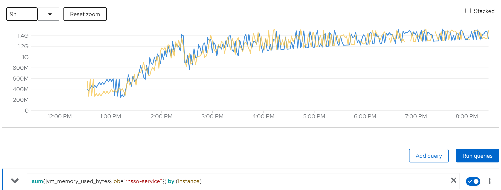

jvm_threads_current

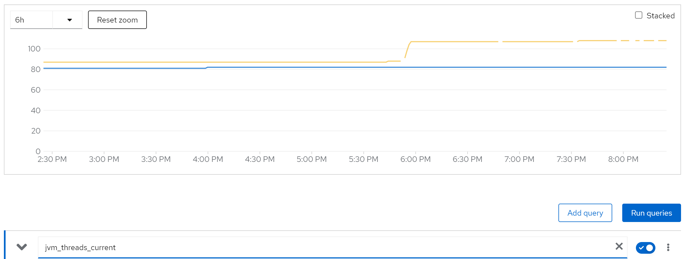

rate(java_lang_GarbageCollector_CollectionTime[5m])

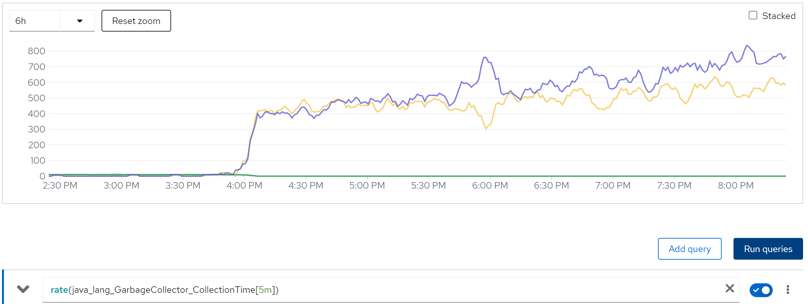

we can see the cache entries do not released

sum(jboss_infinispan_Cache_numberOfEntries) by (name)

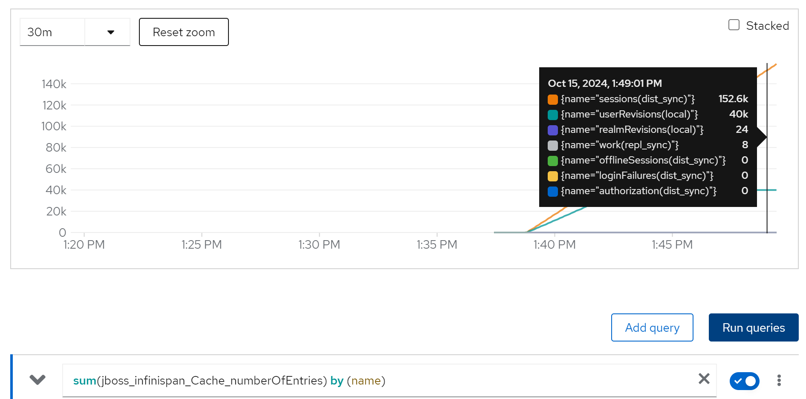

After check the infinispan configuration document, we find that the default setting of infinispan comming with rhsso, will not release the cache, that is the reason.


## limit cache and try with owner=2, 2 instance

we are 50k user, and we espect each user has 2 login session, so we have 100k session, lets limit the cache entries to 100k.

And try it again.

The configuration patch, we will set 100k cache entries, and 1 day cache timeout.
```xml
<distributed-cache name="sessions" mode="SYNC" statistics-enabled="true" owners="2">
    <eviction strategy="LRU" max-entries="100000"/>
    <expiration max-idle="86400000"/>
</distributed-cache>
```

(jboss_infinispan_Cache_numberOfEntries) 

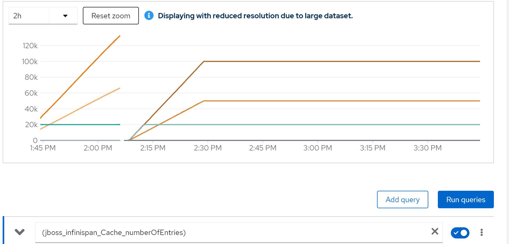

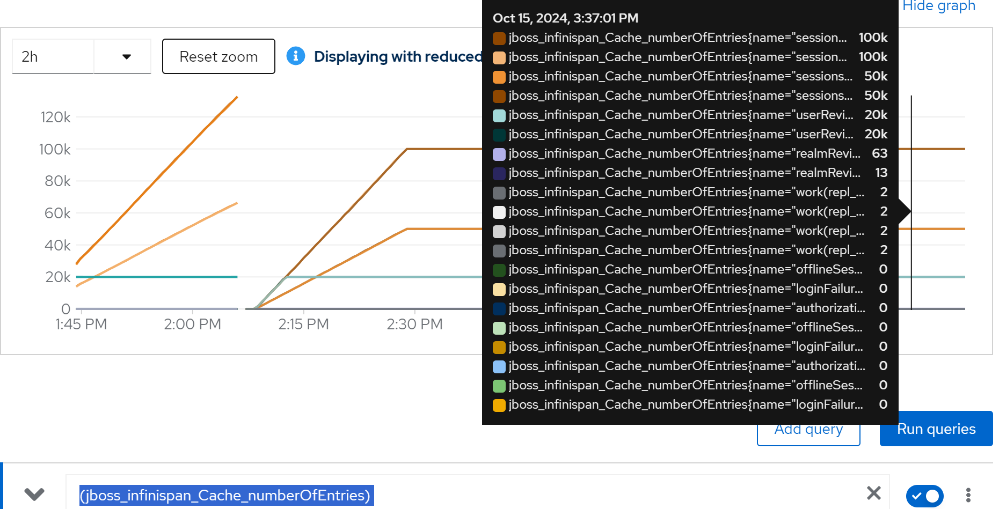

sum(jvm_memory_used_bytes{job="rhsso-service"}) by (instance)

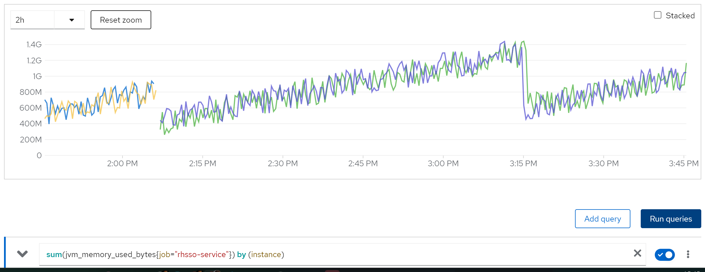


rate(java_lang_GarbageCollector_CollectionTime[5m])

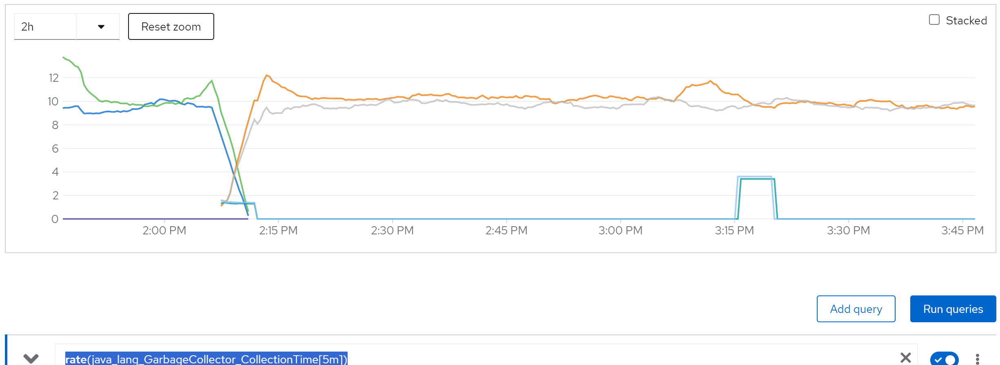

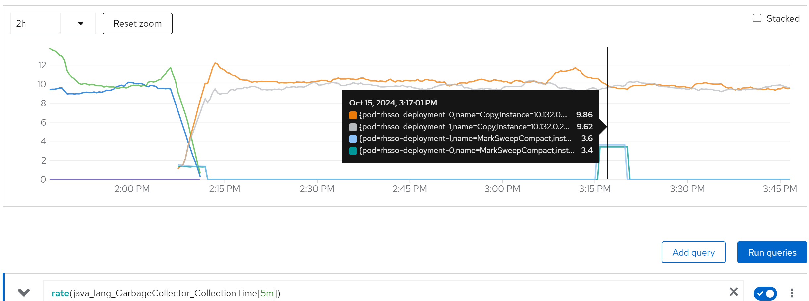

increase(wzh_success_count_total[1m])

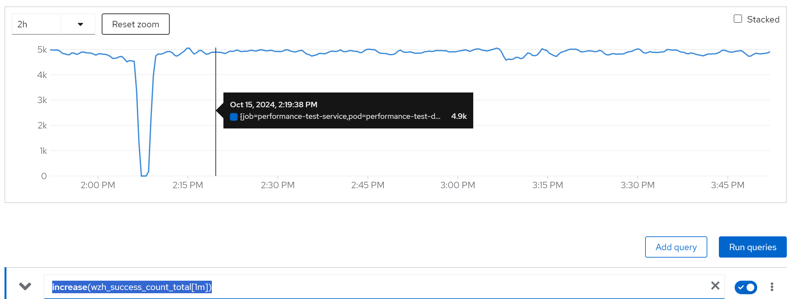

We can see, everything works fine.


## limit cache and try with owner=2, 80 instance

And if we turn to 80 instances, it works too.

wzh_success_rate_sec

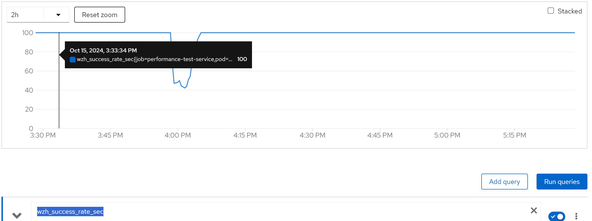

wzh_avg_time_sec

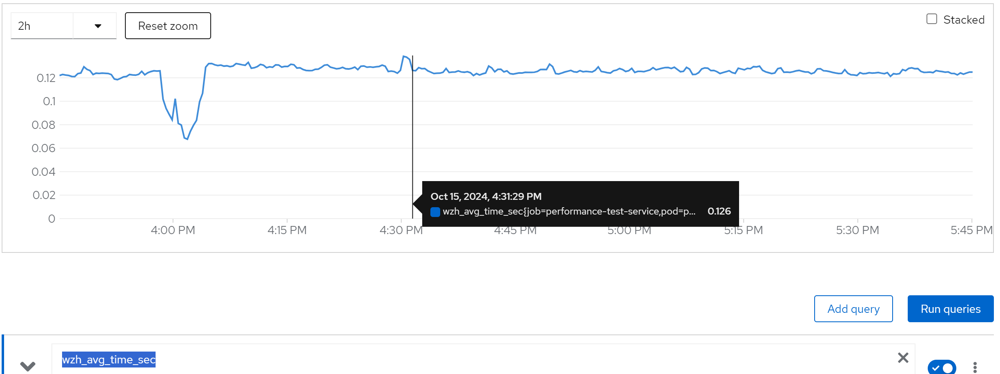

increase(wzh_success_count_total[1m])

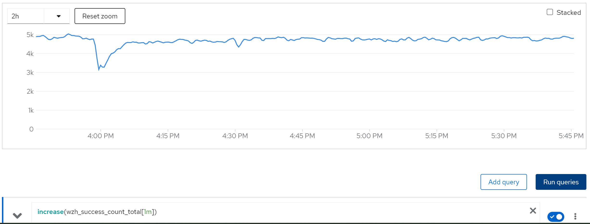

## limit cache and try with owner=80, 80 instance

If we set the owner to 80, which is not recommended by redhat solutions, we can see it still works.

wzh_success_rate_sec

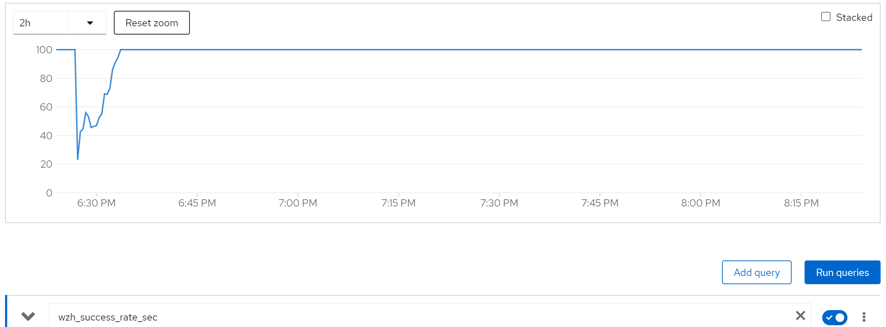

wzh_avg_time_sec

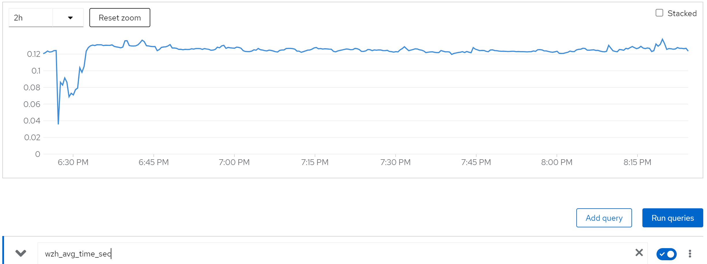

increase(wzh_success_count_total[1m])

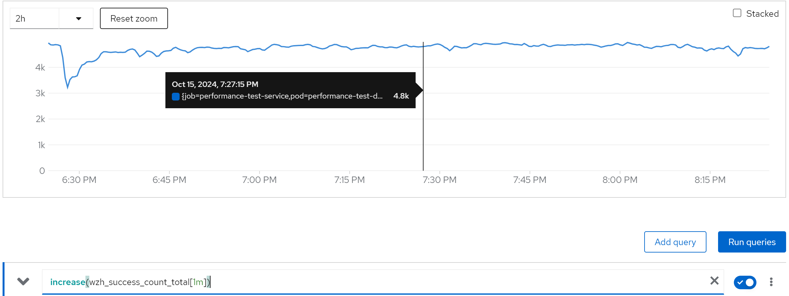

jboss_infinispan_Cache_numberOfEntries{name="\"sessions(dist_sync)\""}


# end