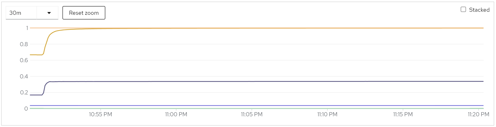

> [!CAUTION] 
> under development
# improve keycloak performance by seperate infinispan cache

Keycloak is a powerful and flexible open-source identity and access management solution from Red Hat. It is a popular choice for many organizations to secure their applications and services. However, as with any software, Keycloak's performance can be affected by various factors, such as the size of the user base, the complexity of the access control policies, and the underlying infrastructure.

We wants to create a demo, by creating 50k user in keycloak, and test the performance of keycloak. Then, seperate the infinispan cache to another server, and test the performance again.

# try on redhat keycloak-24

Customer using rhsso 7.1, but we want to test it on keycloak-24, to simulate the error. And we can get some basic idea about the performance of keycloak.


## build keycloak tool image

- https://catalog.redhat.com/software/containers/rhbk/keycloak-rhel9/64f0add883a29ec473d40906?container-tabs=dockerfile

```bash
# as root

mkdir -p ./data/keycloak.tool
cd ./data/keycloak.tool

cat << 'EOF' > bashrc
alias ls='ls --color=auto'
export PATH=/opt/keycloak/bin:$PATH
EOF


cat << EOF > Dockerfile
FROM registry.redhat.io/ubi9/ubi AS ubi-micro-build
RUN mkdir -p /mnt/rootfs
RUN dnf install --installroot /mnt/rootfs  --releasever 9 --setopt install_weak_deps=false --nodocs -y /usr/bin/ps bash-completion coreutils /usr/bin/curl jq python3 /usr/bin/tar /usr/bin/sha256sum vim nano && \
    dnf --installroot /mnt/rootfs clean all && \
    rpm --root /mnt/rootfs -e --nodeps setup

FROM registry.redhat.io/rhbk/keycloak-rhel9:24
COPY --from=ubi-micro-build /mnt/rootfs /
COPY bashrc /opt/keycloak/.bashrc
EOF

podman build -t quay.io/wangzheng422/qimgs:keycloak.tool-2024-10-06-v01 .

podman push quay.io/wangzheng422/qimgs:keycloak.tool-2024-10-06-v01

podman run -it --entrypoint /bin/bash quay.io/wangzheng422/qimgs:keycloak.tool-2024-10-06-v01

```

### deploy keycloak tool on ocp

```bash

oc delete -n demo-keycloak -f ${BASE_DIR}/data/install/keycloak.tool.yaml

cat << EOF > ${BASE_DIR}/data/install/keycloak.tool.yaml
apiVersion: v1
kind: Pod
metadata:
  name: keycloak-tool
spec:
  containers:
  - name: keycloak-tool-container
    image: quay.io/wangzheng422/qimgs:keycloak.tool-2024-10-06-v01
    command: ["tail", "-f", "/dev/null"]
EOF

oc apply -f ${BASE_DIR}/data/install/keycloak.tool.yaml -n demo-keycloak

# start the shell
oc exec -it keycloak-tool -n demo-keycloak -- bash

# copy something out
oc cp -n demo-keycloak keycloak-tool:/opt/keycloak/metrics ./metrics

```

### deploy another test pod on ocp

```bash

oc delete -n demo-keycloak -f ${BASE_DIR}/data/install/demo.test.pod.yaml

cat << EOF > ${BASE_DIR}/data/install/demo.test.pod.yaml
apiVersion: v1
kind: Pod
metadata:
  name: demo-test-pod
spec:
  containers:
  - name: demo-test-container
    image: quay.io/wangzheng422/qimgs:rocky9-test-2024.06.17.v01
    command: ["tail", "-f", "/dev/null"]
EOF

oc apply -f ${BASE_DIR}/data/install/demo.test.pod.yaml -n demo-keycloak

# start the shell
oc exec -it demo-test-pod -n demo-keycloak -- bash

```

## get keycloak config from ocp

operator config, current version: `24.0.8-opr.1`

```yaml
apiVersion: k8s.keycloak.org/v2alpha1
kind: Keycloak
metadata:
  name: example-kc
  namespace: demo-keycloak
spec:
  additionalOptions:
    - name: log-level
      value: debug
  db:
    host: postgres-db
    passwordSecret:
      key: password
      name: keycloak-db-secret
    usernameSecret:
      key: username
      name: keycloak-db-secret
    vendor: postgres
  hostname:
    hostname: keycloak-demo-keycloak.apps.demo-01-rhsys.wzhlab.top
  http:
    httpEnabled: true
    tlsSecret: example-tls-secret
  instances: 1
  proxy:
    headers: xforwarded
```


```bash

oc exec -it example-kc-0 -n demo-keycloak -- ls /opt/keycloak/conf
# cache-ispn.xml  keycloak.conf  README.md  truststores

# oc exec -it example-kc-0 -n demo-keycloak -- ls -R /opt/keycloak

oc exec -it example-kc-0 -n demo-keycloak -- cat /opt/keycloak/conf/cache-ispn.xml
```
```xml
<?xml version="1.0" encoding="UTF-8"?>
<!--
  ~ Copyright 2019 Red Hat, Inc. and/or its affiliates
  ~ and other contributors as indicated by the @author tags.
  ~
  ~ Licensed under the Apache License, Version 2.0 (the "License");
  ~ you may not use this file except in compliance with the License.
  ~ You may obtain a copy of the License at
  ~
  ~ http://www.apache.org/licenses/LICENSE-2.0
  ~
  ~ Unless required by applicable law or agreed to in writing, software
  ~ distributed under the License is distributed on an "AS IS" BASIS,
  ~ WITHOUT WARRANTIES OR CONDITIONS OF ANY KIND, either express or implied.
  ~ See the License for the specific language governing permissions and
  ~ limitations under the License.
  -->

<infinispan
        xmlns:xsi="http://www.w3.org/2001/XMLSchema-instance"
        xsi:schemaLocation="urn:infinispan:config:14.0 http://www.infinispan.org/schemas/infinispan-config-14.0.xsd"
        xmlns="urn:infinispan:config:14.0">

    <cache-container name="keycloak">
        <transport lock-timeout="60000" stack="udp"/>
        <metrics names-as-tags="true" />
        <local-cache name="realms" simple-cache="true">
            <encoding>
                <key media-type="application/x-java-object"/>
                <value media-type="application/x-java-object"/>
            </encoding>
            <memory max-count="10000"/>
        </local-cache>
        <local-cache name="users" simple-cache="true">
            <encoding>
                <key media-type="application/x-java-object"/>
                <value media-type="application/x-java-object"/>
            </encoding>
            <memory max-count="10000"/>
        </local-cache>
        <distributed-cache name="sessions" owners="2">
            <expiration lifespan="-1"/>
        </distributed-cache>
        <distributed-cache name="authenticationSessions" owners="2">
            <expiration lifespan="-1"/>
        </distributed-cache>
        <distributed-cache name="offlineSessions" owners="2">
            <expiration lifespan="-1"/>
        </distributed-cache>
        <distributed-cache name="clientSessions" owners="2">
            <expiration lifespan="-1"/>
        </distributed-cache>
        <distributed-cache name="offlineClientSessions" owners="2">
            <expiration lifespan="-1"/>
        </distributed-cache>
        <distributed-cache name="loginFailures" owners="2">
            <expiration lifespan="-1"/>
        </distributed-cache>
        <local-cache name="authorization" simple-cache="true">
            <encoding>
                <key media-type="application/x-java-object"/>
                <value media-type="application/x-java-object"/>
            </encoding>
            <memory max-count="10000"/>
        </local-cache>
        <replicated-cache name="work">
            <expiration lifespan="-1"/>
        </replicated-cache>
        <local-cache name="keys" simple-cache="true">
            <encoding>
                <key media-type="application/x-java-object"/>
                <value media-type="application/x-java-object"/>
            </encoding>
            <expiration max-idle="3600000"/>
            <memory max-count="1000"/>
        </local-cache>
        <distributed-cache name="actionTokens" owners="2">
            <encoding>
                <key media-type="application/x-java-object"/>
                <value media-type="application/x-java-object"/>
            </encoding>
            <expiration max-idle="-1" lifespan="-1" interval="300000"/>
            <memory max-count="-1"/>
        </distributed-cache>
    </cache-container>
</infinispan>
```

## on keycloak

```bash

oc rsh -n demo-keycloak example-kc-0

cd /opt/keycloak/bin
ls
# client  federation-sssd-setup.sh  kcadm.bat  kcadm.sh  kc.bat  kcreg.bat  kcreg.sh  kc.sh

export PATH=/opt/keycloak/bin:$PATH

```


## patch to the operator config

- https://www.keycloak.org/server/all-config

```yaml
spec:
  http:
    httpEnabled: true
  cache:
    configMapFile:
      key: keycloak.cache-ispn.xml
      name: keycloak-cache-ispn
  # db:
  #   poolMaxSize: 1000
  additionalOptions:
    - name: metrics-enabled
      value: 'true'
    # - name: log-level
    #   value: debug
  instances: 2
```

it seems the config is enabled using env.

## monitoring keycloak

```bash

cat << EOF > ${BASE_DIR}/data/install/enable-monitor.yaml
apiVersion: v1
kind: ConfigMap
metadata:
  name: cluster-monitoring-config
  namespace: openshift-monitoring
data:
  config.yaml: |
    enableUserWorkload: true 
    # alertmanagerMain:
    #   enableUserAlertmanagerConfig: true 
EOF

oc apply -f ${BASE_DIR}/data/install/enable-monitor.yaml

oc -n openshift-user-workload-monitoring get pod

# monitor keycloak
oc delete -n demo-keycloak -f ${BASE_DIR}/data/install/keycloak-monitor.yaml

cat << EOF > ${BASE_DIR}/data/install/keycloak-monitor.yaml
---
apiVersion: monitoring.coreos.com/v1
kind: ServiceMonitor
metadata:
  name: keycloak
  namespace: demo-keycloak
spec:
  endpoints:
    - interval: 5s
      path: /metrics
      port: http
      scheme: http
  namespaceSelector:
    matchNames:
      - demo-keycloak
  selector:
    matchLabels:
      app: keycloak
# ---
# apiVersion: monitoring.coreos.com/v1
# kind: PodMonitor
# metadata:
#   name: keycloak
#   namespace: demo-keycloak
# spec:
#   podMetricsEndpoints:
#     - interval: 5s
#       path: /metrics
#       port: http
#       scheme: http
#       # relabelings:
#       #   - sourceLabels: [__name__]
#       #     targetLabel: __name__
#       #     replacement: 'keycloak.${1}'
#   namespaceSelector:
#     matchNames:
#       - demo-keycloak
#   selector:
#     matchLabels:
#       app: keycloak
EOF

oc apply -f ${BASE_DIR}/data/install/keycloak-monitor.yaml -n demo-keycloak

```

## init users

First, we need to create 50k user in keycloak. 

Lets do it by using keycloak admin cli.

```bash

ADMIN_PWD='51a3bf077ab5465e84c51729c6a29f27'
CLIENT_SECRET="N9vQU3ldclpm2rWNlFvbnbTgFXU9XUyu"

# after enable http in keycloak, you can use http endpoint
# it is better to set session timeout for admin for 1 day :)
kcadm.sh config credentials --server http://example-kc-service:8080/ --realm master --user admin --password $ADMIN_PWD

# create a realm
kcadm.sh create realms -s realm=performance -s enabled=true

# Set SSO Session Max and SSO Session Idle to 1 day (1440 minutes)
kcadm.sh update realms/performance -s 'ssoSessionMaxLifespan=86400' -s 'ssoSessionIdleTimeout=86400'

# delete the realm
kcadm.sh delete realms/performance

# create a client
kcadm.sh create clients -r performance -s clientId=performance -s enabled=true -s 'directAccessGrantsEnabled=true'

# delete the client
CLIENT_ID=$(kcadm.sh get clients -r performance -q clientId=performance | jq -r '.[0].id')
if [ -n "$CLIENT_ID" ]; then
  echo "Deleting client performance"
  kcadm.sh delete clients/$CLIENT_ID -r performance
else
  echo "Client performance not found"
fi

# create 50k user, from user-00001 to user-50000, and set password for each user
for i in {1..50000}; do
  echo "Creating user user-$(printf "%05d" $i)"
  kcadm.sh create users -r performance -s username=user-$(printf "%05d" $i) -s enabled=true -s email=user-$(printf "%05d" $i)@wzhlab.top -s firstName=First-$(printf "%05d" $i) -s lastName=Last-$(printf "%05d" $i)
  kcadm.sh set-password -r performance --username user-$(printf "%05d" $i) --new-password password
done

# Delete users
for i in {1..50000}; do
  USER_ID=$(kcadm.sh get users -r performance -q username=user-$(printf "%05d" $i) | jq -r '.[0].id')
  if [ -n "$USER_ID" ]; then
    echo "Deleting user user-$(printf "%05d" $i)"
    kcadm.sh delete users/$USER_ID -r performance
  else
    echo "User user-$(printf "%05d" $i) not found"
  fi
done

```

### create user using job

```bash

oc delete -n demo-keycloak -f ${BASE_DIR}/data/install/keycloak-script-create-users.yaml

cat << EOF > ${BASE_DIR}/data/install/keycloak-script-sa.yaml
---
apiVersion: v1
kind: ServiceAccount
metadata:
  name: keycloak-sa
  namespace: demo-keycloak
---
apiVersion: security.openshift.io/v1
kind: SecurityContextConstraints
metadata:
  name: keycloak-scc
allowHostDirVolumePlugin: false
allowHostIPC: false
allowHostNetwork: false
allowHostPID: false
allowHostPorts: false
allowPrivilegeEscalation: true
allowPrivilegedContainer: false
allowedCapabilities: []
defaultAddCapabilities: []
fsGroup:
  type: RunAsAny
groups: []
priority: null
readOnlyRootFilesystem: false
requiredDropCapabilities: []
runAsUser:
  type: MustRunAs
  uid: 1000
seLinuxContext:
  type: RunAsAny
seccompProfiles:
- '*'
supplementalGroups:
  type: RunAsAny
users:
- system:serviceaccount:demo-keycloak:keycloak-sa
volumes:
- configMap
- emptyDir
- projected
- secret
- downwardAPI
EOF

oc apply -f ${BASE_DIR}/data/install/keycloak-script-sa.yaml -n demo-keycloak

oc adm policy add-scc-to-user keycloak-scc -z keycloak-sa -n demo-keycloak

```

```bash


oc delete -n demo-keycloak -f ${BASE_DIR}/data/install/keycloak-script-create-users.yaml

cat << EOF > ${BASE_DIR}/data/install/keycloak-script-create-users.yaml

---
apiVersion: v1
kind: ConfigMap
metadata:
  name: keycloak-script-config
data:
  create-users.sh: |
    kcadm.sh config credentials --server http://example-kc-service:8080/ --realm master --user admin --password $ADMIN_PWD 

    for i in {1..50000}; do
      echo "Creating user user-\$(printf "%05d" \$i)"
      kcadm.sh create users -r performance -s username=user-\$(printf "%05d" \$i) -s enabled=true -s email=user-\$(printf "%05d" \$i)@wzhlab.top -s firstName=First-\$(printf "%05d" \$i) -s lastName=Last-\$(printf "%05d" \$i)
      kcadm.sh set-password -r performance --username user-\$(printf "%05d" \$i) --new-password password
    done

---
apiVersion: batch/v1
kind: Job
metadata:
  name: keycloak-create-users-job
spec:
  template:
    spec:
      serviceAccountName: keycloak-sa
      containers:
      - name: keycloak-tool
        image: quay.io/wangzheng422/qimgs:keycloak.tool-2024-10-06-v01
        command: ["/bin/bash", "-c"]
        args: ["source /opt/keycloak/.bashrc && cp /scripts/create-users.sh /tmp/create-users.sh && chmod +x /tmp/create-users.sh && bash /tmp/create-users.sh"]
        securityContext:
          runAsUser: 1000
        volumeMounts:
        - name: script-volume
          mountPath: /scripts
      restartPolicy: Never
      volumes:
      - name: script-volume
        configMap:
          name: keycloak-script-config
  backoffLimit: 4
EOF

oc apply -f ${BASE_DIR}/data/install/keycloak-script-create-users.yaml -n demo-keycloak


```

### create user use multiple jobs

```bash

TOTAL_USERS=50000
NUM_JOBS=10
USERS_PER_JOB=$((TOTAL_USERS / NUM_JOBS))

for job_id in $(seq 1 $NUM_JOBS); do
  START_USER=$(( (job_id - 1) * USERS_PER_JOB + 1 ))
  END_USER=$(( job_id * USERS_PER_JOB ))

  cat << EOF > ${BASE_DIR}/data/install/keycloak-script-create-users-${job_id}.yaml

---
apiVersion: v1
kind: ConfigMap
metadata:
  name: keycloak-script-config-${job_id}
data:
  create-users.sh: |
    kcadm.sh config credentials --server http://example-kc-service:8080/ --realm master --user admin --password $ADMIN_PWD 

    for i in {$START_USER..$END_USER}; do
      echo "Creating user user-\$(printf "%05d" \$i)"
      kcadm.sh create users -r performance -s username=user-\$(printf "%05d" \$i) -s enabled=true -s email=user-\$(printf "%05d" \$i)@wzhlab.top -s firstName=First-\$(printf "%05d" \$i) -s lastName=Last-\$(printf "%05d" \$i)
      kcadm.sh set-password -r performance --username user-\$(printf "%05d" \$i) --new-password password
    done

---
apiVersion: batch/v1
kind: Job
metadata:
  name: keycloak-create-users-job-${job_id}
spec:
  template:
    spec:
      serviceAccountName: keycloak-sa
      containers:
      - name: keycloak-tool
        image: quay.io/wangzheng422/qimgs:keycloak.tool-2024-10-06-v01
        command: ["/bin/bash", "-c"]
        args: ["source /opt/keycloak/.bashrc && cp /scripts/create-users.sh /tmp/create-users.sh && chmod +x /tmp/create-users.sh && bash /tmp/create-users.sh"]
        securityContext:
          runAsUser: 1000
        volumeMounts:
        - name: script-volume
          mountPath: /scripts
      restartPolicy: Never
      volumes:
      - name: script-volume
        configMap:
          name: keycloak-script-config-${job_id}
  backoffLimit: 4
EOF
  oc delete -n demo-keycloak -f ${BASE_DIR}/data/install/keycloak-script-create-users-${job_id}.yaml
  oc apply -f ${BASE_DIR}/data/install/keycloak-script-create-users-${job_id}.yaml -n demo-keycloak
done

```


## performance using curl

Now, we have 50k user in keycloak. Lets test the performance of keycloak.

```bash
# test the performance of keycloak, by login with each user
# CLIENT_SECRET="lzdQLS1Wxxxxxxxx.set.your.client.secret.here"
for i in {1..5}; do
  curl -X POST 'http://example-kc-service:8080/realms/performance/protocol/openid-connect/token' \
    -H "Content-Type: application/x-www-form-urlencoded" \
    -d "client_id=performance" \
    -d "client_secret=$CLIENT_SECRET" \
    -d "username=user-$(printf "%05d" $i)" \
    -d "password=password" \
    -d "grant_type=password"
  echo
done


curl -X POST 'http://example-kc-service:8080/realms/performance/protocol/openid-connect/token' \
-H "Content-Type: application/x-www-form-urlencoded" \
-d "client_id=performance" \
-d "client_secret=$CLIENT_SECRET" \
-d "username=user-00001" \
-d "password=password" \
-d "grant_type=password" | jq .

# {
#   "access_token": "eyJhbGciOiJSUzI1NiIsInR5cCIgOiAiSldUIiwia2lkIiA6ICJick9pa2tPX3l2dmtoVzlLc05zTEVUMWctSWhfZ0g2WExZZnE5U1ZfeXZFIn0.eyJleHAiOjE3MjgyMjY5NTgsImlhdCI6MTcyODIyNjY1OCwianRpIjoiMzQ5ZGZjZTctNzY1Zi00Yjc0LTgyNjMtMzlmZmQ2NDA3ZjYwIiwiaXNzIjoiaHR0cHM6Ly9rZXljbG9hay1kZW1vLWtleWNsb2FrLmFwcHMuZGVtby0wMS1yaHN5cy53emhsYWIudG9wL3JlYWxtcy9wZXJmb3JtYW5jZSIsImF1ZCI6ImFjY291bnQiLCJzdWIiOiIxZWMxMmRhZC0wMWMwLTQ5N2YtOTkzMS0xZjIyMGJiMmI5OTMiLCJ0eXAiOiJCZWFyZXIiLCJhenAiOiJwZXJmb3JtYW5jZSIsInNlc3Npb25fc3RhdGUiOiIyOWQzYTUyZC0zNjExLTQ4YzktOWM5MC0yOTE2YmMxY2Q2ODciLCJhY3IiOiIxIiwicmVhbG1fYWNjZXNzIjp7InJvbGVzIjpbImRlZmF1bHQtcm9sZXMtcGVyZm9ybWFuY2UiLCJvZmZsaW5lX2FjY2VzcyIsInVtYV9hdXRob3JpemF0aW9uIl19LCJyZXNvdXJjZV9hY2Nlc3MiOnsiYWNjb3VudCI6eyJyb2xlcyI6WyJtYW5hZ2UtYWNjb3VudCIsIm1hbmFnZS1hY2NvdW50LWxpbmtzIiwidmlldy1wcm9maWxlIl19fSwic2NvcGUiOiJlbWFpbCBwcm9maWxlIiwic2lkIjoiMjlkM2E1MmQtMzYxMS00OGM5LTljOTAtMjkxNmJjMWNkNjg3IiwiZW1haWxfdmVyaWZpZWQiOmZhbHNlLCJuYW1lIjoiRmlyc3QtMDAwMDEgTGFzdC0wMDAwMSIsInByZWZlcnJlZF91c2VybmFtZSI6InVzZXItMDAwMDEiLCJnaXZlbl9uYW1lIjoiRmlyc3QtMDAwMDEiLCJmYW1pbHlfbmFtZSI6Ikxhc3QtMDAwMDEiLCJlbWFpbCI6InVzZXItMDAwMDFAd3pobGFiLnRvcCJ9.ioqCjbSuolrhGDPW8SF_Ls0NTOn9mJM8QO7btRo7N24lLZrNaKNrv7R5Mvcs4Bu5xDuB5KHEDh-IU-c3iT8TRK8hc5DHhWYwe7_WICp_O7DQEVIP-9wgeqSY4qmdwBkXvwYN0q8AIOjRwYOYqTP6rLcWiPEhdWDqkCL-S9tyhYBwRt44-k455zi1JOFSBd_vWVXp68TJ5b8TWResz3L-cT02Fk0y9_RZBXang1I3tZUOqpHBCVBhRlDwAvst2QtE3tG-rnIXBR4l1vVn1TXlfoRiDwXE5ski9B1KhHuRNZEqbPdkFpWIfb01h9qwtygv4yNKJEW_knw5t_7iaOwRhA",
#   "expires_in": 300,
#   "refresh_expires_in": 86400,
#   "refresh_token": "eyJhbGciOiJIUzUxMiIsInR5cCIgOiAiSldUIiwia2lkIiA6ICI2YWY4Mjc5Mi02NmQ3LTQ0OWItODI4MS0wY2M0NWU4ZjU0ZTkifQ.eyJleHAiOjE3MjgzMTMwNTgsImlhdCI6MTcyODIyNjY1OCwianRpIjoiYjczYWYxODktZDQzZi00MjZiLWJhZGYtNjc0NTI3MGIzZWIzIiwiaXNzIjoiaHR0cHM6Ly9rZXljbG9hay1kZW1vLWtleWNsb2FrLmFwcHMuZGVtby0wMS1yaHN5cy53emhsYWIudG9wL3JlYWxtcy9wZXJmb3JtYW5jZSIsImF1ZCI6Imh0dHBzOi8va2V5Y2xvYWstZGVtby1rZXljbG9hay5hcHBzLmRlbW8tMDEtcmhzeXMud3pobGFiLnRvcC9yZWFsbXMvcGVyZm9ybWFuY2UiLCJzdWIiOiIxZWMxMmRhZC0wMWMwLTQ5N2YtOTkzMS0xZjIyMGJiMmI5OTMiLCJ0eXAiOiJSZWZyZXNoIiwiYXpwIjoicGVyZm9ybWFuY2UiLCJzZXNzaW9uX3N0YXRlIjoiMjlkM2E1MmQtMzYxMS00OGM5LTljOTAtMjkxNmJjMWNkNjg3Iiwic2NvcGUiOiJlbWFpbCBwcm9maWxlIiwic2lkIjoiMjlkM2E1MmQtMzYxMS00OGM5LTljOTAtMjkxNmJjMWNkNjg3In0.un_vmkLIo8elfXAwrgYAnCd6xMHtPkER1j7xuxaDn_lbdmFJSBYJld4YdB6Rxezv7auOmEdd9y1GiFGd3SOGUw",
#   "token_type": "Bearer",
#   "not-before-policy": 0,
#   "session_state": "29d3a52d-3611-48c9-9c90-2916bc1cd687",
#   "scope": "email profile"
# }

```

### run with python job

```bash


cat <<EOF > ${BASE_DIR}/data/install/performance_test.py
import requests
import time
import threading
from concurrent.futures import ThreadPoolExecutor

CLIENT_SECRET = "$CLIENT_SECRET"
URL = 'http://example-kc-service:8080/realms/performance/protocol/openid-connect/token'
HEADERS = {"Content-Type": "application/x-www-form-urlencoded"}
num_users = 50000
num_threads = 10

success_count = 0
failure_count = 0
total_time = 0
lock = threading.Lock()

def make_request(start, end):
  global success_count, failure_count, total_time
  while True:
    for i in range(start, end):
      username = f"user-{i:05d}"
      data = {
        "client_id": "performance",
        "client_secret": CLIENT_SECRET,
        "username": username,
        "password": "password",
        "grant_type": "password"
      }
      start_time = time.time()
      try:
        response = requests.post(URL, headers=HEADERS, data=data)
        elapsed_time = time.time() - start_time
        with lock:
          total_time += elapsed_time
          if response.status_code == 200:
            success_count += 1
          else:
            failure_count += 1
            print(f"Error for user {username}: {response.status_code} {response.text}")
      except requests.RequestException as e:
        with lock:
          failure_count += 1
          print(f"RequestException for user {username}: {e}")

def print_summary():
  global success_count, failure_count, total_time
  while True:
    time.sleep(60)
    with lock:
      total_requests = success_count + failure_count
      success_rate = (success_count / total_requests) * 100 if total_requests > 0 else 0
      avg_time = total_time / total_requests if total_requests > 0 else 0
      print(f"Summary (last minute): Success: {success_count}, Failure: {failure_count}, Success Rate: {success_rate:.2f}%, Avg Time: {avg_time:.2f}s")
      success_count = 0
      failure_count = 0
      total_time = 0

def print_secondly_summary():
  global success_count, failure_count, total_time
  while True:
    time.sleep(1)
    with lock:
      total_requests = success_count + failure_count
      success_rate = (success_count / total_requests) * 100 if total_requests > 0 else 0
      avg_time = total_time / total_requests if total_requests > 0 else 0
      print(f"Second Summary: Success: {success_count}, Failure: {failure_count}, Success Rate: {success_rate:.2f}%, Avg Time: {avg_time:.2f}s")

if __name__ == "__main__":
  summary_thread = threading.Thread(target=print_summary, daemon=True)
  summary_thread.start()

  secondly_summary_thread = threading.Thread(target=print_secondly_summary, daemon=True)
  secondly_summary_thread.start()

  users_per_thread = num_users // num_threads

  with ThreadPoolExecutor(max_workers=num_threads) as executor:
    for i in range(num_threads):
      start = i * users_per_thread + 1
      end = (i + 1) * users_per_thread + 1
      executor.submit(make_request, start, end)
  
  # Keep the main thread running indefinitely
  while True:
    time.sleep(1)
EOF

oc delete -n demo-keycloak configmap performance-test-script
oc create configmap performance-test-script -n demo-keycloak --from-file=${BASE_DIR}/data/install/performance_test.py


oc delete -n demo-keycloak job performance-test-job
cat << EOF > ${BASE_DIR}/data/install/performance-test-job.yaml
apiVersion: batch/v1
kind: Job
metadata:
  name: performance-test-job
spec:
  template:
    spec:
      containers:
      - name: performance-test
        image: quay.io/wangzheng422/qimgs:rocky9-test-2024.06.17.v01
        command: ["/usr/bin/python3", "/scripts/performance_test.py"]
        volumeMounts:
        - name: script-volume
          mountPath: /scripts
      restartPolicy: Never
      volumes:
      - name: script-volume
        configMap:
          name: performance-test-script
  backoffLimit: 4
EOF

oc delete -n demo-keycloak job performance-test-job
oc apply -f ${BASE_DIR}/data/install/performance-test-job.yaml -n demo-keycloak

```

## enable monitoring & set the owners to 2

```bash

cat << EOF >  ${BASE_DIR}/data/install/keycloak.cache-ispn.xml
<infinispan
        xmlns:xsi="http://www.w3.org/2001/XMLSchema-instance"
        xsi:schemaLocation="urn:infinispan:config:14.0 http://www.infinispan.org/schemas/infinispan-config-14.0.xsd"
        xmlns="urn:infinispan:config:14.0">

    <cache-container name="keycloak" statistics="true">
        <transport lock-timeout="60000" stack="udp"/>
        <metrics names-as-tags="true" />
        <local-cache name="realms" simple-cache="true" statistics="true">
            <encoding>
                <key media-type="application/x-java-object"/>
                <value media-type="application/x-java-object"/>
            </encoding>
            <memory max-count="10000"/>
        </local-cache>
        <local-cache name="users" simple-cache="true" statistics="true">
            <encoding>
                <key media-type="application/x-java-object"/>
                <value media-type="application/x-java-object"/>
            </encoding>
            <memory max-count="10000"/>
        </local-cache>
        <distributed-cache name="sessions" owners="2" statistics="true">
            <expiration lifespan="-1"/>
        </distributed-cache>
        <distributed-cache name="authenticationSessions" owners="2" statistics="true">
            <expiration lifespan="-1"/>
        </distributed-cache>
        <distributed-cache name="offlineSessions" owners="2" statistics="true">
            <expiration lifespan="-1"/>
        </distributed-cache>
        <distributed-cache name="clientSessions" owners="2" statistics="true">
            <expiration lifespan="-1"/>
        </distributed-cache>
        <distributed-cache name="offlineClientSessions" owners="2" statistics="true">
            <expiration lifespan="-1"/>
        </distributed-cache>
        <distributed-cache name="loginFailures" owners="2" statistics="true">
            <expiration lifespan="-1"/>
        </distributed-cache>
        <local-cache name="authorization" simple-cache="true" statistics="true">
            <encoding>
                <key media-type="application/x-java-object"/>
                <value media-type="application/x-java-object"/>
            </encoding>
            <memory max-count="10000"/>
        </local-cache>
        <replicated-cache name="work" statistics="true">
            <expiration lifespan="-1"/>
        </replicated-cache>
        <local-cache name="keys" simple-cache="true" statistics="true">
            <encoding>
                <key media-type="application/x-java-object"/>
                <value media-type="application/x-java-object"/>
            </encoding>
            <expiration max-idle="3600000"/>
            <memory max-count="1000"/>
        </local-cache>
        <distributed-cache name="actionTokens" owners="2" statistics="true">
            <encoding>
                <key media-type="application/x-java-object"/>
                <value media-type="application/x-java-object"/>
            </encoding>
            <expiration max-idle="-1" lifespan="-1" interval="300000"/>
            <memory max-count="-1"/>
        </distributed-cache>
    </cache-container>
</infinispan>
EOF

# create configmap
oc delete configmap keycloak-cache-ispn -n demo-keycloak
oc create configmap keycloak-cache-ispn --from-file=${BASE_DIR}/data/install/keycloak.cache-ispn.xml -n demo-keycloak

```

### run with 2 instance

direct ouptut of the job

```log
......
Summary (last minute): Success: 1626, Failure: 0, Success Rate: 100.00%, Avg Time: 0.37s
......
Summary (last minute): Success: 1672, Failure: 0, Success Rate: 100.00%, Avg Time: 0.36s
......
Summary (last minute): Success: 1672, Failure: 0, Success Rate: 100.00%, Avg Time: 0.36s
......

```

in pg log

```log

......
2024-10-10 07:06:45.352 UTC [14] LOG:  checkpoint starting: time
2024-10-10 07:11:15.103 UTC [14] LOG:  checkpoint complete: wrote 2884 buffers (17.6%); 0 WAL file(s) added, 0 removed, 1 recycled; write=269.740 s, sync=0.003 s, total=269.751 s; sync files=25, longest=0.002 s, average=0.001 s; distance=17523 kB, estimate=19068 kB
2024-10-10 12:11:50.170 UTC [14] LOG:  checkpoint starting: time
2024-10-10 12:12:46.692 UTC [14] LOG:  checkpoint complete: wrote 564 buffers (3.4%); 0 WAL file(s) added, 0 removed, 1 recycled; write=56.505 s, sync=0.004 s, total=56.523 s; sync files=19, longest=0.003 s, average=0.001 s; distance=10166 kB, estimate=18177 kB

```

metric: jvm_threads_live_threads -> 180


metric: rate(jvm_gc_pause_seconds_count[5m]) -> 10


metric: agroal_blocking_time_average_milliseconds -> 0


metric: vendor_statistics_approximate_entries


metric: vendor_statistics_average_read_time_nanos


metric: vendor_statistics_average_write_time_nanos


metric: vendor_statistics_hit_ratio


### run with 20 instance

direct ouptut of the job

```log
......
Summary (last minute): Success: 1243, Failure: 0, Success Rate: 100.00%, Avg Time: 0.48s
......
Summary (last minute): Success: 1439, Failure: 0, Success Rate: 100.00%, Avg Time: 0.42s
......
Summary (last minute): Success: 1448, Failure: 0, Success Rate: 100.00%, Avg Time: 0.41s
......Summary (last minute): Success: 1439, Failure: 0, Success Rate: 100.00%, Avg Time: 0.42s
......
Summary (last minute): Success: 1459, Failure: 0, Success Rate: 100.00%, Avg Time: 0.41s
......
Summary (last minute): Success: 1479, Failure: 0, Success Rate: 100.00%, Avg Time: 0.41s
......

```


metric: jvm_threads_live_threads


metric: rate(jvm_gc_pause_seconds_count[5m]) -> 10


metric: agroal_blocking_time_average_milliseconds -> 0


metric: vendor_statistics_approximate_entries


metric: vendor_statistics_average_read_time_nanos


metric: vendor_statistics_average_write_time_nanos


metric: vendor_statistics_hit_ratio


### run with 40 instance

direct ouptut of the job

```log
......
Summary (last minute): Success: 1210, Failure: 0, Success Rate: 100.00%, Avg Time: 0.49s
......
Summary (last minute): Success: 1331, Failure: 0, Success Rate: 100.00%, Avg Time: 0.45s
......
Summary (last minute): Success: 1372, Failure: 0, Success Rate: 100.00%, Avg Time: 0.44s
......
Summary (last minute): Success: 1358, Failure: 0, Success Rate: 100.00%, Avg Time: 0.44s
......
Summary (last minute): Success: 1390, Failure: 0, Success Rate: 100.00%, Avg Time: 0.43s
......
Summary (last minute): Success: 1424, Failure: 0, Success Rate: 100.00%, Avg Time: 0.42s
......
Summary (last minute): Success: 1432, Failure: 0, Success Rate: 100.00%, Avg Time: 0.42s
......

```


metric: jvm_threads_live_threads


metric: rate(jvm_gc_pause_seconds_count[5m]) -> 10


metric: agroal_blocking_time_average_milliseconds -> 0


metric: vendor_statistics_approximate_entries


metric: vendor_statistics_average_read_time_nanos


metric: vendor_statistics_average_write_time_nanos


metric: vendor_statistics_hit_ratio


### run with 80 instance

direct ouptut of the job

```log
......
Summary (last minute): Success: 1149, Failure: 0, Success Rate: 100.00%, Avg Time: 0.52s
......
Summary (last minute): Success: 1341, Failure: 0, Success Rate: 100.00%, Avg Time: 0.45s
......
Summary (last minute): Success: 1345, Failure: 0, Success Rate: 100.00%, Avg Time: 0.45s
......
Summary (last minute): Success: 1356, Failure: 0, Success Rate: 100.00%, Avg Time: 0.44s
......
Summary (last minute): Success: 1375, Failure: 0, Success Rate: 100.00%, Avg Time: 0.44s
......
Summary (last minute): Success: 1362, Failure: 0, Success Rate: 100.00%, Avg Time: 0.44s
......

```


metric: jvm_threads_live_threads


metric: rate(jvm_gc_pause_seconds_count[5m])


metric: agroal_blocking_time_average_milliseconds -> 0


metric: vendor_statistics_approximate_entries


metric: vendor_statistics_average_read_time_nanos


metric: avg(vendor_statistics_average_read_time_nanos) by (cache)


metric: avg(vendor_statistics_average_write_time_nanos) by (cache)


metric: avg (vendor_statistics_hit_ratio) by (cache)




### summary

- performance is stable when instance increased
- cache works fine, as in the beginning, db read a lot, then no db read.
- java thread increased a little.

## enable monitoring & set the owners to 80

```bash

cat << EOF >  ${BASE_DIR}/data/install/keycloak.cache-ispn.xml
<infinispan
        xmlns:xsi="http://www.w3.org/2001/XMLSchema-instance"
        xsi:schemaLocation="urn:infinispan:config:14.0 http://www.infinispan.org/schemas/infinispan-config-14.0.xsd"
        xmlns="urn:infinispan:config:14.0">

    <cache-container name="keycloak" statistics="true">
        <transport lock-timeout="60000" stack="udp"/>
        <metrics names-as-tags="true" />
        <local-cache name="realms" simple-cache="true" statistics="true">
            <encoding>
                <key media-type="application/x-java-object"/>
                <value media-type="application/x-java-object"/>
            </encoding>
            <memory max-count="10000"/>
        </local-cache>
        <local-cache name="users" simple-cache="true" statistics="true">
            <encoding>
                <key media-type="application/x-java-object"/>
                <value media-type="application/x-java-object"/>
            </encoding>
            <memory max-count="10000"/>
        </local-cache>
        <distributed-cache name="sessions" owners="80" statistics="true">
            <expiration lifespan="-1"/>
        </distributed-cache>
        <distributed-cache name="authenticationSessions" owners="80" statistics="true">
            <expiration lifespan="-1"/>
        </distributed-cache>
        <distributed-cache name="offlineSessions" owners="80" statistics="true">
            <expiration lifespan="-1"/>
        </distributed-cache>
        <distributed-cache name="clientSessions" owners="80" statistics="true">
            <expiration lifespan="-1"/>
        </distributed-cache>
        <distributed-cache name="offlineClientSessions" owners="80" statistics="true">
            <expiration lifespan="-1"/>
        </distributed-cache>
        <distributed-cache name="loginFailures" owners="80" statistics="true">
            <expiration lifespan="-1"/>
        </distributed-cache>
        <local-cache name="authorization" simple-cache="true" statistics="true">
            <encoding>
                <key media-type="application/x-java-object"/>
                <value media-type="application/x-java-object"/>
            </encoding>
            <memory max-count="10000"/>
        </local-cache>
        <replicated-cache name="work" statistics="true">
            <expiration lifespan="-1"/>
        </replicated-cache>
        <local-cache name="keys" simple-cache="true" statistics="true">
            <encoding>
                <key media-type="application/x-java-object"/>
                <value media-type="application/x-java-object"/>
            </encoding>
            <expiration max-idle="3600000"/>
            <memory max-count="1000"/>
        </local-cache>
        <distributed-cache name="actionTokens" owners="80" statistics="true">
            <encoding>
                <key media-type="application/x-java-object"/>
                <value media-type="application/x-java-object"/>
            </encoding>
            <expiration max-idle="-1" lifespan="-1" interval="300000"/>
            <memory max-count="-1"/>
        </distributed-cache>
    </cache-container>
</infinispan>
EOF

# create configmap
oc delete configmap keycloak-cache-ispn -n demo-keycloak
oc create configmap keycloak-cache-ispn --from-file=${BASE_DIR}/data/install/keycloak.cache-ispn.xml -n demo-keycloak


```

### run with 2 instance


direct ouptut of the job

```log
......
Summary (last minute): Success: 1149, Failure: 0, Success Rate: 100.00%, Avg Time: 0.52s
......
Summary (last minute): Success: 1341, Failure: 0, Success Rate: 100.00%, Avg Time: 0.45s
......
Summary (last minute): Success: 1345, Failure: 0, Success Rate: 100.00%, Avg Time: 0.45s
......
Summary (last minute): Success: 1356, Failure: 0, Success Rate: 100.00%, Avg Time: 0.44s
......
Summary (last minute): Success: 1375, Failure: 0, Success Rate: 100.00%, Avg Time: 0.44s
......
Summary (last minute): Success: 1362, Failure: 0, Success Rate: 100.00%, Avg Time: 0.44s
......

```


metric: jvm_threads_live_threads


metric: rate(jvm_gc_pause_seconds_count[5m])


metric: agroal_blocking_time_average_milliseconds -> 0


metric: vendor_statistics_approximate_entries


metric: avg(vendor_statistics_approximate_entries) by (cache)


metric: vendor_statistics_average_read_time_nanos


metric: avg(vendor_statistics_average_read_time_nanos) by (cache)


metric: vendor_statistics_average_write_time_nanos


metric: avg(vendor_statistics_average_write_time_nanos) by (cache)


metric: avg (vendor_statistics_hit_ratio) by (cache)


### run with 20 instance


direct ouptut of the job

```log
......
Summary (last minute): Success: 1277, Failure: 0, Success Rate: 100.00%, Avg Time: 0.47s
......
Summary (last minute): Success: 1392, Failure: 0, Success Rate: 100.00%, Avg Time: 0.43s
......
Summary (last minute): Success: 1408, Failure: 0, Success Rate: 100.00%, Avg Time: 0.43s
......
Summary (last minute): Success: 1398, Failure: 0, Success Rate: 100.00%, Avg Time: 0.43s
......
Summary (last minute): Success: 1384, Failure: 0, Success Rate: 100.00%, Avg Time: 0.43s
......

```


metric: jvm_threads_live_threads


metric: rate(jvm_gc_pause_seconds_count[5m])


metric: agroal_blocking_time_average_milliseconds -> 0


metric: vendor_statistics_approximate_entries


metric: avg(vendor_statistics_approximate_entries) by (cache)


metric: vendor_statistics_average_read_time_nanos


metric: avg(vendor_statistics_average_read_time_nanos) by (cache)


metric: vendor_statistics_average_write_time_nanos


metric: avg(vendor_statistics_average_write_time_nanos) by (cache)


metric: avg (vendor_statistics_hit_ratio) by (cache)


### run with 40 instance

direct ouptut of the job

```log
......
Summary (last minute): Success: 1315, Failure: 0, Success Rate: 100.00%, Avg Time: 0.46s
......
Summary (last minute): Success: 1413, Failure: 0, Success Rate: 100.00%, Avg Time: 0.42s
......
Summary (last minute): Success: 1406, Failure: 0, Success Rate: 100.00%, Avg Time: 0.43s
......
Summary (last minute): Success: 1405, Failure: 0, Success Rate: 100.00%, Avg Time: 0.43s
......
Summary (last minute): Success: 1414, Failure: 0, Success Rate: 100.00%, Avg Time: 0.42s
......

```


metric: jvm_threads_live_threads


metric: rate(jvm_gc_pause_seconds_count[5m])


metric: agroal_blocking_time_average_milliseconds -> 0


metric: vendor_statistics_approximate_entries


metric: avg(vendor_statistics_approximate_entries) by (cache)


metric: vendor_statistics_average_read_time_nanos


metric: avg(vendor_statistics_average_read_time_nanos) by (cache)


metric: vendor_statistics_average_write_time_nanos


metric: avg(vendor_statistics_average_write_time_nanos) by (cache)


metric: avg (vendor_statistics_hit_ratio) by (cache)


### run with 80 instance

direct ouptut of the job

```log
......
Summary (last minute): Success: 1215, Failure: 0, Success Rate: 100.00%, Avg Time: 0.49s
......
Summary (last minute): Success: 1383, Failure: 0, Success Rate: 100.00%, Avg Time: 0.43s
......
Summary (last minute): Success: 1341, Failure: 0, Success Rate: 100.00%, Avg Time: 0.45s
......
Summary (last minute): Success: 1374, Failure: 0, Success Rate: 100.00%, Avg Time: 0.44s
......
Summary (last minute): Success: 1351, Failure: 0, Success Rate: 100.00%, Avg Time: 0.44s
......

```


metric: jvm_threads_live_threads


metric: rate(jvm_gc_pause_seconds_count[5m])


metric: agroal_blocking_time_average_milliseconds -> 0


metric: vendor_statistics_approximate_entries


metric: avg(vendor_statistics_approximate_entries) by (cache)


metric: vendor_statistics_average_read_time_nanos


metric: avg(vendor_statistics_average_read_time_nanos) by (cache)


metric: vendor_statistics_average_write_time_nanos


metric: avg(vendor_statistics_average_write_time_nanos) by (cache)


metric: avg (vendor_statistics_hit_ratio) by (cache)


### run with 80 instance and db max connection set to 100

In above test, the postgresqldb max connection is set to 1000.

We can see the db connection is full, and the keycloak is blocked. And consequence is
- thread pool full
- thread timeout


direct ouptut of the job

```log
...
Summary (last minute): Success: 796, Failure: 49, Success Rate: 94.20%, Avg Time: 0.71s
...
Summary (last minute): Success: 1076, Failure: 75, Success Rate: 93.48%, Avg Time: 0.52s
...
Summary (last minute): Success: 1053, Failure: 68, Success Rate: 93.93%, Avg Time: 0.54s
...
Summary (last minute): Success: 1060, Failure: 78, Success Rate: 93.15%, Avg Time: 0.53s
...

```

and lots of errors in keycloak

```log
2024-10-09 12:45:29,804 WARN  [io.vertx.core.impl.BlockedThreadChecker] (vertx-blocked-thread-checker) Thread Thread[vert.x-eventloop-thread-41,5,main] has been blocked for 2544 ms, time limit is 2000 ms: io.vertx.core.VertxException: Thread blocked
	at io.vertx.core.net.impl.SocketAddressImpl.<init>(SocketAddressImpl.java:60)
	at io.vertx.core.http.HttpServer.listen(HttpServer.java:216)
	at io.vertx.core.http.HttpServer.listen(HttpServer.java:229)
	at io.quarkus.vertx.http.runtime.VertxHttpRecorder$WebDeploymentVerticle.setupTcpHttpServer(VertxHttpRecorder.java:1159)
	at io.quarkus.vertx.http.runtime.VertxHttpRecorder$WebDeploymentVerticle.start(VertxHttpRecorder.java:1081)
	at io.vertx.core.impl.DeploymentManager.lambda$doDeploy$5(DeploymentManager.java:210)
	at io.vertx.core.impl.DeploymentManager$$Lambda$2124/0x00007f7fcbd541d8.handle(Unknown Source)
	at io.vertx.core.impl.ContextInternal.dispatch(ContextInternal.java:279)
	at io.vertx.core.impl.ContextInternal.dispatch(ContextInternal.java:261)
	at io.vertx.core.impl.ContextInternal.lambda$runOnContext$0(ContextInternal.java:59)
	at io.vertx.core.impl.ContextInternal$$Lambda$2125/0x00007f7fcbd54400.run(Unknown Source)
	at io.netty.util.concurrent.AbstractEventExecutor.runTask(AbstractEventExecutor.java:173)
	at io.netty.util.concurrent.AbstractEventExecutor.safeExecute(AbstractEventExecutor.java:166)
	at io.netty.util.concurrent.SingleThreadEventExecutor.runAllTasks(SingleThreadEventExecutor.java:470)
	at io.netty.channel.nio.NioEventLoop.run(NioEventLoop.java:569)
	at io.netty.util.concurrent.SingleThreadEventExecutor$4.run(SingleThreadEventExecutor.java:997)
	at io.netty.util.internal.ThreadExecutorMap$2.run(ThreadExecutorMap.java:74)
	at io.netty.util.concurrent.FastThreadLocalRunnable.run(FastThreadLocalRunnable.java:30)
	at java.base@17.0.12/java.lang.Thread.run(Thread.java:840)

```

after many thread blocked error, then we got

```log
2024-10-09 15:18:51,247 WARN  [io.agroal.pool] (agroal-11) Datasource '<default>': FATAL: sorry, too many clients already
2024-10-09 15:18:51,249 WARN  [org.hibernate.engine.jdbc.spi.SqlExceptionHelper] (executor-thread-1) SQL Error: 0, SQLState: 53300
2024-10-09 15:18:51,249 ERROR [org.hibernate.engine.jdbc.spi.SqlExceptionHelper] (executor-thread-1) FATAL: sorry, too many clients already
2024-10-09 15:18:51,257 ERROR [org.keycloak.services.error.KeycloakErrorHandler] (executor-thread-1) Uncaught server error: org.hibernate.exception.GenericJDBCException: Unable to acquire JDBC Connection [FATAL: sorry, too many clients already] [n/a]
	at org.hibernate.exception.internal.StandardSQLExceptionConverter.convert(StandardSQLExceptionConverter.java:63)
	at org.hibernate.engine.jdbc.spi.SqlExceptionHelper.convert(SqlExceptionHelper.java:108)
	at org.hibernate.engine.jdbc.spi.SqlExceptionHelper.convert(SqlExceptionHelper.java:94)
	at org.hibernate.resource.jdbc.internal.LogicalConnectionManagedImpl.acquireConnectionIfNeeded(LogicalConnectionManagedImpl.java:116)
	at org.hibernate.resource.jdbc.internal.LogicalConnectionManagedImpl.getPhysicalConnection(LogicalConnectionManagedImpl.java:143)
	at org.hibernate.engine.jdbc.internal.StatementPreparerImpl.connection(StatementPreparerImpl.java:54)
	at org.hibernate.engine.jdbc.internal.StatementPreparerImpl$5.doPrepare(StatementPreparerImpl.java:153)
	at org.hibernate.engine.jdbc.internal.StatementPreparerImpl$StatementPreparationTemplate.prepareStatement(StatementPreparerImpl.java:183)
	at org.hibernate.engine.jdbc.internal.StatementPreparerImpl.prepareQueryStatement(StatementPreparerImpl.java:155)
	at org.hibernate.sql.exec.spi.JdbcSelectExecutor.lambda$list$0(JdbcSelectExecutor.java:85)
	at org.hibernate.sql.results.jdbc.internal.DeferredResultSetAccess.executeQuery(DeferredResultSetAccess.java:231)
	at org.hibernate.sql.results.jdbc.internal.DeferredResultSetAccess.getResultSet(DeferredResultSetAccess.java:167)
	at org.hibernate.sql.results.jdbc.internal.JdbcValuesResultSetImpl.advanceNext(JdbcValuesResultSetImpl.java:218)
	at org.hibernate.sql.results.jdbc.internal.JdbcValuesResultSetImpl.processNext(JdbcValuesResultSetImpl.java:98)
	at org.hibernate.sql.results.jdbc.internal.AbstractJdbcValues.next(AbstractJdbcValues.java:19)
	at org.hibernate.sql.results.internal.RowProcessingStateStandardImpl.next(RowProcessingStateStandardImpl.java:66)
	at org.hibernate.sql.results.spi.ListResultsConsumer.consume(ListResultsConsumer.java:202)
	at org.hibernate.sql.results.spi.ListResultsConsumer.consume(ListResultsConsumer.java:33)
	at org.hibernate.sql.exec.internal.JdbcSelectExecutorStandardImpl.doExecuteQuery(JdbcSelectExecutorStandardImpl.java:209)
	at org.hibernate.sql.exec.internal.JdbcSelectExecutorStandardImpl.executeQuery(JdbcSelectExecutorStandardImpl.java:83)
	at org.hibernate.sql.exec.spi.JdbcSelectExecutor.list(JdbcSelectExecutor.java:76)
	at org.hibernate.sql.exec.spi.JdbcSelectExecutor.list(JdbcSelectExecutor.java:65)
	at org.hibernate.query.sqm.internal.ConcreteSqmSelectQueryPlan.lambda$new$2(ConcreteSqmSelectQueryPlan.java:137)
	at org.hibernate.query.sqm.internal.ConcreteSqmSelectQueryPlan.withCacheableSqmInterpretation(ConcreteSqmSelectQueryPlan.java:381)
	at org.hibernate.query.sqm.internal.ConcreteSqmSelectQueryPlan.performList(ConcreteSqmSelectQueryPlan.java:303)
	at org.hibernate.query.sqm.internal.QuerySqmImpl.doList(QuerySqmImpl.java:509)
	at org.hibernate.query.spi.AbstractSelectionQuery.list(AbstractSelectionQuery.java:427)
	at org.hibernate.query.Query.getResultList(Query.java:120)
	at org.keycloak.models.jpa.JpaUserProvider.getUserByUsername(JpaUserProvider.java:531)
	at org.keycloak.storage.UserStorageManager.getUserByUsername(UserStorageManager.java:383)
	at org.keycloak.models.cache.infinispan.UserCacheSession.getUserByUsername(UserCacheSession.java:271)
	at org.keycloak.models.utils.KeycloakModelUtils.findUserByNameOrEmail(KeycloakModelUtils.java:247)
	at org.keycloak.authentication.authenticators.directgrant.ValidateUsername.authenticate(ValidateUsername.java:64)
	at org.keycloak.authentication.DefaultAuthenticationFlow.processSingleFlowExecutionModel(DefaultAuthenticationFlow.java:442)
	at org.keycloak.authentication.DefaultAuthenticationFlow.processFlow(DefaultAuthenticationFlow.java:246)
	at org.keycloak.authentication.AuthenticationProcessor.authenticateOnly(AuthenticationProcessor.java:1051)
	at org.keycloak.protocol.oidc.grants.ResourceOwnerPasswordCredentialsGrantType.process(ResourceOwnerPasswordCredentialsGrantType.java:107)
	at org.keycloak.protocol.oidc.endpoints.TokenEndpoint.processGrantRequest(TokenEndpoint.java:139)
	at org.keycloak.protocol.oidc.endpoints.TokenEndpoint$quarkusrestinvoker$processGrantRequest_6408e15340992839b66447750c221d9aaa837bd7.invoke(Unknown Source)
	at org.jboss.resteasy.reactive.server.handlers.InvocationHandler.handle(InvocationHandler.java:29)
	at io.quarkus.resteasy.reactive.server.runtime.QuarkusResteasyReactiveRequestContext.invokeHandler(QuarkusResteasyReactiveRequestContext.java:141)
	at org.jboss.resteasy.reactive.common.core.AbstractResteasyReactiveContext.run(AbstractResteasyReactiveContext.java:147)
	at io.quarkus.vertx.core.runtime.VertxCoreRecorder$14.runWith(VertxCoreRecorder.java:582)
	at org.jboss.threads.EnhancedQueueExecutor$Task.run(EnhancedQueueExecutor.java:2513)
	at org.jboss.threads.EnhancedQueueExecutor$ThreadBody.run(EnhancedQueueExecutor.java:1538)
	at org.jboss.threads.DelegatingRunnable.run(DelegatingRunnable.java:29)
	at org.jboss.threads.ThreadLocalResettingRunnable.run(ThreadLocalResettingRunnable.java:29)
	at io.netty.util.concurrent.FastThreadLocalRunnable.run(FastThreadLocalRunnable.java:30)
	at java.base/java.lang.Thread.run(Thread.java:840)
Caused by: org.postgresql.util.PSQLException: FATAL: sorry, too many clients already
	at org.postgresql.core.v3.ConnectionFactoryImpl.doAuthentication(ConnectionFactoryImpl.java:698)
	at org.postgresql.core.v3.ConnectionFactoryImpl.tryConnect(ConnectionFactoryImpl.java:207)
	at org.postgresql.core.v3.ConnectionFactoryImpl.openConnectionImpl(ConnectionFactoryImpl.java:262)
	at org.postgresql.core.ConnectionFactory.openConnection(ConnectionFactory.java:54)
	at org.postgresql.jdbc.PgConnection.<init>(PgConnection.java:273)
	at org.postgresql.Driver.makeConnection(Driver.java:446)
	at org.postgresql.Driver.connect(Driver.java:298)
	at java.sql/java.sql.DriverManager.getConnection(DriverManager.java:681)
	at java.sql/java.sql.DriverManager.getConnection(DriverManager.java:229)
	at org.postgresql.ds.common.BaseDataSource.getConnection(BaseDataSource.java:104)
	at org.postgresql.xa.PGXADataSource.getXAConnection(PGXADataSource.java:52)
	at org.postgresql.xa.PGXADataSource.getXAConnection(PGXADataSource.java:37)
	at io.agroal.pool.ConnectionFactory.createConnection(ConnectionFactory.java:231)
	at io.agroal.pool.ConnectionPool$CreateConnectionTask.call(ConnectionPool.java:545)
	at io.agroal.pool.ConnectionPool$CreateConnectionTask.call(ConnectionPool.java:526)
	at java.base/java.util.concurrent.FutureTask.run(FutureTask.java:264)
	at io.agroal.pool.util.PriorityScheduledExecutor.beforeExecute(PriorityScheduledExecutor.java:75)
	at java.base/java.util.concurrent.ThreadPoolExecutor.runWorker(ThreadPoolExecutor.java:1134)
	at java.base/java.util.concurrent.ThreadPoolExecutor$Worker.run(ThreadPoolExecutor.java:635)
	... 1 more
```

# try on rhsso 7.1

## build the rhsso image

```bash

mkdir -p ./data/rhsso
cd ./data/rhsso

cat << EOF > Dockerfile
FROM registry.redhat.io/ubi9/ubi

RUN dnf install -y java-1.8.0-openjdk-headless /usr/bin/unzip /usr/bin/ps /usr/bin/curl jq python3 /usr/bin/tar /usr/bin/sha256sum vim nano /usr/bin/rsync && \
    dnf clean all

COPY rh-sso-7.1.0.zip /tmp/rh-sso-7.1.0.zip

RUN mkdir -p /opt/tmp/ && unzip /tmp/rh-sso-7.1.0.zip -d /opt/tmp && \
    rsync -a /opt/tmp/rh-sso-7.1/ /opt/rhsso/ && \
    rm -rf /opt/tmp && \
    rm -f /tmp/rh-sso-7.1.0.zip

EOF

podman build -t quay.io/wangzheng422/qimgs:rhsso-7.1.0-v01 .


```


# end