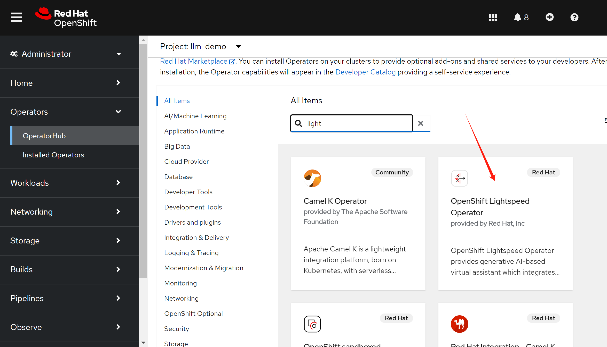
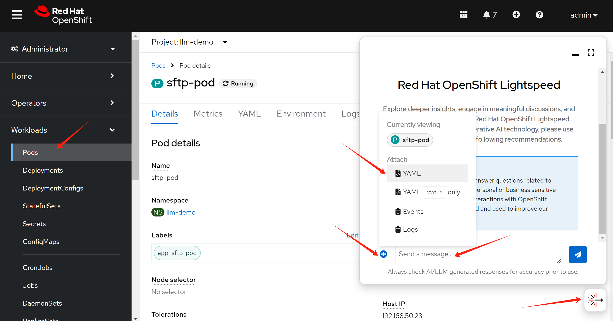

# openshift lightspeed try

offical documenation:
- https://docs.openshift.com/lightspeed/1.0tp1/configure/ols-configuring-openshift-lightspeed.html

install the operator:



apply configuration:

```bash

OPENAI_API_KEY=<your_api_token>
OPENAI_API_URL=https://api.openai.com/v1
OPENAI_MODEL=gpt-3.5-turbo


cat << EOF > $HOME/data/install/olsconfig.yaml
---
apiVersion: v1
kind: Secret
metadata:
  name: credentials
  namespace: openshift-lightspeed
type: Opaque
stringData:
  apitoken: $OPENAI_API_KEY

---
apiVersion: ols.openshift.io/v1alpha1
kind: OLSConfig
metadata:
  name: cluster
spec:
  llm:
    providers:
      - name: myOpenai
        type: openai
        credentialsSecretRef:
          name: credentials
        url: $OPENAI_API_URL
        models:
          - name: $OPENAI_MODEL
  ols:
    defaultModel: $OPENAI_MODEL
    defaultProvider: myOpenai
EOF

oc apply -f $HOME/data/install/olsconfig.yaml -n openshift-lightspeed

```

And you can see the UI plugin:



# end