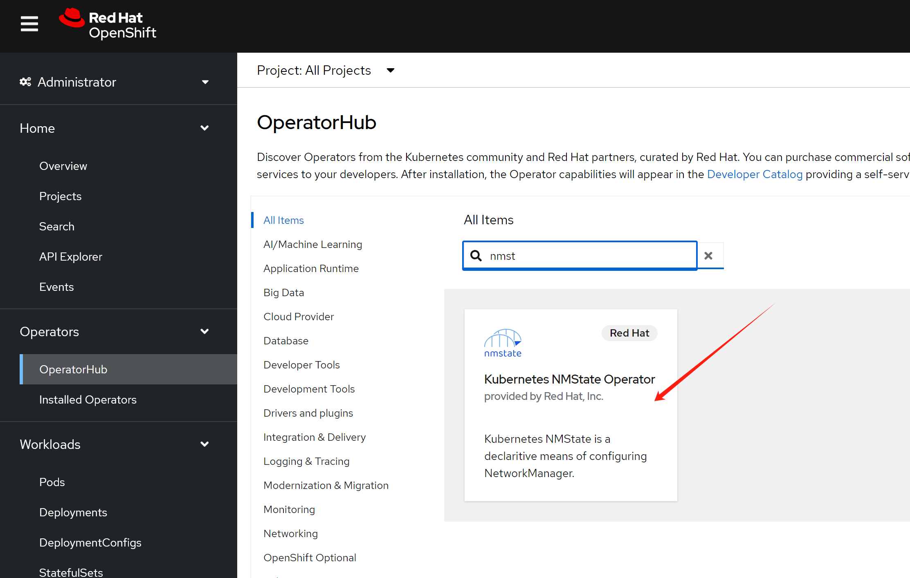
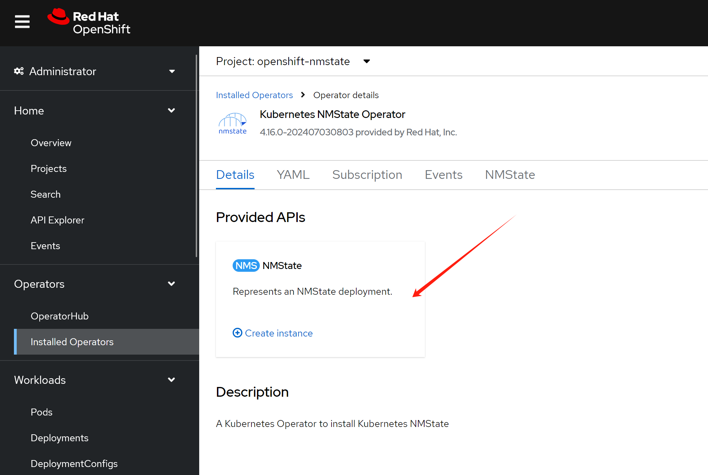

> [!WARNING]
> Work in progress
# using keepalived as a sidecar to maintain VIP for pods

We will use ovn on 2nd network to test the VIP for pods.

# ovn on 2nd network


install NMState operator first



create a deployment with default setting.



```bash

# create the mapping
oc delete -f ${BASE_DIR}/data/install/ovn-mapping.conf

cat << EOF > ${BASE_DIR}/data/install/ovn-mapping.conf
---
apiVersion: nmstate.io/v1
kind: NodeNetworkConfigurationPolicy
metadata:
  name: mapping 
spec:
  nodeSelector:
    node-role.kubernetes.io/worker: '' 
  desiredState:
    ovn:
      bridge-mappings:
      - localnet: localnet-cnv
        bridge: br-ex
        state: present 
EOF

oc apply -f ${BASE_DIR}/data/install/ovn-mapping.conf


var_namespace='demo-playground'

oc new-project $var_namespace


# create the network attachment definition
oc delete -f ${BASE_DIR}/data/install/ovn-k8s-cni-overlay.conf

cat << EOF > ${BASE_DIR}/data/install/ovn-k8s-cni-overlay.conf
apiVersion: k8s.cni.cncf.io/v1
kind: NetworkAttachmentDefinition
metadata:
  name: $var_namespace-localnet-network
  namespace: $var_namespace
spec:
  config: |- 
    {
      "cniVersion": "0.3.1",
      "name": "localnet-cnv",
      "type": "ovn-k8s-cni-overlay",
      "topology":"localnet",
      "_subnets": "192.168.99.0/24",
      "_vlanID": 33,
      "_mtu": 1500,
      "netAttachDefName": "$var_namespace/$var_namespace-localnet-network",
      "_excludeSubnets": "10.100.200.0/29"
    }
EOF

oc apply -f ${BASE_DIR}/data/install/ovn-k8s-cni-overlay.conf


```

# test to pods

```bash


# create demo pods
oc delete -f ${BASE_DIR}/data/install/pod.yaml

var_namespace='demo-playground'
cat << EOF > ${BASE_DIR}/data/install/pod.yaml
---
apiVersion: apps/v1
kind: Deployment
metadata:
  name: tinypod-01
  namespace: $var_namespace
  labels:
    app: tinypod-01
spec:
  replicas: 1
  selector:
    matchLabels:
      app: tinypod-01
  template:
    metadata:
      annotations:
        k8s.v1.cni.cncf.io/networks: '[
          {
            "name": "$var_namespace-localnet-network", 
            "_mac": "02:03:04:05:06:07", 
            "_interface": "myiface1", 
            "ips": [
              "192.168.77.91/24"
              ] 
          }
        ]'
      labels:
        app: tinypod-01
        wzh-run: tinypod-testing
    spec:
      affinity:
        podAntiAffinity:
          preferredDuringSchedulingIgnoredDuringExecution:
          - weight: 100
            podAffinityTerm:
              labelSelector:
                matchExpressions:
                - key: app
                  operator: In
                  values:
                  - tinypod-02
              topologyKey: "kubernetes.io/hostname"
      containers:
      - image: registry.k8s.io/e2e-test-images/agnhost:2.43
        imagePullPolicy: IfNotPresent
        name: agnhost-container
        command: [ "/agnhost", "serve-hostname"]

---
apiVersion: apps/v1
kind: Deployment
metadata:
  name: tinypod-02
  namespace: $var_namespace
  labels:
    app: tinypod-02
spec:
  replicas: 1
  selector:
    matchLabels:
      app: tinypod-02
  template:
    metadata:
      annotations:
        k8s.v1.cni.cncf.io/networks: '[
          {
            "name": "$var_namespace-localnet-network", 
            "_mac": "02:03:04:05:06:07", 
            "_interface": "myiface1", 
            "ips": [
              "192.168.77.92/24"
              ] 
          }
        ]'
      labels:
        app: tinypod-02
        wzh-run: tinypod-testing
    spec:
      affinity:
        podAntiAffinity:
          preferredDuringSchedulingIgnoredDuringExecution:
          - weight: 100
            podAffinityTerm:
              labelSelector:
                matchExpressions:
                - key: app
                  operator: In
                  values:
                  - tinypod-01
              topologyKey: "kubernetes.io/hostname"
      containers:
      - image: registry.k8s.io/e2e-test-images/agnhost:2.43
        imagePullPolicy: IfNotPresent
        name: agnhost-container
        command: [ "/agnhost", "serve-hostname"]

EOF

oc apply -f ${BASE_DIR}/data/install/pod.yaml

# run commands on the pods belongs to both deployments
# Get the list of pod names
pods=$(oc get pods -n $var_namespace -l wzh-run=tinypod-testing -o jsonpath='{.items[*].metadata.name}')

# Loop through each pod and execute the command
for pod in $pods; do
  echo "Pod: $pod"
  oc exec -it $pod -n $var_namespace -- /bin/sh -c "ip a"
  echo
done


```

# keepalived as a sidecar

```bash

# kubectl create deployment hello-node --image=registry.k8s.io/e2e-test-images/agnhost:2.43 -- /agnhost serve-hostname

oc delete -f ${BASE_DIR}/data/install/keepalived-scc.yaml

cat << EOF > ${BASE_DIR}/data/install/keepalived-scc.yaml
apiVersion: security.openshift.io/v1
kind: SecurityContextConstraints
metadata:
  name: keepalived-scc
allowPrivilegedContainer: false
allowedCapabilities:
- NET_ADMIN
- NET_BROADCAST
- NET_RAW
runAsUser:
  type: RunAsAny
seLinuxContext:
  type: RunAsAny
fsGroup:
  type: RunAsAny
supplementalGroups:
  type: RunAsAny
users: []
groups: []
EOF
oc apply -f ${BASE_DIR}/data/install/keepalived-scc.yaml

# create a sa
oc delete -f ${BASE_DIR}/data/install/keepalived-sa.yaml
var_namespace='demo-playground'
cat << EOF > ${BASE_DIR}/data/install/keepalived-sa.yaml
apiVersion: v1
kind: ServiceAccount
metadata:
  name: keepalived-sa
  namespace: $var_namespace
EOF
oc apply -f ${BASE_DIR}/data/install/keepalived-sa.yaml

oc adm policy add-scc-to-user keepalived-scc -z keepalived-sa -n $var_namespace


# create demo pods
oc delete -f ${BASE_DIR}/data/install/pod.yaml

var_namespace='demo-playground'
cat << EOF > ${BASE_DIR}/data/install/pod.yaml
---
apiVersion: apps/v1
kind: Deployment
metadata:
  name: tinypod-01
  namespace: $var_namespace
  labels:
    app: tinypod-01
spec:
  replicas: 1
  selector:
    matchLabels:
      app: tinypod-01
  template:
    metadata:
      annotations:
        k8s.v1.cni.cncf.io/networks: '[
          {
            "name": "$var_namespace-localnet-network", 
            "_mac": "02:03:04:05:06:07", 
            "_interface": "myiface1", 
            "ips": [
              "192.168.77.91/24"
              ] 
          }
        ]'
      labels:
        app: tinypod-01
        wzh-run: tinypod-testing
    spec:
      affinity:
        podAntiAffinity:
          preferredDuringSchedulingIgnoredDuringExecution:
          - weight: 100
            podAffinityTerm:
              labelSelector:
                matchExpressions:
                - key: app
                  operator: In
                  values:
                  - tinypod-02
              topologyKey: "kubernetes.io/hostname"
      serviceAccountName: keepalived-sa
      containers:
      - image: registry.k8s.io/e2e-test-images/agnhost:2.43
        imagePullPolicy: IfNotPresent
        name: agnhost-container
        command: [ "/agnhost", "serve-hostname"]
      - name: keepalived
        image: docker.io/osixia/keepalived:2.0.20
        imagePullPolicy: IfNotPresent
        securityContext:
          # privileged: true
          # runAsUser: 0
          capabilities:
            add: ["NET_ADMIN", "NET_BROADCAST", "NET_RAW"]
        args: 
        - --loglevel
        - debug
        - --copy-service
        # env:
        # - name: KEEPALIVED_INTERFACE
        #   value: net1
        # - name: KEEPALIVED_UNICAST_PEERS
        #   value: "#PYTHON2BASH:['192.168.77.91', '192.168.77.92']" 
        # - name: KEEPALIVED_VIRTUAL_IPS
        #   value: "#PYTHON2BASH:['192.168.77.100']"
        volumeMounts:
        - name: keepalived-config
          mountPath: /container/service/keepalived/assets/keepalived.conf
          subPath: keepalived.conf
        - name: keepalived-scripts
          mountPath: /etc/keepalived/check_ip.sh
          subPath: check_ip.sh
        - name: keepalived-scripts
          mountPath: /etc/keepalived/notify_master.sh
          subPath: notify_master.sh
        - name: keepalived-scripts
          mountPath: /etc/keepalived/notify_backup.sh
          subPath: notify_backup.sh
      volumes:
      - name: keepalived-config
        configMap:
          name: keepalived-config
      - name: keepalived-scripts
        configMap:
          name: keepalived-scripts
---
apiVersion: v1
kind: ConfigMap
metadata:
  name: keepalived-config
  namespace: $var_namespace
data:
  keepalived.conf: |
    global_defs {
        log_level 7
    }
    vrrp_instance VI_1 {
        state MASTER
        interface net1
        virtual_router_id 51
        priority 100
        advert_int 1
        authentication {
            auth_type PASS
            auth_pass 1111
        }
        virtual_ipaddress {
            192.168.77.100/24 dev net1
        }
        track_interface {
            net1
        }
        track_script {
            chk_ip {
                script "/etc/keepalived/check_ip.sh"
                interval 2
            }
        }
        notify_master "/etc/keepalived/notify_master.sh"
        notify_backup "/etc/keepalived/notify_backup.sh"
    }
---
apiVersion: v1
kind: ConfigMap
metadata:
  name: keepalived-config-backup
  namespace: $var_namespace
data:
  keepalived.conf: |
    global_defs {
        log_level 7
    }
    vrrp_instance VI_1 {
        state BACKUP
        interface net1
        virtual_router_id 51
        priority 90
        advert_int 1
        authentication {
            auth_type PASS
            auth_pass 1111
        }
        virtual_ipaddress {
            192.168.77.100/24 dev net1
        }
        track_interface {
            net1
        }
        track_script {
            chk_ip {
                script "/etc/keepalived/check_ip.sh"
                interval 2
            }
        }
        notify_master "/etc/keepalived/notify_master.sh"
        notify_backup "/etc/keepalived/notify_backup.sh"
    }
---
apiVersion: v1
kind: ConfigMap
metadata:
  name: keepalived-scripts
  namespace: $var_namespace
data:
  check_ip.sh: |
    #!/bin/sh
    if ping -c 1 192.168.77.91 > /dev/null 2>&1 || ping -c 1 192.168.77.92 > /dev/null 2>&1; then
      exit 0
    else
      exit 1
    fi
  notify_master.sh: |
    #!/bin/sh
    ip route del default
    ip route add default via 192.168.77.100 dev net1
    # ip rule add from 192.168.77.100/32 table 100
    # ip route add table 100 default via 192.168.77.100
  notify_backup.sh: |
    #!/bin/sh
    ip route del default via 192.168.77.100 dev net1
    default via 10.134.0.1 dev eth0 
    # ip rule del from 192.168.77.100/32 table 100
    # ip route del table 100 default via 192.168.77.100
---
apiVersion: apps/v1
kind: Deployment
metadata:
  name: tinypod-02
  namespace: $var_namespace
  labels:
    app: tinypod-02
spec:
  replicas: 1
  selector:
    matchLabels:
      app: tinypod-02
  template:
    metadata:
      annotations:
        k8s.v1.cni.cncf.io/networks: '[
          {
            "name": "$var_namespace-localnet-network", 
            "_mac": "02:03:04:05:06:07", 
            "_interface": "myiface1", 
            "ips": [
              "192.168.77.92/24"
              ] 
          }
        ]'
      labels:
        app: tinypod-02
        wzh-run: tinypod-testing
    spec:
      serviceAccountName: keepalived-sa
      affinity:
        podAntiAffinity:
          preferredDuringSchedulingIgnoredDuringExecution:
          - weight: 100
            podAffinityTerm:
              labelSelector:
                matchExpressions:
                - key: app
                  operator: In
                  values:
                  - tinypod-01
              topologyKey: "kubernetes.io/hostname"
      containers:
      - image: registry.k8s.io/e2e-test-images/agnhost:2.43
        imagePullPolicy: IfNotPresent
        name: agnhost-container
        command: [ "/agnhost", "serve-hostname"]
      - name: keepalived
        image: docker.io/osixia/keepalived:2.0.20
        imagePullPolicy: IfNotPresent
        securityContext:
          # privileged: true
          # runAsUser: 0
          capabilities:
            add: ["NET_ADMIN", "NET_BROADCAST", "NET_RAW"]
        args: 
        - --loglevel
        - debug
        - --copy-service
        volumeMounts:
        - name: keepalived-config
          mountPath: /container/service/keepalived/assets/keepalived.conf
          subPath: keepalived.conf
        - name: keepalived-scripts
          mountPath: /etc/keepalived/check_ip.sh
          subPath: check_ip.sh
        - name: keepalived-scripts
          mountPath: /etc/keepalived/notify_master.sh
          subPath: notify_master.sh
        - name: keepalived-scripts
          mountPath: /etc/keepalived/notify_backup.sh
          subPath: notify_backup.sh
      volumes:
      - name: keepalived-config
        configMap:
          name: keepalived-config-backup
      - name: keepalived-scripts
        configMap:
          name: keepalived-scripts


EOF

oc apply -f ${BASE_DIR}/data/install/pod.yaml


# run commands on the pods belongs to both deployments
# Get the list of pod names
pods=$(oc get pods -n $var_namespace -l wzh-run=tinypod-testing -o jsonpath='{.items[*].metadata.name}')

# Loop through each pod and execute the command
for pod in $pods; do
  echo "Pod: $pod"
  oc exec -it $pod -n $var_namespace -- /bin/sh -c "ip a"
  echo
done

# Pod: tinypod-01-dcd7659f-j7r8s
# Defaulted container "agnhost-container" out of: agnhost-container, keepalived
# 1: lo: <LOOPBACK,UP,LOWER_UP> mtu 65536 qdisc noqueue state UNKNOWN group default qlen 1000
#     link/loopback 00:00:00:00:00:00 brd 00:00:00:00:00:00
#     inet 127.0.0.1/8 scope host lo
#        valid_lft forever preferred_lft forever
#     inet6 ::1/128 scope host
#        valid_lft forever preferred_lft forever
# 2: eth0@if15: <BROADCAST,MULTICAST,UP,LOWER_UP> mtu 1400 qdisc noqueue state UP group default
#     link/ether 0a:58:0a:86:00:08 brd ff:ff:ff:ff:ff:ff link-netnsid 0
#     inet 10.134.0.8/23 brd 10.134.1.255 scope global eth0
#        valid_lft forever preferred_lft forever
#     inet6 fe80::858:aff:fe86:8/64 scope link
#        valid_lft forever preferred_lft forever
# 3: net1@if16: <BROADCAST,MULTICAST,UP,LOWER_UP> mtu 1400 qdisc noqueue state UP group default
#     link/ether 0a:58:c0:a8:4d:5b brd ff:ff:ff:ff:ff:ff link-netnsid 0
#     inet 192.168.77.91/24 brd 192.168.77.255 scope global net1
#        valid_lft forever preferred_lft forever
#     inet 192.168.77.100/24 scope global secondary net1
#        valid_lft forever preferred_lft forever
#     inet6 fe80::858:c0ff:fea8:4d5b/64 scope link
#        valid_lft forever preferred_lft forever

# Pod: tinypod-02-7c7976945f-m5shb
# Defaulted container "agnhost-container" out of: agnhost-container, keepalived
# 1: lo: <LOOPBACK,UP,LOWER_UP> mtu 65536 qdisc noqueue state UNKNOWN group default qlen 1000
#     link/loopback 00:00:00:00:00:00 brd 00:00:00:00:00:00
#     inet 127.0.0.1/8 scope host lo
#        valid_lft forever preferred_lft forever
#     inet6 ::1/128 scope host
#        valid_lft forever preferred_lft forever
# 2: eth0@if16: <BROADCAST,MULTICAST,UP,LOWER_UP> mtu 1400 qdisc noqueue state UP group default
#     link/ether 0a:58:0a:85:00:09 brd ff:ff:ff:ff:ff:ff link-netnsid 0
#     inet 10.133.0.9/23 brd 10.133.1.255 scope global eth0
#        valid_lft forever preferred_lft forever
#     inet6 fe80::858:aff:fe85:9/64 scope link
#        valid_lft forever preferred_lft forever
# 3: net1@if17: <BROADCAST,MULTICAST,UP,LOWER_UP> mtu 1400 qdisc noqueue state UP group default
#     link/ether 0a:58:c0:a8:4d:5c brd ff:ff:ff:ff:ff:ff link-netnsid 0
#     inet 192.168.77.92/24 brd 192.168.77.255 scope global net1
#        valid_lft forever preferred_lft forever
#     inet6 fe80::858:c0ff:fea8:4d5c/64 scope link
#        valid_lft forever preferred_lft forever


```

# end