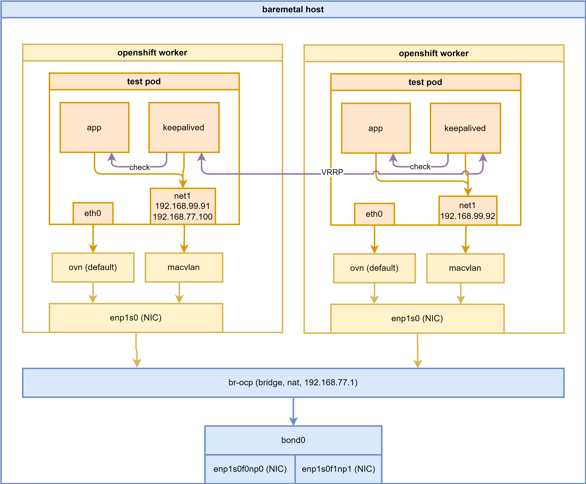

<!-- > [!WARNING]
> Work in progress -->
> [!TIP]
> Ongoing and occasional updates and improvements.
# using keepalived as a sidecar to maintain VIP for pods

The client wants to use Kubernetes (K8S) as a traditional platform. In practice, they plan to expose IP addresses directly from pod. Additionally, there are two Pod running on two hosts that VIP can migrate between each other. However, they have not fully utilized some of the native features offered by Kubernetes and only regard it as a container management tool.

After summarizing, we have clarified the customer's requirements: 
1. it is necessary to support running multiple Pods on the development platform
2. there should be a capability to directly expose IP addresses for external accessing; 
3. it is required to configure a VIP across multiple Pods, and this VIP should be able to migrate between different Pods.

We will use macvlan on 2nd network to demo the VIP for pods. We will also use keepalived as a sidecar to maintain the VIP for the pods.

Here is the architecture diagram of our testing:



# macvlan on 2nd network

First, we need to configure the settings related to macvlan in the cluster of our province. Once this configuration is complete, we will be able to utilize it when deploying Deployment and Pool.

<!-- install NMState operator first


create a deployment with default setting.

 -->

```bash

var_namespace='demo-playground'

# create demo project
oc new-project $var_namespace


# create the macvlan config
# please notice, we have ip address configured.
oc delete -f ${BASE_DIR}/data/install/macvlan.conf

var_namespace='demo-playground'
cat << EOF > ${BASE_DIR}/data/install/macvlan.conf
---
apiVersion: k8s.cni.cncf.io/v1
kind: NetworkAttachmentDefinition
metadata:
  name: $var_namespace-macvlan-01
  namespace: $var_namespace
spec:
  config: |- 
    {
      "cniVersion": "0.3.1",
      "name": "macvlan-net",
      "type": "macvlan",
      "_master": "eth1",
      "linkInContainer": false,
      "mode": "bridge",
      "ipam": {
          "type": "static",
          "addresses": [
            {
              "address": "192.168.99.91/24"
            }
          ]
        }
    }


---
apiVersion: k8s.cni.cncf.io/v1
kind: NetworkAttachmentDefinition
metadata:
  name: $var_namespace-macvlan-02
  namespace: $var_namespace
spec:
  config: |- 
    {
      "cniVersion": "0.3.1",
      "name": "macvlan-net",
      "type": "macvlan",
      "_master": "eth1",
      "linkInContainer": false,
      "mode": "bridge",
      "ipam": {
          "type": "static",
          "addresses": [
            {
              "address": "192.168.99.92/24"
            }
          ]
        }
    }
EOF

oc apply -f ${BASE_DIR}/data/install/macvlan.conf

```

# test to pods

Next, we deploy two Pods in the cluster. Each Pod is assigned an IP address from the macvlan network. We will then run some commands on the Pods to verify the configuration.

```bash

# create demo pods
oc delete -f ${BASE_DIR}/data/install/pod.yaml

var_namespace='demo-playground'
cat << EOF > ${BASE_DIR}/data/install/pod.yaml
---
apiVersion: apps/v1
kind: Deployment
metadata:
  name: tinypod-01
  namespace: $var_namespace
  labels:
    app: tinypod-01
spec:
  replicas: 1
  selector:
    matchLabels:
      app: tinypod-01
  template:
    metadata:
      annotations:
        k8s.v1.cni.cncf.io/networks: '[
          {
            "name": "$var_namespace-macvlan-01", 
            "_mac": "02:03:04:05:06:07", 
            "_interface": "myiface1", 
            "_ips": [
              "192.168.99.91/24"
              ] 
          }
        ]'
      labels:
        app: tinypod-01
        wzh-run: tinypod-testing
    spec:
      affinity:
        podAntiAffinity:
          preferredDuringSchedulingIgnoredDuringExecution:
          - weight: 100
            podAffinityTerm:
              labelSelector:
                matchExpressions:
                - key: app
                  operator: In
                  values:
                  - tinypod-02
              topologyKey: "kubernetes.io/hostname"
      containers:
      - image: registry.k8s.io/e2e-test-images/agnhost:2.43
        imagePullPolicy: IfNotPresent
        name: agnhost-container
        command: [ "/agnhost", "serve-hostname"]

---
apiVersion: apps/v1
kind: Deployment
metadata:
  name: tinypod-02
  namespace: $var_namespace
  labels:
    app: tinypod-02
spec:
  replicas: 1
  selector:
    matchLabels:
      app: tinypod-02
  template:
    metadata:
      annotations:
        k8s.v1.cni.cncf.io/networks: '[
          {
            "name": "$var_namespace-macvlan-02", 
            "_mac": "02:03:04:05:06:07", 
            "_interface": "myiface1", 
            "_ips": [
              "192.168.99.92/24"
              ] 
          }
        ]'
      labels:
        app: tinypod-02
        wzh-run: tinypod-testing
    spec:
      affinity:
        podAntiAffinity:
          preferredDuringSchedulingIgnoredDuringExecution:
          - weight: 100
            podAffinityTerm:
              labelSelector:
                matchExpressions:
                - key: app
                  operator: In
                  values:
                  - tinypod-01
              topologyKey: "kubernetes.io/hostname"
      containers:
      - image: registry.k8s.io/e2e-test-images/agnhost:2.43
        imagePullPolicy: IfNotPresent
        name: agnhost-container
        command: [ "/agnhost", "serve-hostname"]

EOF

oc apply -f ${BASE_DIR}/data/install/pod.yaml

# run commands on the pods belongs to both deployments
# Get the list of pod names
pods=$(oc get pods -n $var_namespace -l wzh-run=tinypod-testing -o jsonpath='{.items[*].metadata.name}')

# Loop through each pod and execute the command
for pod in $pods; do
  echo "Pod: $pod"
  oc exec -it $pod -n $var_namespace -- /bin/sh -c "ip a"
  echo
done

# Pod: tinypod-01-64f74695d5-qzdkr
# 1: lo: <LOOPBACK,UP,LOWER_UP> mtu 65536 qdisc noqueue state UNKNOWN group default qlen 1000
#     link/loopback 00:00:00:00:00:00 brd 00:00:00:00:00:00
#     inet 127.0.0.1/8 scope host lo
#        valid_lft forever preferred_lft forever
#     inet6 ::1/128 scope host
#        valid_lft forever preferred_lft forever
# 2: eth0@if18: <BROADCAST,MULTICAST,UP,LOWER_UP> mtu 1400 qdisc noqueue state UP group default
#     link/ether 0a:58:0a:86:00:0a brd ff:ff:ff:ff:ff:ff link-netnsid 0
#     inet 10.134.0.10/23 brd 10.134.1.255 scope global eth0
#        valid_lft forever preferred_lft forever
#     inet6 fe80::858:aff:fe86:a/64 scope link
#        valid_lft forever preferred_lft forever
# 3: net1@if7: <BROADCAST,MULTICAST,UP,LOWER_UP> mtu 1500 qdisc noqueue state UP group default
#     link/ether 12:8f:74:c6:ef:18 brd ff:ff:ff:ff:ff:ff link-netnsid 0
#     inet 192.168.99.91/24 brd 192.168.99.255 scope global net1
#        valid_lft forever preferred_lft forever
#     inet6 fe80::108f:74ff:fec6:ef18/64 scope link
#        valid_lft forever preferred_lft forever

# Pod: tinypod-02-597bb4db87-wmh74
# 1: lo: <LOOPBACK,UP,LOWER_UP> mtu 65536 qdisc noqueue state UNKNOWN group default qlen 1000
#     link/loopback 00:00:00:00:00:00 brd 00:00:00:00:00:00
#     inet 127.0.0.1/8 scope host lo
#        valid_lft forever preferred_lft forever
#     inet6 ::1/128 scope host
#        valid_lft forever preferred_lft forever
# 2: eth0@if20: <BROADCAST,MULTICAST,UP,LOWER_UP> mtu 1400 qdisc noqueue state UP group default
#     link/ether 0a:58:0a:85:00:0c brd ff:ff:ff:ff:ff:ff link-netnsid 0
#     inet 10.133.0.12/23 brd 10.133.1.255 scope global eth0
#        valid_lft forever preferred_lft forever
#     inet6 fe80::858:aff:fe85:c/64 scope link
#        valid_lft forever preferred_lft forever
# 3: net1@if7: <BROADCAST,MULTICAST,UP,LOWER_UP> mtu 1500 qdisc noqueue state UP group default
#     link/ether c2:4f:09:dc:ea:43 brd ff:ff:ff:ff:ff:ff link-netnsid 0
#     inet 192.168.99.92/24 brd 192.168.99.255 scope global net1
#        valid_lft forever preferred_lft forever
#     inet6 fe80::c04f:9ff:fedc:ea43/64 scope link
#        valid_lft forever preferred_lft forever

```

# keepalived as a sidecar

Next, we will deploy a keepalived container as a sidecar to maintain the VIP for the pods. The keepalived container will be responsible for monitoring the health of the pods and managing the VIP.

```bash

# create scc for keepalived, we need to add NET_ADMIN, NET_BROADCAST, NET_RAW capabilities
oc delete -f ${BASE_DIR}/data/install/keepalived-scc.yaml

cat << EOF > ${BASE_DIR}/data/install/keepalived-scc.yaml
apiVersion: security.openshift.io/v1
kind: SecurityContextConstraints
metadata:
  name: keepalived-scc
allowPrivilegedContainer: false
allowedCapabilities:
- NET_ADMIN
- NET_BROADCAST
- NET_RAW
runAsUser:
  type: RunAsAny
seLinuxContext:
  type: RunAsAny
fsGroup:
  type: RunAsAny
supplementalGroups:
  type: RunAsAny
users: []
groups: []
EOF
oc apply -f ${BASE_DIR}/data/install/keepalived-scc.yaml

# create a sa
oc delete -f ${BASE_DIR}/data/install/keepalived-sa.yaml
var_namespace='demo-playground'
cat << EOF > ${BASE_DIR}/data/install/keepalived-sa.yaml
apiVersion: v1
kind: ServiceAccount
metadata:
  name: keepalived-sa
  namespace: $var_namespace
EOF
oc apply -f ${BASE_DIR}/data/install/keepalived-sa.yaml

# add scc to sa
oc adm policy add-scc-to-user keepalived-scc -z keepalived-sa -n $var_namespace


# create demo pods
# 192.168.77.100 is our VIP
oc delete -f ${BASE_DIR}/data/install/pod.yaml

var_namespace='demo-playground'
cat << EOF > ${BASE_DIR}/data/install/pod.yaml
---
apiVersion: apps/v1
kind: Deployment
metadata:
  name: tinypod-01
  namespace: $var_namespace
  labels:
    app: tinypod-01
spec:
  replicas: 1
  selector:
    matchLabels:
      app: tinypod-01
  template:
    metadata:
      annotations:
        k8s.v1.cni.cncf.io/networks: '[
          {
            "name": "$var_namespace-macvlan-01", 
            "_mac": "02:03:04:05:06:07", 
            "_interface": "myiface1", 
            "_ips": [
              "192.168.99.91/24"
              ] 
          }
        ]'
      labels:
        app: tinypod-01
        wzh-run: tinypod-testing
    spec:
      affinity:
        podAntiAffinity:
          preferredDuringSchedulingIgnoredDuringExecution:
          - weight: 100
            podAffinityTerm:
              labelSelector:
                matchExpressions:
                - key: app
                  operator: In
                  values:
                  - tinypod-02
              topologyKey: "kubernetes.io/hostname"
      serviceAccountName: keepalived-sa
      initContainers:
      - name: init-permissions
        image: docker.io/busybox
        command: ['sh', '-c', 'cp /etc/keepalived/*.sh /tmp/keepalived/ && chmod 755 /tmp/keepalived/*.sh && chown root:root /tmp/keepalived/*.sh']
        volumeMounts:
        - name: keepalived-scripts
          mountPath: /etc/keepalived
        - name: writable-scripts
          mountPath: /tmp/keepalived
      containers:
      - image: registry.k8s.io/e2e-test-images/agnhost:2.43
        imagePullPolicy: IfNotPresent
        name: agnhost-container
        command: [ "/agnhost", "serve-hostname"]
      - name: keepalived
        image: docker.io/osixia/keepalived:2.0.20
        imagePullPolicy: IfNotPresent
        securityContext:
          # privileged: true
          # runAsUser: 0
          capabilities:
            add: ["NET_ADMIN", "NET_BROADCAST", "NET_RAW"]
        args: 
        - --loglevel
        - debug
        - --copy-service
        volumeMounts:
        - name: keepalived-config
          mountPath: /container/service/keepalived/assets/keepalived.conf
          subPath: keepalived.conf
        - name: writable-scripts
          mountPath: /etc/keepalived
      volumes:
      - name: keepalived-config
        configMap:
          name: keepalived-config
      - name: keepalived-scripts
        configMap:
          name: keepalived-scripts
      - name: writable-scripts
        emptyDir: {}
---
apiVersion: v1
kind: ConfigMap
metadata:
  name: keepalived-config
  namespace: $var_namespace
data:
  keepalived.conf: |
    global_defs {
        log_level 7
        script_user root
        # enable_script_security
    }
    vrrp_script chk_ip {
        script "/etc/keepalived/check_ip.sh"
        interval 2
    }
    vrrp_instance VI_1 {
        state MASTER
        interface net1
        virtual_router_id 51
        priority 100
        advert_int 1
        authentication {
            auth_type PASS
            auth_pass 1111
        }
        virtual_ipaddress {
            192.168.77.100/24 dev net1
        }
        track_interface {
            net1
        }
        track_script {
            chk_ip 
        }
        notify_master "/etc/keepalived/notify_master.sh"
        notify_backup "/etc/keepalived/notify_backup.sh"
    }
---
apiVersion: v1
kind: ConfigMap
metadata:
  name: keepalived-config-backup
  namespace: $var_namespace
data:
  keepalived.conf: |
    global_defs {
        log_level 7
        script_user root
        # enable_script_security
    }
    vrrp_script chk_ip {
        script "/etc/keepalived/check_ip.sh"
        interval 2
    }
    vrrp_instance VI_1 {
        state BACKUP
        interface net1
        virtual_router_id 51
        priority 90
        advert_int 1
        authentication {
            auth_type PASS
            auth_pass 1111
        }
        virtual_ipaddress {
            192.168.77.100/24 dev net1
        }
        track_interface {
            net1
        }
        track_script {
            chk_ip
        }
        notify_master "/etc/keepalived/notify_master.sh"
        notify_backup "/etc/keepalived/notify_backup.sh"
    }
---
apiVersion: v1
kind: ConfigMap
metadata:
  name: keepalived-scripts
  namespace: $var_namespace
data:
  check_ip.sh: |
    #!/bin/sh
    if curl --max-time 0.1 -s http://192.168.99.91:9376 > /dev/null 2>&1 || curl --max-time 0.1 -s http://192.168.99.92:9376 > /dev/null 2>&1; then
      exit 0
    else
      exit 1
    fi
  notify_master.sh: |
    #!/bin/sh
    ip route del default
    ip route add default via 192.168.77.100 dev net1
    # ip rule add from 192.168.77.100/32 table 100
    # ip route add table 100 default via 192.168.77.100
  notify_backup.sh: |
    #!/bin/sh
    ip route del default
    GATEWAY=\$(ip r | grep "10.132.0.0/14" | awk '{print \$3}')
    ip route add default via \$GATEWAY dev eth0 
    # ip rule del from 192.168.77.100/32 table 100
    # ip route del table 100 default via 192.168.77.100
---
apiVersion: apps/v1
kind: Deployment
metadata:
  name: tinypod-02
  namespace: $var_namespace
  labels:
    app: tinypod-02
spec:
  replicas: 1
  selector:
    matchLabels:
      app: tinypod-02
  template:
    metadata:
      annotations:
        k8s.v1.cni.cncf.io/networks: '[
          {
            "name": "$var_namespace-macvlan-02", 
            "_mac": "02:03:04:05:06:07", 
            "_interface": "myiface1", 
            "_ips": [
              "192.168.99.92/24"
              ] 
          }
        ]'
      labels:
        app: tinypod-02
        wzh-run: tinypod-testing
    spec:
      affinity:
        podAntiAffinity:
          preferredDuringSchedulingIgnoredDuringExecution:
          - weight: 100
            podAffinityTerm:
              labelSelector:
                matchExpressions:
                - key: app
                  operator: In
                  values:
                  - tinypod-01
              topologyKey: "kubernetes.io/hostname"
      serviceAccountName: keepalived-sa
      initContainers:
      - name: init-permissions
        image: docker.io/busybox
        command: ['sh', '-c', 'cp /etc/keepalived/*.sh /tmp/keepalived/ && chmod 755 /tmp/keepalived/*.sh && chown root:root /tmp/keepalived/*.sh']
        volumeMounts:
        - name: keepalived-scripts
          mountPath: /etc/keepalived
        - name: writable-scripts
          mountPath: /tmp/keepalived
      containers:
      - image: registry.k8s.io/e2e-test-images/agnhost:2.43
        imagePullPolicy: IfNotPresent
        name: agnhost-container
        command: [ "/agnhost", "serve-hostname"]
      - name: keepalived
        image: docker.io/osixia/keepalived:2.0.20
        imagePullPolicy: IfNotPresent
        securityContext:
          # privileged: true
          # runAsUser: 0
          capabilities:
            add: ["NET_ADMIN", "NET_BROADCAST", "NET_RAW"]
        args: 
        - --loglevel
        - debug
        - --copy-service
        volumeMounts:
        - name: keepalived-config
          mountPath: /container/service/keepalived/assets/keepalived.conf
          subPath: keepalived.conf
        - name: writable-scripts
          mountPath: /etc/keepalived
      volumes:
      - name: keepalived-config
        configMap:
          name: keepalived-config-backup
      - name: keepalived-scripts
        configMap:
          name: keepalived-scripts
      - name: writable-scripts
        emptyDir: {}

EOF

oc apply -f ${BASE_DIR}/data/install/pod.yaml


# run commands on the pods belongs to both deployments
# Get the list of pod names
pods=$(oc get pods -n $var_namespace -l wzh-run=tinypod-testing -o jsonpath='{.items[*].metadata.name}')

# Loop through each pod and execute the command
# we try to check the ip address and route table
for pod in $pods; do
  echo "Pod: $pod"
  oc exec -it $pod -n $var_namespace -- /bin/sh -c "ip a"
  echo
done

# Pod: tinypod-01-7899f4c557-wnvd2
# Defaulted container "agnhost-container" out of: agnhost-container, keepalived
# 1: lo: <LOOPBACK,UP,LOWER_UP> mtu 65536 qdisc noqueue state UNKNOWN group default qlen 1000
#     link/loopback 00:00:00:00:00:00 brd 00:00:00:00:00:00
#     inet 127.0.0.1/8 scope host lo
#        valid_lft forever preferred_lft forever
#     inet6 ::1/128 scope host
#        valid_lft forever preferred_lft forever
# 2: eth0@if19: <BROADCAST,MULTICAST,UP,LOWER_UP> mtu 1400 qdisc noqueue state UP group default
#     link/ether 0a:58:0a:86:00:0b brd ff:ff:ff:ff:ff:ff link-netnsid 0
#     inet 10.134.0.11/23 brd 10.134.1.255 scope global eth0
#        valid_lft forever preferred_lft forever
#     inet6 fe80::858:aff:fe86:b/64 scope link
#        valid_lft forever preferred_lft forever
# 3: net1@if7: <BROADCAST,MULTICAST,UP,LOWER_UP> mtu 1500 qdisc noqueue state UP group default
#     link/ether 72:24:2e:8b:df:a5 brd ff:ff:ff:ff:ff:ff link-netnsid 0
#     inet 192.168.99.91/24 brd 192.168.99.255 scope global net1
#        valid_lft forever preferred_lft forever
#     inet 192.168.77.100/24 scope global net1
#        valid_lft forever preferred_lft forever
#     inet6 fe80::7024:2eff:fe8b:dfa5/64 scope link
#        valid_lft forever preferred_lft forever

# Pod: tinypod-02-65b5989698-q5t5p
# Defaulted container "agnhost-container" out of: agnhost-container, keepalived
# 1: lo: <LOOPBACK,UP,LOWER_UP> mtu 65536 qdisc noqueue state UNKNOWN group default qlen 1000
#     link/loopback 00:00:00:00:00:00 brd 00:00:00:00:00:00
#     inet 127.0.0.1/8 scope host lo
#        valid_lft forever preferred_lft forever
#     inet6 ::1/128 scope host
#        valid_lft forever preferred_lft forever
# 2: eth0@if22: <BROADCAST,MULTICAST,UP,LOWER_UP> mtu 1400 qdisc noqueue state UP group default
#     link/ether 0a:58:0a:85:00:0e brd ff:ff:ff:ff:ff:ff link-netnsid 0
#     inet 10.133.0.14/23 brd 10.133.1.255 scope global eth0
#        valid_lft forever preferred_lft forever
#     inet6 fe80::858:aff:fe85:e/64 scope link
#        valid_lft forever preferred_lft forever
# 3: net1@if7: <BROADCAST,MULTICAST,UP,LOWER_UP> mtu 1500 qdisc noqueue state UP group default
#     link/ether 62:ec:10:28:3a:c9 brd ff:ff:ff:ff:ff:ff link-netnsid 0
#     inet 192.168.99.92/24 brd 192.168.99.255 scope global net1
#        valid_lft forever preferred_lft forever
#     inet6 fe80::60ec:10ff:fe28:3ac9/64 scope link
#        valid_lft forever preferred_lft forever


# Get the list of pod names
pods=$(oc get pods -n $var_namespace -l wzh-run=tinypod-testing -o jsonpath='{.items[*].metadata.name}')

# Loop through each pod and execute the command
# here is the route table
for pod in $pods; do
  echo "Pod: $pod"
  oc exec -it $pod -n $var_namespace -- /bin/sh -c "ip r"
  echo
done

# Pod: tinypod-01-6fc4fb867-r68qb
# Defaulted container "agnhost-container" out of: agnhost-container, keepalived, init-permissions (init)
# default via 192.168.77.100 dev net1
# 10.132.0.0/14 via 10.134.0.1 dev eth0
# 10.134.0.0/23 dev eth0 proto kernel scope link src 10.134.0.17
# 100.64.0.0/16 via 10.134.0.1 dev eth0
# 172.22.0.0/16 via 10.134.0.1 dev eth0
# 192.168.77.0/24 dev net1 proto kernel scope link src 192.168.77.100
# 192.168.99.0/24 dev net1 proto kernel scope link src 192.168.99.91

# Pod: tinypod-02-c788654d4-xgkrc
# Defaulted container "agnhost-container" out of: agnhost-container, keepalived, init-permissions (init)
# default via 10.133.0.1 dev eth0
# 10.132.0.0/14 via 10.133.0.1 dev eth0
# 10.133.0.0/23 dev eth0 proto kernel scope link src 10.133.0.22
# 100.64.0.0/16 via 10.133.0.1 dev eth0
# 172.22.0.0/16 via 10.133.0.1 dev eth0
# 192.168.99.0/24 dev net1 proto kernel scope link src 192.168.99.92


# curl http://192.168.77.100:9376
# curl http://192.168.99.91:9376
# curl http://192.168.99.92:9376

# we check the service from the VIP, it gives timestamp, and the pod name which is serving the request.

while true; do
  TIMESTAMP=$(date +"%Y-%m-%d %H:%M:%S")
  RESPONSE=$(curl --max-time 0.05 -s -w "%{http_code}" http://192.168.77.100:9376)
  HTTP_CODE="${RESPONSE: -3}"
  CONTENT="${RESPONSE:0:-3}"

  if [ "$HTTP_CODE" -eq 200 ]; then
      echo "$TIMESTAMP - $CONTENT"
  else
      echo "$TIMESTAMP - call failed"
  fi

  sleep 1
done

# after node is cut off power, VIP take 3 seconds to failover to pod-02

# 2024-09-05 23:10:49 - tinypod-01-6fc4fb867-tcmgx
# 2024-09-05 23:10:50 - tinypod-01-6fc4fb867-tcmgx
# 2024-09-05 23:10:51 - tinypod-01-6fc4fb867-tcmgx
# 2024-09-05 23:10:52 - tinypod-01-6fc4fb867-tcmgx
# 2024-09-05 23:10:53 - call failed
# 2024-09-05 23:10:54 - call failed
# 2024-09-05 23:10:55 - call failed
# 2024-09-05 23:10:56 - tinypod-02-c788654d4-hlsw5
# 2024-09-05 23:10:57 - tinypod-02-c788654d4-hlsw5
# 2024-09-05 23:10:58 - tinypod-02-c788654d4-hlsw5
# 2024-09-05 23:10:59 - tinypod-02-c788654d4-hlsw5
# 2024-09-05 23:11:00 - tinypod-02-c788654d4-hlsw5
# 2024-09-05 23:11:01 - tinypod-02-c788654d4-hlsw5


# after node power on, VIP fill fall back to pod-01

# 2024-09-05 23:12:30 - tinypod-02-c788654d4-hlsw5
# 2024-09-05 23:12:31 - tinypod-02-c788654d4-hlsw5
# 2024-09-05 23:12:32 - tinypod-02-c788654d4-hlsw5
# 2024-09-05 23:12:33 - tinypod-02-c788654d4-hlsw5
# 2024-09-05 23:12:34 - tinypod-02-c788654d4-hlsw5
# 2024-09-05 23:12:35 - tinypod-01-6fc4fb867-tcmgx
# 2024-09-05 23:12:36 - tinypod-01-6fc4fb867-tcmgx
# 2024-09-05 23:12:37 - tinypod-01-6fc4fb867-tcmgx
# 2024-09-05 23:12:38 - tinypod-01-6fc4fb867-tcmgx
# 2024-09-05 23:12:39 - tinypod-01-6fc4fb867-tcmgx
# 2024-09-05 23:12:40 - tinypod-01-6fc4fb867-tcmgx
# 2024-09-05 23:12:41 - tinypod-01-6fc4fb867-tcmgx
# 2024-09-05 23:12:42 - tinypod-01-6fc4fb867-tcmgx
# 2024-09-05 23:12:43 - tinypod-01-6fc4fb867-tcmgx
# 2024-09-05 23:12:44 - tinypod-01-6fc4fb867-tcmgx

# after node normal power off, VIP take 1 second to failover to pod-02

# 2024-09-05 23:14:45 - tinypod-01-6fc4fb867-tcmgx
# 2024-09-05 23:14:46 - tinypod-01-6fc4fb867-tcmgx
# 2024-09-05 23:14:47 - tinypod-01-6fc4fb867-tcmgx
# 2024-09-05 23:14:48 - tinypod-01-6fc4fb867-tcmgx
# 2024-09-05 23:14:49 - tinypod-01-6fc4fb867-tcmgx
# 2024-09-05 23:14:50 - tinypod-01-6fc4fb867-tcmgx
# 2024-09-05 23:14:51 - tinypod-01-6fc4fb867-tcmgx
# 2024-09-05 23:14:52 - tinypod-01-6fc4fb867-tcmgx
# 2024-09-05 23:14:53 - call failed
# 2024-09-05 23:14:54 - tinypod-02-c788654d4-hlsw5
# 2024-09-05 23:14:55 - tinypod-02-c788654d4-hlsw5
# 2024-09-05 23:14:56 - tinypod-02-c788654d4-hlsw5
# 2024-09-05 23:14:57 - tinypod-02-c788654d4-hlsw5
# 2024-09-05 23:14:58 - tinypod-02-c788654d4-hlsw5
# 2024-09-05 23:14:59 - tinypod-02-c788654d4-hlsw5
# 2024-09-05 23:15:00 - tinypod-02-c788654d4-hlsw5
# 2024-09-05 23:15:01 - tinypod-02-c788654d4-hlsw5
# 2024-09-05 23:15:02 - tinypod-02-c788654d4-hlsw5
# 2024-09-05 23:15:03 - tinypod-02-c788654d4-hlsw5
# 2024-09-05 23:15:04 - tinypod-02-c788654d4-hlsw5
# 2024-09-05 23:15:05 - tinypod-02-c788654d4-hlsw5

# after node normal power on, VIP fill fall back to pod-01

# 2024-09-05 23:17:28 - tinypod-02-c788654d4-hlsw5
# 2024-09-05 23:17:29 - tinypod-02-c788654d4-hlsw5
# 2024-09-05 23:17:30 - tinypod-02-c788654d4-hlsw5
# 2024-09-05 23:17:31 - tinypod-02-c788654d4-hlsw5
# 2024-09-05 23:17:32 - tinypod-02-c788654d4-hlsw5
# 2024-09-05 23:17:33 - tinypod-01-6fc4fb867-ml4rh
# 2024-09-05 23:17:34 - tinypod-01-6fc4fb867-ml4rh
# 2024-09-05 23:17:35 - tinypod-01-6fc4fb867-ml4rh
# 2024-09-05 23:17:36 - tinypod-01-6fc4fb867-ml4rh
# 2024-09-05 23:17:37 - tinypod-01-6fc4fb867-ml4rh
# 2024-09-05 23:17:38 - tinypod-01-6fc4fb867-ml4rh
# 2024-09-05 23:17:39 - tinypod-01-6fc4fb867-ml4rh

oc get pod -o wide
# NAME                         READY   STATUS        RESTARTS   AGE   IP            NODE             NOMINATED NODE   READINESS GATES
# tinypod-01-6fc4fb867-ml4rh   2/2     Running       0          97s   10.132.0.98   master-01-demo   <none>           <none>
# tinypod-01-6fc4fb867-tcmgx   2/2     Terminating   2          14m   10.134.0.8    worker-02-demo   <none>           <none>
# tinypod-02-c788654d4-hlsw5   2/2     Running       0          14m   10.133.0.24   worker-01-demo   <none>           <none>


```

## try on the same worker node

Does this works for the same worker node? Let's try it. 

And the result is yes.

```bash

# create demo pods
# 192.168.77.100 is our VIP
oc delete -f ${BASE_DIR}/data/install/pod.yaml

var_namespace='demo-playground'
cat << EOF > ${BASE_DIR}/data/install/pod.yaml
---
apiVersion: apps/v1
kind: Deployment
metadata:
  name: tinypod-01
  namespace: $var_namespace
  labels:
    app: tinypod-01
spec:
  replicas: 1
  selector:
    matchLabels:
      app: tinypod-01
  template:
    metadata:
      annotations:
        k8s.v1.cni.cncf.io/networks: '[
          {
            "name": "$var_namespace-macvlan-01", 
            "_mac": "02:03:04:05:06:07", 
            "_interface": "myiface1", 
            "_ips": [
              "192.168.99.91/24"
              ] 
          }
        ]'
      labels:
        app: tinypod-01
        wzh-run: tinypod-testing
    spec:
      affinity:
        nodeAffinity:
          requiredDuringSchedulingIgnoredDuringExecution:
            nodeSelectorTerms:
            - matchExpressions:
              - key: kubernetes.io/hostname
                operator: In
                values:
                - worker-02-demo 
      serviceAccountName: keepalived-sa
      initContainers:
      - name: init-permissions
        image: docker.io/busybox
        command: ['sh', '-c', 'cp /etc/keepalived/*.sh /tmp/keepalived/ && chmod 755 /tmp/keepalived/*.sh && chown root:root /tmp/keepalived/*.sh']
        volumeMounts:
        - name: keepalived-scripts
          mountPath: /etc/keepalived
        - name: writable-scripts
          mountPath: /tmp/keepalived
      containers:
      - image: registry.k8s.io/e2e-test-images/agnhost:2.43
        imagePullPolicy: IfNotPresent
        name: agnhost-container
        command: [ "/agnhost", "serve-hostname"]
      - name: keepalived
        image: docker.io/osixia/keepalived:2.0.20
        imagePullPolicy: IfNotPresent
        securityContext:
          # privileged: true
          # runAsUser: 0
          capabilities:
            add: ["NET_ADMIN", "NET_BROADCAST", "NET_RAW"]
        args: 
        - --loglevel
        - debug
        - --copy-service
        volumeMounts:
        - name: keepalived-config
          mountPath: /container/service/keepalived/assets/keepalived.conf
          subPath: keepalived.conf
        - name: writable-scripts
          mountPath: /etc/keepalived
      volumes:
      - name: keepalived-config
        configMap:
          name: keepalived-config
      - name: keepalived-scripts
        configMap:
          name: keepalived-scripts
      - name: writable-scripts
        emptyDir: {}
---
apiVersion: v1
kind: ConfigMap
metadata:
  name: keepalived-config
  namespace: $var_namespace
data:
  keepalived.conf: |
    global_defs {
        log_level 7
        script_user root
        # enable_script_security
    }
    vrrp_script chk_ip {
        script "/etc/keepalived/check_ip.sh"
        interval 2
    }
    vrrp_instance VI_1 {
        state MASTER
        interface net1
        virtual_router_id 51
        priority 100
        advert_int 1
        authentication {
            auth_type PASS
            auth_pass 1111
        }
        virtual_ipaddress {
            192.168.77.100/24 dev net1
        }
        track_interface {
            net1
        }
        track_script {
            chk_ip 
        }
        notify_master "/etc/keepalived/notify_master.sh"
        notify_backup "/etc/keepalived/notify_backup.sh"
    }
---
apiVersion: v1
kind: ConfigMap
metadata:
  name: keepalived-config-backup
  namespace: $var_namespace
data:
  keepalived.conf: |
    global_defs {
        log_level 7
        script_user root
        # enable_script_security
    }
    vrrp_script chk_ip {
        script "/etc/keepalived/check_ip.sh"
        interval 2
    }
    vrrp_instance VI_1 {
        state BACKUP
        interface net1
        virtual_router_id 51
        priority 90
        advert_int 1
        authentication {
            auth_type PASS
            auth_pass 1111
        }
        virtual_ipaddress {
            192.168.77.100/24 dev net1
        }
        track_interface {
            net1
        }
        track_script {
            chk_ip
        }
        notify_master "/etc/keepalived/notify_master.sh"
        notify_backup "/etc/keepalived/notify_backup.sh"
    }
---
apiVersion: v1
kind: ConfigMap
metadata:
  name: keepalived-scripts
  namespace: $var_namespace
data:
  check_ip.sh: |
    #!/bin/sh
    if curl --max-time 0.1 -s http://192.168.99.91:9376 > /dev/null 2>&1 || curl --max-time 0.1 -s http://192.168.99.92:9376 > /dev/null 2>&1; then
      exit 0
    else
      exit 1
    fi
  notify_master.sh: |
    #!/bin/sh
    ip route del default
    ip route add default via 192.168.77.100 dev net1
    # ip rule add from 192.168.77.100/32 table 100
    # ip route add table 100 default via 192.168.77.100
  notify_backup.sh: |
    #!/bin/sh
    ip route del default
    GATEWAY=\$(ip r | grep "10.132.0.0/14" | awk '{print \$3}')
    ip route add default via \$GATEWAY dev eth0 
    # ip rule del from 192.168.77.100/32 table 100
    # ip route del table 100 default via 192.168.77.100
---
apiVersion: apps/v1
kind: Deployment
metadata:
  name: tinypod-02
  namespace: $var_namespace
  labels:
    app: tinypod-02
spec:
  replicas: 1
  selector:
    matchLabels:
      app: tinypod-02
  template:
    metadata:
      annotations:
        k8s.v1.cni.cncf.io/networks: '[
          {
            "name": "$var_namespace-macvlan-02", 
            "_mac": "02:03:04:05:06:07", 
            "_interface": "myiface1", 
            "_ips": [
              "192.168.99.92/24"
              ] 
          }
        ]'
      labels:
        app: tinypod-02
        wzh-run: tinypod-testing
    spec:
      affinity:
        nodeAffinity:
          requiredDuringSchedulingIgnoredDuringExecution:
            nodeSelectorTerms:
            - matchExpressions:
              - key: kubernetes.io/hostname
                operator: In
                values:
                - worker-02-demo 
      serviceAccountName: keepalived-sa
      initContainers:
      - name: init-permissions
        image: docker.io/busybox
        command: ['sh', '-c', 'cp /etc/keepalived/*.sh /tmp/keepalived/ && chmod 755 /tmp/keepalived/*.sh && chown root:root /tmp/keepalived/*.sh']
        volumeMounts:
        - name: keepalived-scripts
          mountPath: /etc/keepalived
        - name: writable-scripts
          mountPath: /tmp/keepalived
      containers:
      - image: registry.k8s.io/e2e-test-images/agnhost:2.43
        imagePullPolicy: IfNotPresent
        name: agnhost-container
        command: [ "/agnhost", "serve-hostname"]
      - name: keepalived
        image: docker.io/osixia/keepalived:2.0.20
        imagePullPolicy: IfNotPresent
        securityContext:
          # privileged: true
          # runAsUser: 0
          capabilities:
            add: ["NET_ADMIN", "NET_BROADCAST", "NET_RAW"]
        args: 
        - --loglevel
        - debug
        - --copy-service
        volumeMounts:
        - name: keepalived-config
          mountPath: /container/service/keepalived/assets/keepalived.conf
          subPath: keepalived.conf
        - name: writable-scripts
          mountPath: /etc/keepalived
      volumes:
      - name: keepalived-config
        configMap:
          name: keepalived-config-backup
      - name: keepalived-scripts
        configMap:
          name: keepalived-scripts
      - name: writable-scripts
        emptyDir: {}

EOF

oc apply -f ${BASE_DIR}/data/install/pod.yaml


# Get the list of pod names
pods=$(oc get pods -n $var_namespace -l wzh-run=tinypod-testing -o jsonpath='{.items[*].metadata.name}')

# Loop through each pod and execute the command
# here is the route table
for pod in $pods; do
  echo "Pod: $pod"
  oc exec -it $pod -n $var_namespace -- /bin/sh -c "ip r"
  echo
done

# Pod: tinypod-01-7466759876-dzmml
# Defaulted container "agnhost-container" out of: agnhost-container, keepalived, init-permissions (init)
# default via 192.168.77.100 dev net1
# 10.132.0.0/14 via 10.134.0.1 dev eth0
# 10.134.0.0/23 dev eth0 proto kernel scope link src 10.134.0.7
# 100.64.0.0/16 via 10.134.0.1 dev eth0
# 172.22.0.0/16 via 10.134.0.1 dev eth0
# 192.168.77.0/24 dev net1 proto kernel scope link src 192.168.77.100
# 192.168.99.0/24 dev net1 proto kernel scope link src 192.168.99.91

# Pod: tinypod-02-687956b6fd-cx2dd
# Defaulted container "agnhost-container" out of: agnhost-container, keepalived, init-permissions (init)
# default via 10.134.0.1 dev eth0
# 10.132.0.0/14 via 10.134.0.1 dev eth0
# 10.134.0.0/23 dev eth0 proto kernel scope link src 10.134.0.8
# 100.64.0.0/16 via 10.134.0.1 dev eth0
# 172.22.0.0/16 via 10.134.0.1 dev eth0
# 192.168.99.0/24 dev net1 proto kernel scope link src 192.168.99.92


while true; do
  TIMESTAMP=$(date +"%Y-%m-%d %H:%M:%S")
  RESPONSE=$(curl --max-time 0.05 -s -w "%{http_code}" http://192.168.77.100:9376)
  HTTP_CODE="${RESPONSE: -3}"
  CONTENT="${RESPONSE:0:-3}"

  if [ "$HTTP_CODE" -eq 200 ]; then
      echo "$TIMESTAMP - $CONTENT"
  else
      echo "$TIMESTAMP - call failed"
  fi

  sleep 1
done

# 2024-09-06 03:10:42 - tinypod-01-7466759876-dzmml
# 2024-09-06 03:10:43 - tinypod-01-7466759876-dzmml
# 2024-09-06 03:10:44 - tinypod-01-7466759876-dzmml
# 2024-09-06 03:10:45 - tinypod-01-7466759876-dzmml
# 2024-09-06 03:10:46 - tinypod-01-7466759876-dzmml
# 2024-09-06 03:10:47 - tinypod-01-7466759876-dzmml
# 2024-09-06 03:10:48 - tinypod-01-7466759876-dzmml
# 2024-09-06 03:10:49 - tinypod-01-7466759876-dzmml
# 2024-09-06 03:10:50 - tinypod-01-7466759876-dzmml
# 2024-09-06 03:10:51 - tinypod-01-7466759876-dzmml
# 2024-09-06 03:10:52 - tinypod-01-7466759876-dzmml
# 2024-09-06 03:10:53 - tinypod-01-7466759876-dzmml
# 2024-09-06 03:10:54 - tinypod-01-7466759876-dzmml
# 2024-09-06 03:10:55 - tinypod-01-7466759876-dzmml
# 2024-09-06 03:10:56 - tinypod-01-7466759876-dzmml
# 2024-09-06 03:10:57 - tinypod-01-7466759876-dzmml
# 2024-09-06 03:10:58 - tinypod-01-7466759876-dzmml
# 2024-09-06 03:10:59 - tinypod-01-7466759876-dzmml


```

# end