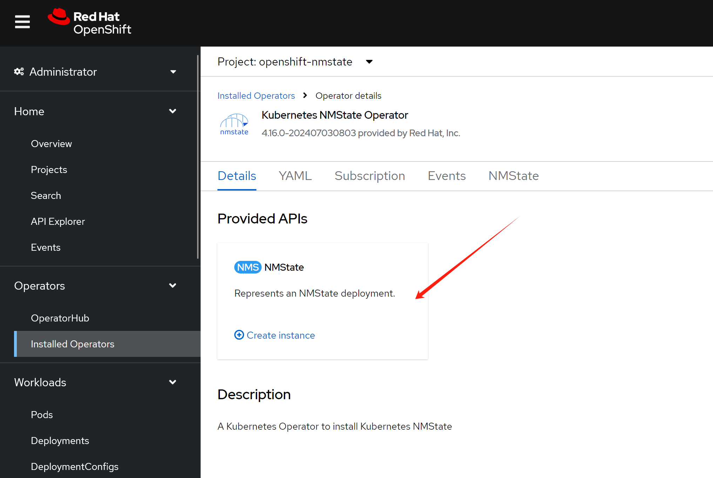

> [!WARNING]
> Work in progress
# using keepalived as a sidecar to maintain VIP for pods

We will use ovn on 2nd network to test the VIP for pods.

# ovn on 2nd network


install NMState operator first


create a deployment with default setting.



```bash

# create the mapping
oc delete -f ${BASE_DIR}/data/install/ovn-mapping.conf

cat << EOF > ${BASE_DIR}/data/install/ovn-mapping.conf
---
apiVersion: nmstate.io/v1
kind: NodeNetworkConfigurationPolicy
metadata:
  name: mapping 
spec:
  nodeSelector:
    node-role.kubernetes.io/worker: '' 
  desiredState:
    ovn:
      bridge-mappings:
      - localnet: localnet-cnv
        bridge: br-ex
        state: present 
EOF

oc apply -f ${BASE_DIR}/data/install/ovn-mapping.conf


var_namespace='demo-playground'

oc new-project $var_namespace


# create the network attachment definition
oc delete -f ${BASE_DIR}/data/install/ovn-k8s-cni-overlay.conf

cat << EOF > ${BASE_DIR}/data/install/ovn-k8s-cni-overlay.conf
apiVersion: k8s.cni.cncf.io/v1
kind: NetworkAttachmentDefinition
metadata:
  name: $var_namespace-localnet-network
  namespace: $var_namespace
spec:
  config: |- 
    {
      "cniVersion": "0.3.1",
      "name": "localnet-cnv",
      "type": "ovn-k8s-cni-overlay",
      "topology":"localnet",
      "_subnets": "192.168.99.0/24",
      "_vlanID": 33,
      "_mtu": 1500,
      "netAttachDefName": "$var_namespace/$var_namespace-localnet-network",
      "_excludeSubnets": "10.100.200.0/29"
    }
EOF

oc apply -f ${BASE_DIR}/data/install/ovn-k8s-cni-overlay.conf


```

# keepalived as a sidecar

```bash

# kubectl create deployment hello-node --image=registry.k8s.io/e2e-test-images/agnhost:2.43 -- /agnhost serve-hostname


# create demo pods
oc delete -f ${BASE_DIR}/data/install/pod.yaml

var_namespace='demo-playground'
cat << EOF > ${BASE_DIR}/data/install/pod.yaml
---
apiVersion: apps/v1
kind: Deployment
metadata:
  name: tinypod-01
  namespace: $var_namespace
  labels:
    app: tinypod-01
spec:
  replicas: 1
  selector:
    matchLabels:
      app: tinypod-01
  template:
    metadata:
      annotations:
        k8s.v1.cni.cncf.io/networks: '[
          {
            "name": "$var_namespace-localnet-network", 
            "_mac": "02:03:04:05:06:07", 
            "_interface": "myiface1", 
            "ips": [
              "192.168.77.91/24"
              ] 
          }
        ]'
      labels:
        app: tinypod-01
    spec:
      containers:
      - image: registry.k8s.io/e2e-test-images/agnhost:2.43
        imagePullPolicy: IfNotPresent
        name: agnhost-container
        command: [ "/agnhost", "serve-hostname-wzh"]
      - name: keepalived
        image: docker.io/osixia/keepalived:2.0.20
        imagePullPolicy: IfNotPresent
        volumeMounts:
        - name: keepalived-config
          mountPath: /etc/keepalived/keepalived.conf
          subPath: keepalived.conf
        lifecycle:
          postStart:
            exec:
              command: ["/bin/sh", "-c", "ip route add default via 192.168.77.100 dev net0; ip rule add from 192.168.77.100/32 table 100; ip route add table 100 default via 192.168.77.100"]
      volumes:
      - name: keepalived-config
        configMap:
          name: keepalived-config
---
apiVersion: v1
kind: ConfigMap
metadata:
  name: keepalived-config
  namespace: $var_namespace
data:
  keepalived.conf: |
    vrrp_instance VI_1 {
        state MASTER
        interface net0
        virtual_router_id 51
        priority 100
        advert_int 1
        authentication {
            auth_type PASS
            auth_pass 1111
        }
        virtual_ipaddress {
            192.168.77.100/24 dev net0
        }
        track_interface {
            net0
        }
        track_script {
            chk_ip {
                script "/etc/keepalived/check_ip.sh"
                interval 2
            }
        }
    }
---
apiVersion: v1
kind: ConfigMap
metadata:
  name: keepalived-scripts
  namespace: $var_namespace
data:
  check_ip.sh: |
    #!/bin/sh
    if ping -c 1 192.168.77.91 > /dev/null 2>&1 || ping -c 1 192.168.77.92 > /dev/null 2>&1; then
      exit 0
    else
      exit 1
    fi

---
apiVersion: apps/v1
kind: Deployment
metadata:
  name: tinypod-02
  namespace: $var_namespace
  labels:
    app: tinypod-02
spec:
  replicas: 1
  selector:
    matchLabels:
      app: tinypod-02
  template:
    metadata:
      annotations:
        k8s.v1.cni.cncf.io/networks: '[
          {
            "name": "$var_namespace-localnet-network", 
            "_mac": "02:03:04:05:06:07", 
            "_interface": "myiface1", 
            "ips": [
              "192.168.77.92/24"
              ] 
          }
        ]'
      labels:
        app: tinypod-02
    spec:
      containers:
      - image: registry.k8s.io/e2e-test-images/agnhost:2.43
        imagePullPolicy: IfNotPresent
        name: agnhost-container
        command: [ "/agnhost", "serve-hostname-wzh"]
      - name: keepalived
        image: docker.io/osixia/keepalived:2.0.20
        imagePullPolicy: IfNotPresent
        volumeMounts:
        - name: keepalived-config-backup
          mountPath: /etc/keepalived/keepalived.conf
          subPath: keepalived.conf
        lifecycle:
          postStart:
            exec:
              command: ["/bin/sh", "-c", "ip route add default via 192.168.77.100 dev net0; ip rule add from 192.168.77.100/32 table 100; ip route add table 100 default via 192.168.77.100"]
      volumes:
      - name: keepalived-config
        configMap:
          name: keepalived-config
---
apiVersion: v1
kind: ConfigMap
metadata:
  name: keepalived-config-backup
  namespace: $var_namespace
data:
  keepalived.conf: |
    vrrp_instance VI_1 {
        state MASTER
        interface net0
        virtual_router_id 51
        # lower as backup
        priority 90
        advert_int 1
        authentication {
            auth_type PASS
            auth_pass 1111
        }
        virtual_ipaddress {
            192.168.77.100/24 dev net0
        }
        track_interface {
            net0
        }
        track_script {
            chk_ip {
                script "/etc/keepalived/check_ip.sh"
                interval 2
            }
        }
    }

EOF

oc apply -f ${BASE_DIR}/data/install/pod.yaml


```

# end