<!-- > [!WARNING]
> working in progress -->
> [!TIP]
> Ongoing and occasional updates and improvements.
# using gitops/aap to collect heap dump

Customer have requirements to collect heap dumps in different openshift to central location. We will try to make this happen using gitops and ansible.

Here are the proposed steps:
- there are 2 openshift cluster, one is centrol acm, and one is managed cluster
- on central acm, we will install aap/ansible platform
- on managed cluster, we will start the java app/pod
- when java heap dump is required, an acm gitops configuration is created, that means a gitops is created, and the source code is predefined, the parameter of the gitops is the pod name, and the namespace, and target cluster, and access token (store on acm secret?)
- in gitops configuration, it will create a http upload server on central acm cluster. And apply some aap config to ansible platform
- the aap config includes, jobs that will rsh in to pods to create dump, and then upload to the http server. Jobs to run after all upload complete, which will move the memory dump to other place, in our example, we will rsh into http uplaod server, and remove the dump files.
- in the end, ansible should run another job, to tell the http upload server to stop.

The architecture is like this:

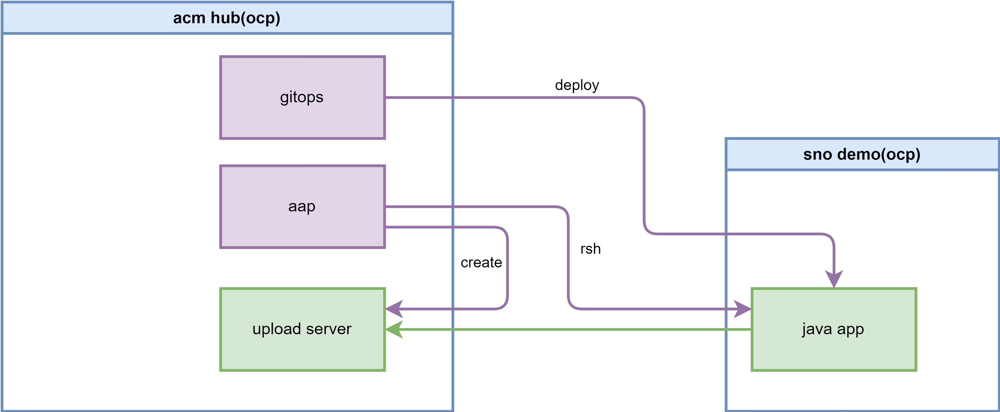

# install acm

install acm from operator:


create a acm instance:


use basic mode, not HA mode, so we will not create multiple instances for same object.


Now, we try to import the managed cluster, in our case, it will be sno-demo cluster.


But, before import, we need to get api url and api token from managed cluster, sno-dmo.


Now, you can see the api url, and api token:


api url: `https://api.demo-01-rhsys.wzhlab.top:6443`

api token: `sha256~636nYarACWldNeNTx69kGOYPWaQUWcjcMtCHGLNm3Gk`

Now, we go back to acm hub cluster, to create the imported cluster. Set the name for the cluster, and select import mode, we will use api token.


Then, we will not use ansible automation to help the import, just ignore at this step.


Review, and import.


After the import, we can see the managed cluster in acm hub.


We can see it is single node openshift.


And add-ons are installed in the imported cluster.


# install gitops

We need `openshift gitops` to create gitops configuration.

install gitops from operator on acm hub cluster.


You can see there is default instance created.


# install aap / ansible platform

Find the app operator.


try cluster-scoped channel first.

Then create an aap instance.


Following the offical document.

- https://docs.redhat.com/en/documentation/red_hat_ansible_automation_platform/2.5/html-single/installing_on_openshift_container_platform/index#operator-link-components_configure-aap-operator


set service type and ingress type, and patch the config

```yaml
spec:
  controller:
    disabled: false

  eda:
    disabled: false

  hub:
    disabled: false
    storage_type: file
    file_storage_storage_class: wzhlab-top-nfs
    file_storage_size: 10Gi

```

Get the url to access the app platform.


For app, it needs subscription files from redhat portal.


Go to redhat portal, and requrest a trail.


Download the subscription file, and upload to the app platform.


The app installation will continue.


<!--  -->

set credential for openshift, it is different from acm importing cluster.

- https://docs.ansible.com/automation-controller/latest/html/userguide/credentials.html#openshift-or-kubernetes-api-bearer-token

```bash

# for sno-demo cluster

cd ${BASE_DIR}/data/install

wget https://raw.githubusercontent.com/wangzheng422/docker_env/refs/heads/dev/redhat/ocp4/4.16/files/ansible-sa.yaml

oc new-project aap-namespace

oc apply -f ansible-sa.yaml

oc create token containergroup-service-account --duration=876000h -n aap-namespace
# very long output

# for acm-demo cluster

cd ${BASE_DIR}/data/install

wget https://raw.githubusercontent.com/wangzheng422/docker_env/refs/heads/dev/redhat/ocp4/4.16/files/ansible-sa.yaml

oc new-project aap-namespace

oc apply -f ansible-sa.yaml

oc create token containergroup-service-account --duration=876000h -n aap-namespace
# very long output

```

Define the credential to connect to openshift cluster:


Set the url and the token generated.


Define project, which is the source code reference.


And define the job template.


Set the parameter of the job, like target cluster credential, the project(git repo), the ansible playbook(the path in git repo).


# gitops source code

Our code example, we have gitops code and ansible playbook code in the same repo:

- https://github.com/wangzheng422/demo-acm-app-gitops

Use upstream k8s_core collection:

- https://docs.ansible.com/ansible/latest/collections/kubernetes/core/k8s_exec_module.html#ansible-collections-kubernetes-core-k8s-exec-module


<!-- - https://github.com/ansible/awx-resource-operator/blob/devel/roles/jobtemplate/tasks/main.yml -->

# deploy app using gitops

The source code of gitops is in the repo:
- https://github.com/wangzheng422/demo-acm-app-gitops/tree/main/gitops/threads

We will use `argocd push mode`, because the pull mode needs addtional configuration.


Set the application name, and select the argo server, which runs on the hub cluster. Also switch on the yaml button, you can see the yaml file that will be created.


Select git type, set the github url, branch, and the path to the yaml that will be deployed. And set the target namespace, which will be created on the target ocp cluster.


Set the sync policy, which will be applied to argo cd.


And set the placement, which will tell argo cd which target cluster are.

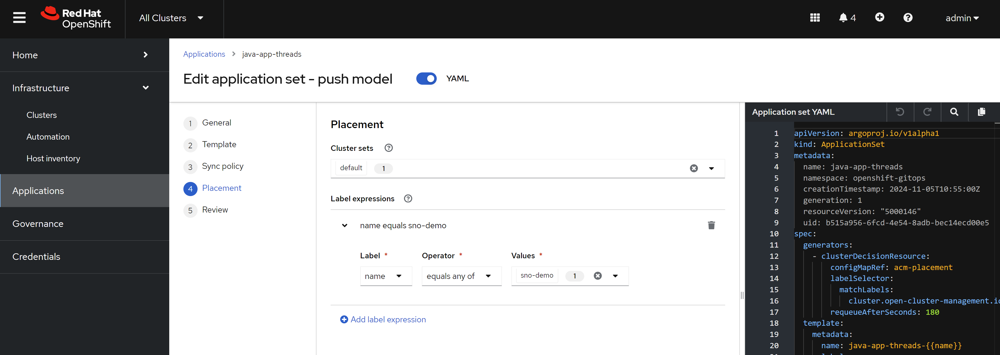

<!--  -->

For the placement, there is expression, which is the cluster name, which is sno-demo. And we can see you can select the cluster based on different labels.


And match the value with different logic.


Here is the yaml file that will be created, for your reference:

```yaml
apiVersion: argoproj.io/v1alpha1
kind: ApplicationSet
metadata:
  name: java-app-threads
  namespace: openshift-gitops
spec:
  generators:
    - clusterDecisionResource:
        configMapRef: acm-placement
        labelSelector:
          matchLabels:
            cluster.open-cluster-management.io/placement: java-app-threads-placement
        requeueAfterSeconds: 180
  template:
    metadata:
      name: java-app-threads-{{name}}
      labels:
        velero.io/exclude-from-backup: "true"
    spec:
      destination:
        namespace: wzh-demo-01
        server: "{{server}}"
      project: default
      sources:
        - path: gitops/threads
          repoURL: https://github.com/wangzheng422/demo-acm-app-gitops
          targetRevision: main
          repositoryType: git
      syncPolicy:
        automated:
          prune: true
          selfHeal: true
        syncOptions:
          - CreateNamespace=true
          - PruneLast=true
---
apiVersion: cluster.open-cluster-management.io/v1beta1
kind: Placement
metadata:
  name: java-app-threads-placement
  namespace: openshift-gitops
spec:
  predicates:
    - requiredClusterSelector:
        labelSelector:
          matchExpressions:
            - key: name
              operator: In
              values:
                - sno-demo
```

Now, we access the argocd to see what happend, we can see there is a new application created.

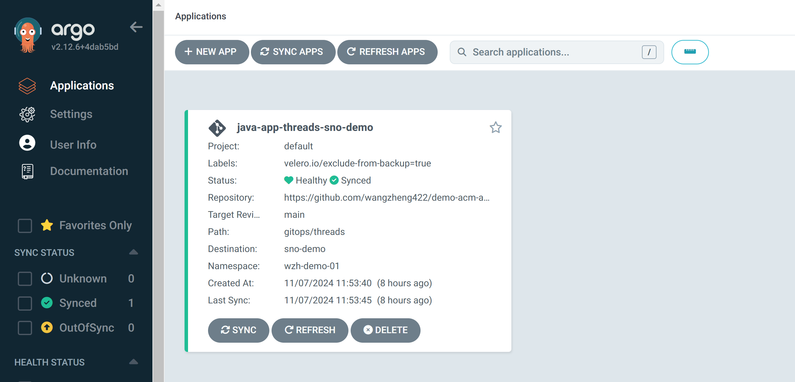

Go into the application, and click on the first icon.

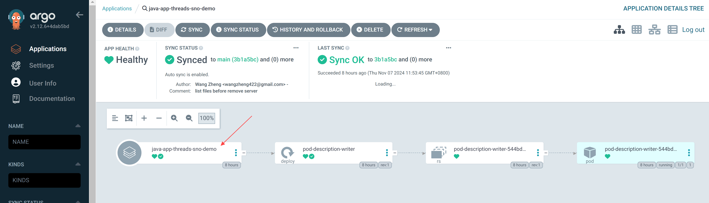

You can see it will create the deployment on the target/another cluster.

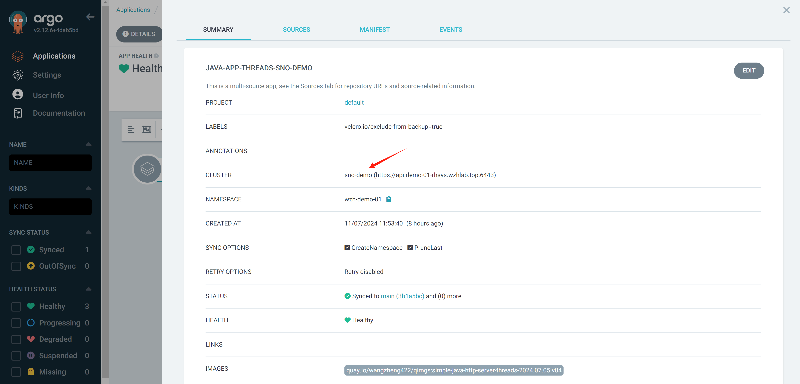


# create job/job template in aap

The ansible job/job template use ansible playbook, which is located in this repo:
- https://github.com/wangzheng422/demo-acm-app-gitops/tree/main/ansible

We create 3 job templates in aap for 3 playbooks in the repo:

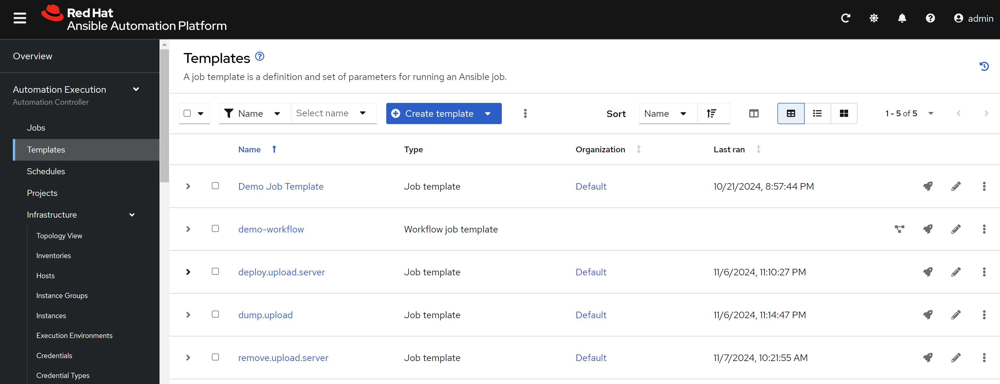

And we define a workflow, to add the 3 job templates in the workflow. We introduce the workflow here because the job template only works for one ocp cluster, but the use case needs to operate on 2 ocp clusters.

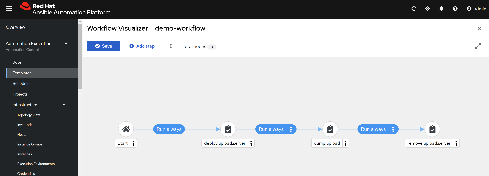

And we run the workflow, it will be successful.

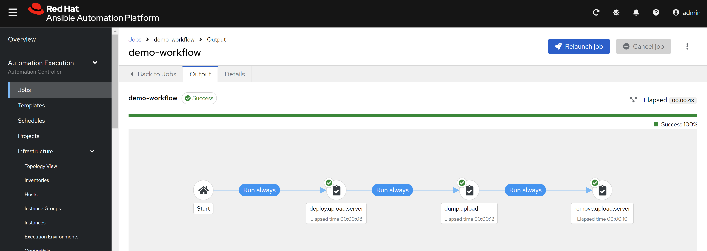

> [!TIP]
> You can define the ansible job and ansible workflow using openshift aap operator's CR, but it is not recommended right now, as it is not very well documented.

# Maintain multi-cluster consistency using policy

Now, we deploy application and get dump files from pods using ansible. Then next step is to maintain the consistency of the multi-cluster. We can use policy to do this.

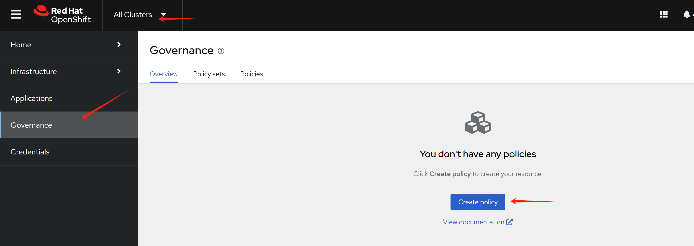

Define policy name, and the namespace that the policy will be applied to, which is on acm hub ocp. We will use openshift-gitops namespace, because the default cluster set is defined to binding to this namespace.

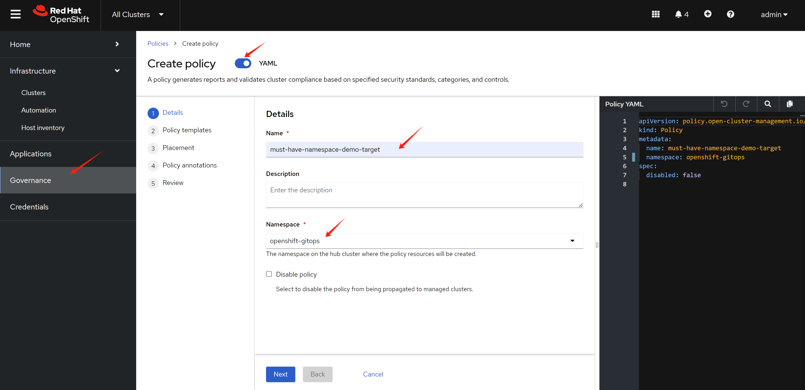
<!-- 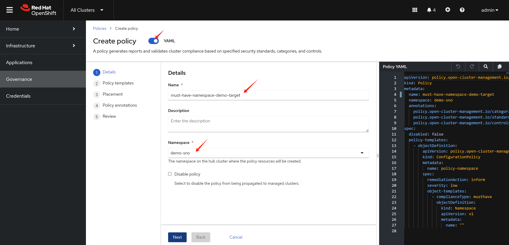 -->

Then we define the content of the policy, there are some build-in templates, we will use the `policy-namespace` template, which is to create a namespace on the target cluster.

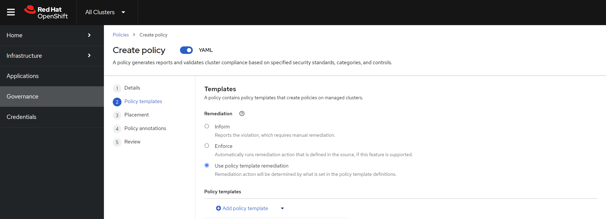

As we can see, there are some build-in templates, we will use the simple one, and then we can see the yaml file that will be created.

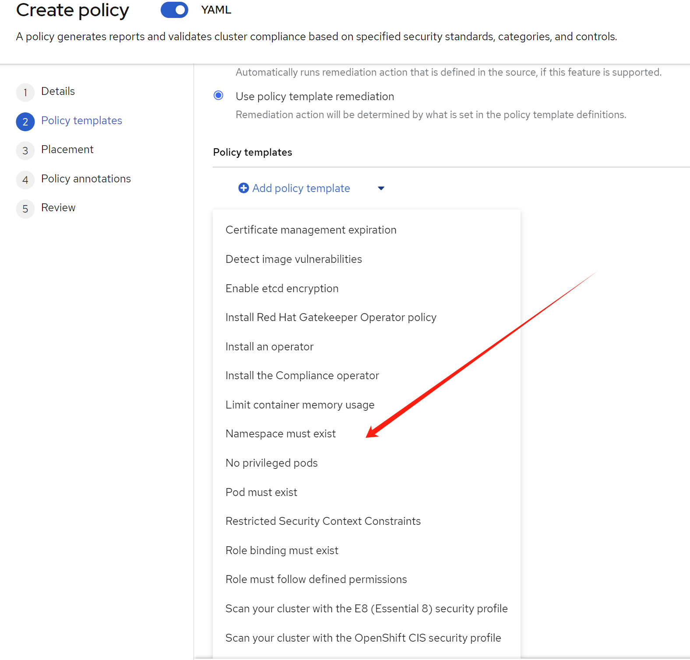

Then set the parameter of the namespace tempalte, which is the namespace name.

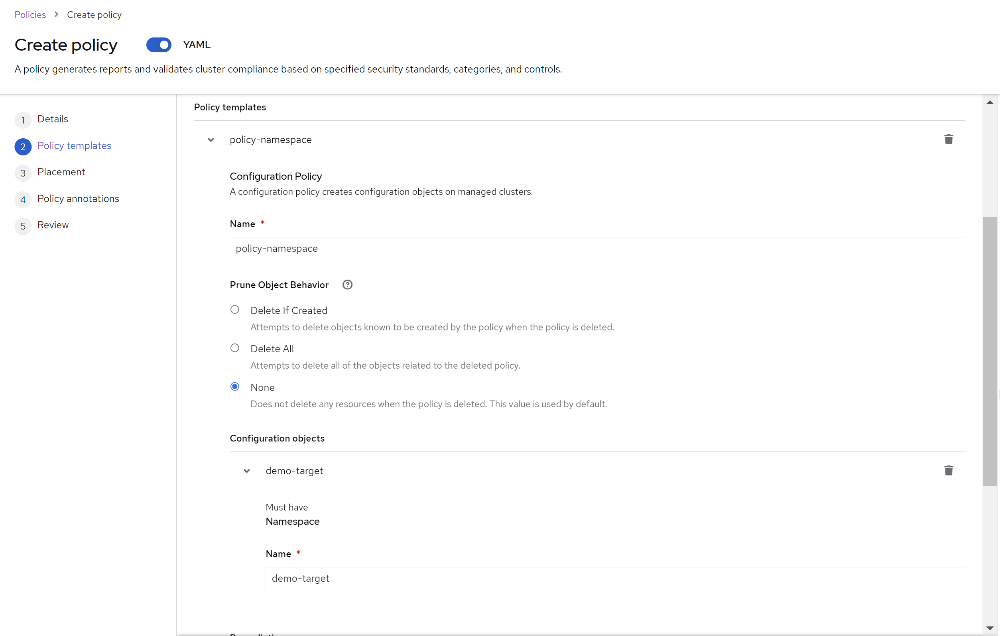

For cluster level consistency, we can force the policy to be applied automatically, but this is not recommended based on auther's experience. It is recommended to report warning, and let administration to decide what actions to take.

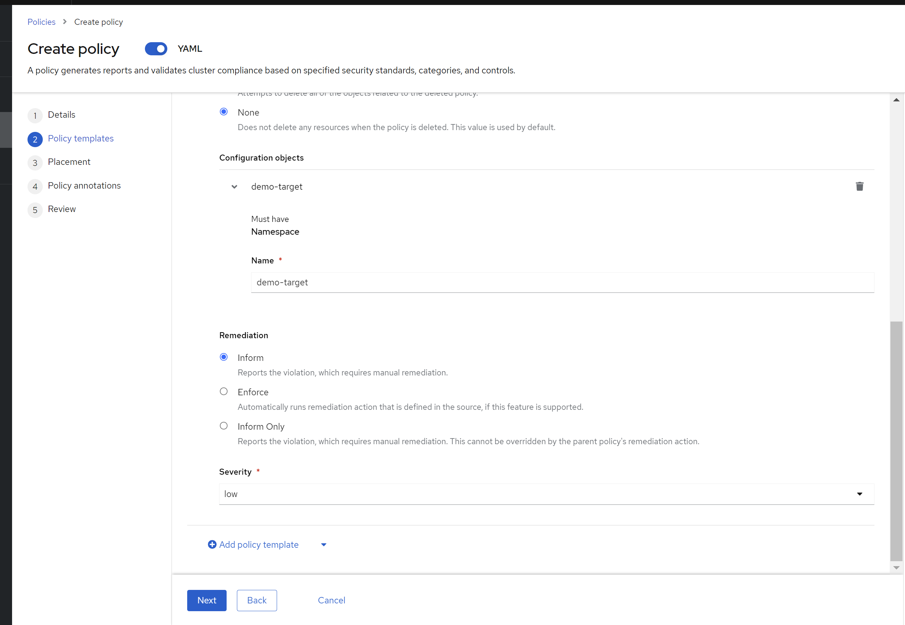

<!-- 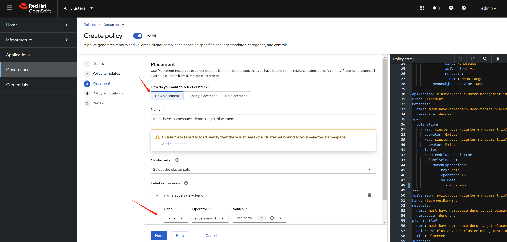 -->

Then, define the placement, which is the target cluster, which is sno-demo.

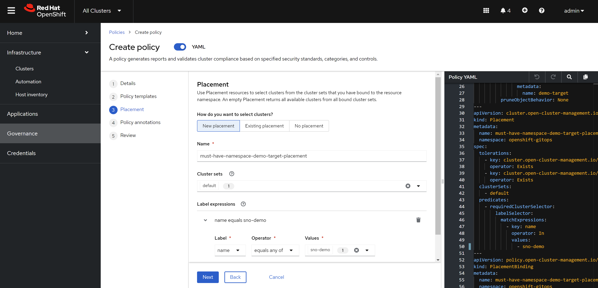

Then, define some anotation for the policy, which is the standard that the policy is based on.

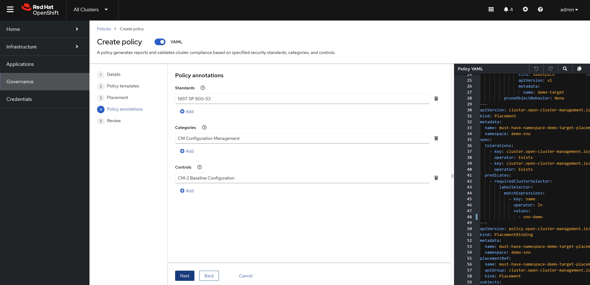

Review the configuration, and create the policy.

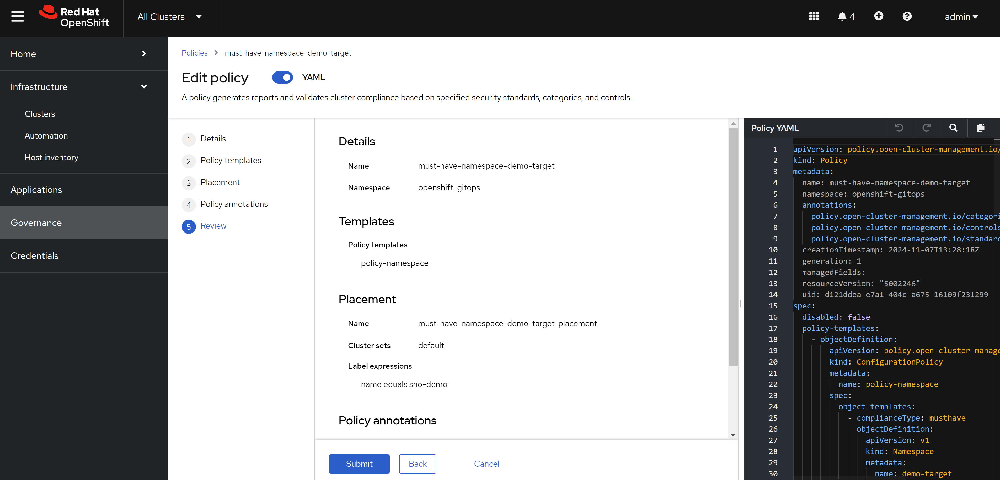

<!-- 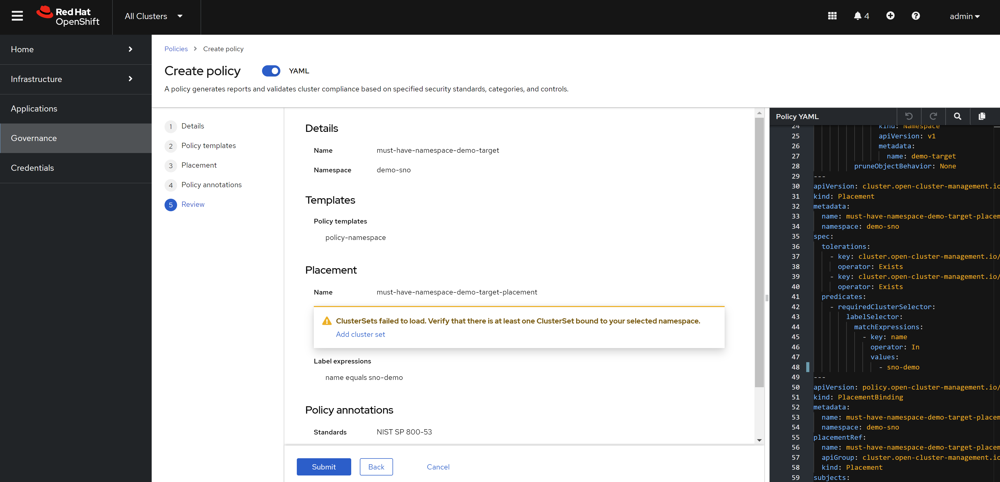 -->

After the policy is created, we can see the policy in the acm hub cluster. And we can see the policy is applied to the target cluster, a warning is reported.

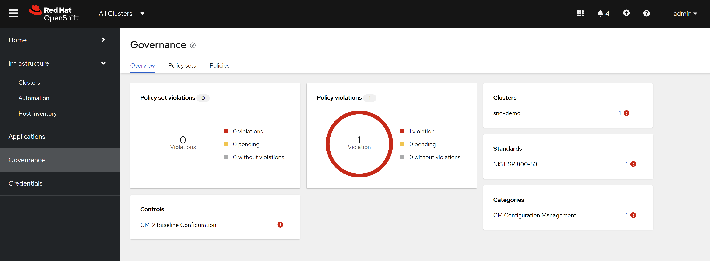

Now, we can see the detail of the warning, it reports the namespace is not created on the target cluster.

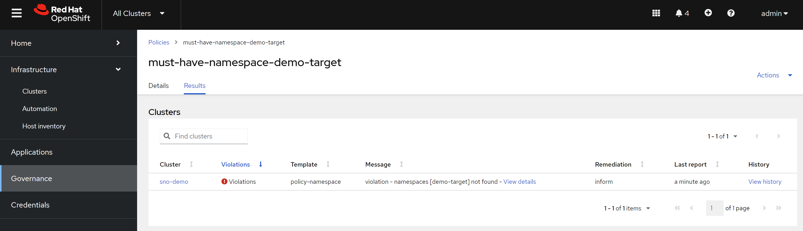

Here is the yaml file that will be created, for your reference, you can see it defines object-templates, which is skelton of the object that will be created on the target cluster.

```yaml
apiVersion: policy.open-cluster-management.io/v1
kind: Policy
metadata:
  name: must-have-namespace-demo-target
  namespace: openshift-gitops
  annotations:
    policy.open-cluster-management.io/categories: CM Configuration Management
    policy.open-cluster-management.io/controls: CM-2 Baseline Configuration
    policy.open-cluster-management.io/standards: NIST SP 800-53
spec:
  disabled: false
  policy-templates:
    - objectDefinition:
        apiVersion: policy.open-cluster-management.io/v1
        kind: ConfigurationPolicy
        metadata:
          name: policy-namespace
        spec:
          object-templates:
            - complianceType: musthave
              objectDefinition:
                apiVersion: v1
                kind: Namespace
                metadata:
                  name: demo-target
          pruneObjectBehavior: None
          remediationAction: inform
          severity: low
---
apiVersion: cluster.open-cluster-management.io/v1beta1
kind: Placement
metadata:
  name: must-have-namespace-demo-target-placement
  namespace: openshift-gitops
spec:
  clusterSets:
    - default
  predicates:
    - requiredClusterSelector:
        labelSelector:
          matchExpressions:
            - key: name
              operator: In
              values:
                - sno-demo
  tolerations:
    - key: cluster.open-cluster-management.io/unreachable
      operator: Exists
    - key: cluster.open-cluster-management.io/unavailable
      operator: Exists
---
apiVersion: policy.open-cluster-management.io/v1
kind: PlacementBinding
metadata:
  name: must-have-namespace-demo-target-placement
  namespace: openshift-gitops
placementRef:
  name: must-have-namespace-demo-target-placement
  apiGroup: cluster.open-cluster-management.io
  kind: Placement
subjects:
  - name: must-have-namespace-demo-target
    apiGroup: policy.open-cluster-management.io
    kind: Policy
```

## using policy to enforce promethus alert rule

We now use policy to enforce promethus alert rule. Here is the promethus rule example:

```yaml
apiVersion: monitoring.coreos.com/v1
kind: PrometheusRule
metadata:
  name: wzh-cpu-alerts
  namespace: openshift-monitoring  # Ensure this is the correct namespace for your setup
spec:
  groups:
    - name: cpu-alerts
      rules:
        - alert: HighCpuUsage
          expr: sum(rate(container_cpu_usage_seconds_total{container!="POD"}[5m])) by (pod) > 0.8
          for: 5m
          labels:
            severity: warning
          annotations:
            summary: "High CPU usage detected"
            description: "Pod {{ $labels.pod }} is using more than 80% CPU for the last 5 minutes."
```

Before setting in acm, we need to convert it into policy, because by default, the acm build-in policy-template does not support promethus rule.

```yaml
apiVersion: policy.open-cluster-management.io/v1
kind: Policy
metadata:
  name: must-have-prometheus-alert-rule
  namespace: policies
  annotations:
    policy.open-cluster-management.io/categories: CM Configuration Management
    policy.open-cluster-management.io/controls: CM-2 Baseline Configuration
    policy.open-cluster-management.io/standards: NIST SP 800-53
spec:
  disabled: false
  remediationAction: enforce
  policy-templates:
    - objectDefinition:
        apiVersion: policy.open-cluster-management.io/v1
        kind: ConfigurationPolicy
        metadata:
          name: policy-alert-rule
        spec:
          object-templates:
            - complianceType: musthave
              objectDefinition:
                apiVersion: monitoring.coreos.com/v1
                kind: PrometheusRule
                metadata:
                  name: wzh-cpu-alerts
                  namespace: openshift-monitoring  # Ensure this is the correct namespace for your setup
                spec:
                  groups:
                    - name: cpu-alerts
                      rules:
                        - alert: HighCpuUsage
                          expr: sum(rate(container_cpu_usage_seconds_total{container!="POD"}[5m])) by (pod) > 0.8
                          for: 5m
                          labels:
                            severity: warning
                          annotations:
                            summary: "High CPU usage detected"
                            description: "Pod {{`{{$labels.pod}}`}} is using more than 80% CPU for the last 5 minutes."
          pruneObjectBehavior: DeleteIfCreated
          remediationAction: enforce
          severity: low
```

Please note, we use `pruneObjectBehavior: DeleteIfCreated`, so if policy is deleted, the promethus rule will be deleted.

We also use ``{{`{{$labels.pod}}`}}`` , which will overwrite the value of the pod label, and also compatible with policy template.

Here is how to create using webUI:

1. navigate to `governance` -> `policies` -> `create policy`
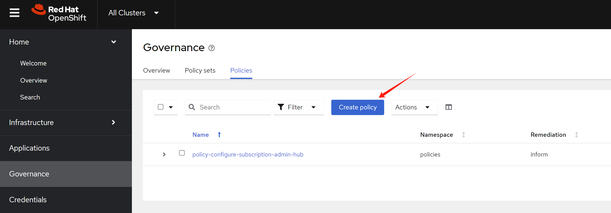

2. set the policy name, and namespace
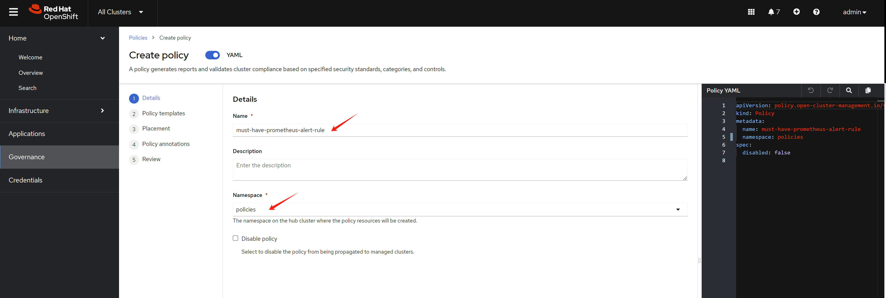

3. copy the content of `policy-template` from above example, and select `enforce`. You can see the prune policy is set to `DeleteIfCreated`
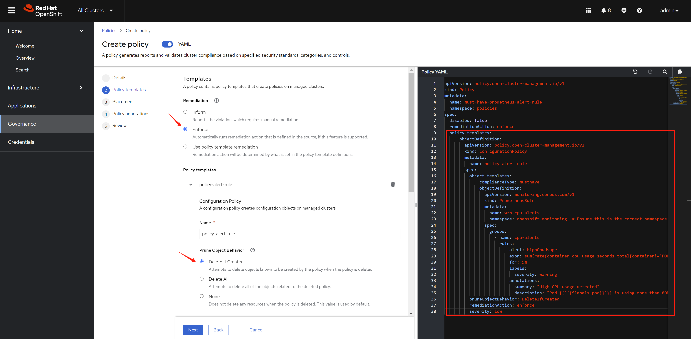

4. select the placement.
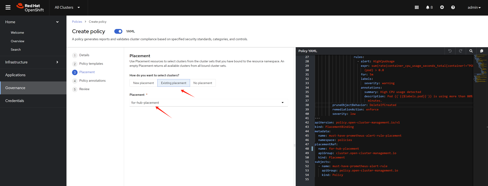

5. finally, the policy is deployed. And the prometheus rule is created. So the policy is compliant.
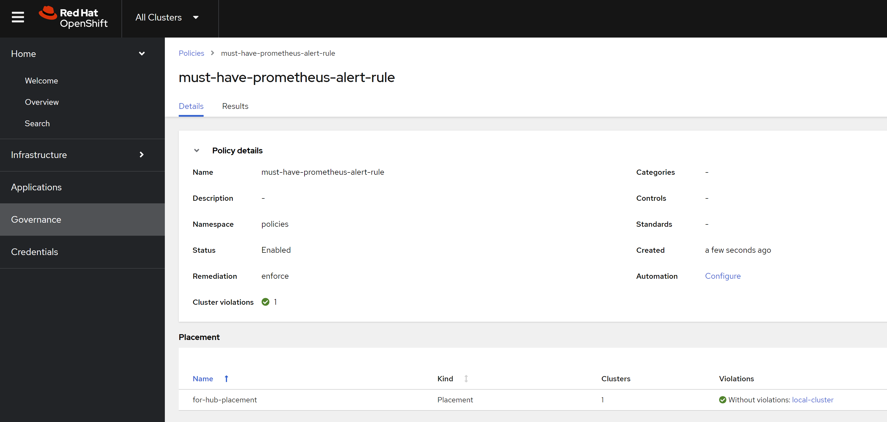

# end