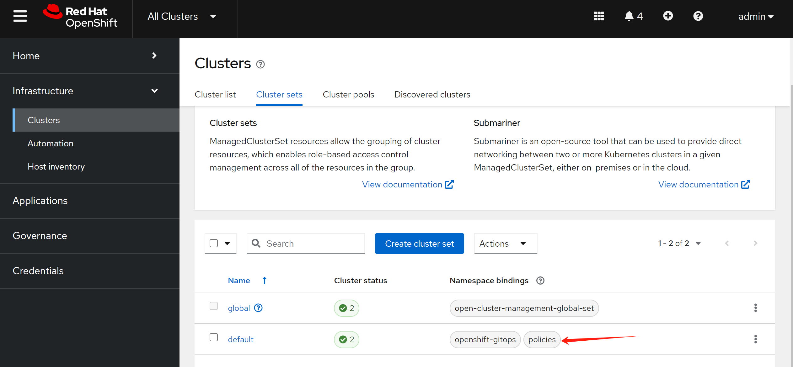
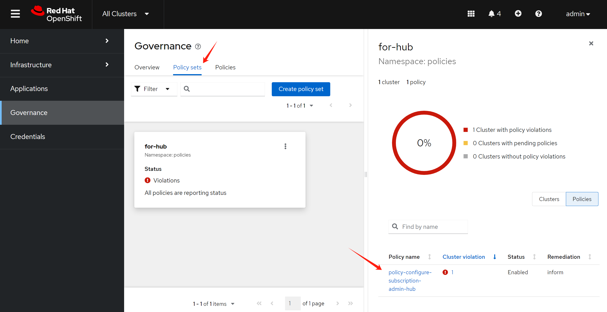

# ACM integrate with ACS

> [!NOTE]
> ACS does not support gitops well. It can not get policy config from k8s yaml file right now.

We want to use ACM to manage the ACS cluster. Currently, the ACS does not have full gitops support, so we want to explore the possibility to use ACM to manage the ACS cluster.

Fortunately, we alread have an example to do that, lets explore it first.

- https://github.com/open-cluster-management-io/policy-collection/blob/main/policygenerator/policy-sets/stable/openshift-plus/README.md
- https://github.com/stolostron/policy-generator-plugin/blob/main/docs/policygenerator-reference.yaml

# demo repo

We create and modify a acs demo repo based on the above example.

- https://github.com/wangzheng422/policy-collection/tree/wzh-acs/wzh.acs

Under this folder, we create policy set based on original openshift-plus policy set, and remove some policies that are not related to ACS.

# env prepare

The demo repo needs policy-generator-plugin to generate the policy, and the policy will be applied to the acs cluster.

We will following the docs to install the policy-generator-plugin.
- https://github.com/stolostron/policy-generator-plugin#installation

```bash
# make sure the kustomize is installed
curl -s "https://raw.githubusercontent.com/kubernetes-sigs/kustomize/master/hack/install_kustomize.sh"  | bash

mv kustomize ~/.local/bin/

kustomize version
# v5.5.0

mkdir -p ${HOME}/.config/kustomize/plugin/policy.open-cluster-management.io/v1/policygenerator

wget -O linux-amd64-PolicyGenerator https://github.com/open-cluster-management-io/policy-generator-plugin/releases/download/v1.16.0/linux-amd64-PolicyGenerator

chmod +x linux-amd64-PolicyGenerator
mv linux-amd64-PolicyGenerator ${HOME}/.config/kustomize/plugin/policy.open-cluster-management.io/v1/policygenerator/PolicyGenerator

```

# apply the policy set

1. create namespace `policies` to store the policy

```bash
# on both hub, and managed cluster
oc create ns policies
```

Attache the namespace to cluster set.



2. apply `policy-configure-subscription-admin-hub.yaml` to the hub cluster

```bash
# on helper for hub
mkdir -p ${BASE_DIR}/data/git/
cd ${BASE_DIR}/data/git/

git clone --branch wzh-acs https://github.com/wangzheng422/policy-collection

cd ${BASE_DIR}/data/git/policy-collection/wzh.acs

oc apply -f policy-configure-subscription-admin-hub.yaml -n policies

```

Create a policyset and add the policy, place the policyset to hub cluster.



3. generate and apply the policy

```bash
cd ${BASE_DIR}/data/git/policy-collection/wzh.acs

# let us see what it generated.
kustomize build --enable-alpha-plugins > generated.acm.acs.policy.yaml

kustomize build --enable-alpha-plugins  | oc apply -f -

```

It will install acs in hub, and manage the managed cluster.

Let's see the generated policies. It is here:
- https://github.com/wangzheng422/policy-collection/blob/wzh-acs/wzh.acs/generated.acm.acs.policy.yaml

From the generated acm policy, we can see all the policy is about install acs, nothing about acs's policy.

So, currently, acs does not support gitops well. We need to wait acs product to be improved.


# end