> [!WARNING]
> Working in progress
# deploy dify on openshift

> [!TIP]
> if you want to try dify, just go to online version: https://cloud.dify.ai/apps
> 
> it is the same with offline version

Prerequisites:
- OpenShift 4.16
- default storage class with RWX
- GPU (for ollama)
- enough cpu/memory (for dify)

> [!WARNING]
> currenty, the dify deployed with priviledge, it depends upstream to fix it

Deploy the dify with yaml files at here:
- https://github.com/wangzheng422/dify-kubernetes/tree/main/ocp

After the deployment, you can access the dify using route's url. And init the dify with admin account and password.

> [!TIP]
> If you are asked to input password in the first login, use `password`

# ollama

You need also to deploy the ollama on the same cluster, to provide LLM service, you can refer to the ollama's doc to deploy it.
- https://github.com/otwld/ollama-helm

Before you begin, remove existed gpu applications, if you have limited gpu resources.

Let us begin, first, import the helm repo.

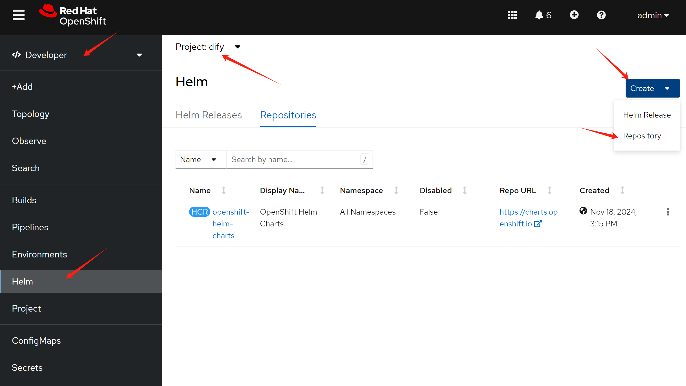

Give it a name, and input the url.

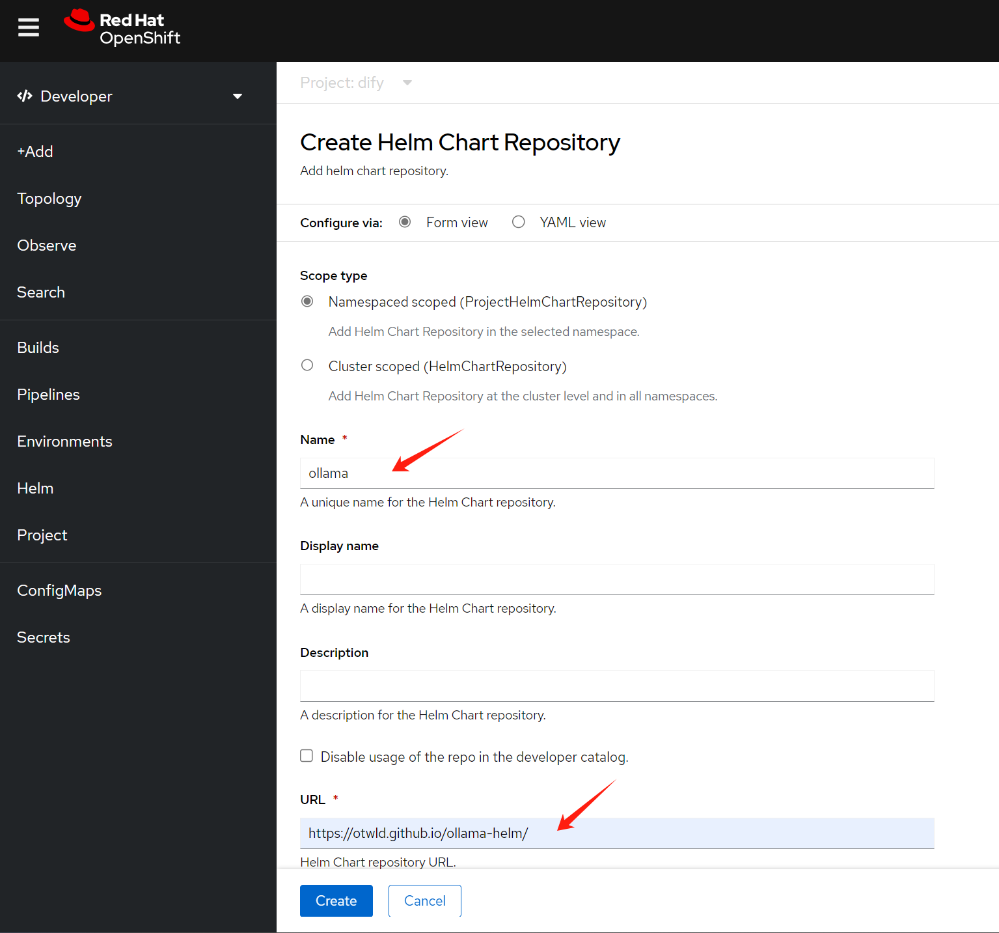

Then, create the helm deployment.

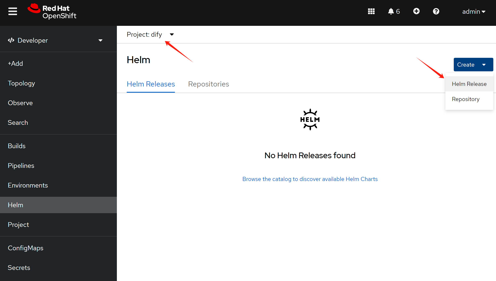

Select the helm app.

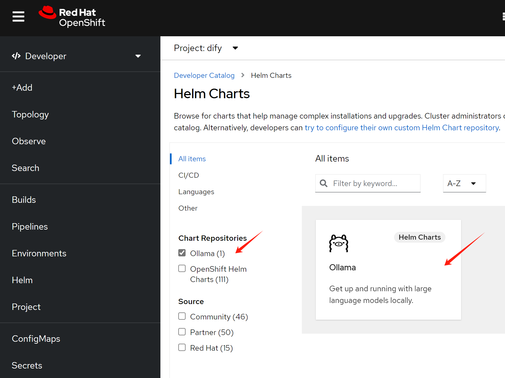

And replace the values with the sample helm value file.

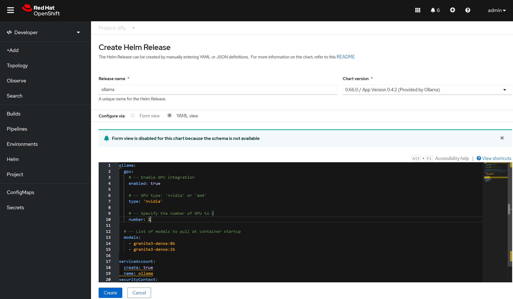

Here is the sample helm value files.

```yaml
ollama:
  gpu:
    # -- Enable GPU integration
    enabled: true
    
    # -- GPU type: 'nvidia' or 'amd'
    type: 'nvidia'
    
    # -- Specify the number of GPU to 1
    number: 1
   
  # -- List of models to pull at container startup
  models: 
    - granite3-dense:8b
    - granite3-dense:2b

serviceAccount:
  create: true
  name: ollama
securityContext:
  privileged: true
  runAsUser: 0
  fsGroup: 0
```
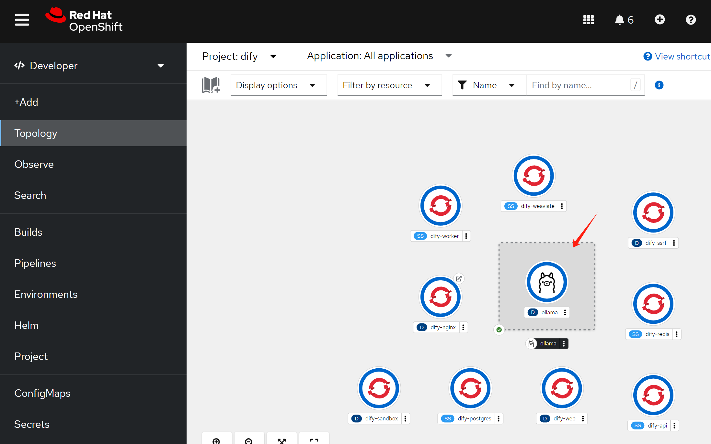

# config and workflow in dify

We need to set dify's llm model.

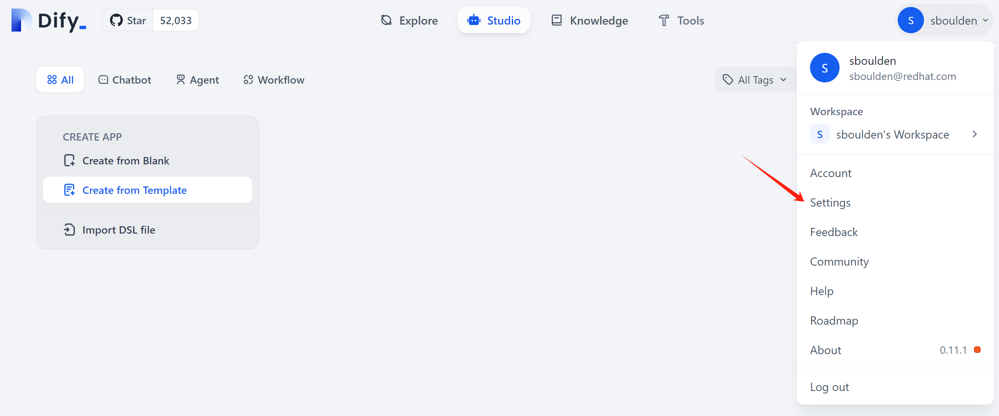

Select ollama

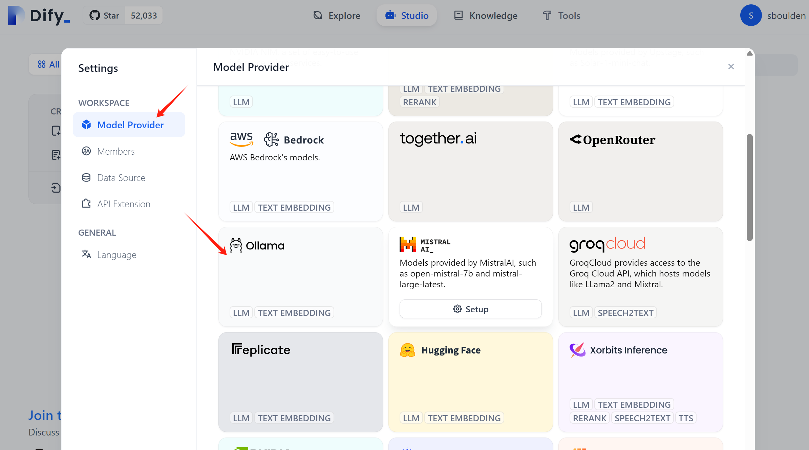

Fill in name, and the ollama rest api url

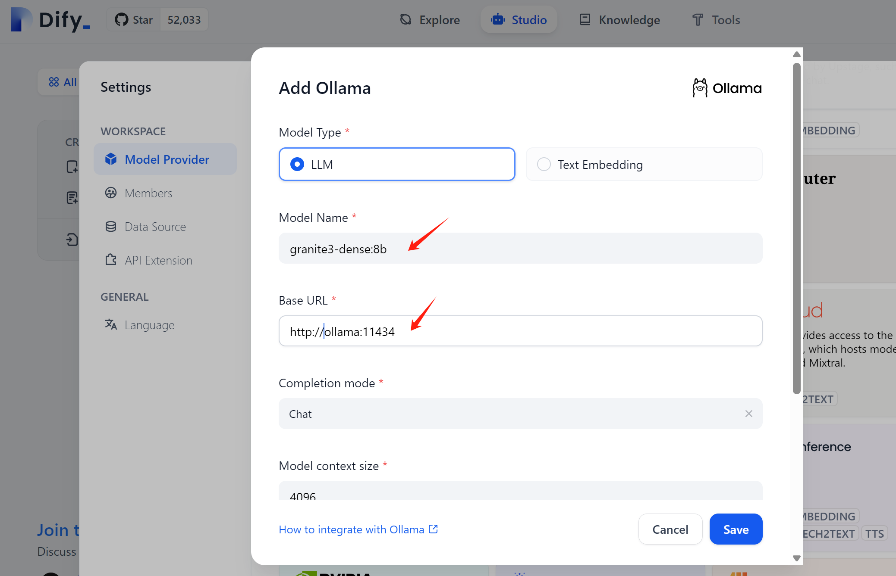

Add another ollama llm model

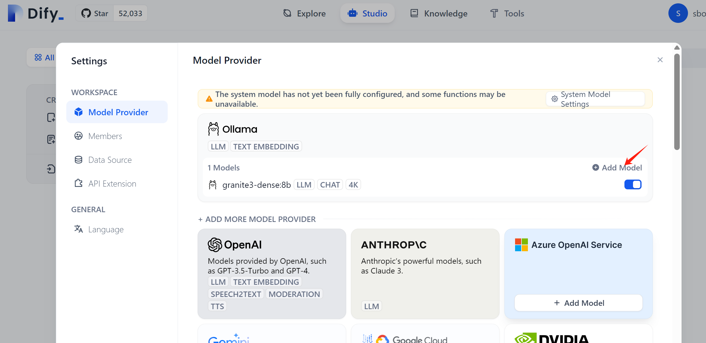

Now, we have access to 2 ollama models.

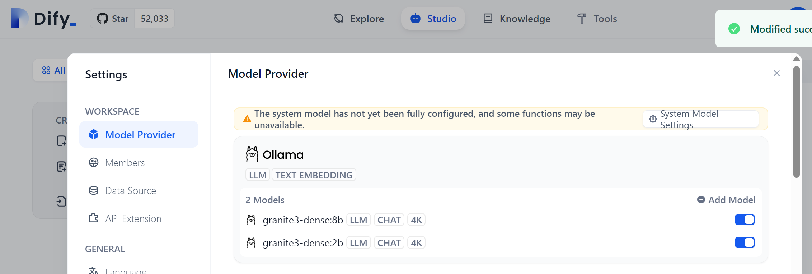

Let us try a pre-defined use case.

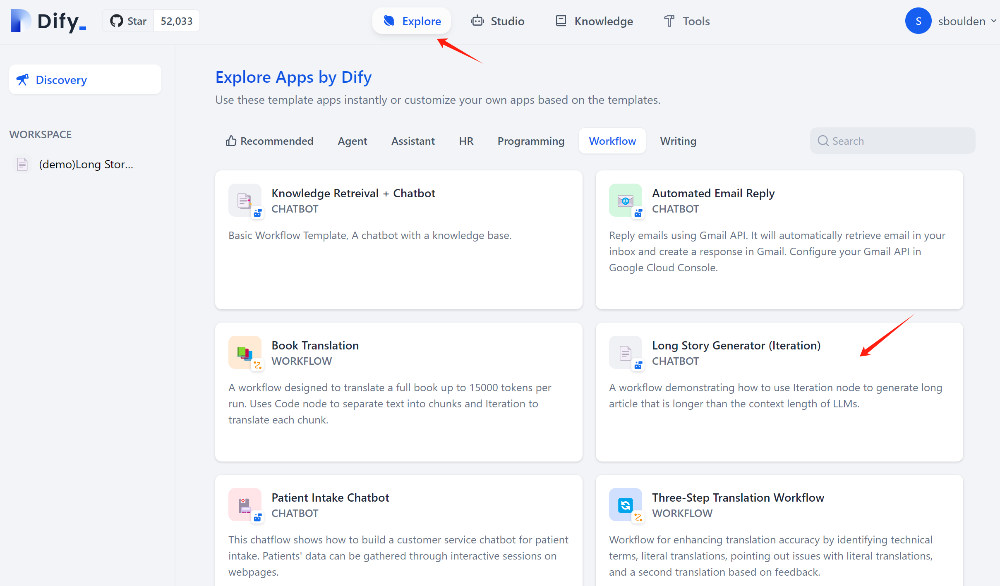

Go into this use case

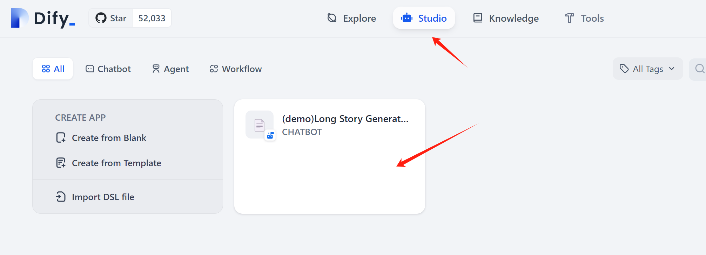

This workflow use gpt-4 model by default, let us change it to ollama model.

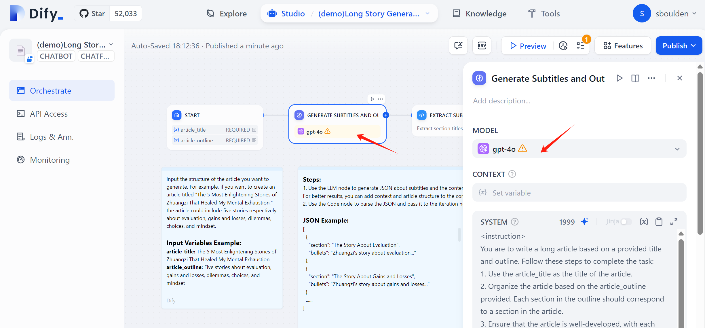

After change the model, the workflow looks like this.

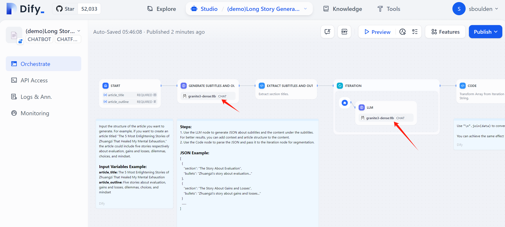


# end