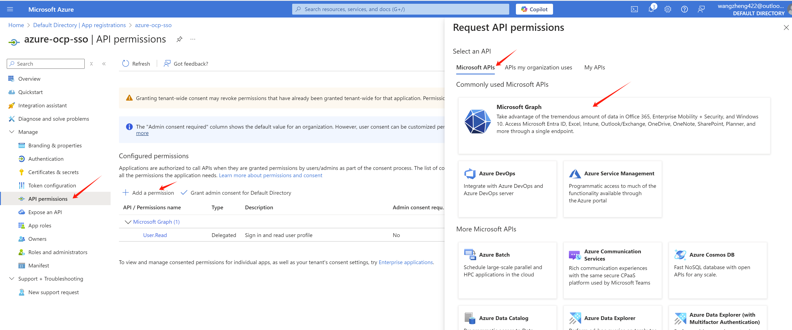
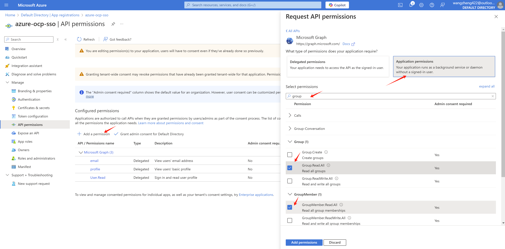
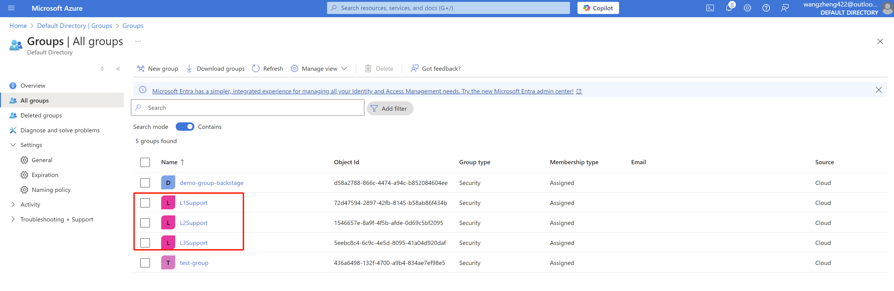
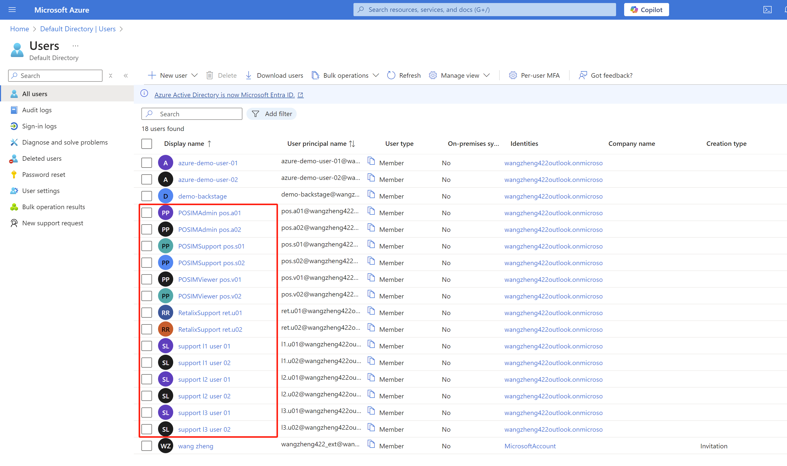
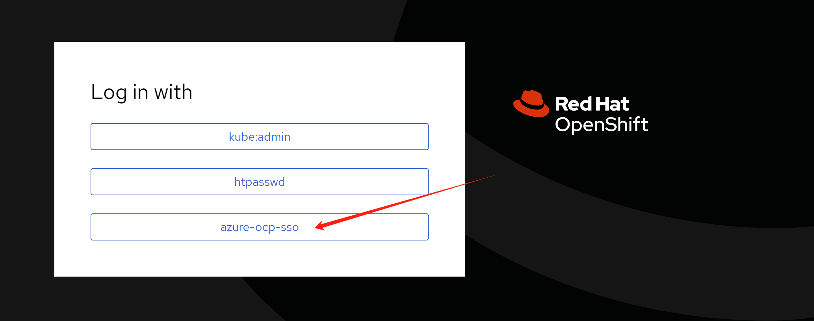
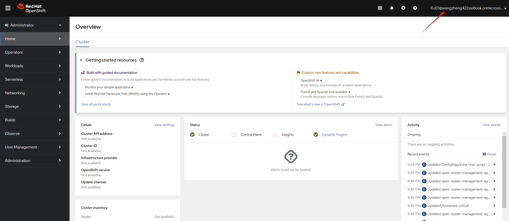

# openshift 4.16 integration with Azure SSO without group sync operator

OpenShift support integration with Azure SSO through OpenID. In this article, we will show you how to integrate OpenShift 4.16 with Azure SSO.

# azure portal setting

In your Azure portal, go to Azure Active Directory -> App registrations -> New registration


As you can see, we will create a `app registration` `azure-ocp-sso`. Let us find the redirect url for the openshift sso.

Get openshift sso callback host from openshift cli:

```bash
oc get route -n openshift-authentication
# NAME              HOST/PORT                                       PATH   SERVICES          PORT   TERMINATION            WILDCARD
# oauth-openshift   oauth-openshift.apps.demo-01-rhsys.wzhlab.top          oauth-openshift   6443   passthrough/Redirect   None
```

So the redirect url is `https://oauth-openshift.apps.demo-01-rhsys.wzhlab.top/oauth2callback/azure-ocp-sso` . Now we can create the `app registration` in Azure portal.


After the app registration is created, we can get the `tenant id` and `client id` from the `Overview` page. Write it down for later use. 


And create a `client secret` in the `Certificates & secrets` page.


Write it down for later use.


Now, we need go add some permissions to the app registration. Go to `API permissions` page, click `Add a permission`.



Add `profile` and `email` permissions with `Delegated permissions`.


For group sync, we need to add `Directory.Read.All` `GroupMember.Read.All` `User.Read.All` permission with `Application permissions`.



After the permissions are added, we need to grant admin consent for the permissions.


And get the endpoint of azure, write it down.


Add optional claim for `email` and `preferred_username`.


Add group claim. [Official document](https://docs.openshift.com/rosa/cloud_experts_tutorials/cloud-experts-entra-id-idp.html) also mentioned how to add group claim.


We also create some groups and add some users to the groups.

- L1Support(group)
  - l1.u01(user)
  - l1.u02(user)
- L2Support(group)
  - l2.u01(user)
  - l2.u02(user)
- L3Support(group)
  - l3.u01(user)
  - l3.u02(user)
- RetalixSupport(group)
  - ret.u01(user)
  - ret.u02(user)
  - l1.u01(user)
- POSIMViewer(group)
  - pos.v01(user)
  - pos.v02(user)
- POSIMSupport(group)
  - pos.s01(user)
  - pos.s02(user)
- POSIMAdmin(group)
  - pos.a01(user)
  - pos.a02(user)

<!--  -->


<!--  -->



To sync the group information, we need to add groups to the `app registration` in Azure portal.

Reference:
- https://learn.microsoft.com/en-us/entra/identity/enterprise-apps/assign-user-or-group-access-portal?pivots=portal
- https://cloud.redhat.com/experts/idp/entra-id-with-group-names/

Go to `Enterprise applications`


Select the `app registration` we created before.


Select `Users and groups` -> `Add user/group`


Select the groups you want to sync. Here you may need to active `azure entra` subscription. A free trail is available for 30 days and 25 users.


Then, go to `app registration` -> `manifest`, backup existed manifest, and make some changes.

> [!NOTE]
> remember to backup the manifest before you make any changes.


change value of "groupMembershipClaims" to "ApplicationGroup", the result look like:
```json
"groupMembershipClaims": "ApplicationGroup",
```

change "optionalClaims" -> "idToken" -> "name": "groups" -> "additionalProperties" to
```json
"additionalProperties": [
  "sam_account_name",
  "cloud_displayname"
],
```
The result look like:
```json
	"optionalClaims": {
		......
		"idToken": [
      .......
			{
				"additionalProperties": [
					"sam_account_name",
					"cloud_displayname"
				],
				"essential": false,
				"name": "groups",
				"source": null
			}
		],
```

Save the manifest changes. Now you finished the azure portal setting.

# openshift sso setting

We will create a `oauth` object in openshift to integrate with Azure SSO. Here is an example, we add 2 identity providers, `htpasswd` and `azure-ocp-sso`. The `htpasswd` is for local user, and `azure-ocp-sso` is for Azure SSO. You can change it based on your requirement, for example, remove `htpasswd` if you don't need it.

```bash
# set the environment variables
# here is the example, you need to change the value based on your own setting
export AZURE_TENANT_ID='xxxxxxxx-xxxx-xxxx-xxxx-xxxxxxxxxxxx'
export AZURE_CLIENT_ID='yyyyyyyy-yyyy-yyyy-yyyy-yyyyyyyyyyyy'
export AZURE_CLIENT_SECRET='XXXXXXXXXXXXXXXXXXXXXXXXXXXXXXXXXXXXXXXX'
export AZURE_ENDPOINT='https://login.microsoftonline.com/xxxxxxxx-xxxx-xxxx-xxxx-xxxxxxxxxxxx/v2.0'


# import the secret from the client secret var
oc create secret generic openid-client-secret-azure \
--from-literal=clientSecret=$AZURE_CLIENT_SECRET \
-n openshift-config

cat << EOF > ${BASE_DIR}/data/install/oauth.yaml
spec:
  identityProviders:
  - name: htpasswd
    mappingMethod: claim 
    type: HTPasswd
    htpasswd:
      fileData:
        name: htpass-secret
  - mappingMethod: claim
    name: azure-ocp-sso
    openID:
      claims:
        email:
        - email
        groups:
        - groups
        name:
        - name
        preferredUsername:
        - preferred_username
      clientID: $AZURE_CLIENT_ID
      clientSecret:
        name: openid-client-secret-azure
      extraScopes:
      - email
      - profile
      issuer: $AZURE_ENDPOINT
    type: OpenID
EOF
oc patch oauth/cluster --type merge --patch-file=${BASE_DIR}/data/install/oauth.yaml

```

If you make something wrong, and want to change the config, you can edit the `oauth` object in openshift.
```bash
oc edit oauth/cluster
```

If you want to remove a user, remember to delete the user and identity in openshift.

```bash
oc delete user <username>

oc delete identity <user-identity>
```

# openshift role and rolebinding

Now, user can login, and group information is synced. We need to create role and rolebinding for the groups. So after user login, it has the correct permission.

Now, we create role for different groups. Below is an example for the roles. You can create your own roles based on your requirement.

```bash
# create namespace for demo
oc create ns retalix

oc create ns posim

# define the roles, change the rules based on your requirement
cat << EOF > ${BASE_DIR}/data/install/demo.role.yaml
---
apiVersion: rbac.authorization.k8s.io/v1
kind: ClusterRole
metadata:
  name: l1-support-role
rules:
- apiGroups: [""]
  resources: ["pods", "services", "events", "namespaces"]
  verbs: ["get", "list", "watch"]
- apiGroups: ["apps"]
  resources: ["deployments", "replicasets"]
  verbs: ["get", "list", "watch"]

---
apiVersion: rbac.authorization.k8s.io/v1
kind: ClusterRole
metadata:
  name: l2-support-role
rules:
- apiGroups: [""]
  resources: ["pods", "services", "events", "namespaces", "configmaps", "endpoints"]
  verbs: ["get", "list", "watch", "update"]
- apiGroups: ["apps"]
  resources: ["deployments", "replicasets", "daemonsets", "statefulsets"]
  verbs: ["get", "list", "watch", "update"]
- apiGroups: [""]
  resources: ["pods/log", "pods/exec"]
  verbs: ["get", "list", "create"]

---
apiVersion: rbac.authorization.k8s.io/v1
kind: ClusterRole
metadata:
  name: l3-support-role
rules:
- apiGroups: ["*"]
  resources: ["*"]
  verbs: ["get", "list", "watch", "create", "update", "patch", "delete"]
- apiGroups: [""]
  resources: ["pods/exec", "pods/log"]
  verbs: ["create", "get", "list"]
- apiGroups: ["security.openshift.io"]
  resources: ["securitycontextconstraints"]
  verbs: ["get", "list", "watch"]

---
apiVersion: rbac.authorization.k8s.io/v1
kind: Role
metadata:
  name: retalix-support-role
  namespace: retalix
rules:
- apiGroups: [""]
  resources: ["pods", "pods/log", "pods/exec", "services", "endpoints", "persistentvolumeclaims", "configmaps", "secrets", "events", "namespaces"]
  verbs: ["get", "list", "watch", "create", "update", "patch"]
- apiGroups: ["apps"]
  resources: ["deployments", "daemonsets", "replicasets", "statefulsets"]
  verbs: ["get", "list", "watch", "create", "update", "patch"]
- apiGroups: ["batch"]
  resources: ["jobs", "cronjobs"]
  verbs: ["get", "list", "watch", "create", "update", "patch"]
- apiGroups: ["networking.k8s.io"]
  resources: ["ingresses"]
  verbs: ["get", "list", "watch"]
- apiGroups: ["route.openshift.io"]
  resources: ["routes"]
  verbs: ["get", "list", "watch"]

---
apiVersion: rbac.authorization.k8s.io/v1
kind: Role
metadata:
  name: posim-viewer-role
  namespace: posim
rules:
- apiGroups: ["*"]
  resources: ["*"]
  verbs: ["get", "list", "watch"]

---
apiVersion: rbac.authorization.k8s.io/v1
kind: Role
metadata:
  name: posim-support-role
  namespace: posim
rules:
- apiGroups: [""]
  resources: ["pods", "pods/log", "pods/exec", "services", "endpoints", "configmaps", "events", "namespaces"]
  verbs: ["get", "list", "watch", "create", "update", "patch"]
- apiGroups: ["apps"]
  resources: ["deployments", "replicasets", "statefulsets"]
  verbs: ["get", "list", "watch", "update", "patch"]
- apiGroups: ["batch"]
  resources: ["jobs"]
  verbs: ["get", "list", "watch", "create"]

---
apiVersion: rbac.authorization.k8s.io/v1
kind: Role
metadata:
  name: posim-admin-role
  namespace: posim
rules:
- apiGroups: ["*"]
  resources: ["*"]
  verbs: ["*"]

---
apiVersion: rbac.authorization.k8s.io/v1
kind: ClusterRoleBinding
metadata:
  name: l1-support-binding
subjects:
- kind: Group
  name: L1Support
  apiGroup: rbac.authorization.k8s.io
roleRef:
  kind: ClusterRole
  name: l1-support-role
  apiGroup: rbac.authorization.k8s.io

---
apiVersion: rbac.authorization.k8s.io/v1
kind: ClusterRoleBinding
metadata:
  name: l2-support-binding
subjects:
- kind: Group
  name: L2Support
  apiGroup: rbac.authorization.k8s.io
roleRef:
  kind: ClusterRole
  name: l2-support-role
  apiGroup: rbac.authorization.k8s.io

---
apiVersion: rbac.authorization.k8s.io/v1
kind: ClusterRoleBinding
metadata:
  name: l3-support-binding
subjects:
- kind: Group
  name: L3Support
  apiGroup: rbac.authorization.k8s.io
roleRef:
  kind: ClusterRole
  name: l3-support-role
  apiGroup: rbac.authorization.k8s.io

---
apiVersion: rbac.authorization.k8s.io/v1
kind: RoleBinding
metadata:
  name: retalix-support-binding
  namespace: retalix
subjects:
- kind: Group
  name: RetalixSupport
  apiGroup: rbac.authorization.k8s.io
roleRef:
  kind: Role
  name: retalix-support-role
  apiGroup: rbac.authorization.k8s.io

---
apiVersion: rbac.authorization.k8s.io/v1
kind: RoleBinding
metadata:
  name: posim-viewer-binding
  namespace: posim
subjects:
- kind: Group
  name: POSIMViewer
  apiGroup: rbac.authorization.k8s.io
roleRef:
  kind: Role
  name: posim-viewer-role
  apiGroup: rbac.authorization.k8s.io

---
apiVersion: rbac.authorization.k8s.io/v1
kind: RoleBinding
metadata:
  name: posim-support-binding
  namespace: posim
subjects:
- kind: Group
  name: POSIMSupport
  apiGroup: rbac.authorization.k8s.io
roleRef:
  kind: Role
  name: posim-support-role
  apiGroup: rbac.authorization.k8s.io

---
apiVersion: rbac.authorization.k8s.io/v1
kind: RoleBinding
metadata:
  name: posim-admin-binding
  namespace: posim
subjects:
- kind: Group
  name: POSIMAdmin
  apiGroup: rbac.authorization.k8s.io
roleRef:
  kind: Role
  name: posim-admin-role
  apiGroup: rbac.authorization.k8s.io
EOF

oc apply -f ${BASE_DIR}/data/install/demo.role.yaml

# oc delete -f ${BASE_DIR}/data/install/demo.role.yaml

```

# test with login

First, we try to login as `l1.u01` user, which is in `L1Support` group.



Login with `l1.u01` user's `user principal name` and password. You can see the web console.



<!-- If you try to login as `ret.u01` user, which is in `RetalixSupport` group, you can see the web console.

 -->

After user login, you can see the user in the `User` page from an administrator account.

<!--  -->


You can see 2 groups synced, which is l1.u01 belongs to.

<!--  -->


<!-- And user belongs to the group also synced.

 -->

# end


# debug