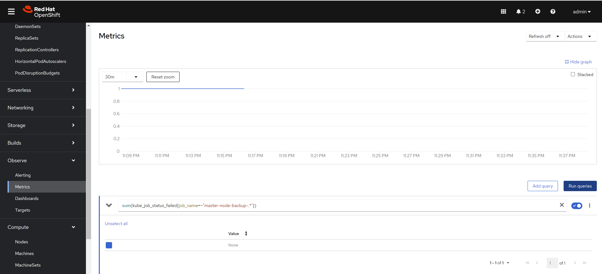
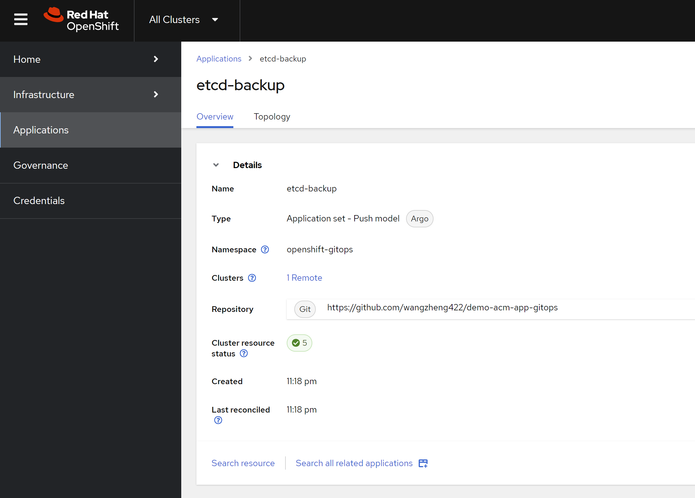
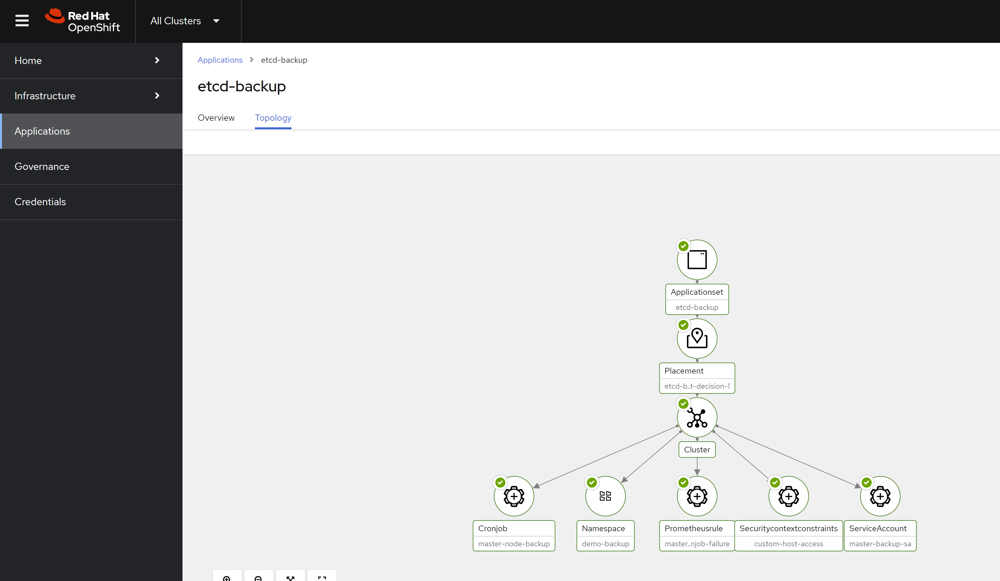

<!-- > [!WARNING]
> working in progress
>  -->
> [!TIP]
> Ongoing and occasional updates and improvements.
# backup etcd with cronjob

There is a common use case to backup etcd data in OpenShift. The etcd data is critical for the cluster, and it is necessary to backup it regularly. In this article, we will introduce how to backup etcd data with cronjob.

First, we check out how to backup etcd in offical openshift document:
- https://docs.redhat.com/en/documentation/openshift_container_platform/4.16/html-single/backup_and_restore/index#backing-up-etcd-data_backup-etcd

we can see, it run command `oc debug node/<node-name> -- chroot /host /usr/local/bin/cluster-backup.sh /home/core/assets/backup` to backup etcd data.

# backup etcd with cronjob

Here, we wrap the command into a job, and run it with cronjob.

```bash

# we will create a namespace for the backup job
VAR_NS='demo-backup'

oc create ns ${VAR_NS}

# we create a service account for the backup job
# and scc with necessary permissions
cat << EOF > ${BASE_DIR}/data/install/etcd-backup-sa.yaml
---
apiVersion: v1
kind: ServiceAccount
metadata:
  name: master-backup-sa
  namespace: ${VAR_NS}  # Adjust as necessary
---
apiVersion: security.openshift.io/v1
kind: SecurityContextConstraints
metadata:
  name: custom-host-access
allowHostDirVolumePlugin: true
allowHostNetwork: true
allowPrivilegedContainer: true
allowPrivilegeEscalation: true
allowedCapabilities:
  - '*'
defaultAddCapabilities: []
requiredDropCapabilities: []
runAsUser:
  type: RunAsAny
seLinuxContext:
  type: RunAsAny
fsGroup:
  type: RunAsAny
supplementalGroups:
  type: RunAsAny
volumes:
  - '*'
users:
  - system:serviceaccount:${VAR_NS}:master-backup-sa
EOF

oc apply -f ${BASE_DIR}/data/install/etcd-backup-sa.yaml

# oc delete -f ${BASE_DIR}/data/install/etcd-backup-sa.yaml


# we create a job to test the etcd backup
cat << EOF > ${BASE_DIR}/data/install/etcd-backup-job.yaml
---
apiVersion: batch/v1
kind: Job
metadata:
  name: master-node-backup
spec:
  template:
    spec:
      serviceAccountName: master-backup-sa  # Use the created Service Account
      hostNetwork: true
      nodeSelector:
        node-role.kubernetes.io/master: ""  # Ensure the Job runs on the master node
      containers:
      - name: cluster-backup
        image: registry.redhat.io/openshift4/ose-cli:latest  # Official OpenShift CLI image
        command: ["/bin/sh", "-c"]
        args:
          - |
            chroot /host /usr/local/bin/cluster-backup.sh /home/core/assets/backup
        securityContext:
          privileged: true
          runAsUser: 0    # Run as root
        volumeMounts:
        - name: host-volume
          mountPath: /host  # Mount the host's root filesystem
      restartPolicy: OnFailure
      volumes:
      - name: host-volume
        hostPath:
          path: /  # Mount the root filesystem of the master node
EOF

oc apply -f ${BASE_DIR}/data/install/etcd-backup-job.yaml -n ${VAR_NS}

# oc delete -f ${BASE_DIR}/data/install/etcd-backup-job.yaml -n ${VAR_NS}


# we wrap the job into cronjob, and run it at mid-night
cat << EOF > ${BASE_DIR}/data/install/etcd-backup-cronjob.yaml
---
apiVersion: batch/v1
kind: CronJob
metadata:
  name: master-node-backup
spec:
  schedule: "0 1 * * *"  # run every mid-night
  jobTemplate:
    spec:
      backoffLimit: 0  # Do not retry on failure
      template:
        spec:
          serviceAccountName: master-backup-sa  # Use the created Service Account
          hostNetwork: true
          nodeSelector:
            node-role.kubernetes.io/master: ""  # Ensure the Job runs on the master node
          containers:
          - name: cluster-backup
            image: registry.redhat.io/openshift4/ose-cli:latest  # Official OpenShift CLI image
            command: ["/bin/sh", "-c"]
            args:
              - |
                chroot /host /usr/local/bin/cluster-backup.sh /home/core/assets/backup
            securityContext:
              privileged: true
              runAsUser: 0    # Run as root
            volumeMounts:
            - name: host-volume
              mountPath: /host  # Mount the host's root filesystem
          restartPolicy: Never # Do not restart containers on failure
          volumes:
          - name: host-volume
            hostPath:
              path: /  # Mount the root filesystem of the master node
EOF

oc apply -f ${BASE_DIR}/data/install/etcd-backup-cronjob.yaml -n ${VAR_NS}

# oc delete -f ${BASE_DIR}/data/install/etcd-backup-cronjob.yaml -n ${VAR_NS}

```

Here, we define the prometheus rule to monitor the backup job. It based on a pre-defined prometheus metrics in openshift.



```yaml
apiVersion: monitoring.coreos.com/v1
kind: PrometheusRule
metadata:
  name: master-node-backup-cronjob-failure
  namespace: openshift-monitoring
spec:
  groups:
  - name: cronjob-failure-alerts
    rules:
    - alert: MasterNodeBackupCronJobFailed
      expr: sum(kube_job_status_failed{job_name=~"master-node-backup-.*"}) > 0
      for: 1d
      labels:
        severity: critical
      annotations:
        summary: "CronJob 'master-node-backup' runs failed"
        description: "CronJob 'master-node-backup' The last run failed. Please check the relevant logs and resources."
```

# deploy using acm

Here we deploy the cronjob using acm, so we can make sure every cluster has the same backup job.

We already created the demo gitops repo, you can check the source code here:
- https://github.com/wangzheng422/demo-acm-app-gitops/tree/main/gitops/etcd-backup





# end