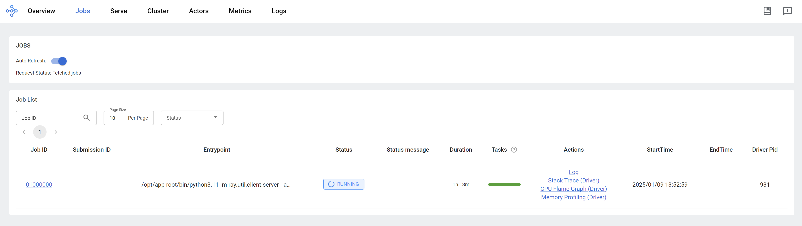

> [!WARNING]
> working in progress
# running llama factory using ray on openshift ai

Customer wants to try running [llama factory](https://github.com/hiyouga/LLaMA-Factory) on OpenShift AI. We know that we can run llama factory on openshift using deployment, but this requires additional configuration like image building and deployment configuration, like setting start up configuration parameters. The most difficult part is to get the master/head's ip address, and set to worker task's parameter to ensure that the workers can communicate with the master node.

> [!NOTE]
> In recently [commits](https://github.com/hiyouga/LLaMA-Factory/issues/6543), llama factory support ray, but with some limitation.

In this artical, we try to set up the openshift ai env, and start a llama factory distribution training task involving deepspeed.

The logic diagram illustrating the process flow for setting up and running LLaMA Factory on OpenShift AI:


The logic diagram illustrating the process flow for setting up and running LLaMA Factory on OpenShift AI with Ray:


We will use such source code, listed here:
- https://github.com/wangzheng422/LLaMA-Factory/tree/wzh-stable/wzh
- [python notebook to run llama factory in python venv mode](./files/ray.notebook/2.5_run.llama.factory.ipynb)
- [python notebook to run llama factory in python direct mode (with deepspeed)](./files/ray.notebook/2.5_run.llama.factory.deepspeed.ipynb)
- [python notebook to run llama factory with build-in ray support](./files/ray.notebook/2.5_run.llama.factory.ray.ipynb)

# run using llama factory offical way

To run llama factory using ray, we need first to understand how to run llama factory. So we try to run llama factory using native method, and get familiar with the llama factory's execution process and its requirements. 

## run directly on os

We try to run everything on a rhel9 linux server. As a best practice, it is better to run everything on a vm, if everything is ok, we can wrap it into a container later.

```bash

# download the model first
dnf install -y conda


mkdir -p /data/env/
conda create -y -p /data/env/hg_cli python=3.11

conda init bash

conda activate /data/env/hg_cli
# conda deactivate

# python -m pip install --upgrade pip setuptools wheel

pip install --upgrade huggingface_hub

# for Maykeye/TinyLLama-v0
VAR_NAME=Maykeye/TinyLLama-v0

VAR_NAME_FULL=${VAR_NAME//\//-}
echo $VAR_NAME_FULL
# THUDM-ChatGLM2-6B

mkdir -p /data/huggingface/${VAR_NAME_FULL}
cd /data/huggingface/${VAR_NAME_FULL}

while true; do
    huggingface-cli download --repo-type model --revision main --cache-dir /data/huggingface/cache --local-dir ./ --local-dir-use-symlinks False --exclude "*.pt"  --resume-download ${VAR_NAME} 
    if [ $? -eq 0 ]; then
        break
    fi
    sleep 1  # Optional: waits for 1 second before trying again
done


# install and try llama factory
mkdir -p /data/git
cd /data/git

git clone -b wzh-stable https://github.com/wangzheng422/LLaMA-Factory

cd /data/git/LLaMA-Factory

pip install -e ".[torch,metrics]"


/bin/rm -rf saves/tinyllama
llamafactory-cli train wzh/tinyllama_lora_sft.yaml

```

## wrap into a container

We can run smoothly on os, now we wrap it into container.

```bash

# build the docker image based on offical pytorch image
cd /data/git/LLaMA-Factory

/bin/rm -rf ./huggingface/Maykeye-TinyLLama-v0
mkdir -p ./huggingface/Maykeye-TinyLLama-v0
/bin/cp -r /data/huggingface/Maykeye-TinyLLama-v0 ./huggingface/Maykeye-TinyLLama-v0

podman build -t quay.io/wangzheng422/qimgs:llama-factory-20241225-v01 -f wzh/cuda.Dockerfile .

podman run --rm -it quay.io/wangzheng422/qimgs:llama-factory-20241225-v01 /bin/bash

podman push quay.io/wangzheng422/qimgs:llama-factory-20241225-v01

```

## try run multiple instances of the LLaMA factory

We have successfully set up the environment and built the container image, next, we will try to run multiple instances of the LLaMA factory using docker/podman.

```bash
# create a pod network
podman network create llama-factory-network --subnet 10.5.0.0/24

podman pod create --name llama-factory-pod --network llama-factory-network

mkdir -p /data/instance/output
mkdir -p /data/instance/saves

# first instance

podman run --rm -it --pod llama-factory-pod \
--network llama-factory-network \
--ip 10.5.0.3 \
-v /data/instance/output:/app/output:Z \
-v /data/instance/saves:/app/saves:Z \
quay.io/wangzheng422/qimgs:llama-factory-20241225-v01 \
/bin/bash

FORCE_TORCHRUN=1 NNODES=2 NODE_RANK=0 MASTER_ADDR=10.5.0.3 MASTER_PORT=29500 NPROC_PER_NODE=1 llamafactory-cli train wzh/tinyllama_lora_sft.yaml


# 2nd instance

podman run --rm -it --pod llama-factory-pod \
--network llama-factory-network \
-v /data/instance/output:/app/output:Z \
-v /data/instance/saves:/app/saves:Z \
quay.io/wangzheng422/qimgs:llama-factory-20241225-v01 \
/bin/bash


FORCE_TORCHRUN=1 NNODES=2 NODE_RANK=1 MASTER_ADDR=10.5.0.3 MASTER_PORT=29500 NPROC_PER_NODE=1 llamafactory-cli train wzh/tinyllama_lora_sft.yaml


```

We can not make it run on multiple nodes, because we do not have nvidia gpu, the torchrun will fallback to MPI, which llama factory seems has bugs, it can not check local rank, all the node will be `rank=0`, which will make the `DistributedDataParallel` failed.

But this will not stop us, our target is to run the multiple node task using `ray job` to manage the distributed training effectively. The job failed does not deter us from exploring alternative solutions.


# run multiple instance using ray based image

We can run llama factory using offical ways. Next, we want to test how to run llama factory using ray platform which is integrated into openshift ai by default.

Llama factory DOSE support ray based on [this issues](https://github.com/hiyouga/LLaMA-Factory/issues/6543), but it is just 2 days ago based on the time of this writing. So we first try to run llama factory using old cli. Later, we will try to run it in native ray way.

## build image

First, we build the Docker image using the ray.dockerfile, which is based on ray upstream docker file, and merge llama factory docker file.

```bash

cd /data/git/LLaMA-Factory

podman build -t quay.io/wangzheng422/qimgs:llama-factory-ray-20250109-v01 -f wzh/ray.dockerfile .


podman run --rm -it quay.io/wangzheng422/qimgs:llama-factory-ray-20250106-v07 /bin/bash


podman push quay.io/wangzheng422/qimgs:llama-factory-ray-20250109-v01

```

using venv, we also try to install llama factory python dependency into a seperate venv.

```bash
cd /data/git/LLaMA-Factory

podman build -t quay.io/wangzheng422/qimgs:llama-factory-ray-20250106-v06 -f wzh/ray.venv.dockerfile .


podman run --rm -it quay.io/wangzheng422/qimgs:llama-factory-ray-20250106-v06 /bin/bash


podman push quay.io/wangzheng422/qimgs:llama-factory-ray-20250106-v06

```

## try to run multipe node

Then, we try to run multiple node using the ray based image, by start multiple container instance.

```bash

# first instance

podman run --rm -it --pod llama-factory-pod \
--network llama-factory-network \
--ip 10.5.0.3 \
-v /data/instance/output:/app/output:Z \
-v /data/instance/saves:/app/saves:Z \
quay.io/wangzheng422/qimgs:llama-factory-ray-20241226-v01 \
/bin/bash

FORCE_TORCHRUN=1 NNODES=2 NODE_RANK=0 MASTER_ADDR=10.5.0.3 MASTER_PORT=29500 NPROC_PER_NODE=1 llamafactory-cli train wzh/tinyllama_lora_sft.yaml


# 2nd instance

podman run --rm -it --pod llama-factory-pod \
--network llama-factory-network \
-v /data/instance/output:/app/output:Z \
-v /data/instance/saves:/app/saves:Z \
quay.io/wangzheng422/qimgs:llama-factory-ray-20241226-v01 \
/bin/bash


FORCE_TORCHRUN=1 NNODES=2 NODE_RANK=1 MASTER_ADDR=10.5.0.3 MASTER_PORT=29500 NPROC_PER_NODE=1 llamafactory-cli train wzh/tinyllama_lora_sft.yaml

```

## try to run in deepspeed

Llama factory embeded deepspeed, so we try to run the training with deepspeed.

```bash

# first instance

podman run --rm -it --pod llama-factory-pod \
--network llama-factory-network \
--ip 10.5.0.3 \
quay.io/wangzheng422/qimgs:llama-factory-ray-20250106-v07 \
/bin/bash

FORCE_TORCHRUN=1 NNODES=2 NODE_RANK=0 MASTER_ADDR=10.5.0.3 MASTER_PORT=29500 NPROC_PER_NODE=1 llamafactory-cli train wzh/tinyllama_lora_sft_dp.yaml


# 2nd instance

podman run --rm -it \
--pod llama-factory-pod \
--network llama-factory-network \
quay.io/wangzheng422/qimgs:llama-factory-ray-20250106-v07 \
/bin/bash


FORCE_TORCHRUN=1 NNODES=2 NODE_RANK=1 MASTER_ADDR=10.5.0.3 MASTER_PORT=29500 NPROC_PER_NODE=1 llamafactory-cli train wzh/tinyllama_lora_sft_dp.yaml


```

The result turns out relative good, we can run llama factory with deepspeed using local podman containers.

<!-- ## try basic ray


 -->


# run llama factory

Now, we try to run with openshift ai. First, create notebook env by launch the jupyter application.


Then, select the `data science` notebook image type.


After entering into jupyter, upload [the example notebook](./files/ray.notebook/2.5_run.llama.factory.deepspeed.ipynb) into the env.


The notebook will create ray cluster, and create job in the ray cluster, it will create 2 actor, and collect ip address of the actors, then it will call actor's function, to start llama factory command line, and then to start the training.

We can see the ray dashboard.





## run llama factory in ray mode

Based on llama factory issue, it supports ray framework, so we can import [this notebook](./files/ray.notebook/2.5_run.llama.factory.ray.ipynb) into jupyter to try it out.

But currently, llama factory only support GPU node, we can not test it on CPU node. But the notebook can run, you can test it on GPU node.


# end