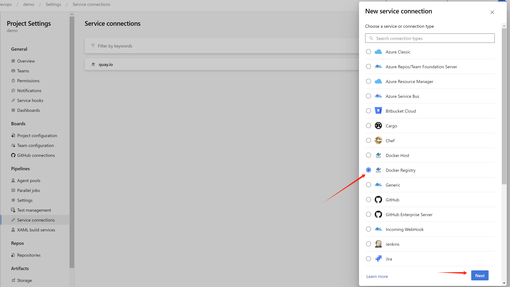

> [!TIP]
> Ongoing and occasional updates and improvements.
# RHDH (redhat developer hub) integration with ADO (azure devops)

In this document, we will show you how to integrate `rhdh` with `ado` (azure devops), and use `azure sso` to login to `rhdh`. As the time of writing, the `rhdh` version is `1.3.1`, we will use `helm` to install `rhdh` in `ocp4.16`.

The architecture is like this:

<!--  -->


> [!NOTE]
> Azure make changes from time to time, so the steps may not be exactly the same as the time of writing, but the general idea is the same.

# pre-requisites

This document assumes you have the following pre-requisites:
- working connected `ocp4.16` cluster
- azure account

# azure sso setup

There is official document for azure sso setup, you can refer to [this link](https://docs.redhat.com/en/documentation/red_hat_developer_hub/1.3/html/authentication/index#assembly-authenticating-with-microsoft-azure).

We need to create 2 `app registration` in azure portal, one for sso login and one for azure devops integration. 


Both `app registration` is created with default settings.


For the sso login `demo-backstage` `app registration`, we set the redirect url to `https://redhat-developer-hub-demo-rhdh.apps.demo-01-rhsys.wzhlab.top/api/auth/microsoft/handler/frame`.


And set the sso login `demo-backstage` `app registration` permission, based on the offical documents.

- email
- offline_access
- openid
- profile
- User.Read


The `app registration` for azure devops integration is `rhdh-azure-devops`, and we keep it as the default settings.

> [!NOTE]
> Write down the `tenant id`, `client id` and `client secret` for both `app registration`, we will use it in the next step.

And for demo purpose, we create several group and users

- L1Support(group)
  - l1.u01(user)
  - l1.u02(user)
- L2Support(group)
  - l2.u01(user)
  - l2.u02(user)
- L3Support(group)
  - l3.u01(user)
  - l3.u02(user)
  
# azure devops setup

<!-- In azure devops settings, import the user of the azure user

 -->

Sometimes, you need to login to `https://dev.azure.com/` to switch to correct `directory`.


You can also access azure devops profile setting page, to have a overview of your organization and projects.


Now, it is time to create a `project` under your `organization`.


And in `organization settings`, you can find the `users` settings, add the `app registration` `rhdh-azure-devops` as a user, and give it `project administator` permission.


Install Code Search Feature for Azure devops


Now, we finished the azure devops setup, and we can move to the next step.

# rhdh setup

We needs some pre-installed plugins related with azure sso and ado, for detailed information, following the [offical docs](https://docs.redhat.com/en/documentation/red_hat_developer_hub/1.3/html/dynamic_plugins_reference/con-preinstalled-dynamic-plugins).

For configuration around azure ado, here is [upstream docs](https://backstage.io/docs/integrations/azure/discovery).

For configuration around azure sso, here is [upstream docs](https://backstage.io/docs/auth/microsoft/provider).

As the time of writing, we install rhdh with version `1.3.1`, and install using helm. You can patch the helm config like this:

```yaml
global:
  # patch the base url
  clusterRouterBase: apps.demo-01-rhsys.wzhlab.top
  # patch for plugins
  dynamic:
    plugins:
      # for azure and ado (azure devops)
      # Azure Devops UI
      # redhat version is too old (0.1.14 by the time of writing), has some compatibility issue with azure devops
      # so we switch to upstream version
      - package: ./dynamic-plugins/dist/backstage-plugin-scaffolder-backend-module-azure-dynamic
        disabled: true
      # https://www.npmjs.com/package/@backstage/plugin-scaffolder-backend-module-azure?activeTab=versions
      - package: '@backstage/plugin-scaffolder-backend-module-azure@0.2.3'
        disabled: false
        integrity: sha512-ZXYsvjPHImrc+qnS4uJjLJ23TUjduVzbQeN9BIIyr+EHMHOWujwFc81Y5F9Gb5dA7ui1o4N5S92ukHQ/9+vCkA==

      # Azure Devops
      - package: ./dynamic-plugins/dist/backstage-plugin-azure-devops
        disabled: false

      # Azure Devops
      - package: ./dynamic-plugins/dist/backstage-plugin-azure-devops-backend-dynamic
        disabled: false

      # MS Graph
      # this is used to import users from azure ad.
      - package: ./dynamic-plugins/dist/backstage-plugin-catalog-backend-module-msgraph-dynamic
        disabled: false

upstream:
  backstage:
    # patch for app config
    extraAppConfig:
      - configMapRef: app-config-rhdh
        filename: app-config-rhdh.yaml
    # patch for secrets
    extraEnvVarsSecrets:
      - wzh-rhdh-credentials

```


After you patch the helm config, the rhdh will deploy a new version, but it will not process, because the new config depends on a configmap, which is not existed right now. We will craete it in the next step.

Set the `wzh-rhdh-credentials` secret with the bash
```bash

NAMESPACES="demo-rhdh"

# create secret based on env variable
# the log level is set to debug, so we can debug the rhdh easily, we can remove it in production.
# the tls_reject
oc delete secret wzh-rhdh-credentials -n $NAMESPACES
oc create secret generic wzh-rhdh-credentials -n $NAMESPACES \
--from-literal=AZURE_TENANT_ID=$AZURE_TENANT_ID \
--from-literal=AZURE_CLIENT_ID=$AZURE_CLIENT_ID \
--from-literal=AZURE_CLIENT_SECRET=$AZURE_CLIENT_SECRET \
--from-literal=AZURE_DEVOPS_TENANT_ID=$AZURE_DEVOPS_TENANT_ID \
--from-literal=AZURE_DEVOPS_CLIENT_ID=$AZURE_DEVOPS_CLIENT_ID \
--from-literal=AZURE_DEVOPS_CLIENT_SECRET=$AZURE_DEVOPS_CLIENT_SECRET \
--from-literal=AZURE_DEVOPS_ORG=$AZURE_DEVOPS_ORG \
--from-literal=SESSION_SECRET=`openssl rand -hex 32` \
--from-literal=NODE_TLS_REJECT_UNAUTHORIZED=0 \
--from-literal=LOG_LEVEL=debug


# create app config
oc delete configmap app-config-rhdh -n $NAMESPACES

cat << EOF > ${BASE_DIR}/data/install/app-config-rhdh.yaml
---
kind: ConfigMap
apiVersion: v1
metadata:
  name: app-config-rhdh
data:
  app-config-rhdh.yaml: |
    app:
      title: WZH Developer Hub

    auth:
      # environment: production
      # using development, will give you guest login options :)
      environment: development
      session:
        secret: \${SESSION_SECRET}
      providers:
        microsoft:
          production:
            clientId: \${AZURE_CLIENT_ID}
            clientSecret: \${AZURE_CLIENT_SECRET}
            tenantId: \${AZURE_TENANT_ID}
          development:
            clientId: \${AZURE_CLIENT_ID}
            clientSecret: \${AZURE_CLIENT_SECRET}
            tenantId: \${AZURE_TENANT_ID}
        guest:
          dangerouslyAllowOutsideDevelopment: true
          userEntityRef: user:default/guest

    signInPage: microsoft

    # use in no-production, to allow all users to login
    # dangerouslyAllowSignInWithoutUserInCatalog: true

    integrations:
      azure:
        - host: dev.azure.com
          credentials:
            # - personalAccessToken: \${AZURE_DEVOPS_PERSONAL_ACCESS_TOKEN}
            #   organizations:
            #     - \$AZURE_DEVOPS_ORG
            - clientId: \${AZURE_DEVOPS_CLIENT_ID}
              clientSecret: \${AZURE_DEVOPS_CLIENT_SECRET}
              tenantId: \${AZURE_DEVOPS_TENANT_ID}
              # organizations:
              #   - \$AZURE_DEVOPS_ORG

    catalog:
      rules:
        - allow: [Component, System, API, Resource, Location, Template]

      locations:
        - target: https://github.com/wangzheng422/red-hat-developer-hub-software-templates/blob/wzh-hack/wzh-data/org.yaml
          type: url
          rules:
            - allow: [Group, User]
        - target: https://github.com/wangzheng422/red-hat-developer-hub-software-templates/blob/wzh-hack/templates/azure/dotnet-frontend/template.yaml
          type: url
          rules:
            - allow: [Template]

      providers:
        microsoftGraphOrg:
          providerId:
            target: https://graph.microsoft.com/v1.0
            tenantId: \${AZURE_TENANT_ID}
            clientId: \${AZURE_CLIENT_ID}
            clientSecret: \${AZURE_CLIENT_SECRET}
            # queryMode: advanced
            # user:
            #   loadPhotos: true
            userGroupMember:
              filter: >
                displayName eq 'L1Support' OR displayName eq 'L2Support' OR displayName eq 'L3Support'
            group:
              filter: >
                displayName eq 'L1Support' OR displayName eq 'L2Support' OR displayName eq 'L3Support'
            schedule:
              frequency: { hours: 1 }
              timeout: { minutes: 50 }
              # frequency: { minutes: 10 }
              # timeout: { minutes: 5 }

        azureDevOps:
          yourProviderId: # identifies your dataset / provider independent of config changes
            organization: \$AZURE_DEVOPS_ORG
            project: '*'
            repository: '*' # this will match all repos 
            path: /catalog-info.yaml
            schedule: # optional; same options as in TaskScheduleDefinition
              # supports cron, ISO duration, "human duration" as used in code
              frequency: { minutes: 30 }
              # supports ISO duration, "human duration" as used in code
              timeout: { minutes: 3 }

    permission:
      enabled: false

    enabled:
      azure: true
      azureDevOps: true
      microsoftGraphOrg: true
      microsoft: true
      permission: false
EOF

oc create -f ${BASE_DIR}/data/install/app-config-rhdh.yaml -n $NAMESPACES

# scale-in and scale-out to restart the rhdh, to apply the new config.
oc scale deployment redhat-developer-hub --replicas=0 -n $NAMESPACES

oc scale deployment redhat-developer-hub --replicas=1 -n $NAMESPACES


# if you want to see the logs and debug
POD_NAME=$(oc get pods --selector=app.kubernetes.io/instance=redhat-developer-hub --output=jsonpath='{.items[0].metadata.name}')

oc logs $POD_NAME | grep --color=always -i 'error' | awk '{print; print "";}'


```

# rhdh demo run through

Login to rhdh, and try to create based on the template.


Input the parameter that defined in the template, in the first page, there is based information for azure devops, which is `organization`, `project`, and the name of the `repository` which will be created. 


In the next page, fill in the component information, like `title`, `owner` which is a azure user, and `system`.


Review the settings, and click the `create` button. It will try to create the azure devops repository.


After the creation, you can see the `repository` is created successfully.


you can also see the `repository` is created in the azure devops.


# source code highlight

Here is the example of the `catalog-info.yaml` file, which is created in the azure devops repository. The source code is here, but it is templatized, you can see the result after the creation here, to help you understand the structure.

```yaml
apiVersion: backstage.io/v1alpha1
kind: Component
metadata:
  name: dummy-repo-01
  title: wzh-demo-component-01
  description: wzh-demo-component-01
  annotations:
    backstage.io/kubernetes-id: dummy-repo-01
    backstage.io/techdocs-ref: dir:.
    dev.azure.com/project-repo: demo/dummy-repo-01
    dev.azure.com/host-org: dev.azure.com/wangzheng422-devops
spec:
  type: website
  system: wzh-demo
  lifecycle: production
  owner: user:default/azure.demo.user.01_wzhlab.top
```

# run the azure devops pipeline

After the repository is created, you can create a pipeline in the azure devops to build and deploy the application.

For free user, we need to change the project/repo into public to run the pipeline with self-host agent.

First we need to active the `public project` in our organization.


Next, we go to a `project` under the organization, and change the project's visibility into `public`.


To run with self-host agent, we need to add agent into a agent pool, we use the build-in agent pool `Default`.


And click the `new agent`, and follow the steps to install the agent on your machine. Here we can see an agent is added into the pool.


The detailed steps to install the agent is popped up.


After created agent, we need to create `quay.io`'s credential in the azure devops, which is used by the pipeline to upload the container image. In azure devops, it is `service connections`. Open `project setting`, and under the `pipeline`, click `service connections`, and click `new service connection`, 


and select `docker registry`.



In the next step, input the following information:

- Docker Registry: `quay.io`
- Docker ID: your quay.io username, a robot account is recommended, which is more secure. 
- Docker Password: your quay.io password
- Service connection name: `quay.io`


Now, we are ready to run the pipeline, first, we need to create a `pipeline` in the azure devops, click `pipelines` in the left menu, and click `new pipeline`.


Select `azure repos git`, because our pipeline definition file is in the azure devops repository.


Next, select the repository that contains the pipeline definition file.


The pipeline definition file is `azure-pipelines.yml`, which is in the root of the repository, and is loaded automatically. Click `run` will run and save the pipeline.

You can check the source code of the `azure-pipelines.yml` file here, and change it based on your own env:
- [azure-pipelines.yml](https://github.com/wangzheng422/red-hat-developer-hub-software-templates/blob/wzh-hack/templates/azure/dotnet-frontend/skeleton/azure-pipelines.yml)


Wait a moment, it will trigger a build on the self-host agent, and the build will be successful. The container image will be uploaded to `quay.io`. Here is the build result. 


And we can see the container image is created on `quay.io`.


Deploy the container image `quay.io/wangzheng422/qimgs:azure-devops-demo-latest` on openshift, expose the service (the app port is default to 5000), and access the application.


The application is running on openshift, and we can access it via the route. It is a very simple dotnet application.

# end