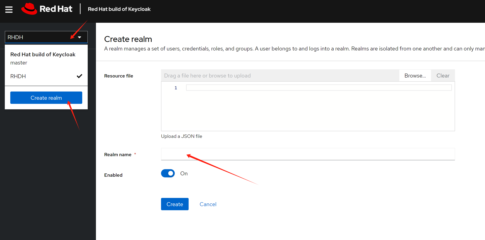
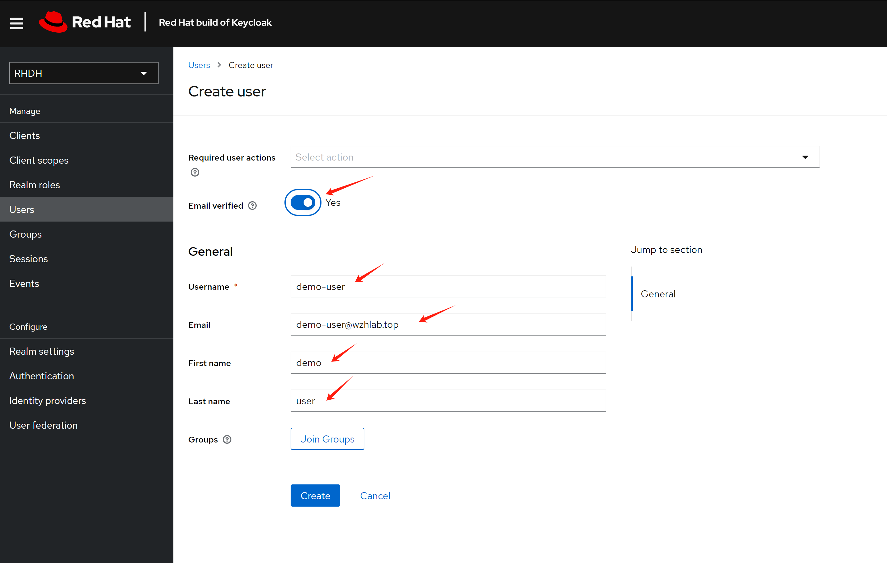
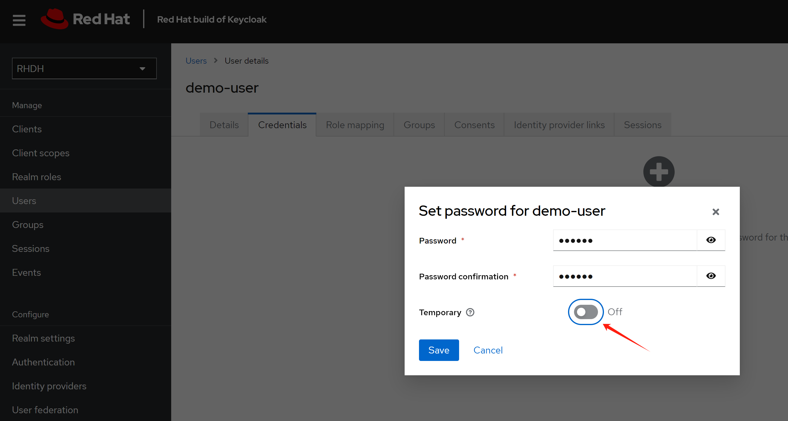
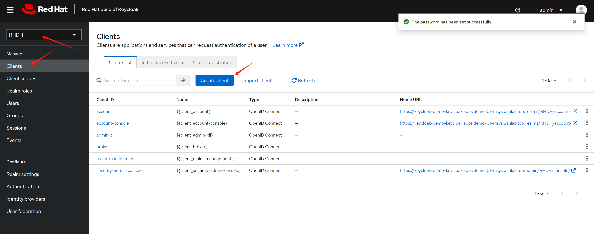
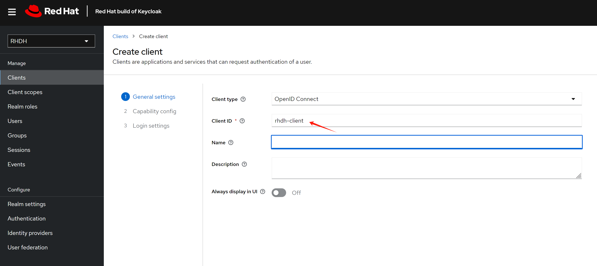
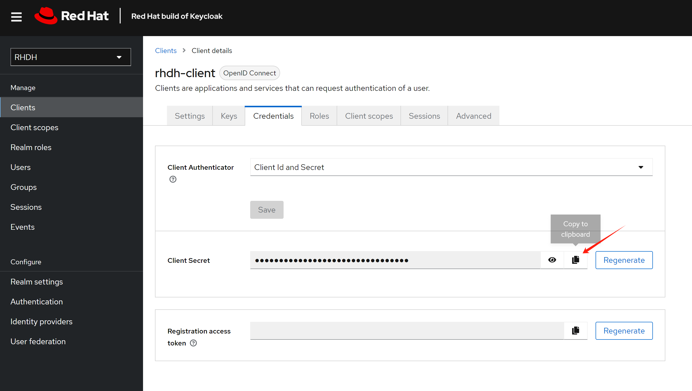
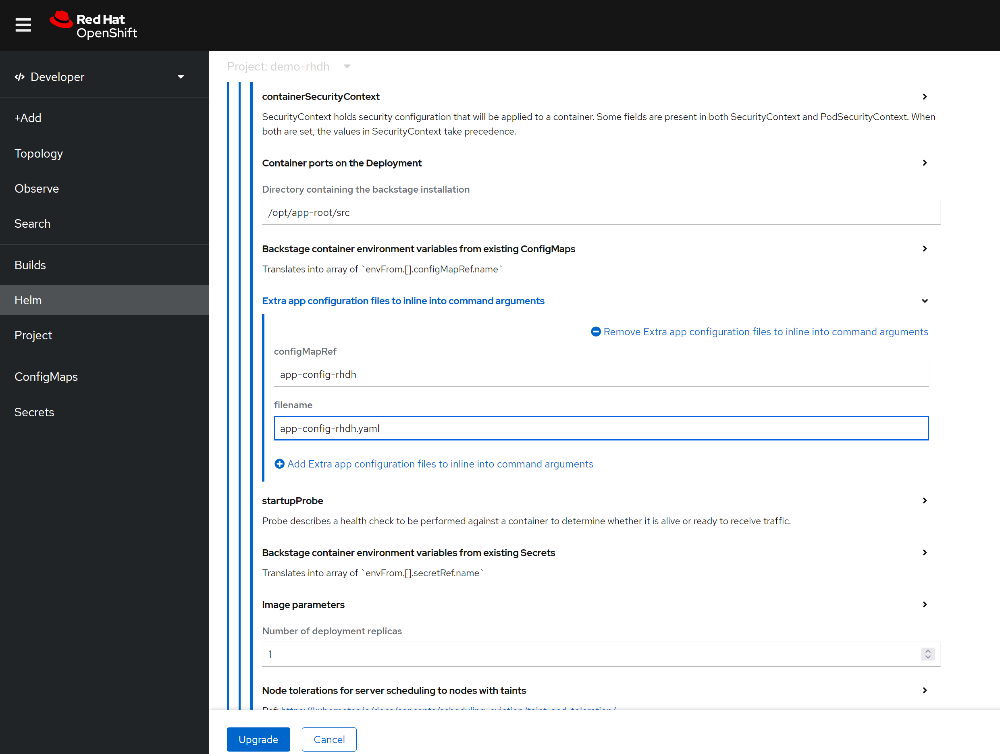

> [!WARNING]
> This is a work in progress.
# rhdh 1.4 with conditional policy permission

Currently, the newest rhdh version 1.4 has a GUI for permission management. It also support conditional policy. However, it has some bugs. This is demo to show how it works, and contains a workaround to add conditional policy permission to rhdh 1.4.

# install rhsso/keycloak

We will use keycloak to manage the user, and use it as the oauth2 provider for the rhdh.


```bash

oc new-project demo-keycloak


oc delete -f ${BASE_DIR}/data/install/keycloak-db-pvc.yaml -n demo-keycloak

cat << EOF > ${BASE_DIR}/data/install/keycloak-db-pvc.yaml
apiVersion: v1
kind: PersistentVolumeClaim
metadata:
  name: postgresql-db-pvc
spec:
  accessModes:
    - ReadWriteOnce
  resources:
    requests:
      storage: 1Gi
EOF

oc create -f ${BASE_DIR}/data/install/keycloak-db-pvc.yaml -n demo-keycloak


oc delete -f ${BASE_DIR}/data/install/keycloak-db.yaml -n demo-keycloak

cat << EOF > ${BASE_DIR}/data/install/keycloak-db.yaml
---
apiVersion: apps/v1
kind: StatefulSet
metadata:
  name: postgresql-db
spec:
  serviceName: postgresql-db-service
  selector:
    matchLabels:
      app: postgresql-db
  replicas: 1
  template:
    metadata:
      labels:
        app: postgresql-db
    spec:
      containers:
        - name: postgresql-db
          image: postgres:15
          args: ["-c", "max_connections=1000"]
          volumeMounts:
            - mountPath: /data
              name: cache-volume
          env:
            - name: POSTGRES_USER
              value: testuser
            - name: POSTGRES_PASSWORD
              value: testpassword
            - name: PGDATA
              value: /data/pgdata
            - name: POSTGRES_DB
              value: keycloak
      volumes:
        - name: cache-volume
          persistentVolumeClaim:
            claimName: postgresql-db-pvc
---
apiVersion: v1
kind: Service
metadata:
  name: postgres-db
spec:
  selector:
    app: postgresql-db
  type: LoadBalancer
  ports:
  - port: 5432
    targetPort: 5432

EOF

oc create -f ${BASE_DIR}/data/install/keycloak-db.yaml -n demo-keycloak


RHSSO_HOST="keycloak-demo-keycloak.apps.demo-01-rhsys.wzhlab.top"

cd ${BASE_DIR}/data/install/

openssl req -subj "/CN=$RHSSO_HOST/O=Test Keycloak./C=US" -newkey rsa:2048 -nodes -keyout key.pem -x509 -days 365 -out certificate.pem

oc delete secret example-tls-secret -n demo-keycloak
oc create secret tls example-tls-secret --cert certificate.pem --key key.pem -n demo-keycloak


oc delete secret keycloak-db-secret -n demo-keycloak
oc create secret generic keycloak-db-secret -n demo-keycloak \
  --from-literal=username=testuser \
  --from-literal=password=testpassword


oc delete -f ${BASE_DIR}/data/install/keycloak.yaml -n demo-keycloak

cat << EOF > ${BASE_DIR}/data/install/keycloak.yaml
apiVersion: k8s.keycloak.org/v2alpha1
kind: Keycloak
metadata:
  name: example-kc
spec:
  instances: 1
  db:
    vendor: postgres
    host: postgres-db
    usernameSecret:
      name: keycloak-db-secret
      key: username
    passwordSecret:
      name: keycloak-db-secret
      key: password
  http:
    tlsSecret: example-tls-secret
  # ingress:
  #   className: openshift-default
  hostname:
    hostname: $RHSSO_HOST
  proxy:
    headers: xforwarded
EOF

oc create -f ${BASE_DIR}/data/install/keycloak.yaml -n demo-keycloak

# get the keycloak initial admin user and password
oc get secret example-kc-initial-admin -n demo-keycloak -o jsonpath='{.data.username}' | base64 --decode && echo
# temp-admin

oc get secret example-kc-initial-admin -n demo-keycloak -o jsonpath='{.data.password}' | base64 --decode && echo
# ef8636f3ba314481bf173e5ca2ac79a7


# in postgresql pod terminal
psql -U testuser -d keycloak
# Type "help" for help.

# keycloak=# SHOW max_connections;
#  max_connections 
# -----------------
#  1000
# (1 row)
```

Base on the demo requirement, we need to create a realm named `RHDH`, which will be used for rhdh later.



Create a test use `demo-user`



Set password for the user


 Make the password not expired.



Create a client for the rhdh, and set the redirect url.






The redirect url looks like this: `https://<RHDH_URL>/api/auth/oidc/handler/frame`


Copy out the client secret, it will used later.



For rhdh 1.4, based on [offical document](https://docs.redhat.com/en/documentation/red_hat_developer_hub/1.4/html/configuring_dynamic_plugins/rhdh-keycloak_title-plugins-rhdh-configure#advanced-configuration)

> When using client credentials, the access type must be set to confidential and service accounts must be enabled. You must also add the following roles from the realm-management client role:
>
> query-groups
> query-users
> qiew-users

If you want to sync user and group using the client, you have to set the client `rhdh-client` with additional steps:

1. enable service account roles


2. add service account roles


# install rhdh

Create a new namespace for rhdh deployment.

```bash
oc new-project demo-rhdh
```

There are 2 ways to install rhdh right now, one is using operator, one is using helm chart. Here we use the helm chart.


# config rhdh
<!-- 
For gitlab, we need to craete a personal access token, and save it to be used later
.


For github, go to developer settings, and add personal access token. Following https://backstage.io/docs/integrations/github/locations , to add authentication. -->

For keycloak
- use chrome to access the webUI
- get the metadataurl from the realm


Now we begin to config the rhdh using cli.

```bash

# for k8s plugin
# let the plugin access k8s resources
oc delete -f ${BASE_DIR}/data/install/role-rhdh.yaml

cat << EOF > ${BASE_DIR}/data/install/role-rhdh.yaml
apiVersion: rbac.authorization.k8s.io/v1
kind: ClusterRole
metadata:
  name: backstage-read-only
rules:
  - apiGroups:
      - '*'
    resources:
      - pods
      - configmaps
      - services
      - deployments
      - replicasets
      - horizontalpodautoscalers
      - ingresses
      - statefulsets
      - limitranges
      - resourcequotas
      - daemonsets
      - pipelineruns
      - taskruns
      - routes
    verbs:
      - get
      - list
      - watch
  - apiGroups:
      - batch
    resources:
      - jobs
      - cronjobs
    verbs:
      - get
      - list
      - watch
  - apiGroups:
      - metrics.k8s.io
    resources:
      - pods
    verbs:
      - get
      - list
EOF
oc apply -f ${BASE_DIR}/data/install/role-rhdh.yaml


NAMESPACES="demo-rhdh"

oc delete -f ${BASE_DIR}/data/install/sa-rhdh.yaml
cat << EOF > ${BASE_DIR}/data/install/sa-rhdh.yaml
---
apiVersion: v1
kind: ServiceAccount
metadata:
  name: backstage-read-only-sa
  namespace: $NAMESPACES  # Replace with the appropriate namespace

---
apiVersion: rbac.authorization.k8s.io/v1
kind: ClusterRoleBinding
metadata:
  name: backstage-read-only-binding
subjects:
  - kind: ServiceAccount
    name: backstage-read-only-sa
    namespace: $NAMESPACES  # Replace with the appropriate namespace
roleRef:
  kind: ClusterRole
  name: backstage-read-only
  apiGroup: rbac.authorization.k8s.io

EOF
oc create -f ${BASE_DIR}/data/install/sa-rhdh.yaml -n $NAMESPACES


# create pvc for rhdh plugin
oc delete -f ${BASE_DIR}/data/install/pvc-rhdh.yaml

cat << EOF > ${BASE_DIR}/data/install/pvc-rhdh.yaml
kind: PersistentVolumeClaim
apiVersion: v1
metadata:
  name: rhdh-plugin
spec:
  accessModes:
    - ReadWriteOnce
  resources:
    requests:
      storage: 10Gi
  # storageClassName: lvms-vg1
  volumeMode: Filesystem
EOF

oc apply -f ${BASE_DIR}/data/install/pvc-rhdh.yaml -n $NAMESPACES


# create token of the sa, and save to variable, expire date is 100 years
SA_TOKEN=`oc create token backstage-read-only-sa --duration=876000h -n $NAMESPACES`

# SECRET_NAME=$(oc get sa backstage-read-only-sa -n $NAMESPACES -o jsonpath='{.secrets[0].name}' )
# SA_TOKEN=$(oc get secret $SECRET_NAME -n $NAMESPACES -o jsonpath='{.data.token}'  | base64 --decode)
echo $SA_TOKEN

# check the expire date of the token
echo $SA_TOKEN | cut -d '.' -f2 | base64 -d | jq -r '.exp' | xargs -I {} date -d @{}
# Sun Jul 23 10:57:39 AM CST 2124

# get env variable for backstage
OCP_NAME="demo-01-rhsys"
OCP_BASE_URL="demo-01-rhsys.wzhlab.top"
OCP_API="https://api.$OCP_BASE_URL:6443"

# GITLAB_BASE_HOST="gitlab-demo-gitlab.apps.$OCP_BASE_URL"
# GITLAB_BASE_URL="https://gitlab-demo-gitlab.apps.$OCP_BASE_URL"
# GITLAB_PAT="<your gitlab personal access token>"
# AUTH_GITLAB_CLIENT_ID="you gitlab client id"
# AUTH_GITLAB_CLIENT_SECRET="you gitlab client secret"

AUTH_KEYCLOAK_CLIENT_ID="rhdh-client"
AUTH_KEYCLOAK_CLIENT_SECRET="<your keycloak client secret>"
KEYCLOAK_BASE_URL="https://keycloak-demo-keycloak.apps.$OCP_BASE_URL"
KEYCLOAK_REALM="RHDH"
KEYCLOAK_PROMPT="auto"

SESSION_SECRET=`openssl rand -hex 32`
# GITHUB_TOKEN="<your github personal access token>"

# ARGOCD_NS="demo-gitops"
# ARGOCD_INSTANCE_NAME="argocd"
# # no ending "/"
# ARGOCD_URL="https://$ARGOCD_INSTANCE_NAME-$ARGOCD_NS.apps.$OCP_BASE_URL"
# # ARGOCD_SECRET="$ARGOCD_INSTANCE_NAME-cluster"
# # ARGOCD_PASSWORD=`oc get secret $ARGOCD_SECRET -n $ARGOCD_NS -o jsonpath='{.data.admin\.password}' | base64 --decode`
# ARGOCD_USER="alice"
# ARGOCD_PASSWORD="redhadocp"
# ARGOCD_TOKEN="<your argocd token>"

# JFROG_URL="http://192.168.50.17:8082"
# JFROG_TOKEN="<your jfrog token>"


# create secret based on env variable
oc delete secret wzh-rhdh-credentials -n $NAMESPACES
oc create secret generic wzh-rhdh-credentials -n $NAMESPACES \
--from-literal=OCP_NAME=$OCP_NAME \
--from-literal=OCP_BASE_URL=$OCP_BASE_URL \
--from-literal=OCP_API=$OCP_API \
--from-literal=AUTH_KEYCLOAK_CLIENT_ID=$AUTH_KEYCLOAK_CLIENT_ID \
--from-literal=AUTH_KEYCLOAK_CLIENT_SECRET=$AUTH_KEYCLOAK_CLIENT_SECRET \
--from-literal=KEYCLOAK_BASE_URL=$KEYCLOAK_BASE_URL \
--from-literal=KEYCLOAK_REALM=$KEYCLOAK_REALM \
--from-literal=KEYCLOAK_PROMPT=$KEYCLOAK_PROMPT \
--from-literal=SESSION_SECRET=$SESSION_SECRET \
--from-literal=SA_TOKEN=$SA_TOKEN


# create app config
oc delete configmap app-config-rhdh -n $NAMESPACES

cat << EOF > ${BASE_DIR}/data/install/app-config-rhdh.yaml
---
kind: ConfigMap
apiVersion: v1
metadata:
  name: app-config-rhdh
data:
  app-config-rhdh.yaml: |
    app:
      title: WZH Developer Hub

    auth:
      # environment: production
      # using development, will give you guest login options :)
      environment: development
      session:
        secret: \${SESSION_SECRET}
      providers:
        oidc:
          # production:
          development:
            clientId: \${AUTH_KEYCLOAK_CLIENT_ID}
            clientSecret: \${AUTH_KEYCLOAK_CLIENT_SECRET}
            metadataUrl: \${KEYCLOAK_BASE_URL}/realms/\${KEYCLOAK_REALM}/.well-known/openid-configuration
            prompt: \${KEYCLOAK_PROMPT} # recommended to use auto
            # Uncomment for additional configuration options 
            # callbackUrl: \${KEYCLOAK_CALLBACK_URL} 
            # tokenEndpointAuthMethod: \${KEYCLOAK_TOKEN_ENDPOINT_METHOD} 
            # tokenSignedResponseAlg: \${KEYCLOAK_SIGNED_RESPONSE_ALG} 
            # scope: \${KEYCLOAK_SCOPE}  
            # If you are using the keycloak-backend plugin, use the preferredUsernameMatchingUserEntityName resolver to avoid a login error.
            signIn:
              resolvers:
                - resolver: preferredUsernameMatchingUserEntityName
        guest:
          dangerouslyAllowOutsideDevelopment: true
          userEntityRef: user:default/static-demo-admin

    signInPage: oidc

    catalog:
      rules:
        - allow: [Component, System, API, Resource, Location, Template]

      locations:
        - target: https://github.com/wangzheng422/docker_env/blob/dev/redhat/ocp4/4.16/files/org.yaml
          type: url
          rules:
            - allow: [Group, User]
        - target: https://github.com/nepdemo/rhdh-book1-templates/blob/wzh/quarkus-with-angular/template.yaml
          type: url
          rules:
            - allow: [Template]
        - target: https://github.com/nepdemo/rhdh-book1-templates/blob/wzh/nestjs-with-postgres/template.yaml
          type: url
          rules:
            - allow: [Template]

      providers:
        keycloakOrg:
          default:
            baseUrl: \${KEYCLOAK_BASE_URL}
            loginRealm: \${KEYCLOAK_REALM}
            realm: \${KEYCLOAK_REALM}
            clientId: \${AUTH_KEYCLOAK_CLIENT_ID}
            clientSecret: \${AUTH_KEYCLOAK_CLIENT_SECRET}
            schedule: # optional; same options as in TaskScheduleDefinition
              # supports cron, ISO duration, "human duration" as used in code
              frequency: { minutes: 1 }
              # supports ISO duration, "human duration" as used in code
              timeout: { minutes: 1 }
              initialDelay: { seconds: 15 }

    kubernetes:
      serviceLocatorMethod:
        type: "multiTenant"
      clusterLocatorMethods:
        - type: "config"
          clusters:
            - name: \${OCP_NAME}
              url: \${OCP_API}
              authProvider: "serviceAccount"
              skipTLSVerify: true
              serviceAccountToken: \${SA_TOKEN}
      customResources:
        - group: 'tekton.dev'
          apiVersion: 'v1'
          plural: 'pipelineruns'
        - group: 'tekton.dev'
          apiVersion: 'v1'
          plural: 'taskruns'
        - group: 'route.openshift.io'
          apiVersion: 'v1'
          plural: 'routes'

    permission:
      enabled: true
      rbac:
        admin:
          users:
            - name: user:default/static-demo-admin
        pluginsWithPermission:
          - catalog
          - scaffolder
          - permission
          - topology
          - kubernetes

    enabled:
      kubernetes: true
      # techdocs: true
      # argocd: true
      # sonarqube: false
      keycloak: true
      keycloakOrg: true
      # ocm: true
      # github: false
      # githubOrg: false
      # gitlab: true
      # jenkins: false
      permission: true
EOF

oc create -f ${BASE_DIR}/data/install/app-config-rhdh.yaml -n $NAMESPACES


oc scale deployment redhat-developer-hub --replicas=0 -n $NAMESPACES

oc scale deployment redhat-developer-hub --replicas=1 -n $NAMESPACES


```


Expand Root Schema → Backstage chart schema → Backstage parameters → Extra app configuration files to inline into command arguments

```yaml
upstream:
  backstage:
    extraAppConfig:
      - configMapRef: app-config-rhdh
        filename: app-config-rhdh.yaml
    # ... other Red Hat Developer Hub Hel
```



Apart from above, you can enable build-in plugins (which is disabled by default), by patch the following to the helm config, just switch to yaml view.

get the digest of the plugin first:

```bash

npm view @wangzheng422/backstage-plugin-scaffolder-backend-module-wzh-custom-actions-dynamic@0.1.9 dist.integrity
# sha512-qglFOgfep5ACQwjVmB3m+GeiOixz5JcrF/0MBiAWTbCGdp0XKIG03owGn+MDo2uxSJLSGmmRYipCQv10Um1/lA==


npm view @wangzheng422/backstage-plugin-scaffolder-backend-module-dummy-wzh-actions-dynamic@0.1.1 dist.integrity
# sha512-d8SGXRkjJExz2mQbzg8+gF3yOIUrgeYgX8+AJ0RR7eaQ46fvYKqiyRLdKjRGwjLVTdkX0PK8NU6C344VyamVUw==

```

```yaml

global:
  dynamic:
    plugins:
      # rbac
      - package: ./dynamic-plugins/dist/backstage-community-plugin-rbac
        disabled: false

      # keycloak
      - package: ./dynamic-plugins/dist/backstage-community-plugin-catalog-backend-module-keycloak-dynamic
        disabled: false

      # for teckton
      - package: ./dynamic-plugins/dist/backstage-community-plugin-tekton
        disabled: false

      # for k8s
      - package: ./dynamic-plugins/dist/backstage-plugin-kubernetes-backend-dynamic
        disabled: false

      # for topology, which integrate ocp webui
      # https://janus-idp.io/plugins/topology/
      - package: ./dynamic-plugins/dist/backstage-community-plugin-topology
        disabled: false

      # for custom actions demo, wrap with dynamic plugin
      # custom action demo ok
      # - package: "@wangzheng422/backstage-plugin-scaffolder-backend-module-wzh-custom-actions-dynamic@0.1.9"
      #   disabled: false
      #   integrity: sha512-qglFOgfep5ACQwjVmB3m+GeiOixz5JcrF/0MBiAWTbCGdp0XKIG03owGn+MDo2uxSJLSGmmRYipCQv10Um1/lA==

```

Summarized, you can patch the helm config like this:

```yaml
global:
  dynamic:
    plugins:
      ......
  # patch the base url
  clusterRouterBase: apps.demo-01-rhsys.wzhlab.top
upstream:
  backstage:
    # patch for app config
    extraAppConfig:
      - configMapRef: app-config-rhdh
        filename: app-config-rhdh.yaml
    # patch for secrets
    extraEnvVarsSecrets:
      - wzh-rhdh-credentials
    extraEnvVars:
      # for https self certificate
      - name: NODE_TLS_REJECT_UNAUTHORIZED
        value: '0'
      # enable debug output
      - name: LOG_LEVEL
        value: debug
    # extraVolumes:
    #   # patch for static pvc
    #   - name: dynamic-plugins-root
    #     persistentVolumeClaim:
    #       claimName: rhdh-plugin
```

# testing with conditional policy

## user and group requirements and workaround

Currently, there are bugs in rhdh 1.4, if a user without group, the conditional policy will not work. For example, catalog-entity will not show if conditional policy is configured.

So, we setup several users, and assign them to a group.


## conditinal policy

1. during log, you can see 2 login options, as configured, one (guest) is for testing admin, you can login without any password, it is idealy when something is broken, and you need to go into system to check something. One is for testing user, it is for normal user login test. After initial configuration, the guest login should be removed.


2. We login using the `guest`, which is linked to admin user and role, and in the policy we can see a build in policy is alread created for me, and it is not editable.


And you can see the 2 policy created.


3. We create addtional policy with access rule. Open the rule, and we can see it contains name, description, user/group, and permission.


Edit the permission, you can select which target plugin resources to control, and what kind of actions it can perform.


For the condition, you can control the user/group can only access part of the target resource.


## result

After the permission is granted, the use can see, or can not see the resources in catalog.

# end