# Compliance Operator Usage Guide

OpenShift 4 includes a powerful Compliance Operator that helps organizations monitor and enforce security compliance policies across the cluster. This operator implements industry-standard security benchmarks and provides mechanisms to assess your cluster's compliance status and remediate issues.

While the Compliance Operator offers robust functionality, it can be challenging to use effectively due to its complex configuration requirements and the technical nature of compliance standards. This guide aims to simplify the process and provide clear instructions for implementing compliance scanning in your OpenShift environment.

Video Explanation:

[<kbd>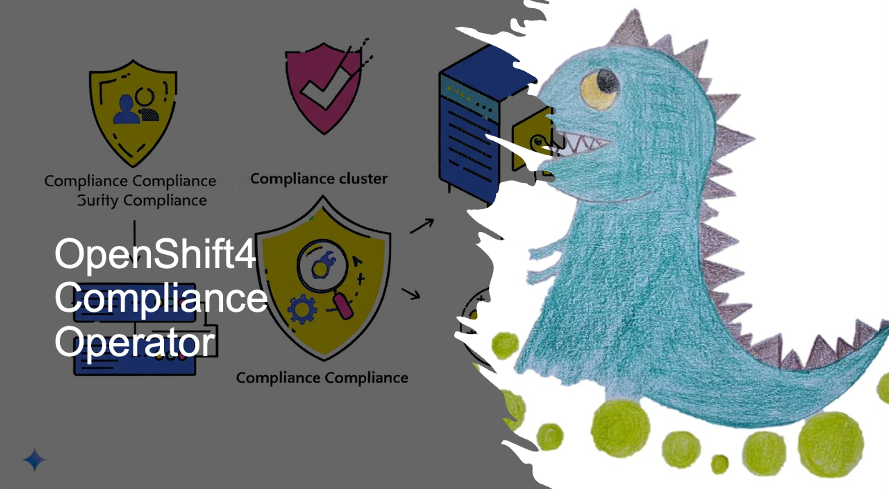</kbd>](https://youtu.be/fClC57NIIBY)

- [youtube (en)](https://youtu.be/fClC57NIIBY)
- [bilibili (中文)](https://www.bilibili.com/video/BV12RX3YJEtn/)

## Understanding the Compliance Operator Architecture (AIGC)

The Compliance Operator works with several custom resources that interact to provide a complete compliance solution:

1. **ProfileBundle**: Contains compliance content from security standards (like CIS, NIST, STIG)
2. **Profile**: Represents a specific security standard implementation (e.g., ocp4-cis)
3. **Rule**: Individual compliance checks that are evaluated during scans
4. **Variable**: Customizable parameters that can be adjusted to meet specific requirements
5. **ScanSetting**: Defines how scans should be executed (schedule, storage, etc.)
6. **ScanSettingBinding**: Links profiles to scan settings to create a compliance suite
7. **TailoredProfile**: A customized version of a standard profile with specific rule or variable adjustments

When a scan runs, it creates runtime resources:

1. **ComplianceSuite**: Collection of scans created from a ScanSettingBinding
2. **ComplianceScan**: Individual scan execution for a specific profile
3. **ComplianceCheckResult**: Results of individual rule evaluations (pass/fail)
4. **ComplianceRemediation**: Auto-fix options for failed checks

The diagram below illustrates how these components interact:

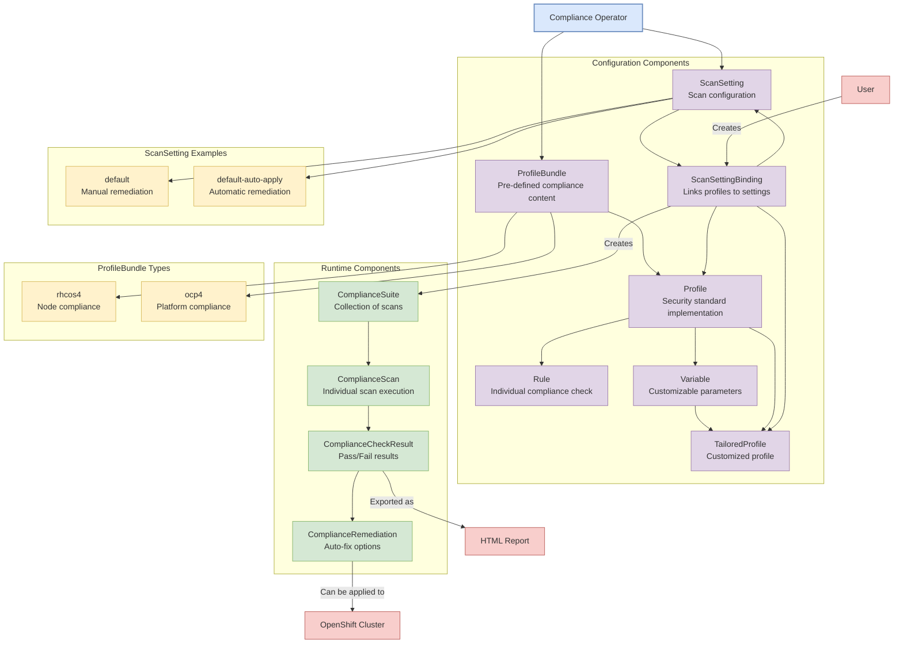


# deploy compliance-operator

Select the `compliance operator` from the list of available operators and click on it to deploy it.
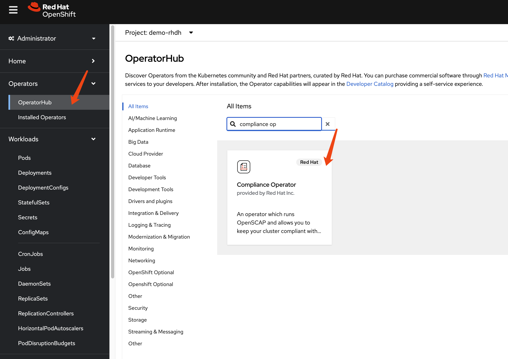

Accept the default settings and click on `Install` to start the installation process.
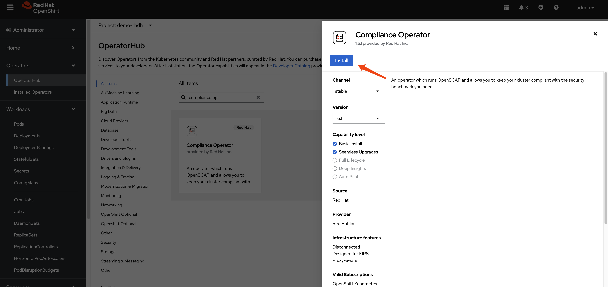

Continue with the installation until it is complete.

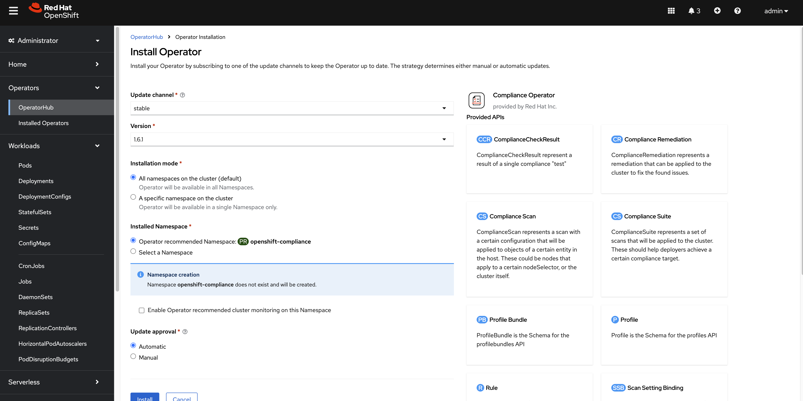

After the installation is complete, you can access the operator dashboard. In the `all instances` section, you can see a list of all the instances that have been deployed. We filter out `profile bundle` and `scan setting`, and we can see there are 2 instances each of them deployed.


## Understanding the Default ProfileBundles

The Compliance Operator automatically creates two ProfileBundles:

1. **rhcos4**: Contains compliance content for Red Hat CoreOS nodes
2. **ocp4**: Contains compliance content for the OpenShift Container Platform

Let's examine the `rhcos4` ProfileBundle:
```yaml
apiVersion: compliance.openshift.io/v1alpha1
kind: ProfileBundle
metadata:
  finalizers:
    - profilebundle.finalizers.compliance.openshift.io
  name: rhcos4
  namespace: openshift-compliance
spec:
  contentFile: ssg-rhcos4-ds.xml
  contentImage: 'registry.redhat.io/compliance/openshift-compliance-content-rhel8@sha256:b286929357b82f8ff3845f535bab23382bf06f075ff2379063e2456f1a93e809'
status:
  conditions:
    - lastTransitionTime: '2025-03-11T15:54:42Z'
      message: Profile bundle successfully parsed
      reason: Valid
      status: 'True'
      type: Ready
  dataStreamStatus: VALID
```

`profile bundle` definition for `ocp4`:
```yaml
apiVersion: compliance.openshift.io/v1alpha1
kind: ProfileBundle
metadata:
  finalizers:
    - profilebundle.finalizers.compliance.openshift.io
  name: ocp4
  namespace: openshift-compliance
spec:
  contentFile: ssg-ocp4-ds.xml
  contentImage: 'registry.redhat.io/compliance/openshift-compliance-content-rhel8@sha256:b286929357b82f8ff3845f535bab23382bf06f075ff2379063e2456f1a93e809'
status:
  conditions:
    - lastTransitionTime: '2025-03-11T15:53:55Z'
      message: Profile bundle successfully parsed
      reason: Valid
      status: 'True'
      type: Ready
  dataStreamStatus: VALID
```

## Understanding the Default ScanSettings

The Compliance Operator creates two default ScanSettings:

1. **default**: Configures scans with manual remediation (you must apply remediations yourself)
2. **default-auto-apply**: Configures scans with automatic remediation (remediations are applied automatically)

Let's examine the `default` ScanSetting:
```yaml
timeout: 30m
strictNodeScan: true
metadata:
  name: default
  namespace: openshift-compliance
kind: ScanSetting
showNotApplicable: false
rawResultStorage:
  nodeSelector:
    node-role.kubernetes.io/master: ''
  pvAccessModes:
    - ReadWriteOnce
  rotation: 3
  size: 1Gi
  tolerations:
    - effect: NoSchedule
      key: node-role.kubernetes.io/master
      operator: Exists
    - effect: NoExecute
      key: node.kubernetes.io/not-ready
      operator: Exists
      tolerationSeconds: 300
    - effect: NoExecute
      key: node.kubernetes.io/unreachable
      operator: Exists
      tolerationSeconds: 300
    - effect: NoSchedule
      key: node.kubernetes.io/memory-pressure
      operator: Exists
schedule: 0 1 * * *
suspend: false
roles:
  - master
  - worker
apiVersion: compliance.openshift.io/v1alpha1
maxRetryOnTimeout: 3
scanTolerations:
  - operator: Exists
```

`scan setting` definition for `default-auto-apply`:
```yaml
timeout: 30m
autoUpdateRemediations: true
strictNodeScan: true
autoApplyRemediations: true
metadata:
  name: default-auto-apply
  namespace: openshift-compliance
kind: ScanSetting
showNotApplicable: false
rawResultStorage:
  nodeSelector:
    node-role.kubernetes.io/master: ''
  pvAccessModes:
    - ReadWriteOnce
  rotation: 3
  size: 1Gi
  tolerations:
    - effect: NoSchedule
      key: node-role.kubernetes.io/master
      operator: Exists
    - effect: NoExecute
      key: node.kubernetes.io/not-ready
      operator: Exists
      tolerationSeconds: 300
    - effect: NoExecute
      key: node.kubernetes.io/unreachable
      operator: Exists
      tolerationSeconds: 300
    - effect: NoSchedule
      key: node.kubernetes.io/memory-pressure
      operator: Exists
schedule: 0 1 * * *
suspend: false
roles:
  - master
  - worker
apiVersion: compliance.openshift.io/v1alpha1
maxRetryOnTimeout: 3
scanTolerations:
  - operator: Exists
```

There are many other kind of resources predefined.

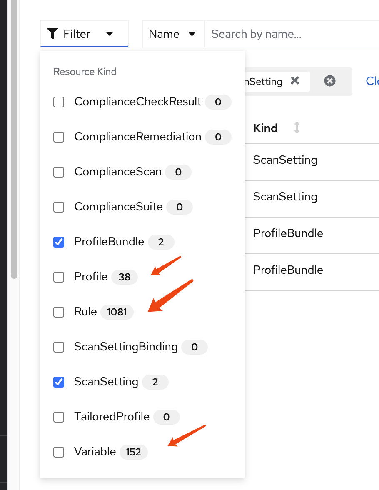

## Understanding Compliance Profiles

The Compliance Operator provides numerous pre-defined profiles that implement various security standards. These profiles are categorized by:

1. **Standard type**: CIS, NIST, PCI-DSS, STIG, etc.
2. **Target**: Platform (ocp4-*) or Node (rhcos4-*)
3. **Security level**: moderate, high, etc.

Let's examine the available profiles:

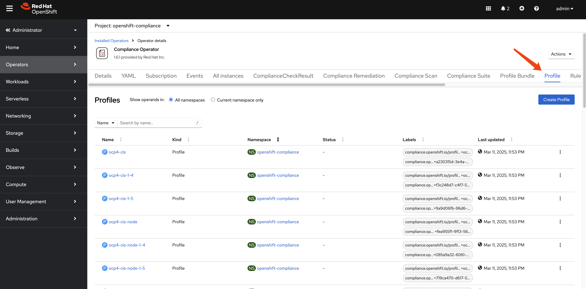


```bash
oc get Profile -A
# NAMESPACE              NAME                       AGE   VERSION
# openshift-compliance   ocp4-cis                   10h   1.5.0
# openshift-compliance   ocp4-cis-1-4               10h   1.4.0
# openshift-compliance   ocp4-cis-1-5               10h   1.5.0
# openshift-compliance   ocp4-cis-node              10h   1.5.0
# openshift-compliance   ocp4-cis-node-1-4          10h   1.4.0
# openshift-compliance   ocp4-cis-node-1-5          10h   1.5.0
# openshift-compliance   ocp4-e8                    10h
# openshift-compliance   ocp4-high                  10h   Revision 4
# openshift-compliance   ocp4-high-node             10h   Revision 4
# openshift-compliance   ocp4-high-node-rev-4       10h   Revision 4
# openshift-compliance   ocp4-high-rev-4            10h   Revision 4
# openshift-compliance   ocp4-moderate              10h   Revision 4
# openshift-compliance   ocp4-moderate-node         10h   Revision 4
# openshift-compliance   ocp4-moderate-node-rev-4   10h   Revision 4
# openshift-compliance   ocp4-moderate-rev-4        10h   Revision 4
# openshift-compliance   ocp4-nerc-cip              10h
# openshift-compliance   ocp4-nerc-cip-node         10h
# openshift-compliance   ocp4-pci-dss               10h   3.2.1
# openshift-compliance   ocp4-pci-dss-3-2           10h   3.2.1
# openshift-compliance   ocp4-pci-dss-4-0           10h   4.0.0
# openshift-compliance   ocp4-pci-dss-node          10h   3.2.1
# openshift-compliance   ocp4-pci-dss-node-3-2      10h   3.2.1
# openshift-compliance   ocp4-pci-dss-node-4-0      10h   4.0.0
# openshift-compliance   ocp4-stig                  10h   V2R1
# openshift-compliance   ocp4-stig-node             10h   V2R1
# openshift-compliance   ocp4-stig-node-v1r1        10h   V1R1
# openshift-compliance   ocp4-stig-node-v2r1        10h   V2R1
# openshift-compliance   ocp4-stig-v1r1             10h   V1R1
# openshift-compliance   ocp4-stig-v2r1             10h   V2R1
# openshift-compliance   rhcos4-e8                  10h
# openshift-compliance   rhcos4-high                10h   Revision 4
# openshift-compliance   rhcos4-high-rev-4          10h   Revision 4
# openshift-compliance   rhcos4-moderate            10h   Revision 4
# openshift-compliance   rhcos4-moderate-rev-4      10h   Revision 4
# openshift-compliance   rhcos4-nerc-cip            10h
# openshift-compliance   rhcos4-stig                10h   V2R1
# openshift-compliance   rhcos4-stig-v1r1           10h   V1R1
# openshift-compliance   rhcos4-stig-v2r1           10h   V2R1

```

And the detail of an profile of `ocp4-cis`, we can see it references to many rules.

```yaml
apiVersion: compliance.openshift.io/v1alpha1
description: 'This profile defines a baseline that aligns to the Center for Internet Security® Red Hat OpenShift Container Platform 4 Benchmark™, V1.5. This profile includes Center for Internet Security® Red Hat OpenShift Container Platform 4 CIS Benchmarks™ content. Note that this part of the profile is meant to run on the Platform that Red Hat OpenShift Container Platform 4 runs on top of. This profile is applicable to OpenShift versions 4.12 and greater.'
id: xccdf_org.ssgproject.content_profile_cis
kind: Profile
metadata:
  annotations:
    compliance.openshift.io/image-digest: pb-ocp4m2njf
    compliance.openshift.io/product: redhat_openshift_container_platform_4.1
    compliance.openshift.io/product-type: Platform
  name: ocp4-cis
  namespace: openshift-compliance
  labels:
    compliance.openshift.io/profile-bundle: ocp4
    compliance.openshift.io/profile-guid: a230315d-3e4a-5b58-b00f-f96f1553e036
rules:
  - ocp4-accounts-restrict-service-account-tokens
  - ocp4-accounts-unique-service-account
  - ocp4-api-server-admission-control-plugin-alwaysadmit
  - ocp4-api-server-admission-control-plugin-alwayspullimages
  - ocp4-api-server-admission-control-plugin-namespacelifecycle
  - ocp4-api-server-admission-control-plugin-noderestriction
  - ocp4-api-server-admission-control-plugin-scc
  - ocp4-api-server-admission-control-plugin-service-account
  - ocp4-api-server-anonymous-auth
  - ocp4-api-server-audit-log-maxbackup
  - ocp4-api-server-audit-log-maxsize
  - ocp4-api-server-audit-log-path
  - ocp4-api-server-auth-mode-no-aa
  - ocp4-api-server-auth-mode-rbac
  - ocp4-api-server-basic-auth
  - ocp4-api-server-bind-address
  - ocp4-api-server-client-ca
  - ocp4-api-server-encryption-provider-cipher
  - ocp4-api-server-etcd-ca
  - ocp4-api-server-etcd-cert
  - ocp4-api-server-etcd-key
  - ocp4-api-server-https-for-kubelet-conn
  - ocp4-api-server-insecure-bind-address
  - ocp4-api-server-kubelet-certificate-authority
  - ocp4-api-server-kubelet-client-cert
  - ocp4-api-server-kubelet-client-cert-pre-4-9
  - ocp4-api-server-kubelet-client-key
  - ocp4-api-server-kubelet-client-key-pre-4-9
  - ocp4-api-server-oauth-https-serving-cert
  - ocp4-api-server-openshift-https-serving-cert
  - ocp4-api-server-profiling-protected-by-rbac
  - ocp4-api-server-request-timeout
  - ocp4-api-server-service-account-lookup
  - ocp4-api-server-service-account-public-key
  - ocp4-api-server-tls-cert
  - ocp4-api-server-tls-cipher-suites
  - ocp4-api-server-tls-private-key
  - ocp4-api-server-token-auth
  - ocp4-audit-log-forwarding-enabled
  - ocp4-audit-log-forwarding-webhook
  - ocp4-audit-logging-enabled
  - ocp4-audit-profile-set
  - ocp4-configure-network-policies
  - ocp4-configure-network-policies-hypershift-hosted
  - ocp4-configure-network-policies-namespaces
  - ocp4-controller-insecure-port-disabled
  - ocp4-controller-secure-port
  - ocp4-controller-service-account-ca
  - ocp4-controller-service-account-private-key
  - ocp4-controller-use-service-account
  - ocp4-etcd-auto-tls
  - ocp4-etcd-cert-file
  - ocp4-etcd-client-cert-auth
  - ocp4-etcd-key-file
  - ocp4-etcd-peer-auto-tls
  - ocp4-etcd-peer-cert-file
  - ocp4-etcd-peer-client-cert-auth
  - ocp4-etcd-peer-key-file
  - ocp4-file-groupowner-proxy-kubeconfig
  - ocp4-file-owner-proxy-kubeconfig
  - ocp4-file-permissions-proxy-kubeconfig
  - ocp4-general-apply-scc
  - ocp4-general-default-namespace-use
  - ocp4-general-default-seccomp-profile
  - ocp4-general-namespaces-in-use
  - ocp4-idp-is-configured
  - ocp4-kubeadmin-removed
  - ocp4-kubelet-configure-tls-cert
  - ocp4-kubelet-configure-tls-cipher-suites-ingresscontroller
  - ocp4-kubelet-configure-tls-key
  - ocp4-kubelet-disable-readonly-port
  - ocp4-ocp-allowed-registries
  - ocp4-ocp-allowed-registries-for-import
  - ocp4-ocp-api-server-audit-log-maxbackup
  - ocp4-ocp-api-server-audit-log-maxsize
  - ocp4-ocp-insecure-allowed-registries-for-import
  - ocp4-ocp-insecure-registries
  - ocp4-openshift-api-server-audit-log-path
  - ocp4-rbac-debug-role-protects-pprof
  - ocp4-rbac-least-privilege
  - ocp4-rbac-limit-cluster-admin
  - ocp4-rbac-limit-secrets-access
  - ocp4-rbac-pod-creation-access
  - ocp4-rbac-wildcard-use
  - ocp4-scc-drop-container-capabilities
  - ocp4-scc-limit-container-allowed-capabilities
  - ocp4-scc-limit-ipc-namespace
  - ocp4-scc-limit-net-raw-capability
  - ocp4-scc-limit-network-namespace
  - ocp4-scc-limit-privilege-escalation
  - ocp4-scc-limit-privileged-containers
  - ocp4-scc-limit-process-id-namespace
  - ocp4-scc-limit-root-containers
  - ocp4-scheduler-profiling-protected-by-rbac
  - ocp4-scheduler-service-protected-by-rbac
  - ocp4-secrets-consider-external-storage
  - ocp4-secrets-no-environment-variables
  - ocp4-version-detect-in-hypershift
  - ocp4-version-detect-in-ocp
title: CIS Red Hat OpenShift Container Platform 4 Benchmark
version: 1.5.0
```

There are many `rule` predefined.

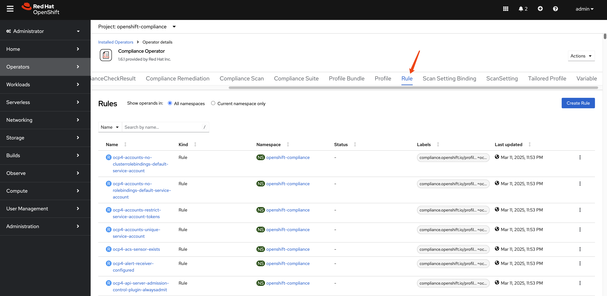

The total number of `rule` is around **1082**.

```bash
oc get Rule -A | wc -l
# 1082
```

Let's see an example of `rule`: `ocp4-kubeadmin-removed`

```yaml
checkType: Platform
instructions: |-
  To verify that the kubeadmin secret has been deleted, make sure
  that oc get secrets kubeadmin -n kube-system
  returns a NotFound error.
  Is it the case that the kubeadmin secret has not been deleted?
metadata:
  annotations:
    policies.open-cluster-management.io/standards: 'NERC-CIP,NIST-800-53,PCI-DSS,STIG,CIS-OCP,PCI-DSS-4-0'
    control.compliance.openshift.io/PCI-DSS-4-0: 2.2.1;2.2.2;2.2;8.2.2;8.2;8.3
    compliance.openshift.io/profiles: 'ocp4-stig,ocp4-moderate-rev-4,ocp4-cis-1-5,ocp4-pci-dss,ocp4-cis,ocp4-stig-v1r1,ocp4-pci-dss-4-0,ocp4-nerc-cip,ocp4-pci-dss-3-2,ocp4-high,ocp4-stig-v2r1,ocp4-cis-1-4,ocp4-high-rev-4,ocp4-moderate'
    control.compliance.openshift.io/CIS-OCP: 3.1.1;5.1.1
    policies.open-cluster-management.io/controls: 'CIP-004-6 R2.2.2,CIP-004-6 R2.2.3,CIP-007-3 R.1.3,CIP-007-3 R2,CIP-007-3 R5,CIP-007-3 R5.1.1,CIP-007-3 R5.1.3,CIP-007-3 R5.2.1,CIP-007-3 R5.2.3,CIP-007-3 R6.1,CIP-007-3 R6.2,CIP-007-3 R6.3,CIP-007-3 R6.4,AC-2(2),AC-2(7),AC-2(9),AC-2(10),AC-12(1),IA-2(5),MA-4,SC-12(1),Req-2.1,SRG-APP-000023-CTR-000055,3.1.1,5.1.1,2.2.1,2.2.2,2.2,8.2.2,8.2,8.3,CNTR-OS-000030,CNTR-OS-000040,CNTR-OS-000440'
    control.compliance.openshift.io/STIG: SRG-APP-000023-CTR-000055;CNTR-OS-000030;CNTR-OS-000040;CNTR-OS-000440
    control.compliance.openshift.io/NIST-800-53: AC-2(2);AC-2(7);AC-2(9);AC-2(10);AC-12(1);IA-2(5);MA-4;SC-12(1)
    control.compliance.openshift.io/NERC-CIP: CIP-004-6 R2.2.2;CIP-004-6 R2.2.3;CIP-007-3 R.1.3;CIP-007-3 R2;CIP-007-3 R5;CIP-007-3 R5.1.1;CIP-007-3 R5.1.3;CIP-007-3 R5.2.1;CIP-007-3 R5.2.3;CIP-007-3 R6.1;CIP-007-3 R6.2;CIP-007-3 R6.3;CIP-007-3 R6.4
    compliance.openshift.io/image-digest: pb-ocp4m2njf
    control.compliance.openshift.io/PCI-DSS: Req-2.1
    compliance.openshift.io/rule: kubeadmin-removed
  name: ocp4-kubeadmin-removed
  namespace: openshift-compliance
  ownerReferences:
    - apiVersion: compliance.openshift.io/v1alpha1
      blockOwnerDeletion: true
      controller: true
      kind: ProfileBundle
      name: ocp4
      uid: a7e06c24-12d2-4f21-97bd-a59b5d158f3b
  labels:
    compliance.openshift.io/profile-bundle: ocp4
kind: Rule
rationale: |-
  The kubeadmin user has an auto-generated password and a self-signed certificate, and has effectively

  cluster-admin

  permissions; therefore, it's considered a security liability.
title: Ensure that the kubeadmin secret has been removed
id: xccdf_org.ssgproject.content_rule_kubeadmin_removed
description: |-
  The kubeadmin user is meant to be a temporary user used for bootstrapping purposes. It is preferable to assign system administrators whose users are backed by an Identity Provider.

  Make sure to remove the user as described in the documentation ( https://docs.openshift.com/container-platform/latest/authentication/remove-kubeadmin.html )
severity: medium
apiVersion: compliance.openshift.io/v1alpha1
```

There are also many `variables` defined.

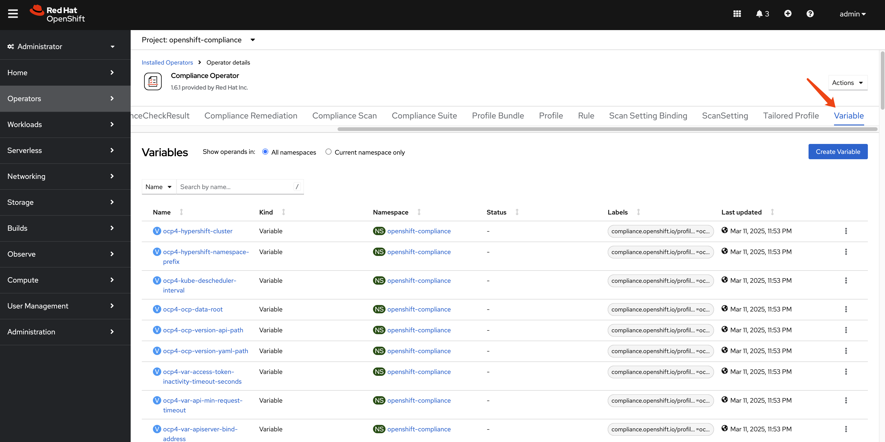

And the total number of variables is around 153.  

```bash
oc get Variables -A | wc -l
# 153
```

Let's look at the `Variables`: `rhcos4-sshd-idle-timeout-value` in detail. The `variables` is used with `TailoredProfiles` to customize the behavior of the profile. For example, the `rhcos4-sshd-idle-timeout-value` variable is used to set the idle timeout for SSH connections on Red Hat Enterprise Linux CoreOS (RHCOS) 4.

```yaml
selections:
  - description: 10_minutes
    value: '600'
  - description: 120_minutes
    value: '7200'
  - description: 14_minutes
    value: '840'
  - description: 15_minutes
    value: '900'
  - description: 30_minutes
    value: '1800'
  - description: 5_minutes
    value: '300'
  - description: 60_minutes
    value: '3600'
metadata:
  annotations:
    compliance.openshift.io/image-digest: pb-rhcos4s7b7g
  name: rhcos4-sshd-idle-timeout-value
  namespace: openshift-compliance
  ownerReferences:
    - apiVersion: compliance.openshift.io/v1alpha1
      blockOwnerDeletion: true
      controller: true
      kind: ProfileBundle
      name: rhcos4
      uid: 648c319d-7378-4474-9f0c-6f1a5f536bfb
  labels:
    compliance.openshift.io/profile-bundle: rhcos4
value: '300'
kind: Variable
title: SSH session Idle time
type: number
id: xccdf_org.ssgproject.content_value_sshd_idle_timeout_value
description: Specify duration of allowed idle time.
apiVersion: compliance.openshift.io/v1alpha1
```

# Running Compliance Scans

Now that we understand the components of the Compliance Operator, let's run a scan to assess our cluster's compliance status. The process involves creating a ScanSettingBinding that connects profiles to scan settings.

## Creating a ScanSettingBinding

To run a scan, we need to create a ScanSettingBinding that specifies:
1. Which profiles to scan against (in this case, we'll use CIS benchmarks)
2. Which scan settings to use (we'll use the default settings for manual remediation)

Here's an example ScanSettingBinding that will scan both the OpenShift platform and nodes against CIS benchmarks:

```yaml
apiVersion: compliance.openshift.io/v1alpha1
kind: ScanSettingBinding
metadata:
  name: cis-compliance
  namespace: openshift-compliance
profiles:
  - name: ocp4-cis-node
    kind: Profile
    apiGroup: compliance.openshift.io/v1alpha1
  - name: ocp4-cis
    kind: Profile
    apiGroup: compliance.openshift.io/v1alpha1
settingsRef:
  name: default
  kind: ScanSetting
  apiGroup: compliance.openshift.io/v1alpha1
```

Navigate to `scan setting binding` section and click on the `Add Scan Setting Binding` button.

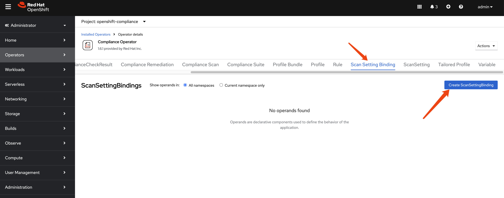

Past the example `scan setting binding` yaml file.


After the `scan setting binding` is created, we can see there are many pods created to carry out the scan.

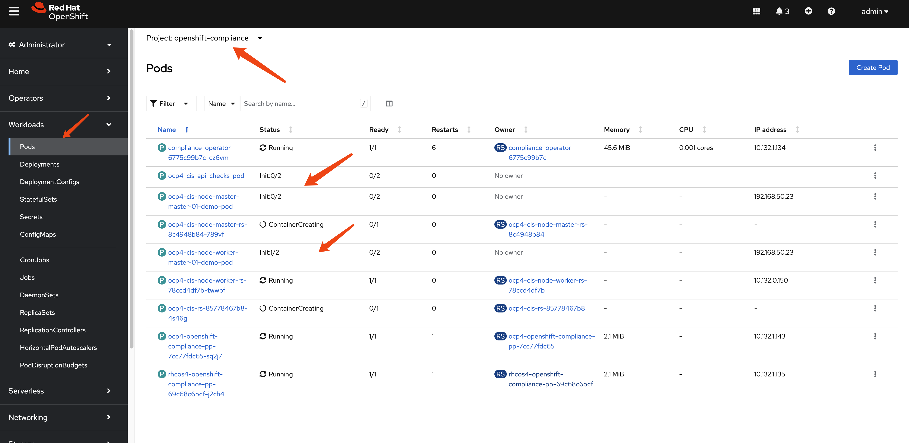

## Understanding Scan Results

After creating the ScanSettingBinding, the Compliance Operator will:
1. Create a ComplianceSuite resource
2. Create ComplianceScan resources for each profile
3. Deploy scan pods to evaluate compliance rules
4. Store results as ComplianceCheckResult resources
5. Generate ComplianceRemediation resources for failed checks

Wait a moment for the scan to complete. You'll see the scan pods running and then completing:


Once complete, the results are created in the format of Custom Resources (CRs):

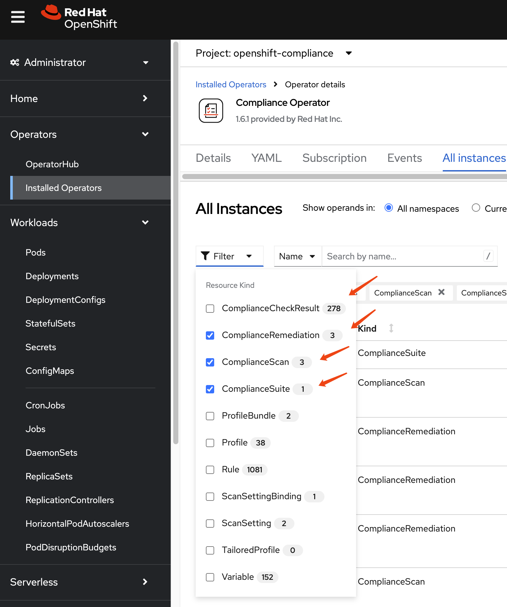

Let's examine these results in detail by filtering for specific resource types:

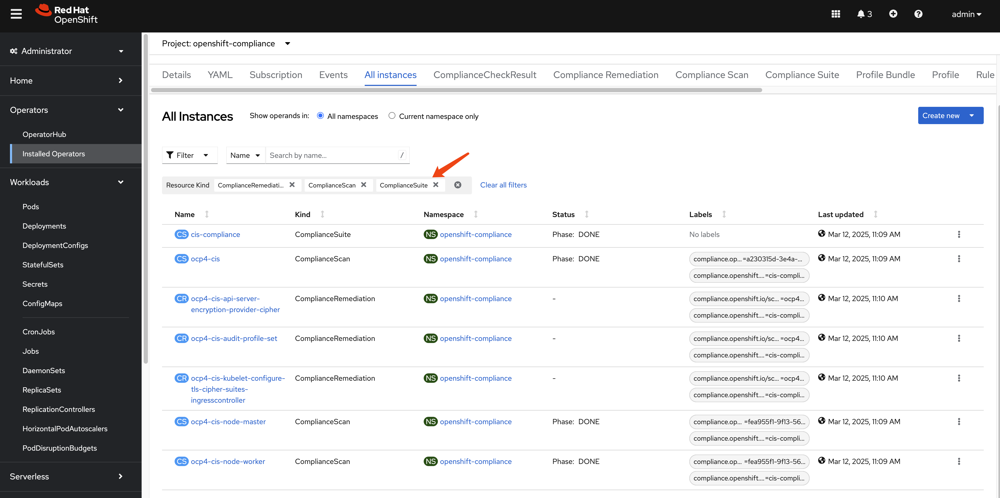

First is `ComplianceSuite`, it tells which nodes are part of the scan and what kind of profile to use, and the compliance scan result.

```yaml
apiVersion: compliance.openshift.io/v1alpha1
kind: ComplianceSuite
metadata:
  name: cis-compliance
  namespace: openshift-compliance
  ownerReferences:
    - apiVersion: compliance.openshift.io/v1alpha1
      blockOwnerDeletion: true
      controller: true
      kind: ScanSettingBinding
      name: cis-compliance
      uid: 34099038-7d08-4ed1-b981-95f8a67be73b
  finalizers:
    - suite.finalizers.compliance.openshift.io
spec:
  scans:
    - nodeSelector:
        node-role.kubernetes.io/master: ''
      timeout: 30m
      contentImage: 'registry.redhat.io/compliance/openshift-compliance-content-rhel8@sha256:b286929357b82f8ff3845f535bab23382bf06f075ff2379063e2456f1a93e809'
      strictNodeScan: true
      profile: xccdf_org.ssgproject.content_profile_cis-node
      name: ocp4-cis-node-master
      showNotApplicable: false
      rawResultStorage:
        nodeSelector:
          node-role.kubernetes.io/master: ''
        pvAccessModes:
          - ReadWriteOnce
        rotation: 3
        size: 1Gi
        tolerations:
          - effect: NoSchedule
            key: node-role.kubernetes.io/master
            operator: Exists
          - effect: NoExecute
            key: node.kubernetes.io/not-ready
            operator: Exists
            tolerationSeconds: 300
          - effect: NoExecute
            key: node.kubernetes.io/unreachable
            operator: Exists
            tolerationSeconds: 300
          - effect: NoSchedule
            key: node.kubernetes.io/memory-pressure
            operator: Exists
      scanType: Node
      content: ssg-ocp4-ds.xml
      maxRetryOnTimeout: 3
      scanTolerations:
        - operator: Exists
    - nodeSelector:
        node-role.kubernetes.io/worker: ''
      timeout: 30m
      contentImage: 'registry.redhat.io/compliance/openshift-compliance-content-rhel8@sha256:b286929357b82f8ff3845f535bab23382bf06f075ff2379063e2456f1a93e809'
      strictNodeScan: true
      profile: xccdf_org.ssgproject.content_profile_cis-node
      name: ocp4-cis-node-worker
      showNotApplicable: false
      rawResultStorage:
        nodeSelector:
          node-role.kubernetes.io/master: ''
        pvAccessModes:
          - ReadWriteOnce
        rotation: 3
        size: 1Gi
        tolerations:
          - effect: NoSchedule
            key: node-role.kubernetes.io/master
            operator: Exists
          - effect: NoExecute
            key: node.kubernetes.io/not-ready
            operator: Exists
            tolerationSeconds: 300
          - effect: NoExecute
            key: node.kubernetes.io/unreachable
            operator: Exists
            tolerationSeconds: 300
          - effect: NoSchedule
            key: node.kubernetes.io/memory-pressure
            operator: Exists
      scanType: Node
      content: ssg-ocp4-ds.xml
      maxRetryOnTimeout: 3
      scanTolerations:
        - operator: Exists
    - timeout: 30m
      contentImage: 'registry.redhat.io/compliance/openshift-compliance-content-rhel8@sha256:b286929357b82f8ff3845f535bab23382bf06f075ff2379063e2456f1a93e809'
      strictNodeScan: true
      profile: xccdf_org.ssgproject.content_profile_cis
      name: ocp4-cis
      showNotApplicable: false
      rawResultStorage:
        nodeSelector:
          node-role.kubernetes.io/master: ''
        pvAccessModes:
          - ReadWriteOnce
        rotation: 3
        size: 1Gi
        tolerations:
          - effect: NoSchedule
            key: node-role.kubernetes.io/master
            operator: Exists
          - effect: NoExecute
            key: node.kubernetes.io/not-ready
            operator: Exists
            tolerationSeconds: 300
          - effect: NoExecute
            key: node.kubernetes.io/unreachable
            operator: Exists
            tolerationSeconds: 300
          - effect: NoSchedule
            key: node.kubernetes.io/memory-pressure
            operator: Exists
      scanType: Platform
      content: ssg-ocp4-ds.xml
      maxRetryOnTimeout: 3
      scanTolerations:
        - operator: Exists
  schedule: 0 1 * * *
  suspend: false
status:
  conditions:
    - lastTransitionTime: '2025-03-12T03:10:44Z'
      message: Compliance suite run is done running the scans
      reason: NotRunning
      status: 'False'
      type: Processing
    - lastTransitionTime: '2025-03-12T03:10:44Z'
      message: Compliance suite run is done and has results
      reason: Done
      status: 'True'
      type: Ready
  phase: DONE
  result: NON-COMPLIANT
  scanStatuses:
    - conditions:
        - lastTransitionTime: '2025-03-12T03:10:44Z'
          message: Compliance scan run is done running the scans
          reason: NotRunning
          status: 'False'
          type: Processing
        - lastTransitionTime: '2025-03-12T03:10:44Z'
          message: Compliance scan run is done and has results
          reason: Done
          status: 'True'
          type: Ready
      endTimestamp: '2025-03-12T03:10:44Z'
      name: ocp4-cis-node-master
      phase: DONE
      remainingRetries: 3
      result: NON-COMPLIANT
      resultsStorage:
        name: ocp4-cis-node-master
        namespace: openshift-compliance
      startTimestamp: '2025-03-12T03:09:30Z'
    - conditions:
        - lastTransitionTime: '2025-03-12T03:10:44Z'
          message: Compliance scan run is done running the scans
          reason: NotRunning
          status: 'False'
          type: Processing
        - lastTransitionTime: '2025-03-12T03:10:44Z'
          message: Compliance scan run is done and has results
          reason: Done
          status: 'True'
          type: Ready
      endTimestamp: '2025-03-12T03:10:44Z'
      name: ocp4-cis-node-worker
      phase: DONE
      remainingRetries: 3
      result: NON-COMPLIANT
      resultsStorage:
        name: ocp4-cis-node-worker
        namespace: openshift-compliance
      startTimestamp: '2025-03-12T03:09:22Z'
    - resultsStorage:
        name: ocp4-cis
        namespace: openshift-compliance
      name: ocp4-cis
      remainingRetries: 3
      startTimestamp: '2025-03-12T03:09:22Z'
      warnings: 'could not fetch /apis/apps/v1/namespaces/openshift-sdn/daemonsets/sdn: daemonsets.apps "sdn" not found'
      conditions:
        - lastTransitionTime: '2025-03-12T03:10:44Z'
          message: Compliance scan run is done running the scans
          reason: NotRunning
          status: 'False'
          type: Processing
        - lastTransitionTime: '2025-03-12T03:10:44Z'
          message: Compliance scan run is done and has results
          reason: Done
          status: 'True'
          type: Ready
      phase: DONE
      endTimestamp: '2025-03-12T03:10:44Z'
      result: NON-COMPLIANT
```

And the `ComplianceScan`, it tells which profile runs on what kind of nodes, and the compliance scan result.

```yaml
apiVersion: compliance.openshift.io/v1alpha1
kind: ComplianceScan
metadata:
  annotations:
    compliance.openshift.io/check-count: '94'
  resourceVersion: '20397087'
  name: ocp4-cis-node-worker
  namespace: openshift-compliance
  ownerReferences:
    - apiVersion: compliance.openshift.io/v1alpha1
      blockOwnerDeletion: true
      controller: true
      kind: ComplianceSuite
      name: cis-compliance
      uid: 38e6939a-ac3f-4d9d-9c90-44dc3cb35632
  finalizers:
    - scan.finalizers.compliance.openshift.io
  labels:
    compliance.openshift.io/profile-guid: fea955f1-9f13-56fd-aacf-868b95b7283f
    compliance.openshift.io/suite: cis-compliance
spec:
  nodeSelector:
    node-role.kubernetes.io/worker: ''
  timeout: 30m
  contentImage: 'registry.redhat.io/compliance/openshift-compliance-content-rhel8@sha256:b286929357b82f8ff3845f535bab23382bf06f075ff2379063e2456f1a93e809'
  strictNodeScan: true
  profile: xccdf_org.ssgproject.content_profile_cis-node
  showNotApplicable: false
  rawResultStorage:
    nodeSelector:
      node-role.kubernetes.io/master: ''
    pvAccessModes:
      - ReadWriteOnce
    rotation: 3
    size: 1Gi
    tolerations:
      - effect: NoSchedule
        key: node-role.kubernetes.io/master
        operator: Exists
      - effect: NoExecute
        key: node.kubernetes.io/not-ready
        operator: Exists
        tolerationSeconds: 300
      - effect: NoExecute
        key: node.kubernetes.io/unreachable
        operator: Exists
        tolerationSeconds: 300
      - effect: NoSchedule
        key: node.kubernetes.io/memory-pressure
        operator: Exists
  scanType: Node
  content: ssg-ocp4-ds.xml
  maxRetryOnTimeout: 3
  scanTolerations:
    - operator: Exists
status:
  conditions:
    - lastTransitionTime: '2025-03-12T03:10:44Z'
      message: Compliance scan run is done running the scans
      reason: NotRunning
      status: 'False'
      type: Processing
    - lastTransitionTime: '2025-03-12T03:10:44Z'
      message: Compliance scan run is done and has results
      reason: Done
      status: 'True'
      type: Ready
  endTimestamp: '2025-03-12T03:10:44Z'
  phase: DONE
  remainingRetries: 3
  result: NON-COMPLIANT
  resultsStorage:
    name: ocp4-cis-node-worker
    namespace: openshift-compliance
  startTimestamp: '2025-03-12T03:09:22Z'
```

There are many `ComplianceCheckResult` after a compliance scan.

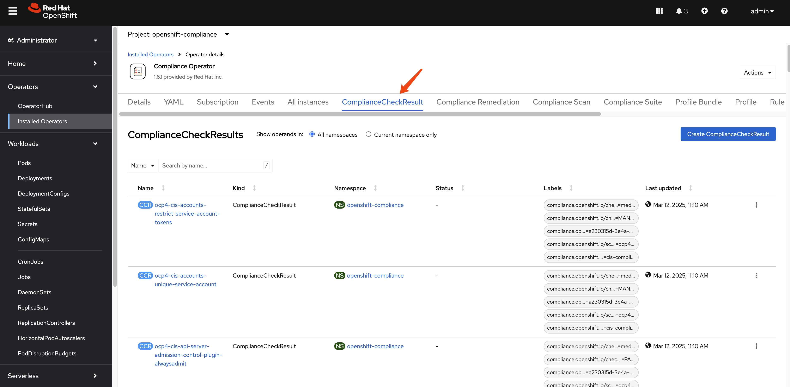

In our compliance run, there are around 279.
```bash
oc get ComplianceCheckResult -A | wc -l
# 279
```

This example `ComplianceCheckResult` object contains information about the compliance check results for a specific compliance profile item.

```yaml
instructions: |-
  To verify that the kubeadmin secret has been deleted, make sure
  that oc get secrets kubeadmin -n kube-system
  returns a NotFound error.
  Is it the case that the kubeadmin secret has not been deleted?
metadata:
  annotations:
    compliance.openshift.io/last-scanned-timestamp: '2025-03-12T03:09:22Z'
    compliance.openshift.io/rule: kubeadmin-removed
  resourceVersion: '20396818'
  name: ocp4-cis-kubeadmin-removed
  namespace: openshift-compliance
  ownerReferences:
    - apiVersion: compliance.openshift.io/v1alpha1
      blockOwnerDeletion: true
      controller: true
      kind: ComplianceScan
      name: ocp4-cis
      uid: fd80670b-0782-4c11-ab04-42bd72a7dc54
  labels:
    compliance.openshift.io/check-severity: medium
    compliance.openshift.io/check-status: FAIL
    compliance.openshift.io/profile-guid: a230315d-3e4a-5b58-b00f-f96f1553e036
    compliance.openshift.io/scan-name: ocp4-cis
    compliance.openshift.io/suite: cis-compliance
status: FAIL
kind: ComplianceCheckResult
rationale: |-
  The kubeadmin user has an auto-generated password and a self-signed certificate, and has effectively

  cluster-admin

  permissions; therefore, it's considered a security liability.
id: xccdf_org.ssgproject.content_rule_kubeadmin_removed
description: |-
  Ensure that the kubeadmin secret has been removed
  The kubeadmin user is meant to be a temporary user used for bootstrapping purposes. It is preferable to assign system administrators whose users are backed by an Identity Provider.

  Make sure to remove the user as described in the documentation ( https://docs.openshift.com/container-platform/latest/authentication/remove-kubeadmin.html )
severity: medium
apiVersion: compliance.openshift.io/v1alpha1
```

The `ComplianceRemediation` resource is used to define the remediation actions that should be taken when a compliance check fails.

```yaml
apiVersion: compliance.openshift.io/v1alpha1
kind: ComplianceRemediation
metadata:
  annotations:
    compliance.openshift.io/xccdf-value-used: var-openshift-audit-profile
  resourceVersion: '20396576'
  name: ocp4-cis-audit-profile-set
  namespace: openshift-compliance
  ownerReferences:
    - apiVersion: compliance.openshift.io/v1alpha1
      blockOwnerDeletion: true
      controller: true
      kind: ComplianceCheckResult
      name: ocp4-cis-audit-profile-set
      uid: 59e647ba-8612-46b2-8864-42b3dd9c9fcc
  labels:
    compliance.openshift.io/scan-name: ocp4-cis
    compliance.openshift.io/suite: cis-compliance
spec:
  apply: false
  current:
    object:
      apiVersion: config.openshift.io/v1
      kind: APIServer
      metadata:
        name: cluster
      spec:
        audit:
          profile: WriteRequestBodies
  outdated: {}
  type: Configuration
status:
  applicationState: NotApplied
```

There are 3 compliance remediations generated.

```bash
oc get ComplianceRemediation -A
# NAMESPACE              NAME                                                             STATE
# openshift-compliance   ocp4-cis-api-server-encryption-provider-cipher                   NotApplied
# openshift-compliance   ocp4-cis-audit-profile-set                                       NotApplied
# openshift-compliance   ocp4-cis-kubelet-configure-tls-cipher-suites-ingresscontroller   NotApplied
```

# Generating Human-Readable Reports

While you can examine compliance results using the Kubernetes API and custom resources, it's often more convenient to generate human-readable HTML reports for analysis and documentation purposes.

## Extracting and Converting Scan Results

First, let's check the PVC name that contains the report raw data.

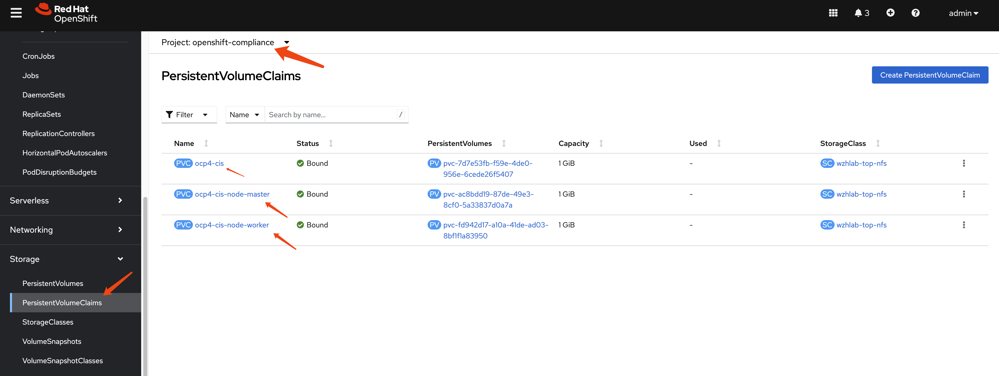

Next, we define a pod to extract data from the PV. We run this pod in privileged mode to grant it access to the PV due to backend storage limitations. If your storage solution permits, remove the privileged mode.

```yaml
apiVersion: "v1"
kind: Pod
metadata:
  name: pv-extract
spec:
  # securityContext:
  #   runAsNonRoot: true
  #   seccompProfile:
  #     type: RuntimeDefault
  containers:
    - name: pv-extract-pod
      image: registry.access.redhat.com/ubi9/ubi
      command: ["sleep", "3000"]
      volumeMounts:
      - mountPath: "/workers-scan-results"
        name: workers-scan-vol
      securityContext:
        privileged: true
        # allowPrivilegeEscalation: true
        # allowPrivilegeEscalation: false
        # capabilities:
        #  drop: [ALL]
  volumes:
    - name: workers-scan-vol
      persistentVolumeClaim:
        claimName: ocp4-cis-node-master
```

You can create the pod easily using the webUI as follows:

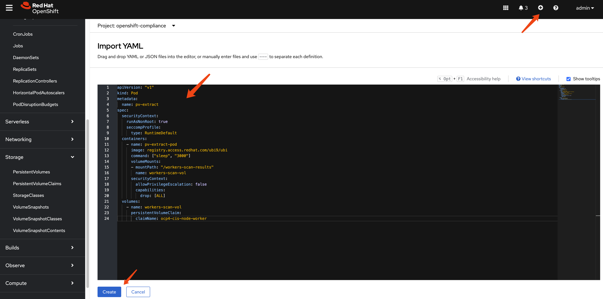

On bastation machine, you can copy the files from the pod using the following command:

```bash
oc cp pv-extract:/workers-scan-results -n openshift-compliance .
```

On a rhel machine, copy the report raw data from bastation to local rhel machine, then you can use the following command to convert the bzip2 file into report html.

```bash
# get command oscap
dnf install -y openscap-scan


# in the directory where you have the report.xml.bz2 file
cat << 'EOF' > report.sh
#!/bin/bash

# Ensure that openscap is installed
if ! command -v oscap &> /dev/null; then
  echo "Please install openscap first."
  exit 1
fi

# Loop through all .xml.bzip2 files in the current directory
find . -maxdepth 1 -name "*.xml.bzip2" -print0 | while IFS= read -r -d $'\0' file; do
  # Get the filename (without extension)
  filename=$(basename "$file" .xml.bzip2)

  # Generate a unique output filename
  output_file="report_${filename}_$(date +%s).html"

  # Execute the oscap command to generate the report
  oscap xccdf generate report --output "$output_file" "$file"

  # Check if the command was executed successfully
  if [ $? -eq 0 ]; then
    echo "Generated report for $file: $output_file"
  else
    echo "Error generating report for $file."
  fi
done

echo "Processing complete."
EOF

bash report.sh
# Generated report for ./openscap-pod-19994a9a1de267c235b347b8a6e1502b13ad99c0.xml.bzip2: report_openscap-pod-19994a9a1de267c235b347b8a6e1502b13ad99c0_1741357399.html
# Generated report for ./openscap-pod-fd1520f0f9f45782bb20d55a348df304b6449965.xml.bzip2: report_openscap-pod-fd1520f0f9f45782bb20d55a348df304b6449965_1741357400.html
# Generated report for ./openscap-pod-e25e31adc70c84fd0f2bc355e5d0221b8c655a58.xml.bzip2: report_openscap-pod-e25e31adc70c84fd0f2bc355e5d0221b8c655a58_1741357401.html
# Generated report for ./openscap-pod-3baa2cb68109d2d1f3b6c3421be4b7e20c344692.xml.bzip2: report_openscap-pod-3baa2cb68109d2d1f3b6c3421be4b7e20c344692_1741357401.html
# Processing complete.

```

Here are some sample report attached in this repo, you can check it out by download the html files and open them locally.
- [ocp4-csi-api](./files/report_ocp4-cis-api-checks-pod_1741795228.html)
- [ocp4-csi-node-master](./files/report_ocp4-cis-node-master-master-01-demo-pod_1741795229.html)
- [ocp4-csi-node-worker](./files/report_ocp4-cis-node-worker-master-01-demo-pod_1741794472.html)


# Remediating Compliance Issues (AIGC)

After running a compliance scan and reviewing the results, you'll likely need to address any non-compliant items. The Compliance Operator provides mechanisms to help remediate these issues.

## Understanding Remediations

For each failed check, the Compliance Operator may generate a `ComplianceRemediation` resource that contains the necessary configuration to fix the issue. These remediations can be applied manually or automatically.

### Manual Remediation

When using the `default` ScanSetting, remediations are not applied automatically. You can review and apply them manually:

1. List available remediations:
   ```bash
   oc get ComplianceRemediation -n openshift-compliance
   ```

2. Review a specific remediation:
   ```bash
   oc get ComplianceRemediation <remediation-name> -n openshift-compliance -o yaml
   ```

3. Apply a remediation by setting `spec.apply` to `true`:
   ```bash
   oc patch ComplianceRemediation <remediation-name> \
       --type merge \
       -p '{"spec":{"apply":true}}' \
       -n openshift-compliance
   ```

### Automatic Remediation

If you want remediations to be applied automatically, use the `default-auto-apply` ScanSetting when creating your ScanSettingBinding:

```yaml
apiVersion: compliance.openshift.io/v1alpha1
kind: ScanSettingBinding
metadata:
  name: auto-apply-compliance
  namespace: openshift-compliance
profiles:
  - name: ocp4-cis
    kind: Profile
    apiGroup: compliance.openshift.io/v1alpha1
settingsRef:
  name: default-auto-apply
  kind: ScanSetting
  apiGroup: compliance.openshift.io/v1alpha1
```

## Best Practices for Compliance Management

1. **Start with a baseline scan**: Begin with a standard profile like `ocp4-cis` to establish a baseline compliance status.

2. **Create TailoredProfiles for customization**: If the standard profiles don't meet your exact needs, create TailoredProfiles to customize which rules are included and how variables are set.

3. **Schedule regular scans**: Use the `schedule` field in ScanSettings to run scans on a regular basis (e.g., daily or weekly).

4. **Implement a remediation strategy**: Decide whether to use automatic or manual remediation based on your organization's change management policies.

5. **Document exceptions**: For rules that cannot be remediated due to business requirements, document the exceptions and the compensating controls.

6. **Generate and archive reports**: Regularly generate HTML reports and archive them for audit purposes.

7. **Monitor for drift**: After achieving compliance, continue scanning to detect any drift from the compliant state.

8. **Test remediations in non-production first**: Before applying remediations in production, test them in a non-production environment to ensure they don't cause unintended consequences.

# Conclusion (AIGC)

The Compliance Operator is a powerful tool for ensuring your OpenShift cluster meets security standards and compliance requirements. By understanding its components and workflow, you can effectively scan, report on, and remediate compliance issues in your environment.

<!-- For more detailed information, refer to the [official OpenShift documentation on the Compliance Operator](https://docs.openshift.com/container-platform/latest/security/compliance_operator/compliance-operator-understanding.html). -->

# end
